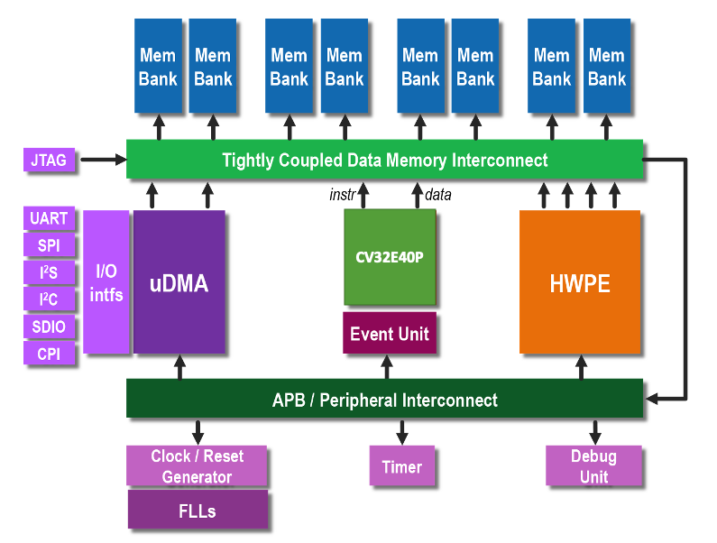

# Core-v-mcu 

This repo contains instructions to implement the CV32E40P processor within the PULPissimo platform
architecture. The initial implementation target is an FPGA; current supported boards are the Digilent 
Genesys2 FPGA board and Digilent NexysA7-100T. Future implementations will target ASIC technologies.

Instructions to install the Core-v-mcu environment, instantiate the CV32E40P processor, and
build the FPGA platform are [here](https://github.com/hpollittsmith/core-v-mcu/tree/master/fpga).

The original PULPissimo project (with RI5CY core)  is [here](https://github.com/pulp-platform/pulpissimo).
As the Core-v-mcu and PULPissimo platforms share many IP blocks in common, you may wish to refer to
this repo for additional information.

## PULPissimo core-v-mcu

PULPissimo is a single-core microcontroller architecture of the more recent PULP chips,
part of the ongoing "PULP platform" collaboration between ETH Zurich and the
University of Bologna - started in 2013. The core-v-mcu represents a fork of PULPissimo that
instantiates the CV32E40P processor in place of the original RI5CY. The IP surrounding the
CV32E40P is largely unchanged with minor adjustments to accommodate changes to CV32E40P versus
RI5CY.
 
The PULPissimo core-v-mcu architecture includes:

- The CV32E40P RISC-V IP
- Autonomous Input/Output subsystem (uDMA)
- New memory subsystem
- Support for Hardware Processing Engines (HWPEs)
- New simple interrupt controller
- New peripherals
- New SDK (currently not verified with CV32E40P)

CV32E40P is a small and efficient 32-bit, in-order RISC-V core with a 4-stage
pipeline that implements the RV32IMC instruction set architecture. CV32E40P is maintained by OpenHW Group in this [repository](https://github.com/openhwgroup/cv32e40p).
The CV32E40P user manual can be found [here](https://core-v-docs-verif-strat.readthedocs.io/projects/cv32e40p_um/en/latest/index.html).
 
PULPissimo core-v-mcu includes an efficient I/O subsystem via a uDMA (micro-DMA) which
communicates with the peripherals autonomously. The core just needs to program
the uDMA and wait for it to handle the transfer.
Further information about the core can be found at
http://ieeexplore.ieee.org/document/8106971/
and in the documentation of the IP.

PULPissimo core-v-mcu supports I/O on interfaces such as:

- SPI (as master)
- I2S
- Camera Interface (CPI)
- I2C
- UART
- JTAG

## Getting Started

Instructions to setup the core-v-mcu environment and build the FPGA platform are [here](https://github.com/openhwgroup/core-v-mcu/tree/master/fpga).

## Contributing

We highly appreciate community contributions. We are currently using the lowRISC contribution guide. To ease our work of reviewing your contributions, please:

Create your own fork to commit your changes and then open a Pull Request.

Split large contributions into smaller commits addressing individual changes or bug fixes. Do not mix unrelated changes into the same commit!

Write meaningful commit messages. For more information, please check out [the Ibex contribution guide](https://github.com/lowrisc/ibex/blob/master/CONTRIBUTING.md).
If asked to modify your changes, do fixup your commits and rebase your branch to maintain a clean history.
When contributing SystemVerilog source code, please try to be consistent and adhere to [the lowRISC Verilog coding style guide](https://github.com/lowRISC/style-guides/blob/master/VerilogCodingStyle.md).

## Issues and Troubleshooting

If you find any problems or issues with CV32E40P or the documentation, please check out the issue tracker and create a new issue if your problem is not yet tracked. You may also wish to consult the PULPissimo project [issues](https://github.com/pulp-platform/pulpissimo/issues) in case your problem has been detected (and solved) in the original platform.

