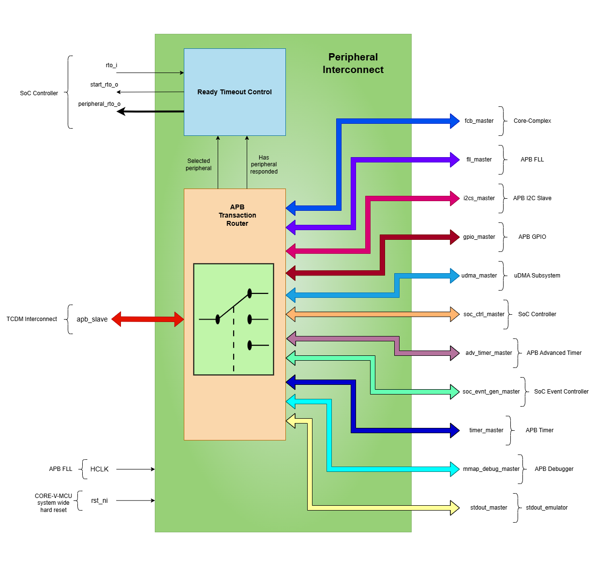
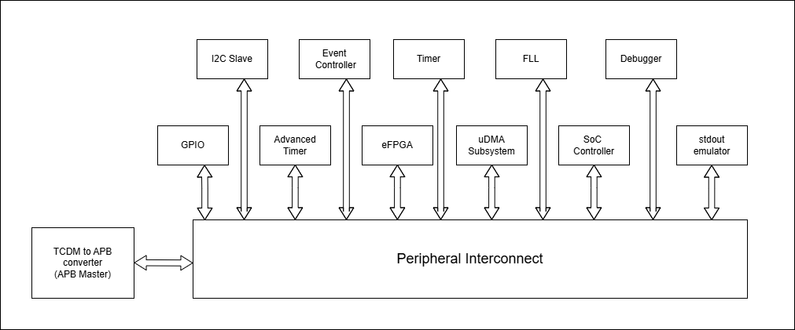
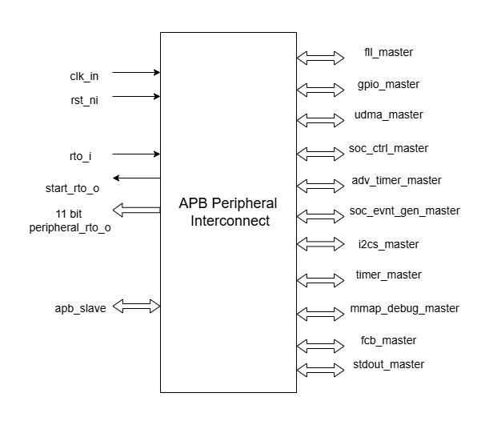

..
   Copyright (c) 2023 OpenHW Group
   Copyright (c) 2024 CircuitSutra

   SPDX-License-Identifier: Apache-2.0 WITH SHL-2.1

.. Level 1
   =======

   Level 2
   -------

   Level 3
   ~~~~~~~

   Level 4
   ^^^^^^^
.. _apb_peripheral_interconnect:

APB Peripheral Interconnect
===========================

The APB Peripheral Interconnect(Peripheral Bus Wrapper) functions as a central interface hub that enables communication between multiple peripheral devices and the Core Complex of CORE-V-MCU.
This IP is essenitally an APB bus wrapper which works based on APB protocol and efficiently routes APB transactions from TCDM bus to various peripheral controllers based on address mapping, facilitating organized and structured communication within the CORE-V-MCU.

Features
--------
  - Multiple Peripheral Support: Interfaces with 11 distinct peripheral devices
  - Address-Based Routing: Routes transactions based on predefined address ranges
  - Request Timeout detection: Includes request timeout detection and peripheral-specific timeout reporting
  - Request Timeout error reporting: Provides peripheral-specific request timeout reporting via dedicated signals
  - Address and Data bus: 12-bit address bus and 32-bit data bus, fully compliant with APB protocol

Block Architecture
------------------

The figure below is a high-level block diagram of the APB Peripheral Interconnect module:-

   APB Peripheral Interconnect Block Diagram

APB Transaction Routing
^^^^^^^^^^^^^^^^^^^^^^^
The APB Peripheral Interconnect operates as a bridge between the system bus(TCDM bus) and multiple peripheral devices, allowing for efficient communication and data transfer.
The APB transaction routing flow can be summarized as follows:

    - Firmware performs read/write operations to specific memory-mapped addresses, Core Complex initiates APB transactions to the APB Peripheral Interconnect.
    - APB Peripheral Interconnect routes these transactions to the appropriate peripheral based on address ranges.
    - Peripherals respond through the wrapper back to the requesting master.
    - If a peripheral fails to respond, the integrated timeout detection mechanism activates and reports which peripheral has timed out.

Timeout Mechanism
^^^^^^^^^^^^^^^^^
The APB Peripheral Interconnect includes a timeout detection mechanism to handle situations where a peripheral fails to respond within a specified time frame.
Below is a description of the timeout handling process:

    - The start_rto_o signal is activated when a peripheral is selected based on the address specified in the APB transaction, triggering timeout counter in SoC Controller.
    - If a peripheral doesn't respond within the timeout period i.e. before the rto_i input is asserted by SoC Controller, a timeout error occurs.
    - When a timeout occurs, the peripheral_rto_o signals indicate which specific peripheral failed to respond, which then can be read through the SoC Controller.

System Architecture
-------------------

The figure below depicts the connections between the CORE-V-MCU and rest of the modules in CORE-V-MCU:-

   APB Peripheral Interconnect CORE-V-MCU connections diagram

The APB Peripheral Interconnect provides routing to the following modules:
                               
  - APB FLL                                      
  - APB GPIO                                     
  - uDMA Subsystem                               
  - APB SoC Controller                           
  - APB Advanced Timer                           
  - APB Event Controller                         
  - APB I2C Slave                                
  - APB Timer                                    
  - eFPGA subsystem                             
  - APB Debugger 
  - stdout emulator                                 

Refer to the Memory map for the complete address mapping of the peripherals(https://docs.openhwgroup.org/projects/core-v-mcu/doc-src/mmap.html).

Firmware Guidelines
-------------------
Since the APB Peripheral Interconnect is a memory-mapped peripheral, the firmware cannot access it directly.
Although standard memory read/write operations to the APB peripheral devices will be routed through the Peripheral Interconnect.

The following general guidelines should be followed while interacting Peripheral devices through the APB Peripheral Interconnect:

  - Access peripheral registers using memory-mapped operations with the correct address calculated as (peripheral_base_address + register_offset).
  - Ensure that the firmware handles timeout conditions gracefully(Check SoC Controller specs for more details - https://docs.openhwgroup.org/projects/core-v-mcu/doc-src/ip-blocks/apb_soc_ctrl.html).
  - Implement error handling for cases where a peripheral does not respond within the expected time frame.

Pin Description
---------------

   APB Peripheral Interconnect pin diagram

Clock and Reset Signals
^^^^^^^^^^^^^^^^^^^^^^^
    - clk_i: Input clock signal
    - rst_ni: Active-low reset signal

Ready Timeout Signals
^^^^^^^^^^^^^^^^^^^^^
    - rto_i: Input signal indicating a timeout condition from the SoC Controller
    - start_rto_o: Output signal indicating the start of a timeout condition
    - peripheral_rto_o [11:0]: Output signals indicating which peripheral has timed out

APB Slave Interface
^^^^^^^^^^^^^^^^^^^
    - apb_slave: APB slave interface, connected with TCDM bus

APB Master Interfaces
^^^^^^^^^^^^^^^^^^^^^
    - fll_master: APB master interface for FLL
    - gpio_master: APB master interface for GPIO
    - udma_master: APB master interface for uDMA
    - soc_ctrl_master: APB master interface for SoC Controller
    - adv_timer_master: APB master interface for Advanced Timer
    - soc_evnt_gen_master: APB master interface for Event Generator
    - mmap_debug_master: APB master interface for Debugging
    - timer_master: APB master interface for Timer
    - fcb_master: APB master interface for eFPGA subsystem
    - stdout_master: APB master interface for Stdout, Not connected
    - i2cs_master: APB master interface for I2C Slave

Note: Each of the above master or slave interfaces has its own set of signals, including address, data, control, and ready signals, which are detailed below.

APB Interface Signals
^^^^^^^^^^^^^^^^^^^^^
  - PADDR[11:0]: APB address bus input
  - PWDATA[31:0]: APB write data bus input
  - PWRITE: APB write enable signal
  - PSEL: APB slave select input
  - PENABLE: APB enable signal
  - PRDATA[31:0]: APB read data bus output
  - PREADY: APB ready signal output, indicates completion of APB transaction
  - PSLVERR: APB slave error output