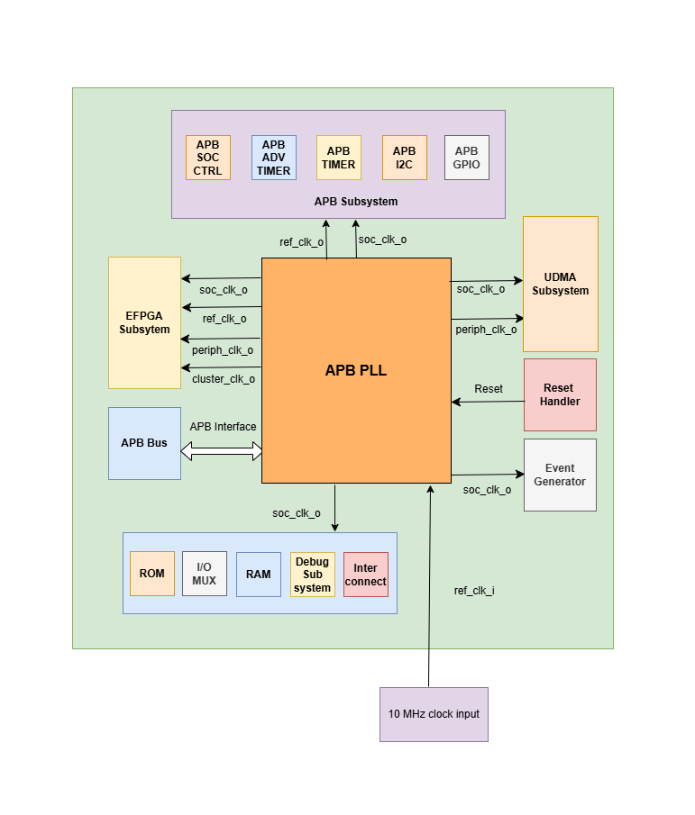

..
   Copyright (c) 2023 OpenHW Group

   SPDX-License-Identifier: Apache-2.0 WITH SHL-2.1

.. Level 1
   =======

   Level 2
   -------

   Level 3
   ~~~~~~~

   Level 4
   ^^^^^^^

.. _clock_domains:

Clock Domains
=============
The Core-v-mcu  has three major clock domains that are all derived from the input reference clock.

- SoC clock is used to drives the CV32E40P cpu and memory subsystem.
- Periph clock is used for the UDMA peripherals to generate the various clocks required for the peripherals
- FPGA clock is used as the primary clock to the eFPGA.

Clock Architecture
~~~~~~~~~~~~~~~~~~
Clock Architecture provides the details on how the apb_pll uses ref_clk_i to generate multiple clocks which are used by various subsystems.

   
- The input reference clock(i.e ref_clk_i) is assumed to be 10 MHz. 
- There are 3 major subsystems in CORE_V_MCU and each of these uses a different set of clocks for its working. 
- APB subsystem uses soc_clk_o and ref_clk_o clocks generated by the APB_PLL.
- EFPGA subsystem uses soc_clk_o, periph_clk_o, cluster_clk_o and ref_clk_o clocks generated by the APB_PLL.
- UDMA subsystem uses soc_clk_o and periph_clk_o clocks generated by the APB_PLL.

The working of APB_PLL is explained in specification with all the IPs of APB subsystem.

