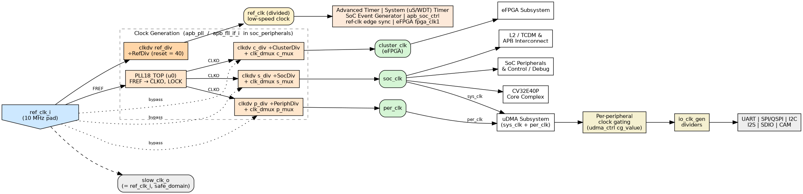

..
   Copyright (c) 2026 Eclipse Foundation AISBL

   SPDX-License-Identifier: Apache-2.0 WITH SHL-2.1

.. Level 1
   =======

   Level 2
   -------

   Level 3
   ~~~~~~~

   Level 4
   ^^^^^^^

.. _clocking_architecture:

Clocking Architecture
=====================
This chapter describes the CORE-V-MCU clock tree, tracing every clock from the
primary reference-clock input through the on-chip clock-generation block to the
major subsystems and peripherals.  It then captures the PLL requirements for the
FPGA and ASIC implementations separately, and notes the behaviour of the clock
generation block in simulation.

Overview
--------
The CORE-V-MCU is driven by a single primary reference clock, ``ref_clk_i``,
which is assumed to be **10 MHz**.  From this reference the on-chip clock
generation block — a single ``apb_pll`` instance wrapping the ``PLL18_TOP`` PLL
macro — synthesizes one high-speed clock and derives the following clock domains
from it with independent programmable post-dividers:

- **SoC clock** (``soc_clk``) drives the CV32E40P core complex, the L2/TCDM and
  APB interconnects, the SoC peripherals and control logic, the debug subsystem,
  and the system-clock side of the uDMA subsystem.
- **Peripheral clock** (``per_clk``) is the source clock for the uDMA subsystem,
  from which the individual peripheral clocks (UART, SPI/QSPI, I2C, I2S, SDIO,
  CAM) are derived.
- **Cluster / eFPGA clock** (``cluster_clk``) is supplied to the eFPGA subsystem.

Because all three domains are derived from the same PLL output (``CLKO``) by
separate post-dividers, their frequencies are programmable but harmonically
related to a common synthesized clock; they are *not* produced by independent
PLLs.

In addition, the reference clock is divided down by a dedicated divider to
produce a low-speed reference clock that is routed to the timer and event
resources, so that timekeeping is independent of the high-speed synthesized
domains.  Separately, the device's ``slow_clk_o`` output is driven directly from
``ref_clk_i`` (the undivided reference) in ``safe_domain``.

:ref:`Clock Tree Diagram` shows the complete clock tree from the primary
input to the major subsystems and peripherals.

   CORE-V-MCU Clock Tree

Reference Clock Input
---------------------
The primary reference clock enters the device on the ``ref_clk_i`` pad and is
passed into the SoC domain (``soc_domain``) and on into the SoC peripherals
block (``soc_peripherals``), where it drives the clock generation block
``apb_pll`` (instance ``apb_fll_if_i``).  The same reference clock is the
``FREF`` input to the PLL macro and the input to all of the clock dividers.

The reference clock is expected to be a clean 10 MHz source.  All higher
frequencies used inside the device are synthesized from this input by the PLL;
no other external clock is required for normal operation.

Clock Generation Block
----------------------
The live clock generation block is a single ``apb_pll`` instance,
``apb_fll_if_i``, instantiated in ``soc_peripherals``
(``rtl/apb_fll_if/apb_pll.sv``).  It contains:

- one PLL macro, ``PLL18_TOP`` (instance ``u0``), whose ``FREF`` input is
  ``ref_clk_i`` and whose ``CLKO`` output is the single high-speed synthesized
  clock.  ``PLL18_TOP`` also drives the ``LOCK`` status used by firmware;
- four programmable clock dividers (``clkdv``) and three bypass multiplexers
  (``clk_dmux``) that derive the output clocks from ``CLKO`` (or, when bypassed,
  directly from ``ref_clk_i``):

  - ``s_div`` / ``s_mux``  → ``soc_clk_o``    (= ``CLKO`` ÷ ``SocDiv``);
  - ``p_div`` / ``p_mux``  → ``periph_clk_o`` (= ``CLKO`` ÷ ``PeriphDiv``);
  - ``c_div`` / ``c_mux``  → ``cluster_clk_o``(= ``CLKO`` ÷ ``ClusterDiv``);
  - ``ref_div``            → ``ref_clk_o``    (= ``ref_clk_i`` ÷ ``RefDiv``);

- the APB-accessible configuration register file used to program the PLL macro
  and the dividers (see :ref:`pll_configuration`).

Because the three high-speed outputs share the single ``CLKO`` and differ only
in their post-divider value, the SoC, peripheral and cluster/eFPGA domains are
programmable but harmonically related; there is one PLL, not one per domain.

.. note::

   An alternative clock-generation hierarchy
   (``soc_clk_rst_gen`` → ``clk_gen`` → ``clk_and_control`` wrapping the
   ``pPLL02F`` macro, with separate ``i_fll_soc`` / ``i_fll_per`` PLLs) is
   present in the source tree but is **not instantiated** in the current
   ``claude`` branch.  The description above reflects the RTL that is actually
   elaborated.

Reset
~~~~~
The current design does not use a dedicated clock-domain reset synchronizer in
the clock generation block.  In ``soc_domain`` the SoC reset is formed
combinationally as

``s_soc_rstn = !(!rstn_glob_i | s_wd_expired | s_periph_rst)``

i.e. the global reset ``rstn_glob_i`` gated by a watchdog-timeout
(``s_wd_expired``) and by the debug module's non-debug reset
(``s_periph_rst``, from ``ndmreset_o``).  Within ``apb_pll`` the PLL macro has
its own reset, ``pll_reset_in = ~(PLL_RESET | ~HRESETn)``, combining the
software ``PLL_RESET`` control bit with the APB reset.

Clock Domains and Distribution
------------------------------
SoC clock domain
~~~~~~~~~~~~~~~~~
``soc_clk`` is the main system clock.  It is distributed to:

- the **CV32E40P core complex** (instruction fetch, execute, load/store);
- the **L2 / TCDM interconnect** and the **APB peripheral interconnect**;
- the **SoC peripherals and control** block, including the SoC control
  registers and the debug subsystem;
- the **system-clock side of the uDMA subsystem** (``sys_clk_i``), which clocks
  the uDMA core, its APB configuration interface, and the L2 data movement
  logic.

Peripheral clock domain
~~~~~~~~~~~~~~~~~~~~~~~~~
``per_clk`` (the ``periph_clk_o`` output of ``apb_pll``, carried as
``s_periph_clk``) is supplied to the uDMA subsystem as ``periph_clk_i``.  Inside
the uDMA it becomes the source from which each peripheral's interface clock is
derived (see :ref:`peripheral_clocking`).  Because ``per_clk`` has its own
post-divider (``PeriphDiv``), the peripheral interfaces can be clocked at a rate
appropriate to the attached devices, subject to the relationship to ``CLKO``
described above.

Cluster / eFPGA clock domain
~~~~~~~~~~~~~~~~~~~~~~~~~~~~~~
``cluster_clk`` (the ``cluster_clk_o`` output of ``apb_pll``, carried as
``s_fpga_clk``) is supplied to the eFPGA subsystem as ``fpga_clk0_i``.  It is
derived from ``CLKO`` by the ``ClusterDiv`` post-divider.  The eFPGA subsystem
also receives ``per_clk`` (on ``fpga_clk2_i``) and the divided reference clock
(on ``fpga_clk1_i``).

.. _peripheral_clocking:

Peripheral Clocking
-------------------
uDMA peripheral clocks
~~~~~~~~~~~~~~~~~~~~~~~
Within the uDMA core (``udma_core``), peripheral clocking is performed in two
stages:

1. **Clock gating.**  The uDMA control block (``udma_ctrl``) maintains a
   per-peripheral clock-enable vector (``cg_value``) that is programmed through
   the uDMA APB configuration interface.  For each peripheral *i* the uDMA
   produces two gated clocks:

   - ``periph_sys_clk_o[i]`` — the SoC clock (``sys_clk``) gated by
     ``cg_value[i]``;
   - ``periph_per_clk_o[i]`` — the peripheral clock (``per_clk``) gated by
     ``cg_value[i]``.

   Gating an unused peripheral's clocks reduces dynamic power.  A top-level
   enable (``cg_core``) is asserted whenever any peripheral is enabled.

2. **Clock division.**  Inside each peripheral, the gated peripheral clock is
   further divided by an ``io_clk_gen`` programmable divider to produce the
   line-rate clock for the interface (for example the UART baud clock or the
   SPI/QSPI SCK).  The divide ratio is taken from that peripheral's own
   configuration registers, so each interface — UART, SPI/QSPI, I2C, I2S, SDIO
   and CAM — can be clocked at its required frequency.

Divided reference (low-speed) clock
~~~~~~~~~~~~~~~~~~~~~~~~~~~~~~~~~~~~~
The ``ref_div`` divider produces ``ref_clk_o`` = ``ref_clk_i`` ÷ ``RefDiv``
(``RefDiv`` resets to 40, giving 250 kHz from a 10 MHz reference).  This
low-speed clock, carried as ``s_ref_clk`` in ``soc_peripherals``, is distributed
to the timing and event resources that must run independently of the high-speed
synthesized domains:

- the **Advanced Timer** (``apb_adv_timer``, on ``low_speed_clk_i``);
- the **system timer** (``apb_timer_unit`` — the microsecond / watchdog / MTIME
  timer, on ``ref_clk_i``).  This block re-synchronizes the low-speed clock into
  the ``soc_clk`` domain with a small flip-flop chain and counts its edges; it
  does not divide it further;
- the **SoC event generator** (``soc_event_generator``, on ``low_speed_clk_i``),
  which produces the ``timer_event_lo``/``timer_event_hi`` events;
- the **SoC control** block (``apb_soc_ctrl``, on ``ref_clk_i``);
- a reference-clock **edge synchronizer** (``pulp_sync_wedge``,
  ``i_ref_clk_sync``) that generates rising/falling ``ref_clk`` events in the
  ``soc_clk`` domain;
- the **eFPGA subsystem** (on ``fpga_clk1_i``).

Keeping these resources on the divided reference clock keeps timekeeping stable
and independent of changes to the PLL or to the SoC/peripheral post-dividers.

.. _pll_configuration:

PLL Configuration
-----------------
The PLL and the clock dividers are programmed through the ``apb_pll`` register
file over the block's APB port (clocked by ``soc_clk``).  The registers are at
the following byte offsets:

.. list-table:: ``apb_pll`` clock-generation registers
   :name: pll_config_registers
   :widths: 10 14 16 60
   :header-rows: 1

   * - Offset
     - Name
     - Field(s)
     - Description
   * - 0x00
     - ``ControlReg``
     - ``PDDP`` [25], ``PD`` [24], ``MODE`` [17:16], ``DM`` [13:8],
       ``PLL_RESET`` [1], ``BYPASS`` [0]
     - PLL control: post-divider power-down, PLL power-down, mode select
       (00 = integer, 01 = fractional, 10 = spread-spectrum), reference input
       divider ``DM``, software PLL reset, and global bypass.  Reads return the
       live ``LOCK`` status in bit 31.  Reset value ``0x03000103`` (powered
       down, in reset and bypassed).
   * - 0x04
     - ``DivisorReg``
     - ``DN`` [26:16], ``DP`` [2:0]
     - Feedback divider ``DN`` and output divider ``DP`` of the PLL macro.
       Reset value ``0x00A00004`` (``DN`` = 160, ``DP`` = 4 → ~400 MHz from a
       10 MHz reference).
   * - 0x08
     - ``FracReg``
     - ``FRAC`` [23:0]
     - Fractional portion of the feedback divider (used in fractional mode).
   * - 0x0C
     - ``Spread1Reg``
     - ``SSRATE`` [10:0]
     - Spread-spectrum modulation rate.
   * - 0x10
     - ``Spread2Reg``
     - ``SSLOPE`` [23:0]
     - Spread-spectrum modulation slope.  Reads return the live ``LOCK`` status
       in bit 31 (firmware polls this bit for lock detection).
   * - 0x14
     - ``SocDiv``
     - ``SocDiv`` [9:0]
     - ``soc_clk`` post-divider (``clkdv s_div``).
   * - 0x18
     - ``PeriphDiv``
     - ``PeriphDiv`` [9:0]
     - ``per_clk`` post-divider (``clkdv p_div``).
   * - 0x1C
     - ``ClusterDiv``
     - ``ClusterDiv`` [9:0]
     - ``cluster_clk`` post-divider (``clkdv c_div``).
   * - 0x20
     - ``RefDiv``
     - ``RefDiv`` [9:0]
     - Reference-clock divider (``clkdv ref_div``).  Reset value 40.

The ``clkdv`` dividers pass the input clock through unchanged when their divide
value is 0 or 1, divide by two for a value of 2, and otherwise generate a
roughly 50 % duty-cycle clock at the programmed ratio.

At reset ``ControlReg`` selects bypass with the PLL powered down and held in
reset, so every synthesized domain initially runs directly from ``ref_clk_i``.
To bring the PLL up, firmware programs ``DivisorReg`` (and ``FracReg``/spread
registers as needed) and the per-domain post-dividers, releases ``PLL_RESET``,
clears ``BYPASS``, and waits for ``LOCK`` (bit 31 of ``ControlReg`` /
``Spread2Reg``) before relying on the synthesized clocks.

FPGA Implementation Requirements
--------------------------------
For FPGA targets (for example the Digilent Nexys A7), the ``PLL18_TOP`` hard-macro
PLL is not available and must be replaced by an FPGA clock-management primitive.
A ``xilinx_pll`` wrapper (``rtl/generic_FLL/fe/fpga/xilinx_pll.sv``) exists as the
intended integration point for a Xilinx MMCM/PLL, but it is currently an empty
stub and is **not** instantiated in the elaborated design.

FPGA implementations must therefore:

- provide a board reference clock and feed it to ``ref_clk_i`` (the on-board
  oscillator frequency may differ from the nominal 10 MHz and must be accounted
  for in the MMCM/PLL multiply/divide settings);
- replace the ``PLL18_TOP`` macro in ``apb_pll`` with an MMCM/PLL instance,
  configuring its multiply and divide factors so that the synthesized
  ``soc_clk`` does not exceed the timing closure achieved for the core complex
  and interconnect on the target device;
- expose a lock indication equivalent to the macro's ``LOCK`` so that downstream
  reset release is qualified by clock stability.

A project targeting silicon-class FPGA frequencies must populate ``xilinx_pll``
(or an equivalent macro replacement) with an MMCM/PLL instance parameterized for
the chosen board and target frequency, and wire it in place of ``PLL18_TOP``.

ASIC Implementation Requirements
--------------------------------
For ASIC targets the clock source is the ``PLL18_TOP`` macro instantiated inside
``apb_pll``.  It converts the reference clock into the single high-speed clock
``CLKO`` under the control of the configuration registers described in
:ref:`pll_configuration`.  The implementation requirements are:

- a stable reference clock at the nominal 10 MHz on ``ref_clk_i``;
- programming of the reference input divider (``DM``), the feedback divider
  (``DN`` plus ``FRAC``, with ``MODE`` selecting integer or fractional
  operation) and the macro output divider (``DP``) to reach the target ``CLKO``
  frequency, followed by per-domain programming of ``SocDiv`` / ``PeriphDiv`` /
  ``ClusterDiv`` to set each domain frequency;
- de-assertion of the software PLL reset (``PLL_RESET``), clearing of ``BYPASS``,
  and a wait for ``LOCK`` before the PLL output is relied upon;
- optional spread-spectrum modulation (``MODE`` = 10 with ``SSRATE`` / ``SSLOPE``)
  where EMI reduction is required.

The macro also provides power-down (``PD``), post-divider power-down (``PDDP``)
and bypass (``BYPASS``) controls for low-power and bring-up scenarios; in bypass
the reference clock is passed through directly to all domains.

Simulation Behaviour
--------------------
In simulation the PLL macro is not modelled with real frequency synthesis.  The
simulation model ``rtl/simulation/PLL18_TOP.sv`` ties ``LOCK`` high and, under
Verilator, drives ``CLKO`` directly from ``FREF`` (the reference clock) so no
multiplication occurs.  The ``clkdv`` post-dividers are ordinary RTL counters
and *do* operate in simulation, so each domain runs at the reference clock
divided by its programmed value (``SocDiv`` / ``PeriphDiv`` / ``ClusterDiv`` /
``RefDiv``) rather than at a synthesized multiple of the reference.  Out of
reset the block is in bypass, so all domains initially equal the reference
clock.

This is sufficient for functional verification — firmware that polls ``LOCK``
proceeds immediately — but means the multiplied frequency relationships between
domains seen in silicon are not reproduced in simulation.
