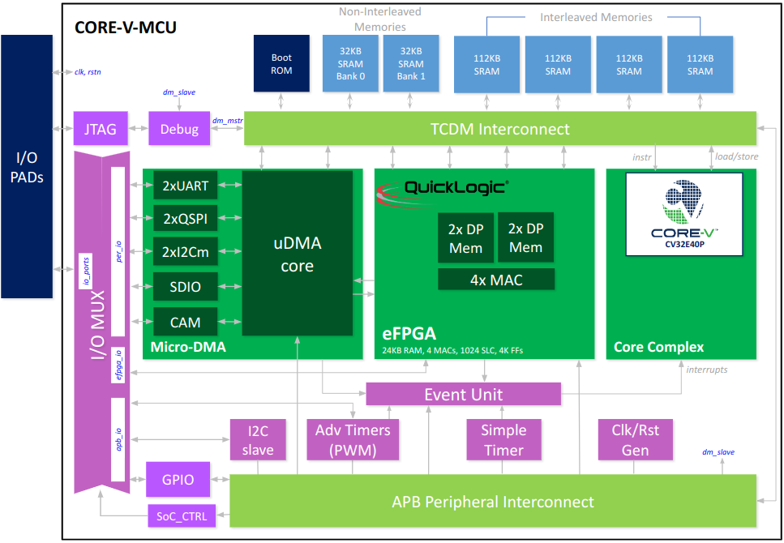

..
   Copyright (c) 2022 OpenHW Group
   SPDX-License-Identifier: Apache-2.0 WITH SHL-2.0

.. Level 1
   =======

   Level 2
   -------

   Level 3
   ~~~~~~~

   Level 4
   ^^^^^^^

.. _high_level_architecure:

High Level Architecture
=======================

The block diagram of the CORE-V-MCU is shown below.
Note that the I/O PADs are implementation speific and not considered part of the CORE-V-MCU itself.

   CORE-V-MCU Block Diagram

On-chip Memories
----------------
There are four types of on-chip memories visible to the user.
These are all accessible to the core, see the Memory Map chapter for addressing information.

Boot ROM
~~~~~~~~
An on-board ROM is provided.
The default configuration includes a very simple bootloader, see the CORE-V-MCU Quick Start Guide.

Non-Interleaved SRAM
~~~~~~~~~~~~~~~~~~~~
There are two 32K-byte banks of non-interleaved SRAM, typically used for program store.

Interleaved SRAM
~~~~~~~~~~~~~~~~
Four 112K-byte banks of interleaved SRAM, typically used for data store.
Note that the interleaved addressing is not visible to the user.

DP Memories
~~~~~~~~~~~
The DP memories are accessible by user-defined logic in the eFPGA and are not accessible by the core processor.

Internal Buses
--------------
The CORE-V-MCU has two internal bus fabrics.

L2 TCDM Interconnect
~~~~~~~~~~~~~~~~~~~~
The L2 TCDM Interconnect is a high performance, low latency memory bus interconnect.
The core accesses memory (both instruction fetch and data load/stores) via this interconnect.
The micro-DMA controller moves data to/from its peripherals into data memory using this bus.

APB Peripheral Interconnect
~~~~~~~~~~~~~~~~~~~~~~~~~~~
Many of the peripherals used by the CORE-V-MCU use the APB bus as the control-plane interface.
This interconnect is a slave to the L2 TCDM Interconnect and provides the core with memory-mapped access to the CSRs of the APB peripherals.
The APB peripherals are:

- SoC_CTRL
- GPIO
- I2C Slave
- Advance Timers (PWM)
- Event Timers
- Clock and Reset Generators
- Debug Module

Subsystems
----------
The CORE-V-MCU supports three subsystems

Fabric Control Subsystem
~~~~~~~~~~~~~~~~~~~~~~~~
The Fabric Control (FC) subsystem is accesses the L2 TCDM Interconnect (the _fabric_) such that it sees all resources of the CORE-V-MCU in a single, flat memory space.
The principle componet of the FC subsystem is the CV32E40P processor core.

Micro-DMA Subsystem
~~~~~~~~~~~~~~~~~~~
The micro-DMA (uDMA) manages data transfer to/from memory for a set of peripherals.
Its connections to the L2 TCDM Interconnect provide low-latency access to the interleaved data memories.
Note that the uDMA cannot access the non-interleaved memories or the boot ROM.
Peripherals supported by the uDMA are:

- UART
- I2C Master
- QSPI
- SDIO
- Camera

Quicklogic Embedded FPGA
~~~~~~~~~~~~~~~~~~~~~~~~
The eFPGA also connects to the interleaved data memories via the L2 TCDM Interconnect.
Note that there are four TCDM buses between the L2 TCDM Interconnect and the eFPGA allowing for eFPGA implementations to support high memory bandwidth requirements.

Other Functional Units
----------------------

Event Unit
~~~~~~~~~~
Virtually all peripherals, plus the uDMA and eFPGA subsystem generate signals to commnicate such event as the completion of a data transfer or an error condition.
These signals are consolidated by the Event Unit to generate a set of interrupts for the CV32E40P.

IO MUX
~~~~~~
To minimize packaging costs, the CORE-V-MCU has fewer top-level I/O signals than required by the total set of peripheral I/O signals.
The IO MUX allows the user to select a subset of peripheral I/O to connect to I/O PADs.

JTAG/Debug
~~~~~~~~~~
CORE-V-MCU supports an industry standard 5-pin JTAG interface supporting RISC-V compliant debug access.
Note that the JTAG port does not support any Design For Test features such as logic BIST, logic scan or boundary scan.
