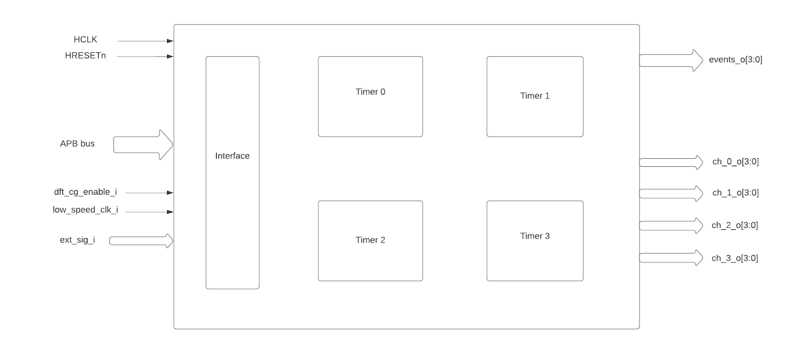
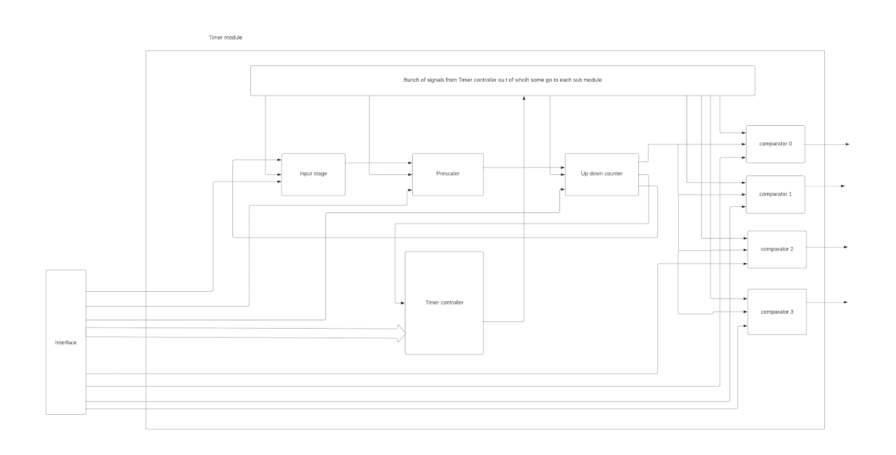

..
   Copyright (c) 2023 OpenHW Group
   Copyright (c) 2024 CircuitSutra

   SPDX-License-Identifier: Apache-2.0 WITH SHL-2.1

.. Level 1
   =======

   Level 2
   -------

   Level 3
   ~~~~~~~

   Level 4
   ^^^^^^^
.. _apb_advanced_timer:

APB Advanced Timer
==================

The Advanced Timer supports four programmable timers called "channels", typically used for PWM generation.

Features
--------

- Multiple trigger input sources:

  - Output signal channels of all timers
  - 32 GPIOs
  - Reference clock at 32kHz
  - FLL clock

- Configurable input trigger modes
- Configurable prescaler for each timer
- Configurable counting mode for each timer
- Configurable channel threshold action for each timer
- Four configurable output events
- Configurable clock gating of each timer

Block Diagram
-------------
 |image1|  

Timer Module
^^^^^^^^^^^^
 |image2| 

Each submodule receives inputs from the timer controller, interface, and other modules.

Theory of Operation
^^^^^^^^^^^^^^^^^^^

Input Ports
+++++++++++

1. **HCLK**: External clock for synchronization
2. **HRESETn**: Reset pin to reset the timer
3. **APB bus pins**
4. **dft_cg_enable_i**
5. **low_speed_clk_i**
6. **ext_sig_i**: A set of 32 GPIOs

Output Ports
++++++++++++

1. **events_o[3:0]**
2. **ch0_o[3:0]**
3. **ch1_o[3:0]**
4. **ch2_o[3:0]**
5. **ch3_o[3:0]**

High-Level Specification
------------------------

APB Advanced Timer
^^^^^^^^^^^^^^^^^^

- When the HRESETn signal is low, registers default to 0 and outputs are low.
- Four timer modules have four clock gates which will be enabled(meaning passes the ref clock to respective timer module) 
  only when either dft_cg_enable_i is high or the bit in respective position of REG_CH_EN register is high(0th bit for timer_0,1st bit for timer_1,etc).
- At every positive edge of the clock the CSR registers are updated based on APB signals.
- When the command register START is high and the timer is not
  active yet (which means the timer is started for the first time)
  then all the config values of all modules are
  commanded to be updated to default .They are,

    ○ The start value of the up down counter(TH_LO)

    ○ The end value of the up down counter(TH_HI)

    ○ The direction of the up down counter(default is 0) 

    ○ The sawtooth mode of the up down counter(UPDOWNSEL) 

    ○ The counter value of the up down counter (TH_LO)  

    ○ The prescaler value(PRESC),The MODE and INSEL register values. 

    ○ For each channel the MODE and TH values

    ○ Here,The general update of all the config happens in sync with
    the positive edge of the clock but the config of the up down
    counter (TH_LO,TH_HI,direct and
    UPDOWNSEL are updated immediately). 

- After the start of the model,The update to the submodules will
  happen based on register value UPDATE,RESET,and count update signal
  from the up down counter.
- At every clock positive edge,based on the command register START
  or STOP,the state of the timer is set as active or not .Once the
  timer is active then all the updates of the
  submodules depend on the corresponding registers.

    ○ The RESET command register

    ○ The UPDATE command register

- Based on the change in the config register CLKSEL ,it is decided
  whether the input selected from the set of inputs in ext_sig_i will
  be in sync with the rising edge of the
  low_speed_clk_i in sync with the ref clock.

- At every positive edge of the clock,the input signal is
  selected from a set of signals in ext_sig_i using the config
  register INSEL value and how the events are generated from the
  signal is decided by the config register MODE.

    ○ If MODE is 3’b000

    ■ The event is always high
    ○ If MODE is 3’b001

    ■ The event is sensitive to the negation of the signal selected
    ○ If MODE is 3’b010

    ■ The output event is sensitive to the input signal selected
    ○ If MODE is 3’b011

    ■ The output event is sensitive to the rising edge of the selected
    signal in sync with the clock.

    ○ If MODE is 3’b100

    ■ The output event is sensitive to the rising edge of the selected
    signal in sync with the clock.

    ○ If MODE is 3’b101

    ■ The output event is sensitive to both rising edge and falling
    edge of the selected signal in sync with the clock.

    ○ If MODE is 3’b110

    ■ If the timer is armed ,i,e,the register ARM is high then the
    event is made high for the rising edge of the selected signal and
    remains the same until the
    next rising edge of the signal.If ARM register is low,then the output
    event is low forever.

    ○ If MODE is 3’b111

    ■ If the timer is armed ,i,e,the register ARM is high then the
    event is made high for the falling edge of the selected signal and
    remains the same until the next falling edge of the signal.If ARM
    register is low,then the output event is low forever.

- The Event signal generated from the selected input based on the MODE config register
  in the previous step is scaled based on the
  prescaler value(PRESC register value). At every positive edge of the
  clock the register PRESC is
  updated.The scaling happens in a way that after every time the
  number of events in sync with the external clock
  generated is equal to the PRESC register value then counter is made
  to 0 and an event is generated.Like this whenever the lock synced
  events generated is equal to PRESC value then one output event is
  generated at positive edge of the clock(the frequency is scaled
  according to the PRESC
  register value).

- The above output scaled events generated go to the up down
  counter.For every event the counter is incremented starting from
  the start value(TH_LO register) .Based on the register UPDOWNCLK
  representing the sawtooth mode,it is decided whether the counter
  should reset after reaching end of the counting range (TH_HI) or it
  should reverse the
  direction and go counting down to start value(TH_LO) after
  which it resets to the default values of start,stop,direction,etc .

- At every input event in sync with the clock an **output event** is
  generated and also the counter is incremented .Whenever the counter
  reaches the end of a counting range an event is generated
  representing the end of the counter and reset happens.The output port
  representing the counter is updated at every clock positive edge.

- Here, the counter value,event representing the end of the
  timer,the **output event** generated above ,and the
  UPDOWNSEL register value are used by the comparator below.

**Comparator:-**

- At every positive edge of the clock,When the timer is started the
  first time or explicitly updated through the update
  command register named UPDATE, the module is updated then, the
  register values TH and MODE of the register are read in which TH
  value is the comparator threshold value and MODE is the operation
  that should be done when counter of the up down counter reaches the
  comparator threshold value.

- At every positive edge of the clock when the event coming out of
  the up down counter is high ,based on the register MODE value ,output
  is generated accordingly.

- There are two events that can happen in the comparator, 

  ○ When
  timer counter value reaches the comparator offset **(match event)**

  ○ When the UPDOWNSEL register is high and the timer reaches its end
  or when UPDOWNSEL is low and the timer counter value reaches the
  comparator threshold offset. **(event_2)**
- define OP_SET 3'b000
- define OP_TOGRST 3'b001
- define OP_SETRST 3'b010
- define OP_TOG 3'b011
- define OP_RST 3'b100
- define OP_TOGSET 3'b101
- define OP_RSTSET 3'b110
- If MODE value is OP_SET
   ○ Then the output event is high when there is a match otherwise
   remains the same .

- If MODE value is OP_TOGRST
   ○ Then if sawtooth mode is on ,then if a match happens then the
   output event is toggled else if event_2
   happens then output event is low.

   ○ If sawtooth mode is off,then if match event happens and event_2
   doesn't happen then output event is toggle and event_2 is made high
   ,else if match event happens and event_2 also happens then output
   event is made low and event_2 is also made low.

- If MODE value is OP_SETRST
   ○ Then if sawtooth mode is on ,then if a match happens then the
   output event is high else if event_2 happens then output event is
   low.

   ○ If sawtooth mode is off,then if match event happens and event_2
   doesn't happen then output event is made high and event_2 is made
   high.,else if match event happens and event_2 also happens then
   output event is made low and event_2 is also made low.

- If MODE value is OP_TOG

   ○ Then the output event is toggled when the match event occurs else
   remains the same.

- If MODE value is OP_RST
   ○ Then the output event is made low when the match event occurs
   else remains the same.

- If MODE value is OP_TOGSET
   ○ Then if sawtooth mode is on ,then if a match happens then the
   output event is toggled else if event_2
   happens then output event is high.

   ○ If sawtooth mode is off,then if match event happens and event_2
   doesn't happen then output event is toggle and event_2 is made high
   ,else if match event happens and event_2 also happens then output
   event is made high and event_2 is also made low.

- If MODE value is OP_RSTSET
    ○ Then if sawtooth mode is on ,then if a match happens then the
    output event is low else if event_2 happens then output event is
    high.

    ○ If sawtooth mode is off,then if match event happens and event_2
    doesn't happen then output event is made low and event_2 is made
    high.,else if match event happens and event_2 also happens then the
    output event is made high and event_2 is also made low.

- By default the output event remains the same (state remains same
  until further change in input) and event_2 is kept low.

**CSR Register for the Timer Module 0:**

**REG_TIM0_CMD** offset=0x000

.. list-table::
   :widths: 10 10 10 10 50
   :header-rows: 1

   * - Field
     - Bits
     - Type
     - Access
     - Description
   * - Reserved
     - 31:5
     - 
     - 
     - 
   * - ARM
     - 4:4
     - Config
     - R/W
     - arm command bitfield
   * - RESET
     - 3:3
     - Config
     - R/W
     - reset command bitfield
   * - UPDATE
     - 2:2
     - Config
     - R/W
     - update command bitfield
   * - STOP
     - 1:1
     - Config
     - R/W
     - Stop command field
   * - START
     - 0:0
     - Config
     - R/W
     - Start command field
..

**REG_TIM0_CFG** offset=0x004

.. list-table::
   :widths: 10 10 10 10 50
   :header-rows: 1

   * - Field
     - Bits
     - Type
     - Access
     - Description
   * - Reserved
     - 31:24
     - 
     - 
     - 
   * - PRESC
     - 23:16
     - Config
     - R/W
     - prescaler value configuration bitfield
   * - Reserved
     - 15:13
     - 
     - 
     - 
   * - UPDOWNSEL
     - 12:12
     - Config
     - R/W
     - center-aligned mode configuration bitfield
   * -
     -
     -
     -
     - 1’b0: The counter counts up and down alternatively
   * -
     -
     -
     -
     - 1’b1: The counter counts up and resets to 0 when it reaches the threshold.
   * - CLKSEL
     - 11:11
     - Config
     - R/W
     - clock source configuration bitfield
   * -
     -
     -
     -
     - 1’b0: FLL
   * -
     -
     -
     -
     - 1’b1: Reference clock at 32kHz
   * - MODE
     - 10:8
     - Config
     - R/W
     - trigger mode configuration bitfield
   * -
     -
     -
     -
     - 3’h0: Trigger event at each clock cycle
   * -
     -
     -
     -
     - 3’h1: Trigger event if input source is 0
   * -
     -
     -
     -
     - 3’h2: Trigger event if input source is 1
   * -
     -
     -
     -
     - 3’h3: Trigger event on input source rising edge
   * -
     -
     -
     -
     - 3’h4: Trigger event on input source falling edge
   * -
     -
     -
     -
     - 3’h5: Trigger event on input source falling or rising edge
   * -
     -
     -
     -
     - 3’h6: Trigger event on input source rising edge when armed
   * -
     -
     -
     -
     - 3’h7: Trigger event on input source falling edge when armed
   * - INSEL
     - 7:0
     - Config
     - R/W
     - input source configuration bitfield
   * -
     -
     -
     -
     - 0-31: GPIO[0] to GPIO[31]
   * -
     -
     -
     -
     - 32-35: Channel 0 to 3 of ADV_TIMER0
   * -
     -
     -
     -
     - 36-39: Channel 0 to 3 of ADV_TIMER1
   * -
     -
     -
     -
     - 40-43: Channel 0 to 3 of ADV_TIMER2
   * -
     -
     -
     -
     - 44-47: Channel 0 to 3 of ADV_TIMER3
..

**REG_TIM0_TH** offset=0x008

.. list-table::
   :widths: 10 10 10 10 50
   :header-rows: 1

   * - Field
     - Bits
     - Type
     - Access
     - Description
   * - TH_HI
     - 31:16
     - Config
     - R/W
     - Threshold high part configuration bitfield
   * - TH_LO
     - 15:0
     - Config
     - R/W
     - Threshold low part configuration bitfield

..

**REG_TIM0_CH0_TH** offset=0x00C

.. list-table::
   :widths: 10 10 10 10 50
   :header-rows: 1

   * - Field
     - Bits
     - Type
     - Access
     - Description
   * - Reserved
     - 31:19
     - 
     - 
     - 
   * - MODE
     - 18:16
     - Config
     - R/W
     - Channel 0 threshold match action on channel output signal configuration bitfield
   * -
     -
     -
     -     
     - 3’h0: Set
   * -
     -
     -
     -     
     - 3’h1: Toggle then next threshold match action is clear
   * -
     -
     -
     - 
     - 3’h2: Set then next threshold match action is clear
   * -
     -
     -
     -
     - 3’h3: Toggle
   * -
     -
     -
     -
     - 3’h4: Clear
   * -
     -
     -
     -
     - 3’h5: Toggle then next threshold match action is set
   * -
     -
     -
     -
     - 3’h6: Clear then next threshold match action is set
   * - TH
     - 15:0
     - Config
     - R/W
     - Channel 0 threshold configuration bitfield

..

**REG_TIM0_CH1_TH** offset=0x010

.. list-table::
   :widths: 10 10 10 10 50
   :header-rows: 1

   * - Field
     - Bits
     - Type
     - Access
     - Description
   * - Reserved
     - 31:19
     - 
     - 
     - 
   * - MODE
     - 18:16
     - Config
     - R/W
     - Channel 1 threshold match action on channel output signal configuration bitfield
   * -
     -
     -
     -     
     - 3’h0: Set
   * -
     -
     -
     -
     - 3’h1: Toggle then next threshold match action is clear
   * -
     -
     -
     -
     - 3’h2: Set then next threshold match action is clear
   * -
     -
     -
     -
     - 3’h3: Toggle
   * -
     -
     -
     -
     - 3’h4: Clear
   * -
     -
     -
     -
     - 3’h5: Toggle then next threshold match action is set
   * -
     -
     -
     -
     - 3’h6: Clear then next threshold match action is set
   * - TH
     - 15:0
     - Config
     - R/W
     - Channel 1 threshold configuration bitfield

..

**REG_TIM0_CH2_TH** offset=0x014

.. list-table::
   :widths: 10 10 10 10 50
   :header-rows: 1

   * - Field
     - Bits
     - Type
     - Access
     - Description
   * - Reserved
     - 31:19
     - 
     - 
     - 
   * - MODE
     - 18:16
     - Config
     - R/W
     - Channel 2 threshold match action on channel output signal configuration bitfield
   * -
     -
     -
     -     
     - 3’h0: Set
   * -
     -
     -
     -     
     - 3’h1: Toggle then next threshold match action is clear
   * -
     -
     -
     -     
     - 3’h2: Set then next threshold match action is clear
   * -
     -
     -
     -     
     - 3’h3: Toggle
   * -
     -
     -
     -    
     - 3’h4: Clear
   * -
     -
     -
     -     
     - 3’h5: Toggle then next threshold match action is set
   * -
     -
     -
     -    
     - 3’h6: Clear then next threshold match action is set
   * - TH
     - 15:0
     - Config
     - R/W
     - Channel 2 threshold configuration bitfield

..

**REG_TIM0_CH3_TH** offset=0x018

.. list-table::
   :widths: 10 10 10 10 50
   :header-rows: 1

   * - Field
     - Bits
     - Type
     - Access
     - Description
   * - Reserved
     - 31:19
     - 
     - 
     - 
   * - MODE
     - 18:16
     - Config
     - R/W
     - Channel 3 threshold match action on channel output signal configuration bitfield
   * -
     -
     -
     -
     - 3’h0: Set
   * -
     -
     -
     -
     - 3’h1: Toggle then next threshold match action is clear
   * -
     -
     -
     -     
     - 3’h2: Set then next threshold match action is clear
   * -
     -
     -
     -     
     - 3’h3: Toggle
   * -
     -
     -
     -     
     - 3’h4: Clear
   * -
     -
     -
     -    
     - 3’h5: Toggle then next threshold match action is set
   * -
     -
     -
     -     
     - 3’h6: Clear then next threshold match action is set
   * - TH
     - 15:0
     - Config
     - R/W
     - Channel 3 threshold configuration bitfield

..

**REG_TIM0_COUNTER** offset=0x02C

.. list-table::
   :widths: 10 10 10 10 50
   :header-rows: 1

   * - Field
     - Bits
     - Type
     - Access
     - Description
   * - T0_COUNTER
     - 31:0
     - Status
     - R
     - ADV_TIMER0 counter register

