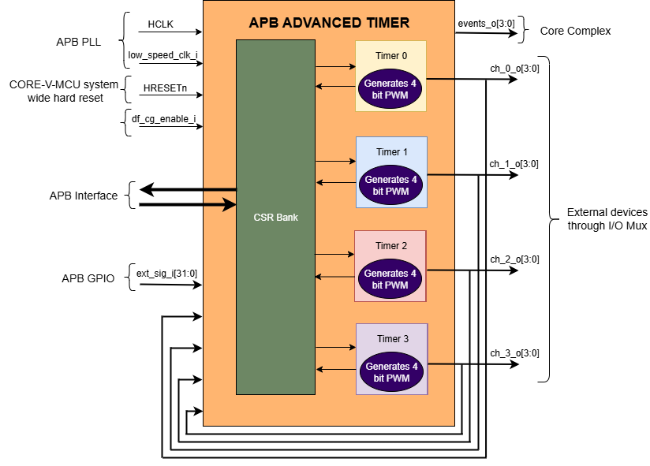
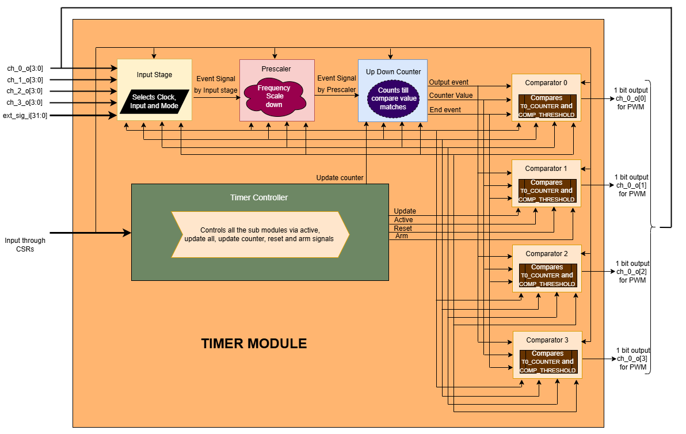
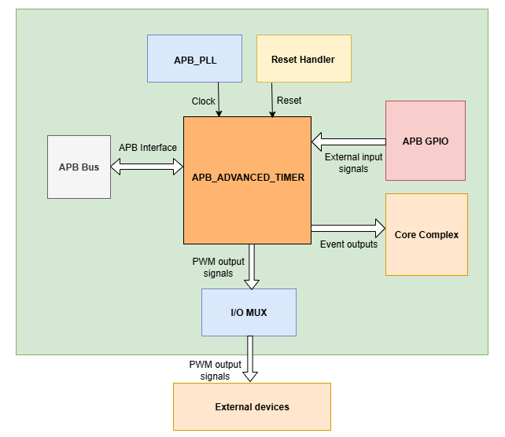
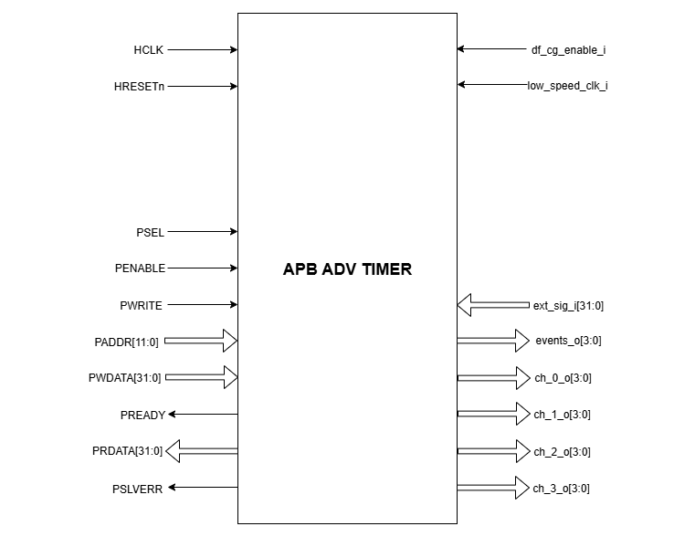

..
   Copyright (c) 2023 OpenHW Group
   Copyright (c) 2024 CircuitSutra

   SPDX-License-Identifier: Apache-2.0 WITH SHL-2.1

.. Level 1
   =======

   Level 2
   -------

   Level 3
   ~~~~~~~

   Level 4
   ^^^^^^^
.. _apb_advanced_timer:

APB ADVANCED TIMER
==================
APB ADVANCED TIMER generates PWM for the external devices connected to CORE_V_MCU and the output events for the CPU subsystem by the use of four programmable 16-bit timers called "channels".
These four timers can be configured independently to support four unique PWM generations in parallel.

Features
--------

- Multiple trigger input sources:

  - PWM output signals of all 4 timers
  - 32 GPIOs

- Multiple clock sources:

  - Reference clock at 32kHz
  - HCLK clock

- Configurable input trigger modes for each timer
- Configurable prescaler for each timer
- Configurable counting mode for each timer
- Four comparators for each timer. Configurable channel comparator threshold and comparator operation for each comparator.
- Four configurable output events
- 4-bit PWM output for each timer.
- Configurable clock gating of each timer

Block Architecture
------------------

APB ADVANCED TIMER supports four 16-bit independent Timers.
Each 16-bit timer has submodules, including an input stage, prescaler, up-down counter, and comparators.
Each timer has its own set of CSRs that are used to configure various submodules.

APB timers can generate PWM signals in the following combination: -

- A single timer can generate one 4-bit PWM.
- Two timers can generate two 4-bit PWMs in parallel.
- Three timers can generate three 4-bit PWMs in parallel.
- Four timers can also generate four 4-bit PWMs in parallel.

APB ADVANCED TIMER also generates a 4-bit output event signal to the CPU subsystem, depending on the configuration of REG_EVENT_CFG CSR.

The figure below is a high-level block diagram of the APB ADVANCED TIMER module:-

   APB ADVANCED TIMER Block Diagram

Timer Module
~~~~~~~~~~~~

The timer module's main objective is to generate a PWM signal based on the external input/stimulus provided.
The timer module has various submodules/components like the Timer Controller, Input stage, Prescalar, Updown counter, and Comparators.
The timer controller manages all the other submodules through a few control signals like active, controller reset, and update.
FW performs Initialization and drives various configuration CSR. 

To generate the PWM, the data flows through the following submodule:
- **(ext_sig_i )** -> input stage -> prescaler ->updown counter ->comparators -> **(PWM)**

   TIMER Block Diagram

Timer Controller
^^^^^^^^^^^^^^^^
The timer controller generates important signals, like active, update, and reset, arm and update counter. It controls other submodules through these signals. 

- The active signal: It is a control signal through which a sub-module can either enable or disable its operations.
- The update signal: It informs the sub-module when to update the latest configured CSR values to perform their operations.
- The reset signal: It resets the submodules.
- The arm signal: It is passed to input stage for further processing of the input signal.
- The update counter signal: It informs the updown counter to update the latest configured CSR values to perform its operations.

The active signal is enabled(1) or disabled(0) using below conditions: 

- The active signal for each timer is driven high ('1') when the corresponding START bitfield is set to '1' in its respective REG_TIMx_CMD CSR (where x = 0 to 3 for Timer0 to Timer3).
- The active signal for each timer is driven low ('0') when the corresponding START bitfield is '0' and the STOP bitfield is set to '1' in its respective REG_TIMx_CMD CSR (where x = 0 to 3 for Timer0 to Timer3). 

The update and update counter signals are always driven by the UPDATE bitfield value in the REG_TIMx_CMD CSR (where x = 0 to 3 for Timer0 to Timer3), and the controller reset signal is driven by the RESET bitfield value in the REG_TIMx_CMD CSR (where x = 0 to 3 for Timer0 to Timer3).
The update, update counter and reset signals are passed to all sub-modules if any one of the following 2 conditions is satisfied:

- If the START bitfield is '0' in the respective REG_TIMx_CMD CSR (where x = 0 to 3 for Timer0 to Timer3).
- If the START bitfield is '1' in the respective REG_TIMx_CMD CSR and the active signal is driven high ('1'), this condition applies when the timer starts for the first time.

Input Stage
^^^^^^^^^^^

Input stage receives the 48-bit input (i.e, 32-bit ext_sig_i from APB GPIO and 16-bit PWM signals (4-bit PWM output signals of the 4 timers each)).
Depending on CSR configurations, it selects the clock, input pin, and operating mode to generate the output event signal.
Input source is selected based on the value of the INSEL bitfield of REG_TIMx_CFG CSR (where x = 0 to 3 for Timer0 to Timer3).
If the INSEL bitfield is '7', then 7th bit of 48 bit input is selected for further processing. 
Input stage operation is synchronized using HCLK or reference clock, based on the value of the CLKSEL bitfield in the REG_TIMx_CMD CSR (where x = 0 to 3 for Timer0 to Timer3):

- If CLKSEL = 1, it process the input signal as per MODE at every posistive edge of the reference clock.

- If REF_CLK_EN_BIT = 0, it process the input signal as per MODE at every posistive edge of the system clock (HCLK). 
When the timer controller asserts the active signal, then at every positive edge of the selected clock and selected input signal, 
the Input stage uses the bitfield MODE in REG_TIMx_CFG CSR (where x = 0 to 3 for Timer0 to Timer3) to generate an output event signal according to the information below:

- If MODE is 3’b000

  - The output event is always high

- If MODE is 3’b001

  - The output event is the negation of the signal selected

- If MODE is 3’b010

  - The output event is the same as the input signal selected
    
- If MODE is 3’b011

  - The output event is high at the rising edge of the selected signal in sync with the clock.

- If MODE is 3’b100

  - The output event is high at the falling edge of the selected signal in sync with the clock.

- If MODE is 3’b101

  - The output event is high at both the rising edge and falling edge of the selected signal in sync with the clock.

- If MODE is 3’b110

  - If the timer is armed, i.e., the ARM is high, then the event is made high for the rising edge of the selected signal and remains the same until the next rising edge of the signal. If the ARM CSR is low, then the output event is low forever.

- If MODE is 3’b111

  - If the timer is armed, i.e., the CSR ARM is high, then the event is made high for the falling edge of the selected signal and remains the same until the next falling edge of the signal. If the ARM CSR is low, then the output event is low forever.

Prescalar
^^^^^^^^^
The prescaler converts a high-frequency input event (event_i) into a low-frequency output event (event_o).

Prescaler maintains a prescaler counter whose initial value is '0'.
For every positive edge of the HCLK, when the timer controller asserts the active signal and input-stage asserts the event (event_i), the prescaler counter is incremented by '1'.
The prescaler counter is incremented in the similar fashion until it reaches the PRESC bitfield in the REG_TIMx_CFG CSR (where x = 0 to 3 for Timer0 to Timer3), then generates an output signal (event_o) for the Up-Down counter module.
In the next positive edge of the HCLK, prescaler counter and event_o are reset to '0'.
The prescaler counter starts incrementing and the same process repeats to set the event_o multiple times.

The output signal (event_o) is de-asserted under the following conditions:

- A system reset is received.
- A reset is issued by the timer controller module.
- The input-stage module de-asserts the input event signal (i.e., event_i goes low).
- The timer is disabled by the timer controller.

Updown counter
^^^^^^^^^^^^^^
The updown counter manages the timer counter values based on CSR configurations and generates the following outputs: 

- The counter value.
- The end event. 
- The output event.

The output event generated from the prescaler sub-module is provided as the input for the updown counter.
At every positive edge of the clock, if the active signal is '1', then the output event is driven by the value of the output event generated from the prescaler.
The active, controller reset, and update signals are provided by the Timer controller.    
The updown counter maintains a counter and direction(0- up and 1- down).
During the initialization, the counter value is set to COUNT_START and the direction to 0.
At every positive edge of the clock, if the output event generated from the prescaler is '1' and the active signal is '1', then the following operation is performed.

- if the SAWTOOTH bitfield is '1':

  - The counter is incremented till it reaches the value of COUNT_END, then an end event is generated.

  - After the end event is generated , the counter is reset back to the value of the COUNT_START bitfield, and this process is repeated to generate multiple end events. 
   
- if the SAWTOOTH bitfield is '0':

  - The counter is incremented till it reaches the value of COUNT_END.

  - Then the counter is decremented till it reaches the value of COUNT_START. (counter goes in a sawtooth fashion)

  - Now, an end event is generated. This process is repeated to generate multiple end events.

Re-initialization of the Updown counter can be done in any of the following scenarios.

- The update counter signal is '1' and the controller is inactive (active signal is '0'). 
- The update counter signal is '1' and the end event is generated.  
- Reset signal is '1'.

If the update counter signal is '1' and either controller is active or the end event is not generated, then the updown counter goes into pending initialization stage.
In the pending initization stage, the updown counter is re-initialized when the next end event is generated, irrespective of the update counter signal value at that instance of time. 

At every positive edge of the clock, the counter value is updated in the REG_TIMx COUNTER CSR (where x = 0 to 3 for Timer0 to Timer3) for the respective counter. 
If the hard reset is '0', then all the CSR and internal metadata are set to the reset values.

Comparator
^^^^^^^^^^
Each timer has 4 comparators that can act independently, and each comparator generates a 1-bit PWM output.
Comparator compares the timer counter value with the compare value and, based on the CSR configurations of output mode, generates a PWM output.
The counter value, end event, and the output event generated in the updown counter are provided as input to the comparator. 
The active, reset, and update signals are provided by the Timer controller.

At every positive edge of the clock, when the output event coming out of the updown counter is '1' and the active signal is '1', the comparator checks for the following two internal events that can happen, 

- **(match_event)** is set to '1' when the counter value reaches the COMP_THRESHOLD.

- **(event_2)** set to '1' in the following two scenarios:

  - When the SAWTOOTH bitfield is '1' and the end event is '1'.

  - When SAWTOOTH is a bitfield of '0' and the counter value reaches the COMP_THRESHOLD. 

The PWM output ch_x_o[y] is generated (where x = 0 to 3 for Timer0 to Timer3 and y = 0, 1, 2 and 3 referes to 0th, 1st, 2nd and 3rd index of a 4 bit PWM)
Then, based on the match_event, event_2, and COMP_OP value, the PWM output is generated after the following operation is performed.

- If COMP_OP value is 3'b000 (OP_SET) 
  
  - If a match_event is high
  
    - The PWM output ch_x_o[y] is made high
  
  - Else, if a match_event is low
  
    - The PWM output ch_x_o[y] remains the same.

- If COMP_OP value is 3'b001 (OP_TOGRST)
  
  - When Sawtooth Mode is ON

    - If a match_event is high

      - The PWM output ch_x_o[y] is toggled.
    
    - Else, if event_2 is high 
    
      - The PWM output ch_x_o[y] is made low.

  - When Sawtooth Mode is OFF

    - If match_event is high and event_2 is low

      - The PWM output ch_x_o[y] is toggled.
      - event_2 is made high.

    - Else, if match_event is high and event_2 is high
    
      - The PWM output ch_x_o[y] is made low
      - event_2 is made low.

- If COMP_OP value is 3'b010 (OP_SETRST)

  - When Sawtooth Mode is ON

    - If a match_event is high 
  
      - the PWM output ch_x_o[y] is made high
  
    - Else, if event_2 is high
  
      - then PWM output ch_x_o[y] is made low.

  - When Sawtooth Mode is OFF
    
    - If match_event is high and event_2 is low
    
      - The PWM output ch_x_o[y] is made high
      - event_2 is made high.
    
    - Else, if match_event is high and event_2 also is high
    
      - PWM output ch_x_o[y] is made low
      - event_2 is made low.

- If COMP_OP value is 3'b011 (OP_TOG) 

  - If a match_event is high
  
    - The PWM output ch_x_o[y] is toggled
  
  - Else, if a match_event is low
  
    - The PWM output ch_x_o[y] remains the same.

- If COMP_OP value is 3'b100 (OP_RST)

  - If a match_event is high
  
    - The PWM output ch_x_o[y] is made low
  
  - Else, if a match_event is low
  
    - The PWM output ch_x_o[y] remains the same.

- If COMP_OP value is 3'b101 (OP_TOGSET)

  - When Sawtooth Mode is ON

    - If a match_event is high
  
      - The PWM output ch_x_o[y] is toggled
  
    - Else, if event_2 is high
  
      - then PWM output ch_x_o[y] is made high.

  - When Sawtooth Mode is OFF
  
    - If match_event is high and event_2 is low
  
      - The PWM output ch_x_o[y] is toggled
      - event_2 is made high
  
    - Else, if match_event is high and event_2 also is high
  
      - The PWM output ch_x_o[y] is made high
      - event_2 is made low

- If COMP_OP value is 3'b110 (OP_RSTSET)

  - When Sawtooth Mode is ON
  
    - If a match_event is high
  
      - The PWM output ch_x_o[y] is made low
  
    - Else, if event_2 is high
  
      - The PWM output ch_x_o[y] is made high

  - When Sawtooth Mode is OFF
  
    - If match_event is high and event_2 is low
  
      - The PWM output ch_x_o[y] is made low
      - event_2 is made high
  
    - Else, if match_event is high and event_2 also is high
  
      - The PWM output ch_x_o[y] is made high
      - event_2 is made low.

By default, the PWM output remains the same (state remains the same until further change in input), and event_2 is kept low.
The PWM output is set to 0. When either the hard reset is triggered or the controller reset is '1'.
COMP_THRESHOLD and COMP_OP can only be updated, when the update signal is '1'.

Working of APB ADVANCED TIMER for PWM generation:
~~~~~~~~~~~~~~~~~~~~~~~~~~~~~~~~~~~~~~~~~~~~~~~~~

Based on the detailed working of the submodules above, for each Timer module, at every positive edge of the selected clock and when the timer is active, the following operation is performed:

- Input stage consumes 48 bits (i.e, 32 32-bit ext_sig_i and 16-bit PWM output signals of all the 4 timers) and processes it accordingly based on CLKSEL, INSEL, and MODE. The event signal is generated as per the working of the input stage.

- The Event signal generated in the input stage is scaled down to the output scaled event based on the prescaler value by the prescaler sub-module.

- The above output scaled events generated go to the updown counter.

- Depending on various FW configurations of SAWTOOTH, COUNT_START, and COUNT_END. The counter value, end event, and the output event are generated in the updown counter and are provided as input to the 4 comparators.

- In each of the comparators, the counter value is compared against the COMP_THRESHOLD, and a 1-bit PWM is generated based on COMP_OP.

- 4 comparator submodules generate 4 4-bit PWM signals

- The above process is repeated until the timer is disabled. 

APB ADVANCED TIMER has 4 timer modules, which can generate 4 independent 4-bit PWMs

Working of APB ADVANCED TIMER for output event generation:
~~~~~~~~~~~~~~~~~~~~~~~~~~~~~~~~~~~~~~~~~~~~~~~~~~~~~~~~~~

Apart from generating PWM signals, the APB ADVANCED TIMER can also generate output events using bitfields in the REG_EVENT_CFG CSR.

For every positive edge of the HCLK, the output events are generated after the following operation is performed.

- The OUT_SEL_EVT_ENABLE bitfield determines which output event lines (events_o[0] to events_o[3]) are enabled.
- Each bitfield OUT_SEL_EVT0 to OUT_SEL_EVT3 selects one of the 16 PWM signals (ch_0_o[0] to ch_0_o[3], ch_1_o[0] to ch_1_o[3], ch_2_o[0] to ch_2_o[3] and ch_3_o[0] to ch_3_o[3]) to be monitored for edge detection, corresponding to output event lines events_o[0] to events_o[3].
- The output events are triggered at the rising edge of the selected PWM signal and will be de-asserted in the next HCLK clock cycle.

For every positive edge of the HCLK, the same process is repeated to generate the output events.

Example:

If bit 0 of OUT_SEL_EVT_ENABLE is set (OUT_SEL_EVT_ENABLE[0] = 1) and OUT_SEL_EVT0 is set to 4, then events_o[0] will asserted at the rising edge on ch_1_o[0]. Similarly if OUT_SEL_EVT_ENABLE is set to 8 and  OUT_SEL_EVT3 is set to 1, the event_o[3] will be asserted bassed on ch_0_o[1] pwm signal.
This mapping allows flexible routing of PWM signal transitions to specific output events.

System Architecture:
--------------------

The figure below depicts the connections between the APB ADVANCED TIMER and the rest of the modules in CORE-V-MCU:-

   APB ADVANCED TIMER CORE-V-MCU connections diagram

- The ext_sig_i input to the APB ADVANCED TIMER is provided by the APB_GPIO. 
- APB ADVANCED TIMER processes these input signals based on the various CSR configurations.
- APB ADVANCED TIMER generates a few output event signals that are further passed as interrupts to the Core complex.
- APB ADVANCED TIMER generates PWM outputs, which are passed to the external devices through the I/O mux.

Programmers View:
-----------------
APB ADVANCED TIMER has 4 Timers, and the following programming model is followed:    

Initial Configurations:
~~~~~~~~~~~~~~~~~~~~~~~
There are CSR bitfields in the APB advanced timer that are required to be configured before any operations are initiated. 

Timer module specific configurations:
^^^^^^^^^^^^^^^^^^^^^^^^^^^^^^^^^^^^^

As we have 4 Timer modules. Each timer has to be configured with appropriate values.

- Configure input clock source using CLKSEL bitfield in the REG_TIMx_CFG CSR (where x = 0 to 3 for Timer0 to Timer3).
- Configure input trigger mode using the MODE bitfield in the REG_TIMx_CFG CSR (where x = 0 to 3 for Timer0 to Timer3).
- Configure which input has to be selected using the INSEL bitfield in the REG_TIMx_CFG CSR (where x = 0 to 3 for Timer0 to Timer3).
- Configure prescaler value for scaling down the frequency using the PRESC bitfield in the REG_TIMx_CFG CSR (where x = 0 to 3 for Timer0 to Timer3).
- Configure sawtooth mode through which the updown down counter operates using the SAWTOOTH bitfield in the REG_TIMx_CFG CSR (where x = 0 to 3 for Timer0 to Timer3).
- Configure updown counter start value and end value using COUNT_START and COUNT_END bitfield respectively in the REG_TIMx_TH CSR (where x = 0 to 3 for Timer0 to Timer3).
- Configure comparator 0 operation and comparator 0 threshold using COMP_OP and COMP_THRESHOLD bitfield respectively in the REG_TIMx_CH0_TH CSR (where x = 0 to 3 for Timer0 to Timer3).
- Configure comparator 1 operation and comparator 1 threshold using COMP_OP and COMP_THRESHOLD bitfield respectively in the REG_TIMx_CH1_TH CSR (where x = 0 to 3 for Timer0 to Timer3).
- Configure comparator 2 operation and comparator 2 threshold using COMP_OP and COMP_THRESHOLD bitfield respectively in the REG_TIMx_CH2_TH CSR (where x = 0 to 3 for Timer0 to Timer3).
- Configure comparator 3 operation and comparator 3 threshold using COMP_OP and COMP_THRESHOLD bitfield respectively in the REG_TIMx_CH3_TH CSR (where x = 0 to 3 for Timer0 to Timer3).

Common configurations:
^^^^^^^^^^^^^^^^^^^^^^

These configurations are common for 4 TIMERs. Typically, these are used to enable or disable output events, clock for TIMERs, and select the output events from a group of 16 PWM events.    

- Configure output select event enable that controls to enable or disable any of the 4-bit output events_o using OUT_SEL_EVT_ENABLE bitfield in the REG_EVENT_CFG.
- Configure output event 0, select the value that is used to select an event from the 16-bit PWM output using the OUT_SEL_EVT0 bitfield in the REG_EVENT_CFG.
- Configure output event 1, select the value that is used to select an event from the 16-bit PWM output using the OUT_SEL_EVT1 bitfield in the REG_EVENT_CFG.
- Configure output event 2 to select a value that is used to select an event from the 16-bit PWM output using the OUT_SEL_EVT2 bitfield in the REG_EVENT_CFG.
- Configure output event 3, select the value that is used to select an event from the 16-bit PWM output using the OUT_SEL_EVT3 bitfield in the REG_EVENT_CFG.
- Enable or disable clocks for each TIMER using the CLK_ENABLE bitfield in the REG_CH_EN.

Control configurations/operations:
~~~~~~~~~~~~~~~~~~~~~~~~~~~~~~~~~~~

There are CSR bitfields in the APB advanced timer that control operations of each of the timer modules and their submodules. 

- Set the START bitfield in the REG_TIMx_CMD CSR (where x = 0 to 3 for Timer0 to Timer3) to start the Timer and its sub modules input stage, prescaler, updown counter, and comparators.
- Set the STOP bitfield in the REG_TIMx_CMD CSR (where x = 0 to 3 for Timer0 to Timer3) to stop/halt/pause the Timer and its sub modules input stage, prescaler, updown counter, and comparators.
- Set the UPDATE bitfield in the REG_TIMx_CMD CSR (where x = 0 to 3 for Timer0 to Timer3) to Re-Initialization with the latest CSRs of the Timer and its sub modules, input stage, prescaler, updown counter, and comparators.
- Set the RESET bitfield in the REG_TIMx_CMD CSR (where x = 0 to 3 for Timer0 to Timer3) to reset the Timer and its submodules input stage, prescaler, updown counter, and comparators.
- set the ARM bitfield in the REG_TIMx_CMD CSR (where x = 0 to 3 for Timer0 to Timer3) to modify the inputs in the input stage.

Status configurations:
~~~~~~~~~~~~~~~~~~~~~~

The counter values of all 4 Timers can be read via the following CSR bitfields in the APB advanced timer. 

- Use the Tx_COUNTER bitfields in the respective REG_TIMx_COUNTER CSR (where x = 0 to 3 for Timer0 to Timer3) to read the values of the counter maintained by updowncounter for each of the timers.

APB ADVANCED TIMER CSRs
-----------------------

Refer to `Memory Map <https://github.com/openhwgroup/core-v-mcu/blob/master/docs/doc-src/mmap.rst>`_ Map for the peripheral domain addresses of the APB ADVANCED TIMER.
NOTE: APB ADVANCED TIMER CSRs are non-volatile, meaning that their read value will not be changed by the hardware. A CSR's volatility is indicated by its "type".
Details of CSR access type are explained `here <https://docs.openhwgroup.org/projects/core-v-mcu/doc-src/mmap.html#csr-access-types>`_.

REG_TIM0_CMD 
~~~~~~~~~~~~
- Address Offset=0x000
- Type: non-volatile

+----------+------+-----------------+--------+-----------------------------------------------------------------------------------------+
| Field    | Bits | Default Value   | Access | Description                                                                             |
+==========+======+=================+========+=========================================================================================+
| RESERVED | 31:5 | 0               | --     | Reserved                                                                                |
+----------+------+-----------------+--------+-----------------------------------------------------------------------------------------+
| ARM      | 4:4  | 0               | RW     | set this bitfield to modfify the input data as per description in input stage           |
|          |      |                 |        | when MODE bitfield value is 6 or 7                                                      |
+----------+------+-----------------+--------+-----------------------------------------------------------------------------------------+
| RESET    | 3:3  | 0               | RW     | set this bitfield to reset the timer, even when the timer is active for PWM generation. |
+----------+------+-----------------+--------+-----------------------------------------------------------------------------------------+
| UPDATE   | 2:2  | 0               | RW     | set this bitfield to update or re-initialize the timer when the timer is stopped        |
+----------+------+-----------------+--------+-----------------------------------------------------------------------------------------+
| STOP     | 1:1  | 0               | RW     | set this bitfield to stop the timer and its sub modules operations                      |
+----------+------+-----------------+--------+-----------------------------------------------------------------------------------------+
| START    | 0:0  | 0               | RW     | set this bitfield to Start the timer operation to generate PWM output                   |
+----------+------+-----------------+--------+-----------------------------------------------------------------------------------------+

REG_TIM0_CFG
~~~~~~~~~~~~
- Address Offset=0x004
- Type: non-volatile

+----------+-------+-----------------+--------+----------------------------------------------------------------------------+
| Field    | Bits  | Default Value   | Access | Description                                                                |
+==========+=======+=================+========+============================================================================+
| RESERVED | 31:24 | 0               | --     | Reserved                                                                   |                                
+----------+-------+-----------------+--------+----------------------------------------------------------------------------+
| PRESC    | 23:16 | 0               | RW     | prescaler compare value configuration bitfield                             |
+----------+-------+-----------------+--------+----------------------------------------------------------------------------+
| RESERVED | 15:13 | 0               | --     | Reserved                                                                   |                                 
+----------+-------+-----------------+--------+----------------------------------------------------------------------------+
| SAWTOOTH | 12:12 | 1               | RW     | center-aligned mode configuration bitfield                                 |
|          |       |                 |        |                                                                            |
|          |       |                 |        | 1’b0: The counter counts up and down alternatively                         |
|          |       |                 |        |                                                                            |
|          |       |                 |        | 1’b1: The counter counts up and resets to 0 when it reaches the threshold. | 
+----------+-------+-----------------+--------+----------------------------------------------------------------------------+
| CLKSEL   | 11:11 | 0               | RW     | clock source configuration bitfield                                        |
|          |       |                 |        |                                                                            |
|          |       |                 |        | 1’b0: HCLK                                                                 |
|          |       |                 |        |                                                                            |
|          |       |                 |        | 1’b1: Reference clock at 32kHz                                             |
+----------+-------+-----------------+--------+----------------------------------------------------------------------------+
| MODE     | 10:8  | 0               | RW     | Input stage triggers an output event as per the mode configuration bitfield|
|          |       |                 |        |                                                                            |
|          |       |                 |        | 3’h0: Trigger output event at each clock cycle                             |
|          |       |                 |        |                                                                            |
|          |       |                 |        | 3’h1: Trigger output event if input source is 0                            |
|          |       |                 |        |                                                                            |
|          |       |                 |        | 3’h2: Trigger output event if input source is 1                            |
|          |       |                 |        |                                                                            |
|          |       |                 |        | 3’h3: Trigger output event on input source rising edge                     |
|          |       |                 |        |                                                                            |
|          |       |                 |        | 3’h4: Trigger output event on input source falling edge                    |
|          |       |                 |        |                                                                            |
|          |       |                 |        | 3’h5: Trigger output event on input source falling or rising edge          |
|          |       |                 |        |                                                                            |
|          |       |                 |        | 3’h6: Trigger eoutput vent on input source rising edge when armed          |
|          |       |                 |        |                                                                            |
|          |       |                 |        | 3’h7: Trigger output  event on input source falling edge when armed        |
+----------+-------+-----------------+--------+----------------------------------------------------------------------------+
| INSEL    | 7:0   | 0               | RW     | input source configuration bitfield                                        |
|          |       |                 |        |                                                                            |
|          |       |                 |        | 0-31: GPIO[0] to GPIO[31]                                                  |
|          |       |                 |        |                                                                            |
|          |       |                 |        | 32 - ch_0_o[0] is selected                                                 |
|          |       |                 |        |                                                                            |
|          |       |                 |        | 33 - ch_0_o[1] is selected                                                 |
|          |       |                 |        |                                                                            |
|          |       |                 |        | 34 - ch_0_o[2] is selected                                                 |
|          |       |                 |        |                                                                            |
|          |       |                 |        | 35 - ch_0_o[3] is selected                                                 |
|          |       |                 |        |                                                                            |
|          |       |                 |        | 36 - ch_1_o[0] is selected                                                 |
|          |       |                 |        |                                                                            |
|          |       |                 |        | 37 - ch_1_o[1] is selected                                                 |
|          |       |                 |        |                                                                            |
|          |       |                 |        | 38 - ch_1_o[2] is selected                                                 |
|          |       |                 |        |                                                                            |
|          |       |                 |        | 39 - ch_1_o[3] is selected                                                 |
|          |       |                 |        |                                                                            |
|          |       |                 |        | 40 - ch_2_o[0] is selected                                                 |
|          |       |                 |        |                                                                            |
|          |       |                 |        | 41 - ch_2_o[1] is selected                                                 |
|          |       |                 |        |                                                                            |
|          |       |                 |        | 42 - ch_2_o[2] is selected                                                 |
|          |       |                 |        |                                                                            |
|          |       |                 |        | 43 - ch_2_o[3] is selected                                                 |
|          |       |                 |        |                                                                            |
|          |       |                 |        | 44 - ch_3_o[0] is selected                                                 |
|          |       |                 |        |                                                                            |
|          |       |                 |        | 45 - ch_3_o[1] is selected                                                 |
|          |       |                 |        |                                                                            |
|          |       |                 |        | 46 - ch_3_o[2] is selected                                                 |
|          |       |                 |        |                                                                            |
|          |       |                 |        | 47 - ch_3_o[3] is selected                                                 |
|          |       |                 |        |                                                                            |
+----------+-------+-----------------+--------+----------------------------------------------------------------------------+

REG_TIM0_TH
~~~~~~~~~~~~
- Address Offset=0x008
- Type: non-volatile

+-------------+-------+-----------------+--------+------------------------------------+
| Field       | Bits  | Default Value   | Access | Description                        |
+=============+=======+=================+========+====================================+
| COUNT_END   | 31:16 | 0               | RW     | End value for the updown counter   |
+-------------+-------+-----------------+--------+------------------------------------+
| COUNT_START | 15:0  | 0               | RW     | Start value for the updown counter |
+-------------+-------+-----------------+--------+------------------------------------+

REG_TIM0_CH0_TH
~~~~~~~~~~~~~~~
- Address Offset=0x00C
- Type: non-volatile

+----------------+-------+-----------------+--------+----------------------------------------------------------------------------------+
| Field          | Bits  | Default Value   | Access | Description                                                                      |
+================+=======+=================+========+==================================================================================+
| RESERVED       | 31:19 | 0               | --     | Reserved                                                                         | 
+----------------+-------+-----------------+--------+----------------------------------------------------------------------------------+
+----------------+-------+-----------------+--------+----------------------------------------------------------------------------------+
| COMP_OP        | 18:16 | 0               | RW     | It decides the comparator operation to be performed to drive the output PWM      |
|                |       |                 |        | ch_0_o[0]. Detailed description is provided in comparator section.               |
+----------------+-------+-----------------+--------+----------------------------------------------------------------------------------+
| COMP_THRESHOLD | 15:0  | 0               | RW     | Timer0 Channel 0 comparator threshold value (Timer0 updown counter value is      | 
|                |       |                 |        | compared with the COMP_THRESHOLD value to generate the ch_0_o[0])                |
+----------------+-------+-----------------+--------+----------------------------------------------------------------------------------+

REG_TIM0_CH1_TH
~~~~~~~~~~~~~~~
- Address Offset=0x010
- Type: non-volatile

+----------------+-------+-----------------+--------+----------------------------------------------------------------------------------+
| Field          | Bits  | Default Value   | Access | Description                                                                      |
+================+=======+=================+========+==================================================================================+
| RESERVED       | 31:19 | 0               | --     | Reserved                                                                         | 
+----------------+-------+-----------------+--------+----------------------------------------------------------------------------------+
| COMP_OP        | 18:16 | 0               | RW     | It decides the comparator operation to be performed to drive the output PWM      |
|                |       |                 |        | ch_0_o[1]. Detailed description is provided in comparator section.               |
+----------------+-------+-----------------+--------+----------------------------------------------------------------------------------+
| COMP_THRESHOLD | 15:0  | 0               | RW     | Timer0 Channel 1 comparator threshold value (Timer0 updown counter value is      | 
|                |       |                 |        |compared with the COMP_THRESHOLD value to generate the ch_0_o[1])                 |
+----------------+-------+-----------------+--------+----------------------------------------------------------------------------------+

REG_TIM0_CH2_TH
~~~~~~~~~~~~~~~
- Address Offset=0x014
- Type: non-volatile

+----------------+-------+-----------------+--------+----------------------------------------------------------------------------------+
| Field          | Bits  | Default Value   | Access | Description                                                                      |
+================+=======+=================+========+==================================================================================+
| RESERVED       | 31:19 | 0               | --     | Reserved                                                                         | 
+----------------+-------+-----------------+--------+----------------------------------------------------------------------------------+
| COMP_OP        | 18:16 | 0               | RW     | It decides the comparator operation to be performed to drive the output PWM      |
|                |       |                 |        | ch_0_o[2]. Detailed description is provided in comparator section.               |
+----------------+-------+-----------------+--------+----------------------------------------------------------------------------------+
| COMP_THRESHOLD | 15:0  | 0               | RW     | Timer0 Channel 2 comparator threshold value (Timer0 updown counter value is      | 
|                |       |                 |        | compared with the COMP_THRESHOLD value to generate the ch_0_o[2])                |
+----------------+-------+-----------------+--------+----------------------------------------------------------------------------------+

REG_TIM0_CH3_TH
~~~~~~~~~~~~~~~
- Address Offset=0x018
- Type: non-volatile

+----------------+-------+-----------------+--------+----------------------------------------------------------------------------------+
| Field          | Bits  | Default Value   | Access | Description                                                                      |
+================+=======+=================+========+==================================================================================+
| RESERVED       | 31:19 | 0               | --     | Reserved                                                                         | 
+----------------+-------+-----------------+--------+----------------------------------------------------------------------------------+
| COMP_OP        | 18:16 | 0               | RW     | It decides the comparator operation to be performed to drive the output PWM      |
|                |       |                 |        | ch_0_o[3]. Detailed description is provided in comparator section.               |
+----------------+-------+-----------------+--------+----------------------------------------------------------------------------------+
| COMP_THRESHOLD | 15:0  | 0               | RW     | Timer0 Channel 3 comparator threshold value (Timer0 updown counter value is      | 
|                |       |                 |        | compared with the COMP_THRESHOLD value to generate the ch_0_o[3])                |
+----------------+-------+-----------------+--------+----------------------------------------------------------------------------------+

REG_TIM0_CH0_LUT
~~~~~~~~~~~~~~~~~
- Address Offset=0x01C
- Type: non-volatile

+-----------+--------+-----------------+--------+-------------------------------------------------------------+
| Field     | Bits   | Default Value   | Access | Description                                                 |
+===========+========+=================+========+=============================================================+
| RESERVED  | 31:18  | 0               | --     | Reserved                                                    | 
+-----------+--------+-----------------+--------+-------------------------------------------------------------+
| FLT       | 23:16  | 0               | RW     | FLT (Not used in the current implementation)                |
+-----------+--------+-----------------+--------+-------------------------------------------------------------+
| LUT       | 15:0   | 0               | RW     | LUT (Not used in the current implementation)                |
+-----------+--------+-----------------+--------+-------------------------------------------------------------+

REG_TIM0_CH1_LUT
~~~~~~~~~~~~~~~~~
- Address Offset=0x020
- Type: non-volatile

+-----------+--------+-----------------+--------+-------------------------------------------------------------+
| Field     | Bits   | Default Value   | Access | Description                                                 |
+===========+========+=================+========+=============================================================+
| RESERVED  | 31:18  | 0               | --     | Reserved                                                    | 
+-----------+--------+-----------------+--------+-------------------------------------------------------------+
| FLT       | 23:16  | 0               | RW     | FLT (Not used in the current implementation)                |
+-----------+--------+-----------------+--------+-------------------------------------------------------------+
| LUT       | 15:0   | 0               | RW     | LUT (Not used in the current implementation)                |
+-----------+--------+-----------------+--------+-------------------------------------------------------------+

REG_TIM0_CH2_LUT
~~~~~~~~~~~~~~~~~
- Address Offset=0x024
- Type: non-volatile

+-----------+--------+-----------------+--------+-------------------------------------------------------------+
| Field     | Bits   | Default Value   | Access | Description                                                 |
+===========+========+=================+========+=============================================================+
| RESERVED  | 31:18  | 0               | --     | Reserved                                                    | 
+-----------+--------+-----------------+--------+-------------------------------------------------------------+
| FLT       | 23:16  | 0               | RW     | FLT (Not used in the current implementation)                |
+-----------+--------+-----------------+--------+-------------------------------------------------------------+
| LUT       | 15:0   | 0               | RW     | LUT (Not used in the current implementation)                |
+-----------+--------+-----------------+--------+-------------------------------------------------------------+

REG_TIM0_CH3_LUT
~~~~~~~~~~~~~~~~~
- Address Offset=0x028
- Type: non-volatile

+-----------+--------+-----------------+--------+-------------------------------------------------------------+
| Field     | Bits   | Default Value   | Access | Description                                                 |
+===========+========+=================+========+=============================================================+
| RESERVED  | 31:18  | 0               | --     | Reserved                                                    |
+-----------+--------+-----------------+--------+-------------------------------------------------------------+
| FLT       | 23:16  | 0               | RW     | FLT (Not used in the current implementation)                |
+-----------+--------+-----------------+--------+-------------------------------------------------------------+
| LUT       | 15:0   | 0               | RW     | LUT (Not used in the current implementation)                |
+-----------+--------+-----------------+--------+-------------------------------------------------------------+

REG_TIM0_COUNTER
~~~~~~~~~~~~~~~~~
- Address Offset=0x02C
- Type: non-volatile

+------------+------+-----------------+--------+------------------------+
| Field      | Bits | Default Value   | Access | Description            |
+============+======+=================+========+========================+
| T0_COUNTER | 31:0 | 0               | R      | TIMER0 counter         |
+------------+------+-----------------+--------+------------------------+

REG_TIM1_CMD 
~~~~~~~~~~~~
- Address Offset=0x040
- Type: non-volatile

+----------+------+-----------------+--------+-----------------------------------------------------------------------------------------+
| Field    | Bits | Default Value   | Access | Description                                                                             |
+==========+======+=================+========+=========================================================================================+
| RESERVED | 31:5 | 0               | --     | Reserved                                                                                |
+----------+------+-----------------+--------+-----------------------------------------------------------------------------------------+
| ARM      | 4:4  | 0               | RW     | set this bitfield to modfify the input data as per description in input stage           |
|          |      |                 |        | when MODE bitfield value is 6 or 7                                                      |
+----------+------+-----------------+--------+-----------------------------------------------------------------------------------------+
| RESET    | 3:3  | 0               | RW     | set this bitfield to reset the timer, even when the timer is active for PWM generation. |
+----------+------+-----------------+--------+-----------------------------------------------------------------------------------------+
| UPDATE   | 2:2  | 0               | RW     | set this bitfield to update or re-initialize the timer when the timer is stopped        |
+----------+------+-----------------+--------+-----------------------------------------------------------------------------------------+
| STOP     | 1:1  | 0               | RW     | set this bitfield to stop the timer and its sub modules operations                      |
+----------+------+-----------------+--------+-----------------------------------------------------------------------------------------+
| START    | 0:0  | 0               | RW     | set this bitfield to Start the timer operation to generate PWM output                   |
+----------+------+-----------------+--------+-----------------------------------------------------------------------------------------+

REG_TIM1_CFG
~~~~~~~~~~~~
- Address Offset=0x044
- Type: non-volatile

+----------+-------+-----------------+--------+----------------------------------------------------------------------------+
| Field    | Bits  | Default Value   | Access | Description                                                                |
+==========+=======+=================+========+============================================================================+
| RESERVED | 31:24 | 0               | --     | Reserved                                                                   |                                
+----------+-------+-----------------+--------+----------------------------------------------------------------------------+
| PRESC    | 23:16 | 0               | RW     | prescaler value configuration bitfield                                     |
+----------+-------+-----------------+--------+----------------------------------------------------------------------------+
| RESERVED | 15:13 | 0               | --     | Reserved                                                                   |                                 
+----------+-------+-----------------+--------+----------------------------------------------------------------------------+
| SAWTOOTH | 12:12 | 1               | RW     | center-aligned mode configuration bitfield                                 |
|          |       |                 |        |                                                                            |
|          |       |                 |        | 1’b0: The counter counts up and down alternatively                         |
|          |       |                 |        |                                                                            |
|          |       |                 |        | 1’b1: The counter counts up and resets to 0 when it reaches the threshold. | 
+----------+-------+-----------------+--------+----------------------------------------------------------------------------+
| CLKSEL   | 11:11 | 0               | RW     | clock source configuration bitfield                                        |
|          |       |                 |        |                                                                            |
|          |       |                 |        | 1’b0: HCLK                                                                 |
|          |       |                 |        |                                                                            |
|          |       |                 |        | 1’b1: Reference clock at 32kHz                                             |
+----------+-------+-----------------+--------+----------------------------------------------------------------------------+
| MODE     | 10:8  | 0               | RW     | Input stage triggers an output event as per the mode configuration bitfield|
|          |       |                 |        |                                                                            |
|          |       |                 |        | 3’h0: Trigger output event at each clock cycle                             |
|          |       |                 |        |                                                                            |
|          |       |                 |        | 3’h1: Trigger output event if input source is 0                            |
|          |       |                 |        |                                                                            |
|          |       |                 |        | 3’h2: Trigger output event if input source is 1                            |
|          |       |                 |        |                                                                            |
|          |       |                 |        | 3’h3: Trigger output event on input source rising edge                     |
|          |       |                 |        |                                                                            |
|          |       |                 |        | 3’h4: Trigger output event on input source falling edge                    |
|          |       |                 |        |                                                                            |
|          |       |                 |        | 3’h5: Trigger output event on input source falling or rising edge          |
|          |       |                 |        |                                                                            |
|          |       |                 |        | 3’h6: Trigger eoutput vent on input source rising edge when armed          |
|          |       |                 |        |                                                                            |
|          |       |                 |        | 3’h7: Trigger output  event on input source falling edge when armed        |
+----------+-------+-----------------+--------+----------------------------------------------------------------------------+
| INSEL    | 7:0   | 0               | RW     | input source configuration bitfield                                        |
|          |       |                 |        |                                                                            |
|          |       |                 |        | 0-31: GPIO[0] to GPIO[31]                                                  |
|          |       |                 |        |                                                                            |
|          |       |                 |        | 32 - ch_0_o[0] is selected                                                 |
|          |       |                 |        |                                                                            |
|          |       |                 |        | 33 - ch_0_o[1] is selected                                                 |
|          |       |                 |        |                                                                            |
|          |       |                 |        | 34 - ch_0_o[2] is selected                                                 |
|          |       |                 |        |                                                                            |
|          |       |                 |        | 35 - ch_0_o[3] is selected                                                 |
|          |       |                 |        |                                                                            |
|          |       |                 |        | 36 - ch_1_o[0] is selected                                                 |
|          |       |                 |        |                                                                            |
|          |       |                 |        | 37 - ch_1_o[1] is selected                                                 |
|          |       |                 |        |                                                                            |
|          |       |                 |        | 38 - ch_1_o[2] is selected                                                 |
|          |       |                 |        |                                                                            |
|          |       |                 |        | 39 - ch_1_o[3] is selected                                                 |
|          |       |                 |        |                                                                            |
|          |       |                 |        | 40 - ch_2_o[0] is selected                                                 |
|          |       |                 |        |                                                                            |
|          |       |                 |        | 41 - ch_2_o[1] is selected                                                 |
|          |       |                 |        |                                                                            |
|          |       |                 |        | 42 - ch_2_o[2] is selected                                                 |
|          |       |                 |        |                                                                            |
|          |       |                 |        | 43 - ch_2_o[3] is selected                                                 |
|          |       |                 |        |                                                                            |
|          |       |                 |        | 44 - ch_3_o[0] is selected                                                 |
|          |       |                 |        |                                                                            |
|          |       |                 |        | 45 - ch_3_o[1] is selected                                                 |
|          |       |                 |        |                                                                            |
|          |       |                 |        | 46 - ch_3_o[2] is selected                                                 |
|          |       |                 |        |                                                                            |
|          |       |                 |        | 47 - ch_3_o[3] is selected                                                 |
|          |       |                 |        |                                                                            |
+----------+-------+-----------------+--------+----------------------------------------------------------------------------+

REG_TIM1_TH
~~~~~~~~~~~~
- Address Offset=0x048
- Type: non-volatile

+-------------+-------+-----------------+--------+------------------------------------+
| Field       | Bits  | Default Value   | Access | Description                        |
+=============+=======+=================+========+====================================+
| COUNT_END   | 31:16 | 0               | RW     | End value for the updown counter   |
+-------------+-------+-----------------+--------+------------------------------------+
| COUNT_START | 15:0  | 0               | RW     | Start value for the updown counter |
+-------------+-------+-----------------+--------+------------------------------------+

REG_TIM1_CH0_TH
~~~~~~~~~~~~~~~
- Address Offset=0x04C
- Type: non-volatile

+----------------+-------+-----------------+--------+----------------------------------------------------------------------------------+
| Field          | Bits  | Default Value   | Access | Description                                                                      |
+================+=======+=================+========+==================================================================================+
| RESERVED       | 31:19 | 0               | --     | Reserved                                                                         | 
+----------------+-------+-----------------+--------+----------------------------------------------------------------------------------+
| COMP_OP        | 18:16 | 0               | RW     | It decides the comparator operation to be performed to drive the output PWM      |
|                |       |                 |        | ch_1_o[0]. Detailed description is provided in comparator section.               |
+----------------+-------+-----------------+--------+----------------------------------------------------------------------------------+
| COMP_THRESHOLD | 15:0  | 0               | RW     | Timer1 Channel 0 comparator threshold value (Timer1 updown counter value is      | 
|                |       |                 |        | compared with the COMP_THRESHOLD value to generate the ch_1_o[0])                |
+----------------+-------+-----------------+--------+----------------------------------------------------------------------------------+

REG_TIM1_CH1_TH
~~~~~~~~~~~~~~~
- Address Offset=0x050
- Type: non-volatile

+----------------+-------+-----------------+--------+----------------------------------------------------------------------------------+
| Field          | Bits  | Default Value   | Access | Description                                                                      |
+================+=======+=================+========+==================================================================================+
| RESERVED       | 31:19 | 0               | --     | Reserved                                                                         | 
+----------------+-------+-----------------+--------+----------------------------------------------------------------------------------+
| COMP_OP        | 18:16 | 0               | RW     | It decides the comparator operation to be performed to drive the output PWM      |
|                |       |                 |        | ch_1_o[1]. Detailed description is provided in comparator section.               |
+----------------+-------+-----------------+--------+----------------------------------------------------------------------------------+
| COMP_THRESHOLD | 15:0  | 0               | RW     | Timer1 Channel 1 comparator threshold value (Timer1 updown counter value is      | 
|                |       |                 |        | compared with the COMP_THRESHOLD value to generate the ch_1_o[1])                |
+----------------+-------+-----------------+--------+----------------------------------------------------------------------------------+

REG_TIM1_CH2_TH
~~~~~~~~~~~~~~~
- Address Offset=0x054
- Type: non-volatile

+----------------+-------+-----------------+--------+----------------------------------------------------------------------------------+
| Field          | Bits  | Default Value   | Access | Description                                                                      |
+================+=======+=================+========+==================================================================================+
| RESERVED       | 31:19 | 0               | --     | Reserved                                                                         | 
+----------------+-------+-----------------+--------+----------------------------------------------------------------------------------+
| COMP_OP        | 18:16 | 0               | RW     | It decides the comparator operation to be performed to drive the output PWM      |
|                |       |                 |        | ch_1_o[2]. Detailed description is provided in comparator section.               |
+----------------+-------+-----------------+--------+----------------------------------------------------------------------------------+
| COMP_THRESHOLD | 15:0  | 0               | RW     | Timer1 Channel 2 comparator threshold value (Timer1 updown counter value is      | 
|                |       |                 |        | compared with the COMP_THRESHOLD value to generate the ch_1_o[2])                |
+----------------+-------+-----------------+--------+----------------------------------------------------------------------------------+

REG_TIM1_CH3_TH
~~~~~~~~~~~~~~~
- Address Offset=0x058
- Type: non-volatile

+----------------+-------+-----------------+--------+----------------------------------------------------------------------------------+
| Field          | Bits  | Default Value   | Access | Description                                                                      |
+================+=======+=================+========+==================================================================================+
| RESERVED       | 31:19 | 0               | --     | Reserved                                                                         | 
+----------------+-------+-----------------+--------+----------------------------------------------------------------------------------+
| COMP_OP        | 18:16 | 0               | RW     | It decides the comparator operation to be performed to drive the output PWM      |
|                |       |                 |        | ch_1_o[3]. Detailed description is provided in comparator section.               |
+----------------+-------+-----------------+--------+----------------------------------------------------------------------------------+
| COMP_THRESHOLD | 15:0  | 0               | RW     | Timer1 Channel 3 comparator threshold value (Timer1 updown counter value is      | 
|                |       |                 |        | compared with the COMP_THRESHOLD value to generate the ch_1_o[3])                |
+----------------+-------+-----------------+--------+----------------------------------------------------------------------------------+

REG_TIM1_CH0_LUT
~~~~~~~~~~~~~~~~~
- Address Offset=0x05C
- Type: non-volatile

+-----------+--------+-----------------+--------+-------------------------------------------------------------+
| Field     | Bits   | Default Value   | Access | Description                                                 |
+===========+========+=================+========+=============================================================+
| RESERVED  | 31:18  | 0               | --     | Reserved                                                    | 
+-----------+--------+-----------------+--------+-------------------------------------------------------------+
| FLT       | 23:16  | 0               | RW     | FLT (Not used in the current implementation)                |
+-----------+--------+-----------------+--------+-------------------------------------------------------------+
| LUT       | 15:0   | 0               | RW     | LUT (Not used in the current implementation)                |
+-----------+--------+-----------------+--------+-------------------------------------------------------------+

REG_TIM1_CH1_LUT
~~~~~~~~~~~~~~~~~
- Address Offset=0x060
- Type: non-volatile

+-----------+--------+-----------------+--------+-------------------------------------------------------------+
| Field     | Bits   | Default Value   | Access | Description                                                 |
+===========+========+=================+========+=============================================================+
| RESERVED  | 31:18  | 0               | --     | Reserved                                                    | 
+-----------+--------+-----------------+--------+-------------------------------------------------------------+
| FLT       | 23:16  | 0               | RW     | FLT (Not used in the current implementation)                |
+-----------+--------+-----------------+--------+-------------------------------------------------------------+
| LUT       | 15:0   | 0               | RW     | LUT (Not used in the current implementation)                |
+-----------+--------+-----------------+--------+-------------------------------------------------------------+

REG_TIM1_CH2_LUT
~~~~~~~~~~~~~~~~~
- Address Offset=0x064
- Type: non-volatile

+-----------+--------+-----------------+--------+-------------------------------------------------------------+
| Field     | Bits   | Default Value   | Access | Description                                                 |
+===========+========+=================+========+=============================================================+
| RESERVED  | 31:18  | 0               | --     | Reserved                                                    | 
+-----------+--------+-----------------+--------+-------------------------------------------------------------+
| FLT       | 23:16  | 0               | RW     | FLT (Not used in the current implementation)                |
+-----------+--------+-----------------+--------+-------------------------------------------------------------+
| LUT       | 15:0   | 0               | RW     | LUT (Not used in the current implementation)                |
+-----------+--------+-----------------+--------+-------------------------------------------------------------+

REG_TIM1_CH3_LUT
~~~~~~~~~~~~~~~~~
- Address Offset=0x068
- Type: non-volatile

+-----------+--------+-----------------+--------+-------------------------------------------------------------+
| Field     | Bits   | Default Value   | Access | Description                                                 |
+===========+========+=================+========+=============================================================+
| RESERVED  | 31:18  | 0               | --     | Reserved                                                    |
+-----------+--------+-----------------+--------+-------------------------------------------------------------+
| FLT       | 23:16  | 0               | RW     | FLT (Not used in the current implementation)                |
+-----------+--------+-----------------+--------+-------------------------------------------------------------+
| LUT       | 15:0   | 0               | RW     | LUT (Not used in the current implementation)                |
+-----------+--------+-----------------+--------+-------------------------------------------------------------+

REG_TIM1_COUNTER
~~~~~~~~~~~~~~~~~
- Address Offset=0x06C
- Type: non-volatile

+------------+------+-----------------+--------+------------------------+
| Field      | Bits | Default Value   | Access | Description            |
+============+======+=================+========+========================+
| T1_COUNTER | 31:0 | 0               | R      | TIMER1 counter         |
+------------+------+-----------------+--------+------------------------+

REG_TIM2_CMD 
~~~~~~~~~~~~
- Address Offset=0x080
- Type: non-volatile

+----------+------+-----------------+--------+-----------------------------------------------------------------------------------------+
| Field    | Bits | Default Value   | Access | Description                                                                             |
+==========+======+=================+========+=========================================================================================+
| RESERVED | 31:5 | 0               | --     | Reserved                                                                                |
+----------+------+-----------------+--------+-----------------------------------------------------------------------------------------+
| ARM      | 4:4  | 0               | RW     | set this bitfield to modfify the input data as per description in input stage           |
|          |      |                 |        | when MODE bitfield value is 6 or 7                                                      |
+----------+------+-----------------+--------+-----------------------------------------------------------------------------------------+
| RESET    | 3:3  | 0               | RW     | set this bitfield to reset the timer, even when the timer is active for PWM generation. |
+----------+------+-----------------+--------+-----------------------------------------------------------------------------------------+
| UPDATE   | 2:2  | 0               | RW     | set this bitfield to update or re-initialize the timer when the timer is stopped        |
+----------+------+-----------------+--------+-----------------------------------------------------------------------------------------+
| STOP     | 1:1  | 0               | RW     | set this bitfield to stop the timer and its sub modules operations                      |
+----------+------+-----------------+--------+-----------------------------------------------------------------------------------------+
| START    | 0:0  | 0               | RW     | set this bitfield to Start the timer operation to generate PWM output                   |
+----------+------+-----------------+--------+-----------------------------------------------------------------------------------------+

REG_TIM2_CFG
~~~~~~~~~~~~
- Address Offset=0x084
- Type: non-volatile

+----------+-------+-----------------+--------+----------------------------------------------------------------------------+
| Field    | Bits  | Default Value   | Access | Description                                                                |
+==========+=======+=================+========+============================================================================+
| RESERVED | 31:24 | 0               | --     | Reserved                                                                   |                                
+----------+-------+-----------------+--------+----------------------------------------------------------------------------+
| PRESC    | 23:16 | 0               | RW     | prescaler value configuration bitfield                                     |
+----------+-------+-----------------+--------+----------------------------------------------------------------------------+
| RESERVED | 15:13 | 0               | --     | Reserved                                                                   |                                 
+----------+-------+-----------------+--------+----------------------------------------------------------------------------+
| SAWTOOTH | 12:12 | 1               | RW     | center-aligned mode configuration bitfield                                 |
|          |       |                 |        |                                                                            |
|          |       |                 |        | 1’b0: The counter counts up and down alternatively                         |
|          |       |                 |        |                                                                            |
|          |       |                 |        | 1’b1: The counter counts up and resets to 0 when it reaches the threshold. | 
+----------+-------+-----------------+--------+----------------------------------------------------------------------------+
| CLKSEL   | 11:11 | 0               | RW     | clock source configuration bitfield                                        |
|          |       |                 |        |                                                                            |
|          |       |                 |        | 1’b0: HCLK                                                                 |
|          |       |                 |        |                                                                            |
|          |       |                 |        | 1’b1: Reference clock at 32kHz                                             |
+----------+-------+-----------------+--------+----------------------------------------------------------------------------+
| MODE     | 10:8  | 0               | RW     | Input stage triggers an output event as per the mode configuration bitfield|
|          |       |                 |        |                                                                            |
|          |       |                 |        | 3’h0: Trigger output event at each clock cycle                             |
|          |       |                 |        |                                                                            |
|          |       |                 |        | 3’h1: Trigger output event if input source is 0                            |
|          |       |                 |        |                                                                            |
|          |       |                 |        | 3’h2: Trigger output event if input source is 1                            |
|          |       |                 |        |                                                                            |
|          |       |                 |        | 3’h3: Trigger output event on input source rising edge                     |
|          |       |                 |        |                                                                            |
|          |       |                 |        | 3’h4: Trigger output event on input source falling edge                    |
|          |       |                 |        |                                                                            |
|          |       |                 |        | 3’h5: Trigger output event on input source falling or rising edge          |
|          |       |                 |        |                                                                            |
|          |       |                 |        | 3’h6: Trigger eoutput vent on input source rising edge when armed          |
|          |       |                 |        |                                                                            |
|          |       |                 |        | 3’h7: Trigger output  event on input source falling edge when armed        |
+----------+-------+-----------------+--------+----------------------------------------------------------------------------+
| INSEL    | 7:0   | 0               | RW     | input source configuration bitfield                                        |
|          |       |                 |        |                                                                            |
|          |       |                 |        | 0-31: GPIO[0] to GPIO[31]                                                  |
|          |       |                 |        |                                                                            |
|          |       |                 |        | 32 - ch_0_o[0] is selected                                                 |
|          |       |                 |        |                                                                            |
|          |       |                 |        | 33 - ch_0_o[1] is selected                                                 |
|          |       |                 |        |                                                                            |
|          |       |                 |        | 34 - ch_0_o[2] is selected                                                 |
|          |       |                 |        |                                                                            |
|          |       |                 |        | 35 - ch_0_o[3] is selected                                                 |
|          |       |                 |        |                                                                            |
|          |       |                 |        | 36 - ch_1_o[0] is selected                                                 |
|          |       |                 |        |                                                                            |
|          |       |                 |        | 37 - ch_1_o[1] is selected                                                 |
|          |       |                 |        |                                                                            |
|          |       |                 |        | 38 - ch_1_o[2] is selected                                                 |
|          |       |                 |        |                                                                            |
|          |       |                 |        | 39 - ch_1_o[3] is selected                                                 |
|          |       |                 |        |                                                                            |
|          |       |                 |        | 40 - ch_2_o[0] is selected                                                 |
|          |       |                 |        |                                                                            |
|          |       |                 |        | 41 - ch_2_o[1] is selected                                                 |
|          |       |                 |        |                                                                            |
|          |       |                 |        | 42 - ch_2_o[2] is selected                                                 |
|          |       |                 |        |                                                                            |
|          |       |                 |        | 43 - ch_2_o[3] is selected                                                 |
|          |       |                 |        |                                                                            |
|          |       |                 |        | 44 - ch_3_o[0] is selected                                                 |
|          |       |                 |        |                                                                            |
|          |       |                 |        | 45 - ch_3_o[1] is selected                                                 |
|          |       |                 |        |                                                                            |
|          |       |                 |        | 46 - ch_3_o[2] is selected                                                 |
|          |       |                 |        |                                                                            |
|          |       |                 |        | 47 - ch_3_o[3] is selected                                                 |
|          |       |                 |        |                                                                            |
+----------+-------+-----------------+--------+----------------------------------------------------------------------------+

REG_TIM2_TH
~~~~~~~~~~~~

- Address Offset=0x088
- Type: non-volatile

+-------------+-------+-----------------+--------+------------------------------------+
| Field       | Bits  | Default Value   | Access | Description                        |
+=============+=======+=================+========+====================================+
| COUNT_END   | 31:16 | 0               | RW     | End value for the updown counter   |
+-------------+-------+-----------------+--------+------------------------------------+
| COUNT_START | 15:0  | 0               | RW     | Start value for the updown counter |
+-------------+-------+-----------------+--------+------------------------------------+

REG_TIM2_CH0_TH
~~~~~~~~~~~~~~~
- Address Offset=0x08C
- Type: non-volatile

+----------------+-------+-----------------+--------+----------------------------------------------------------------------------------+
| Field          | Bits  | Default Value   | Access | Description                                                                      |
+================+=======+=================+========+==================================================================================+
| RESERVED       | 31:19 | 0               | --     | Reserved                                                                         | 
+----------------+-------+-----------------+--------+----------------------------------------------------------------------------------+
| COMP_OP        | 18:16 | 0               | RW     | It decides the comparator operation to be performed to drive the output PWM      |
|                |       |                 |        | ch_2_o[0]. Detailed description is provided in comparator section.               |
+----------------+-------+-----------------+--------+----------------------------------------------------------------------------------+
| COMP_THRESHOLD | 15:0  | 0               | RW     | Timer2 Channel 0 comparator threshold value (Timer2 updown counter value is      | 
|                |       |                 |        | compared with the COMP_THRESHOLD value to generate the ch_2_o[0])                |
+----------------+-------+-----------------+--------+----------------------------------------------------------------------------------+

REG_TIM2_CH1_TH
~~~~~~~~~~~~~~~
- Address Offset=0x090
- Type: non-volatile

+----------------+-------+-----------------+--------+----------------------------------------------------------------------------------+
| Field          | Bits  | Default Value   | Access | Description                                                                      |
+================+=======+=================+========+==================================================================================+
| RESERVED       | 31:19 | 0               | --     | Reserved                                                                         | 
+----------------+-------+-----------------+--------+----------------------------------------------------------------------------------+
| COMP_OP        | 18:16 | 0               | RW     | It decides the comparator operation to be performed to drive the output PWM      |
|                |       |                 |        | ch_2_o[1]. Detailed description is provided in comparator section.               |
+----------------+-------+-----------------+--------+----------------------------------------------------------------------------------+
| COMP_THRESHOLD | 15:0  | 0               | RW     | Timer2 Channel 1 comparator threshold value (Timer2 updown counter value is      | 
|                |       |                 |        | compared with the COMP_THRESHOLD value to generate the ch_2_o[1])                |
+----------------+-------+-----------------+--------+----------------------------------------------------------------------------------+

REG_TIM2_CH2_TH
~~~~~~~~~~~~~~~
- Address Offset=0x094
- Type: non-volatile

+----------------+-------+-----------------+--------+----------------------------------------------------------------------------------+
| Field          | Bits  | Default Value   | Access | Description                                                                      |
+================+=======+=================+========+==================================================================================+
| RESERVED       | 31:19 | 0               | --     | Reserved                                                                         | 
+----------------+-------+-----------------+--------+----------------------------------------------------------------------------------+
| COMP_OP        | 18:16 | 0               | RW     | It decides the comparator operation to be performed to drive the output PWM      |
|                |       |                 |        | ch_2_o[2]. Detailed description is provided in comparator section.               |
+----------------+-------+-----------------+--------+----------------------------------------------------------------------------------+
| COMP_THRESHOLD | 15:0  | 0               | RW     | Timer2 Channel 2 comparator threshold value (Timer2 updown counter value is      | 
|                |       |                 |        | compared with the COMP_THRESHOLD value to generate the ch_2_o[2])                |
+----------------+-------+-----------------+--------+----------------------------------------------------------------------------------+

REG_TIM2_CH3_TH
~~~~~~~~~~~~~~~
- Address Offset=0x098
- Type: non-volatile

+----------------+-------+-----------------+--------+----------------------------------------------------------------------------------+
| Field          | Bits  | Default Value   | Access | Description                                                                      |
+================+=======+=================+========+==================================================================================+
| RESERVED       | 31:19 | 0               | --     | Reserved                                                                         | 
+----------------+-------+-----------------+--------+----------------------------------------------------------------------------------+
| COMP_OP        | 18:16 | 0               | RW     | It decides the comparator operation to be performed to drive the output PWM      |
|                |       |                 |        | ch_2_o[3]. Detailed description is provided in comparator section.               |
+----------------+-------+-----------------+--------+----------------------------------------------------------------------------------+
| COMP_THRESHOLD | 15:0  | 0               | RW     | Timer2 Channel 3 comparator threshold value (Timer2 updown counter value is      | 
|                |       |                 |        | compared with the COMP_THRESHOLD value to generate the ch_2_o[3])                |
+----------------+-------+-----------------+--------+----------------------------------------------------------------------------------+

REG_TIM2_CH0_LUT
~~~~~~~~~~~~~~~~~
- Address Offset=0x09C
- Type: non-volatile

+-----------+--------+-----------------+--------+-------------------------------------------------------------+
| Field     | Bits   | Default Value   | Access | Description                                                 |
+===========+========+=================+========+=============================================================+
| RESERVED  | 31:18  | 0               | --     | Reserved                                                    | 
+-----------+--------+-----------------+--------+-------------------------------------------------------------+
| FLT       | 23:16  | 0               | RW     | FLT (Not used in the current implementation)                |
+-----------+--------+-----------------+--------+-------------------------------------------------------------+
| LUT       | 15:0   | 0               | RW     | LUT (Not used in the current implementation)                |
+-----------+--------+-----------------+--------+-------------------------------------------------------------+

REG_TIM2_CH1_LUT
~~~~~~~~~~~~~~~~~
- Address Offset=0x0A0
- Type: non-volatile

+-----------+--------+-----------------+--------+-------------------------------------------------------------+
| Field     | Bits   | Default Value   | Access | Description                                                 |
+===========+========+=================+========+=============================================================+
| RESERVED  | 31:18  | 0               | --     | Reserved                                                    | 
+-----------+--------+-----------------+--------+-------------------------------------------------------------+
| FLT       | 23:16  | 0               | RW     | FLT (Not used in the current implementation)                |
+-----------+--------+-----------------+--------+-------------------------------------------------------------+
| LUT       | 15:0   | 0               | RW     | LUT (Not used in the current implementation)                |
+-----------+--------+-----------------+--------+-------------------------------------------------------------+

REG_TIM2_CH2_LUT
~~~~~~~~~~~~~~~~~
- Address Offset=0x0A4
- Type: non-volatile

+-----------+--------+-----------------+--------+-------------------------------------------------------------+
| Field     | Bits   | Default Value   | Access | Description                                                 |
+===========+========+=================+========+=============================================================+
| RESERVED  | 31:18  | 0               | --     | Reserved                                                    | 
+-----------+--------+-----------------+--------+-------------------------------------------------------------+
| FLT       | 23:16  | 0               | RW     | FLT (Not used in the current implementation)                |
+-----------+--------+-----------------+--------+-------------------------------------------------------------+
| LUT       | 15:0   | 0               | RW     | LUT (Not used in the current implementation)                |
+-----------+--------+-----------------+--------+-------------------------------------------------------------+

REG_TIM2_CH3_LUT
~~~~~~~~~~~~~~~~~
- Address Offset=0x0A8
- Type: non-volatile

+-----------+--------+-----------------+--------+-------------------------------------------------------------+
| Field     | Bits   | Default Value   | Access | Description                                                 |
+===========+========+=================+========+=============================================================+
| RESERVED  | 31:18  | 0               | --     | Reserved                                                    |
+-----------+--------+-----------------+--------+-------------------------------------------------------------+
| FLT       | 23:16  | 0               | RW     | FLT (Not used in the current implementation)                |
+-----------+--------+-----------------+--------+-------------------------------------------------------------+
| LUT       | 15:0   | 0               | RW     | LUT (Not used in the current implementation)                |
+-----------+--------+-----------------+--------+-------------------------------------------------------------+

REG_TIM2_COUNTER
~~~~~~~~~~~~~~~~~
- Address Offset=0x0AC
- Type: non-volatile

+------------+------+-----------------+--------+------------------------+
| Field      | Bits | Default Value   | Access | Description            |
+============+======+=================+========+========================+
| T2_COUNTER | 31:0 | 0               | R      | TIMER2 counter         |
+------------+------+-----------------+--------+------------------------+

REG_TIM3_CMD 
~~~~~~~~~~~~
- Address Offset=0x0C0
- Type: non-volatile

+----------+------+-----------------+--------+-----------------------------------------------------------------------------------------+
| Field    | Bits | Default Value   | Access | Description                                                                             |
+==========+======+=================+========+=========================================================================================+
| RESERVED | 31:5 | 0               | --     | Reserved                                                                                |
+----------+------+-----------------+--------+-----------------------------------------------------------------------------------------+
| ARM      | 4:4  | 0               | RW     | set this bitfield to modfify the input data as per description in input stage           |
|          |      |                 |        | when MODE bitfield value is 6 or 7                                                      |
+----------+------+-----------------+--------+-----------------------------------------------------------------------------------------+
| RESET    | 3:3  | 0               | RW     | set this bitfield to reset the timer, even when the timer is active for PWM generation. |
+----------+------+-----------------+--------+-----------------------------------------------------------------------------------------+
| UPDATE   | 2:2  | 0               | RW     | set this bitfield to update or re-initialize the timer when the timer is stopped        |
+----------+------+-----------------+--------+-----------------------------------------------------------------------------------------+
| STOP     | 1:1  | 0               | RW     | set this bitfield to stop the timer and its sub modules operations                      |
+----------+------+-----------------+--------+-----------------------------------------------------------------------------------------+
| START    | 0:0  | 0               | RW     | set this bitfield to Start the timer operation to generate PWM output                   |
+----------+------+-----------------+--------+-----------------------------------------------------------------------------------------+

REG_TIM3_CFG
~~~~~~~~~~~~
- Address Offset=0x0C4
- Type: non-volatile

+----------+-------+-----------------+--------+----------------------------------------------------------------------------+
| Field    | Bits  | Default Value   | Access | Description                                                                |
+==========+=======+=================+========+============================================================================+
| RESERVED | 31:24 | 0               | --     | Reserved                                                                   |                                
+----------+-------+-----------------+--------+----------------------------------------------------------------------------+
| PRESC    | 23:16 | 0               | RW     | prescaler value configuration bitfield                                     |
+----------+-------+-----------------+--------+----------------------------------------------------------------------------+
| RESERVED | 15:13 | 0               | --     | Reserved                                                                   |                                 
+----------+-------+-----------------+--------+----------------------------------------------------------------------------+
| SAWTOOTH | 12:12 | 1               | RW     | center-aligned mode configuration bitfield                                 |
|          |       |                 |        |                                                                            |
|          |       |                 |        | 1’b0: The counter counts up and down alternatively                         |
|          |       |                 |        |                                                                            |
|          |       |                 |        | 1’b1: The counter counts up and resets to 0 when it reaches the threshold. | 
+----------+-------+-----------------+--------+----------------------------------------------------------------------------+
| CLKSEL   | 11:11 | 0               | RW     | clock source configuration bitfield                                        |
|          |       |                 |        |                                                                            |
|          |       |                 |        | 1’b0: HCLK                                                                 |
|          |       |                 |        |                                                                            |
|          |       |                 |        | 1’b1: Reference clock at 32kHz                                             |
+----------+-------+-----------------+--------+----------------------------------------------------------------------------+
| MODE     | 10:8  | 0               | RW     | Input stage triggers an output event as per the mode configuration bitfield|
|          |       |                 |        |                                                                            |
|          |       |                 |        | 3’h0: Trigger output event at each clock cycle                             |
|          |       |                 |        |                                                                            |
|          |       |                 |        | 3’h1: Trigger output event if input source is 0                            |
|          |       |                 |        |                                                                            |
|          |       |                 |        | 3’h2: Trigger output event if input source is 1                            |
|          |       |                 |        |                                                                            |
|          |       |                 |        | 3’h3: Trigger output event on input source rising edge                     |
|          |       |                 |        |                                                                            |
|          |       |                 |        | 3’h4: Trigger output event on input source falling edge                    |
|          |       |                 |        |                                                                            |
|          |       |                 |        | 3’h5: Trigger output event on input source falling or rising edge          |
|          |       |                 |        |                                                                            |
|          |       |                 |        | 3’h6: Trigger eoutput vent on input source rising edge when armed          |
|          |       |                 |        |                                                                            |
|          |       |                 |        | 3’h7: Trigger output  event on input source falling edge when armed        |
+----------+-------+-----------------+--------+----------------------------------------------------------------------------+
| INSEL    | 7:0   | 0               | RW     | input source configuration bitfield                                        |
|          |       |                 |        |                                                                            |
|          |       |                 |        | 0-31: GPIO[0] to GPIO[31]                                                  |
|          |       |                 |        |                                                                            |
|          |       |                 |        | 32 - ch_0_o[0] is selected                                                 |
|          |       |                 |        |                                                                            |
|          |       |                 |        | 33 - ch_0_o[1] is selected                                                 |
|          |       |                 |        |                                                                            |
|          |       |                 |        | 34 - ch_0_o[2] is selected                                                 |
|          |       |                 |        |                                                                            |
|          |       |                 |        | 35 - ch_0_o[3] is selected                                                 |
|          |       |                 |        |                                                                            |
|          |       |                 |        | 36 - ch_1_o[0] is selected                                                 |
|          |       |                 |        |                                                                            |
|          |       |                 |        | 37 - ch_1_o[1] is selected                                                 |
|          |       |                 |        |                                                                            |
|          |       |                 |        | 38 - ch_1_o[2] is selected                                                 |
|          |       |                 |        |                                                                            |
|          |       |                 |        | 39 - ch_1_o[3] is selected                                                 |
|          |       |                 |        |                                                                            |
|          |       |                 |        | 40 - ch_2_o[0] is selected                                                 |
|          |       |                 |        |                                                                            |
|          |       |                 |        | 41 - ch_2_o[1] is selected                                                 |
|          |       |                 |        |                                                                            |
|          |       |                 |        | 42 - ch_2_o[2] is selected                                                 |
|          |       |                 |        |                                                                            |
|          |       |                 |        | 43 - ch_2_o[3] is selected                                                 |
|          |       |                 |        |                                                                            |
|          |       |                 |        | 44 - ch_3_o[0] is selected                                                 |
|          |       |                 |        |                                                                            |
|          |       |                 |        | 45 - ch_3_o[1] is selected                                                 |
|          |       |                 |        |                                                                            |
|          |       |                 |        | 46 - ch_3_o[2] is selected                                                 |
|          |       |                 |        |                                                                            |
|          |       |                 |        | 47 - ch_3_o[3] is selected                                                 |
|          |       |                 |        |                                                                            |
+----------+-------+-----------------+--------+----------------------------------------------------------------------------+

REG_TIM3_TH
~~~~~~~~~~~~
- Address Offset=0x0C8
- Type: non-volatile

+-------------+-------+-----------------+--------+------------------------------------+
| Field       | Bits  | Default Value   | Access | Description                        |
+=============+=======+=================+========+====================================+
| COUNT_END   | 31:16 | 0               | RW     | End value for the updown counter   |
+-------------+-------+-----------------+--------+------------------------------------+
| COUNT_START | 15:0  | 0               | RW     | Start value for the updown counter |
+-------------+-------+-----------------+--------+------------------------------------+

REG_TIM3_CH0_TH
~~~~~~~~~~~~~~~
- Address Offset=0x0CC
- Type: non-volatile

+----------------+-------+-----------------+--------+----------------------------------------------------------------------------------+
| Field          | Bits  | Default Value   | Access | Description                                                                      |
+================+=======+=================+========+==================================================================================+
| RESERVED       | 31:19 | 0               | --     | Reserved                                                                         | 
+----------------+-------+-----------------+--------+----------------------------------------------------------------------------------+
| COMP_OP        | 18:16 | 0               | RW     | It decides the comparator operation to be performed to drive the output PWM      |
|                |       |                 |        | ch_3_o[0]. Detailed description is provided in comparator section.               |
+----------------+-------+-----------------+--------+----------------------------------------------------------------------------------+
| COMP_THRESHOLD | 15:0  | 0               | RW     | Timer3 Channel 0 comparator threshold value (Timer3 updown counter value is      | 
|                |       |                 |        | compared with the COMP_THRESHOLD value to generate the ch_3_o[0])                |
+----------------+-------+-----------------+--------+----------------------------------------------------------------------------------+

REG_TIM3_CH1_TH
~~~~~~~~~~~~~~~
- Address Offset=0x0D0
- Type: non-volatile

+----------------+-------+-----------------+--------+----------------------------------------------------------------------------------+
| Field          | Bits  | Default Value   | Access | Description                                                                      |
+================+=======+=================+========+==================================================================================+
| RESERVED       | 31:19 | 0               | --     | Reserved                                                                         | 
+----------------+-------+-----------------+--------+----------------------------------------------------------------------------------+
| COMP_OP        | 18:16 | 0               | RW     | It decides the comparator operation to be performed to drive the output PWM      |
|                |       |                 |        | ch_3_o[1]. Detailed description is provided in comparator section.               |
+----------------+-------+-----------------+--------+----------------------------------------------------------------------------------+
| COMP_THRESHOLD | 15:0  | 0               | RW     | Timer3 Channel 1 comparator threshold value (Timer3 updown counter value is      | 
|                |       |                 |        | compared with the COMP_THRESHOLD value to generate the ch_3_o[1])                |
+----------------+-------+-----------------+--------+----------------------------------------------------------------------------------+

REG_TIM3_CH2_TH
~~~~~~~~~~~~~~~
- Address Offset=0x0D4
- Type: non-volatile

+----------------+-------+-----------------+--------+----------------------------------------------------------------------------------+
| Field          | Bits  | Default Value   | Access | Description                                                                      |
+================+=======+=================+========+==================================================================================+
| RESERVED       | 31:19 | 0               | --     | Reserved                                                                         | 
+----------------+-------+-----------------+--------+----------------------------------------------------------------------------------+
| COMP_OP        | 18:16 | 0               | RW     | It decides the comparator operation to be performed to drive the output PWM      |
|                |       |                 |        | ch_3_o[2]. Detailed description is provided in comparator section.               |
+----------------+-------+-----------------+--------+----------------------------------------------------------------------------------+
| COMP_THRESHOLD | 15:0  | 0               | RW     | Timer3 Channel 2 comparator threshold value (Timer3 updown counter value is      | 
|                |       |                 |        | compared with the COMP_THRESHOLD value to generate the ch_3_o[2])                |
+----------------+-------+-----------------+--------+----------------------------------------------------------------------------------+

REG_TIM3_CH3_TH
~~~~~~~~~~~~~~~
- Address Offset=0x0D8
- Type: non-volatile

+----------------+-------+-----------------+--------+----------------------------------------------------------------------------------+
| Field          | Bits  | Default Value   | Access | Description                                                                      |
+================+=======+=================+========+==================================================================================+
| RESERVED       | 31:19 | 0               | --     | Reserved                                                                         | 
+----------------+-------+-----------------+--------+----------------------------------------------------------------------------------+
| COMP_OP        | 18:16 | 0               | RW     | It decides the comparator operation to be performed to drive the output PWM      |
|                |       |                 |        | ch_3_o[3]. Detailed description is provided in comparator section.               |
+----------------+-------+-----------------+--------+----------------------------------------------------------------------------------+
| COMP_THRESHOLD | 15:0  | 0               | RW     | Timer3 Channel 3 comparator threshold value (Timer3 updown counter value is      | 
|                |       |                 |        | compared with the COMP_THRESHOLD value to generate the ch_3_o[3])                |
+----------------+-------+-----------------+--------+----------------------------------------------------------------------------------+

REG_TIM3_CH0_LUT
~~~~~~~~~~~~~~~~~
- Address Offset=0x0DC
- Type: non-volatile

+-----------+--------+-----------------+--------+-------------------------------------------------------------+
| Field     | Bits   | Default Value   | Access | Description                                                 |
+===========+========+=================+========+=============================================================+
| RESERVED  | 31:18  | 0               | --     | Reserved                                                    | 
+-----------+--------+-----------------+--------+-------------------------------------------------------------+
| FLT       | 23:16  | 0               | RW     | FLT (Not used in the current implementation)                |
+-----------+--------+-----------------+--------+-------------------------------------------------------------+
| LUT       | 15:0   | 0               | RW     | LUT (Not used in the current implementation)                |
+-----------+--------+-----------------+--------+-------------------------------------------------------------+

REG_TIM3_CH1_LUT
~~~~~~~~~~~~~~~~~
- Address Offset=0x0E0
- Type: non-volatile

+-----------+--------+-----------------+--------+-------------------------------------------------------------+
| Field     | Bits   | Default Value   | Access | Description                                                 |
+===========+========+=================+========+=============================================================+
| RESERVED  | 31:18  | 0               | --     | Reserved                                                    | 
+-----------+--------+-----------------+--------+-------------------------------------------------------------+
| FLT       | 23:16  | 0               | RW     | FLT (Not used in the current implementation)                |
+-----------+--------+-----------------+--------+-------------------------------------------------------------+
| LUT       | 15:0   | 0               | RW     | LUT (Not used in the current implementation)                |
+-----------+--------+-----------------+--------+-------------------------------------------------------------+

REG_TIM3_CH2_LUT
~~~~~~~~~~~~~~~~~
- Address Offset=0x0E4
- Type: non-volatile

+-----------+--------+-----------------+--------+-------------------------------------------------------------+
| Field     | Bits   | Default Value   | Access | Description                                                 |
+===========+========+=================+========+=============================================================+
| RESERVED  | 31:18  | 0               | --     | Reserved                                                    | 
+-----------+--------+-----------------+--------+-------------------------------------------------------------+
| FLT       | 23:16  | 0               | RW     | FLT (Not used in the current implementation)                |
+-----------+--------+-----------------+--------+-------------------------------------------------------------+
| LUT       | 15:0   | 0               | RW     | LUT (Not used in the current implementation)                |
+-----------+--------+-----------------+--------+-------------------------------------------------------------+

REG_TIM3_CH3_LUT
~~~~~~~~~~~~~~~~~
- Address Offset=0x0E8
- Type: non-volatile

+-----------+--------+-----------------+--------+-------------------------------------------------------------+
| Field     | Bits   | Default Value   | Access | Description                                                 |
+===========+========+=================+========+=============================================================+
| RESERVED  | 31:18  | 0               | --     | Reserved                                                    |
+-----------+--------+-----------------+--------+-------------------------------------------------------------+
| FLT       | 23:16  | 0               | RW     | FLT (Not used in the current implementation)                |
+-----------+--------+-----------------+--------+-------------------------------------------------------------+
| LUT       | 15:0   | 0               | RW     | LUT (Not used in the current implementation)                |
+-----------+--------+-----------------+--------+-------------------------------------------------------------+

REG_TIM3_COUNTER
~~~~~~~~~~~~~~~~~
- Address Offset=0x0EC
- Type: non-volatile

+------------+------+-----------------+--------+------------------------+
| Field      | Bits | Default Value   | Access | Description            |
+============+======+=================+========+========================+
| T3_COUNTER | 31:0 | 0               | R      | TIMER3 counter         |
+------------+------+-----------------+--------+------------------------+

REG_EVENT_CFG 
~~~~~~~~~~~~~
- Address Offset=0x100
- Type: non-volatile

+--------------------+-------+-----------------+--------+-------------------------------------------------------------------------------------------+
| Field              | Bits  | Default Value   | Access | Description                                                                               |
+====================+=======+=================+========+===========================================================================================+
| RESERVED           | 31:20 | 0               | --     | Reserved                                                                                  |
+--------------------+-------+-----------------+--------+-------------------------------------------------------------------------------------------+
| OUT_SEL_EVT_ENABLE | 19:16 | 0               | RW     | Output event select ENABLE. Each bit represents an event enable for 4 bit events_o output.|
|                    |       |                 |        |                                                                                           |
|                    |       |                 |        | 0b’0000 - all the events are disabled                                                     |
|                    |       |                 |        |                                                                                           |
|                    |       |                 |        | 0b’0001 - events_o[0] is enabled                                                          |
|                    |       |                 |        |                                                                                           |
|                    |       |                 |        | 0b’0010 - events_o[1] is enabled                                                          |
|                    |       |                 |        |                                                                                           |
|                    |       |                 |        | 0b’0011 - events_o[0] and events_o[1] are enabled                                         |
|                    |       |                 |        |                                                                                           |
|                    |       |                 |        | 0b’0100 - events_o[2] is enabled                                                          |
|                    |       |                 |        |                                                                                           |
|                    |       |                 |        | 0b’0101 - events_o[0] and events_o[2] are enabled                                         |
|                    |       |                 |        |                                                                                           |
|                    |       |                 |        | 0b’0110 - events_o[1] and events_o[2] are enabled                                         |
|                    |       |                 |        |                                                                                           |
|                    |       |                 |        | 0b’0111 - events_o[0], events_o[1] and events_o[2] are enabled                            |
|                    |       |                 |        |                                                                                           |
|                    |       |                 |        | 0b’1000 - events_o[3] is enabled                                                          |
|                    |       |                 |        |                                                                                           |
|                    |       |                 |        | 0b’1001 - events_o[0] and events_o[3] are enabled                                         |
|                    |       |                 |        |                                                                                           |
|                    |       |                 |        | 0b’1010 - events_o[1] and events_o[3] are enabled                                         |
|                    |       |                 |        |                                                                                           |
|                    |       |                 |        | 0b’1011 - events_o[0], events_o[1] and events_o[3] are enabled                            |
|                    |       |                 |        |                                                                                           |
|                    |       |                 |        | 0b’1100 - events_o[2] and events_o[3] are enabled                                         |
|                    |       |                 |        |                                                                                           |
|                    |       |                 |        | 0b’1101 - events_o[0], events_o[2] and events_o[3] are enabled                            |
|                    |       |                 |        |                                                                                           |
|                    |       |                 |        | 0b’1110 - events_o[1], events_o[2] and events_o[3] are enabled                            |
|                    |       |                 |        |                                                                                           |
|                    |       |                 |        | 0b’1111 - all the events are enabled                                                      |
+--------------------+-------+-----------------+--------+-------------------------------------------------------------------------------------------+
| OUT_SEL_EVT3       | 15:12 | 0               | RW     | OUT_SEL_EVT3 select a signal that drives events_o[3] from a group of 16 PWM outputs       |
|                    |       |                 |        |                                                                                           |
|                    |       |                 |        | 0b’0000 - ch_0_o[0] is selected                                                           |
|                    |       |                 |        |                                                                                           |
|                    |       |                 |        | 0b’0001 - ch_0_o[1] is selected                                                           |
|                    |       |                 |        |                                                                                           |
|                    |       |                 |        | 0b’0010 - ch_0_o[2] is selected                                                           |
|                    |       |                 |        |                                                                                           |
|                    |       |                 |        | 0b’0011 - ch_0_o[3] is selected                                                           |
|                    |       |                 |        |                                                                                           |
|                    |       |                 |        | 0b’0100 - ch_1_o[0] is selected                                                           |
|                    |       |                 |        |                                                                                           |
|                    |       |                 |        | 0b’0101 - ch_1_o[1] is selected                                                           |
|                    |       |                 |        |                                                                                           |
|                    |       |                 |        | 0b’0110 - ch_1_o[2] is selected                                                           |
|                    |       |                 |        |                                                                                           |
|                    |       |                 |        | 0b’0111 - ch_1_o[3] is selected                                                           |
|                    |       |                 |        |                                                                                           |
|                    |       |                 |        | 0b’1000 - ch_2_o[0] is selected                                                           |
|                    |       |                 |        |                                                                                           |
|                    |       |                 |        | 0b’1001 - ch_2_o[1] is selected                                                           |
|                    |       |                 |        |                                                                                           |
|                    |       |                 |        | 0b’1010 - ch_2_o[2] is selected                                                           |
|                    |       |                 |        |                                                                                           |
|                    |       |                 |        | 0b’1011 - ch_2_o[3] is selected                                                           |
|                    |       |                 |        |                                                                                           |
|                    |       |                 |        | 0b’1100 - ch_3_o[0] is selected                                                           |
|                    |       |                 |        |                                                                                           |
|                    |       |                 |        | 0b’1101 - ch_3_o[1] is selected                                                           |
|                    |       |                 |        |                                                                                           |
|                    |       |                 |        | 0b’1110 - ch_3_o[2] is selected                                                           |
|                    |       |                 |        |                                                                                           |
|                    |       |                 |        | 0b’1111 - ch_3_o[3] is selected                                                           |
+--------------------+-------+-----------------+--------+-------------------------------------------------------------------------------------------+
| OUT_SEL_EVT2       | 11:8  | 0               | RW     | OUT_SEL_EVT2 select a signal that drives events_o[2] from a group of 16 PWM outputs       |
|                    |       |                 |        |                                                                                           |
|                    |       |                 |        | 0b’0000 - ch_0_o[0] is selected                                                           |
|                    |       |                 |        |                                                                                           |
|                    |       |                 |        | 0b’0001 - ch_0_o[1] is selected                                                           |
|                    |       |                 |        |                                                                                           |
|                    |       |                 |        | 0b’0010 - ch_0_o[2] is selected                                                           |
|                    |       |                 |        |                                                                                           |
|                    |       |                 |        | 0b’0011 - ch_0_o[3] is selected                                                           |
|                    |       |                 |        |                                                                                           |
|                    |       |                 |        | 0b’0100 - ch_1_o[0] is selected                                                           |
|                    |       |                 |        |                                                                                           |
|                    |       |                 |        | 0b’0101 - ch_1_o[1] is selected                                                           |
|                    |       |                 |        |                                                                                           |
|                    |       |                 |        | 0b’0110 - ch_1_o[2] is selected                                                           |
|                    |       |                 |        |                                                                                           |
|                    |       |                 |        | 0b’0111 - ch_1_o[3] is selected                                                           |
|                    |       |                 |        |                                                                                           |
|                    |       |                 |        | 0b’1000 - ch_2_o[0] is selected                                                           |
|                    |       |                 |        |                                                                                           |
|                    |       |                 |        | 0b’1001 - ch_2_o[1] is selected                                                           |
|                    |       |                 |        |                                                                                           |
|                    |       |                 |        | 0b’1010 - ch_2_o[2] is selected                                                           |
|                    |       |                 |        |                                                                                           |
|                    |       |                 |        | 0b’1011 - ch_2_o[3] is selected                                                           |
|                    |       |                 |        |                                                                                           |
|                    |       |                 |        | 0b’1100 - ch_3_o[0] is selected                                                           |
|                    |       |                 |        |                                                                                           |
|                    |       |                 |        | 0b’1101 - ch_3_o[1] is selected                                                           |
|                    |       |                 |        |                                                                                           |
|                    |       |                 |        | 0b’1110 - ch_3_o[2] is selected                                                           |
|                    |       |                 |        |                                                                                           |
|                    |       |                 |        | 0b’1111 - ch_3_o[3] is selected                                                           |
+--------------------+-------+-----------------+--------+-------------------------------------------------------------------------------------------+
| OUT_SEL_EVT1       | 7:4   | 0               | RW     | OUT_SEL_EVT1 select a signal that drives events_o[1] from a group of 16 PWM outputs       |
|                    |       |                 |        |                                                                                           |
|                    |       |                 |        | 0b’0000 - ch_0_o[0] is selected                                                           |
|                    |       |                 |        |                                                                                           |
|                    |       |                 |        | 0b’0001 - ch_0_o[1] is selected                                                           |
|                    |       |                 |        |                                                                                           |
|                    |       |                 |        | 0b’0010 - ch_0_o[2] is selected                                                           |
|                    |       |                 |        |                                                                                           |
|                    |       |                 |        | 0b’0011 - ch_0_o[3] is selected                                                           |
|                    |       |                 |        |                                                                                           |
|                    |       |                 |        | 0b’0100 - ch_1_o[0] is selected                                                           |
|                    |       |                 |        |                                                                                           |
|                    |       |                 |        | 0b’0101 - ch_1_o[1] is selected                                                           |
|                    |       |                 |        |                                                                                           |
|                    |       |                 |        | 0b’0110 - ch_1_o[2] is selected                                                           |
|                    |       |                 |        |                                                                                           |
|                    |       |                 |        | 0b’0111 - ch_1_o[3] is selected                                                           |
|                    |       |                 |        |                                                                                           |
|                    |       |                 |        | 0b’1000 - ch_2_o[0] is selected                                                           |
|                    |       |                 |        |                                                                                           |
|                    |       |                 |        | 0b’1001 - ch_2_o[1] is selected                                                           |
|                    |       |                 |        |                                                                                           |
|                    |       |                 |        | 0b’1010 - ch_2_o[2] is selected                                                           |
|                    |       |                 |        |                                                                                           |
|                    |       |                 |        | 0b’1011 - ch_2_o[3] is selected                                                           |
|                    |       |                 |        |                                                                                           |
|                    |       |                 |        | 0b’1100 - ch_3_o[0] is selected                                                           |
|                    |       |                 |        |                                                                                           |
|                    |       |                 |        | 0b’1101 - ch_3_o[1] is selected                                                           |
|                    |       |                 |        |                                                                                           |
|                    |       |                 |        | 0b’1110 - ch_3_o[2] is selected                                                           |
|                    |       |                 |        |                                                                                           |
|                    |       |                 |        | 0b’1111 - ch_3_o[3] is selected                                                           |
+--------------------+-------+-----------------+--------+-------------------------------------------------------------------------------------------+
| OUT_SEL_EVT0       | 3:0   | 0               | RW     | OUT_SEL_EVT0 select a signal that drives events_o[0] from a group of 16 PWM outputs       |
|                    |       |                 |        |                                                                                           |
|                    |       |                 |        | 0b’0000 - ch_0_o[0] is selected                                                           |
|                    |       |                 |        |                                                                                           |
|                    |       |                 |        | 0b’0001 - ch_0_o[1] is selected                                                           |
|                    |       |                 |        |                                                                                           |
|                    |       |                 |        | 0b’0010 - ch_0_o[2] is selected                                                           |
|                    |       |                 |        |                                                                                           |
|                    |       |                 |        | 0b’0011 - ch_0_o[3] is selected                                                           |
|                    |       |                 |        |                                                                                           |
|                    |       |                 |        | 0b’0100 - ch_1_o[0] is selected                                                           |
|                    |       |                 |        |                                                                                           |
|                    |       |                 |        | 0b’0101 - ch_1_o[1] is selected                                                           |
|                    |       |                 |        |                                                                                           |
|                    |       |                 |        | 0b’0110 - ch_1_o[2] is selected                                                           |
|                    |       |                 |        |                                                                                           |
|                    |       |                 |        | 0b’0111 - ch_1_o[3] is selected                                                           |
|                    |       |                 |        |                                                                                           |
|                    |       |                 |        | 0b’1000 - ch_2_o[0] is selected                                                           |
|                    |       |                 |        |                                                                                           |
|                    |       |                 |        | 0b’1001 - ch_2_o[1] is selected                                                           |
|                    |       |                 |        |                                                                                           |
|                    |       |                 |        | 0b’1010 - ch_2_o[2] is selected                                                           |
|                    |       |                 |        |                                                                                           |
|                    |       |                 |        | 0b’1011 - ch_2_o[3] is selected                                                           |
|                    |       |                 |        |                                                                                           |
|                    |       |                 |        | 0b’1100 - ch_3_o[0] is selected                                                           |
|                    |       |                 |        |                                                                                           |
|                    |       |                 |        | 0b’1101 - ch_3_o[1] is selected                                                           |
|                    |       |                 |        |                                                                                           |
|                    |       |                 |        | 0b’1110 - ch_3_o[2] is selected                                                           |
|                    |       |                 |        |                                                                                           |
|                    |       |                 |        | 0b’1111 - ch_3_o[3] is selected                                                           |
+--------------------+-------+-----------------+--------+-------------------------------------------------------------------------------------------+

REG_CH_EN 
~~~~~~~~~~~~~
- Address Offset=0x104
- Type: non-volatile
+------------+-------+-----------------+--------+---------------------------------------------------------------------------------------------------+
| Field      | Bits  | Default Value   | Access | Description                                                                                       |
+============+=======+=================+========+===================================================================================================+
| RESERVED   | 31:4  | 0               | --     | Reserved                                                                                          |
+------------+-------+-----------------+--------+---------------------------------------------------------------------------------------------------+
| CLK_ENABLE | 3:0   | 0               | RW     | Each bit acts as HCLK clock enable for each timer.                                                |
|            |       |                 |        |                                                                                                   |
|            |       |                 |        | 0b’0000 - HCLK clock is disabled for all the Timers                                               |
|            |       |                 |        |                                                                                                   |
|            |       |                 |        | 0b’0001 - HCLK clock is enabled for Timer0                                                        |
|            |       |                 |        |                                                                                                   |
|            |       |                 |        | 0b’0010 - HCLK clock is enabled for Timer1                                                        |
|            |       |                 |        |                                                                                                   |
|            |       |                 |        | 0b’0011 - HCLK clock is enabled for Timer0 and Timer1                                             |
|            |       |                 |        |                                                                                                   |
|            |       |                 |        | 0b’0100 - HCLK clock is enabled for Timer2                                                        |
|            |       |                 |        |                                                                                                   |
|            |       |                 |        | 0b’0101 - HCLK clock is enabled for Timer0 and Timer2                                             |
|            |       |                 |        |                                                                                                   |
|            |       |                 |        | 0b’0110 - HCLK clock is enabled for Timer1 and Timer2                                             |
|            |       |                 |        |                                                                                                   |
|            |       |                 |        | 0b’0111 - HCLK clock is enabled for Timer0, Timer1 and Timer2                                     |
|            |       |                 |        |                                                                                                   |
|            |       |                 |        | 0b’1000 - HCLK clock is enabled for Timer3                                                        |
|            |       |                 |        |                                                                                                   |
|            |       |                 |        | 0b’1001 - HCLK clock is enabled for Timer0 and Timer3                                             |
|            |       |                 |        |                                                                                                   |
|            |       |                 |        | 0b’1010 - HCLK clock is enabled for Timer1 and Timer3                                             |
|            |       |                 |        |                                                                                                   |
|            |       |                 |        | 0b’1011 - HCLK clock is enabled for Timer0, Timer1 and Timer3                                     |
|            |       |                 |        |                                                                                                   |
|            |       |                 |        | 0b’1100 - HCLK clock is enabled for Timer2 and Timer3                                             |
|            |       |                 |        |                                                                                                   |
|            |       |                 |        | 0b’1101 - HCLK clock is enabled for Timer0, Timer2 and Timer3                                     |
|            |       |                 |        |                                                                                                   |
|            |       |                 |        | 0b’1110 - HCLK clock is enabled for Timer1, Timer2 and Timer3                                     |
|            |       |                 |        |                                                                                                   |
|            |       |                 |        | 0b’1111 - HCLK clock is enabled for all the Timers                                                |
+------------+-------+-----------------+--------+---------------------------------------------------------------------------------------------------+

Firmware Guidelines
-------------------

Initialization:
~~~~~~~~~~~~~~~
- When the HRESETn signal is low, CSRs default to 0, and outputs are low.
- Four timer modules have four clock gates, which will be enabled(meaning they pass the ref clock to the respective timer module). only when either dft_cg_enable_i is high or the bit in respective position of REG_CH_EN CSR is high(0th bit for timer_0,1st bit for timer_1,etc).
- At every positive edge of the clock, the CSR CSRs are updated based on APB signals.
- FW can update the below bitfields to any custom value before the START bitfield in the REG_TIMx_CMD CSR (where x = 0 to 3 for Timer0 to Timer3) CSR is set to '1' and the timer is not active yet (which means the timer is started for the first time). Otherwise, all the config values of all sub-modules are commanded to be updated to the default.

  - The CLK_ENABLE bitfields of REG_CH_EN.

  - The PRESC, SAWTOOTH, CLKSEL, MODE, and INSEL bitfields of REG_TIMx_CFG CSR (where x = 0 to 3 for Timer0 to Timer3).

  - The COUNT_START and COUNT_END bitfields of REG_TIMx_TH CSR (where x = 0 to 3 for Timer0 to Timer3).

  - The direction of the updown counter(default is 0)

  - COMP_THRESHOLD and COMP_OP bitfields of REG_TIMx_CH0_TH CSR (where x = 0 to 3 for Timer0 to Timer3), REG_TIMx_CH1_TH CSR (where x = 0 to 3 for Timer0 to Timer3), REG_TIMx_CH2_TH CSR (where x = 0 to 3 for Timer0 to Timer3) and REG_TIMx_CH3_TH CSR (where x = 0 to 3 for Timer0 to Timer3)

  - The OUT_SEL_EVT_ENABLE, OUT_SEL_EVT3, OUT_SEL_EVT2, OUT_SEL_EVT1 and OUT_SEL_EVT0 bitfields of REG_EVENT_CFG 

  - Here, the general update of all the config happens in sync with the positive edge of the clock, but the configuration of certain bitfields like COUNT_START, COUNT_END, direction, and SAWTOOTH are updated immediately. 

PWM generation or Start the Timer:
~~~~~~~~~~~~~~~~~~~~~~~~~~~~~~~~~~

FW can start the timer or PWM generation via the steps below.

- When the External input/stimulus ext_sig_i is provided by the APB_GPIO.
- START bitfield in the REG_TIMx_CMD CSR (where x = 0 to 3 for Timer0 to Timer3) is set to '1'and STOP bitfield in the REG_TIMx_CMD CSR (where x = 0 to 3 for Timer0 to Timer3) is set to '0', then all the timer and its sub modules are made active.

This input signal is processed by the APB ADVANCED TIMER according to the CSR configurations.
Use the Tx_COUNTER bitfields in the respective REG_TIMx_COUNTER CSR (where x = 0 to 3 for Timer0 to Timer3) to read the values of the counter for each timer.
According to the CSR configurations, APB ADVANCED TIMER has 4 Timer modules, and a maximum of four independent 4-bit PWM outputs are generated, which are passed to the I/O MUX.

Stop the Timer:
~~~~~~~~~~~~~~~

FW can stop the PWM generation. It can be done by the following steps.

- START bitfield in the REG_TIMx_CMD CSR (where x = 0 to 3 for Timer0 to Timer3) is set to '0' and STOP bitfield in the REG_TIMx_CMD CSR (where x = 0 to 3 for Timer0 to Timer3) is set to '1', then all the timer and its sub modules are made to inactive state.

The counter values will remain the same, and they will not be incremented after the Timer is stopped. When Tx_COUNTER bitfields in the respective REG_TIMx_COUNTER CSR (where x = 0 to 3 for Timer0 to Timer3) remain the same after the STOP timer.
The PWM output will hold the previous value. 

Update the Timer:
~~~~~~~~~~~~~~~~~

FW can update certain configurations or reinitialize the CSRs to generate a different kind of PWM. It can be done by the following steps.

- START bitfield in the REG_TIMx_CMD CSR (where x = 0 to 3 for Timer0 to Timer3) is set to '0' and STOP bitfield in the REG_TIMx_CMD CSR (where x = 0 to 3 for Timer0 to Timer3) is set to '1', then all the timer and its sub modules are made to inactive state. UPDATE bitfield in the REG_TIMx_CMD CSR (where x = 0 to 3 for Timer0 to Timer3) is set to '1'.

Once the update to the Timer is finished, the PWM output will be holding the previous value, and Tx_COUNTER bitfields in the respective REG_TIMx_COUNTER CSR (where x = 0 to 3 for Timer0 to Timer3) will be holding the COUNT_START value. 
All the latest CSR configurations will be passed to the sub-modules, and once the Timer is started, it will generate a PWM output based on these configurations.

Reset the Timer:
~~~~~~~~~~~~~~~~~

FW can reset the Timer by the following steps.

- RESET bitfield in the REG_TIMx_CMD CSR (where x = 0 to 3 for Timer0 to Timer3) is set to '1'.

Once the reset is issued. The PWM output will be zero, and Tx_COUNTER bitfields in the respective REG_TIMx_COUNTER CSR (where x = 0 to 3 for Timer0 to Timer3) will be holding the COUNT_START value. 

Pin Diagram
-----------

The figure below represents the input and output pins for the APB ADVANCED TIMER:-

   
   APB ADVANCED TIMER Pin Diagram

Clock and Reset Signals
~~~~~~~~~~~~~~~~~~~~~~~
- HCLK: System clock input
- HRESETn: Active-low reset input

APB Interface Signals
~~~~~~~~~~~~~~~~~~~~~
- PADDR[11:0]: APB address bus input
- PSEL: APB peripheral select input
- PENABLE: APB enable input
- PWRITE: APB write control input (high for write, low for read)
- PWDATA[31:0]: APB write data bus input
- PREADY: APB ready output to indicate transfer completion
- PRDATA[31:0]: APB read data bus output
- PSLVERR: APB slave error

APB ADVANCED TIMER Interface Signals
~~~~~~~~~~~~~~~~~~~~~~~~~~~~~~~~~~~~
- df_cg_enable_i: clock gate enable input
- low_speed_clk_i: Low speed external clock input
- ext_sig_i[31:0]: 32 bit GPIO input
- events_o[3:0]: Output events from all the 4 timers
- ch_0_o[3:0]: PWM output from Timer 0
- ch_1_o[3:0]: PWM output from Timer 1
- ch_2_o[3:0]: PWM output from Timer 2
- ch_3_o[3:0]: PWM output from Timer 3
