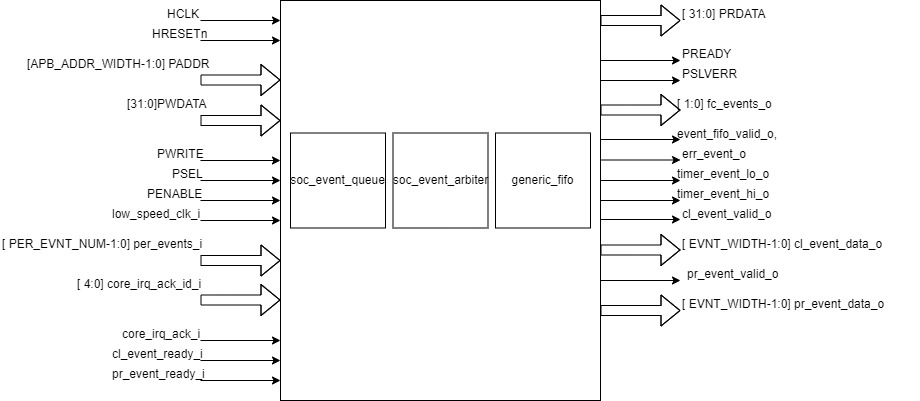

..
   Copyright (c) 2023 OpenHW Group
   Copyright (c) 2024 CircuitSutra

   SPDX-License-Identifier: Apache-2.0 WITH SHL-2.1

.. Level 1
   =======

   Level 2
   -------

   Level 3
   ~~~~~~~

   Level 4
   ^^^^^^^
.. _apb_event_control:

APB EVENT CONTROL
==================
This APB peripheral device collects all the events which are
presented to the CPU as IRQ11 (Machine interrupt). Each event is
individually maskable by the appropriate bit in the REG_MASKx
register. When an enabled event (unmasked) is received it is placed
in an event FIFO and the IRQ11 signal is presented to the CPU which
can then read the REG_FIFO to determine which event caused the
interrupt. Each event has a queue of depth four to collect events if
the queue for any event overflows an error is logged into the
appropriate REG_ERR register and IRQ31 is presented to the CPU.

Features
--------
- Events are generated from the cluster and peripherals and go to
  fabric control. 

- Events are maskable.

- Error register to log error.

THEORY OF OPERATION:
^^^^^^^^^^^^^^^^^^^^

It contains soc_event_queue and soc_event_arbitrator. Events are
stored in an event fifo. The CPU can read the event fifo to
determine which event caused the interrupt.

BLOCK DIAGRAM:
^^^^^^^^^^^^^^^^^^^^

- fc_events_o is a two bit output port which drives the third and fourth bit of peripheral event input (per_events_i).
  peripheral event input (per_events_i).

- Driving valid output signals:

  ○ Fabric control event is said to be valid if there is at least one
  event which is granted by soc_event_arbiter and is not masked.
  Fabric control event valid data is sent to generic_fifo which
  indicates there is valid data available for writing to fifo.

  ○ Cluster event is said to be valid if there is at least one event
  which is
  granted by soc_event_arbiter and is not masked. Cluster event valid
  data is driven through cl_event_valid_o port.

  ○ Peripheral event is said to be valid if there is at least one event
  which is granted by soc_event_arbiter and is not masked. Peripheral
  event valid data is driven through pr_event_valid_o port.

- Readiness of FC, cluster and peripheral:

  ○ Fabric control is said to be ready if the fabric control event is
  valid and generic fifo is ready to accept data.

  ○ Cluster is said to be ready if the cluster event is valid and
  cl_event_ready_i is high.

  ○ Peripheral is said to be ready if the peripheral event is valid and
  pr_event_ready_i is high.

- Register to store events: All the events from peripheral and
  cluster are stored in an internal register. Peripheral events will
  occupy the lower bits and cluster events will occupy the higher bits
  of this register.

  ○ For driving the timer_event_lo_o event at REG_TIMER1_SEL_LO index
  of this register is selected.

  ○ For driving the timer_event_hi_o the event at REG_TIMER1_SEL_HI○
  index of this register is selected
  
  ○ All the events from this register are provided as input to the
  soc_event_queue.

- soc_event_queue:

  ○ soc_event_queue is instantiated for all the events.

  ○ Each event from the cluster and peripherals are provided as input
  to soc_event_queue.

  ○ An event acknowledgement input is provided which specifies○
  acknowledgment of that event by soc_event_arbiter. It is high if
  the event is ready and is acknowledged by the arbiter.

  ○ Total number of events in the queue is updated at every positive edge of the clock if there is a new event or an event acknowledgement.
   - Event count is increased if there is an input event and an event is not acknowledged.
   - Event count is decreased if an event is acknowledged and there is no new input event.
   - Event count is reset at negedge of reset.

  ○ Error will be generated for an event if the event queue is full. Depth of the queue is four. err_event_o is asserted to indicate error in the input events.
  ○ A successful event is generated from the soc_event_queue if the queue is not empty.

- soc_event_arbiter:

  ○ soc_event_arbiter sets priority for the event. Out of the input events it selects the events to be granted.
  ○ It takes output events from soc_event_queue as the input.
  ○ It takes an acknowledgement input which is set to one if fabric control, cluster and peripheral are ready.
  ○ It uses the parallel prefix arbitration method to select events of higher priority. The granted events are sent as output.

- Cluster and peripheral event data output:

  ○ The index of the granted events are sent as output from the soc_event_generator through cl_event_data_o and pr_event_data_o.

- Reset: The model supports active low reset.

- Writing to registers: 

  ○ Data can be written to registers if PSEL, PENABLE and PWRITE are enabled.
  ○ If PSEL and PENABLE is enabled and PWRITE is disabled then error registers(REG_ERR_X) are cleared.

- Generic_fifo: 

  ○ Push operation:
    - A valid high input is sent if there is at least one granted unmasked event. It indicates there is a valid event for writing into fifo.
    - A grant output is sent by the fifo which indicates fifo can accept new data. 
    - Drive zero if fifo is full else drive one.
    - The index of the granted events from the soc_event_arbiter is sent as an input.
  ○ Pop operation:
    - A valid output is sent by the fifo which indicates there is valid data available in fifo for reading. It drives value to event_fifo_valid_o port.
      ○ Drive zero if fifo is empty else drive one.
    - A grant input is sent which indicates if data can be read from fifo. It is set to 1 if acknowledgement from the core(core_irq_ack_i) is positive and core acknowledgement id(core_irq_ack_id_i) is 3.
    - A data output is sent by the fifo. REG_FIFO register can be read to get this data if the fifo is not empty.

APB EVENT CONTROL CSR’s
^^^^^^^^^^^^^^^^^^^^^^^
.. list-table::
   :widths: 10 20 10 10 10 20
   :header-rows: 1

   * - Offset
     - Field
     - Bits
     - Type
     - Default
     - Description
   * - 0x00
     - REG_EVENT
     - 15:0
     - W
     - 0x00
     - 16 bits of software-generated event.
   * - 0x04
     - REG_FC_MASK_0
     - 31:00
     - R/W
     - 0xFFFFFFFF
     - Individual masks for events 0-31 of fc_subsystem (1=mask event).
   * - 0x08
     - REG_FC_MASK_1
     - 31:00
     - R/W
     - 0xFFFFFFFF
     - Individual masks for events 32-63 of fc_subsystem (1=mask event).
   * - 0x0C
     - REG_FC_MASK_2
     - 31:00
     - R/W
     - 0xFFFFFFFF
     - Individual masks for events 64-95 of fc_subsystem (1=mask event).
   * - 0x10
     - REG_FC_MASK_3
     - 31:00
     - R/W
     - 0xFFFFFFFF
     - Individual masks for events 96-127 of fc_subsystem (1=mask event).
   * - 0x14
     - REG_FC_MASK_4
     - 31:00
     - R/W
     - 0xFFFFFFFF
     - Individual masks for events 128-159 of fc_subsystem (1=mask event).
   * - 0x18
     - REG_FC_MASK_5
     - 31:00
     - R/W
     - 0xFFFFFFFF
     - Individual masks for events 160-191 of fc_subsystem (1=mask event).
   * - 0x1C
     - REG_FC_MASK_6
     - 31:00
     - R/W
     - 0xFFFFFFFF
     - Individual masks for events 192-223 of fc_subsystem (1=mask event).
   * - 0x20
     - REG_FC_MASK_7
     - 31:00
     - R/W
     - 0xFFFFFFFF
     - Individual masks for events 224-255 of fc_subsystem (1=mask event).
   * - 0x24
     - REG_CL_MASK_0
     - 31:00
     - R/W
     - 0xFFFFFFFF
     - Individual masks for events 0-31 of clock (1=mask event).
   * - 0x28
     - REG_CL_MASK_1
     - 31:00
     - R/W
     - 0xFFFFFFFF
     - Individual masks for events 31-63 of clock (1=mask event).
   * - 0x2C
     - REG_CL_MASK_2
     - 31:00
     - R/W
     - 0xFFFFFFFF
     - Individual masks for events 64-95 of clock (1=mask event).
   * - 0x30
     - REG_CL_MASK_3
     - 31:00
     - R/W
     - 0xFFFFFFFF
     - Individual masks for events 96-127 of clock (1=mask event).
   * - 0x34
     - REG_CL_MASK_4
     - 31:00
     - R/W
     - 0xFFFFFFFF
     - Individual masks for events 128-159 of clock (1=mask event).
   * - 0x38
     - REG_CL_MASK_5
     - 31:00
     - R/W
     - 0xFFFFFFFF
     - Individual masks for events 160-191 of clock (1=mask event).
   * - 0x3C
     - REG_CL_MASK_6
     - 31:00
     - R/W
     - 0xFFFFFFFF
     - Individual masks for events 192-223 of clock (1=mask event).
   * - 0x40
     - REG_CL_MASK_7
     - 31:00
     - R/W
     - 0xFFFFFFFF
     - Individual masks for events 224-255 of clock (1=mask event).
   * - 0x44
     - REG_PR_MASK_0
     - 31:00
     - R/W
     - 0xFFFFFFFF
     - Individual masks for events 0-31 of peripheral (1=mask event).
   * - 0x48
     - REG_PR_MASK_1
     - 31:00
     - R/W
     - 0xFFFFFFFF
     - Individual masks for events 32-63 of peripheral (1=mask event).
   * - 0x4C
     - REG_PR_MASK_2
     - 31:00
     - R/W
     - 0xFFFFFFFF
     - Individual masks for events 64-95 of peripheral (1=mask event).
   * - 0x50
     - REG_PR_MASK_3
     - 31:00
     - R/W
     - 0xFFFFFFFF
     - Individual masks for events 96-127 of peripheral (1=mask event).
   * - 0x54
     - REG_PR_MASK_4
     - 31:00
     - R/W
     - 0xFFFFFFFF
     - Individual masks for events 128-159 of peripheral (1=mask event).
   * - 0x58
     - REG_PR_MASK_5
     - 31:00
     - R/W
     - 0xFFFFFFFF
     - Individual masks for events 160-191 of peripheral (1=mask event).
   * - 0x5C
     - REG_PR_MASK_6
     - 31:00
     - R/W
     - 0xFFFFFFFF
     - Individual masks for events 192-223 of peripheral (1=mask event).
   * - 0x60
     - REG_PR_MASK_7
     - 31:00
     - R/W
     - 0xFFFFFFFF
     - Individual masks for events 224-255 of peripheral (1=mask event).
   * - 0x64
     - REG_ERR_0
     - 31:00
     - R/W
     - 0x00
     - Error bits for event queue overflow for events 0-31.
   * - 0x68
     - REG_ERR_1
     - 31:00
     - R/W
     - 0x00
     - Error bits for event queue overflow for events 32-63.
   * - 0x6C
     - REG_ERR_2
     - 31:00
     - R/W
     - 0x00
     - Error bits for event queue overflow for events 64-95.
   * - 0x70
     - REG_ERR_3
     - 31:00
     - R/W
     - 0x00
     - Error bits for event queue overflow for events 96-127.
   * - 0x74
     - REG_ERR_4
     - 31:00
     - R/W
     - 0x00
     - Error bits for event queue overflow for events 128-159.
   * - 0x78
     - REG_ERR_5
     - 31:00
     - R/W
     - 0x00
     - Error bits for event queue overflow for events 160-191.
   * - 0x7C
     - REG_ERR_6
     - 31:00
     - R/W
     - 0x00
     - Error bits for event queue overflow for events 192-223.
   * - 0x80
     - REG_ERR_7
     - 31:00
     - R/W
     - 0x00
     - Error bits for event queue overflow for events 224-255.
   * - 0x84
     - REG_TIMER1_SEL_HI
     - 7:0
     - R/W
     - 0x00
     - Specifies which event should be routed to the lo timer.
   * - 0x88
     - REG_TIMER1_SEL_LO
     - 7:0
     - R/W
     - 0x00
     - Specifies which event should be routed to the hi timer.
   * - 0x90
     - REG_FIFO
     - 7:0
     - R
     - 0x00
     - ID of triggering event for interrupt handler.