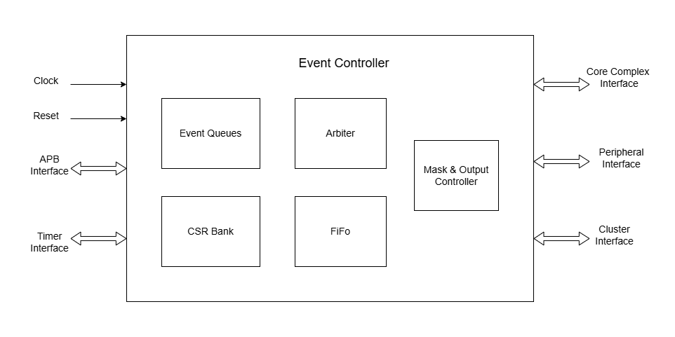
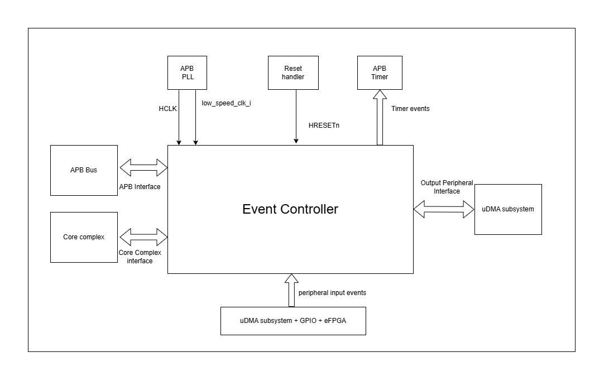
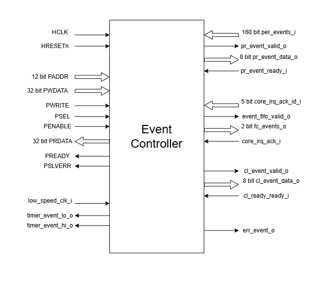

..
   Copyright (c) 2023 OpenHW Group
   Copyright (c) 2024 CircuitSutra

   SPDX-License-Identifier: Apache-2.0 WITH SHL-2.1

.. Level 1
   =======

   Level 2
   -------

   Level 3
   ~~~~~~~

   Level 4
   ^^^^^^^
.. _apb_event_control:

APB EVENT CONTROL
==================

The SOC Event Controller module serves as a centralized event management system for CORE-V-MCU.
It handles the routing and prioritization of events from peripherals to various destinations through configurable masks and an arbitration mechanism.

Features
--------
  - Support for multiple event sources:
      - Peripheral events (up to 256 configurable inputs, 160 currently implemented)
      - APB-generated events (up to 32 events, 8 currently implemented)
      - Low-speed clock events
  - Three configurable output event channels:
      - FC (Fabric Controller/Core Complex) events
      - CL (Cluster) events
      - PR (Peripheral) events
  - Event masking capability for each output channel
  - Timer event generation with selectable event sources
  - FIFO-based event buffering for each input event with FIFO overflow error reporting
  - Priority-based event arbitration

Block Architecture
------------------

APB event controller is designed to route interrupts comming from multiple event sources to the core-complex, uDMA Subsystem and eFGA subsystem.
Based on TIMER1_SEL_HI and TIMER1_SEL_HI CSR configuration, events coming from multiple event sources can be routed to APB Timer unit as well.
Below is the block diagram of APB event controller:

   APB Event Controller Block Diagram

APB event controller has three category of event sources, each of these sources are explained below: -
  - **Peripheral Events**
      These events are generated by uDMA subsystem, eFPGA cluster and GPIO. Up to 256 peripheral events can be supported, however, the current implementation only supports 160 events.
      Each peripheral event is represented by a dedicated input signal(per_events_i[159:0]), where:

        - per_events_i[111:0] are used for uDMA events
        - per_events_i[127:112] are used for eFPGA cluster events
        - per_events_i[159:128] are used for GPIO events

  - **APB Events**
      APB events are software events, that can be generated by configuring the EVENT CSR. Up to 32 APB-generated events can be supported, however, the current implementation only supports 8 APB events.
  - **Low-Speed Clock Events**
      Low-Speed Clock Event is provied by APB PLL. This event is generated by APB PLL at frequency of APB PLL’s ref_clk_o clock.

The above 3 events sources combined result in 169 (160(Peripheral events) + 8 APB events + 1 (low speed clock event)) event.

Each input event is allocated an ID. The below table shows the mapping of the event sources with input pins of the ABP event controller and event IDs associated for each source.

+-------------------------------------+----------------------------+------------+--------------------------------------+
| Event source                        | Event controller input pin | Event ID   | description                          |
+=====================================+============================+============+======================================+
| APB FLL's ref_clk_o                 | low_speed_clk_i            | 0          | low-speed clock(ref_clk) from APB FLL|
+-------------------------------------+----------------------------+------------+--------------------------------------+
| APB Event controller's EVENT CSR    | NA                         | 1          | Software generated events through    |
|                                     |                            |            | EVENT CSR's bit 0                    |
+-------------------------------------+----------------------------+------------+--------------------------------------+
| APB Event controller's EVENT CSR    | NA                         | 2          | Software generated events through    |
|                                     |                            |            | EVENT CSR's bit 1                    |
+-------------------------------------+----------------------------+------------+--------------------------------------+
| APB Event controller's EVENT CSR    | NA                         | 3          | Software generated events through    |
|                                     |                            |            | EVENT CSR's bit 2                    |
+-------------------------------------+----------------------------+------------+--------------------------------------+
| APB Event controller's EVENT CSR    | NA                         | 4          | Software generated events through    |
|                                     |                            |            | EVENT CSR's bit 3                    |
+-------------------------------------+----------------------------+------------+--------------------------------------+
| APB Event controller's EVENT CSR    | NA                         | 5          | Software generated events through    |
|                                     |                            |            | EVENT CSR's bit 4                    |
+-------------------------------------+----------------------------+------------+--------------------------------------+
| APB Event controller's EVENT CSR    | NA                         | 6          | Software generated events through    |
|                                     |                            |            | EVENT CSR's bit 5                    |
+-------------------------------------+----------------------------+------------+--------------------------------------+
| APB Event controller's EVENT CSR    | NA                         | 7          | Software generated events through    |
|                                     |                            |            | EVENT CSR's bit 6                    |
+-------------------------------------+----------------------------+------------+--------------------------------------+
| APB Event controller's EVENT CSR    | NA                         | 8          | Software generated events through    |
|                                     |                            |            | EVENT CSR's bit 7                    |
+-------------------------------------+----------------------------+------------+--------------------------------------+
| uDMA Core's rx_lin_events_o[0]      | per_events_i[0]            | 9          | RX channel event  for uDMA UART 0    |
|                                     |                            |            | generated by uDMA Core               |
+-------------------------------------+----------------------------+------------+--------------------------------------+
| uDMA Core's tx_lin_events_o[0]      | per_events_i[1]            | 10         | TX channel event  for uDMA UART 0    |
|                                     |                            |            | generated by uDMA Core               |
+-------------------------------------+----------------------------+------------+--------------------------------------+
| uDMA UART 0's rx_char_event_o       | per_events_i[2]            | 11         | RX event from uDMA UART 0            | 
+-------------------------------------+----------------------------+------------+--------------------------------------+
| uDMA UART 0's err_event_o           | per_events_i[3]            | 12         | Error event from uDMA UART 0         | 
+-------------------------------------+----------------------------+------------+--------------------------------------+
| uDMA Core's rx_lin_events_o[1]      | per_events_i[4]            | 13         | RX channel event  for uDMA UART 1    |
|                                     |                            |            | generated by uDMA Core               |
+-------------------------------------+----------------------------+------------+--------------------------------------+
| uDMA Core's tx_lin_events_o[1]      | per_events_i[5]            | 14         | TX channel event  for uDMA UART 1    |
|                                     |                            |            | generated by uDMA Core               |
+-------------------------------------+----------------------------+------------+--------------------------------------+
| uDMA UART 1's rx_char_event_o       | per_events_i[6]            | 15         | RX event from uDMA UART 1            | 
+-------------------------------------+----------------------------+------------+--------------------------------------+
| uDMA UART 1's err_event_o           | per_events_i[7]            | 16         | Error event from uDMA UART 1         | 
+-------------------------------------+----------------------------+------------+--------------------------------------+
| uDMA Core's rx_lin_events_o[2]      | per_events_i[8]            | 17         | RX channel event  from QSPI 0        |
|                                     |                            |            | generated by uDMA Core               |
+-------------------------------------+----------------------------+------------+--------------------------------------+
| uDMA Core's tx_lin_events_o[2]      | per_events_i[9]            | 18         | TX channel event  from QSPI 0        |
|                                     |                            |            | generated by uDMA Core               |
+-------------------------------------+----------------------------+------------+--------------------------------------+
| uDMA Core's tx_lin_events_o[4]      | per_events_i[10]           | 19         | TX channel command events for QSPI 0 |
|                                     |                            |            | generated by uDMA Core               |
+-------------------------------------+----------------------------+------------+--------------------------------------+
| uDMA QSPI 0's spi_eot_o             | per_events_i[11]           | 20         | End of transmission event from QSPI 0|
+-------------------------------------+----------------------------+------------+--------------------------------------+
| uDMA Core's rx_lin_events_o[3]      | per_events_i[12]           | 21         | RX channel event  from QSPI 1        |
|                                     |                            |            | generated by uDMA Core               |
+-------------------------------------+----------------------------+------------+--------------------------------------+
| uDMA Core's tx_lin_events_o[3]      | per_events_i[13]           | 22         | TX channel event  from QSPI 1        |
|                                     |                            |            | generated by uDMA Core               |
+-------------------------------------+----------------------------+------------+--------------------------------------+
| uDMA Core's tx_lin_events_o[5]      | per_events_i[14]           | 23         | TX channel command events for QSPI 1 |
|                                     |                            |            | generated by uDMA Core               |
+-------------------------------------+----------------------------+------------+--------------------------------------+
| uDMA QSPI 1's spi_eot_o             | per_events_i[15]           | 24         | End of transmission event from QSPI 1|
+-------------------------------------+----------------------------+------------+--------------------------------------+
| uDMA Core's rx_lin_events_o[4]      | per_events_i[16]           | 25         | RX channel event  for I2C Master 0   |
|                                     |                            |            | generated by uDMA Core               |
+-------------------------------------+----------------------------+------------+--------------------------------------+
| uDMA Core's tx_lin_events_o[6]      | per_events_i[17]           | 26         | TX channel event  for I2C Master 0   |
|                                     |                            |            | generated by uDMA Core               |
+-------------------------------------+----------------------------+------------+--------------------------------------+
|                                     | per_events_i[18]           | 27         | Always 0 in current implementation   |
+-------------------------------------+----------------------------+------------+--------------------------------------+
|                                     | per_events_i[19]           | 28         | Always 0 in current implementation   |
+-------------------------------------+----------------------------+------------+--------------------------------------+
| uDMA Core's rx_lin_events_o[5]      | per_events_i[20]           | 29         | RX channel event  for I2C Master 1   |
|                                     |                            |            | generated by uDMA Core               |
+-------------------------------------+----------------------------+------------+--------------------------------------+
| uDMA Core's tx_lin_events_o[7]      | per_events_i[21]           | 30         | TX channel event  for I2C Master 1   |
|                                     |                            |            | generated by uDMA Core               |
+-------------------------------------+----------------------------+------------+--------------------------------------+
|                                     | per_events_i[22]           | 31         | Always 0 in current implementation   |
+-------------------------------------+----------------------------+------------+--------------------------------------+
|                                     | per_events_i[23]           | 32         | Always 0 in current implementation   |
+-------------------------------------+----------------------------+------------+--------------------------------------+
| uDMA Core's rx_lin_events_o[6]      | per_events_i[24]           | 33         | RX channel event  for uDMA SDIO      |
|                                     |                            |            | generated by uDMA Core               |
+-------------------------------------+----------------------------+------------+--------------------------------------+
| uDMA Core's tx_lin_events_o[8]      | per_events_i[25]           | 34         | TX channel event  for uDMA SDIO      |
|                                     |                            |            | generated by uDMA Core               |
+-------------------------------------+----------------------------+------------+--------------------------------------+
| uDMA SDIO's eot_o                   | per_events_i[26]           | 35         | End of transmission event from SDIO  |
+-------------------------------------+----------------------------+------------+--------------------------------------+
| uDMA SDIO's err_o                   | per_events_i[27]           | 36         | Error event from SDIO                |
+-------------------------------------+----------------------------+------------+--------------------------------------+
| uDMA Core's rx_lin_events_o[7]      | per_events_i[28]           | 37         | RX channel event  for uDMA CAM       |
|                                     |                            |            | generated by uDMA Core               |
+-------------------------------------+----------------------------+------------+--------------------------------------+
|                                     | per_events_i[29]           | 38         | Always 0 in current implementation   |
+-------------------------------------+----------------------------+------------+--------------------------------------+
|                                     | per_events_i[30]           | 39         | Always 0 in current implementation   |
+-------------------------------------+----------------------------+------------+--------------------------------------+
|                                     | per_events_i[31]           | 40         | Always 0 in current implementation   |
+-------------------------------------+----------------------------+------------+--------------------------------------+
| uDMA Filter's eot_event_o           | per_events_i[32]           | 41         | End of transmission event from Filter|
+-------------------------------------+----------------------------+------------+--------------------------------------+
| uDMA Filter's act_event_o           | per_events_i[33]           | 42         | Activation event from Filter         |
+-------------------------------------+----------------------------+------------+--------------------------------------+
|                                     | per_events_i[34]           | 43         | Always 0 in current implementation   |
+-------------------------------------+----------------------------+------------+--------------------------------------+
|                                     | per_events_i[35]           | 44         | Always 0 in current implementation   |
+-------------------------------------+----------------------------+------------+--------------------------------------+
| eFPGA subsystem's efpga_events_o[0] | per_events_i[112]          | 121        | eFPGA output event pin 0             |
+-------------------------------------+----------------------------+------------+--------------------------------------+
| eFPGA subsystem's efpga_events_o[1] | per_events_i[113]          | 122        | eFPGA output event pin 1             |
+-------------------------------------+----------------------------+------------+--------------------------------------+
| eFPGA subsystem's efpga_events_o[2] | per_events_i[114]          | 123        | eFPGA output event pin 2             |
+-------------------------------------+----------------------------+------------+--------------------------------------+
| eFPGA subsystem's efpga_events_o[3] | per_events_i[115]          | 124        | eFPGA output event pin 3             |
+-------------------------------------+----------------------------+------------+--------------------------------------+
| eFPGA subsystem's efpga_events_o[4] | per_events_i[116]          | 125        | eFPGA output event pin 4             |
+-------------------------------------+----------------------------+------------+--------------------------------------+
| eFPGA subsystem's efpga_events_o[5] | per_events_i[117]          | 126        | eFPGA output event pin 5             |
+-------------------------------------+----------------------------+------------+--------------------------------------+
| eFPGA subsystem's efpga_events_o[6] | per_events_i[118]          | 127        | eFPGA output event pin 6             |
+-------------------------------------+----------------------------+------------+--------------------------------------+
| eFPGA subsystem's efpga_events_o[7] | per_events_i[119]          | 128        | eFPGA output event pin 7             |
+-------------------------------------+----------------------------+------------+--------------------------------------+
| eFPGA subsystem's efpga_events_o[8] | per_events_i[120]          | 129        | eFPGA output event pin 8             |
+-------------------------------------+----------------------------+------------+--------------------------------------+
| eFPGA subsystem's efpga_events_o[9] | per_events_i[121]          | 130        | eFPGA output event pin 9             |
+-------------------------------------+----------------------------+------------+--------------------------------------+
| eFPGA subsystem's efpga_events_o[10]| per_events_i[122]          | 131        | eFPGA output event pin 10            |
+-------------------------------------+----------------------------+------------+--------------------------------------+
| eFPGA subsystem's efpga_events_o[11]| per_events_i[123]          | 132        | eFPGA output event pin 11            |
+-------------------------------------+----------------------------+------------+--------------------------------------+
| eFPGA subsystem's efpga_events_o[12]| per_events_i[124]          | 133        | eFPGA output event pin 12            |
+-------------------------------------+----------------------------+------------+--------------------------------------+
| eFPGA subsystem's efpga_events_o[13]| per_events_i[125]          | 134        | eFPGA output event pin 13            |
+-------------------------------------+----------------------------+------------+--------------------------------------+
| eFPGA subsystem's efpga_events_o[14]| per_events_i[126]          | 135        | eFPGA output event pin 14            |
+-------------------------------------+----------------------------+------------+--------------------------------------+
| eFPGA subsystem's efpga_events_o[15]| per_events_i[127]          | 136        | eFPGA output event pin 15            |
+-------------------------------------+----------------------------+------------+--------------------------------------+
| APB GPIO's interrupt[0]             | per_events_i[128]          | 137        | Interrupt for GPIO pin 0             |
+-------------------------------------+----------------------------+------------+--------------------------------------+
| APB GPIO's interrupt[1]             | per_events_i[129]          | 138        | Interrupt for GPIO pin 1             |
+-------------------------------------+----------------------------+------------+--------------------------------------+
| APB GPIO's interrupt[2]             | per_events_i[130]          | 139        | Interrupt for GPIO pin 2             |
+-------------------------------------+----------------------------+------------+--------------------------------------+
| APB GPIO's interrupt[3]             | per_events_i[131]          | 140        | Interrupt for GPIO pin 3             |
+-------------------------------------+----------------------------+------------+--------------------------------------+
| APB GPIO's interrupt[4]             | per_events_i[132]          | 141        | Interrupt for GPIO pin 4             |
+-------------------------------------+----------------------------+------------+--------------------------------------+
| APB GPIO's interrupt[5]             | per_events_i[133]          | 142        | Interrupt for GPIO pin 5             |
+-------------------------------------+----------------------------+------------+--------------------------------------+
| APB GPIO's interrupt[6]             | per_events_i[134]          | 143        | Interrupt for GPIO pin 6             |
+-------------------------------------+----------------------------+------------+--------------------------------------+
| APB GPIO's interrupt[7]             | per_events_i[135]          | 144        | Interrupt for GPIO pin 7             |
+-------------------------------------+----------------------------+------------+--------------------------------------+
| APB GPIO's interrupt[8]             | per_events_i[136]          | 145        | Interrupt for GPIO pin 8             |
+-------------------------------------+----------------------------+------------+--------------------------------------+
| APB GPIO's interrupt[9]             | per_events_i[137]          | 146        | Interrupt for GPIO pin 9             |
+-------------------------------------+----------------------------+------------+--------------------------------------+
| APB GPIO's interrupt[10]            | per_events_i[138]          | 147        | Interrupt for GPIO pin 10            |
+-------------------------------------+----------------------------+------------+--------------------------------------+
| APB GPIO's interrupt[11]            | per_events_i[139]          | 148        | Interrupt for GPIO pin 11            |
+-------------------------------------+----------------------------+------------+--------------------------------------+
| APB GPIO's interrupt[12]            | per_events_i[140]          | 149        | Interrupt for GPIO pin 12            |
+-------------------------------------+----------------------------+------------+--------------------------------------+
| APB GPIO's interrupt[13]            | per_events_i[141]          | 150        | Interrupt for GPIO pin 13            |
+-------------------------------------+----------------------------+------------+--------------------------------------+
| APB GPIO's interrupt[14]            | per_events_i[142]          | 151        | Interrupt for GPIO pin 14            |
+-------------------------------------+----------------------------+------------+--------------------------------------+
| APB GPIO's interrupt[15]            | per_events_i[143]          | 152        | Interrupt for GPIO pin 15            |
+-------------------------------------+----------------------------+------------+--------------------------------------+
| APB GPIO's interrupt[16]            | per_events_i[144]          | 153        | Interrupt for GPIO pin 16            |
+-------------------------------------+----------------------------+------------+--------------------------------------+
| APB GPIO's interrupt[17]            | per_events_i[145]          | 153        | Interrupt for GPIO pin 17            |
+-------------------------------------+----------------------------+------------+--------------------------------------+
| APB GPIO's interrupt[18]            | per_events_i[146]          | 153        | Interrupt for GPIO pin 18            |
+-------------------------------------+----------------------------+------------+--------------------------------------+
| APB GPIO's interrupt[19]            | per_events_i[147]          | 153        | Interrupt for GPIO pin 19            |
+-------------------------------------+----------------------------+------------+--------------------------------------+
| APB GPIO's interrupt[20]            | per_events_i[148]          | 153        | Interrupt for GPIO pin 20            |
+-------------------------------------+----------------------------+------------+--------------------------------------+
| APB GPIO's interrupt[21]            | per_events_i[149]          | 153        | Interrupt for GPIO pin 21            |
+-------------------------------------+----------------------------+------------+--------------------------------------+
| APB GPIO's interrupt[22]            | per_events_i[150]          | 153        | Interrupt for GPIO pin 22            |
+-------------------------------------+----------------------------+------------+--------------------------------------+
| APB GPIO's interrupt[23]            | per_events_i[151]          | 153        | Interrupt for GPIO pin 23            |
+-------------------------------------+----------------------------+------------+--------------------------------------+
| APB GPIO's interrupt[24]            | per_events_i[152]          | 153        | Interrupt for GPIO pin 24            |
+-------------------------------------+----------------------------+------------+--------------------------------------+
| APB GPIO's interrupt[25]            | per_events_i[153]          | 153        | Interrupt for GPIO pin 25            |
+-------------------------------------+----------------------------+------------+--------------------------------------+
| APB GPIO's interrupt[26]            | per_events_i[154]          | 153        | Interrupt for GPIO pin 26            |
+-------------------------------------+----------------------------+------------+--------------------------------------+
| APB GPIO's interrupt[27]            | per_events_i[155]          | 153        | Interrupt for GPIO pin 27            |
+-------------------------------------+----------------------------+------------+--------------------------------------+
| APB GPIO's interrupt[28]            | per_events_i[156]          | 153        | Interrupt for GPIO pin 28            |
+-------------------------------------+----------------------------+------------+--------------------------------------+
| APB GPIO's interrupt[29]            | per_events_i[157]          | 153        | Interrupt for GPIO pin 29            |
+-------------------------------------+----------------------------+------------+--------------------------------------+
| APB GPIO's interrupt[30]            | per_events_i[158]          | 153        | Interrupt for GPIO pin 30            |
+-------------------------------------+----------------------------+------------+--------------------------------------+
| APB GPIO's interrupt[31]            | per_events_i[159]          | 153        | Interrupt for GPIO pin 31            |
+-------------------------------------+----------------------------+------------+--------------------------------------+

Note: per_events_i[36:111] are not used in current implementation and are not connected anywhere thereby being in an undefined state.

The APB event controller maintains an event queue per event source to store the event from that source.
Each queue can hold up to 3 events, this means, APB event controller has 169 queues, each having a depth of 3.
The APB Timer uses ERR_* CSR to reports errors when a queue overflows occurs and new events of that source will be missed and the err_event_o signal is also asserted to indicate the same.
A read to the ERR_* CSR can clear the ERR_* CSR and deasserts the err_event_o signal.

The APB event controller, when any event queue has events, notifies an internal arbitrator to choose an event from the list of available events.
The functionality of arbitor is explained in the :ref:`APB event arbitrator<apb_event_arbiter>` section.
If the event, selected by the APB event arbiter, is unmasked in the mask CSR(refer to the event masking section), the event is broadcasted to all output channels provided that the output channel is ready to accept the event.
APB event controller routes events to the following ouput channels:

- **FC Channel (Fabric Controller / Core Complex):**

FC Channel is responsible to communicate events to the Fabric Controller.
The APB event controller use following approach to notify events to the Fabric Controller:

  - Pin based high priority event notification: Routes high-priority events to the Fabric Controller through fc_events_o pin. This feature is not implemented in the current version hence out of scope for this manual.
  - FIFO based event notification: Events are accumulated in FIFO and event_fifo_valid_o signal is raised to notify events to Fabric Controller. 

Whenever a valid event is present for FC channel, it is pushed onto the FC FIFO. The FC FIFO is a 4-entry queue that holds events until they are read by the Fabric Controller.
When an event is available is the FC FIFO, the APB event controller raises event_fifo_valid_o signal to the Fabric Controller. In response to the signal,  Fabric Controller can read the event ID through the FIFO CSR.
Once the event is read, the Fabric Controller can acknowledge it by asserting ``core_irq_ack_i = 1`` and setting ``core_irq_ack_id_i = 11``.
The event is then popped from the FC FIFO and next event is placed on the FIFO CSR.
The event_fifo_valid_o signal is deasserted once the FC FIFO is empty.

- **CL Channel (Cluster / eFPGA):**

CL channel is responsible for routing events to the cluster/eFPGA. Whenever a valid event (event is granted by the arbiter and unmasked) is available for CL channel,
the APB event controller checks whether the CL channel is ready to accept (cl_event_ready_i pin is asserted) event or not.
If cl_event_ready_i pin is asserted by the ePFGA, the APB event controller writes event ID on cl_event_data_o pin and asserts cl_event_valid_o to signal that a valid event ID is available for processing.

Note: This feature is not supported in the current implementation and above pins are left unconnected.

- **PR Channel (Peripheral):**

PR channel is responsible for routing events to uDMA subsystem. Whenever a valid event (event is granted by the arbiter and unmasked) is available for PR channel,
the APB event controller checks whether the PR channel is ready to accept (pr_event_ready_i pin is asserted) event or not.
If pr_event_ready_i pin is asserted by the uDMA subsystem, the APB event controller writes event ID on pr_event_data_o pin and asserts pr_event_valid_o to signal that a valid event ID is available for processing.

Output channel readiness can be summarised as below:
  - pr_event_ready_i is asserted for PR channel
  - cl_event_ready_i is asserted for CL channel
  - FC Channel is considered ready if FIFO is not full

An ack is issued to arbiter after event is accecpted by any of the output channel. After receiving the ack, arbiter tries to find next most eligible event from the list of available events.
The event will only be popped from the queue if there is a valid channel that has accepted the event, otherwise event will be not be popped from the queue.
If the event is masked for all output channels, it is popped and discarded from the queue. The controller proceeds to the next event.

Event Masking
~~~~~~~~~~~~~
The event controller provides configurable masking for each output channel (FC, CL, PR) to control which events are routed to the respective channels.
The masking is done using 8 32-bit mask CSRs for each of the 3 output channels(FC, CL, PR), where each bit corresponds to an event source.
  
- The mask CSRs are:
    - FC_MASK_x {x = 0:7} for Fabric Controller channel
    - CL_MASK_x {x = 0:7} for Cluster channel
    - PR_MASK_x {x = 0:7} for Peripheral channel

By default, all events are masked, meaning no events are routed until explicitly configured via mask CSR.
When an event is granted and an output channel is ready, the event is routed only if the corresponding mask bit is 0 (unmasked) in the respective channel's mask CSR.
For example, let's say that an event from the GPIO peripheral needs to be routed to the cluster(eFPGA) channel, then the respective mask bit in the CL_MASK_* CSR must be set to 0 (unmasked) for that event ID and it should be set to 1 (masked) in the FC_MASK_* and PR_MASK_* CSRs to prevent routing to those channels.
If the event is masked for all output channels, it is popped and discarded from the queue. The controller proceeds to the next event.

.. _apb_event_arbiter:

Event arbiter
~~~~~~~~~~~~~

The SOC Event Controller efficiently manages multiple simultaneous event requests by using a round-robin priority scheme.
This ensures fairness by cycling through requests, giving each an equal chance to be serviced. When an event is granted, the priority shifts to the next position in a circular manner.
This priority update only happens after the granted event has been acknowledged by the controller, maintaining a smooth and equitable flow of event processing.

FC FIFO
~~~~~~~

The FC FIFO is a 4-entry queue, housed within the APB event controller, that holds events until they are read by the Fabric Controller.
The FIFO is used to store 8-bits wide event ID of the event that is being routed to the Fabric Controller.

Push Operation
^^^^^^^^^^^^^^
  - When an event is granted for the FC channel and the FIFO has available space, the event ID is pushed into the FC FIFO.
  - The FIFO indicates that it has available space by asserting the grant_o signal. The grant_o is an internal signal and is not visible outside the APB event controller.
  - When the FIFO is full, the grant_o signal is deasserted, indicating that no more events can be pushed into the FIFO until space becomes available.

Pop Operation
^^^^^^^^^^^^^
  - The FIFO valid signal ``event_fifo_valid_o`` is asserted when there is at least one event in the FIFO, indicating that the Fabric Controller can read the event.
  - The events in the FIFO are exposed to the Fabric Controller through the FIFO CSR.
  - The Fabric Controller must first acknowledge the interrupt by asserting ``core_irq_ack_i = 1`` and setting ``core_irq_ack_id_i = 11``. This signals readiness to process the interrupt.
  - Once the acknowledgment is received, the event on the top of the FIFO is placed on the FIFO CSR and popped from the FIFO.
  - If the FIFO was previously full, deassertion of ``grant_o`` prevents new events from being written. After the event is acknowledged and popped, space becomes available, and ``grant_o`` is asserted again.
  - The ``event_fifo_valid_o`` signal is deasserted when the FIFO becomes empty, indicating there are no more events to read.

Event Routing Process
^^^^^^^^^^^^^^^^^^^^^

The output routing for incoming events can be summarised as:

1. **Event Queueing:**
   - All incoming events (169 in total) are first captured and stored in their respective queue inside the Event Controller.

2. **Arbitration:**
   - An internal **arbiter** evaluates all queued events.
   - Based on priority, the arbiter selects and **grants** one event for output processing.

3. **Event ID Placement on Output Channels:**
   - The **event ID** (based on its position in the input event vector) is provisionally placed on:

      - ``cl_event_data_o`` (eFPGA subsystem)
      - ``pr_event_data_o`` (uDMA subsystem)
      - FC FIFO (if space is available and the event is not masked)

4. **Mask CSR Evaluation:**
   - The event is checked against the **MASK CSRs** of each output channel:

      - ``FC_MASK_*``, ``CL_MASK_*``, and ``PR_MASK_*``

   - If the event is **masked for all output channels**, it is **popped** and **discarded** from the queue. The controller proceeds to the next event.

5. **Output Channel Readiness Check:**
   - For each output channel where the event is **unmasked**, the controller checks if the corresponding channel is **ready**:

      - ``pr_event_ready_i`` for PR channel
      - ``cl_event_ready_i`` for CL channel
      - **FC Channel:** Ready if FIFO is not full

6. **Valid Signal Assertion:**
   - If the event is **unmasked and granted**, the corresponding **valid signal** for that output channel is asserted.
   - This signals that the output channel may process the event ID.

7. **Event Dequeueing (Pop):**
   - If any valid output channel has accepted the event, it is **popped** from the event queue.

Example: Routing a uDMA UART RX Event (Event ID 15) to Core Complex
-------------------------------------------------------------------

Let’s walk through an example where a **UART peripheral receives data**, triggering a **uDMA RX event** which needs to be routed to the Fabric Controller (FC) for processing:

**Source Event:**

- **uDMA UART RX Event**
- **Event ID:** 15
- **Input Pin:** ``per_events_i[6]``

Event Routing Flow:

1. **Event Detection:**
    - ``per_events_i[6]`` is asserted, triggering internal event ID 15.

2. **Event Queueing and Arbitration:**
    - Event 15 is captured and queued by the controller.
    - The arbiter processes all the available input events in the top of the 169 input event queues and eventually grants event 15(uDMA RX event) for output.

3. **Mask Evaluation:**
    - ``FC_MASK_0``'s bit 15 is cleared (unmasked), meaning it is valid for the FC channel.
    - ``PR_MASK_0``'s bit 15 and ``CL_MASK_0``'s bit 15 will be set(masked),as the event is only meant for Fabric Controller in this example.

4. **Channel Readiness:**
    - If the FC FIFO has available space(indicated by asserting grant_o signal by the FIFO), then the FC channel is considered ready to accept event.

5. **Valid Signal Assertion:**
    - Because the granted event is unmasked for FC channel and the FIFO is ready to accept the event, the event is popped from the internal event queue.
    - It is pushed into the FC FIFO.
    - The first event in the FC FIFO is placed on the ``FIFO`` CSR.

6. **Core Reads Event:**
    - The Fabric Controller reads the event from the FC FIFO through the ``FIFO`` CSR.
    - The event is acknowledged by the Fabric Controller by asserting ``core_irq_ack_i`` and setting ``core_irq_ack_id_i = 11``.
    - The event is then popped from the FC FIFO, and the next event(if any) is placed on the ``FIFO`` CSR.

APB Timer Events
~~~~~~~~~~~~~~~~
In addition to routing events to the FC, CL, and uDMA subsystems, the APB event controller can also route events to the APB Timer module of the CORE-V-MCU.
When the APB event controller receives an event(peripheral, APB or Low-Speed Clock Event ), it not only places it into the event queue but also checks whether the event ID matches the values programmed in the TIMER1_SEL_HI and TIMER1_SEL_LO CSRs.
If the event ID matches the value in TIMER1_SEL_HI CSR, the APB event controller drives the event value on the timer_event_hi_o pin.
If the event ID matches the value in TIMER1_SEL_LO, it drives the event value on the timer_event_lo_o pin.
These events are also queued in the input event queues, allowing them to be routed to other output channels as needed.

System Architecture
-------------------

   APB Event Controller CORE-V-MCU connections diagram

Programming View Model
----------------------
The SOC Event Controller is programmed through an APB interface with a 4KB address space. The key programming interfaces include:

Control Flow
~~~~~~~~~~~~
  - Event Generation: Events can be generated from peripherals (160 sources), software (8 sources), or low-speed clock
  - Event Masking: Events can be selectively masked for each output channel using 256-bit mask CSRs
  - Event Routing: Events are arbitrated and routed to the appropriate output channels
  - Error Handling: Event processing errors are detected and reported through error CSRs
  - Timer Control: Two timer event signals can be generated from any event source

Programming Interface
~~~~~~~~~~~~~~~~~~~~~
  - Software Event Generation: Write to EVENT CSR
  - Event Masking: Configure FC_MASK, CL_MASK, and PR_MASK CSRs
  - Event Arbitration: The arbiter resolves concurrent events using a parallel prefix network with round-robin priority
  - Timer Event Selection: Configure TIMER1_SEL_HI and TIMER1_SEL_LO CSRs
  - Error Monitoring: Read ERR CSRs to detect event handling errors
  - Error Clearing: Clear errors by reading from the corresponding ERR CSRs
  - Event FIFO Access: Read from FIFO CSR to retrieve buffered event

APB Event Control CSR
---------------------

Refer to :ref:`Memory Map <memory_map>` for peripheral domain address of the APB Event Controller.

The APB Event Controller has a 4KB address space and the CSR interface designed using the APB protocol. There are 24 32-bit CSRs for event masking, 8 CSRs each for FC, CL and PR channels i.e. 256 bits per channel, giving the ability to mask 256 events per channel. 
However, only 169 events are implemented in the current version of the design, Hence only the first 169 bits across the 8 CSRs (from 0th to 5th CSR) of the mask CSRs are functional.
The same applies for the ERR_* CSRs, which are used to report overflow errors for the event queues. The ERR_* CSRs are 32 bits wide and only the first 169 bits across the 8 CSRs (from 0th to 5th CSR) are functional in the current version of the design.

NOTE: Several of the Event Controller CSR are volatile, meaning that their read value may be changed by the hardware.
For example, the ERR_0 CSR will specify if any of queue for event IDs 0-31 have overflow error, these CSRs are not writable and read return the error status and then clear the CSR.
As the name suggests, the value of non-volatile CSRs is not changed by the hardware. These CSRs retain the last value writen by software.
A CSRs volatility is indicated by its "type".

Details of CSR access type are explained :ref:`here <memory_map>`.

EVENT    
~~~~~
  - Offset: 0x00
  - Type: non-volatile
  
+------------------+------+--------+---------+------------------------------+
| Field            | Bits | Access | Default | Description                  |
+==================+======+========+=========+==============================+
| EVENT            | 7:0  | WO     | 0x00    | 8 bits of software-          |
|                  |      |        |         | generated event.             |
+------------------+------+--------+---------+------------------------------+

FC_MASK_0
~~~~~~~~~
  - Offset: 0x04
  - Type: non-volatile
  
+------------------+------+--------+------------+------------------------------+
| Field            | Bits | Access | Default    | Description                  |
+==================+======+========+============+==============================+
| MASK             | 31:0 | RW     | 0xFFFFFFFF | Individual masks for         |
|                  |      |        |            | events 0-31 of core complex  |
|                  |      |        |            | (1=mask event).              |
+------------------+------+--------+------------+------------------------------+

FC_MASK_1
~~~~~~~~~
  - Offset: 0x08
  - Type: non-volatile
  
+------------------+------+--------+------------+------------------------------+
| Field            | Bits | Access | Default    | Description                  |
+==================+======+========+============+==============================+
| MASK             | 31:0 | RW     | 0xFFFFFFFF | Individual masks for         |
|                  |      |        |            | events 32-63 of core complex |
|                  |      |        |            | (1=mask event).              |
+------------------+------+--------+------------+------------------------------+

FC_MASK_2
~~~~~~~~~
  - Offset: 0x0C
  - Type: non-volatile
  
+------------------+------+--------+------------+------------------------------+
| Field            | Bits | Access | Default    | Description                  |
+==================+======+========+============+==============================+
| MASK             | 31:0 | RW     | 0xFFFFFFFF | Individual masks for         |
|                  |      |        |            | events 64-95 of core complex |
|                  |      |        |            | (1=mask event).              |
+------------------+------+--------+------------+------------------------------+

FC_MASK_3
~~~~~~~~~
  - Offset: 0x10
  - Type: non-volatile
  
+------------------+------+--------+------------+------------------------------+
| Field            | Bits | Access | Default    | Description                  |
+==================+======+========+============+==============================+
| MASK             | 31:0 | RW     | 0xFFFFFFFF | Individual masks for         |
|                  |      |        |            | events 96-127 of core complex|
|                  |      |        |            | (1=mask event).              |
+------------------+------+--------+------------+------------------------------+

FC_MASK_4
~~~~~~~~~
  - Offset: 0x14
  - Type: non-volatile
  
+------------------+------+--------+------------+------------------------------+
| Field            | Bits | Access | Default    | Description                  |
+==================+======+========+============+==============================+
| MASK             | 31:0 | RW     | 0xFFFFFFFF | Individual masks for         |
|                  |      |        |            | events 128-159 of            |
|                  |      |        |            | core complex (1=mask event). |
+------------------+------+--------+------------+------------------------------+

FC_MASK_5
~~~~~~~~~
  - Offset: 0x18
  - Type: non-volatile
  
+------------------+------+--------+------------+------------------------------+
| Field            | Bits | Access | Default    | Description                  |
+==================+======+========+============+==============================+
| MASK             | 31:0 | RW     | 0xFFFFFFFF | Individual masks for         |
|                  |      |        |            | events 160-191 of            |
|                  |      |        |            | core complex (1=mask event). |
+------------------+------+--------+------------+------------------------------+

FC_MASK_6
~~~~~~~~~
  - Offset: 0x1C
  - Type: non-volatile
  
+------------------+------+--------+------------+------------------------------+
| Field            | Bits | Access | Default    | Description                  |
+==================+======+========+============+==============================+
| MASK             | 31:0 | RW     | 0xFFFFFFFF | Individual masks for         |
|                  |      |        |            | events 192-223 of            |
|                  |      |        |            | core complex (1=mask event). |
+------------------+------+--------+------------+------------------------------+

FC_MASK_7
~~~~~~~~~
  - Offset: 0x20
  - Type: non-volatile
  
+------------------+------+--------+------------+------------------------------+
| Field            | Bits | Access | Default    | Description                  |
+==================+======+========+============+==============================+
| MASK             | 31:0 | RW     | 0xFFFFFFFF | Individual masks for         |
|                  |      |        |            | events 224-255 of            |
|                  |      |        |            | core complex (1=mask event). |
+------------------+------+--------+------------+------------------------------+

CL_MASK_0
~~~~~~~~~
  - Offset: 0x24
  - Type: non-volatile
  
+------------------+------+--------+------------+------------------------------+
| Field            | Bits | Access | Default    | Description                  |
+==================+======+========+============+==============================+
| MASK             | 31:0 | RW     | 0xFFFFFFFF | Individual masks for         |
|                  |      |        |            | events 0-31 of cluster       |
|                  |      |        |            | (1=mask event).              |
+------------------+------+--------+------------+------------------------------+

CL_MASK_1
~~~~~~~~~
  - Offset: 0x28
  - Type: non-volatile
  
+------------------+------+--------+------------+------------------------------+
| Field            | Bits | Access | Default    | Description                  |
+==================+======+========+============+==============================+
| MASK             | 31:0 | RW     | 0xFFFFFFFF | Individual masks for         |
|                  |      |        |            | events 32-63 of cluster      |
|                  |      |        |            | (1=mask event).              |
+------------------+------+--------+------------+------------------------------+

CL_MASK_2
~~~~~~~~~
  - Offset: 0x2C
  - Type: non-volatile
  
+------------------+------+--------+------------+------------------------------+
| Field            | Bits | Access | Default    | Description                  |
+==================+======+========+============+==============================+
| MASK             | 31:0 | RW     | 0xFFFFFFFF | Individual masks for         |
|                  |      |        |            | events 64-95 of cluster      |
|                  |      |        |            | (1=mask event).              |
+------------------+------+--------+------------+------------------------------+

CL_MASK_3
~~~~~~~~~
  - Offset: 0x30
  - Type: non-volatile
  
+------------------+------+--------+------------+------------------------------+
| Field            | Bits | Access | Default    | Description                  |
+==================+======+========+============+==============================+
| MASK             | 31:0 | RW     | 0xFFFFFFFF | Individual masks for         |
|                  |      |        |            | events 96-127 of cluster     |
|                  |      |        |            | (1=mask event).              |
+------------------+------+--------+------------+------------------------------+

CL_MASK_4
~~~~~~~~~
  - Offset: 0x34
  - Type: non-volatile
  
+------------------+------+--------+------------+------------------------------+
| Field            | Bits | Access | Default    | Description                  |
+==================+======+========+============+==============================+
| MASK             | 31:0 | RW     | 0xFFFFFFFF | Individual masks for         |
|                  |      |        |            | events 128-159 of cluster    |
|                  |      |        |            | (1=mask event).              |
+------------------+------+--------+------------+------------------------------+

CL_MASK_5
~~~~~~~~~
  - Offset: 0x38
  - Type: non-volatile
  
+------------------+------+--------+------------+------------------------------+
| Field            | Bits | Access | Default    | Description                  |
+==================+======+========+============+==============================+
| MASK             | 31:0 | RW     | 0xFFFFFFFF | Individual masks for         |
|                  |      |        |            | events 160-191 of cluster    |
|                  |      |        |            | (1=mask event).              |
+------------------+------+--------+------------+------------------------------+

CL_MASK_6
~~~~~~~~~
  - Offset: 0x3C
  - Type: non-volatile
  
+------------------+------+--------+------------+------------------------------+
| Field            | Bits | Access | Default    | Description                  |
+==================+======+========+============+==============================+
| MASK             | 31:0 | RW     | 0xFFFFFFFF | Individual masks for         |
|                  |      |        |            | events 192-223 of cluster    |
|                  |      |        |            | (1=mask event).              |
+------------------+------+--------+------------+------------------------------+

CL_MASK_7
~~~~~~~~~
  - Offset: 0x40
  - Type: non-volatile
  
+------------------+------+--------+------------+------------------------------+
| Field            | Bits | Access | Default    | Description                  |
+==================+======+========+============+==============================+
| MASK             | 31:0 | RW     | 0xFFFFFFFF | Individual masks for         |
|                  |      |        |            | events 224-255 of cluster    |
|                  |      |        |            | (1=mask event).              |
+------------------+------+--------+------------+------------------------------+

PR_MASK_0
~~~~~~~~~
  - Offset: 0x44
  - Type: non-volatile
  
+------------------+------+--------+------------+------------------------------+
| Field            | Bits | Access | Default    | Description                  |
+==================+======+========+============+==============================+
| MASK             | 31:0 | RW     | 0xFFFFFFFF | Individual masks for         |
|                  |      |        |            | events 0-31 of peripheral    |
|                  |      |        |            | (1=mask event).              |
+------------------+------+--------+------------+------------------------------+

PR_MASK_1
~~~~~~~~~
  - Offset: 0x48
  - Type: non-volatile
  
+------------------+------+--------+------------+------------------------------+
| Field            | Bits | Access | Default    | Description                  |
+==================+======+========+============+==============================+
| MASK             | 31:0 | RW     | 0xFFFFFFFF | Individual masks for         |
|                  |      |        |            | events 32-63 of peripheral   |
|                  |      |        |            | (1=mask event).              |
+------------------+------+--------+------------+------------------------------+

PR_MASK_2
~~~~~~~~~
  - Offset: 0x4C
  - Type: non-volatile
  
+------------------+------+--------+------------+------------------------------+
| Field            | Bits | Access | Default    | Description                  |
+==================+======+========+============+==============================+
| MASK             | 31:0 | RW     | 0xFFFFFFFF | Individual masks for         |
|                  |      |        |            | events 64-95 of peripheral   |
|                  |      |        |            | (1=mask event).              |
+------------------+------+--------+------------+------------------------------+

PR_MASK_3
~~~~~~~~~
  - Offset: 0x50
  - Type: non-volatile
  
+------------------+------+--------+------------+------------------------------+
| Field            | Bits | Access | Default    | Description                  |
+==================+======+========+============+==============================+
| MASK             | 31:0 | RW     | 0xFFFFFFFF | Individual masks for         |
|                  |      |        |            | events 96-127 of peripheral  |
|                  |      |        |            | (1=mask event).              |
+------------------+------+--------+------------+------------------------------+

PR_MASK_4
~~~~~~~~~
  - Offset: 0x54
  - Type: non-volatile
  
+------------------+------+--------+------------+------------------------------+
| Field            | Bits | Access | Default    | Description                  |
+==================+======+========+============+==============================+
| MASK             | 31:0 | RW     | 0xFFFFFFFF | Individual masks for         |
|                  |      |        |            | events 128-159 of peripheral |
|                  |      |        |            | (1=mask event).              |
+------------------+------+--------+------------+------------------------------+

PR_MASK_5
~~~~~~~~~
  - Offset: 0x58
  - Type: non-volatile
  
+------------------+------+--------+------------+------------------------------+
| Field            | Bits | Access | Default    | Description                  |
+==================+======+========+============+==============================+
| MASK             | 31:0 | RW     | 0xFFFFFFFF | Individual masks for         |
|                  |      |        |            | events 160-191 of peripheral |
|                  |      |        |            | (1=mask event).              |
+------------------+------+--------+------------+------------------------------+

PR_MASK_6
~~~~~~~~~
  - Offset: 0x5C
  - Type: non-volatile
  
+------------------+------+--------+------------+------------------------------+
| Field            | Bits | Access | Default    | Description                  |
+==================+======+========+============+==============================+
| MASK             | 31:0 | RW     | 0xFFFFFFFF | Individual masks for         |
|                  |      |        |            | events 192-223 of peripheral |
|                  |      |        |            | (1=mask event).              |
+------------------+------+--------+------------+------------------------------+

PR_MASK_7
~~~~~~~~~
  - Offset: 0x60
  - Type: non-volatile
  
+------------------+------+--------+------------+------------------------------+
| Field            | Bits | Access | Default    | Description                  |
+==================+======+========+============+==============================+
| MASK             | 31:0 | RW     | 0xFFFFFFFF | Individual masks for         |
|                  |      |        |            | events 224-255 of peripheral |
|                  |      |        |            | (1=mask event).              |
+------------------+------+--------+------------+------------------------------+

ERR_0
~~~~~
  - Offset: 0x64
  - Type: volatile
  
+------------------+------+--------+------------+------------------------------+
| Field            | Bits | Access | Default    | Description                  |
+==================+======+========+============+==============================+
| ERR              | 31:0 | R1C    | 0x00       | Error bits for event queue   |
|                  |      |        |            | overflow for events 0-31.    |
+------------------+------+--------+------------+------------------------------+

ERR_1
~~~~~
  - Offset: 0x68
  - Type: volatile
  
+------------------+------+--------+---------+------------------------------+
| Field            | Bits | Access | Default | Description                  |
+==================+======+========+=========+==============================+
| ERR              | 31:0 | R1C    | 0x00    | Error bits for event queue   |
|                  |      |        |         | overflow for events 32-63.   |
+------------------+------+--------+---------+------------------------------+

ERR_2
~~~~~
  - Offset: 0x6C
  - Type: volatile
  
+------------------+------+--------+---------+------------------------------+
| Field            | Bits | Access | Default | Description                  |
+==================+======+========+=========+==============================+
| ERR              | 31:0 | R1C    | 0x00    | Error bits for event queue   |
|                  |      |        |         | overflow for events 64-95.   |
+------------------+------+--------+---------+------------------------------+

ERR_3
~~~~~
  - Offset: 0x70
  - Type: volatile
  
+------------------+------+--------+---------+------------------------------+
| Field            | Bits | Access | Default | Description                  |
+==================+======+========+=========+==============================+
| ERR              | 31:0 | R1C    | 0x00    | Error bits for event queue   |
|                  |      |        |         | overflow for events 96-127.  |
+------------------+------+--------+---------+------------------------------+

ERR_4
~~~~~
  - Offset: 0x74
  - Type: volatile
  
+------------------+------+--------+---------+------------------------------+
| Field            | Bits | Access | Default | Description                  |
+==================+======+========+=========+==============================+
| ERR              | 31:0 | R1C    | 0x00    | Error bits for event queue   |
|                  |      |        |         | overflow for events 128-159. |
+------------------+------+--------+---------+------------------------------+

ERR_5
~~~~~
  - Offset: 0x78
  - Type: volatile
  
+------------------+------+--------+---------+------------------------------+
| Field            | Bits | Access | Default | Description                  |
+==================+======+========+=========+==============================+
| ERR              | 31:0 | R1C    | 0x00    | Error bits for event queue   |
|                  |      |        |         | overflow for events 160-191. |
+------------------+------+--------+---------+------------------------------+

ERR_6
~~~~~
  - Offset: 0x7C
  - Type: volatile
  
+------------------+------+--------+---------+------------------------------+
| Field            | Bits | Access | Default | Description                  |
+==================+======+========+=========+==============================+
| ERR              | 31:0 | R1C    | 0x00    | Error bits for event queue   |
|                  |      |        |         | overflow for events 192-223. |
+------------------+------+--------+---------+------------------------------+

ERR_7
~~~~~
  - Offset: 0x80
  - Type: volatile
  
+------------------+------+--------+---------+------------------------------+
| Field            | Bits | Access | Default | Description                  |
+==================+======+========+=========+==============================+
| ERR              | 31:0 | R1C    | 0x00    | Error bits for event queue   |
|                  |      |        |         | overflow for events 224-255. |
+------------------+------+--------+---------+------------------------------+

TIMER1_SEL_HI
~~~~~~~~~~~~~
  - Offset: 0x84
  - Type: non-volatile
  
+------------------+------+--------+---------+------------------------------+
| Field            | Bits | Access | Default | Description                  |
+==================+======+========+=========+==============================+
| SELECT           | 7:0  | RW     | 0x00    | Specifies which event should |
|                  |      |        |         | be routed to the hi timer.   |
+------------------+------+--------+---------+------------------------------+

TIMER1_SEL_LO
~~~~~~~~~~~~~
  - Offset: 0x88
  - Type: non-volatile
  
+------------------+------+--------+---------+------------------------------+
| Field            | Bits | Access | Default | Description                  |
+==================+======+========+=========+==============================+
| SELECT           | 7:0  | RW     | 0x00    | Specifies which event should |
|                  |      |        |         | be routed to the lo timer.   |
+------------------+------+--------+---------+------------------------------+

FIFO
~~~~
  - Offset: 0x90
  - Type: volatile
  
+------------------+------+--------+---------+------------------------------+
| Field            | Bits | Access | Default | Description                  |
+==================+======+========+=========+==============================+
| EVENT            | 7:0  | RO     | 0x00    | ID of triggering event for   |
|                  |      |        |         | interrupt handler.           |
+------------------+------+--------+---------+------------------------------+

Firmware Guidelines
-------------------
Follow these steps to properly configure and use the SOC Event Controller IP:

Configuring Peripheral Event Output Interface
~~~~~~~~~~~~~~~~~~~~~~~~~~~~~~~~~~~~~~~~~~~~~

  -Configure Peripheral Event Masks:
      - Write to CSRs PR_MASK_0 through PR_MASK_7 to specify which events should be routed to peripherals.
      - Set mask bits to 0 to enable events, 1 to block events (mask bits are active high).
      - Each CSR controls 32 events, with PR_MASK_0 controlling events 0-31, PR_MASK_1 controlling events 32-63, and so on.

  - Handle Peripheral Event Flow Control:
      - Ensure peripheral components(uDMA subsystem) assert the pr_event_ready_i signal when ready to receive events.
      - Design peripheral drivers to monitor the pr_event_valid_o signal to detect when valid events are present.
      - Read the event ID from pr_event_data_o when a valid event is detected.
      - The event ID corresponds to the position of the granted event in the event vector.

Configuring Cluster Events Output Interface
~~~~~~~~~~~~~~~~~~~~~~~~~~~~~~~~~~~~~~~~~~~

  - Configure Cluster Event Masks:
      - Write to CSRs CL_MASK_0 through CL_MASK_7 to specify which events should be routed to the cluster.
      - Set mask bits to 0 to enable events, 1 to block events (mask bits are active high).
      - Each CSR controls 32 events, with CL_MASK_0 controlling events 0-31, CL_MASK_1 controlling events 32-63, and so on.

  - Manage Cluster Event Flow Control:
      - Ensure that the Cluster(eFPGA) asserts cl_event_ready_i signal to indicate when ready to accept events.
      - Design eFPGA drivers to monitor the cl_event_valid_o signal to detect when valid events are present.
      - Read the event ID from cl_event_data_o when a valid event is detected.
      - The handshake mechanism ensures events are only transmitted when the cluster is ready to receive them.

Configuring Fabric Controller Output Events Interface
~~~~~~~~~~~~~~~~~~~~~~~~~~~~~~~~~~~~~~~~~~~~~~~~~~~~~

  - Configure Fabric Controller Event Masks:
      - Write to CSRs FC_MASK_0 through FC_MASK_7 to specify which events should be routed to the Fabric Controller.
      - Set mask bits to 0 to enable events, 1 to block events (mask bits are active high).
      - Each CSR controls 32 events, with FC_MASK_0 controlling events 0-31, FC_MASK_1 controlling events 32-63, and so on.

  - Monitor and Process FC Events through FIFO:
      - Ensure that Fabric Controller monitors the event_fifo_valid_o signal to detect when events are available in the FIFO.
      - Read the event ID from FIFO CSR using the APB interface when an event is available.
      - Acknowledge the event by asserting core_irq_ack_i and setting core_irq_ack_id_i to 11.
      - This acknowledgment mechanism ensures proper event consumption from the FIFO.

  - FIFO Management Considerations:
      - Be aware that the FIFO can store up to 4 events before overflow occurs.
      - Implement a polling or interrupt-driven mechanism to process events promptly.
      - Process events in a timely manner to prevent FIFO overflow conditions.

Configuring Timer Output Event Interface
~~~~~~~~~~~~~~~~~~~~~~~~~~~~~~~~~~~~~~~~

  - Configure Timer Event Sources:
      - Write to TIMER1_SEL_LO with the event index (0-169) that should trigger the timer low signal.
      - Write to TIMER1_SEL_HI with the event index (0-169) that should trigger the timer high signal.
      - These configurations determine which events will control the timer's behavior.

  - Valid Event Range:
      - Ensure that the event indices used for timer configuration are within the valid range of 0-169.
      - The event indices correspond to the following:
        - Peripheral events (0-159): 160 events
        - APB events (160-167): 8 events
        - Low-speed clock event (168): 1 event
      - Ensure that only valid event indices are used when configuring timer sources.

Handling Errors
~~~~~~~~~~~~~~~

  - Initialize Error Handling:
      - Clear any pending errors during initialization.
      - Read from ERR_0 through ERR_7 to clear existing error flags.
      - This ensures a clean state before beginning normal operation.

  - Monitor for Errors:
      - Monitor the err_event_o signal to detect queue overflow errors.
      - When err_event_o is high, check ERR_0 through ERR_7 for set error bits.
      - Each bit corresponds to an event source that experienced a queue overflow.
      - Regular monitoring helps detect and address errors before they cause system issues.

  - Error Recovery Process:
      - Clear errors by reading from the corresponding ERR CSR.
      - Implement appropriate error recovery mechanisms based on which events had overflow errors.

Pin Description
---------------

   APB Event Controller Pin Diagram

Clock and Reset
~~~~~~~~~~~~~~~
  - HCLK: APB clock input; provided by APB FLL
  - HRESETn: Active low reset signal

APB Interface
~~~~~~~~~~~~~
  - PADDR[11:0]: APB address bus input
  - PWDATA[31:0]:  APB write data bus input
  - PWRITE: APB write control input (high for write, low for read)
  - PSEL: APB peripheral select input
  - PENABLE: APB enable input
  - PRDATA: APB write data bus input
  - PREADY: APB ready output to indicate transfer completion
  - PSLVERR: APB error response output signal

Input Event Interface
~~~~~~~~~~~~~~~~~~~~~
  - per_events_i[159:0]: Peripheral event inputs; generated by various peripherals in the system - uDMA subsystem([111:0]), eFPGA cluster([127:112]), GPIO([159:128])
  - low_speed_clk_i: Low-speed clock event input; provided by APB FLL.

Peripheral Event Interface
~~~~~~~~~~~~~~~~~~~~~~~~~~
  - pr_event_valid_o: Peripheral event valid output
  - pr_event_data_o[7:0]: Peripheral event data output, indicating the event ID
  - pr_event_ready_i: Peripheral event ready input, indicating readiness to process the event

Fabric Controller Event Interface
~~~~~~~~~~~~~~~~~~~~~~~~~~~~~~~~~
  - fc_events_o[1:0]: Fabric control event output, directly connected to per_events_i[8:7] (Not connected in current implementation).
  - core_irq_ack_id_i[4:0]: Core interrupt acknowledge ID input; provided by the Fabric Controller
  - core_irq_ack_i:  Core interrupt acknowledge input; provided by the Fabric Controller
  - event_fifo_valid_o: Event FIFO valid output, indicating the presence of an event in the FIFO; connected to Fabric Controller
  - err_event_o: Error event output, indicating queue overflow for any of the input events; connected to Fabric Controller

Cluster Event Interface
~~~~~~~~~~~~~~~~~~~~~~~
  - cl_event_valid_o: Cluster event valid output (Not connected in current implementation).
  - cl_event_data_o[7:0]: Cluster event data output, indicating the event ID (Not connected in current implementation).
  - cl_event_ready_i: Cluster event ready input, indicating readiness to process the event (Not connected in current implementation).

Timer Event Interface
~~~~~~~~~~~~~~~~~~~~~
  - timer_event_lo_o: Timer event low output; connected to APB Timer IP
  - timer_event_hi_o: Timer event high output; connected to APB Timer IP

