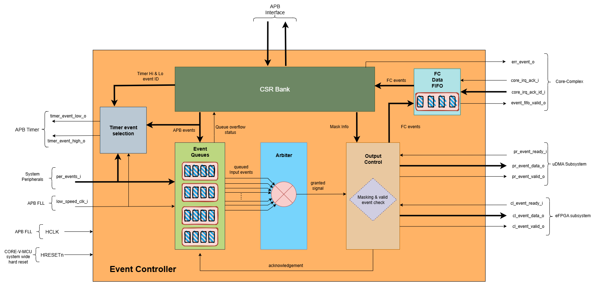

..
   Copyright (c) 2023 OpenHW Group
   Copyright (c) 2024 CircuitSutra

   SPDX-License-Identifier: Apache-2.0 WITH SHL-2.1

.. Level 1
   =======

   Level 2
   -------

   Level 3
   ~~~~~~~

   Level 4
   ^^^^^^^
.. _apb_event_control:

APB EVENT CONTROL
==================

The SOC Event Controller module serves as a centralized event management system for CORE-V-MCU.
It handles the routing and prioritization of events from peripherals to various destinations through configurable masks and an arbitration mechanism.

Features
--------
  - Centralized event handling system for CORE-V-MCU
  - Support for multiple event sources:
      - Peripheral events (up to 256 configurable inputs, 160 currently implemented)
      - APB-generated events (up to 32 events, 8 currently implemented)
      - Low-speed clock events
  - Three configurable output event channels:
      - FC (Fabric Controller/Core Complex) events
      - CL (Cluster) events
      - PR (Peripheral) events
  - Event masking capability for each output channel
  - Timer event generation with selectable event sources
  - FIFO-based event buffering for each input event
  - Priority-based event arbitration

Block Architecture
------------------

   APB Event Controller Block Diagram

Event Processing Components
^^^^^^^^^^^^^^^^^^^^^^^^^^^
The SOC Event Controller consists of several key components that work together to route and manage events throughout the system:
  - Event Queues: One queue, having queue size of 4, per event source to handle event detection and buffering
  - Event Arbiter: Prioritizes concurrent events from multiple sources using a parallel prefix arbitration algorithm with round-robin priority scheme
  - Event Masking: Configurable masking for each output channel (FC, CL, PR)
  - Timer Event Generator: Selectable event routing to timer outputs

Event arbitration
^^^^^^^^^^^^^^^^^
The SOC Event Controller uses a sophisticated parallel prefix arbitration scheme to efficiently handle multiple simultaneous event requests.

**Key features of the arbiter include:**
  - Round-Robin Priority: The arbiter implements a round-robin priority scheme to ensure fair servicing of event requests over time
  - Parallel Prefix Algorithm: Uses a logarithmic-depth parallel prefix network to determine the highest priority request
  - Priority Rotation: After granting an event, the priority shifts to the next position in a circular manner to maintain fairness
  - Grant Acknowledgment: Uses a grant_ack signal to confirm event processing before updating priorities

**Arbitration Process:**
  - The arbiter receives request signals from all event sources.
  - The event arbitration logic ensures only one event is processed at a time across all channels.
  - Using the current priority pointer, it determines which request to grant
  - The parallel prefix network efficiently resolves priority in multiple stages
  - Once a grant is issued, the arbiter waits for acknowledgment
  - After acknowledgment, the priority pointer rotates to the next position

System Architecture
-------------------
.. figure:: apb_event_controller_soc_connections.png
   :name: APB_Event_Controller_SoC_Connections
   :align: center
   :alt:

   APB Event Controller CORE-V-MCU connections diagram

Output Channels
^^^^^^^^^^^^^^^
  - FC (Fabric Controller/Core Complex) Channel: Directly routes 2 events to the FC Event Unit(Not connected in current implementation). 
      FC related events are acccessible through FiFo CSR.
  - CL (Cluster) Channel: Routes events to the Cluster (Not connected in current implementation)
  - PR (Peripheral) Channel: Routes events to uDMA peripherals.
  - Event FIFO: Buffers events for the FC channel
      - FIFO Depth: 4 entries
      - The Core can read the events through the REG_FIFO CSR

Programming View Model
----------------------
The SOC Event Controller is programmed through an APB interface with a 4KB address space. The key programming interfaces include:

Control Flow
^^^^^^^^^^^^
  - Event Generation: Events can be generated from peripherals (160 sources), software (8 sources), or low-speed clock
  - Event Masking: Events can be selectively masked for each output channel using 256-bit mask CSRs
  - Event Routing: Events are arbitrated and routed to the appropriate output channels
  - Error Handling: Event processing errors are detected and reported through error CSRs
  - Timer Control: Two timer event signals can be generated from any event source

Programming Interface
^^^^^^^^^^^^^^^^^^^^^
  - Software Event Generation: Write to REG_EVENT CSR
  - Event Masking: Configure FC_MASK, CL_MASK, and PR_MASK CSRs
  - Event Arbitration: The arbiter resolves concurrent events using a parallel prefix network with round-robin priority
  - Timer Event Selection: Configure TIMER1_SEL_HI and TIMER1_SEL_LO CSRs
  - Error Monitoring: Read ERR CSRs to detect event handling errors
  - Error Clearing: Clear errors by reading from the corresponding ERR CSRs
  - Event FIFO Access: Read from REG_FIFO CSR to retrieve buffered event

APB Event Control CSR
---------------------

REG_EVENT
^^^^^^^^^
  - Offset: 0x00
  
+------------------+------+------+---------+------------------------------+
| Field            | Bits | Type | Default | Description                  |
+==================+======+======+=========+==============================+
| REG_EVENT        | 7:0  | WO   | 0x00    | 8 bits of software-          |
|                  |      |      |         | generated event.             |
+------------------+------+------+---------+------------------------------+

REG_FC_MASK_0
^^^^^^^^^^^^^
  - Offset: 0x04
  
+------------------+------+------+------------+------------------------------+
| Field            | Bits | Type | Default    | Description                  |
+==================+======+======+============+==============================+
| REG_FC_MASK_0    | 31:0 | RW   | 0xFFFFFFFF | Individual masks for         |
|                  |      |      |            | events 0-31 of core complex  |
|                  |      |      |            | (1=mask event).              |
+------------------+------+------+------------+------------------------------+

REG_FC_MASK_1
^^^^^^^^^^^^^
  - Offset: 0x08
  
+------------------+------+------+------------+------------------------------+
| Field            | Bits | Type | Default    | Description                  |
+==================+======+======+============+==============================+
| REG_FC_MASK_1    | 31:0 | RW   | 0xFFFFFFFF | Individual masks for         |
|                  |      |      |            | events 32-63 of core complex |
|                  |      |      |            | (1=mask event).              |
+------------------+------+------+------------+------------------------------+

REG_FC_MASK_2
^^^^^^^^^^^^^
  - Offset: 0x0C
  
+------------------+------+------+------------+------------------------------+
| Field            | Bits | Type | Default    | Description                  |
+==================+======+======+============+==============================+
| REG_FC_MASK_2    | 31:0 | RW   | 0xFFFFFFFF | Individual masks for         |
|                  |      |      |            | events 64-95 of core complex |
|                  |      |      |            | (1=mask event).              |
+------------------+------+------+------------+------------------------------+

REG_FC_MASK_3
^^^^^^^^^^^^^
  - Offset: 0x10
  
+------------------+------+------+------------+------------------------------+
| Field            | Bits | Type | Default    | Description                  |
+==================+======+======+============+==============================+
| REG_FC_MASK_3    | 31:0 | RW   | 0xFFFFFFFF | Individual masks for         |
|                  |      |      |            | events 96-127 of core complex|
|                  |      |      |            | (1=mask event).              |
+------------------+------+------+------------+------------------------------+

REG_FC_MASK_4
^^^^^^^^^^^^^
  - Offset: 0x14
  
+------------------+------+------+------------+------------------------------+
| Field            | Bits | Type | Default    | Description                  |
+==================+======+======+============+==============================+
| REG_FC_MASK_4    | 31:0 | RW   | 0xFFFFFFFF | Individual masks for         |
|                  |      |      |            | events 128-159 of            |
|                  |      |      |            | core complex (1=mask event). |
+------------------+------+------+------------+------------------------------+

REG_FC_MASK_5
^^^^^^^^^^^^^
  - Offset: 0x18
  
+------------------+------+------+------------+------------------------------+
| Field            | Bits | Type | Default    | Description                  |
+==================+======+======+============+==============================+
| REG_FC_MASK_5    | 31:0 | RW   | 0xFFFFFFFF | Individual masks for         |
|                  |      |      |            | events 160-191 of            |
|                  |      |      |            | core complex (1=mask event). |
+------------------+------+------+------------+------------------------------+

REG_FC_MASK_6
^^^^^^^^^^^^^
  - Offset: 0x1C
  
+------------------+------+------+------------+------------------------------+
| Field            | Bits | Type | Default    | Description                  |
+==================+======+======+============+==============================+
| REG_FC_MASK_6    | 31:0 | RW   | 0xFFFFFFFF | Individual masks for         |
|                  |      |      |            | events 192-223 of            |
|                  |      |      |            | core complex (1=mask event). |
+------------------+------+------+------------+------------------------------+

REG_FC_MASK_7
^^^^^^^^^^^^^
  - Offset: 0x20
  
+------------------+------+------+------------+------------------------------+
| Field            | Bits | Type | Default    | Description                  |
+==================+======+======+============+==============================+
| REG_FC_MASK_7    | 31:0 | RW   | 0xFFFFFFFF | Individual masks for         |
|                  |      |      |            | events 224-255 of            |
|                  |      |      |            | core complex (1=mask event). |
+------------------+------+------+------------+------------------------------+

REG_CL_MASK_0
^^^^^^^^^^^^^
  - Offset: 0x24
  
+------------------+------+------+------------+------------------------------+
| Field            | Bits | Type | Default    | Description                  |
+==================+======+======+============+==============================+
| REG_CL_MASK_0    | 31:0 | RW   | 0xFFFFFFFF | Individual masks for         |
|                  |      |      |            | events 0-31 of cluster       |
|                  |      |      |            | (1=mask event).              |
+------------------+------+------+------------+------------------------------+

REG_CL_MASK_1
^^^^^^^^^^^^^
  - Offset: 0x28
  
+------------------+------+------+------------+------------------------------+
| Field            | Bits | Type | Default    | Description                  |
+==================+======+======+============+==============================+
| REG_CL_MASK_1    | 31:0 | RW   | 0xFFFFFFFF | Individual masks for         |
|                  |      |      |            | events 32-63 of cluster      |
|                  |      |      |            | (1=mask event).              |
+------------------+------+------+------------+------------------------------+

REG_CL_MASK_2
^^^^^^^^^^^^^
  - Offset: 0x2C
  
+------------------+------+------+------------+------------------------------+
| Field            | Bits | Type | Default    | Description                  |
+==================+======+======+============+==============================+
| REG_CL_MASK_2    | 31:0 | RW   | 0xFFFFFFFF | Individual masks for         |
|                  |      |      |            | events 64-95 of cluster      |
|                  |      |      |            | (1=mask event).              |
+------------------+------+------+------------+------------------------------+

REG_CL_MASK_3
^^^^^^^^^^^^^
  - Offset: 0x30
  
+------------------+------+------+------------+------------------------------+
| Field            | Bits | Type | Default    | Description                  |
+==================+======+======+============+==============================+
| REG_CL_MASK_3    | 31:0 | RW   | 0xFFFFFFFF | Individual masks for         |
|                  |      |      |            | events 96-127 of cluster     |
|                  |      |      |            | (1=mask event).              |
+------------------+------+------+------------+------------------------------+

REG_CL_MASK_4
^^^^^^^^^^^^^
  - Offset: 0x34
  
+------------------+------+------+------------+------------------------------+
| Field            | Bits | Type | Default    | Description                  |
+==================+======+======+============+==============================+
| REG_CL_MASK_4    | 31:0 | RW   | 0xFFFFFFFF | Individual masks for         |
|                  |      |      |            | events 128-159 of cluster    |
|                  |      |      |            | (1=mask event).              |
+------------------+------+------+------------+------------------------------+

REG_CL_MASK_5
^^^^^^^^^^^^^
  - Offset: 0x38
  
+------------------+------+------+------------+------------------------------+
| Field            | Bits | Type | Default    | Description                  |
+==================+======+======+============+==============================+
| REG_CL_MASK_5    | 31:0 | RW   | 0xFFFFFFFF | Individual masks for         |
|                  |      |      |            | events 160-191 of cluster    |
|                  |      |      |            | (1=mask event).              |
+------------------+------+------+------------+------------------------------+

REG_CL_MASK_6
^^^^^^^^^^^^^
  - Offset: 0x3C
  
+------------------+------+------+------------+------------------------------+
| Field            | Bits | Type | Default    | Description                  |
+==================+======+======+============+==============================+
| REG_CL_MASK_6    | 31:0 | RW   | 0xFFFFFFFF | Individual masks for         |
|                  |      |      |            | events 192-223 of cluster    |
|                  |      |      |            | (1=mask event).              |
+------------------+------+------+------------+------------------------------+

REG_CL_MASK_7
^^^^^^^^^^^^^
  - Offset: 0x40
  
+------------------+------+------+------------+------------------------------+
| Field            | Bits | Type | Default    | Description                  |
+==================+======+======+============+==============================+
| REG_CL_MASK_7    | 31:0 | RW   | 0xFFFFFFFF | Individual masks for         |
|                  |      |      |            | events 224-255 of cluster    |
|                  |      |      |            | (1=mask event).              |
+------------------+------+------+------------+------------------------------+

REG_PR_MASK_0
^^^^^^^^^^^^^
  - Offset: 0x44
  
+------------------+------+------+------------+------------------------------+
| Field            | Bits | Type | Default    | Description                  |
+==================+======+======+============+==============================+
| REG_PR_MASK_0    | 31:0 | RW   | 0xFFFFFFFF | Individual masks for         |
|                  |      |      |            | events 0-31 of peripheral    |
|                  |      |      |            | (1=mask event).              |
+------------------+------+------+------------+------------------------------+

REG_PR_MASK_1
^^^^^^^^^^^^^
  - Offset: 0x48
  
+------------------+------+------+------------+------------------------------+
| Field            | Bits | Type | Default    | Description                  |
+==================+======+======+============+==============================+
| REG_PR_MASK_1    | 31:0 | RW   | 0xFFFFFFFF | Individual masks for         |
|                  |      |      |            | events 32-63 of peripheral   |
|                  |      |      |            | (1=mask event).              |
+------------------+------+------+------------+------------------------------+

REG_PR_MASK_2
^^^^^^^^^^^^^
  - Offset: 0x4C
  
+------------------+------+------+------------+------------------------------+
| Field            | Bits | Type | Default    | Description                  |
+==================+======+======+============+==============================+
| REG_PR_MASK_2    | 31:0 | RW   | 0xFFFFFFFF | Individual masks for         |
|                  |      |      |            | events 64-95 of peripheral   |
|                  |      |      |            | (1=mask event).              |
+------------------+------+------+------------+------------------------------+

REG_PR_MASK_3
^^^^^^^^^^^^^
  - Offset: 0x50
  
+------------------+------+------+------------+------------------------------+
| Field            | Bits | Type | Default    | Description                  |
+==================+======+======+============+==============================+
| REG_PR_MASK_3    | 31:0 | RW   | 0xFFFFFFFF | Individual masks for         |
|                  |      |      |            | events 96-127 of peripheral  |
|                  |      |      |            | (1=mask event).              |
+------------------+------+------+------------+------------------------------+

REG_PR_MASK_4
^^^^^^^^^^^^^
  - Offset: 0x54
  
+------------------+------+------+------------+------------------------------+
| Field            | Bits | Type | Default    | Description                  |
+==================+======+======+============+==============================+
| REG_PR_MASK_4    | 31:0 | RW   | 0xFFFFFFFF | Individual masks for         |
|                  |      |      |            | events 128-159 of peripheral |
|                  |      |      |            | (1=mask event).              |
+------------------+------+------+------------+------------------------------+

REG_PR_MASK_5
^^^^^^^^^^^^^
  - Offset: 0x58
  
+------------------+------+------+------------+------------------------------+
| Field            | Bits | Type | Default    | Description                  |
+==================+======+======+============+==============================+
| REG_PR_MASK_5    | 31:0 | RW   | 0xFFFFFFFF | Individual masks for         |
|                  |      |      |            | events 160-191 of peripheral |
|                  |      |      |            | (1=mask event).              |
+------------------+------+------+------------+------------------------------+

REG_PR_MASK_6
^^^^^^^^^^^^^
  - Offset: 0x5C
  
+------------------+------+------+------------+------------------------------+
| Field            | Bits | Type | Default    | Description                  |
+==================+======+======+============+==============================+
| REG_PR_MASK_6    | 31:0 | RW   | 0xFFFFFFFF | Individual masks for         |
|                  |      |      |            | events 192-223 of peripheral |
|                  |      |      |            | (1=mask event).              |
+------------------+------+------+------------+------------------------------+

REG_PR_MASK_7
^^^^^^^^^^^^^
  - Offset: 0x60
  
+------------------+------+------+------------+------------------------------+
| Field            | Bits | Type | Default    | Description                  |
+==================+======+======+============+==============================+
| REG_PR_MASK_7    | 31:0 | RW   | 0xFFFFFFFF | Individual masks for         |
|                  |      |      |            | events 224-255 of peripheral |
|                  |      |      |            | (1=mask event).              |
+------------------+------+------+------------+------------------------------+

REG_ERR_0
^^^^^^^^^
  - Offset: 0x64
  
+------------------+------+------+------------+------------------------------+
| Field            | Bits | Type | Default    | Description                  |
+==================+======+======+============+==============================+
| REG_ERR_0        | 31:0 | R1C  | 0x00       | Error bits for event queue   |
|                  |      |      |            | overflow for events 0-31.    |
+------------------+------+------+------------+------------------------------+

REG_ERR_1
^^^^^^^^^
  - Offset: 0x68
  
+------------------+------+------+---------+------------------------------+
| Field            | Bits | Type | Default | Description                  |
+==================+======+======+=========+==============================+
| REG_ERR_1        | 31:0 | R1C  | 0x00    | Error bits for event queue   |
|                  |      |      |         | overflow for events 32-63.   |
+------------------+------+------+---------+------------------------------+

REG_ERR_2
^^^^^^^^^
  - Offset: 0x6C
  
+------------------+------+------+---------+------------------------------+
| Field            | Bits | Type | Default | Description                  |
+==================+======+======+=========+==============================+
| REG_ERR_2        | 31:0 | R1C  | 0x00    | Error bits for event queue   |
|                  |      |      |         | overflow for events 64-95.   |
+------------------+------+------+---------+------------------------------+

REG_ERR_3
^^^^^^^^^
  - Offset: 0x70
  
+------------------+------+------+---------+------------------------------+
| Field            | Bits | Type | Default | Description                  |
+==================+======+======+=========+==============================+
| REG_ERR_3        | 31:0 | R1C  | 0x00    | Error bits for event queue   |
|                  |      |      |         | overflow for events 96-127.  |
+------------------+------+------+---------+------------------------------+

REG_ERR_4
^^^^^^^^^
  - Offset: 0x74
  
+------------------+------+------+---------+------------------------------+
| Field            | Bits | Type | Default | Description                  |
+==================+======+======+=========+==============================+
| REG_ERR_4        | 31:0 | R1C  | 0x00    | Error bits for event queue   |
|                  |      |      |         | overflow for events 128-159. |
+------------------+------+------+---------+------------------------------+

REG_ERR_5
^^^^^^^^^
  - Offset: 0x78
  
+------------------+------+------+---------+------------------------------+
| Field            | Bits | Type | Default | Description                  |
+==================+======+======+=========+==============================+
| REG_ERR_5        | 31:0 | R1C  | 0x00    | Error bits for event queue   |
|                  |      |      |         | overflow for events 160-191. |
+------------------+------+------+---------+------------------------------+

REG_ERR_6
^^^^^^^^^
  - Offset: 0x7C
  
+------------------+------+------+---------+------------------------------+
| Field            | Bits | Type | Default | Description                  |
+==================+======+======+=========+==============================+
| REG_ERR_6        | 31:0 | R1C  | 0x00    | Error bits for event queue   |
|                  |      |      |         | overflow for events 192-223. |
+------------------+------+------+---------+------------------------------+

REG_ERR_7
^^^^^^^^^
  - Offset: 0x80
  
+------------------+------+------+---------+------------------------------+
| Field            | Bits | Type | Default | Description                  |
+==================+======+======+=========+==============================+
| REG_ERR_7        | 31:0 | R1C  | 0x00    | Error bits for event queue   |
|                  |      |      |         | overflow for events 224-255. |
+------------------+------+------+---------+------------------------------+

REG_TIMER1_SEL_HI
^^^^^^^^^^^^^^^^^
  - Offset: 0x84
  
+------------------+------+------+---------+------------------------------+
| Field            | Bits | Type | Default | Description                  |
+==================+======+======+=========+==============================+
| REG_TIMER1_SEL_HI| 7:0  | RW   | 0x00    | Specifies which event should |
|                  |      |      |         | be routed to the lo timer.   |
+------------------+------+------+---------+------------------------------+

REG_TIMER1_SEL_LO
^^^^^^^^^^^^^^^^^
  - Offset: 0x88
  
+------------------+------+------+---------+------------------------------+
| Field            | Bits | Type | Default | Description                  |
+==================+======+======+=========+==============================+
| REG_TIMER1_SEL_LO| 7:0  | RW   | 0x00    | Specifies which event should |
|                  |      |      |         | be routed to the hi timer.   |
+------------------+------+------+---------+------------------------------+

REG_FIFO
^^^^^^^^
  - Offset: 0x90
  
+------------------+------+------+---------+------------------------------+
| Field            | Bits | Type | Default | Description                  |
+==================+======+======+=========+==============================+
| REG_FIFO         | 7:0  | RO   | 0x00    | ID of triggering event for   |
|                  |      |      |         | interrupt handler.           |
+------------------+------+------+---------+------------------------------+

Firmware Guidelines
-------------------
Follow these steps to properly configure and use the SOC Event Controller IP:

  1. Initialize the event controller by setting appropriate mask values:

    - Write to REG_FC_MASK_0 through REG_FC_MASK_7 to configure which events to mask and which should be routed to the FC.
    - Write to REG_CL_MASK_0 through REG_CL_MASK_7 to configure which events to mask and which should be routed to the cluster.
    - Write to REG_PR_MASK_0 through REG_PR_MASK_7 to configure which events to mask and which should be routed to peripherals.
    - Remember that mask bits are active high (1 = masked/blocked, 0 = enabled).

  2. Configure timer event sources if needed:

    - Write to REG_TIMER1_SEL_LO with the event index (0-169) that should trigger the timer low signal.
    - Write to REG_TIMER1_SEL_HI with the event index (0-169) that should trigger the timer high signal.
    - Note that valid event indices range from 0 to 169 due to peripheral events(160), APB events(8), and low-speed clock event(1).

  3. Clear any pending errors:

    - Read from REG_ERR_0 through REG_ERR_7 to clear any existing error flags.

  4. Generate software events when needed:

    - Write to REG_EVENT CSR with bits set for the specific events to trigger.
    - Only the lower 8 bits are used.
    - Example: Write 0x01 to REG_EVENT to trigger APB event 0.
    - Example: Write 0x80 to REG_EVENT to trigger APB event 7.

  5. Process FC events through the FIFO:

    - Monitor the event_fifo_valid_o signal to know when an event is available in the FIFO.
    - When valid, read the event ID from REG_FIFO.
    - Acknowledge the event by asserting core_irq_ack_i and setting core_irq_ack_id_i to 11.
    - The FIFO can store up to 4 events before overflow occurs.

  6. Monitor and handle event errors:

    - Periodically check REG_ERR_0 through REG_ERR_7 for any set error bits.
    - Each bit corresponds to an event source that experienced an queue overflow.
    - Clear errors by reading from the corresponding ERR CSR.
    - Implement appropriate error recovery mechanisms based on which events had overflow errors.

  7. For dynamic reconfiguration:

    - Event masks can be updated at runtime to change event routing behavior.
    - Timer event sources can be changed during operation by updating TIMER1_SEL CSRs.
    - Software events can be generated at any time by writing to REG_EVENT.

  8. Handle cluster and peripheral events:

    - Monitor cl_event_valid_o and pr_event_valid_o signals.
    - When valid, read event data from cl_event_data_o or pr_event_data_o.
    - Acknowledge event processing by asserting cl_event_ready_i or pr_event_ready_i.

Pin Description
---------------

   APB Event Controller Pin Diagram

Clock and Reset
^^^^^^^^^^^^^^^
  - HCLK: APB clock input
  - HRESETn: Active low reset signal

APB Interface Signals
^^^^^^^^^^^^^^^^^^^^^
  - PADDR[11:0]: APB address bus input
  - PWDATA[31:0]:  APB write data bus input
  - PWRITE: APB write control input (high for write, low for read)
  - PSEL: APB peripheral select input
  - PENABLE: APB enable input
  - PRDATA: APB write data bus input
  - PREADY: APB ready output to indicate transfer completion
  - PSLVERR: APB error response output signal

Peripheral Event Signals
^^^^^^^^^^^^^^^^^^^^^^^^
  - per_events_i[159:0]: Peripheral event inputs
  - pr_event_valid_o: Peripheral event valid output
  - pr_event_data_o[7:0]: Peripheral event data output, indicating the event ID
  - pr_event_ready_i: Peripheral event ready input, indicating readiness to process the event

Fabric Controller Event Signals
^^^^^^^^^^^^^^^^^^^^^^^^^^^^^^^ 
  - fc_events_o[1:0]: Fabric control event output, directly connected to per_events_i[8:7] (Not connected in current implementation).
  - core_irq_ack_id_i[4:0]: Core interrupt acknowledge ID input
  - core_irq_ack_i:  Core interrupt acknowledge input
  - event_fifo_valid_o: Event FIFO valid output, indicating the presence of an event in the FIFO.
  - err_event_o: Error event output, indicating queue overflow for any of the input events.

Cluster Event Signals
^^^^^^^^^^^^^^^^^^^^^
  - cl_event_valid_o: Cluster event valid output (Not connected in current implementation).
  - cl_event_data_o[7:0]: Cluster event data output, indicating the event ID (Not connected in current implementation).
  - cl_event_ready_i: Cluster event ready input, indicating readiness to process the event (Not connected in current implementation).

Timer Event Signals
^^^^^^^^^^^^^^^^^^^
  - low_speed_clk_i: Low-speed clock input
  - timer_event_lo_o: Timer event low output
  - timer_event_hi_o: Timer event high output

