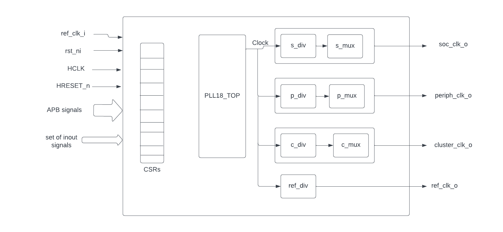

**APB FLL:-**

-  Core-V-MCU contains 3 FLLs. One FLL is meant for generating the clock
      for the peripheral domain, one for the core domain (core,
      memories, event unit etc) and one is meant for the cluster. The
      latter is not used. All the FLLs can be bypassed by writing to the
      JTAG register before the reset signal is asserted.

**APB FLL Interface CSRs**
==========================

The FLL interface is accessed at APB Base address 0x1a100000. Nine
32-bit registers are used to control the FLL and the clock divisors.

+-------------+-------------+-----------------------------------------+
| **OFFSET**  | **Register**| **Description**                         |
|             |             |                                         |
+=============+=============+=========================================+
| 0x0         | CTL         | PLL Configuration Control               |
+-------------+-------------+-----------------------------------------+
| 0x4         | DIV         | PLL Divisor Control                     |
+-------------+-------------+-----------------------------------------+
| 0x8         | FRAC        | PLL Fractional Control                  |
+-------------+-------------+-----------------------------------------+
| 0xC         | SS1         | PLL Spread Spectrum Control 1           |
+-------------+-------------+-----------------------------------------+
| 0x10        | SS2         | PLL Spread Spectrum Control 2           |
+-------------+-------------+-----------------------------------------+
| 0x14        | SOC         | SOC Clock Divisor                       |
+-------------+-------------+-----------------------------------------+
| 0x18        | PERIPH      | Peripheral Clock Divisor                |
+-------------+-------------+-----------------------------------------+
| 0x1C        | FPGA        | FPGA Clock Divisor                      |
+-------------+-------------+-----------------------------------------+
| 0x20        | REF         | Reference Clock Divisor                 |
+-------------+-------------+-----------------------------------------+

**FLL_CTL offset = 0x00**
-------------------------

Default Value = 0x300103

+----------+------+-------+------------+---------------------------------+
| **Field**| **Bi | **T   | **Default**|         **Description**         |
|          | ts** | ype** |            |                                 |
+==========+======+=======+============+=================================+
| LOCK     | 31   | R     |            | PLL Lock 1 = Locked, 0 = Not    |
|          |      |       |            | Locked                          |
+----------+------+-------+------------+---------------------------------+
| PDDP     | 25   | RW    | 1          | PLL Divisor Power Down 1=Power  |
|          |      |       |            | Down, 0=Normal Operation        |
+----------+------+-------+------------+---------------------------------+
| PD       | 24   | RW    | 1          | PLL Power Down 1=Power Down,    |
|          |      |       |            | 0=Normal Operation              |
+----------+------+-------+------------+---------------------------------+
| MODE     | 1    | RW    | 0          | MODE 0=Normal, 1=Fractional,    |
|          | 7:16 |       |            | 2=SpreadSpectrum, 3=Reserved    |
+----------+------+-------+------------+---------------------------------+
| DM       | 13:8 | RW    | 1          | Reference Clock Divisor values  |
|          |      |       |            | = 1-63                          |
+----------+------+-------+------------+---------------------------------+
| RESET    | 1    | RW    | 1          | PLL Reset 1 = Reset, 0 = Normal |
|          |      |       |            | operation                       |
+----------+------+-------+------------+---------------------------------+
| BYPASS   | 0    | RW    | 1          | PLL/Divisor Bypass, 1 = all     |
|          |      |       |            | clocks are Reference Clock      |
+----------+------+-------+------------+---------------------------------+

.. _section-1:

.. _section-2:

.. _section-3:

.. _section-4:

**FLL_DIV offset = 0x04**
-------------------------

Default Value = 0xA00004

+-------+------+------+--------+-------------------------------------+
| **Fi  | **Bi | **Ty | **Def  | **Description**                     |
| eld** | ts** | pe** | ault** |                                     |
+=======+======+======+========+=====================================+
| DN    | 2    | RW   | 0xa0   | PLL Feedback Divisor (0xa0 = PLL at |
|       | 6:16 |      |        | 1.6GHz)                             |
+-------+------+------+--------+-------------------------------------+
| DP    | 2:0  | RW   | 0x4    | PLL Output Divisor (0x4 = 400MHz    |
|       |      |      |        | CLK0)                               |
+-------+------+------+--------+-------------------------------------+

.. _section-5:

**FLL_FRAC offset = 0x08**
--------------------------

Default Value = 0x0

+---------+-------+--------+------------+------------------------------+
| **F     | **B   | **T    | **Default**| **Description**              |
| ield**  | its** | ype**  |            |                              |
+=========+=======+========+============+==============================+
| FRAC    | 23:0  | RW     | 0x00       | PLL Fractional part of DN    |
+---------+-------+--------+------------+------------------------------+

.. _section-6:

**FLL_SS1 offset = 0x0C**
-------------------------

Default Value = 0x0

+--------+-------+--------+----------+-------------------------------+
| **F    | **B   | **     | **D      | **Description**               |
| ield** | its** | Type** | efault** |                               |
+========+=======+========+==========+===============================+
| SRATE  | 10:0  | RW     | 0x00     | PLL Spread Spectrum Triangle  |
|        |       |        |          | modulation Frequency          |
+--------+-------+--------+----------+-------------------------------+

.. _section-7:

**FLL_SS2 offset = 0x10**
-------------------------

Default Value = 0x0

+-----------+-------+-------+----------+------------------------------+
| **Field** | **B   | **T   | **D      | **Description**              |
|           | its** | ype** | efault** |                              |
+===========+=======+=======+==========+==============================+
| SSLOPE    | 23:0  | RW    | 0x00     | PLL Spread Spectrum Step     |
+-----------+-------+-------+----------+------------------------------+

.. _section-8:

**SOC_DIV offset = 0x14**
-------------------------

Default Value = 0x0

+---------+-------+--------+-----------+------------------------------+
| **      | **B   | **     | **        | **Description**              |
| Field** | its** | Type** | Default** |                              |
+=========+=======+========+===========+==============================+
| S_DIV   | 9:0   | RW     | 0x00      | SOC clock Divisor 0,1 = 1    |
+---------+-------+--------+-----------+------------------------------+

.. _section-9:

**PERIPH_DIV offset = 0x18**
----------------------------

Default Value = 0x0

+--------+------+-------+----------+---------------------------------+
| **F    | **Bi | **T   | **D      | **Description**                 |
| ield** | ts** | ype** | efault** |                                 |
+========+======+=======+==========+=================================+
| P_DIV  | 9:0  | RW    | 0x00     | Peripheral clock Divisor 0,1 =  |
|        |      |       |          | 1                               |
+--------+------+-------+----------+---------------------------------+

.. _section-10:

**FPGA_DIV offset = 0x1C**
--------------------------

Default Value = 0x0

+---------+------+--------+----------+-------------------------------+
| **      | **Bi | **     | **D      | **Description**               |
| Field** | ts** | Type** | efault** |                               |
+=========+======+========+==========+===============================+
| F_DIV   | 9:0  | RW     | 0x00     | FPGA clock Divisor 0,1 = 1    |
+---------+------+--------+----------+-------------------------------+

.. _section-11:

**REF_DIV offset = 0x20**
-------------------------

Default Value = 0x0

+-------+------+-------+----------+----------------------------------+
| **Fi  | **Bi | **T   | **D      | **Description**                  |
| eld** | ts** | ype** | efault** |                                  |
+=======+======+=======+==========+==================================+
| R_DIV | 9:0  | RW    | 0x28     | Reference clock Divisor          |
|       |      |       |          | 0x28=250KHz Refclock             |
+-------+------+-------+----------+----------------------------------+

**Theory of operaion:-**

-  **Inputs:-**

   -  ref_clk_i - Reference clock input

   -  rst_ni - To reset the clock divisors and demultiplexers

   -  HCLK -clock for the read and write on the registers

   -  HRESETn - To reset the registers

   -  APB bus signals -Set of APB bus signals

-  **Outputs:-**

   -  soc_clk_o - clock for the core soc domain

   -  periph_clk_o - clock for the peripheral domain

   -  cluster_clk_o - clock for the cluster/FPGA domain

   -  ref_clk_o - reference clock which is taken as input

-  **Inouts:-**

   -  AVDD, AVDD2,AVSS,VDDC,VSSC

-  There are a set of 9 32 bit registers used to control the PLL and
      clock divisors.

-  When HRESETn is low,all the registers are reset to default values
      where control register value is 32'h03000103 and divisor register
      value is 32'h00A00004,remaining registers are assigned 0.

..

   **READ/WRITE into the register:-**

-  The PLL IP will be in IDLE mode generally.To write or read into the
      registers ,first PSEL and PENABLE should be made high.So at every
      positive clock edge of HCLK,if both PSEL and PENABLE are high then
      based on whether PWRITE is low or high, PLL IP is changed to READ
      or WRITE mode so that in next clock cycle read or write operation
      happen based on the mode and the PLL mode is changed to default
      IDLE mode after the end of the operation.

..

   **Supply of the reference clock to the divisors:-**

-  Here if RESET register is high or HRESETn pin is low then ,the PLL is
      in reset mode(So no outputs are generated).

-  If rst_ni is made low,then also there will be no outputs(all the
      outputs will be low).

-  If the control register BYPASS is high ,then it is in bypass mode
      ,where the domain clocks of soc,peripherals,and cluster will be
      the reference clock (ref_clk_i) instead of the divisor clock.

-  When BYPASS register is low, the domain clocks are generated from the
      reference clock instead of directly passing the reference
      clock.The generation of domain clocks happen based on the
      registers value SOC_DIV,PERIPH_DIV,CLUSTER_DIV and REF_DIV .For
      each divisor the ref clock frequency is reduced by the number of
      times mentioned in the respective register and that frequency
      reduced clock is the divisor clock.For example, for soc domain
      ,the reference clock frequency is reduced by SOC_DIV times and
      produced clock is the soc domain clock.

..

   **How the the transition from divisor clock to ref clock happens when
   BYPASS is made high**

-  Whenever the BYPASS is made high from low,then the respective divisor
      clock for the domain is stopped as output after completing the
      next clock cycle and the ref clock starts from there as the domain
      clock .
