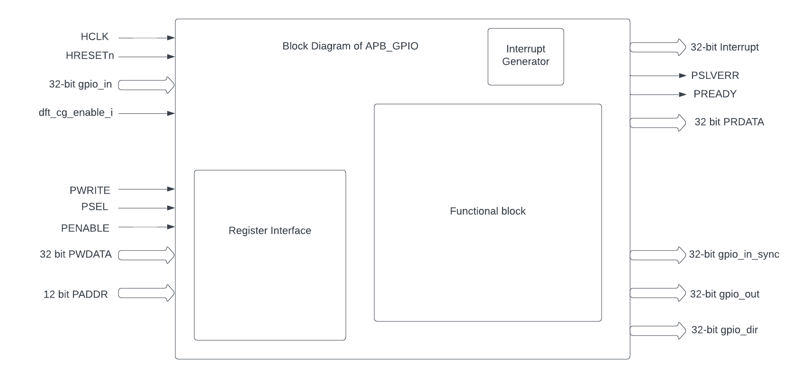

..
   Copyright (c) 2023 OpenHW Group
   Copyright (c) 2024 CircuitSutra

   SPDX-License-Identifier: Apache-2.0 WITH SHL-2.1

.. Level 1
   =======

   Level 2
   -------

   Level 3
   ~~~~~~~

   Level 4
   ^^^^^^^
.. _apb_gpio:

APB_GPIO
========
The General Purpose Input/Output (GPIO) IP block supports S/W access
to read and write the values on selected I/O, and configuring selected
I/O to generate interrupts.

Features
--------

-  32-bit bits of user-selectable I/O.

-  I/O can be configured for level type interrupts or edge triggered
      interrupts.

Theory of Operation
^^^^^^^^^^^^^^^^^^^
Block diagram of APB_GPIO peripheral:

The GPIO module supports a range of configuration options and various
types of interrupts.

**Pin Direction and Mode:**

-  Input Mode: Configures the pin to read external digital signals into
      the registers .

-  Output Mode: Sets the pin to drive an external digital signal from
      the registers.

**Interrupts:**

-  Edge-Triggered Interrupts: Allows the GPIO pin to generate an
      interrupt on a rising or falling edge.

-  Level-Triggered Interrupts: Generates an interrupt when the pin is at
      a specified logic level (high or low).

**Programming model**\ Following FW configurations can be done for the Input mode and
Output mode.

-  Input mode FW configurations

   -  Driving the input ports and reading the register pin values:

      -  FW can drive the input pins and these values will be stored in
            the PIN0 register.

      -  FW can also read these input pins of selected GPIOs by reading
            the PIN0 register.

      -  Note: Before reading any register make sure that PSEL, PENABLE
            are driven to 1 and PWRITE is driven to 0.

   -  Driving the input ports and generating an interrupt via outport
         port:

      -  FW can drive the input pins and these values will be stored in
            the PIN0 register.

      -  if the Interrupts are enabled and if the type of the interrupt
            is also set by FW then the GPIO will accordingly
            generate/drive that particular output interrupt pin

-  Output mode FW configurations

   -  Driving the output ports:

      -  FW should configure the gpio_dir register correctly.

      -  FW can issue a write to any 32 bits of the OUT0 register and
            that will drive corresponding gpio_num related gpio_out pin

      -  it will also drive the gpio_dir output port depending on the
            values configured in gpio_dir register.

      -  Note: Before writing any register make sure that PSEL, PENABLE
            and PWRITE are driven to 1.

   -  Setting the output ports:

      -  FW should configure the gpio_dir register correctly.

      -  FW can issue a set operation to any 32 bits of the OUT0
            register and that will drive corresponding gpio_num related
            gpio_out pin to value '1'.

      -  it will also drive the gpio_dir output port depending on the
            values configured in gpio_dir register.

      -  Note: Before writing any register make sure that PSEL, PENABLE
            and PWRITE are driven to 1.

   -  Clearing the output ports:

      -  FW should configure the gpio_dir register correctly.

      -  FW can issue a clear operation to any 32 bits of the OUT0
            register and that will drive corresponding gpio_num related
            gpio_out pin to value '0'.

      -  it will also drive the gpio_dir output port depending on the
            values configured in gpio_dir register.

      -  Note: Before writing any register make sure that PSEL, PENABLE
            and PWRITE are driven to 1.

   -  Toggling the output ports:

      -  FW should configure the gpio_dir register correctly.

      -  FW can issue a toggle operation to any 32 bits of the OUT0
            register and that will drive corresponding gpio_num related
            gpio_out pin to toggle w.r.t previous value.

      -  it will also drive the gpio_dir output port depending on the
            values configured in gpio_dir register.

      -  Note: Before writing any register make sure that PSEL, PENABLE
            and PWRITE are driven to 1.

      -  

-  Read status operation via register.

   -  FW can issue a write to the register SETSEL to select the GPIO
         number of the pin.

   -  FW can issue a read to the RDSTAT register to get all the current
         operations in GPIO like the mode, PIN0 value, OUT0 value,
         Interrupt type, Interrupt enable, GPIO number etc.\|

   -  Note: Before reading any register make sure that PSEL, PENABLE are
         driven to 1 and PWRITE is driven to 0.

**APB GPIO CSRs**

The GPIO module is typically associated with a set of status and control
registers. These registers allow the processor to read input states, set
output levels, and configure various GPIO settings.

+-----------+-----------+-----------+-----------+------+---------------+
| **Offset**| **Field** | **Bits**  | **Type**  | **D  | **D           |
|           |           |           |           | efau | escription**  |
|           |           |           |           | lt** |               |
+===========+===========+===========+===========+======+===============+
| 0x00      | SETGPIO   | 7:0       | WO        |      | Set           |
|           |           |           |           |      | G             |
|           |           |           |           |      | PIO[gpio_num] |
|           |           |           |           |      | = 1           |
+-----------+-----------+-----------+-----------+------+---------------+
| 0x04      | CLRGPIO   | 7:0       | WO        |      | Set           |
|           |           |           |           |      | G             |
|           |           |           |           |      | PIO[gpio_num] |
|           |           |           |           |      | = 0           |
+-----------+-----------+-----------+-----------+------+---------------+
| 0x08      | TOGGPIO   | 7:0       | WO        |      | Invert the    |
|           |           |           |           |      | output of     |
|           |           |           |           |      | G             |
|           |           |           |           |      | PIO[gpio_num] |
+-----------+-----------+-----------+-----------+------+---------------+
| 0x10      | PIN0      | 31:0      | RO        |      | gpi           |
|           |           |           |           |      | o_value[31:0] |
|           |           |           |           |      | = GPIO[31:0]  |
+-----------+-----------+-----------+-----------+------+---------------+
| 0x14      | PIN1      | 31:0      | RO        |      | gpi           |
|           |           |           |           |      | o_value[31:0] |
|           |           |           |           |      | = GPIO[63:32] |
+-----------+-----------+-----------+-----------+------+---------------+
| 0x18      | PIN2      | 31:0      | RO        |      | gpi           |
|           |           |           |           |      | o_value[31:0] |
|           |           |           |           |      | = GPIO[95:64] |
+-----------+-----------+-----------+-----------+------+---------------+
| 0x1C      | PIN3      | 31:0      | RO        |      | gpi           |
|           |           |           |           |      | o_value[31:0] |
|           |           |           |           |      | =             |
|           |           |           |           |      | GPIO[127:96]  |
+-----------+-----------+-----------+-----------+------+---------------+
| 0x20      | OUT0      | 31:0      | WO        |      | Drive         |
|           |           |           |           |      | value[31:0]   |
|           |           |           |           |      | onto          |
|           |           |           |           |      | GPIO[31:0]    |
+-----------+-----------+-----------+-----------+------+---------------+
| 0x24      | OUT1      | 31:0      | WO        |      | Drive         |
|           |           |           |           |      | value[31:0]   |
|           |           |           |           |      | onto          |
|           |           |           |           |      | GPIO[63:32]   |
+-----------+-----------+-----------+-----------+------+---------------+
| 0x28      | OUT2      | 31:0      | WO        |      | Drive         |
|           |           |           |           |      | value[31:0]   |
|           |           |           |           |      | onto          |
|           |           |           |           |      | GPIO[95:64]   |
+-----------+-----------+-----------+-----------+------+---------------+
| 0x2C      | OUT3      | 31:0      | WO        |      | Drive         |
|           |           |           |           |      | value[31:0]   |
|           |           |           |           |      | onto          |
|           |           |           |           |      | GPIO[127:96]  |
+-----------+-----------+-----------+-----------+------+---------------+
| 0x30      | SETSEL    | 7:0       | WO        | 0x0  | Set gpio_num  |
|           |           |           |           |      | for use by    |
|           |           |           |           |      | RDSTAT (Note: |
|           |           |           |           |      | SETGPIO,      |
|           |           |           |           |      | CLRGPIO,      |
|           |           |           |           |      | TOGGPIO and   |
|           |           |           |           |      | SETINT set    |
|           |           |           |           |      | gpio_num)     |
+-----------+-----------+-----------+-----------+------+---------------+
| 0x34      | RDSTAT    | 25:24     | RO        | 0x0  | Read the mode |
|           |           |           |           |      | control for   |
|           |           |           |           |      | G             |
|           |           |           |           |      | PIO[gpio_num] |
|           |           |           |           |      | (set gpio_num |
|           |           |           |           |      | using SETSEL) |
+-----------+-----------+-----------+-----------+------+---------------+
|           |           | 19:17     | RO        | 0x0  | Type of       |
|           |           |           |           |      | interrupt for |
|           |           |           |           |      | G             |
|           |           |           |           |      | PIO[gpio_num] |
+-----------+-----------+-----------+-----------+------+---------------+
|           |           | 16:16     | RW        |      | Enable        |
|           |           |           |           |      | interrupt for |
|           |           |           |           |      | G             |
|           |           |           |           |      | PIO[gpio_num] |
+-----------+-----------+-----------+-----------+------+---------------+
|           |           | 12:12     | RO        |      | Input value   |
|           |           |           |           |      | reported by   |
|           |           |           |           |      | G             |
|           |           |           |           |      | PIO[gpio_num] |
+-----------+-----------+-----------+-----------+------+---------------+
|           |           | 8:8       | RO        |      | Output value  |
|           |           |           |           |      | that is set   |
|           |           |           |           |      | on            |
|           |           |           |           |      | G             |
|           |           |           |           |      | PIO[gpio_num] |
+-----------+-----------+-----------+-----------+------+---------------+
|           |           | 7:0       | RO        |      | Selected gpio |
+-----------+-----------+-----------+-----------+------+---------------+
| 0x38      | SETMODE   | 25:24     | WO        | 0x0  | Mode control  |
|           |           |           |           |      | for           |
|           |           |           |           |      | G             |
|           |           |           |           |      | PIO[gpio_num] |
+-----------+-----------+-----------+-----------+------+---------------+
|           |           | 7:0       | WO        | 0x0  | Address of    |
|           |           |           |           |      | GPIO to set   |
|           |           |           |           |      | mode for      |
+-----------+-----------+-----------+-----------+------+---------------+
| 0x3C      | SETINT    | 19:17     | WO        | 0x0  | Type of       |
|           |           |           |           |      | interrupt for |
|           |           |           |           |      | G             |
|           |           |           |           |      | PIO[gpio_num] |
+-----------+-----------+-----------+-----------+------+---------------+
|           |           | 16:16     | WO        | 0x0  | Enable        |
|           |           |           |           |      | interrupt on  |
|           |           |           |           |      | GPI           |
|           |           |           |           |      | O[GPIO_ADDDR] |
+-----------+-----------+-----------+-----------+------+---------------+
|           |           | 7:0       | WO        | 0x0  | Address of    |
|           |           |           |           |      | GPIO to set   |
|           |           |           |           |      | interrupt     |
|           |           |           |           |      | type and      |
|           |           |           |           |      | enable for    |
+-----------+-----------+-----------+-----------+------+---------------+
| 0x40      | INTACK    | 31:8      | RW        |      | RESERVED      |
+-----------+-----------+-----------+-----------+------+---------------+
|           |           | 7:0       | RW        |      | Input value   |
|           |           |           |           |      | reported by   |
|           |           |           |           |      | G             |
|           |           |           |           |      | PIO[gpio_num] |
+-----------+-----------+-----------+-----------+------+---------------+
