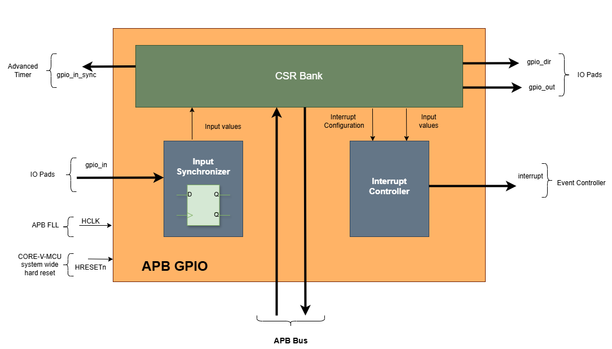
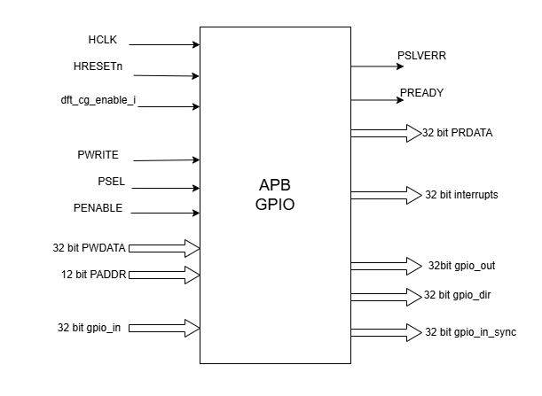

..
   Copyright (c) 2023 OpenHW Group
   Copyright (c) 2024 CircuitSutra

   SPDX-License-Identifier: Apache-2.0 WITH SHL-2.1

.. Level 1
   =======

   Level 2
   -------

   Level 3
   ~~~~~~~

   Level 4
   ^^^^^^^
.. _apb_gpio:

APB_GPIO
========
The General Purpose Input/Output (GPIO) IP block supports S/W access
to read and write the values on selected I/O, and configuring selected
I/O to generate interrupts.

Features
--------

-  Configurable number of GPIO pins (Upto 128, current implementation supports 32).
-  Programmable direction control for each pin (input, output, or open-drain).
-  Individual control for setting, clearing, or toggling output pins
-  Pin status reading capability
-  Interrupt generation capabilities with multiple configurable types:
    - Rising edge detection
    - Falling edge detection
    - Active low level detection
    - Active high level detection
-  Input synchronization to prevent metastability issues.

Architecture
------------

The figure below is a high-level block diagram of the APB GPIO module:-

   APB GPIO Block Diagram

The APB GPIO IP consists of the following key components:

APB control logic
^^^^^^^^^^^^^^^^^
The APB control logic interfaces with the APB bus to decode and execute commands.
It handles register reads and writes according to the APB protocol, providing a standardized interface to the system.

GPIO Configuration Registers
^^^^^^^^^^^^^^^^^^^^^^^^^^^^
These registers store the configuration for each GPIO pin, including:
  - Direction settings (input, output, open-drain)
  - Output value
  - Interrupt type configuration
  - Interrupt enable status

Input Synchronization
^^^^^^^^^^^^^^^^^^^^^
A dual-stage synchronizer prevents metastability issues when sampling external inputs by synchronizing them to the system clock domain.

Interrupt Generation Logic
^^^^^^^^^^^^^^^^^^^^^^^^^^
The interrupt logic detects events based on the configured interrupt type for each pin:
  - Edge detection circuitry for rising and falling edges
  - Level detection for active-high and active-low signals
  - Interrupt blocking mechanism to prevent repeated level interrupts

Programming View Model
----------------------
The APB GPIO IP follows a simple programming model:

GPIO Pin Configuration
^^^^^^^^^^^^^^^^^^^^^^
Each GPIO pin can be configured individually or in groups:
  - Set the desired pin number using the SELECT register
  - Configure the pin direction (input, output, or open-drain) using the SETDIR register
  - Configure interrupt behavior if necessary using the SETINT register

GPIO Pin Control
^^^^^^^^^^^^^^^^
To control GPIO pins:
  - Use SETGPIO to set a pin high
  - Use CLRGPIO to set a pin low
  - Use TOGGPIO to toggle a pin's state
  - Use OUTx registers to set multiple pins at once

GPIO Pin Status
^^^^^^^^^^^^^^^
To read GPIO pin status:
  - Use RDSTAT to read a selected pin's status
  - Use PINx registers to read the status of multiple pins at once

Interrupt Handling
^^^^^^^^^^^^^^^^^^
When an interrupt occurs:
  - Determine the source by reading pin status
  - Handle the interrupt according to application requirements
  - Acknowledge the interrupt using the INTACK register

APB GPIO CSRs
-------------

The GPIO module is typically associated with a set of status and control
registers. These registers allow the processor to read input states, set
output levels, and configure various GPIO settings.

REG_SETGPIO
^^^^^^^^^^^
  - Address Offset: 0x000
+----------------+--------------+----------+-------------+----------------------------------+
| Field          | Bits         | Type     | Default     | Description                      |
+================+==============+==========+=============+==================================+
| PIN_SELECT     | [6:0]        | W        | 0x0         | GPIO pin to set high             |
+----------------+--------------+----------+-------------+----------------------------------+

REG_CLRGPIO
^^^^^^^^^^^
  - Address Offset: 0x004
+----------------+--------------+----------+-------------+----------------------------------+
| Field          | Bits         | Type     | Default     | Description                      |
+================+==============+==========+=============+==================================+
| PIN_SELECT     | [6:0]        | W        | 0x0         | GPIO pin to set low              |
+----------------+--------------+----------+-------------+----------------------------------+

REG_TOGGPIO
^^^^^^^^^^^
  - Address Offset: 0x008
+----------------+--------------+----------+-------------+----------------------------------+
| Field          | Bits         | Type     | Default     | Description                      |
+================+==============+==========+=============+==================================+
| PIN_SELECT     | [6:0]        | W        | 0x0         | GPIO pin to toggle               |
+----------------+--------------+----------+-------------+----------------------------------+

REG_PIN0
^^^^^^^^
  - Address Offset: 0x010
+----------------+--------------+----------+-------------+----------------------------------+
| Field          | Bits         | Type     | Default     | Description                      |
+================+==============+==========+=============+==================================+
| GPIO_IN        | [31:0]       | R        | 0x0         | Read status of GPIO pins 31:0    |
+----------------+--------------+----------+-------------+----------------------------------+

REG_PIN1
^^^^^^^^
  - Address Offset: 0x014
+----------------+--------------+----------+-------------+----------------------------------+
| Field          | Bits         | Type     | Default     | Description                      |
+================+==============+==========+=============+==================================+
| GPIO_IN        | [31:0]       | R        | 0x0         | Read status of GPIO pins 63:32   |
|                |              |          |             | (Not supported)                  |
+----------------+--------------+----------+-------------+----------------------------------+

REG_PIN2
^^^^^^^^
  - Address Offset: 0x018
+----------------+--------------+----------+-------------+----------------------------------+
| Field          | Bits         | Type     | Default     | Description                      |
+================+==============+==========+=============+==================================+
| GPIO_IN        | [31:0]       | R        | 0x0         | Read status of GPIO pins 95:64   |
|                |              |          |             | (Not supported)                  |
+----------------+--------------+----------+-------------+----------------------------------+

REG_PIN3
^^^^^^^^
  - Address Offset: 0x01C
+----------------+--------------+----------+-------------+----------------------------------+
| Field          | Bits         | Type     | Default     | Description                      |
+================+==============+==========+=============+==================================+
| GPIO_IN        | [31:0]       | R        | 0x0         | Read status of GPIO pins 127:96  |
|                |              |          |             | (Not supported)                  |
+----------------+--------------+----------+-------------+----------------------------------+

REG_OUT0
^^^^^^^^
  - Address Offset: 0x020
+----------------+--------------+----------+-------------+----------------------------------+
| Field          | Bits         | Type     | Default     | Description                      |
+================+==============+==========+=============+==================================+
| GPIO_OUT       | [31:0]       | RW       | 0x0         | Set value of GPIO pins 31:0      |
+----------------+--------------+----------+-------------+----------------------------------+

REG_OUT1
^^^^^^^^
  - Address Offset: 0x024
+----------------+--------------+----------+-------------+----------------------------------+
| Field          | Bits         | Type     | Default     | Description                      |
+================+==============+==========+=============+==================================+
| GPIO_OUT       | [31:0]       | RW       | 0x0         | Set value of GPIO pins 63:32     |
|                |              |          |             | (Not supported)                  |
+----------------+--------------+----------+-------------+----------------------------------+

REG_OUT2
^^^^^^^^
  - Address Offset: 0x028
+----------------+--------------+----------+-------------+----------------------------------+
| Field          | Bits         | Type     | Default     | Description                      |
+================+==============+==========+=============+==================================+
| GPIO_OUT       | [31:0]       | RW       | 0x0         | Set value of GPIO pins 95:64     |
|                |              |          |             | (Not supported)                  |
+----------------+--------------+----------+-------------+----------------------------------+

REG_OUT3
^^^^^^^^
  - Address Offset: 0x02C
+----------------+--------------+----------+-------------+----------------------------------+
| Field          | Bits         | Type     | Default     | Description                      |
+================+==============+==========+=============+==================================+
| GPIO_OUT       | [31:0]       | RW       | 0x0         | Set value of GPIO pins 127:96    |
|                |              |          |             | (Not supported)                  |
+----------------+--------------+----------+-------------+----------------------------------+

REG_SETSEL
^^^^^^^^^^
  - Address Offset: 0x030
+----------------+--------------+----------+-------------+----------------------------------+
| Field          | Bits         | Type     | Default     | Description                      |
+================+==============+==========+=============+==================================+
| PIN_SELECT     | [6:0]        | W        | 0x0         | GPIO pin number to select for    |
|                |              |          |             | reading pin using REG_RDSTAT     |
+----------------+--------------+----------+-------------+----------------------------------+

REG_RDSTAT
^^^^^^^^^^
  - Address Offset: 0x034
+----------------+--------------+----------+-------------+----------------------------------+
| Field          | Bits         | Type     | Default     | Description                      |
+================+==============+==========+=============+==================================+
| DIR            | [25:24]      | R        | 0x0         | Direction configuration for      |
|                |              |          |             | selected pin                     |
+----------------+--------------+----------+-------------+----------------------------------+
| INT_TYPE       | [19:17]      | R        | 0x0         | Interrupt type configuration for |
|                |              |          |             | selected pin                     |
+----------------+--------------+----------+-------------+----------------------------------+
| INT_EN         | [16]         | R        | 0x0         | Interrupt enable status for      |
|                |              |          |             | selected pin                     |
+----------------+--------------+----------+-------------+----------------------------------+
| PIN_IN         | [12]         | R        | 0x0         | Input value of selected pin      |
+----------------+--------------+----------+-------------+----------------------------------+
| PIN_OUT        | [8]          | R        | 0x0         | Output value of selected pin     |
+----------------+--------------+----------+-------------+----------------------------------+
| PIN_SELECT     | [6:0]        | R        | 0x0         | Currently selected pin number    |
+----------------+--------------+----------+-------------+----------------------------------+

REG_SETDIR
^^^^^^^^^^
  - Address Offset: 0x038
+----------------+--------------+----------+-------------+----------------------------------+
| Field          | Bits         | Type     | Default     | Description                      |
+================+==============+==========+=============+==================================+
| DIR            | [25:24]      | W        | 0x0         | Direction configuration:         |
|                |              |          |             | 00: Input                        |
|                |              |          |             | 01: Output                       |
|                |              |          |             | 11: Open-Drain                   |
+----------------+--------------+----------+-------------+----------------------------------+
| PIN_SELECT     | [6:0]        | W        | 0x0         | GPIO pin number to configure     |
|                |              |          |             | direction                        |
+----------------+--------------+----------+-------------+----------------------------------+

REG_SETINT
^^^^^^^^^^
  - Address Offset: 0x03C
+----------------+--------------+----------+-------------+----------------------------------+
| Field          | Bits         | Type     | Default     | Description                      |
+================+==============+==========+=============+==================================+
| INT_TYPE       | [19:17]      | W        | 0x0         | Interrupt type:                  |
|                |              |          |             | 000: Active-Low level            |
|                |              |          |             | 001: Falling edge                |
|                |              |          |             | 010: Rising edge                 |
|                |              |          |             | 011: Both edges                  |
|                |              |          |             | 100: Active-High level           |
+----------------+--------------+----------+-------------+----------------------------------+
| INT_EN         | [16]         | W        | 0x0         | Interrupt enable:                |
|                |              |          |             | 0: Disable                       |
|                |              |          |             | 1: Enable                        |
+----------------+--------------+----------+-------------+----------------------------------+
| PIN_SELECT     | [6:0]        | W        | 0x0         | GPIO pin number to configure     |
|                |              |          |             | interrupt                        |
+----------------+--------------+----------+-------------+----------------------------------+

REG_INTACK
^^^^^^^^^^
  - Address Offset: 0x040
+----------------+--------------+----------+-------------+----------------------------------+
| Field          | Bits         | Type     | Default     | Description                      |
+================+==============+==========+=============+==================================+
| PIN_NUM        | [7:0]        | W        | 0x0         | GPIO pin number to acknowledge   |
|                |              |          |             | interrupt                        |
+----------------+--------------+----------+-------------+----------------------------------+

Firmware Guidelines
-------------------
GPIO Pin Configuration Procedure
^^^^^^^^^^^^^^^^^^^^^^^^^^^^^^^^
  - Configuring Pin Direction:
      - Direction of a pin can be configured using the REG_SETDIR register (address 0x038).
          - To configure as input: Place a value of 0 in bits [25:24] along with the pin number in bits [6:0].
          - To configure as output: Place a value of 1 in bits [25:24] along with the pin number in bits [6:0].
          - To configure as open-drain: Place a value of 3 in bits [25:24] along with the pin number in bits [6:0].
  - Configuring Interrupt Behavior
      - Interrupts can only be configured for input pins.
      - If the input pin requires interrupt capability, write to the REG_SETINT register (address 0x03C).
      - Include the pin number in bits [6:0].
      - To enable interrupts, set bit [16] to 1; to disable, set to 0.
      - To configure interrupt type, set bits [19:17] as follows:
          - 000: Active-Low level detection
          - 001: Falling edge detection
          - 010: Rising edge detection
          - 011: Both edges detection
          - 100: Active-High level detection
  - Setting Initial Output Values
      - For individual pins: Use REG_SETGPIO to set high or REG_CLRGPIO to set low, include the pin number in bits [6:0] of input data.
      - For multiple pins simultaneously: Write to the REG_OUT0 register, in which each bit represents corresponding output pin.
      - For REG_OUT0 registers, set the corresponding bit to 1 for high output or 0 for low output.

GPIO Status Reading Procedure
^^^^^^^^^^^^^^^^^^^^^^^^^^^^^
  - Reading Individual Pin Status:
      - First, select the desired pin by writing its number to REG_SETSEL.
      - Read the REG_RDSTAT register (address 0x034).
      - Examine bit [12] for the current input state of the pin.
      - Examine bit [8] for the current output value.
      - Other fields provide configuration information:
            - Bits [25:24]: Direction configuration
            - Bits [19:17]: Interrupt type
            - Bit [16]: Interrupt enable status
  - Reading Multiple Pin States:
      - To read the status of multiple pins at once, read the REG_PIN0 register, in which each bit represents corresponding output pin.
      - A bit value of 1 indicates a high state, 0 indicates a low state.

GPIO Control Procedure
^^^^^^^^^^^^^^^^^^^^^^
  - Setting Individual Pins High:
      - Write the pin number to the REG_SETGPIO register (address 0x000).
      - This operation sets the specified pin to a high state.
  - Setting Individual Pins Low:
      - Write the pin number to the REG_CLRGPIO register (address 0x004).
      - This operation sets the specified pin to a low state.
  - Toggling Individual Pins:
      - Write the pin number to the REG_TOGGPIO register (address 0x008).
      - This inverts the current state of the specified pin.
  - Controlling Multiple Pins Simultaneously:
      - To control multiple pins in one operation, write to the REG_OUT0 register.
      - Each bit position corresponds to the respective pin number.
      - Setting a bit to 1 drives the corresponding pin high; setting to 0 drives it low.

Interrupt Handling Procedure
^^^^^^^^^^^^^^^^^^^^^^^^^^^^
  - Determining the Interrupt Source:
      - Read the REG_PIN0 register to determine which pin(s) triggered the interrupt.
      - For level-sensitive interrupts (active-high or active-low), check the current pin state.
      - For edge-sensitive interrupts, the hardware has already latched the event.
  - Interrupt Processing:
      - Process the interrupt according to application requirements.
      - Note that for level-sensitive interrupts, the source condition must be cleared before acknowledging.
  - Acknowledging the Interrupt:
      - Write the pin number to the REG_INTACK register (address 0x040).
      - This clears the interrupt blocking mechanism for level-sensitive interrupts.

Open-Drain Configuration Guidelines
^^^^^^^^^^^^^^^^^^^^^^^^^^^^^^^^^^^
  - Understanding Open-Drain Operation:
      - In open-drain mode, the pin can drive low or be in high-impedance state.
      - External pull-up resistors are required for pins configured as open-drain.
  - Configuring Open-Drain Mode:
      - Write to REG_SETDIR with a value of 3 in bits [25:24], setting bit 24 makes the pin direction as output and setting bit 25 enables open drain configuration.
      - Include the pin number in bits [6:0].
      - The output value controls whether the pin drives low (output value = 0) or is in high-impedance state (output value = 1).
  - Using Open-Drain Pins:
      - To drive the pin low: Use REG_CLRGPIO or write a 0 to the corresponding bit in REG_OUT0.
      - To place the pin in high-impedance state: Use REG_SETGPIO or write a 1 to the corresponding bit in REG_OUT0.

Pin Diagram
-----------

The figure below represents the input and output pins for the APB GPIO:-

   APB GPIO Pin Diagram

Clock and Reset
^^^^^^^^^^^^^^^

- HCLK: System clock input.
- HRESETn: Active-low reset signal for initializing all internal registers and logic.
- dft_cg_enable_i: Clock gating enable input for DFT or low-power scenarios.

APB Interface Signals
^^^^^^^^^^^^^^^^^^^^^

- PADDR[11:0]: APB address bus input
- PWDATA[31:0]:  APB write data bus input
- PWRITE: APB write control input (high for write, low for read)
- PSEL: APB peripheral select input
- PENABLE: APB enable input
- PRDATA: APB write data bus input
- PREADY: APB ready output to indicate transfer completion
- PSLVERR: APB error response output signal

GPIO Data Signals
^^^^^^^^^^^^^^^^^
- gpio_in[31:0]: External GPIO input values from the physical pins.
- gpio_in_sync[31:0]: Synchronized version of `gpio_in`.
- gpio_out[31:0]: Output values driven onto GPIO pins, if configured as outputs.
- gpio_dir[31:0]: Direction control per pin; 1 = output, 0 = input (or high-impedance for open-drain).

Interrupt Signals
^^^^^^^^^^^^^^^^^
- interrupt[31:0]: Per-pin interrupt outputs, asserted based on edge or level-triggered conditions.

