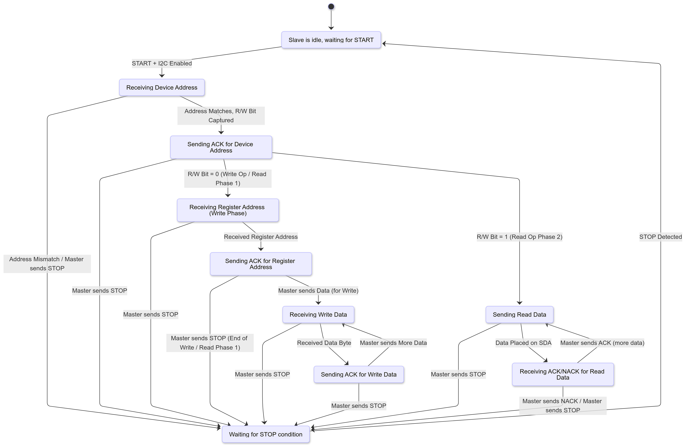

..
   Copyright (c) 2023 OpenHW Group
   Copyright (c) 2024 CircuitSutra

   SPDX-License-Identifier: Apache-2.0 WITH SHL-2.1

.. Level 1
   =======

   Level 2
   -------

   Level 3
   ~~~~~~~

   Level 4
   ^^^^^^^
.. _apb_i2c_slave:

APB I2C SLAVE
=================

The I2C slave enables the CORE-V-MCU to interact with an external I2C master device by responding to transactions on an I2C bus.

Features
--------

- Bidirectional communication between I2C and APB interfaces
- Configurable I2C device address (7-bit)
- Adjustable timing parameters for I2C operation:
    - Debounce length
    - SCL delay length
    - SDA delay length
- Dual communication modes:
    - Single-byte messaging with status tracking
    - FIFO-based data transfer for bulk transfer (up to 256 bytes in each direction)
- Comprehensive interrupt support:
    - Programmable interrupt conditions based on FIFO status flags
    - Separate interrupt paths for I2C and APB interfaces
- FIFO management features:
    - 256-byte FIFO depth for each direction
    - Read and write flags to monitor FIFO status.
    - FIFO flush capability
- I2C operations enable/disable control

Block Architecture
------------------

I2C slave contains I2C slave interface and APB slave interface.
There are FIFOs and CSRs for handling communication with external
I2C controllers.

The figure below is a high-level block diagram of the I2C Slave:-

.. figure:: apb_i2cs_block_diagram.png
   :name: I2C_Slave_Block_Diagram
   :align: center
   :alt:

   I2C Slave Block Diagram

Below is a brief description of the 3 sub-modules:

**APB Slave Interface**

Responsible for APB communication: passing information to and from the I2C CSR module through the APB interface.
It handles the APB protocol, including address decoding, data transfer, and control signal generation.

**I2C Peripheral CSR**

The I2C peripheral CSR houses the CSRs of the I2C Slave and drives the interrupt port for APB and I2C. The CSRs are common to both the APB and I2C interfaces.
The Firmware can access theses CSRs via the APB interface and the external I2C master can access them via the I2C interface.
The CSRs manage the I2C device address, enabling/disabling the I2C slave, and configuring timing parameters for I2C operations and FIFO management.
The external I2C master needs to access the CSRs for different parameters related to transmitting such as interrupt configuration, checking FIFO status, and reading/writing data.
Please refer to the :ref:`I2C Slave CSRs<i2c_slave_csr>` section below for a detailed description of the CSRs.

This module also instantiates two FIFOs:

  - FIFO_sync_256x8_i2c_to_apb: Transfers data from I2C to APB.

  - FIFO_sync_256x8_apb_to_i2c: Transfers data from APB to I2C.

Both FIFOs are 256 bytes deep and 8 bits wide, allowing for efficient burst data transfer between the I2C and APB interfaces.

**I2C Slave INTERFACE**

It handles all I2C protocol operations, including detecting start and stop conditions, address recognition, data transmission and reception,
sending ACK/NACK signals, and managing the timing of the SDA (Serial Data) and SCL (Serial Clock) lines with built-in line filtering.
Communication with the external I2C master occurs over these two lines, forming the I2C bus. 
The module exchanges information with the internal I2C Peripheral CSR block and drives or samples data on the SDA line in coordination with SCL timing, in response to master requests.

**Note**: In I2C Slave module the SDA line is divided into 3 signals - 

- i2c_sda_i: Carries the input data from the I2C master to the slave.
- i2c_sda_o: Carries the output data from the slave to the I2C master.
- i2c_sda_oe: Output enable signal that indicates when i2c_sda_o is actively driving the SDA line. This signal is asserted (high) when the slave is transmitting data.

**Relationship Between I2C and APB Interfaces**
The role of both the I2C and the APB interfaces is to handle their respective communication protocols and facilitate data transfer between the I2C master and the APB master (CORE-V-MCU Core-Complex) 
through the CSRs housed in the I2C Peripheral CSR block. 

I2C Device Address
~~~~~~~~~~~~~~~~~~

The I2C slave device address is a 7-bit address that identifies the slave device on the I2C bus.
The I2C slave module allows the configuration of this address through the ``I2CS_DEV_ADDRESS`` CSR.
When an I2C master sends a START condition followed by the device address, the I2C slave checks if the received address matches the configured address in CSR.
If it matches, the I2C slave acknowledges the address and proceeds with the transaction; otherwise, it ignores the transaction and remains idle.

I2C Signals Processing
~~~~~~~~~~~~~~~~~~~~~~

Debounce Length
^^^^^^^^^^^^^^^

The I2C slave module includes a debounce mechanism to filter out noise on the SDA and SCL lines. 
Debouncing is the process of ensuring that a signal is stable before it is considered valid i.e., it prevents false triggering due to noise or glitches on the I2C lines.
It is particularly important in I2C communication, where the SDA and SCL lines can be susceptible to noise, especially in electrically noisy environments.
The debounce length is configurable through the ``I2CS_DEBOUNCE_LENGTH`` CSR, which specifies the number of system clock cycles over which the I2C lines should be debounced.

**Note**: In the current implementation the debounce length is not used.

SCL and SDA Delay Length
^^^^^^^^^^^^^^^^^^^^^^^^

Delay length is the sampling rate of the SCL and SDA lines, this is used to filter out noise on the I2C lines.
The I2C slave uses counters that count up to these delay values at every clock cycle before sampling the SCL and SDA lines. Only when the counter reaches the specified delay length does it take a new sample of the respective I2C line.
If the SCL or SDA line remain stable for 3 consecutive samples, the I2C slave considers the line stable and valid for processing.
This creates a low-pass filtering effect that removes high-frequency noise while preserving the actual I2C signal transitions.
The SCL and SDA length can be configured through the ``I2CS_SCL_DELAY_LENGTH`` and ``I2CS_SDA_DELAY_LENGTH`` CSRs respectively.

**Configuration:**
  - Shorter delay lengths = faster sampling = less filtering (suitable for clean, high-speed buses)
  - Longer delay lengths = slower sampling = more filtering (suitable for noisy environments or slower I2C speeds)

Communication Between I2C and APB Interfaces
~~~~~~~~~~~~~~~~~~~~~~~~~~~~~~~~~~~~~~~~~~~~

The I2C Slave module facilitates seamless communication between the I2C and APB interfaces, enabling data exchange in both single-byte and burst modes. The communication is managed through FIFOs and CSRs, ensuring efficient and reliable data transfer.

Single-Byte TX Operation flow
^^^^^^^^^^^^^^^^^^^^^^^^^^^^^
  - APB master writes data to ``MSG_APB_TO_I2C`` CSR.
  - Status bit in ``MSG_APB_TO_I2C_STATUS`` CSR is set by hardware.
  - Output interrupt ``i2c_interrupt_o`` is raised if the interrupt is enabled in the ``I2C_INTERRUPT_ENABLE`` CSR and associated bit in ``I2C_INTERRUPT_STATUS`` is set.
  - I2C master initiates a read request over the bus with the address of ``MSG_APB_TO_I2C CSR``, requesting the data of the CSR.
  - I2C slave responds to this request by retrieving the data from the ``MSG_APB_TO_I2C`` CSR and putting it on the I2C bus, delivering it to the external I2C master.
  - Status bit in ``MSG_APB_TO_I2C_STATUS`` and ``I2C_INTERRUPT_STATUS`` is cleared by hardware and the ``i2c_interrupt_o`` signal is lowered.

Single-Byte RX Operation flow
^^^^^^^^^^^^^^^^^^^^^^^^^^^^^
  - I2C master initiates a write request with the addrress of ``MSG_I2C_TO_APB`` CSR and the data to be written.
  - I2C slave retrives the CSR address and data from the APB bus and writes it to the respective CSR( ``MSG_I2C_TO_APB`` CSR in this case).
  - Status bit in ``MSG_I2C_TO_APB_STATUS`` CSR is set by hardware.
  - Output interrupt ``apb_interrupt_o`` is raised if the interrupt is enabled in the ``APB_INTERRUPT_ENABLE`` CSR and associated bit in ``APB_INTERRUPT_STATUS`` is set.
  - APB master reads ``MSG_I2C_TO_APB`` CSR to retrieve data.
  - Status bit in ``MSG_I2C_TO_APB_STATUS`` and ``APB_INTERRUPT_STATUS`` is cleared by hardware and the ``apb_interrupt_o`` signal is lowered.

FIFO-Based Multi-Byte TX Operation flow
^^^^^^^^^^^^^^^^^^^^^^^^^^^^^^^^^^^^^^^
  - APB master writes data to ``FIFO_APB_TO_I2C_WRITE_DATA_PORT`` CSR.
  - The data is pushed in the APB to I2C FIFO by the hardware.
  - FIFO status is reflected in ``FIFO_APB_TO_I2C_WRITE_FLAGS`` CSR.
  - Interrupt can be generated based on FIFO status and interrupt configuration.
  - External I2C master initiates a read request over the bus with the address of ``FIFO_APB_TO_I2C_READ_DATA_PORT`` CSR, requesting the data of the CSR.
  - I2C slave responds to this request by retrieving the data from the ``FIFO_APB_TO_I2C_READ_DATA_PORT`` CSR and putting it on the I2C bus, delivering it to the external I2C master.
  - The data is popped from the APB to I2C FIFO by the hardware.
  - FIFO status is updated in ``FIFO_APB_TO_I2C_READ_FLAGS`` CSR.

FIFO-Based Multi-Byte RX Operation flow
^^^^^^^^^^^^^^^^^^^^^^^^^^^^^^^^^^^^^^^
  - External I2C master initiates a write request with the addrress of ``FIFO_I2C_TO_APB_WRITE_DATA_PORT`` CSR and the data to be written.
  - I2C slave retrives the CSR address and data from the bus and writes it to the respective CSR(``FIFO_I2C_TO_APB_WRITE_DATA_PORT`` CSR in this case).
  - The data is pushed in the I2C to APB FIFO by the hardware.
  - FIFO status is reflected in ``FIFO_I2C_TO_APB_WRITE_FLAGS`` CSR.
  - Interrupt can be generated based on FIFO status and interrupt configuration.
  - APB master reads data from ``FIFO_I2C_TO_APB_READ_DATA_PORT`` CSR.
  - The data is popped from the I2C to APB FIFO by the hardware.
  - FIFO status is updated in ``FIFO_I2C_TO_APB_READ_FLAGS`` CSR.

**Note**: Refer to the I2C states section below for a detailed understanding of I2C operations.

Flags and Interrupts
^^^^^^^^^^^^^^^^^^^^

The I2C Slave module uses flags and interrupts to ensure efficient communication and prevent data loss:

  - **Read Flags:**
      - Indicate the number of items present in the FIFO.
      - Accessible through `FIFO_I2C_TO_APB_READ_FLAGS` (for single-byte reception) and `FIFO_APB_TO_I2C_READ_FLAGS` (for multi-byte reception) CSRs.
  - **Write Flags:**
      - Indicate the available space in the FIFO.
      - Accessible through `FIFO_I2C_TO_APB_WRITE_FLAGS` (for single-byte reception) and `FIFO_APB_TO_I2C_WRITE_FLAGS` (for multi-byte reception) CSRs.
  - **Interrupts:**
      - Generated based on FIFO thresholds or new message availability for both APB and I2C master through dedicated interrupt signals.
      - Configurable through `I2C_INTERRUPT_ENABLE` and `APB_INTERRUPT_ENABLE` CSRs.
      - Status can be monitored using `I2C_INTERRUPT_STATUS` and `APB_INTERRUPT_STATUS` CSRs.

Refer to the respective CSRs for detailed descriptions of the flags and interrupt configurations.

Interrupts
~~~~~~~~~~

The I2C Slave module provides comprehensive interrupt support for both the I2C and APB interfaces. These interrupts are designed to notify the respective masters about specific events or conditions, ensuring efficient communication and data handling.

I2C Interface Interrupts
^^^^^^^^^^^^^^^^^^^^^^^^

The `i2c_interrupt_o` signal is asserted for the external I2C master device to notify of specific coniditons being met. The following conditions can trigger this interrupt:

- Availability of a new single-byte message from the APB to the I2C interface via MSG_APB_TO_I2C CSR.
- Write flags of the I2C-to-APB FIFO reaching specific levels configured via INTERRUPT_FIFO_I2C_TO_APB_WRITE_FLAGS_SELECT CSR, indicating available space in the FIFO.
- Read flags of the APB-to-I2C FIFO reaching specific levels configured via INTERRUPT_FIFO_I2C_TO_APB_READ_FLAGS_SELECT CSR, indicating pending data for the I2C master to process.

The `i2c_interrupt_o` signal is deasserted once the external I2C master has performed the necessary read/write operations to clear the interrupt condition.

APB Interface Interrupts
^^^^^^^^^^^^^^^^^^^^^^^^

The `apb_interrupt_o` signal is asserted for the CORE-V-MCU Core-Complex to notify of specific coniditons being met. The following conditions can trigger this interrupt:

- Availability of a new single-byte message from the I2C to the APB interface via MSG_I2C_TO_APB CSR.
- Write flags of the APB-to-I2C FIFO reaching specific levels configured via INTERRUPT_FIFO_APB_TO_I2C_WRITE_FLAGS_SELECT CSR, indicating available space in the FIFO.
- Read flags of the I2C-to-APB FIFO reaching specific levels configured via INTERRUPT_FIFO_APB_TO_I2C_READ_FLAGS_SELECT CSR, indicating pending data for the APB master to process.

The `apb_interrupt_o` signal is deasserted once the CORE-V-MCU Core-Complex has performed the necessary read/write operations to clear the interrupt condition.

Interrupt Configuration and Handling
^^^^^^^^^^^^^^^^^^^^^^^^^^^^^^^^^^^^

- Interrupts can be enabled or disabled through the `I2C_INTERRUPT_ENABLE` and `APB_INTERRUPT_ENABLE` CSRs.
- The interrupt status can be monitored using the `I2C_INTERRUPT_STATUS` and `APB_INTERRUPT_STATUS` CSRs.
- Specific interrupt conditions for FIFO read and write flags can be configured using the `INTERRUPT_FIFO_I2C_TO_APB_*_FLAGS_SELECT` and `INTERRUPT_FIFO_APB_TO_I2C_*_FLAGS_SELECT` CSRs.
- Once an interrupt is triggered, it is automatically cleared when the corresponding condition(message availability, read flag, write flag) is resolved, ensuring efficient interrupt management.
    - If an interrupt is triggered due to a new single-byte message, the status bit in the respective CSR (`MSG_I2C_TO_APB_STATUS` or `MSG_APB_TO_I2C_STATUS`) is cleared by hardware when the message is read by the firmware via `MSG_I2C_TO_APB` CSR or by the external device via `MSG_APB_TO_I2C` CSR.
    - If an interrupt is triggered due to FIFO read flags, the status bit in the respective CSR (`FIFO_I2C_TO_APB_READ_FLAGS` or `FIFO_APB_TO_I2C_READ_FLAGS`) is cleared by hardware when the FIFO is read until the the read flags change state.
    - If an interrupt is triggered due to FIFO write flags, the status bit in the respective CSR (`FIFO_I2C_TO_APB_WRITE_FLAGS` or `FIFO_APB_TO_I2C_WRITE_FLAGS`) is cleared by hardware when the FIFO is written until the write flags change state.

I2C Operation
~~~~~~~~~~~~~

The Start and Stop conditions define the beginning and end of a data transfer on the I2C bus.
These conditions are signaled by the I2C master and recognized by all devices connected to the bus.

  - START Condition: A Start condition is generated by the master to initiate communication. It is defined by a high-to-low transition on the SDA line while the SCL line remains high. This signals all connected devices to listen for an incoming address and possible data.
  - STOP Condition: A Stop condition is generated by the master to terminate communication. It is defined by a low-to-high transition on the SDA line while the SCL line remains high. This indicates the end of the current transfer and releases the bus for other operations.

The I2C protocol also enforces the use of ACK (Acknowledge) and NACK (Not Acknowledge) signals to confirm successful data transmission.

  - ACK: After each byte of data is sent, the receiving device must acknowledge receipt by pulling the SDA line low during the next clock pulse. This indicates that the data was received successfully.
  - NACK: If a device does not acknowledge receipt of data, it leaves the SDA line high during the next clock pulse. This indicates that either the device is not ready to receive more data or that there is no more data to send.

An important aspect of the I2C slave module is that the I2C master must be aware of the CSR (Control and Status Register) addresses within the slave in order to enable proper communication—such as sending single-byte messages from the I2C master to the APB master, configuring I2C interrupts, and other control operations.

I2C Frame Format
^^^^^^^^^^^^^^^^
The I2C protocol uses a standard message format for communication between a master and one or more slave devices.
Each transaction begins with a START condition and ends with a STOP condition.
The frame format differs slightly depending on whether the master intends to perform a write or a read operation.

I2C Write Frame
^^^^^^^^^^^^^^^
Used when the I2C master writes data to a I2C slave CSR (e.g., CSR access).

**Format**::

    [START] → [I2C Slave Address + Write (0)] → [ACK] → [CSR Address]
    → [ACK] → [Data Byte(s)] → [ACK] → [STOP]

**Description**:

- **START**: Initiated by the I2C master to signal the beginning of a transfer.
- **I2C Slave Address + Write Bit (0)**: 7-bit address followed by a 0 bit indicating a write.
- **ACK**: Acknowledge from the I2C slave.
- **CSR Address**: Address of the CSR within the I2C slave(e.g. `MSG_I2C_TO_APB CSR`).
- **Data Byte(s)**: One or more bytes of data to be written.
- **STOP**: Indicates the end of the transfer.

I2C Read Frame
^^^^^^^^^^^^^^
Used when the I2C master reads data from a CSR inside the I2C slave.

**Format**::

    [START] → [I2C Slave Address + Write (0)] → [ACK] → [CSR Address] → [ACK] 
    → [STOP] → [START] → [I2C Slave Address + Read (1)] → [ACK] 
    → [Data Byte(s)] → [NACK] → [STOP]

**Description**:

- The I2C master first writes the **CSR address** it wants to read from(e.g. `MSG_APB_TO_I2C CSR`).
- A **STOP** condition is issued after writing the CSR address.
- A new **START** condition is then initiated to begin the read phase.
- The I2C master sends the I2C slave address with the **Read bit (1)**.
- The I2C slave responds with data byte(s).
- The I2C master sends **NACK** after the final byte to indicate the end of reading.
- **STOP** concludes the transaction.

Notes
^^^^^
- Each data transfer is acknowledged by the receiver (ACK - logic 0) or not acknowledged (NACK - logic 1).
- CSR access involves this two-phase transaction: write address → read data.

I2C STATES
~~~~~~~~~~

   I2C Slave FSM Diagram

- I2C slave has 10 states, :

   - **ST_IDLE**:
      - Initially, the slave is in this state.
      - The slave may also return to this state if a STOP condition is detected.

   - **ST_DEVADDR**:
      - The slave enters this state after detecting the START sequence and when I2C is enabled through the I2C enable CSR.
      - The slave receives the device address and transfer type (read/write).
      - 8 bits are sent by the master over the SDA line(`i2c_sda_i`), in which the first 7 represents the I2C slave device address and the 8th bit represents transfer type(1: Read, 0: Write).
      - If the received device address does not match the configured address in the I2C device address CSR, the slave stops processing and the transaction is ignored. 

   - **ST_DEVADDRACK**:
      - The slave enters this state after successfully validating the I2C device address and sends an acknowledgment.
      - i2c_sda_o is driven low to indicate a successful acknowledgement.
      - The acknowledgment is released by driving i2c_sda_o high before a new transfer.
      - A read operation sets the I2C state to ST_REGRDATA.
      - A write operation sets the I2C state to ST_REGADDR.

   - **ST_REGADDR**:
      - The slave comes to this state when the master writes the CSR address.
      - The I2C master sends the address of the target CSR located inside the I2C slave device over the SDA line(`i2c_sda_i`). 
      - The slave receives this address to determine which CSR the master intends to write to.

   - **ST_REGADDRACK**:
      - After successfully receiving the CSR address, the slave enters this state and sends an acknowledgment.
      - i2c_sda_o is driven low to indicate a successful acknowledgement.
      - The acknowledgment is released by driving i2c_sda_o high before a new transfer.

   - **ST_REGWDATA**:
      - The slave enters this state if the master wants to write data to CSR.
      - Master sends the data to be written to the CSR over the SDA line(`i2c_sda_i`).
      - The slaves receives the data and then writes it to the intended CSR.

   - **ST_REGWDATAACK**:
      - After successfully writing the data, an acknowledgment bit is sent.
      - i2c_sda_o is driven low to indicate a successful acknowledgment.
      - The acknowledgment is released by driving i2c_sda_o high before a new transfer.

   - **ST_REGRDATA**:
      - The slave enters this state if the master wants to read data from CSR.
      - The slave device places the data from the CSR, whose addressed was received in the previous ST_REGADDR phase, onto the i2c_sda_o line.

   - **ST_REGRDATAACK**:
      - After a successful read, an acknowledgment is received.
      - If a negative acknowledgment is received, the transfer stops.
      - If a successful acknowledgement is received, then I2C state is set to ST_REGRDATA, and more data is read.

   - **ST_WTSTOP**:
      - The slave enters this state if there are no more transactions or if the transfer is to be stopped.

**Note**: The master can stop the communication at any point during any of the above states by sending a stop condition. Whenever a stop condition is received the I2C slave goes into IDLE state.

System Architecture
-------------------

The figure below depicts the connections between the I2C Slave and rest of the modules in CORE-V-MCU:-

.. figure:: apb_i2cs_soc_connections.png
   :name: I2C_Slave_SoC_Connections
   :align: center
   :alt:

   I2C Slave CORE-V-MCU connections diagram

Programming View Model
----------------------

CSR Interaction
~~~~~~~~~~~~~~~

The CSRs are categorized based on their functionality:

1. **Configuration CSRs**:

  - Used to set up the I2C Slave module, including device address, debounce length, and delay parameters.
  - Example: `I2CS_DEV_ADDRESS`, `I2CS_ENABLE`, `I2CS_DEBOUNCE_LENGTH`.

2. **FIFO Management CSRs**:

  - Facilitate data transfer between I2C and APB interfaces using FIFOs.
  - Example: `FIFO_I2C_TO_APB_WRITE_DATA_PORT`, `FIFO_APB_TO_I2C_READ_DATA_PORT`.

3. **Interrupt Control CSRs**:

  - Enable and configure interrupts for efficient communication.
  - Example: `I2C_INTERRUPT_ENABLE`, `APB_INTERRUPT_ENABLE`.

4. **Status CSRs**:

  - Provide real-time information about the module's state, including FIFO flags and interrupt status.
  - Example: `FIFO_I2C_TO_APB_READ_FLAGS`, `I2C_INTERRUPT_STATUS`.

Programming Guidelines
~~~~~~~~~~~~~~~~~~~~~~

1. **Initialization**:

  - Configure the device address, debounce length, and delay parameters.
  - Enable the I2C Slave module and flush FIFOs.

2. **Data Transfer**:

  - Use single-byte or multi-byte communication modes based on application requirements.
  - Monitor FIFO flags to ensure proper data handling.

3. **Interrupt Handling**:

  - Enable interrupts for specific conditions.
  - Service interrupts by reading/writing appropriate CSRs.

4. **FIFO Management**:

  - Flush FIFOs when necessary to reset their state.
  - Monitor FIFO flags to prevent overflow or underflow.

RX and TX Operations
~~~~~~~~~~~~~~~~~~~~

**RX Operation**:
  - For single-byte RX, monitor the `MSG_I2C_TO_APB_STATUS` CSR for new message availability and read the data from `MSG_I2C_TO_APB`.
  - For multi-byte RX, monitor the `FIFO_I2C_TO_APB_READ_FLAGS` CSR for available data and read from `FIFO_I2C_TO_APB_READ_DATA_PORT`.

**TX Operation**:
  - For single-byte TX, write the data to `MSG_APB_TO_I2C`.
  - For multi-byte TX, monitor the `FIFO_APB_TO_I2C_WRITE_FLAGS` CSR for available space and write data to `FIFO_APB_TO_I2C_WRITE_DATA_PORT`.

.. _i2c_slave_csr:

APB I2C Slave CSRs
------------------

The CSRs of the I2C slave are 8 bit CSRs mapped to a 32 bit APB data bus, the same CSRs can be accessed by the I2C interface as well.
Since the APB bus is of 32 bit, the APB addresses are 4x the I2C addresses.
For example, the I2CS_ENABLE CSR is at APB address 0x4, but at I2C address 0x1.
Similarly, the I2CS_SCL_DELAY_LENGTH CSR is at APB address 0xC, but at I2C address 0x3.

Refer to :ref:`Memory Map <memory_map>` for the peripheral domain address of the I2C Slave which is used for APB bus addressing.
NOTE: Several of the I2C Slave CSR are volatile, meaning that their read value may be changed by the hardware.
For example, writing the FIFO_I2C_TO_APB_FLUSH CSR the value will be ignored and the FIFO will be flushed, but reading the CSR will return 0x0.
As the name suggests, the value of non-volatile CSRs is not changed by the hardware. These CSRs retain the last value written by the software.
A CSR's volatility is indicated by its "type".
In I2C Slave the volatility of a CSR will also depend on the mode of access, i.e., whether it is accessed through the APB interface or the I2C interface.

I2CS_DEV_ADDRESS
~~~~~~~~~~~~~~~~

  - APB Offset: 0x0
  - APB type: non-volatile

  - I2C Offset: 0x0
  - I2C type: volatile

+----------------------+----------+------------------+------------------+------------+------------------------------+
| Field                | Bits     | APB access type  | I2C access type  | Default    | Description                  |
+======================+==========+==================+==================+============+==============================+
| RESERVED             | 7:7      | --               | --               | 0x0        | Reserved                     |
+----------------------+----------+------------------+------------------+------------+------------------------------+
| SLAVE_ADDR           | 6:0      | RW               | RO               | 0X6F       | I2C device address           |
+----------------------+----------+------------------+------------------+------------+------------------------------+

I2CS_ENABLE
~~~~~~~~~~~

  - APB Offset: 0X4
  - APB type: non-volatile

  - I2C Offset: 0x1
  - I2C Type: volatile

+----------------------+----------+------------------+------------------+------------+------------------------------+
| Field                | Bits     | APB access type  | I2C access type  | Default    | Description                  |
+======================+==========+==================+==================+============+==============================+
| RESERVED             | 7:1      | --               | --               | 0x0        | Reserved                     |
+----------------------+----------+------------------+------------------+------------+------------------------------+
| IP_ENABLE            | 0:0      | RW               | RO               | 0X00       | IP enabling bit              |
|                      |          |                  |                  |            |                              |
|                      |          |                  |                  |            | 1: I2C slave is enabled      |
|                      |          |                  |                  |            | 0: I2C slave is disabled     |
|                      |          |                  |                  |            |                              |
|                      |          |                  |                  |            | I2C Slave operations(I2C FSM)|
|                      |          |                  |                  |            | can only work if this bit    |
|                      |          |                  |                  |            | is set                       |
+----------------------+----------+------------------+------------------+------------+------------------------------+

I2CS_DEBOUNCE_LENGTH
~~~~~~~~~~~~~~~~~~~~

  - APB Offset: 0x8
  - APB type: non-volatile

  - I2C Offset: 0x2
  - I2C type: volatile

+----------------------+----------+------------------+------------------+------------+-----------------------------+
| Field                | Bits     | APB access type  | I2C access type  | Default    | Description                 |
+======================+==========+==================+==================+============+=============================+
| DEB_LEN              | 7:0      | RW               | RO               | 0X14       | Represents the number of    |
|                      |          |                  |                  |            | system clocks over which    |
|                      |          |                  |                  |            | each I2C line (SL and SDA)  |
|                      |          |                  |                  |            | should be debounced.        |
+----------------------+----------+------------------+------------------+------------+-----------------------------+

I2CS_SCL_DELAY_LENGTH
~~~~~~~~~~~~~~~~~~~~~

  - APB Offset: 0xC
  - APB type: non-volatile

  - I2C Offset: 0x3
  - I2C type: volatile

+----------------------+----------+------------------+------------------+------------+-----------------------------+
| Field                | Bits     | APB access type  | I2C access type  | Default    | Description                 |
+======================+==========+==================+==================+============+=============================+
| SCL_DLY_LEN          | 7:0      | RW               | RO               | 0X14       | Represents the number of    |
|                      |          |                  |                  |            | system clocks over which    |
|                      |          |                  |                  |            | the SCL line will be delayed|
|                      |          |                  |                  |            | relative to SDA line        |
+----------------------+----------+------------------+------------------+------------+-----------------------------+

I2CS_SDA_DELAY_LENGTH
~~~~~~~~~~~~~~~~~~~~~

  - APB Offset: 0x10
  - APB type: non-volatile

  - I2C Offset: 0x4
  - I2C type: volatile

+----------------------+----------+------------------+------------------+------------+-----------------------------+
| Field                | Bits     | APB access type  | I2C access type  | Default    | Description                 |
+======================+==========+==================+==================+============+=============================+
| SDA_DLY_LEN          | 7:0      | RW               | RO               | 0X08       | Represents the number of    |
|                      |          |                  |                  |            | system clocks over which    |
|                      |          |                  |                  |            | the SDA line will be        |
|                      |          |                  |                  |            | delayed relative to the SCL |
|                      |          |                  |                  |            | line.                       |
+----------------------+----------+------------------+------------------+------------+-----------------------------+

MSG_I2C_TO_APB
~~~~~~~~~~~~~~

  - APB Offset: 0x40
  - APB type: volatile

  - I2C Offset: 0x10
  - I2C type: volatile

+----------------------+----------+------------------+------------------+------------+-----------------------------+
| Field                | Bits     | APB access type  | I2C access type  | Default    | Description                 |
+======================+==========+==================+==================+============+=============================+
| I2C_TO_APB           | 7:0      | RO               | RW               | 0X0        | This CSR provide a          |
|                      |          |                  |                  |            | method for passing a single |
|                      |          |                  |                  |            | byte message from the I2C   |
|                      |          |                  |                  |            | interface to the APB        |
|                      |          |                  |                  |            | interface.                  |
+----------------------+----------+------------------+------------------+------------+-----------------------------+

MSG_I2C_TO_APB_STATUS
~~~~~~~~~~~~~~~~~~~~~

  - APB Offset: 0x44
  - APB type: volatile

  - I2C Offset: 0x11
  - I2C type: volatile

+----------------------+----------+------------------+------------------+------------+-----------------------------+
| Field                | Bits     | APB access type  | I2C access type  | Default    | Description                 |
+======================+==========+==================+==================+============+=============================+
| RESERVED             | 7:1      | --               | --               | 0x0        |                             |
+----------------------+----------+------------------+------------------+------------+-----------------------------+
| I2C_TO_APB_STATUS    | 0:0      | RO               | RO               | 0X0        | This CSR indicates if       |
|                      |          |                  |                  |            | a single byte message is    |
|                      |          |                  |                  |            | available from I2C to APB.  |
+----------------------+----------+------------------+------------------+------------+-----------------------------+

MSG_APB_TO_I2C
~~~~~~~~~~~~~~

  - APB Offset: 0x48
  - APB type: non-volatile

  - I2C Offset: 0x12
  - I2C type: volatile

+----------------------+----------+------------------+------------------+------------+-----------------------------+
| Field                | Bits     | APB access type  | I2C access type  | Default    | Description                 |
+======================+==========+==================+==================+============+=============================+
| APB_TO_I2C           | 7:0      | RW               | RO               | 0X0        | This CSR provides a         |
|                      |          |                  |                  |            | method for passing a single |
|                      |          |                  |                  |            | byte message from the APB   |
|                      |          |                  |                  |            | interface to the I2C        |
|                      |          |                  |                  |            | interface.                  |
+----------------------+----------+------------------+------------------+------------+-----------------------------+

MSG_APB_I2C_STATUS
~~~~~~~~~~~~~~~~~~

  - APB Offset: 0x4C
  - APB type: volatile

  - I2C Offset: 0x13
  - I2C type: volatile

+----------------------+----------+------------------+------------------+------------+-----------------------------+
| Field                | Bits     | APB access type  | I2C access type  | Default    | Description                 |
+======================+==========+==================+==================+============+=============================+
| RESERVED             | 7:1      | --               | --               | 0x0        |                             |
+----------------------+----------+------------------+------------------+------------+-----------------------------+
| APB_TO_I2C_STATUS    | 0:0      | RO               | RO               | 0X0        | This CSR indicates if       |
|                      |          |                  |                  |            | a single byte message is    |
|                      |          |                  |                  |            | available from APB to I2C.  |
+----------------------+----------+------------------+------------------+------------+-----------------------------+

FIFO_I2C_TO_APB_WRITE_DATA_PORT
~~~~~~~~~~~~~~~~~~~~~~~~~~~~~~~

  - APB Offset: 0x80
  - APB type: NA
  - I2C Offset: 0x20
  - I2C type: non-volatile

+----------------------+----------+------------------+------------------+------------+-----------------------------+
| Field                | Bits     | APB access type  | I2C access type  | Default    | Description                 |
+======================+==========+==================+==================+============+=============================+
| I2C_APB_WRITE_DA     | 7:0      | --               | WO               | 0x0        | Not accessible by APB       |
| TA_PORT              |          |                  |                  |            | interface                   |
|                      |          |                  |                  |            |                             |
|                      |          |                  |                  |            | The I2C slave writes to this|
|                      |          |                  |                  |            | CSR when it wants to send   |
|                      |          |                  |                  |            | multi-byte message. The data|
|                      |          |                  |                  |            | written to this CSR is      |
|                      |          |                  |                  |            | pushed onto the I2C to APB  | 
|                      |          |                  |                  |            | FIFO.                       |
+----------------------+----------+------------------+------------------+------------+-----------------------------+

FIFO_I2C_TO_APB_READ_DATA_PORT
~~~~~~~~~~~~~~~~~~~~~~~~~~~~~~

  - APB Offset: 0x084
  - APB type: volatile

  - I2C Offset: 0x21
  - I2C type: NA

+----------------------+----------+------------------+------------------+------------+-----------------------------+
| Field                | Bits     | APB access type  | I2C access type  | Default    | Description                 |
+======================+==========+==================+==================+============+=============================+
| I2C_APB_READ_DA      | 7:0      | RO               | --               | 0x0        | Not accessible by I2C       |
| TA_PORT              |          |                  |                  |            | interface                   |
|                      |          |                  |                  |            |                             |
|                      |          |                  |                  |            | The APB master reads from   |
|                      |          |                  |                  |            | this CSR when it wants to   |
|                      |          |                  |                  |            | retrieve multi-byte message |
|                      |          |                  |                  |            | from I2C to APB FIFO. Once  |
|                      |          |                  |                  |            | the APB master reads this   |
|                      |          |                  |                  |            | CSR, the data is popped from|
|                      |          |                  |                  |            | the I2C to APB FIFO.        |
+----------------------+----------+------------------+------------------+------------+-----------------------------+

FIFO_I2C_TO_APB_FLUSH
~~~~~~~~~~~~~~~~~~~~~

  - APB Offset: 0x088
  - APB type: volatile

  - I2C Offset: 0x22
  - I2C type: volatile

+----------------------+----------+------------------+------------------+------------+-----------------------------+
| Field                | Bits     | APB access type  | I2C access type  | Default    | Description                 |
+======================+==========+==================+==================+============+=============================+
| RESERVED             | 7:1      | --               | --               | 0x0        | RESERVED                    |
+----------------------+----------+------------------+------------------+------------+-----------------------------+
| ENABLE               | 0:0      | RW               | RW               | 0x0        | Writing a 1 to this         |
|                      |          |                  |                  |            | CSR bit will flush          |
|                      |          |                  |                  |            | the I2C to APB FIFO clearing|
|                      |          |                  |                  |            | all the contents and        |
|                      |          |                  |                  |            | rendering the FIFO to be    |
|                      |          |                  |                  |            | empty.                      |
+----------------------+----------+------------------+------------------+------------+-----------------------------+

FIFO_I2C_TO_APB_WRITE_FLAGS
~~~~~~~~~~~~~~~~~~~~~~~~~~~

  - APB Offset: 0x08C
  - APB type: volatile

  - I2C Offset: 0x23
  - I2C type: volatile

+----------------------+----------+------------------+------------------+------------+-----------------------------------------+
| Field                | Bits     | APB access type  | I2C access type  | Default    | Description                             |
+======================+==========+==================+==================+============+=========================================+
| RESERVED             | 7:3      | --               | --               | 0x0        | RESERVED                                |
+----------------------+----------+------------------+------------------+------------+-----------------------------------------+
| FLAGS                | 2:0      | RO               | RO               | 0x0        | Represent the number of                 |
|                      |          |                  |                  |            | spaces left in I2C TO APB               |
|                      |          |                  |                  |            | FIFO in flags format.                   |
|                      |          |                  |                  |            |                                         |
|                      |          |                  |                  |            | The flags range from 0 to 7             |
|                      |          |                  |                  |            | indicating different levels             |
|                      |          |                  |                  |            | of available space in FIFO.             |
|                      |          |                  |                  |            |                                         |
|                      |          |                  |                  |            | Flag Value descriptions:                |
|                      |          |                  |                  |            |                                         |
|                      |          |                  |                  |            | * 0b000: 128+ spaces available in FIFO  |
|                      |          |                  |                  |            | * 0b001: 64-127 spaces available in FIFO|
|                      |          |                  |                  |            | * 0b010: 32-63 spaces available in FIFO |
|                      |          |                  |                  |            | * 0b011: 8-31 spaces available in FIFO  |
|                      |          |                  |                  |            | * 0b100: 4-7 spaces available in FIFO   |
|                      |          |                  |                  |            | * 0b101: 2-3 spaces available in FIFO   |
|                      |          |                  |                  |            | * 0b110: 1 space available in FIFO      |
|                      |          |                  |                  |            | * 0b111: FIFO is full                   |
+----------------------+----------+------------------+------------------+------------+-----------------------------------------+

FIFO_I2C_TO_APB_READ_FLAGS
~~~~~~~~~~~~~~~~~~~~~~~~~~

  - APB Offset: 0x90
  - APB type: volatile

  - I2C Offset: 0x24
  - I2C type: volatile

+----------------------+----------+------------------+------------------+------------+-----------------------------------+
| Field                | Bits     | APB access type  | I2C access type  | Default    | Description                       |
+======================+==========+==================+==================+============+===================================+
| RESERVED             | 7:3      | --               | --               | 0x0        | RESERVED                          |
+----------------------+----------+------------------+------------------+------------+-----------------------------------+
| FLAGS                | 2:0      | RO               | RO               | 0x0        | Represent the items               |
|                      |          |                  |                  |            | present in FIFO to read in        |
|                      |          |                  |                  |            | I2C TO APB FIFO in  flags         |
|                      |          |                  |                  |            |                                   |
|                      |          |                  |                  |            | The flags range from 0 to 7       |
|                      |          |                  |                  |            | indicating different levels       |
|                      |          |                  |                  |            | of items present in FIFO.         |
|                      |          |                  |                  |            |                                   |
|                      |          |                  |                  |            | Flag Value descriptions:          |
|                      |          |                  |                  |            |                                   |
|                      |          |                  |                  |            | * 0: FIFO is empty                |
|                      |          |                  |                  |            | * 1: 1 item present in FIFO       |
|                      |          |                  |                  |            | * 2: 2-3 items present in FIFO    |
|                      |          |                  |                  |            | * 3: 4-7 items present in FIFO    |
|                      |          |                  |                  |            | * 4: 8-31 items present in FIFO   |
|                      |          |                  |                  |            | * 5: 32-63 items present in FIFO  |
|                      |          |                  |                  |            | * 6: 64-127 items present in FIFO |
|                      |          |                  |                  |            | * 7: 127+ items present in FIFO   |
+----------------------+----------+------------------+------------------+------------+-----------------------------------+

FIFO_APB_TO_I2C_WRITE_DATA_PORT
~~~~~~~~~~~~~~~~~~~~~~~~~~~~~~~

  - APB Offset: 0XC0
  - APB type: non-volatile

  - I2C Offset: 0x30
  - I2C type: NA

+----------------------+----------+------------------+------------------+------------+-----------------------------+
| Field                | Bits     | APB access type  | I2C access type  | Default    | Description                 |
+======================+==========+==================+==================+============+=============================+
| I2C_APB_WRITE_DA     | 7:0      | WO               | --               | 0x0        | Not accessible by I2C       |
| TA_PORT              |          |                  |                  |            | interface                   |
|                      |          |                  |                  |            |                             |
|                      |          |                  |                  |            | The APB master writes to    |
|                      |          |                  |                  |            | this CSR when it wants to   |
|                      |          |                  |                  |            | send multi-byte message. The|
|                      |          |                  |                  |            | data written to this CSR is |
|                      |          |                  |                  |            | pushed onto the APB to I2C  |
|                      |          |                  |                  |            | FIFO.                       |
+----------------------+----------+------------------+------------------+------------+-----------------------------+

FIFO_APB_TO_I2C_READ_DATA_PORT
~~~~~~~~~~~~~~~~~~~~~~~~~~~~~~

  - APB Offset: 0XC4
  - APB type: NA

  - I2C Offset: 0x31
  - I2C type: volatile

+----------------------+----------+------------------+------------------+------------+-----------------------------+
| Field                | Bits     | APB access type  | I2C access type  | Default    | Description                 |
+======================+==========+==================+==================+============+=============================+
| I2C_APB_READ_DA      | 7:0      | --               | RO               | 0x0        | Not accessible by APB       |
| TA_PORT              |          |                  |                  |            | interface                   |
|                      |          |                  |                  |            |                             |
|                      |          |                  |                  |            | The I2C master reads from   |
|                      |          |                  |                  |            | this CSR when it wants to   |
|                      |          |                  |                  |            | retrieve multi-byte message |
|                      |          |                  |                  |            | from APB to I2C FIFO. Once  |
|                      |          |                  |                  |            | the I2C master reads this   |
|                      |          |                  |                  |            | CSR, the data is popped from|
|                      |          |                  |                  |            | the APB to I2C FIFO.        |
+----------------------+----------+------------------+------------------+------------+-----------------------------+

FIFO_APB_TO_I2C_FLUSH
~~~~~~~~~~~~~~~~~~~~~

  - APB Offset: 0XC8
  - APB type: volatile

  - I2C Offset: 0x32
  - I2C type: volatile

+----------------------+----------+------------------+------------------+------------+-----------------------------+
| Field                | Bits     | APB access type  | I2C access type  | Default    | Description                 |
+======================+==========+==================+==================+============+=============================+
| RESERVED             | 7:1      | --               | --               | 0x0        | RESERVED                    |
+----------------------+----------+------------------+------------------+------------+-----------------------------+
| ENABLE               | 0:0      | RW               | RW               | 0x0        | Writing a 1 to this         |
|                      |          |                  |                  |            | CSR bit will flush          |
|                      |          |                  |                  |            | the APB to I2C FIFO,        |
|                      |          |                  |                  |            | clearing all contents and   |
|                      |          |                  |                  |            | rendering the FIFO to be    |
|                      |          |                  |                  |            | empty.                      |
+----------------------+----------+------------------+------------------+------------+-----------------------------+

FIFO_APB_TO_I2C_WRITE_FLAGS
~~~~~~~~~~~~~~~~~~~~~~~~~~~

  - APB Offset: 0XCC
  - APB type: volatile

  - I2C Offset: 0x33
  - I2C type: volatile

+----------------------+----------+------------------+------------------+------------+-----------------------------+
| Field                | Bits     | APB access type  | I2C access type  | Default    | Description                 |
+======================+==========+==================+==================+============+=============================+
| RESERVED             | 7:3      | --               | --               | 0x0        |                             |
+----------------------+----------+------------------+------------------+------------+-----------------------------+
| FLAGS                | 2:0      | RO               | RO               | 0x0        | Represent number of spaces  |
|                      |          |                  |                  |            | left in APB TO I2C FIFO in  |
|                      |          |                  |                  |            | flags format.               |
|                      |          |                  |                  |            |                             |
|                      |          |                  |                  |            | The flags range from 0 to 7 |
|                      |          |                  |                  |            | indicating different levels |
|                      |          |                  |                  |            | of available space in FIFO. |
|                      |          |                  |                  |            |                             |
|                      |          |                  |                  |            | NOTE: For flag value        |
|                      |          |                  |                  |            | description please refer to |
|                      |          |                  |                  |            | FIFO_I2C_TO_APB_WRITE_FLAGS |
|                      |          |                  |                  |            | CSR                         |
+----------------------+----------+------------------+------------------+------------+-----------------------------+

FIFO_APB_TO_I2C_READ_FLAGS
~~~~~~~~~~~~~~~~~~~~~~~~~~

  - APB Offset: 0XD0
  - APB type: volatile

  - I2C Offset: 0x34
  - I2C type: volatile

+----------------------+----------+------------------+------------------+------------+-----------------------------+
| Field                | Bits     | APB access type  | I2C access type  | Default    | Description                 |
+======================+==========+==================+==================+============+=============================+
| RESERVED             | 7:3      | --               | --               | 0x0        |                             |
+----------------------+----------+------------------+------------------+------------+-----------------------------+
| FLAGS                | 2:0      | RO               | RO               | 0x0        | Represent the items         |
|                      |          |                  |                  |            | present in APB TO I2C FIFO  |
|                      |          |                  |                  |            | to read.                    |
|                      |          |                  |                  |            |                             |
|                      |          |                  |                  |            | The flags range from 0 to 7 |
|                      |          |                  |                  |            | indicating different levels |
|                      |          |                  |                  |            | of items present in FIFO.   |
|                      |          |                  |                  |            |                             |
|                      |          |                  |                  |            | NOTE: For flag value        |
|                      |          |                  |                  |            | description please refer to |
|                      |          |                  |                  |            | FIFO_I2C_TO_APB_READ_FLAGS  |
|                      |          |                  |                  |            | CSR                         |
+----------------------+----------+------------------+------------------+------------+-----------------------------+

I2C_INTERRUPT_STATUS
~~~~~~~~~~~~~~~~~~~~

  - APB Offset: 0x100
  - APB type: volatile

  - I2C Offset: 0x40
  - I2C type: volatile

+----------------------+----------+------------------+------------------+------------+-----------------------------+
| Field                | Bits     | APB access type  | I2C access type  | Default    | Description                 |
+======================+==========+==================+==================+============+=============================+
| RESERVED             | 7:3      | --               | --               | 0x0        | Reserved                    |
+----------------------+----------+------------------+------------------+------------+-----------------------------+
| I2C_APB_F            | 2:2      | RO               | RO               | 0x0        | 1: Interrupt is generated   |
| IFO_WRITE_STATUS     |          |                  |                  |            | for this field              |
|                      |          |                  |                  |            |                             |
|                      |          |                  |                  |            | 0: Not genertated           |
|                      |          |                  |                  |            |                             |
|                      |          |                  |                  |            | Indicates if interrupt is   |
|                      |          |                  |                  |            | generated for the I2C to APB|
|                      |          |                  |                  |            | FIFO write flags.           |
+----------------------+----------+------------------+------------------+------------+-----------------------------+
| APB_I2C_F            | 1:1      | RO               | RO               | 0x0        | 1: Interrupt is generated   |
| IFO_READ_STATUS      |          |                  |                  |            | for this field              |
|                      |          |                  |                  |            |                             |
|                      |          |                  |                  |            | 0: Not genertated           |
|                      |          |                  |                  |            |                             |
|                      |          |                  |                  |            | Indicates if interrupt is   |
|                      |          |                  |                  |            | generated for the APB to I2C|
|                      |          |                  |                  |            | FIFO read flags.            |
+----------------------+----------+------------------+------------------+------------+-----------------------------+
| APB_I2C_M            | 0:0      | RO               | RO               | 0x0        | 1: Interrupt is generated   |
| ESSAGE_AVAILABLE     |          |                  |                  |            | for this field              |
|                      |          |                  |                  |            |                             |
|                      |          |                  |                  |            | 0: Not genertated           |
|                      |          |                  |                  |            |                             |
|                      |          |                  |                  |            | Indicates if interrupt is   |
|                      |          |                  |                  |            | generated for the I2C to APB|
|                      |          |                  |                  |            | message available status.   |
+----------------------+----------+------------------+------------------+------------+-----------------------------+

I2C_INTERRUPT_ENABLE
~~~~~~~~~~~~~~~~~~~~

  - APB Offset: 0x104
  - APB type: volatile

  - I2C Offset: 0x41
  - I2C type: non-volatile

+----------------------+----------+------------------+------------------+------------+-----------------------------+
| Field                | Bits     | APB access type  | I2C access type  | Default    | Description                 |
+======================+==========+==================+==================+============+=============================+
| RESERVED             | 7:3      | --               | --               | 0x0        | Reserved                    |
+----------------------+----------+------------------+------------------+------------+-----------------------------+
| I2C_A                | 2:2      | RO               | RW               | 0x0        | 1: enabled                  |
| PB_FIFO_WRITE_S      |          |                  |                  |            |                             |
| TATUS_INT_ENABLE     |          |                  |                  |            | 0: disabled                 |
|                      |          |                  |                  |            |                             |
|                      |          |                  |                  |            | This field enables the      |
|                      |          |                  |                  |            | interrupt for the I2C to APB|
|                      |          |                  |                  |            | FIFO write flags.           |
+----------------------+----------+------------------+------------------+------------+-----------------------------+
| APB_I2C_F            | 1:1      | RO               | RW               | 0x0        | 1: enabled                  |
| IFO_READ_S           |          |                  |                  |            |                             |
| TATUS_INT_ENABLE     |          |                  |                  |            | 0: disabled                 |
|                      |          |                  |                  |            |                             |
|                      |          |                  |                  |            | This field enables the      |
|                      |          |                  |                  |            | interrupt for the APB to I2C|
|                      |          |                  |                  |            | FIFO read flags.            |
+----------------------+----------+------------------+------------------+------------+-----------------------------+
| APB_I2C_M            | 0:0      | RO               | RW               | 0x0        | 1: enabled                  |
| ESSAGE_AVAI          |          |                  |                  |            |                             |
| LABLE_INT_ENABLE     |          |                  |                  |            | 0: disabled                 |
|                      |          |                  |                  |            |                             |
|                      |          |                  |                  |            | This field enables the      |
|                      |          |                  |                  |            | interrupt for the I2C to APB|
|                      |          |                  |                  |            | message available status.   |
+----------------------+----------+------------------+------------------+------------+-----------------------------+

INTERRUPT_FIFO_I2C_TO_APB_WRITE_FLAGS_SELECT
~~~~~~~~~~~~~~~~~~~~~~~~~~~~~~~~~~~~~~~~~~~~

  - APB Offset: 0x108
  - APB type: volatile

  - I2C Offset: 0x42
  - I2C type: non-volatile

+----------------------+----------+------------------+------------------+------------+----------------------------+
| Field                | Bits     | APB access type  | I2C access type  | Default    | Description                |
+======================+==========+==================+==================+============+============================+
| WRITE_FLAG_FULL      | 7:7      | RO               | RW               | 0x0        | If this bit is set, then   |
|                      |          |                  |                  |            | interrupt will be generated|
|                      |          |                  |                  |            | when the I2C to APB FIFO   |
|                      |          |                  |                  |            | is full, given that the    |
|                      |          |                  |                  |            | write flags interrupt is   |
|                      |          |                  |                  |            | enabled.                   |
+----------------------+----------+------------------+------------------+------------+----------------------------+
| WRITE_FL             | 6:6      | RO               | RW               | 0x0        | If this bit is set, then   |
| AG_1_SPACE_AVAIL     |          |                  |                  |            | interrupt will be generated|
|                      |          |                  |                  |            | when there is 1 space      |
|                      |          |                  |                  |            | available in the I2C to APB|
|                      |          |                  |                  |            | FIFO, given that the write |
|                      |          |                  |                  |            | flags interrupt is enabled.|
+----------------------+----------+------------------+------------------+------------+----------------------------+
| WRITE_FLAG           | 5:5      | RO               | RW               | 0x0        | If this bit is set, then   |
| _2_3_SPACE_AVAIL     |          |                  |                  |            | interrupt will be generated|
|                      |          |                  |                  |            | when there are 2-3 spaces  |
|                      |          |                  |                  |            | available in the I2C to APB|
|                      |          |                  |                  |            | FIFO, given that the write |
|                      |          |                  |                  |            | flags interrupt is enabled.|
+----------------------+----------+------------------+------------------+------------+----------------------------+
| WRITE_FLAG           | 4:4      | RO               | RW               | 0x0        | If this bit is set, then   |
| _4_7_SPACE_AVAIL     |          |                  |                  |            | interrupt will be generated|
|                      |          |                  |                  |            | when there are 4-7 spaces  |
|                      |          |                  |                  |            | available in the I2C to APB|
|                      |          |                  |                  |            | FIFO, given that the write |
|                      |          |                  |                  |            | flags interrupt is enabled.|
+----------------------+----------+------------------+------------------+------------+----------------------------+
| WRITE_FLAG           | 3:3      | RO               | RW               | 0x0        | If this bit is set, then   |
| _8_31_SPACE_AVAIL    |          |                  |                  |            | interrupt will be generated|
|                      |          |                  |                  |            | when there are 8-31 spaces |
|                      |          |                  |                  |            | available in the I2C to APB|
|                      |          |                  |                  |            | FIFO, given that the write |
|                      |          |                  |                  |            | flags interrupt is enabled.|
+----------------------+----------+------------------+------------------+------------+----------------------------+
| WRITE_FLAG_3         | 2:2      | RO               | RW               | 0x0        | If this bit is set, then   |
| 2_63_SPACE_AVAIL     |          |                  |                  |            | interrupt will be generated|
|                      |          |                  |                  |            | when there are 32-63 spaces|
|                      |          |                  |                  |            | available in the I2C to APB|
|                      |          |                  |                  |            | FIFO, given that the write |
|                      |          |                  |                  |            | flags interrupt is enabled.|
+----------------------+----------+------------------+------------------+------------+----------------------------+
| WRITE_FLAG_64        | 1:1      | RO               | RW               | 0x0        | If this bit is set, then   |
| _127_SPACE_AVAIL     |          |                  |                  |            | interrupt will be generated|
|                      |          |                  |                  |            | when there are 64-127      |
|                      |          |                  |                  |            | spaces available in the I2C| 
|                      |          |                  |                  |            | to APB FIFO, given that the|
|                      |          |                  |                  |            | write flags interrupt is   |
|                      |          |                  |                  |            | enabled.                   |
+----------------------+----------+------------------+------------------+------------+----------------------------+
| WRITE_FLAG_1         | 0:0      | RO               | RW               | 0x0        | If this bit is set, then   |
| 28__SPACE_AVAIL      |          |                  |                  |            | interrupt will be generated|
|                      |          |                  |                  |            | when there are more than   |
|                      |          |                  |                  |            | 127 spaces available in the|
|                      |          |                  |                  |            | I2C to APB FIFO, given that|
|                      |          |                  |                  |            | the write flags interrupt  |
|                      |          |                  |                  |            | is enabled.                |
+----------------------+----------+------------------+------------------+------------+----------------------------+

INTERRUPT_FIFO_APB_TO_I2C_READ_FLAGS_SELECT
~~~~~~~~~~~~~~~~~~~~~~~~~~~~~~~~~~~~~~~~~~~

  - APB Offset: 0x10C
  - APB type: volatile

  - I2C Offset: 0x43
  - I2C type: non-volatile

+----------------------+----------+------------------+------------------+------------+----------------------------+
| Field                | Bits     | APB access type  | I2C access type  | Default    | Description                |
+======================+==========+==================+==================+============+============================+
| READ_FLAG            | 7:7      | RO               | RW               | 0x0        | If this bit is set, then   |
| _128_SPACE_AVAIL     |          |                  |                  |            | interrupt will be generated|
|                      |          |                  |                  |            | when the APB To I2C FIFO   |
|                      |          |                  |                  |            | has more than 127 items,   |
|                      |          |                  |                  |            | given that the read flags  |
|                      |          |                  |                  |            | interrupt is enabled.      |
+----------------------+----------+------------------+------------------+------------+----------------------------+
| READ_FLAG_64         | 6:6      | RO               | RW               | 0x0        | If this bit is set, then   |
| _127_SPACE_AVAIL     |          |                  |                  |            | interrupt will be generated|
|                      |          |                  |                  |            | when the APB To I2C FIFO   |
|                      |          |                  |                  |            | has 64-127 items, given    |
|                      |          |                  |                  |            | that the read flags        |
|                      |          |                  |                  |            | interrupt is enabled.      |
+----------------------+----------+------------------+------------------+------------+----------------------------+
| READ_FLAAG_3         | 5:5      | RO               | RW               | 0x0        | If this bit is set, then   |
| 2_63_SPACE_AVAIL     |          |                  |                  |            | interrupt will be generated|
|                      |          |                  |                  |            | when the APB To I2C FIFO   |
|                      |          |                  |                  |            | has 32-63 items, given that|
|                      |          |                  |                  |            | the read flags interrupt is|
|                      |          |                  |                  |            | enabled.                   |
+----------------------+----------+------------------+------------------+------------+----------------------------+
| READ_FLAG_8          | 4:4      | RO               | RW               | 0x0        | If this bit is set, then   |
| _31_SPACE_AVAIL      |          |                  |                  |            | interrupt will be generated|
|                      |          |                  |                  |            | when the APB To I2C FIFO   |
|                      |          |                  |                  |            | has 8-31 items, given that |
|                      |          |                  |                  |            | the read flags interrupt is|
|                      |          |                  |                  |            | enabled.                   |
+----------------------+----------+------------------+------------------+------------+----------------------------+
| READ_FLAG            | 3:3      | RO               | RW               | 0x0        | If this bit is set, then   |
| _4_7_SPACE_AVAIL     |          |                  |                  |            | interrupt will be generated|
|                      |          |                  |                  |            | when the APB To I2C FIFO   |
|                      |          |                  |                  |            | has 4-7 items, given that  |
|                      |          |                  |                  |            | the read flags interrupt is|
|                      |          |                  |                  |            | enabled.                   |
+----------------------+----------+------------------+------------------+------------+----------------------------+
| READ_FLAG            | 2:2      | RO               | RW               | 0x0        | If this bit is set, then   |
| _2_3_SPACE_AVAIL     |          |                  |                  |            | interrupt will be generated|
|                      |          |                  |                  |            | when the APB To I2C FIFO   |
|                      |          |                  |                  |            | has 2-3 items, given that  |
|                      |          |                  |                  |            | the read flags interrupt is|
|                      |          |                  |                  |            | enabled.                   |
+----------------------+----------+------------------+------------------+------------+----------------------------+
| READ_FL              | 1:1      | RO               | RW               | 0x0        | If this bit is set, then   |
| AG_1_SPACE_AVAIL     |          |                  |                  |            | interrupt will be generated|
|                      |          |                  |                  |            | when there is 1 item       |
|                      |          |                  |                  |            | available in the APB To I2C|
|                      |          |                  |                  |            | FIFO, given that the read  |
|                      |          |                  |                  |            | flags interrupt is enabled.|
+----------------------+----------+------------------+------------------+------------+----------------------------+
| READ_FLAG_EMPTY      | 0:0      | RO               | RW               | 0x0        | If this bit is set, then   |
|                      |          |                  |                  |            | interrupt will be generated|
|                      |          |                  |                  |            | when the APB To I2C FIFO   |
|                      |          |                  |                  |            | is empty, given that the   |
|                      |          |                  |                  |            | read flags interrupt is    |
|                      |          |                  |                  |            | enabled.                   |
+----------------------+----------+------------------+------------------+------------+----------------------------+

APB_INTERRUPT_STATUS
~~~~~~~~~~~~~~~~~~~~

  - APB Offset: 0x140
  - APB type: volatile

  - I2C Offset: 0x50
  - I2C type: volatile

+----------------------+----------+------------------+------------------+------------+----------------------------+
| Field                | Bits     | APB access type  | I2C access type  | Default    | Description                |
+======================+==========+==================+==================+============+============================+
| RESERVED             | 7:3      | --               | --               | 0x0        | Reserved                   |
+----------------------+----------+------------------+------------------+------------+----------------------------+
| APB_I2C_F            | 2:2      | RO               | RO               | 0x0        | 1: Interrupt is generated  |
| IFO_WRITE_STATUS     |          |                  |                  |            |                            |
|                      |          |                  |                  |            | 0: Not genertated          |
|                      |          |                  |                  |            |                            |
|                      |          |                  |                  |            | Indicates if interrupt is  |
|                      |          |                  |                  |            | generated for APB to I2C   |
|                      |          |                  |                  |            | FIFO write flags.          |
+----------------------+----------+------------------+------------------+------------+----------------------------+
| I2C_APB_F            | 1:1      | RO               | RO               | 0x0        | 1: Interrupt is generated  |
| IFO_READ_STATUS      |          |                  |                  |            |                            |
|                      |          |                  |                  |            | 0: Not genertated          |
|                      |          |                  |                  |            |                            |
|                      |          |                  |                  |            | Indicates if interrupt is  |
|                      |          |                  |                  |            | generated for APB to I2C   |
|                      |          |                  |                  |            | FIFO read flags.           |
+----------------------+----------+------------------+------------------+------------+----------------------------+
| NEW_I                | 0:0      | RO               | RO               | 0x0        | 1: Interrupt is generated  |
| 2C_APB_MSG_AVAIL     |          |                  |                  |            |                            |
|                      |          |                  |                  |            | 0: Not genertated          |
|                      |          |                  |                  |            |                            |
|                      |          |                  |                  |            | Indicates if interrupt is  |
|                      |          |                  |                  |            | generated for I2C to APB   |
|                      |          |                  |                  |            | message available status.  |
+----------------------+----------+------------------+------------------+------------+----------------------------+

APB_INTERRUPT_ENABLE
~~~~~~~~~~~~~~~~~~~~

  - APB Offset: 0x144
  - APB type: non-volatile

  - I2C Offset: 0x51
  - I2C type: volatile

+----------------------+----------+------------------+------------------+------------+----------------------------+
| Field                | Bits     | APB access type  | I2C access type  | Default    | Description                |
+======================+==========+==================+==================+============+============================+
| RESERVED             | 7:3      | --               | --               | 0x0        | Reserved                   |
+----------------------+----------+------------------+------------------+------------+----------------------------+
| APB_I2C_FIFO_WRI     | 2:2      | RW               | RO               | 0x0        | 1: enabled                 |
| TE_STATUS_ENABLE     |          |                  |                  |            |                            |
|                      |          |                  |                  |            | 0: disabled                |
|                      |          |                  |                  |            |                            |
|                      |          |                  |                  |            | This field enables the     |
|                      |          |                  |                  |            | interrupt for the APB to   |
|                      |          |                  |                  |            | I2C FIFO write flags.      |
+----------------------+----------+------------------+------------------+------------+----------------------------+
| I2C_APB_FIFO_RE      | 1:1      | RW               | RO               | 0x0        | 1: enabled                 |
| AD_STATUS_ENABLE     |          |                  |                  |            |                            |
|                      |          |                  |                  |            | 0: disabled                |
|                      |          |                  |                  |            |                            |
|                      |          |                  |                  |            | This field enables the     |
|                      |          |                  |                  |            | interrupt for the I2C to   |
|                      |          |                  |                  |            | APB FIFO read flags.       |
+----------------------+----------+------------------+------------------+------------+----------------------------+
| NEW_I2C_APB_M        | 0:0      | RW               | RO               | 0x0        | 1: enabled                 |
| SG_AVAIL_ENABLE      |          |                  |                  |            |                            |
|                      |          |                  |                  |            | 0: disabled                |
|                      |          |                  |                  |            |                            |
|                      |          |                  |                  |            | This field enables the     |
|                      |          |                  |                  |            | interrupt for the I2C to   |
|                      |          |                  |                  |            | APB message available      |
|                      |          |                  |                  |            | status.                    |
+----------------------+----------+------------------+------------------+------------+----------------------------+

INTERRUPT_FIFO_APB_TO_I2C_WRITE_FLAGS_SELECT
~~~~~~~~~~~~~~~~~~~~~~~~~~~~~~~~~~~~~~~~~~~~

  - APB Offset: 0x148
  - APB type: non-volatile

  - I2C Offset: 0x52
  - I2C type: volatile

+----------------------+----------+------------------+------------------+------------+----------------------------+
| Field                | Bits     | APB access type  | I2C access type  | Default    | Description                |
+======================+==========+==================+==================+============+============================+
| WRITE_FLAG_FULL      | 7:7      | RO               | RW               | 0x0        | If this bit is set, then   |
|                      |          |                  |                  |            | interrupt will be generated|
|                      |          |                  |                  |            | when the APB to I2C FIFO   |
|                      |          |                  |                  |            | is full, given that the    |
|                      |          |                  |                  |            | write flags interrupt is   |
|                      |          |                  |                  |            | enabled.                   |
+----------------------+----------+------------------+------------------+------------+----------------------------+
| WRITE_FL             | 6:6      | RO               | RW               | 0x0        | If this bit is set, then   |
| AG_1_SPACE_AVAIL     |          |                  |                  |            | interrupt will be generated|
|                      |          |                  |                  |            | when there is 1 space      |
|                      |          |                  |                  |            | available in the APB to I2C|
|                      |          |                  |                  |            | FIFO, given that the write |
|                      |          |                  |                  |            | flags interrupt is enabled.|
+----------------------+----------+------------------+------------------+------------+----------------------------+
| WRITE_FLAG           | 5:5      | RO               | RW               | 0x0        | If this bit is set, then   |
| _2_3_SPACE_AVAIL     |          |                  |                  |            | interrupt will be generated|
|                      |          |                  |                  |            | when there are 2-3 spaces  |
|                      |          |                  |                  |            | available in the APB to I2C|
|                      |          |                  |                  |            | FIFO, given that the write |
|                      |          |                  |                  |            | flags interrupt is enabled.|
+----------------------+----------+------------------+------------------+------------+----------------------------+
| WRITE_FLAG           | 4:4      | RO               | RW               | 0x0        | If this bit is set, then   |
| _4_7_SPACE_AVAIL     |          |                  |                  |            | interrupt will be generated|
|                      |          |                  |                  |            | when there are 4-7 spaces  |
|                      |          |                  |                  |            | available in the APB to I2C|
|                      |          |                  |                  |            | FIFO, given that the write |
|                      |          |                  |                  |            | flags interrupt is enabled.|
+----------------------+----------+------------------+------------------+------------+----------------------------+
| WRITE_FLAG           | 3:3      | RO               | RW               | 0x0        | If this bit is set, then   |
| _8_31_SPACE_AVAIL    |          |                  |                  |            | interrupt will be generated|
|                      |          |                  |                  |            | when there are 8-31 spaces |
|                      |          |                  |                  |            | available in the APB to I2C|
|                      |          |                  |                  |            | FIFO, given that the write |
|                      |          |                  |                  |            | flags interrupt is enabled.|
+----------------------+----------+------------------+------------------+------------+----------------------------+
| WRITE_FLAG_3         | 2:2      | RO               | RW               | 0x0        | If this bit is set, then   |
| 2_63_SPACE_AVAIL     |          |                  |                  |            | interrupt will be generated|
|                      |          |                  |                  |            | when there are 32-63 spaces|
|                      |          |                  |                  |            | available in the APB to I2C|
|                      |          |                  |                  |            | FIFO, given that the write |
|                      |          |                  |                  |            | flags interrupt is enabled.|
+----------------------+----------+------------------+------------------+------------+----------------------------+
| WRITE_FLAG_64        | 1:1      | RO               | RW               | 0x0        | If this bit is set, then   |
| _127_SPACE_AVAIL     |          |                  |                  |            | interrupt will be generated|
|                      |          |                  |                  |            | when there are 64-127      |
|                      |          |                  |                  |            | spaces available in the APB| 
|                      |          |                  |                  |            | to I2C FIFO, given that the|
|                      |          |                  |                  |            | write flags interrupt is   |
|                      |          |                  |                  |            | enabled.                   |
+----------------------+----------+------------------+------------------+------------+----------------------------+
| WRITE_FLAG_1         | 0:0      | RO               | RW               | 0x0        | If this bit is set, then   |
| 28__SPACE_AVAIL      |          |                  |                  |            | interrupt will be generated|
|                      |          |                  |                  |            | when there are more than   |
|                      |          |                  |                  |            | 127 spaces available in the|
|                      |          |                  |                  |            | APB to I2C FIFO, given that|
|                      |          |                  |                  |            | the write flags interrupt  |
|                      |          |                  |                  |            | is enabled.                |
+----------------------+----------+------------------+------------------+------------+----------------------------+

INTERRUPT_FIFO_I2C_TO_APB_READ_FLAGS_SELECT
~~~~~~~~~~~~~~~~~~~~~~~~~~~~~~~~~~~~~~~~~~~

  - APB Offset: 0x14C
  - APB type: non-volatile

  - I2C Offset: 0x53
  - I2C type: volatile

+----------------------+----------+------------------+------------------+------------+----------------------------+
| Field                | Bits     | APB access type  | I2C access type  | Default    | Description                |
+======================+==========+==================+==================+============+============================+
| READ_FLAG            | 7:7      | RO               | RW               | 0x0        | If this bit is set, then   |
| _128_SPACE_AVAIL     |          |                  |                  |            | interrupt will be generated|
|                      |          |                  |                  |            | when the I2C to APB FIFO   |
|                      |          |                  |                  |            | has more than 127 items,   |
|                      |          |                  |                  |            | given that the read flags  |
|                      |          |                  |                  |            | interrupt is enabled.      |
+----------------------+----------+------------------+------------------+------------+----------------------------+
| READ_FLAG_64         | 6:6      | RO               | RW               | 0x0        | If this bit is set, then   |
| _127_SPACE_AVAIL     |          |                  |                  |            | interrupt will be generated|
|                      |          |                  |                  |            | when the I2C to APB FIFO   |
|                      |          |                  |                  |            | has 64-127 items, given    |
|                      |          |                  |                  |            | that the read flags        |
|                      |          |                  |                  |            | interrupt is enabled.      |
+----------------------+----------+------------------+------------------+------------+----------------------------+
| READ_FLAAG_3         | 5:5      | RO               | RW               | 0x0        | If this bit is set, then   |
| 2_63_SPACE_AVAIL     |          |                  |                  |            | interrupt will be generated|
|                      |          |                  |                  |            | when the I2C to APB FIFO   |
|                      |          |                  |                  |            | has 32-63 items, given that|
|                      |          |                  |                  |            | the read flags interrupt is|
|                      |          |                  |                  |            | enabled.                   |
+----------------------+----------+------------------+------------------+------------+----------------------------+
| READ_FLAG_8          | 4:4      | RO               | RW               | 0x0        | If this bit is set, then   |
| _31_SPACE_AVAIL      |          |                  |                  |            | interrupt will be generated|
|                      |          |                  |                  |            | when the I2C to APB FIFO   |
|                      |          |                  |                  |            | has 8-31 items, given that |
|                      |          |                  |                  |            | the read flags interrupt is|
|                      |          |                  |                  |            | enabled.                   |
+----------------------+----------+------------------+------------------+------------+----------------------------+
| READ_FLAG            | 3:3      | RO               | RW               | 0x0        | If this bit is set, then   |
| _4_7_SPACE_AVAIL     |          |                  |                  |            | interrupt will be generated|
|                      |          |                  |                  |            | when the I2C to APB FIFO   |
|                      |          |                  |                  |            | has 4-7 items, given that  |
|                      |          |                  |                  |            | the read flags interrupt is|
|                      |          |                  |                  |            | enabled.                   |
+----------------------+----------+------------------+------------------+------------+----------------------------+
| READ_FLAG            | 2:2      | RO               | RW               | 0x0        | If this bit is set, then   |
| _2_3_SPACE_AVAIL     |          |                  |                  |            | interrupt will be generated|
|                      |          |                  |                  |            | when the I2C to APB FIFO   |
|                      |          |                  |                  |            | has 2-3 items, given that  |
|                      |          |                  |                  |            | the read flags interrupt is|
|                      |          |                  |                  |            | enabled.                   |
+----------------------+----------+------------------+------------------+------------+----------------------------+
| READ_FL              | 1:1      | RO               | RW               | 0x0        | If this bit is set, then   |
| AG_1_SPACE_AVAIL     |          |                  |                  |            | interrupt will be generated|
|                      |          |                  |                  |            | when there is 1 item       |
|                      |          |                  |                  |            | available in the I2C to APB|
|                      |          |                  |                  |            | FIFO, given that the read  |
|                      |          |                  |                  |            | flags interrupt is enabled.|
+----------------------+----------+------------------+------------------+------------+----------------------------+
| READ_FLAG_EMPTY      | 0:0      | RO               | RW               | 0x0        | If this bit is set, then   |
|                      |          |                  |                  |            | interrupt will be generated|
|                      |          |                  |                  |            | when the I2C to APB FIFO   |
|                      |          |                  |                  |            | is empty, given that the   |
|                      |          |                  |                  |            | read flags interrupt is    |
|                      |          |                  |                  |            | enabled.                   |
+----------------------+----------+------------------+------------------+------------+----------------------------+

Firmware Guidelines
-------------------

Initialization
~~~~~~~~~~~~~~~

  - Set the I2C device address in the I2C device address CSR.
  - Configure appropriate debounce and delay values for SCL and SDA lines through `I2CS_DEBOUNCE_LENGTH`, `I2CS_SCL_DELAY_LENGTH` and `I2CS_SDA_DELAY_LENGTH` CSRs.
  - Set the appropriate interrupt enable bits in the `APB_INTERRUPT_ENABLE` CSR for APB to I2C communication and `I2C_INTERRUPT_ENABLE` CSR for I2C to APB communication.
  - Configure the FIFO read flags and write flags in `INTERRUPT_FIFO_I2C_TO_APB_READ_FLAGS_SELECT` and `INTERRUPT_FIFO_APB_TO_I2C_WRITE_FLAGS_SELECT` CSRs respectively, to set the desired interrupt levels.
  - Flush the FIFOs by writing 1 to `FIFO_I2C_TO_APB_FLUSH` and `FIFO_APB_TO_I2C_FLUSH` CSRs to ensure they are empty before starting communication.
  - Enable the I2C interface by writing 1 to the `I2CS_ENABLE` CSR.

Single-Byte Communication
~~~~~~~~~~~~~~~~~~~~~~~~~

**TX Operation:**
  - Write the data byte to the `MSG_APB_TO_I2C` CSR.

**RX Operation:**
  - Configure the `APB_INTERRUPT_ENABLE` CSR to enable the interrupt for new message availability (Bit 0).
  - Monitor the `apb_interrupt_o` signal, the signal will be asserted when a new message is available or when the FIFO read flags match the specified pattern.
  - When the signal is asserted check the `MSG_I2C_TO_APB_STATUS` CSR's `NEW_I2C_APB_MSG_AVAIL` bit(Bit 0) to check if the interrupt was generated due to a new message.
  - If it was generated due to new message, read the data byte from the `MSG_I2C_TO_APB` CSR.
  - The status bit in `MSG_I2C_TO_APB_STATUS` is cleared automatically after the data is read.

Multi-Byte Communication
~~~~~~~~~~~~~~~~~~~~~~~~

**TX Operation:**
  - Monitor the `FIFO_APB_TO_I2C_WRITE_FLAGS` CSR to ensure there is space available in the FIFO.
  - If space is available, write the data to the `FIFO_APB_TO_I2C_WRITE_DATA_PORT` CSR.

**RX Operation:**
  - Configure the `APB_INTERRUPT_ENABLE` CSR to enable the interrupt for FIFO read flags (Bit 1).
  - Configure the `INTERRUPT_FIFO_I2C_TO_APB_READ_FLAGS_SELECT` CSR to set the read flags for FIFO read interrupts, to the desired values.
      - For example, to generate an interrupt when there are 64-127 items available in the FIFO, set Bit 6 in `INTERRUPT_FIFO_I2C_TO_APB_READ_FLAGS_SELECT`.
      - Multiple bits can be set to generate interrupts for multiple levels of data availability.
  - Monitor the `apb_interrupt_o` signal, the signal will be asserted when the FIFO read flags match the specified pattern.
  - When the signal is asserted, check the `FIFO_I2C_TO_APB_READ_FLAGS` CSR to determine the number of items available in the FIFO.
  - Read the data from the `FIFO_I2C_TO_APB_READ_DATA_PORT` CSR.
      - 8 Bits of data can be read at a time.
      - Each read will pop the data from the FIFO and the next data will be available for reading on the CSR port.
  - The FIFO status(flags) is updated automatically after the data is read.

FIFO Management
~~~~~~~~~~~~~~~

FIFO Operations
^^^^^^^^^^^^^^^^
  - FIFOs can be flushed by writing 1 to `FIFO_I2C_TO_APB_FLUSH` CSR (I2C to APB FIFO) or `FIFO_APB_TO_I2C_FLUSH` CSR (APB to I2C FIFO).
      - Flushing clears all contents of the FIFO and resets its status flags.
      - Ensure that the FIFO is not actively being read or written during the flush operation to avoid data corruption.
  - Monitor FIFO read and write status flags to prevent overflow/underflow conditions.
      - Use `FIFO_I2C_TO_APB_READ_FLAGS` CSR to check the current read flags for the I2C to APB FIFO.
      - Use `FIFO_APB_TO_I2C_READ_FLAGS` CSR to check the current read flags for the APB to I2C FIFO.
      - Use `FIFO_I2C_TO_APB_WRITE_FLAGS` CSR to check the current write flags for the I2C to APB FIFO.
      - Use `FIFO_APB_TO_I2C_WRITE_FLAGS` CSR to check the current write flags for the APB to I2C FIFO.

Interrupt Management
~~~~~~~~~~~~~~~~~~~~

Interrupt Configuration
^^^^^^^^^^^^^^^^^^^^^^^
  - Configure interrupts to trigger based on FIFO read and write flags or new message availability.
  - Use the following CSRs for configuration:
      - `INTERRUPT_FIFO_I2C_TO_APB_READ_FLAGS_SELECT` for I2C to APB FIFO read flags.
      - `INTERRUPT_FIFO_APB_TO_I2C_READ_FLAGS_SELECT` for APB to I2C FIFO read flags.
      - `INTERRUPT_FIFO_I2C_TO_APB_WRITE_FLAGS_SELECT` for I2C to APB FIFO write flags.
      - `INTERRUPT_FIFO_APB_TO_I2C_WRITE_FLAGS_SELECT` for APB to I2C FIFO write flags.
  - Refer to the respective CSR descriptions for further details on configuration.

Interrupt Handling
^^^^^^^^^^^^^^^^^^
Monitor the interrupt output signals:
  - `i2c_interrupt_o` for I2C interrupts.
  - `apb_interrupt_o` for APB interrupts.

When an interrupt is triggered, the following steps should be taken:
  - Read the interrupt status CSR:
      - Determine the interrupt source using bitfields of `I2C_INTERRUPT_STATUS` CSR for I2C interrupts.
      - Determine the interrupt source using bitfields of `APB_INTERRUPT_STATUS` CSR for APB interrupts.
  - Service the interrupt by reading/writing appropriate data:
      - For new message availability, read the corresponding CSR (`MSG_I2C_TO_APB` or `MSG_APB_TO_I2C`).
      - For FIFO read flags, read data from the FIFO read data port CSR (`FIFO_I2C_TO_APB_READ_DATA_PORT` or `FIFO_APB_TO_I2C_READ_DATA_PORT`).
      - For FIFO write flags, write data to the FIFO write data port CSR (`FIFO_I2C_TO_APB_WRITE_DATA_PORT` or `FIFO_APB_TO_I2C_WRITE_DATA_PORT`).

Pin Diagram
-----------

The figure below represents the input and output pins for the I2C Slave:-

.. figure:: apb_i2cs_pin_diagram.png
   :name: I2C_Slave_Pin_Diagram
   :align: center
   :alt:

   I2C Slave Pin Diagram

Clock and Reset Signals
~~~~~~~~~~~~~~~~~~~~~~~
  - apb_pclk_i: System clock input
  - apb_presetn_i: Active-low reset input

APB Interface Signals
~~~~~~~~~~~~~~~~~~~~~
  - apb_paddr_i[11:0]: APB address bus input
  - apb_psel_i: APB peripheral select input
  - apb_penable_i: APB enable input
  - apb_pwrite_i: APB write control input (high for write, low for read)
  - apb_pwdata_i[31:0]: APB write data bus input
  - apb_pready_o: APB ready output to indicate transfer completion
  - apb_prdata_o[31:0]: APB read data bus output

I2C Interface Signals
~~~~~~~~~~~~~~~~~~~~~
  - i2c_scl_i: I2C clock input
  - i2c_sda_i: I2C data input
  - i2c_sda_o: I2C data output
  - i2c_sda_oe: I2C data output enable (active high)

Interrupt Signals
~~~~~~~~~~~~~~~~~
  - i2c_interrupt_o: I2C interrupt request output, connects to external I2C master
  - apb_interrupt_o: APB interrupt request output, connects to Core-Complex 
