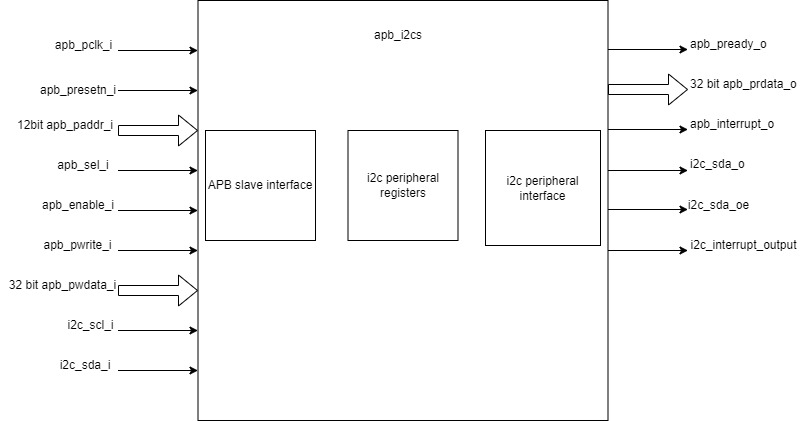
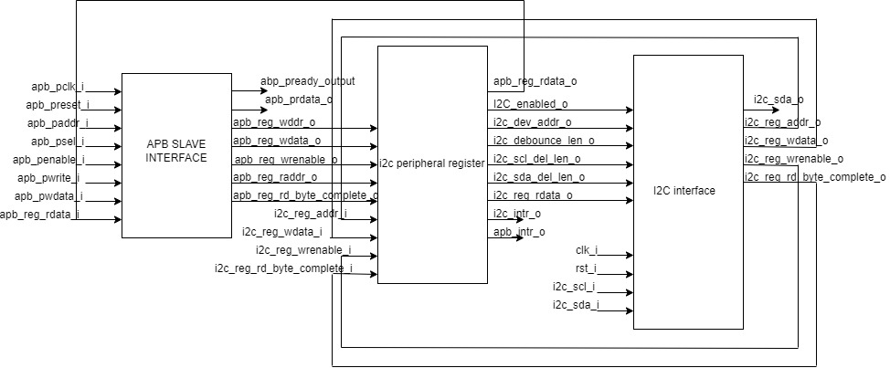

..
   Copyright (c) 2023 OpenHW Group
   Copyright (c) 2024 CircuitSutra

   SPDX-License-Identifier: Apache-2.0 WITH SHL-2.1

.. Level 1
   =======

   Level 2
   -------

   Level 3
   ~~~~~~~

   Level 4
   ^^^^^^^
.. _apb_i2c_slave:

APB I2C SLAVE
=================

The I2C slave enables the Core-V MCU to interact with an I2C master device by responding to transactions on an I2C bus.

Features
--------

- Bidirectional communication between I2C and APB interfaces
- Configurable I2C device address (7-bit)
- Adjustable timing parameters for I2C operation:
    - Debounce length
    - SCL delay length
    - SDA delay length
- Dual communication modes:
    - Single-byte messaging with status tracking
    - FIFO-based data transfer for bulk transfer (up to 256 bytes in each direction)
- Comprehensive interrupt support:
    - Programmable interrupt conditions based on FIFO status flags
    - Separate interrupt paths for I2C and APB interfaces
- FIFO management features:
    - 256-byte FIFO depth for each direction
    - Read and write flags to monitor FIFO status.
    - FIFO flush capability
- I2C enable/disable control

Architecture
------------

I2C slave contains i2c peripheral interface and APB slave interface.
There are FIFOs and registers for handling communication with external
I2C controllers.

The figure below is a high-level block diagram of the I2C Slave:-

   I2C Slave Block Diagram

The figure below depicts the internal connections between the 3 sub-modules of I2C Slave:-

   I2C Slave Sub-Modules Diagram

Below is a brief description of the 3 sub-modules:

APB SLAVE INTERFACE:
^^^^^^^^^^^^^^^^^^^^

Responsible for APB communication: passing information to and from the I2C register module.

I2C PERIPHERAL REGISTER:
^^^^^^^^^^^^^^^^^^^^^^^^

The I2C peripheral register assigns values to CSRs and drives the
interrupt port for APB and I2C. It takes input from the APB slave interface and the I2C interface.

This module instantiates two FIFOs:

  - FIFO_sync_256x8_i2c_to_apb: Transfers data from I2C to APB.

  - FIFO_sync_256x8_apb_to_i2c: Transfers data from APB to I2C.

I2C PERIPHERAL INTERFACE:
^^^^^^^^^^^^^^^^^^^^^^^^^

It handles all I2C protocol operations, including detecting start/stop conditions, address recognition,
data transmission/reception, sending ACK/NACK signals, and managing SDA and SCL timing with line filtering.
It passes information to and from the I2C register module.

I2C STATES:
~~~~~~~~~~~

-  I2C slave has 10 states:

   -  ST_IDLE:

      -  Initially, the slave is in this state.

      -  The slave may also return to this state if a STOP condition is detected.

   -  ST_DEVADDR:

      -  The slave enters this state after detecting the START sequence and when I2C is enabled through the I2C enable register.

      -  The slave receives the device address and transfer type (read/write).

      -  The transfer stops if the received device address does not match the configured address in the I2C device address register.

   -  ST_DEVADDRACK:

      -  The slave enters this state after receiving the I2C device address and sends an acknowledgment.

      -  i2c_sda_o is driven low to indicate a successful acknowledgement.

      -  The acknowledgment is released by driving i2c_sda_o high before a new transfer.

      -  A read operation sets the I2C state to ST_REGRDATA.

      -  A write operation sets the I2C state to ST_REGADDR.

   -  ST_REGADDR:

      -  If the master wants to write, the slave comes to this state.

      -  The slave receives the register address inside the device where the master wants to write.

   -  ST_REGADDRACK:

      -  After successfully receiving the register address, the slave enters this state and sends an acknowledgment.

      -  i2c_sda_o is driven low to indicate a successful acknowledgement.

      -  The acknowledgment is released by driving i2c_sda_o high before a new transfer.

   -  ST_REGWDATA:

      -  After sending an acknowledgment, the slave enters this state and writes data to the register.

   -  ST_REGWDATAACK:

      -  After successfully writing the data, an acknowledgment bit is sent.

      -  i2c_sda_o is driven low to indicate a successful acknowledgment.

      -  The acknowledgment is released by driving i2c_sda_o high before a new transfer.

   -  ST_REGRDATA:

      -  The slave enters this state if the master wants to read data.

      -  The slave device places the data from the last addressed register onto the i2c_sda_o line.

   -  ST_REGRDATAACK:

      -  After a successful read, an acknowledgment is received.

      -  If a negative acknowledgment is received, the transfer stops.

      -  If a successful acknowledgement is received, then I2C state is set to ST_REGRDATA, and more data is read.

   -  ST_WTSTOP:

      -  The slave enters this state if there are no more transactions or if the transfer is to be stopped.

APB I2C Slave CSR's:
--------------------

The CSRs of the I2C slave are 8 bit registers mapped to a 32 bit data bus.

I2CS_DEV_ADDRESS:Offset = 0x000
^^^^^^^^^^^^^^^^^^^^^^^^^^^^^^^

+------------------+------+------+---------+------------------------------+
| Field            | Bits | Type | Default | Description                  |
+==================+======+======+=========+==============================+
| RESERVED         | 7:7  | RW   |         | Reserved                     |
+------------------+------+------+---------+------------------------------+
| SLAVE_ADDR       | 6:0  | RW   | 0X6F    | I2C device address           |
+------------------+------+------+---------+------------------------------+

I2CS_ENABLE:Offset = 0X004
^^^^^^^^^^^^^^^^^^^^^^^^^^

+------------------+------+------+---------+------------------------------+
| Field            | Bits | Type | Default | Description                  |
+==================+======+======+=========+==============================+
| RESERVED         | 7:1  | RW   |         | Reserved                     |
+------------------+------+------+---------+------------------------------+
| IP_ENABLE        | 0:0  | RW   | 0X00    | IP enabling bit              |
+------------------+------+------+---------+------------------------------+

I2CS_DEBOUNCE_LENGTH:Offset = 0x008
^^^^^^^^^^^^^^^^^^^^^^^^^^^^^^^^^^^

+------------------+------+------+---------+-----------------------------+
| Field            | Bits | Type | Default | Description                 |
+==================+======+======+=========+=============================+
| DEB_LEN          | 7:0  | RW   | 0X14    | Represents the number of    |
|                  |      |      |         | system clocks over which    |
|                  |      |      |         | each I2C line (SL and SDA)  |
|                  |      |      |         | should be debounced.        |
+------------------+------+------+---------+-----------------------------+

I2CS_SCL_DELAY_LENGTH:Offset = 0x00C
^^^^^^^^^^^^^^^^^^^^^^^^^^^^^^^^^^^^

+------------------+------+------+---------+-----------------------------+
| Field            | Bits | Type | Default | Description                 |
+==================+======+======+=========+=============================+
| SCL_DLY_LEN      | 7:0  | RW   | 0X14    | Represents the number of    |
|                  |      |      |         | system clocks over which    |
|                  |      |      |         | the SCL line will be delayed|
|                  |      |      |         | relative to SDA line        |
+------------------+------+------+---------+-----------------------------+

I2CS_SDA_DELAY_LENGTH:Offset = 0x010
^^^^^^^^^^^^^^^^^^^^^^^^^^^^^^^^^^^^

+------------------+------+------+--------+-----------------------------+
| Field            | Bits | Type | Default| Description                 |
+==================+======+======+========+=============================+
| SDA_DLY_LEN      | 7:0  | RW   | 0X08   | Represents the number of    |
|                  |      |      |        | system clocks over which    |
|                  |      |      |        | the SDA line will be        |
|                  |      |      |        | delayed relative to the SCL |
|                  |      |      |        | line.                       |
+------------------+------+------+--------+-----------------------------+

I2CS_MSG_I2C_APB:Offset = 0x040
^^^^^^^^^^^^^^^^^^^^^^^^^^^^^^^

+------------------+------+------+---------+-----------------------------+
| Field            | Bits | Type | Default | Description                 |
+==================+======+======+=========+=============================+
| I2C_TO_APB       | 7:0  | RW   | 0X00    | This register provide a     |
|                  |      |      |         | method for passing a single |
|                  |      |      |         | byte message from the I2C   |
|                  |      |      |         | interface to the APB        |
|                  |      |      |         | interface.                  |
+------------------+------+------+---------+-----------------------------+

I2CS_MSG_I2C_APB_STATUS:Offset = 0x044
^^^^^^^^^^^^^^^^^^^^^^^^^^^^^^^^^^^^^^

+------------------+------+------+---------+-----------------------------+
| Field            | Bits | Type | Default | Description                 |
+==================+======+======+=========+=============================+
| RESERVED         | 7:1  | RW   |         |                             |
+------------------+------+------+---------+-----------------------------+
|I2C_TO_APB_STATUS | 0:0  | RW   | 0X00    | This register provide a     |
|                  |      |      |         | method for passing a single |
|                  |      |      |         | byte message from the I2C   |
|                  |      |      |         | interface to the APB        |
|                  |      |      |         | interface.                  |
+------------------+------+------+---------+-----------------------------+

I2CS_MSG_APB_I2C:Offset = 0x048
^^^^^^^^^^^^^^^^^^^^^^^^^^^^^^^

+------------------+------+------+---------+-----------------------------+
| Field            | Bits | Type | Default | Description                 |
+==================+======+======+=========+=============================+
| APB_TO_I2C       | 7:0  | RW   | 0X00    | This register provides a    |
|                  |      |      |         | method for passing a single |
|                  |      |      |         | byte message from the APB   |
|                  |      |      |         | interface to the I2C        |
|                  |      |      |         | interface.                  |
+------------------+------+------+---------+-----------------------------+

I2CS_MSG_APB_I2C_STATUS:Offset = 0x4C
^^^^^^^^^^^^^^^^^^^^^^^^^^^^^^^^^^^^^

+------------------+------+------+---------+-----------------------------+
| Field            | Bits | Type | Default | Description                 |
+==================+======+======+=========+=============================+
| RESERVED         | 7:1  | RW   |         |                             |
+------------------+------+------+---------+-----------------------------+
|APB_TO_I2C_STATUS | 0:0  | RW   | 0X00    | This register provides a    |
|                  |      |      |         | method for passing a single |
|                  |      |      |         | byte message from the APB   |
|                  |      |      |         | interface to the I2C        |
|                  |      |      |         | interface.                  |
+------------------+------+------+---------+-----------------------------+

I2CS_FIFO_I2C_APB_WRITE_DATA_PORT:Offset = 0x080
^^^^^^^^^^^^^^^^^^^^^^^^^^^^^^^^^^^^^^^^^^^^^^^^

+------------------+------+------+---------+-----------------------------+
| Field            | Bits | Type | Default | Description                 |
+==================+======+======+=========+=============================+
| I2C_APB_WRITE_DA | 31:0 | RW   |         | This is the write data port |
| TA_PORT          |      |      |         | for the I2C to APB fifo.    |
+------------------+------+------+---------+-----------------------------+

I2CS_FIFO_I2C_APB_READ_DATA_PORT:Offset = 0x084
^^^^^^^^^^^^^^^^^^^^^^^^^^^^^^^^^^^^^^^^^^^^^^^

+------------------+------+------+---------+-----------------------------+
| Field            | Bits | Type | Default | Description                 |
+==================+======+======+=========+=============================+
| I2C_APB_READ_DA  | 31:0 | RW   |         | This is the read data port  |
| TA_PORT          |      |      |         | for the I2C to APB fifo.    |
+------------------+------+------+---------+-----------------------------+

I2CS_FIFO_I2C_APB_FLUSH:Offset = 0x088
^^^^^^^^^^^^^^^^^^^^^^^^^^^^^^^^^^^^^^

+------------------+------+------+---------+-----------------------------+
| Field            | Bits | Type | Default | Description                 |
+==================+======+======+=========+=============================+
| RESERVED         | 7:1  | RW   |         | RESERVED                    |
+------------------+------+------+---------+-----------------------------+
| ENABLE           | 0:0  | RW   |         | Writing a 1 to this         |
|                  |      |      |         | register bit will flush     |
|                  |      |      |         | the I2CtoAPB FIFO clearing  |
|                  |      |      |         | all the contents and        |
|                  |      |      |         | rendering the FIFO to be    |
|                  |      |      |         | empty.                      |
+------------------+------+------+---------+-----------------------------+

I2CS_FIFO_I2C_APB_WRITE_FLAGS:Offset = 0x08C
^^^^^^^^^^^^^^^^^^^^^^^^^^^^^^^^^^^^^^^^^^^^

+------------------+------+------+---------+-----------------------------+
| Field            | Bits | Type | Default | Description                 |
+==================+======+======+=========+=============================+
| RESERVED         | 7:3  | RW   |         | RESERVED                    |
+------------------+------+------+---------+-----------------------------+
| FLAGS            | 2:0  | RW   |         | Represent the number of     |
|                  |      |      |         | spaces left in FIFO.        |
+------------------+------+------+---------+-----------------------------+

I2CS_FIFO_I2C_APB_READ_FLAGS:Offset = 0x90
^^^^^^^^^^^^^^^^^^^^^^^^^^^^^^^^^^^^^^^^^^

+------------------+------+------+---------+-----------------------------+
| Field            | Bits | Type | Default | Description                 |
+==================+======+======+=========+=============================+
| RESERVED         | 7:3  | RW   |         | RESERVED                    |
+------------------+------+------+---------+-----------------------------+
| FLAGS            | 2:0  | RW   |         | Represent the items         |
|                  |      |      |         | present in FIFO to read.    |
+------------------+------+------+---------+-----------------------------+

I2CS_FIFO_APB_I2C_WRITE_DATA_PORT:Offset = 0X0C0
^^^^^^^^^^^^^^^^^^^^^^^^^^^^^^^^^^^^^^^^^^^^^^^^

+------------------+------+------+---------+-----------------------------+
| Field            | Bits | Type | Default | Description                 |
+==================+======+======+=========+=============================+
| I2C_APB_WRITE_DA | 31:0 | RW   |         | This is the write data      |
| TA_PORT          |      |      |         | port for the APBtoI2C FIFO  |
+------------------+------+------+---------+-----------------------------+

I2CS_FIFO_APB_I2C_READ_DATA_PORT:Offset = 0X0C4
^^^^^^^^^^^^^^^^^^^^^^^^^^^^^^^^^^^^^^^^^^^^^^^

+------------------+------+------+---------+-----------------------------+
| Field            | Bits | Type | Default | Description                 |
+==================+======+======+=========+=============================+
| I2C_APB_READ_DA  | 31:0 | RW   |         | This is the read data       |
| TA_PORT          |      |      |         | port for the APBtoI2C FIFO  |
+------------------+------+------+---------+-----------------------------+

I2CS_FIFO_APB_I2C_FLUSH:Offset = 0X0C8
^^^^^^^^^^^^^^^^^^^^^^^^^^^^^^^^^^^^^^

+------------------+------+------+---------+-----------------------------+
| Field            | Bits | Type | Default | Description                 |
+==================+======+======+=========+=============================+
| RESERVED         | 7:1  | RW   |         | RESERVED                    |
+------------------+------+------+---------+-----------------------------+
| ENABLE           | 0:0  | RW   |         | Writing a 1 to this         |
|                  |      |      |         | register bit will flush     |
|                  |      |      |         | the APBtoI2C FIFO,          |
|                  |      |      |         | clearing all contents and   |
|                  |      |      |         | rendering the FIFO to be    |
|                  |      |      |         | empty.                      |
+------------------+------+------+---------+-----------------------------+

I2CS_FIFO_APB_I2C_WRITE_FLAGS:Offset = 0X0CC
^^^^^^^^^^^^^^^^^^^^^^^^^^^^^^^^^^^^^^^^^^^^

+------------------+------+------+---------+-----------------------------+
| Field            | Bits | Type | Default | Description                 |
+==================+======+======+=========+=============================+
| RESERVED         | 7:3  | R    |         |                             |
+------------------+------+------+---------+-----------------------------+
| FLAGS            | 2:0  | R    |         | Represent number of spaces  |
|                  |      |      |         | left in FIFO                |
+------------------+------+------+---------+-----------------------------+

I2CS_FIFO_APB_I2C_READ_FLAGS:Offset = 0X0D0
^^^^^^^^^^^^^^^^^^^^^^^^^^^^^^^^^^^^^^^^^^^

+------------------+------+------+---------+-----------------------------+
| Field            | Bits | Type | Default | Description                 |
+==================+======+======+=========+=============================+
| RESERVED         | 7:3  | R    |         |                             |
+------------------+------+------+---------+-----------------------------+
| FLAGS            | 2:0  | R    |         | Represent the items         |
|                  |      |      |         | present in FIFO to read.    |
+------------------+------+------+---------+-----------------------------+

I2CS_INTERRUPT_STATUS:Offset = 0x100
^^^^^^^^^^^^^^^^^^^^^^^^^^^^^^^^^^^^

+------------------+------+------+---------+-----------------------------+
| Field            | Bits | Type | Default | Description                 |
+==================+======+======+=========+=============================+
| RESERVED         | 7:3  | R    |         | Reserved                    |
+------------------+------+------+---------+-----------------------------+
| I2C_APB_F        | 2:2  | R    |         | 1: Interrupt is generated   |
| IFO_WRITE_STATUS |      |      |         | for this field              |
|                  |      |      |         | 0: Not genertated           |
+------------------+------+------+---------+-----------------------------+
| APB_I2C_F        | 1:1  | R    |         | 1: Interrupt is generated   |
| IFO_READ_STATUS  |      |      |         | for this field              |
|                  |      |      |         | 0: Not genertated           |
+------------------+------+------+---------+-----------------------------+
| APB_I2C_M        | 0:0  | R    |         | 1: Interrupt is generated   |
| ESSAGE_AVAILABLE |      |      |         | for this field              |
|                  |      |      |         | 0: Not genertated           |
+------------------+------+------+---------+-----------------------------+

I2CS_INTERRUPT_ENABLE:Offset = 0x104
^^^^^^^^^^^^^^^^^^^^^^^^^^^^^^^^^^^^

+------------------+------+------+---------+-----------------------------+
| Field            | Bits | Type | Default | Description                 |
+==================+======+======+=========+=============================+
| RESERVED         | 7:3  | RW   |         | Reserved                    |
+------------------+------+------+---------+-----------------------------+
| I2C_A            | 2:2  | RW   |         | 1: enabled                  |
| PB_FIFO_WRITE_S  |      |      |         |                             |
| TATUS_INT_ENABLE |      |      |         |                             |
+------------------+------+------+---------+-----------------------------+
| APB_I2C_F        | 1:1  | RW   |         | 1: enabled                  |
| IFO_READ_S       |      |      |         |                             |
| TATUS_INT_ENABLE |      |      |         |                             |
+------------------+------+------+---------+-----------------------------+
| APB_I2C_M        | 0:0  | RW   |         | 1: enabled                  |
| ESSAGE_AVAI      |      |      |         |                             |
| LABLE_INT_ENABLE |      |      |         |                             |
+------------------+------+------+---------+-----------------------------+

I2CS_INTERRUPT_I2C_APB_WRITE_FLAGS_SELECT:Offset = 0x108
^^^^^^^^^^^^^^^^^^^^^^^^^^^^^^^^^^^^^^^^^^^^^^^^^^^^^^^^

+------------------+-----+------+-------+----------------------------+
| Field            | Bits| Type |Default| Description                |
+==================+=====+======+=======+============================+
| WRITE_FLAG_FULL  | 7:7 | RW   |       | 1:The write FIFO is full   |
+------------------+-----+------+-------+----------------------------+
| WRITE_FL         | 6:6 | RW   |       | 1: one space left          |
| AG_1_SPACE_AVAIL |     |      |       |                            |
+------------------+-----+------+-------+----------------------------+
| WRITE_FLAG       | 5:5 | RW   |       | 1: 2-3 spaces left         |
| _2_3_SPACE_AVAIL |     |      |       |                            |
+------------------+-----+------+-------+----------------------------+
| WRITE_FLAG       | 4:4 | RW   |       | 1: 4-7 spaces left         |
| _4_7_SPACE_AVAIL |     |      |       |                            |
+------------------+-----+------+-------+----------------------------+
| WRITE_FLAG       | 3:3 | RW   |       | 1: 8-31 spaces left        |
| _8_31_SPACE_AVAIL|     |      |       |                            |
+------------------+-----+------+-------+----------------------------+
| WRITE_FLAG_3     | 2:2 | RW   |       | 1: 32-63 spaces left       |
| 2_63_SPACE_AVAIL |     |      |       |                            |
+------------------+-----+------+-------+----------------------------+
| WRITE_FLAG_64    | 1:1 | RW   |       | 1: 64-127 spaces left      |
| _127_SPACE_AVAIL |     |      |       |                            |
+------------------+-----+------+-------+----------------------------+
| WRITE_FLAG_1     | 0:0 | RW   |       | 1: 128+ spaces left        |
| 28__SPACE_AVAIL  |     |      |       |                            |
+------------------+-----+------+-------+----------------------------+

I2CS_INTERRUPT_APB_I2C_READ_FLAGS_SELECT:Offset = 0x10C
^^^^^^^^^^^^^^^^^^^^^^^^^^^^^^^^^^^^^^^^^^^^^^^^^^^^^^^

+------------------+-----+------+-------+----------------------------+
| Field            | Bits| Type |Default| Description                |
+==================+=====+======+=======+============================+
| READ_FLAG        | 7:7 | RW   |       | 1: 128 items present       |
| _128_SPACE_AVAIL |     |      |       |                            |
+------------------+-----+------+-------+----------------------------+
| READ_FLAG_64     | 6:6 | RW   |       | 1: 64-127 items to read    |
| _127_SPACE_AVAIL |     |      |       |                            |
+------------------+-----+------+-------+----------------------------+
| READ_FLAAG_3     | 5:5 | RW   |       | 1: 32-63 items present     |
| 2_63_SPACE_AVAIL |     |      |       |                            |
+------------------+-----+------+-------+----------------------------+
| READ_FLAG_8      | 4:4 | RW   |       | 1: 8-31 items              |
| _31_SPACE_AVAIL  |     |      |       |                            |
+------------------+-----+------+-------+----------------------------+
| READ_FLAG        | 3:3 | RW   |       | 1: 4-7 items               |
| _4_7_SPACE_AVAIL |     |      |       |                            |
+------------------+-----+------+-------+----------------------------+
| READ_FLAG        | 2:2 | RW   |       | 1: 2-3 items               |
| _2_3_SPACE_AVAIL |     |      |       |                            |
+------------------+-----+------+-------+----------------------------+
| READ_FL          | 1:1 | RW   |       | 1: 1 item                  |
| AG_1_SPACE_AVAIL |     |      |       |                            |
+------------------+-----+------+-------+----------------------------+
| READ_FLAG_EMPTY  | 0:0 | RW   |       | 1: 0 items, empty          |
+------------------+-----+------+-------+----------------------------+

I2CS_INTERRUPT_TO_APB_STATUS:Offset = 0x140
^^^^^^^^^^^^^^^^^^^^^^^^^^^^^^^^^^^^^^^^^^^

+------------------+-----+------+-------+----------------------------+
| Field            | Bits| Type |Default| Description                |
+==================+=====+======+=======+============================+
| RESERVED         | 7:3 | RW   |       | Reserved                   |
+------------------+-----+------+-------+----------------------------+
| APB_I2C_F        | 2:2 | RW   |       | Interrupt status           |
| IFO_WRITE_STATUS |     |      |       | representing whether       |
|                  |     |      |       | interrupt will generate or |
|                  |     |      |       | not.                       |
|                  |     |      |       | 1: Interrupt generated     |
+------------------+-----+------+-------+----------------------------+
| I2C_APB_F        | 1:1 | RW   |       | Interrupt status           |
| IFO_READ_STATUS  |     |      |       | representing whether       |
|                  |     |      |       | interrupt will generate or |
|                  |     |      |       | not.                       |
|                  |     |      |       | 1: Interrupt generated     |
+------------------+-----+------+-------+----------------------------+
| NEW_I            | 0:0 | RW   |       | Interrupt status           |
| 2C_APB_MSG_AVAIL |     |      |       | representing whether       |
|                  |     |      |       | interrupt will generate or |
|                  |     |      |       | not.                       |
|                  |     |      |       | 1: Interrupt generated     |
+------------------+-----+------+-------+----------------------------+

I2CS_INTERRUPT_TO_APB_ENABLE:Offset = 0x0144
^^^^^^^^^^^^^^^^^^^^^^^^^^^^^^^^^^^^^^^^^^^^

+------------------+-----+------+-------+----------------------------+
| Field            | Bits| Type |Default| Description                |
+==================+=====+======+=======+============================+
| RESERVED         | 7:3 | RW   |       | Reserved                   |
+------------------+-----+------+-------+----------------------------+
| APB_I2C_FIFO_WRI | 2:2 | RW   |       | 1: enabled                 |
| TE_STATUS_ENABLE |     |      |       |                            |
+------------------+-----+------+-------+----------------------------+
| I2C_APB_FIFO_RE  | 1:1 | RW   |       | 1: enabled                 |
| AD_STATUS_ENABLE |     |      |       |                            |
+------------------+-----+------+-------+----------------------------+
| NEW_I2C_APB_M    | 0:0 | RW   |       | 1: enabled                 |
| SG_AVAIL_ENABLE  |     |      |       |                            |
+------------------+-----+------+-------+----------------------------+

I2CS_INTERRUPT_APB_I2C_WRITE_FLAGS_SELECT:Offset = 0x148
^^^^^^^^^^^^^^^^^^^^^^^^^^^^^^^^^^^^^^^^^^^^^^^^^^^^^^^^

+------------------+-----+------+-------+----------------------------+
| Field            | Bits| Type |Default| Description                |
+==================+=====+======+=======+============================+
| WRITE_FLAG_FULL  | 7:7 | RW   |       | 1 : The Write FIFO is full |
+------------------+-----+------+-------+----------------------------+
| WRITE_FL         | 6:6 | RW   |       | 1: one space left          |
| AG_1_SPACE_AVAIL |     |      |       |                            |
+------------------+-----+------+-------+----------------------------+
| WRITE_FLAG       | 5:5 | RW   |       | 1: 2-3 spaces left         |
| _2_3_SPACE_AVAIL |     |      |       |                            |
+------------------+-----+------+-------+----------------------------+
| WRITE_FLAG       | 4:4 | RW   |       | 1: 4-7 spaces left         |
| _4_7_SPACE_AVAIL |     |      |       |                            |
+------------------+-----+------+-------+----------------------------+
| WRITE_FLAG_8     | 3:3 | RW   |       | 1: 8-31 spaces left        |
| _31_SPACE_AVAIL  |     |      |       |                            |
+------------------+-----+------+-------+----------------------------+
| WRITE_FLAG_3     | 2:2 | RW   |       | 1: 32-63 spaces left       |
| 2_63_SPACE_AVAIL |     |      |       |                            |
+------------------+-----+------+-------+----------------------------+
| WRITE_FLAG_64    | 1:1 | RW   |       | 1: 64-127 spaces left      |
| _127_SPACE_AVAIL |     |      |       |                            |
+------------------+-----+------+-------+----------------------------+
| WRITE_FLAG       | 0:0 | RW   |       | 1: 128+ spaces left        |
| _128_SPACE_AVAIL |     |      |       |                            |
+------------------+-----+------+-------+----------------------------+

I2CS_INTERRUPT_I2C_APB_READ_FLAGS_SELECT:Offset = 0x14C
^^^^^^^^^^^^^^^^^^^^^^^^^^^^^^^^^^^^^^^^^^^^^^^^^^^^^^^

+------------------+-----+------+-------+----------------------------+
| Field            | Bits| Type |Default| Description                |
+==================+=====+======+=======+============================+
| READ_FLAG        | 7:7 | RW   |       | 1: 128 items present       |
| _128_SPACE_AVAIL |     |      |       |                            |
+------------------+-----+------+-------+----------------------------+
| READ_FLAG_64     | 6:6 | RW   |       | 1: 64 - 127 items present  |
| _127_SPACE_AVAIL |     |      |       |                            |
+------------------+-----+------+-------+----------------------------+
| READ_FLAG_3      | 5:5 | RW   |       | 1: 32-63 items present     |
| 2_63_SPACE_AVAIL |     |      |       |                            |
+------------------+-----+------+-------+----------------------------+
| READ_FLAG_8      | 4:4 | RW   |       | 1: 8-31 items present      |
| _31_SPACE_AVAIL  |     |      |       |                            |
+------------------+-----+------+-------+----------------------------+
| READ_FLAG        | 3:3 | RW   |       | 1: 4-7 items present       |
| _4_7_SPACE_AVAIL |     |      |       |                            |
+------------------+-----+------+-------+----------------------------+
| READ_FLAG        | 2:2 | RW   |       | 1: 2-3 items present       |
| _2_3_SPACE_AVAIL |     |      |       |                            |
+------------------+-----+------+-------+----------------------------+
| READ_FL          | 1:1 | RW   |       | 1: 1 item present          |
| AG_1_SPACE_AVAIL |     |      |       |                            |
+------------------+-----+------+-------+----------------------------+
| READ_FLAG_EMPTY  | 0:0 | RW   |       | 1: 0 items, empty          |
+------------------+-----+------+-------+----------------------------+

Firmware Guidelines
-------------------

Initialization:
^^^^^^^^^^^^^^^
  - Set the I2C device address in the I2C device address register.
  - Configure appropriate debounce and delay values for SCL and SDA lines through I2CS_DEBOUNCE_LENGTH, I2CS_SCL_DELAY_LENGTH and I2CS_SDA_DELAY_LENGTH registers.
  - Enable the I2C interface by writing 1 to the I2C enable register.

Single-Byte Communication:
^^^^^^^^^^^^^^^^^^^^^^^^^^

  - APB to I2C:
      - APB master writes data to I2CS_MSG_APB_I2C register.
      - Status bit in I2CS_MSG_APB_I2C_STATUS register is set by hardware.
      - Output interrupt i2c_interrupt_o is raised if the interrupt is enabled in the I2CS_INTERRUPT_ENABLE register.
      - I2C master reads register I2CS_MSG_APB_I2C to retrieve data.
      - Status bit in I2CS_MSG_APB_I2C_STATUS is cleared by hardware and the interrupt is lowered.

  - I2C to APB:
      - I2C master writes data to I2CS_MSG_I2C_APB register.
      - Status bit in I2CS_MSG_I2C_APB_STATUS register is set by hardware.
      - Output interrupt apb_interrupt_o is raised if the interrupt is enabled in the I2CS_INTERRUPT_TO_APB_STATUS register.
      - APB master reads I2CS_MSG_I2C_APB register to retrieve data.
      - Status bit in I2CS_INTERRUPT_TO_APB_STATUS is cleared by hardware and the interrupt is lowered.

FIFO-Based Communication:
^^^^^^^^^^^^^^^^^^^^^^^^^

  - APB to I2C:
      - APB master writes data to I2CS_FIFO_APB_I2C_WRITE_DATA_PORT register.
      - The data is pushed in the APB to I2C FIFO by the hardware.
      - FIFO status is reflected in I2CS_FIFO_APB_I2C_WRITE_FLAGS register.
      - Interrupt can be generated based on FIFO status.
      - I2C master reads data from I2CS_FIFO_APB_I2C_READ_DATA_PORT register.
      - The data is popped from the APB to I2C FIFO by the hardware.
      - FIFO status is updated in I2CS_FIFO_APB_I2C_READ_FLAGS register.

  - I2C to APB:
      - I2C master writes data to I2CS_FIFO_I2C_APB_WRITE_DATA_PORT register.
      - The data is pushed in the I2C to APB FIFO by the hardware.
      - FIFO status is reflected in I2CS_FIFO_I2C_APB_WRITE_FLAGS register.
      - Interrupt can be generated based on FIFO status.
      - APB master reads data from I2CS_FIFO_I2C_APB_READ_DATA_PORT register.
      - The data is popped from the I2C to APB FIFO by the hardware.
      - FIFO status is updated in I2CS_FIFO_I2C_APB_READ_FLAGS register.

FIFO Management:
^^^^^^^^^^^^^^^^

  - FIFOs can be flushed by writing 1 to I2CS_FIFO_I2C_APB_FLUSH register(I2C to APB FIFO) or I2CS_FIFO_APB_I2C_FLUSH (APB to I2C FIFO).
  - Monitor FIFO read amd write status flags to prevent overflow/underflow conditions.
  - Interrupts can be set to trigger for different conditions based on the read and write flags.
      - The below table describes the different meanings of the READ flags and how bit numbers to set in 
        I2CS_INTERRUPT_I2C_APB_WRITE_FLAGS_SELECT(I2C to APB FIFO) or I2CS_INTERRUPT_APB_I2C_WRITE_FLAGS_SELECT(APB to I2C FIFO) register to generate interrupt.
            +------------+----------------------------------+------------------------+
            | Flag Value | Description                      | Select Bit in Register |
            +============+==================================+========================+
            | 0b000      | Trigger if FIFO Empty            | 0                      |
            +------------+----------------------------------+------------------------+
            | 0b001      | Trigger if 1 item present        | 1                      |
            +------------+----------------------------------+------------------------+
            | 0b010      | Trigger if 2-3 items present     | 2                      |
            +------------+----------------------------------+------------------------+
            | 0b011      | Trigger if 4-7 items present     | 3                      |
            +------------+----------------------------------+------------------------+
            | 0b100      | Trigger if 8-31 items present    | 4                      |
            +------------+----------------------------------+------------------------+
            | 0b101      | Trigger if 32-63 items present   | 5                      |
            +------------+----------------------------------+------------------------+
            | 0b110      | Trigger if 63-127 items present  | 6                      |
            +------------+----------------------------------+------------------------+
            | 0b111      | Trigger if 127+ items present    | 7                      |
            +------------+----------------------------------+------------------------+

      - The below table describes the different meanings of the WRITE flags and how bit numbers to set in 
        I2CS_INTERRUPT_I2C_APB_WRITE_FLAGS_SELECT(I2C to APB FIFO) or I2CS_INTERRUPT_APB_I2C_WRITE_FLAGS_SELECT(APB to I2C FIFO) register to generate interrupt.
            +------------+----------------------------------+------------------------+
            | Flag Value | Description                      | Select Bit in Register |
            +============+==================================+========================+
            | 0b000      | Trigger if 128+ space available  | 0                      |
            +------------+----------------------------------+------------------------+
            | 0b001      | Trigger if 64-127 space available| 1                      |
            +------------+----------------------------------+------------------------+
            | 0b010      | Trigger if 32-63 space available | 2                      |
            +------------+----------------------------------+------------------------+
            | 0b011      | Trigger if 8-31 space available  | 3                      |
            +------------+----------------------------------+------------------------+
            | 0b100      | Trigger if 4-7 space available   | 4                      |
            +------------+----------------------------------+------------------------+
            | 0b101      | Trigger if 2-3 space available   | 5                      |
            +------------+----------------------------------+------------------------+
            | 0b110      | Trigger if 1 space available     | 6                      |
            +------------+----------------------------------+------------------------+
            | 0b111      | Trigger if FIFO Full             | 7                      |
            +------------+----------------------------------+------------------------+

Interrupt Handling
^^^^^^^^^^^^^^^^^^

  - Read the interrupt status register (I2CS_INTERRUPT_STATUS for I2C interrupts, I2CS_INTERRUPT_TO_APB_STATUS for APB interrupts).
  - Determine the interrupt source:
      - Bit 0: New message available
      - Bit 1: FIFO read flags match specified pattern
      - Bit 2: FIFO write flags match specified pattern
  - Service the interrupt by reading/writing appropriate data.
  - Interrupts are automatically cleared when the condition is resolved.

Pin Diagram
-----------

The figure below is a high-level block diagram of the I2C Slave:-

   I2C Slave Pin Diagram

Clock and Reset Signals
^^^^^^^^^^^^^^^^^^^^^^^
  - apb_pclk_i: System clock input
  - apb_presetn_i: Active-low reset input

APB Interface Signals
^^^^^^^^^^^^^^^^^^^^^
  - apb_paddr_i[11:0]: APB address bus input
  - apb_psel_i: APB peripheral select input
  - apb_penable_i: APB enable input
  - apb_pwrite_i: APB write control input (high for write, low for read)
  - apb_pwdata_i[31:0]: APB write data bus input
  - apb_pready_o: APB ready output to indicate transfer completion
  - apb_prdata_o[31:0]: APB read data bus output

I2C Interface Signals
^^^^^^^^^^^^^^^^^^^^^
  - i2c_scl_i: I2C clock input
  - i2c_sda_i: I2C data input
  - i2c_sda_o: I2C data output
  - i2c_sda_oe: I2C data output enable (active high)

Interrupt Signals
^^^^^^^^^^^^^^^^^^^^^
  - i2c_interrupt_o: I2C interrupt request output
  - apb_interrupt_o: APB interrupt request output
