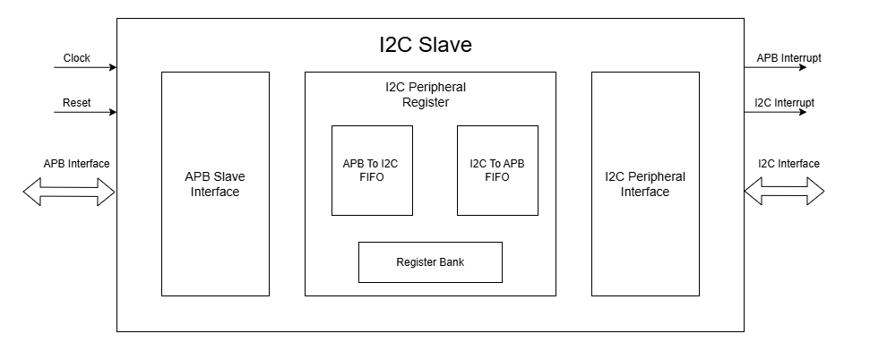
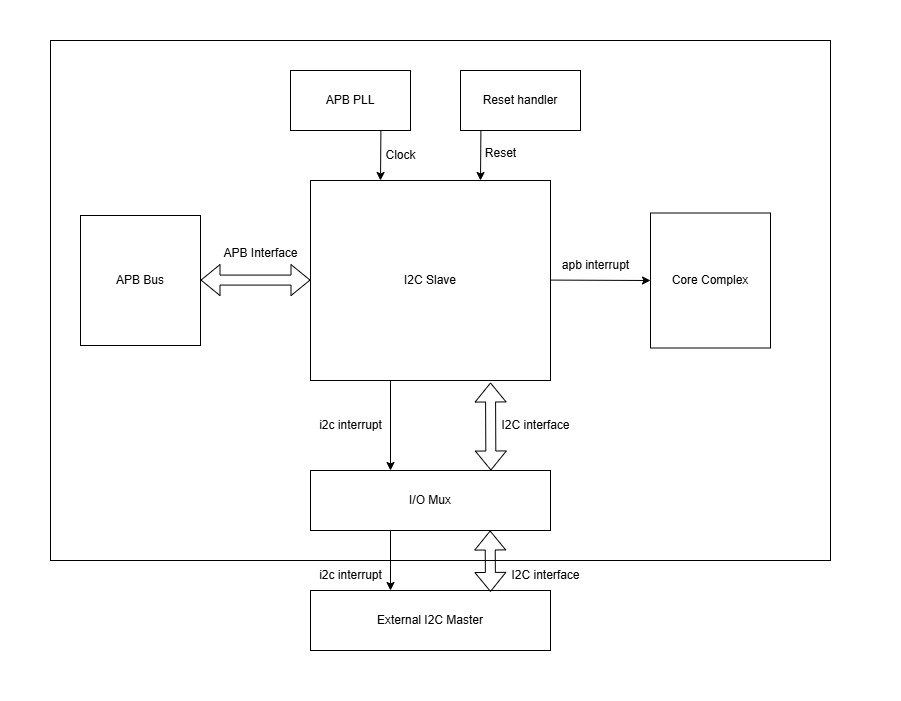
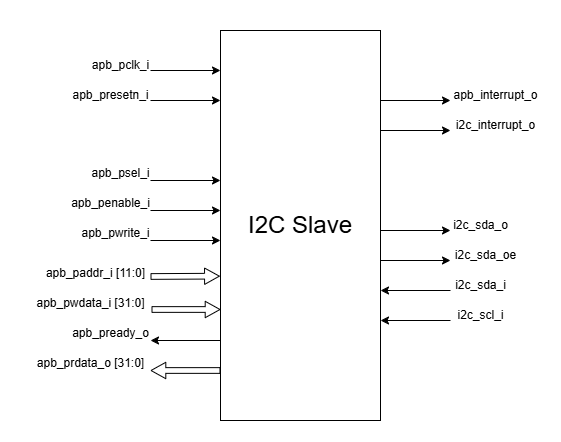

..
   Copyright (c) 2023 OpenHW Group
   Copyright (c) 2024 CircuitSutra

   SPDX-License-Identifier: Apache-2.0 WITH SHL-2.1

.. Level 1
   =======

   Level 2
   -------

   Level 3
   ~~~~~~~

   Level 4
   ^^^^^^^
.. _apb_i2c_slave:

APB I2C SLAVE
=================

The I2C slave enables the Core-V MCU to interact with an external I2C master device by responding to transactions on an I2C bus.

Features
--------

- Bidirectional communication between I2C and APB interfaces
- Configurable I2C device address (7-bit)
- Adjustable timing parameters for I2C operation:
    - Debounce length
    - SCL delay length
    - SDA delay length
- Dual communication modes:
    - Single-byte messaging with status tracking
    - FIFO-based data transfer for bulk transfer (up to 256 bytes in each direction)
- Comprehensive interrupt support:
    - Programmable interrupt conditions based on FIFO status flags
    - Separate interrupt paths for I2C and APB interfaces
- FIFO management features:
    - 256-byte FIFO depth for each direction
    - Read and write flags to monitor FIFO status.
    - FIFO flush capability
- I2C enable/disable control

Architecture
------------

I2C slave contains i2c peripheral interface and APB slave interface.
There are FIFOs and registers for handling communication with external
I2C controllers.

The figure below is a high-level block diagram of the I2C Slave:-

   I2C Slave Block Diagram

The figure below depicts the connections between the I2C Slave and rest of the modules in Core-V-MCU:-

   I2C Slave Core-V-MCU connections diagram

Below is a brief description of the 3 sub-modules:

APB SLAVE INTERFACE:
^^^^^^^^^^^^^^^^^^^^

Responsible for APB communication: passing information to and from the I2C register module.

I2C PERIPHERAL REGISTER:
^^^^^^^^^^^^^^^^^^^^^^^^

The I2C peripheral register assigns values to CSRs and drives the
interrupt port for APB and I2C. It takes input from the APB slave interface and the I2C interface.

This module instantiates two FIFOs:

  - FIFO_sync_256x8_i2c_to_apb: Transfers data from I2C to APB.

  - FIFO_sync_256x8_apb_to_i2c: Transfers data from APB to I2C.

I2C PERIPHERAL INTERFACE:
^^^^^^^^^^^^^^^^^^^^^^^^^

It handles all I2C protocol operations, including detecting start/stop conditions, address recognition,
data transmission/reception, sending ACK/NACK signals, and managing SDA and SCL timing with line filtering.
It passes information to and from the I2C register module.

I2C STATES:
~~~~~~~~~~~

-  I2C slave has 10 states:

   -  ST_IDLE:
      -  Initially, the slave is in this state.
      -  The slave may also return to this state if a STOP condition is detected.

   -  ST_DEVADDR:
      -  The slave enters this state after detecting the START sequence and when I2C is enabled through the I2C enable register.
      -  The slave receives the device address and transfer type (read/write).
      -  The transfer stops if the received device address does not match the configured address in the I2C device address register.

   -  ST_DEVADDRACK:
      -  The slave enters this state after receiving the I2C device address and sends an acknowledgment.
      -  i2c_sda_o is driven low to indicate a successful acknowledgement.
      -  The acknowledgment is released by driving i2c_sda_o high before a new transfer.
      -  A read operation sets the I2C state to ST_REGRDATA.
      -  A write operation sets the I2C state to ST_REGADDR.

   -  ST_REGADDR:
      -  If the master wants to write, the slave comes to this state.
      -  The slave receives the register address inside the device where the master wants to write.

   -  ST_REGADDRACK:
      -  After successfully receiving the register address, the slave enters this state and sends an acknowledgment.
      -  i2c_sda_o is driven low to indicate a successful acknowledgement.
      -  The acknowledgment is released by driving i2c_sda_o high before a new transfer.

   -  ST_REGWDATA:
      -  After sending an acknowledgment, the slave enters this state and writes data to the register.

   -  ST_REGWDATAACK:
      -  After successfully writing the data, an acknowledgment bit is sent.
      -  i2c_sda_o is driven low to indicate a successful acknowledgment.
      -  The acknowledgment is released by driving i2c_sda_o high before a new transfer.

   -  ST_REGRDATA:
      -  The slave enters this state if the master wants to read data.
      -  The slave device places the data from the last addressed register onto the i2c_sda_o line.

   -  ST_REGRDATAACK:
      -  After a successful read, an acknowledgment is received.
      -  If a negative acknowledgment is received, the transfer stops.
      -  If a successful acknowledgement is received, then I2C state is set to ST_REGRDATA, and more data is read.

   -  ST_WTSTOP:
      -  The slave enters this state if there are no more transactions or if the transfer is to be stopped.

Programming View Model
----------------------

FIFO Usage
^^^^^^^^^^
The module employs two First-In, First-Out (FIFO) buffers to handle burst data transfer between the APB and I2C interfaces.

  - I2C-to-APB FIFO: 
      - Buffers data received from the I2C interface before it's read by the APB interface. 
      - The I2C master needs to write data on the FIFO_I2C_TO_APB_WRITE_DATA_PORT register, which is then pushed on this FIFO.
      - The APB master can then read the FIFO_I2C_TO_APB_READ_DATA_PORT register in order to retrieve the data, which is then popped from the FIFO.
      - There are read and write flag registers showing the current status of FIFO and can be accessed by both I2C and APB interfaces.
  - APB-to-I2C FIFO: 
      - Buffers data written by the APB interface before it's transmitted via the I2C interface.
      - The APB master needs to write data on the FIFO_APB_TO_I2C_WRITE_DATA_PORT register, which is then pushed on this FIFO.
      - The I2C master can then read the FIFO_APB_TO_I2C_READ_DATA_PORT register in order to retrieve the data, which is then popped from the FIFO.
      - There are read and write flag registers showing the current status of FIFO and can be accessed by both I2C and APB interfaces.

Data Flow
^^^^^^^^^

Write Operation from I2C Master and Read from APB Master:
  - I2C Master sends START condition(drives SDA line low when SCL is high)
  - I2C Master sends device address with write bit (0)
  - Slave acknowledges
  - I2C Master sends register address
      - MSG_I2C_TO_APB register for single byte
      - FIFO_I2C_TO_APB_WRITE_DATA_PORT register for multi-byte transfer
  - Slave acknowledges
  - I2C Master sends data byte
  - Slave acknowledges
  - I2C Master may send more data bytes with acknowledgment after each, or send STOP condition
  - Flags and interrupt signals are updated accordingly.
  - The APB master can read the data from the appropriate register
      - MSG_I2C_TO_APB for single byte message
      - FIFO_I2C_TO_APB_READ_DATA_PORT register for multi-byte transfer
  - Flags and interrupt signals are updated accordingly.

Write Operation from APB Master and Read from I2C Master:
  - The APB master will write data on the appropriate register
      - MSG_APB_TO_I2C for single byte message
      - FIFO_APB_TO_I2C_WRITE_DATA_PORT register for multi-byte transfer
  - Flags and interrupt signals are updated accordingly.
  - I2C Master sends START condition
  - I2C Master sends device address with write bit (0)
  - Slave acknowledges
  - I2C Master sends register address
      - MSG_APB_TO_I2C for single byte message
      - FIFO_APB_TO_I2C_READ_DATA_PORT register for multi-byte transfer
  - Slave acknowledges
  - I2C Master sends repeated START
  - I2C Master sends device address with read bit (1)
  - Slave acknowledges
  - Slave sends data byte
  - I2C Master sends ACK to request more data or NACK to indicate last byte
  - I2C Master sends STOP condition
  - Flags and interrupt signals are updated accordingly.

Interrupt Generation
^^^^^^^^^^^^^^^^^^^^
The I2C Slave provides interrupt generation for both APB and I2C interfaces.

The i2c_interrupt goes to the external I2C master device, and is generated in the following conditions:
  - The availability of a new single-byte message from the APB to I2C.
  - The write flags of the I2C-to-APB FIFO reaching certain levels (e.g., FIFO becoming full),
    indicating how much space is currently available in FIFO.
  - The read flags of the APB-to-I2C FIFO reaching certain levels (e.g., FIFO becoming empty),
    indicating how much items APB master had written that the I2C master still has to process.
  - Interrupts can be triggered for 8 different levels of both read and write flags, and these interrupt sources can be selectively enabled. 

The apb_interrupt goes to the core complex block of Core-V-MCU, and is generated in the following conditions:
  - The availability of a new single-byte message from the I2C to APB.
  - The write flags of the APB-to-I2C FIFO reaching certain levels (e.g., FIFO becoming full),
    indicating how much space is currently available in FIFO.
  - The read flags of the I2C-to-APB FIFO reaching certain levels (e.g., FIFO becoming empty),
    indicating how much items I2C master had written that the APB master still has to process.
  - Interrupts can be triggered for 8 different levels of both read and write flags, and these interrupt sources can be selectively enabled.

APB I2C Slave CSR's:
--------------------

The CSRs of the I2C slave are 8 bit registers mapped to a 32 bit APB data bus, the same CSRs can be accessed by the I2C interface as well.
Since the APB bus is of 32 bit, the APB addresses are 4x the I2C addresses.

I2CS_DEV_ADDRESS
^^^^^^^^^^^^^^^^

  - APB Offset: 0x0
  - I2C Offset: 0x0

+----------------------+----------+------------------+------------------+------------+------------------------------+
| Field                | Bits     | APB access type  | I2C access type  | Default    | Description                  |
+======================+==========+==================+==================+============+==============================+
| RESERVED             | 7:7      | --               | --               |            | Reserved                     |
+----------------------+----------+------------------+------------------+------------+------------------------------+
| SLAVE_ADDR           | 6:0      | RW               | R                | 0X6F       | I2C device address           |
+----------------------+----------+------------------+------------------+------------+------------------------------+

I2CS_ENABLE
^^^^^^^^^^^

  - APB Offset: 0X4
  - I2C Offset: 0x1

+----------------------+----------+------------------+------------------+------------+------------------------------+
| Field                | Bits     | APB access type  | I2C access type  | Default    | Description                  |
+======================+==========+==================+==================+============+==============================+
| RESERVED             | 7:1      | --               | --               |            | Reserved                     |
+----------------------+----------+------------------+------------------+------------+------------------------------+
| IP_ENABLE            | 0:0      | RW               | R                | 0X00       | IP enabling bit              |
+----------------------+----------+------------------+------------------+------------+------------------------------+

I2CS_DEBOUNCE_LENGTH
^^^^^^^^^^^^^^^^^^^^

  - APB Offset: 0x8
  - I2C Offset: 0x2

+----------------------+----------+------------------+------------------+------------+-----------------------------+
| Field                | Bits     | APB access type  | I2C access type  | Default    | Description                 |
+======================+==========+==================+==================+============+=============================+
| DEB_LEN              | 7:0      | RW               | R                | 0X14       | Represents the number of    |
|                      |          |                  |                  |            | system clocks over which    |
|                      |          |                  |                  |            | each I2C line (SL and SDA)  |
|                      |          |                  |                  |            | should be debounced.        |
+----------------------+----------+------------------+------------------+------------+-----------------------------+

I2CS_SCL_DELAY_LENGTH
^^^^^^^^^^^^^^^^^^^^^

  - APB Offset: 0xC
  - I2C Offset: 0x3

+----------------------+----------+------------------+------------------+------------+-----------------------------+
| Field                | Bits     | APB access type  | I2C access type  | Default    | Description                 |
+======================+==========+==================+==================+============+=============================+
| SCL_DLY_LEN          | 7:0      | RW               | R                | 0X14       | Represents the number of    |
|                      |          |                  |                  |            | system clocks over which    |
|                      |          |                  |                  |            | the SCL line will be delayed|
|                      |          |                  |                  |            | relative to SDA line        |
+----------------------+----------+------------------+------------------+------------+-----------------------------+

I2CS_SDA_DELAY_LENGTH
^^^^^^^^^^^^^^^^^^^^^

  - APB Offset: 0x10
  - I2C Offset: 0x4

+----------------------+----------+------------------+------------------+------------+-----------------------------+
| Field                | Bits     | APB access type  | I2C access type  | Default    | Description                 |
+======================+==========+==================+==================+============+=============================+
| SDA_DLY_LEN          | 7:0      | RW               | R                | 0X08       | Represents the number of    |
|                      |          |                  |                  |            | system clocks over which    |
|                      |          |                  |                  |            | the SDA line will be        |
|                      |          |                  |                  |            | delayed relative to the SCL |
|                      |          |                  |                  |            | line.                       |
+----------------------+----------+------------------+------------------+------------+-----------------------------+

MSG_I2C_TO_APB
^^^^^^^^^^^^^^

  - APB Offset: 0x40
  - I2C Offset: 0x10

+----------------------+----------+------------------+------------------+------------+-----------------------------+
| Field                | Bits     | APB access type  | I2C access type  | Default    | Description                 |
+======================+==========+==================+==================+============+=============================+
| I2C_TO_APB           | 7:0      | R                | RW               | 0X00       | This register provide a     |
|                      |          |                  |                  |            | method for passing a single |
|                      |          |                  |                  |            | byte message from the I2C   |
|                      |          |                  |                  |            | interface to the APB        |
|                      |          |                  |                  |            | interface.                  |
+----------------------+----------+------------------+------------------+------------+-----------------------------+

MSG_I2C_TO_APB_STATUS
^^^^^^^^^^^^^^^^^^^^^

  - APB Offset: 0x44
  - I2C Offset: 0x11

+----------------------+----------+------------------+------------------+------------+-----------------------------+
| Field                | Bits     | APB access type  | I2C access type  | Default    | Description                 |
+======================+==========+==================+==================+============+=============================+
| RESERVED             | 7:1      | --               | --               |            |                             |
+----------------------+----------+------------------+------------------+------------+-----------------------------+
| I2C_TO_APB_STATUS    | 0:0      | R                | R                | 0X00       | This register indicates if  |
|                      |          |                  |                  |            | a single byte message is    |
|                      |          |                  |                  |            | available from I2C to APB.  |
+----------------------+----------+------------------+------------------+------------+-----------------------------+

MSG_APB_TO_I2C
^^^^^^^^^^^^^^

  - APB Offset: 0x48
  - I2C Offset: 0x12

+----------------------+----------+------------------+------------------+------------+-----------------------------+
| Field                | Bits     | APB access type  | I2C access type  | Default    | Description                 |
+======================+==========+==================+==================+============+=============================+
| APB_TO_I2C           | 7:0      | RW               | R                | 0X00       | This register provides a    |
|                      |          |                  |                  |            | method for passing a single |
|                      |          |                  |                  |            | byte message from the APB   |
|                      |          |                  |                  |            | interface to the I2C        |
|                      |          |                  |                  |            | interface.                  |
+----------------------+----------+------------------+------------------+------------+-----------------------------+

MSG_APB_I2C_STATUS
^^^^^^^^^^^^^^^^^^

  - APB Offset: 0x4C
  - I2C Offset: 0x13

+----------------------+----------+------------------+------------------+------------+-----------------------------+
| Field                | Bits     | APB access type  | I2C access type  | Default    | Description                 |
+======================+==========+==================+==================+============+=============================+
| RESERVED             | 7:1      | --               | --               |            |                             |
+----------------------+----------+------------------+------------------+------------+-----------------------------+
| APB_TO_I2C_STATUS    | 0:0      | R                | R                | 0X00       | This register indicates if  |
|                      |          |                  |                  |            | a single byte message is    |
|                      |          |                  |                  |            | available from APB to I2C.  |
+----------------------+----------+------------------+------------------+------------+-----------------------------+

FIFO_I2C_TO_APB_WRITE_DATA_PORT
^^^^^^^^^^^^^^^^^^^^^^^^^^^^^^^

  - APB Offset: 0x80
  - I2C Offset: 0x20

+----------------------+----------+------------------+------------------+------------+-----------------------------+
| Field                | Bits     | APB access type  | I2C access type  | Default    | Description                 |
+======================+==========+==================+==================+============+=============================+
| I2C_APB_WRITE_DA     | 31:0     | --               | W                | 0x0        | This is the write data port |
| TA_PORT              |          |                  |                  |            | for the I2C to APB fifo.    |
+----------------------+----------+------------------+------------------+------------+-----------------------------+

FIFO_I2C_TO_APB_READ_DATA_PORT
^^^^^^^^^^^^^^^^^^^^^^^^^^^^^^

  - APB Offset: 0x084
  - I2C Offset: 0x21

+----------------------+----------+------------------+------------------+------------+-----------------------------+
| Field                | Bits     | APB access type  | I2C access type  | Default    | Description                 |
+======================+==========+==================+==================+============+=============================+
| I2C_APB_READ_DA      | 31:0     | R                | --               | 0x0        | This is the read data port  |
| TA_PORT              |          |                  |                  |            | for the I2C to APB fifo.    |
+----------------------+----------+------------------+------------------+------------+-----------------------------+

FIFO_I2C_TO_APB_FLUSH
^^^^^^^^^^^^^^^^^^^^^

  - APB Offset: 0x088
  - I2C Offset: 0x22

+----------------------+----------+------------------+------------------+------------+-----------------------------+
| Field                | Bits     | APB access type  | I2C access type  | Default    | Description                 |
+======================+==========+==================+==================+============+=============================+
| RESERVED             | 7:1      | --               | --               |            | RESERVED                    |
+----------------------+----------+------------------+------------------+------------+-----------------------------+
| ENABLE               | 0:0      | RW               | RW               | 0x0        | Writing a 1 to this         |
|                      |          |                  |                  |            | register bit will flush     |
|                      |          |                  |                  |            | the I2CtoAPB FIFO clearing  |
|                      |          |                  |                  |            | all the contents and        |
|                      |          |                  |                  |            | rendering the FIFO to be    |
|                      |          |                  |                  |            | empty.                      |
+----------------------+----------+------------------+------------------+------------+-----------------------------+

FIFO_I2C_TO_APB_WRITE_FLAGS
^^^^^^^^^^^^^^^^^^^^^^^^^^^

  - APB Offset: 0x08C
  - I2C Offset: 0x23

+----------------------+----------+------------------+------------------+------------+-----------------------------+
| Field                | Bits     | APB access type  | I2C access type  | Default    | Description                 |
+======================+==========+==================+==================+============+=============================+
| RESERVED             | 7:3      | --               | --               |            | RESERVED                    |
+----------------------+----------+------------------+------------------+------------+-----------------------------+
| FLAGS                | 2:0      | R                | R                |0x0         | Represent the number of     |
|                      |          |                  |                  |            | spaces left in FIFO.        |
+----------------------+----------+------------------+------------------+------------+-----------------------------+

FIFO_I2C_TO_APB_READ_FLAGS
^^^^^^^^^^^^^^^^^^^^^^^^^^

  - APB Offset: 0x90
  - I2C Offset: 0x24

+----------------------+----------+------------------+------------------+------------+-----------------------------+
| Field                | Bits     | APB access type  | I2C access type  | Default    | Description                 |
+======================+==========+==================+==================+============+=============================+
| RESERVED             | 7:3      | --               | --               |            | RESERVED                    |
+----------------------+----------+------------------+------------------+------------+-----------------------------+
| FLAGS                | 2:0      | R                | R                |0x0         | Represent the items         |
|                      |          |                  |                  |            | present in FIFO to read.    |
+----------------------+----------+------------------+------------------+------------+-----------------------------+

FIFO_APB_TO_I2C_WRITE_DATA_PORT
^^^^^^^^^^^^^^^^^^^^^^^^^^^^^^^

  - APB Offset: 0XC0
  - I2C Offset: 0x30

+----------------------+----------+------------------+------------------+------------+-----------------------------+
| Field                | Bits     | APB access type  | I2C access type  | Default    | Description                 |
+======================+==========+==================+==================+============+=============================+
| I2C_APB_WRITE_DA     | 31:0     | W                | --               |0x0         | This is the write data      |
| TA_PORT              |          |                  |                  |            | port for the APBtoI2C FIFO  |
+----------------------+----------+------------------+------------------+------------+-----------------------------+

FIFO_APB_TO_I2C_READ_DATA_PORT
^^^^^^^^^^^^^^^^^^^^^^^^^^^^^^

  - APB Offset: 0XC4
  - I2C Offset: 0x31

+----------------------+----------+------------------+------------------+------------+-----------------------------+
| Field                | Bits     | APB access type  | I2C access type  | Default    | Description                 |
+======================+==========+==================+==================+============+=============================+
| I2C_APB_READ_DA      | 31:0     | --               | R                |0x0         | This is the read data       |
| TA_PORT              |          |                  |                  |            | port for the APBtoI2C FIFO  |
+----------------------+----------+------------------+------------------+------------+-----------------------------+

FIFO_APB_TO_I2C_FLUSH
^^^^^^^^^^^^^^^^^^^^^

  - APB Offset: 0XC8
  - I2C Offset: 0x32

+----------------------+----------+------------------+------------------+------------+-----------------------------+
| Field                | Bits     | APB access type  | I2C access type  | Default    | Description                 |
+======================+==========+==================+==================+============+=============================+
| RESERVED             | 7:1      | --               | --               |            | RESERVED                    |
+----------------------+----------+------------------+------------------+------------+-----------------------------+
| ENABLE               | 0:0      | RW               | RW               |0x0         | Writing a 1 to this         |
|                      |          |                  |                  |            | register bit will flush     |
|                      |          |                  |                  |            | the APBtoI2C FIFO,          |
|                      |          |                  |                  |            | clearing all contents and   |
|                      |          |                  |                  |            | rendering the FIFO to be    |
|                      |          |                  |                  |            | empty.                      |
+----------------------+----------+------------------+------------------+------------+-----------------------------+

FIFO_APB_TO_I2C_WRITE_FLAGS
^^^^^^^^^^^^^^^^^^^^^^^^^^^

  - APB Offset: 0XCC
  - I2C Offset: 0x33

+----------------------+----------+------------------+------------------+------------+-----------------------------+
| Field                | Bits     | APB access type  | I2C access type  | Default    | Description                 |
+======================+==========+==================+==================+============+=============================+
| RESERVED             | 7:3      | --               | --               |            |                             |
+----------------------+----------+------------------+------------------+------------+-----------------------------+
| FLAGS                | 2:0      | R                | R                |0x0         | Represent number of spaces  |
|                      |          |                  |                  |            | left in FIFO                |
+----------------------+----------+------------------+------------------+------------+-----------------------------+

FIFO_APB_TO_I2C_READ_FLAGS
^^^^^^^^^^^^^^^^^^^^^^^^^^

  - APB Offset: 0XD0
  - I2C Offset: 0x34

+----------------------+----------+------------------+------------------+------------+-----------------------------+
| Field                | Bits     | APB access type  | I2C access type  | Default    | Description                 |
+======================+==========+==================+==================+============+=============================+
| RESERVED             | 7:3      | --               | --               |            |                             |
+----------------------+----------+------------------+------------------+------------+-----------------------------+
| FLAGS                | 2:0      | R                | R                |0x0         | Represent the items         |
|                      |          |                  |                  |            | present in FIFO to read.    |
+----------------------+----------+------------------+------------------+------------+-----------------------------+

I2C_INTERRUPT_STATUS
^^^^^^^^^^^^^^^^^^^^^

  - APB Offset: 0x100
  - I2C Offset: 0x40

+----------------------+----------+------------------+------------------+------------+-----------------------------+
| Field                | Bits     | APB access type  | I2C access type  | Default    | Description                 |
+======================+==========+==================+==================+============+=============================+
| RESERVED             | 7:3      | --               | --               |            | Reserved                    |
+----------------------+----------+------------------+------------------+------------+-----------------------------+
| I2C_APB_F            | 2:2      | R                | R                | 0x0        | 1: Interrupt is generated   |
| IFO_WRITE_STATUS     |          |                  |                  |            | for this field              |
|                      |          |                  |                  |            | 0: Not genertated           |
+----------------------+----------+------------------+------------------+------------+-----------------------------+
| APB_I2C_F            | 1:1      | R                | R                | 0x0        | 1: Interrupt is generated   |
| IFO_READ_STATUS      |          |                  |                  |            | for this field              |
|                      |          |                  |                  |            | 0: Not genertated           |
+----------------------+----------+------------------+------------------+------------+-----------------------------+
| APB_I2C_M            | 0:0      | R                | R                | 0x0        | 1: Interrupt is generated   |
| ESSAGE_AVAILABLE     |          |                  |                  |            | for this field              |
|                      |          |                  |                  |            | 0: Not genertated           |
+----------------------+----------+------------------+------------------+------------+-----------------------------+

I2C_INTERRUPT_ENABLE
^^^^^^^^^^^^^^^^^^^^^

  - APB Offset: 0x104
  - I2C Offset: 0x41

+----------------------+----------+------------------+------------------+------------+-----------------------------+
| Field                | Bits     | APB access type  | I2C access type  | Default    | Description                 |
+======================+==========+==================+==================+============+=============================+
| RESERVED             | 7:3      | --               | --               |            | Reserved                    |
+----------------------+----------+------------------+------------------+------------+-----------------------------+
| I2C_A                | 2:2      | R                | RW               | 0x0        | 1: enabled                  |
| PB_FIFO_WRITE_S      |          |                  |                  |            |                             |
| TATUS_INT_ENABLE     |          |                  |                  |            |                             |
+----------------------+----------+------------------+------------------+------------+-----------------------------+
| APB_I2C_F            | 1:1      | R                | RW               | 0x0        | 1: enabled                  |
| IFO_READ_S           |          |                  |                  |            |                             |
| TATUS_INT_ENABLE     |          |                  |                  |            |                             |
+----------------------+----------+------------------+------------------+------------+-----------------------------+
| APB_I2C_M            | 0:0      | R                | RW               | 0x0        | 1: enabled                  |
| ESSAGE_AVAI          |          |                  |                  |            |                             |
| LABLE_INT_ENABLE     |          |                  |                  |            |                             |
+----------------------+----------+------------------+------------------+------------+-----------------------------+

INTERRUPT_FIFO_I2C_TO_APB_WRITE_FLAGS_SELECT
^^^^^^^^^^^^^^^^^^^^^^^^^^^^^^^^^^^^^^^^^^^^

  - APB Offset: 0x108
  - I2C Offset: 0x42

+----------------------+----------+------------------+------------------+------------+----------------------------+
| Field                | Bits     | APB access type  | I2C access type  | Default    | Description                |
+======================+==========+==================+==================+============+============================+
| WRITE_FLAG_FULL      | 7:7      | R                | RW               | 0x0        | 1:The write FIFO is full   |
+----------------------+----------+------------------+------------------+------------+----------------------------+
| WRITE_FL             | 6:6      | R                | RW               | 0x0        | 1: one space left          |
| AG_1_SPACE_AVAIL     |          |                  |                  |            |                            |
+----------------------+----------+------------------+------------------+------------+----------------------------+
| WRITE_FLAG           | 5:5      | R                | RW               | 0x0        | 1: 2-3 spaces left         |
| _2_3_SPACE_AVAIL     |          |                  |                  |            |                            |
+----------------------+----------+------------------+------------------+------------+----------------------------+
| WRITE_FLAG           | 4:4      | R                | RW               | 0x0        | 1: 4-7 spaces left         |
| _4_7_SPACE_AVAIL     |          |                  |                  |            |                            |
+----------------------+----------+------------------+------------------+------------+----------------------------+
| WRITE_FLAG           | 3:3      | R                | RW               | 0x0        | 1: 8-31 spaces left        |
| _8_31_SPACE_AVAIL    |          |                  |                  |            |                            |
+----------------------+----------+------------------+------------------+------------+----------------------------+
| WRITE_FLAG_3         | 2:2      | R                | RW               | 0x0        | 1: 32-63 spaces left       |
| 2_63_SPACE_AVAIL     |          |                  |                  |            |                            |
+----------------------+----------+------------------+------------------+------------+----------------------------+
| WRITE_FLAG_64        | 1:1      | R                | RW               | 0x0        | 1: 64-127 spaces left      |
| _127_SPACE_AVAIL     |          |                  |                  |            |                            |
+----------------------+----------+------------------+------------------+------------+----------------------------+
| WRITE_FLAG_1         | 0:0      | R                | RW               | 0x0        | 1: 128+ spaces left        |
| 28__SPACE_AVAIL      |          |                  |                  |            |                            |
+----------------------+----------+------------------+------------------+------------+----------------------------+

INTERRUPT_FIFO_APB_TO_I2C_READ_FLAGS_SELECT
^^^^^^^^^^^^^^^^^^^^^^^^^^^^^^^^^^^^^^^^^^^

  - APB Offset: 0x10C
  - I2C Offset: 0x43

+----------------------+----------+------------------+------------------+------------+----------------------------+
| Field                | Bits     | APB access type  | I2C access type  | Default    | Description                |
+======================+==========+==================+==================+============+============================+
| READ_FLAG            | 7:7      | R                | RW               | 0x0        | 1: 128 items present       |
| _128_SPACE_AVAIL     |          |                  |                  |            |                            |
+----------------------+----------+------------------+------------------+------------+----------------------------+
| READ_FLAG_64         | 6:6      | R                | RW               | 0x0        | 1: 64-127 items to read    |
| _127_SPACE_AVAIL     |          |                  |                  |            |                            |
+----------------------+----------+------------------+------------------+------------+----------------------------+
| READ_FLAAG_3         | 5:5      | R                | RW               | 0x0        | 1: 32-63 items present     |
| 2_63_SPACE_AVAIL     |          |                  |                  |            |                            |
+----------------------+----------+------------------+------------------+------------+----------------------------+
| READ_FLAG_8          | 4:4      | R                | RW               | 0x0        | 1: 8-31 items              |
| _31_SPACE_AVAIL      |          |                  |                  |            |                            |
+----------------------+----------+------------------+------------------+------------+----------------------------+
| READ_FLAG            | 3:3      | R                | RW               | 0x0        | 1: 4-7 items               |
| _4_7_SPACE_AVAIL     |          |                  |                  |            |                            |
+----------------------+----------+------------------+------------------+------------+----------------------------+
| READ_FLAG            | 2:2      | R                | RW               | 0x0        | 1: 2-3 items               |
| _2_3_SPACE_AVAIL     |          |                  |                  |            |                            |
+----------------------+----------+------------------+------------------+------------+----------------------------+
| READ_FL              | 1:1      | R                | RW               | 0x0        | 1: 1 item                  |
| AG_1_SPACE_AVAIL     |          |                  |                  |            |                            |
+----------------------+----------+------------------+------------------+------------+----------------------------+
| READ_FLAG_EMPTY      | 0:0      | R                | RW               | 0x0        | 1: 0 items, empty          |
+----------------------+----------+------------------+------------------+------------+----------------------------+

APB_INTERRUPT_STATUS
^^^^^^^^^^^^^^^^^^^^

  - APB Offset: 0x140
  - I2C Offset: 0x50

+----------------------+----------+------------------+------------------+------------+----------------------------+
| Field                | Bits     | APB access type  | I2C access type  | Default    | Description                |
+======================+==========+==================+==================+============+============================+
| RESERVED             | 7:3      | --               | --               |            | Reserved                   |
+----------------------+----------+------------------+------------------+------------+----------------------------+
| APB_I2C_F            | 2:2      | R                | R                | 0x0        | Interrupt status           |
| IFO_WRITE_STATUS     |          |                  |                  |            | representing whether       |
|                      |          |                  |                  |            | interrupt will generate or |
|                      |          |                  |                  |            | not.                       |
|                      |          |                  |                  |            | 1: Interrupt generated     |
+----------------------+----------+------------------+------------------+------------+----------------------------+
| I2C_APB_F            | 1:1      | R                | R                | 0x0        | Interrupt status           |
| IFO_READ_STATUS      |          |                  |                  |            | representing whether       |
|                      |          |                  |                  |            | interrupt will generate or |
|                      |          |                  |                  |            | not.                       |
|                      |          |                  |                  |            | 1: Interrupt generated     |
+----------------------+----------+------------------+------------------+------------+----------------------------+
| NEW_I                | 0:0      | R                | R                | 0x0        | Interrupt status           |
| 2C_APB_MSG_AVAIL     |          |                  |                  |            | representing whether       |
|                      |          |                  |                  |            | interrupt will generate or |
|                      |          |                  |                  |            | not.                       |
|                      |          |                  |                  |            | 1: Interrupt generated     |
+----------------------+----------+------------------+------------------+------------+----------------------------+

APB_INTERRUPT_ENABLE
^^^^^^^^^^^^^^^^^^^^

  - APB Offset: 0x0144
  - I2C Offset: 0x51

+----------------------+----------+------------------+------------------+------------+----------------------------+
| Field                | Bits     | APB access type  | I2C access type  | Default    | Description                |
+======================+==========+==================+==================+============+============================+
| RESERVED             | 7:3      | --               | --               |            | Reserved                   |
+----------------------+----------+------------------+------------------+------------+----------------------------+
| APB_I2C_FIFO_WRI     | 2:2      | RW               | R                | 0x0        | 1: enabled                 |
| TE_STATUS_ENABLE     |          |                  |                  |            |                            |
+----------------------+----------+------------------+------------------+------------+----------------------------+
| I2C_APB_FIFO_RE      | 1:1      | RW               | R                | 0x0        | 1: enabled                 |
| AD_STATUS_ENABLE     |          |                  |                  |            |                            |
+----------------------+----------+------------------+------------------+------------+----------------------------+
| NEW_I2C_APB_M        | 0:0      | RW               | R                | 0x0        | 1: enabled                 |
| SG_AVAIL_ENABLE      |          |                  |                  |            |                            |
+----------------------+----------+------------------+------------------+------------+----------------------------+

INTERRUPT_FIFO_APB_TO_I2C_WRITE_FLAGS_SELECT
^^^^^^^^^^^^^^^^^^^^^^^^^^^^^^^^^^^^^^^^^^^^

  - APB Offset: 0x148
  - I2C Offset: 0x52

+----------------------+----------+------------------+------------------+------------+----------------------------+
| Field                | Bits     | APB access type  | I2C access type  | Default    | Description                |
+======================+==========+==================+==================+============+============================+
| WRITE_FLAG_FULL      | 7:7      | RW               | R                | 0x0        | 1 : The Write FIFO is full |
+----------------------+----------+------------------+------------------+------------+----------------------------+
| WRITE_FL             | 6:6      | RW               | R                | 0x0        | 1: one space left          |
| AG_1_SPACE_AVAIL     |          |                  |                  |            |                            |
+----------------------+----------+------------------+------------------+------------+----------------------------+
| WRITE_FLAG           | 5:5      | RW               | R                | 0x0        | 1: 2-3 spaces left         |
| _2_3_SPACE_AVAIL     |          |                  |                  |            |                            |
+----------------------+----------+------------------+------------------+------------+----------------------------+
| WRITE_FLAG           | 4:4      | RW               | R                | 0x0        | 1: 4-7 spaces left         |
| _4_7_SPACE_AVAIL     |          |                  |                  |            |                            |
+----------------------+----------+------------------+------------------+------------+----------------------------+
| WRITE_FLAG_8         | 3:3      | RW               | R                | 0x0        | 1: 8-31 spaces left        |
| _31_SPACE_AVAIL      |          |                  |                  |            |                            |
+----------------------+----------+------------------+------------------+------------+----------------------------+
| WRITE_FLAG_3         | 2:2      | RW               | R                | 0x0        | 1: 32-63 spaces left       |
| 2_63_SPACE_AVAIL     |          |                  |                  |            |                            |
+----------------------+----------+------------------+------------------+------------+----------------------------+
| WRITE_FLAG_64        | 1:1      | RW               | R                | 0x0        | 1: 64-127 spaces left      |
| _127_SPACE_AVAIL     |          |                  |                  |            |                            |
+----------------------+----------+------------------+------------------+------------+----------------------------+
| WRITE_FLAG           | 0:0      | RW               | R                | 0x0        | 1: 128+ spaces left        |
| _128_SPACE_AVAIL     |          |                  |                  |            |                            |
+----------------------+----------+------------------+------------------+------------+----------------------------+

INTERRUPT_FIFO_I2C_TO_APB_READ_FLAGS_SELECT
^^^^^^^^^^^^^^^^^^^^^^^^^^^^^^^^^^^^^^^^^^^

  - APB Offset: 0x14C
  - I2C Offset: 0x53

+----------------------+----------+------------------+------------------+------------+----------------------------+
| Field                | Bits     | APB access type  | I2C access type  | Default    | Description                |
+======================+==========+==================+==================+============+============================+
| READ_FLAG            | 7:7      | RW               | R                | 0x0        | 1: 128 items present       |
| _128_SPACE_AVAIL     |          |                  |                  |            |                            |
+----------------------+----------+------------------+------------------+------------+----------------------------+
| READ_FLAG_64         | 6:6      | RW               | R                | 0x0        | 1: 64 - 127 items present  |
| _127_SPACE_AVAIL     |          |                  |                  |            |                            |
+----------------------+----------+------------------+------------------+------------+----------------------------+
| READ_FLAG_3          | 5:5      | RW               | R                | 0x0        | 1: 32-63 items present     |
| 2_63_SPACE_AVAIL     |          |                  |                  |            |                            |
+----------------------+----------+------------------+------------------+------------+----------------------------+
| READ_FLAG_8          | 4:4      | RW               | R                | 0x0        | 1: 8-31 items present      |
| _31_SPACE_AVAIL      |          |                  |                  |            |                            |
+----------------------+----------+------------------+------------------+------------+----------------------------+
| READ_FLAG            | 3:3      | RW               | R                | 0x0        | 1: 4-7 items present       |
| _4_7_SPACE_AVAIL     |          |                  |                  |            |                            |
+----------------------+----------+------------------+------------------+------------+----------------------------+
| READ_FLAG            | 2:2      | RW               | R                | 0x0        | 1: 2-3 items present       |
| _2_3_SPACE_AVAIL     |          |                  |                  |            |                            |
+----------------------+----------+------------------+------------------+------------+----------------------------+
| READ_FL              | 1:1      | RW               | R                | 0x0        | 1: 1 item present          |
| AG_1_SPACE_AVAIL     |          |                  |                  |            |                            |
+----------------------+----------+------------------+------------------+------------+----------------------------+
| READ_FLAG_EMPTY      | 0:0      | RW               | R                | 0x0        | 1: 0 items, empty          |
+----------------------+----------+------------------+------------------+------------+----------------------------+

Firmware Guidelines
-------------------

Initialization:
^^^^^^^^^^^^^^^
  - Set the I2C device address in the I2C device address register.
  - Configure appropriate debounce and delay values for SCL and SDA lines through I2CS_DEBOUNCE_LENGTH, I2CS_SCL_DELAY_LENGTH and I2CS_SDA_DELAY_LENGTH registers.
  - Enable the I2C interface by writing 1 to the I2C enable register.

Single-Byte Communication:
^^^^^^^^^^^^^^^^^^^^^^^^^^

  - APB to I2C:
      - APB master writes data to MSG_APB_TO_I2C register.
      - Status bit in MSG_APB_TO_I2C_STATUS register is set by hardware.
      - Output interrupt i2c_interrupt_o is raised if the interrupt is enabled in the I2C_INTERRUPT_ENABLE register and associated bit in I2C_INTERRUPT_STATUS is set.
      - I2C master reads register MSG_APB_TO_I2C to retrieve data.
      - Status bit in MSG_APB_TO_I2C_STATUS and I2C_INTERRUPT_STATUS is cleared by hardware and the interrupt is lowered.

  - I2C to APB:
      - I2C master writes data to MSG_I2C_TO_APB register.
      - Status bit in MSG_I2C_TO_APB_STATUS register is set by hardware.
      - Output interrupt apb_interrupt_o is raised if the interrupt is enabled in the APB_INTERRUPT_ENABLE register and associated bit in APB_INTERRUPT_STATUS is set.
      - APB master reads MSG_I2C_TO_APB register to retrieve data.
      - Status bit in MSG_I2C_TO_APB_STATUS and APB_INTERRUPT_STATUS is cleared by hardware and the interrupt is lowered.

FIFO-Based Communication:
^^^^^^^^^^^^^^^^^^^^^^^^^

  - APB to I2C:
      - APB master writes data to FIFO_APB_TO_I2C_WRITE_DATA_PORT register.
      - The data is pushed in the APB to I2C FIFO by the hardware.
      - FIFO status is reflected in FIFO_APB_TO_I2C_WRITE_FLAGS register.
      - Interrupt can be generated based on FIFO status.
      - I2C master reads data from FIFO_APB_TO_I2C_READ_DATA_PORT register.
      - The data is popped from the APB to I2C FIFO by the hardware.
      - FIFO status is updated in FIFO_APB_TO_I2C_READ_FLAGS register.

  - I2C to APB:
      - I2C master writes data to FIFO_I2C_TO_APB_WRITE_DATA_PORT register.
      - The data is pushed in the I2C to APB FIFO by the hardware.
      - FIFO status is reflected in FIFO_I2C_TO_APB_WRITE_FLAGS register.
      - Interrupt can be generated based on FIFO status.
      - APB master reads data from FIFO_I2C_TO_APB_READ_DATA_PORT register.
      - The data is popped from the I2C to APB FIFO by the hardware.
      - FIFO status is updated in FIFO_I2C_TO_APB_READ_FLAGS register.

FIFO Management:
^^^^^^^^^^^^^^^^

  - FIFOs can be flushed by writing 1 to FIFO_I2C_TO_APB_FLUSH register(I2C to APB FIFO) or FIFO_APB_TO_I2C_FLUSH (APB to I2C FIFO).
  - Monitor FIFO read amd write status flags to prevent overflow/underflow conditions.
  - Interrupts can be set to trigger for different conditions based on the read and write flags.
      - The below table describes the different meanings of the READ flags and how bit numbers to set in 
        INTERRUPT_FIFO_I2C_TO_APB_READ_FLAGS_SELECT(I2C to APB FIFO) or INTERRUPT_FIFO_APB_TO_I2C_READ_FLAGS_SELECT(APB to I2C FIFO) register to generate interrupt.

        +------------+----------------------------------+------------------------+
        | Flag Value | Description                      | Select Bit in Register |
        +============+==================================+========================+
        | 0b000      | Trigger if FIFO Empty            | 0                      |
        +------------+----------------------------------+------------------------+
        | 0b001      | Trigger if 1 item present        | 1                      |
        +------------+----------------------------------+------------------------+
        | 0b010      | Trigger if 2-3 items present     | 2                      |
        +------------+----------------------------------+------------------------+
        | 0b011      | Trigger if 4-7 items present     | 3                      |
        +------------+----------------------------------+------------------------+
        | 0b100      | Trigger if 8-31 items present    | 4                      |
        +------------+----------------------------------+------------------------+
        | 0b101      | Trigger if 32-63 items present   | 5                      |
        +------------+----------------------------------+------------------------+
        | 0b110      | Trigger if 63-127 items present  | 6                      |
        +------------+----------------------------------+------------------------+
        | 0b111      | Trigger if 127+ items present    | 7                      |
        +------------+----------------------------------+------------------------+

      - The below table describes the different meanings of the WRITE flags and how bit numbers to set in 
        INTERRUPT_FIFO_I2C_TO_APB_WRITE_FLAGS_SELECT(I2C to APB FIFO) or INTERRUPT_FIFO_APB_TO_I2C_WRITE_FLAGS_SELECT(APB to I2C FIFO) register to generate interrupt.

        +------------+----------------------------------+------------------------+
        | Flag Value | Description                      | Select Bit in Register |
        +============+==================================+========================+
        | 0b000      | Trigger if 128+ space available  | 0                      |
        +------------+----------------------------------+------------------------+
        | 0b001      | Trigger if 64-127 space available| 1                      |
        +------------+----------------------------------+------------------------+
        | 0b010      | Trigger if 32-63 space available | 2                      |
        +------------+----------------------------------+------------------------+
        | 0b011      | Trigger if 8-31 space available  | 3                      |
        +------------+----------------------------------+------------------------+
        | 0b100      | Trigger if 4-7 space available   | 4                      |
        +------------+----------------------------------+------------------------+
        | 0b101      | Trigger if 2-3 space available   | 5                      |
        +------------+----------------------------------+------------------------+
        | 0b110      | Trigger if 1 space available     | 6                      |
        +------------+----------------------------------+------------------------+
        | 0b111      | Trigger if FIFO Full             | 7                      |
        +------------+----------------------------------+------------------------+

Interrupt Handling
^^^^^^^^^^^^^^^^^^

  - Read the interrupt status register (I2C_INTERRUPT_STATUS for I2C interrupts, APB_INTERRUPT_STATUS for APB interrupts).
  - Determine the interrupt source:
      - Bit 0: New message available
      - Bit 1: FIFO read flags match specified pattern
      - Bit 2: FIFO write flags match specified pattern
  - Service the interrupt by reading/writing appropriate data.
  - Interrupts are automatically cleared when the condition is resolved.

Pin Diagram
-----------

The figure below represents the input and output pins for the I2C Slave:-

   I2C Slave Pin Diagram

Clock and Reset Signals
^^^^^^^^^^^^^^^^^^^^^^^
  - apb_pclk_i: System clock input
  - apb_presetn_i: Active-low reset input

APB Interface Signals
^^^^^^^^^^^^^^^^^^^^^
  - apb_paddr_i[11:0]: APB address bus input
  - apb_psel_i: APB peripheral select input
  - apb_penable_i: APB enable input
  - apb_pwrite_i: APB write control input (high for write, low for read)
  - apb_pwdata_i[31:0]: APB write data bus input
  - apb_pready_o: APB ready output to indicate transfer completion
  - apb_prdata_o[31:0]: APB read data bus output

I2C Interface Signals
^^^^^^^^^^^^^^^^^^^^^
  - i2c_scl_i: I2C clock input
  - i2c_sda_i: I2C data input
  - i2c_sda_o: I2C data output
  - i2c_sda_oe: I2C data output enable (active high)

Interrupt Signals
^^^^^^^^^^^^^^^^^^^^^
  - i2c_interrupt_o: I2C interrupt request output, connects to external I2C master
  - apb_interrupt_o: APB interrupt request output, connects to Core Complex 
