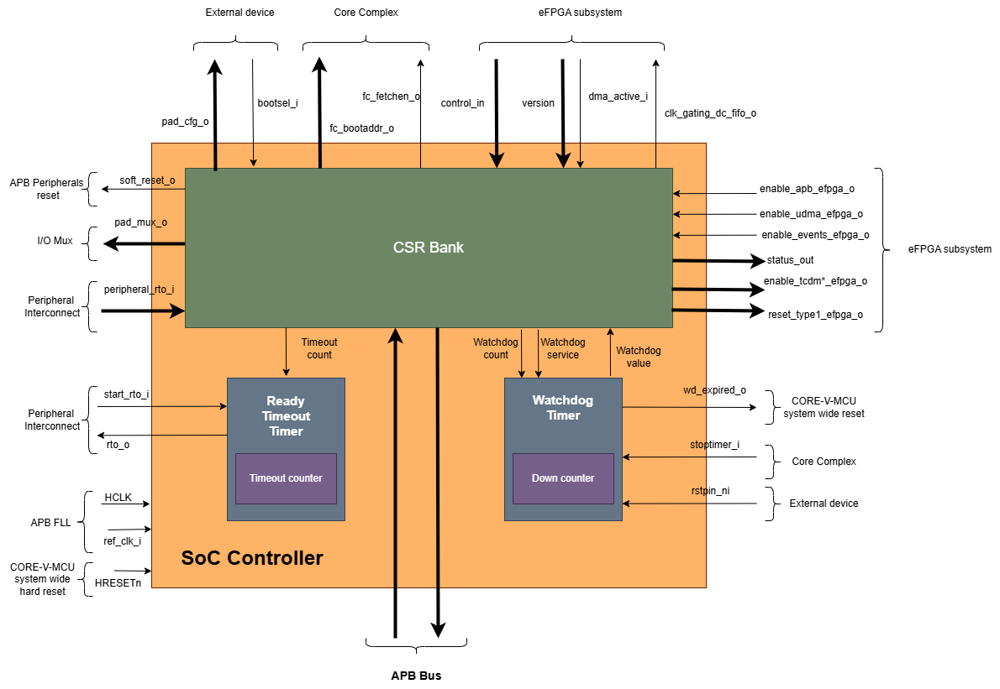
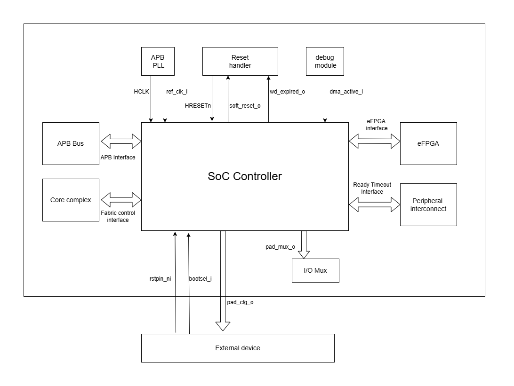
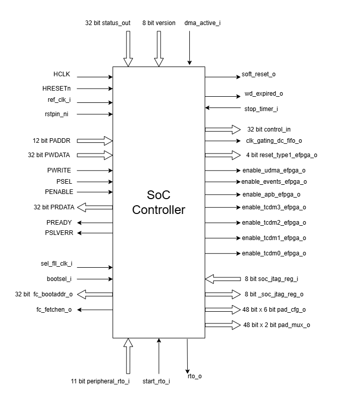

..
   Copyright (c) 2023 OpenHW Group
   Copyright (c) 2024 CircuitSutra

   SPDX-License-Identifier: Apache-2.0 WITH SHL-2.1

.. Level 1
   =======

   Level 2
   -------

   Level 3
   ~~~~~~~

   Level 4
   ^^^^^^^
.. _apb_soc_controller:

APB SoC controller
==================

This APB peripheral primarily controls I/O configuration and serves as the central configuration hub in the CORE-V-MCU for pad multiplexing, boot control, watchdog monitoring, and eFPGA interfacing.

Features
--------
  - Control interface for configurable pad multiplexer and IO configuration
  - Watchdog timer with programmable timeout and reset capability
  - JTAG CSR access for debug and configuration
  - Boot address and fetch enable control for the Fabric Controller (FC)
  - eFPGA control and configuration interface
  - Ready timeout monitoring for system level recovery
  - System information and status CSRs
  - Soft reset capability for all APB Client Peripherals
  - Build date and time information

Block Architecture
------------------

The figure below is a high-level block diagram of the APB SoC Controller module:-

   APB SoC Controller Block Diagram

The APB SoC Controller IP consists of the following key components:

Pad Configuration
^^^^^^^^^^^^^^^^^
The controller manages pad multiplexing and configuration for all system IOs. It provides the multiplexing information to the Pad control module, which directly manages the IO pads.
 Each pad can be individually configured for:
  - Pad multiplexing (selecting function)
  - Pad electrical configuration (drive strength, pull-up/down, etc.)

Watchdog Timer
^^^^^^^^^^^^^^
A programmable watchdog timer runs on the reference clock and can generate system reset signals when expired. Features include:
  - Configurable timeout period
  - Enable/disable control
  - Reset capability with specific pattern
  - Status monitoring

eFPGA Interface
^^^^^^^^^^^^^^^
Dedicated control and status CSRs for managing the embedded FPGA subsystem:
  - Reset controls
  - Clock gating
  - Interface enables (UDMA, events, APB, TCDM interfaces)
  - Status monitoring

Ready Timeout Mechanism
^^^^^^^^^^^^^^^^^^^^^^^
A monitoring mechanism that can detect system hangs:
  - Programmable timeout counter
  - Peripheral-specific timeout monitoring
  - Status reporting

Boot Control
^^^^^^^^^^^^
Manages the boot process for the system:
  - Boot address configuration
  - Fetch enable control
  - Boot mode selection

JTAG Interface
^^^^^^^^^^^^^^
  - Allows bidirectional communication of 8-bit data with external JTAG devices
  - Accessible through dedicated CSR and interface

System Architecture
-------------------

The figure below depicts the connections between the SoC Controller and rest of the modules in CORE-V-MCU:-

   APB SoC Controller CORE-V-MCU connections diagram

Programming View Model
----------------------

The APB SOC Controller is memory-mapped at a base address defined by the system. All CSRs are accessible via standard APB read/write operations.

CSR Access
^^^^^^^^^^^^^^^
CSRs are accessed using 32-bit reads and writes over the APB bus. The address space is organized as follows:
  - Base CSRs: 0x000 - 0x0FC
  - Pad configuration CSRs: 0x400 - 0x4C0

Programming Sequence
^^^^^^^^^^^^^^^^^^^^
Typical programming sequences include:
  - Read system information from INFO CSR
  - Configure boot address and fetch enable
  - Set up pad configuration and multiplexing
  - Configure watchdog timer if needed
  - Set up eFPGA control parameters
  - Monitor status CSRs as needed

APB SoC CTRL CSRs
-----------------

INFO
^^^^
  - Address Offset = 0x0000

+----------------+-----------+----------+-------------+----------------------------------+
| **Field**      | **Bits**  | **Type** | **Default** | **Description**                  |
+================+===========+==========+=============+==================================+
|   N_CORES      |   31:16   |   RO     |     0x1     | Number of cores in design        |
+----------------+-----------+----------+-------------+----------------------------------+
|   N_CLUSTERS   |   15:0    |   RO     |     0x0     | Number of clusters in design     |
+----------------+-----------+----------+-------------+----------------------------------+

FCBOOT
^^^^^^
  - Address Offset = 0x0004

+----------------+-----------+----------+-------------+----------------------------------+
| **Field**      | **Bits**  | **Type** | **Default** | **Description**                  |
+================+===========+==========+=============+==================================+
|   BOOT_ADDR    |   31:0    |  RW      | 0x1A000080  | Boot address for the FC core     |
+----------------+-----------+----------+-------------+----------------------------------+

FCFETCH
^^^^^^^
  - Address Offset = 0x0008

+----------------+-----------+----------+-------------+----------------------------------+
| **Field**      | **Bits**  | **Type** | **Default** | **Description**                  |
+================+===========+==========+=============+==================================+
|   ENABLE       |   0:0     |  RO      |     0x1     | Fetch enable bit                 |
|                |           |          |             | (1: enabled, 0: disabled)        |
+----------------+-----------+----------+-------------+----------------------------------+

BUILD_DATE
^^^^^^^^^^
  - Address Offset = 0x000C

+-------------+----------+----------+-------------+--------------------+
| **Field**   | **Bits** | **Type** | **Default** | **Description**    |
+=============+==========+==========+=============+====================+
|   YEAR      |  31:16   |   RO     |     0x0     |   Year in BCD      |
+-------------+----------+----------+-------------+--------------------+
|   MONTH     |   15:8   |   RO     |     0x0     |   Month in BCD     |
+-------------+----------+----------+-------------+--------------------+
|   DAY       |   7:0    |   RO     |     0x0     |   Day in BCD       |
+-------------+----------+----------+-------------+--------------------+

BUILD_TIME
^^^^^^^^^^
  - Address Offset = 0x0010

+---------------+----------+----------+-------------+---------------------+
| **Field**     | **Bits** | **Type** | **Default** | **Description**     |
+===============+==========+==========+=============+=====================+
|   HOUR        |   23:16  |   RO     |     0x0     |   Hour in BCD       |
+---------------+----------+----------+-------------+---------------------+
|   MINUTES     |   15:8   |   RO     |     0x0     |   Minutes in BCD    |
+---------------+----------+----------+-------------+---------------------+
|   SECONDS     |   7:0    |   RO     |     0x0     |   Seconds in BCD    |
+---------------+----------+----------+-------------+---------------------+

WCFGFUN
^^^^^^^
  - Address Offset = 0x0060
  - Sets multiplexer and configuration for specified IO pad

+-------------+----------+----------+-------------+------------------------------+
| Field       | Bits     | Type     | Default     | Description                  |
+=============+==========+==========+=============+==============================+
| RESERVED    | 31:30    | RW       |    0x0      | Reserved                     |
+-------------+----------+----------+-------------+------------------------------+
| PADCFG      | 29:24    | RW       |    0x0      | Pad configuration (TBD)      |
+-------------+----------+----------+-------------+------------------------------+
| RESERVED    | 23:18    | RW       |    0x0      | Reserved                     |
+-------------+----------+----------+-------------+------------------------------+
| PADMUX      | 17:16    | RW       |    0x0      | Pad mux configuration        |
+-------------+----------+----------+-------------+------------------------------+
| RESERVED    | 15:6     | RW       |    0x0      | Reserved                     |
+-------------+----------+----------+-------------+------------------------------+
| IO_PAD      | 5:0      | RW       |    0x0      | IO pad index                 |
+-------------+----------+----------+-------------+------------------------------+

RCFGFUN
^^^^^^^
  - Address Offset = 0x0064
  - Reads multiplexer and configuration for specified IO pad

+-------------+----------+----------+-------------+------------------------------+
| Field       | Bits     | Type     | Default     | Description                  |
+=============+==========+==========+=============+==============================+
| RESERVED    | 31:30    | RW       |    0x0      | Reserved                     |
+-------------+----------+----------+-------------+------------------------------+
| PADCFG      | 29:24    | RW       |    0x0      | Pad configuration (TBD)      |
+-------------+----------+----------+-------------+------------------------------+
| RESERVED    | 23:18    | RW       |    0x0      | Reserved                     |
+-------------+----------+----------+-------------+------------------------------+
| PADMUX      | 17:16    | RW       |    0x0      | Pad mux configuration        |
+-------------+----------+----------+-------------+------------------------------+
| RESERVED    | 15:6     | RW       |    0x0      | Reserved                     |
+-------------+----------+----------+-------------+------------------------------+
| IO_PAD      | 5:0      | RW       |    0x0      | IO pad index                 |
+-------------+----------+----------+-------------+------------------------------+

JTAGREG
^^^^^^^
  - Address Offset = 0x0074

+---------------+----------+----------+-------------+--------------------------+
| **Field**     | **Bits** | **Type** | **Default** | **Description**          |
+===============+==========+==========+=============+==========================+
| RESERVED      | 31:16    | RO       |    0x0      | Reserved                 |
+---------------+----------+----------+-------------+--------------------------+
| JTAG_REG_IN   | 15:8     | RO       |    0x0      | synchronized data input  |
|               |          |          |             | from soc_jtag_reg_i port |
+---------------+----------+----------+-------------+--------------------------+
| JTAG_REG_OUT  | 7:0      | RW       |    0x0      | data to be driven on     |
|               |          |          |             | soc_jtag_reg_o port      |
+---------------+----------+----------+-------------+--------------------------+

BOOTSEL
^^^^^^^
  - Address Offset = 0x00C4

+-------------+----------+-----------+-------------+-----------------------------------------+
| **Field**   | **Bits** | **Types** | **Default** | **Description**                         |
+=============+==========+===========+=============+=========================================+
| BOOTSEL     |   0:0    | RO        |             | Selected Boot device                    |
|             |          |           |             |  1=SPI                                  |
|             |          |           |             |  0=Host mode via I2Cs                   |
|             |          |           |             |                                         | 
|             |          |           |             | Configured from bootsel_i pin on reset  |
+-------------+----------+-----------+-------------+-----------------------------------------+
| DMACTIVE    | 1:1      | RO        |             | DMA active value                        |
|             |          |           |             | Configured from dmactive_i pin on reset |
+-------------+----------+-----------+-------------+-----------------------------------------+
| RESERVED    | 29:2     | RO        | 0x0         | Reserved                                |
+-------------+----------+-----------+-------------+-----------------------------------------+
| BOOTSEL_IN  | 30       | RO        |             | Current status of bootsel_i pin         |
+-------------+----------+-----------+-------------+-----------------------------------------+
| DMACTIVE_IN | 31       | RO        |             | Current status of dmactive_i pin        |
+-------------+----------+-----------+-------------+-----------------------------------------+

CLKSEL
^^^^^^
  - Address Offset = 0x00C8

+-----------+----------+----------+-------------+--------------------------------+
| **Field** | **Bits** | **Type** | **Default** | **Description**                |
+===========+==========+==========+=============+================================+
|   S       |   0:0    |   RW     |             |   This CSR contains            |  
|           |          |          |             |   whether the system clock     |
|           |          |          |             |   is coming from               |
|           |          |          |             |   the FLL or the FLL is        |
|           |          |          |             |   bypassed.                    |
|           |          |          |             |   It is a read-only            |
|           |          |          |             |   CSR by the core but it       |
|           |          |          |             |   can be written via JTAG.     |
|           |          |          |             |                                |
|           |          |          |             | Shows current status of        |
|           |          |          |             | sel_fll_clk_i pin              |
+-----------+----------+----------+-------------+--------------------------------+

WD_COUNT
^^^^^^^^
  - Address Offset = 0x00D0

+-----------+----------+-----------+-------------+-------------------------------------+
| **Field** | **Bits** | **Types** | **Default** | **Description**                     |
+===========+==========+===========+=============+=====================================+
|   COUNT   |   30:0   |   RW      |   0x8000    |   Only writable before Watchdog is  |
|           |          |           |             |   enabled                           |
+-----------+----------+-----------+-------------+-------------------------------------+

WD_CONTROL
^^^^^^^^^^
  - Address Offset = 0x00D4

+-----------------+----------+----------+-----------+----------------------------------------+
| **Field**       | **Bits** | **Type** |**Default**| **Description**                        |
+=================+==========+==========+===========+========================================+
|  ENABLE_STATUS  |   31:31  |   RW     |   0x0     |   1=Watchdog Enabled,                  |
|                 |          |          |           |   0=Watchdog not enabled.              |
|                 |          |          |           |   Note: once enabled, cannot be        |
|                 |          |          |           |   disabled                             |
+-----------------+----------+----------+-----------+----------------------------------------+
|  WD_VALUE       |   15:0   |   RW     |           |  Set to 0x6699 to reset watchdog when  |
|                 |          |          |           |  enabled, read current WD value        |
+-----------------+----------+----------+-----------+----------------------------------------+

RESET_REASON
^^^^^^^^^^^^
  - Address Offset = 0x00D8
  - The CSR will get cleared when the APB bus is in waiting state, i.e. after a read or write is performed.

+-----------+----------+-----------+-------------+-------------------------------------+
| **Field** | **Bits** | **Types** | **Default** | **Description**                     |
+===========+==========+===========+=============+=====================================+
|   REASON  |   1:0    |   RW      |     0x0     |   2'b01= reset pin, 2'b11=Watchdog  |
|           |          |           |             |   expired                           |
+-----------+----------+-----------+-------------+-------------------------------------+

RTO_PERIPHERAL_ERROR
^^^^^^^^^^^^^^^^^^^^
  - Address Offset = 0x00E0
  - Configured from peripheral_rto_i pin
  - Writing to this CSR will clear it

+-------------+----------+-----------+-------------+----------------------------------------+
| **Field**   | **Bits** | **Types** | **Default** | **Description**                        |
+=============+==========+===========+=============+========================================+
|   FCB_RTO   |   8:8    | RW        | 0x0         | 1 indicates that the FCB interface     |
|             |          |           |             | caused a ready timeout                 |
+-------------+----------+-----------+-------------+----------------------------------------+
| TIMER_RTO   |   7:7    | RW        | 0x0         | 1 indicates that the TIMER interface   |
|             |          |           |             | caused a ready timeout                 |
+-------------+----------+-----------+-------------+----------------------------------------+
| I2CS_RTO    |   6:6    | RW        | 0x0         | 1 indicates that the I2CS interface    |
|             |          |           |             | caused a ready timeout                 |
+-------------+----------+-----------+-------------+----------------------------------------+
|EVENT_GEN_RTO|   5:5    | RW        | 0x0         | 1 indicates that the EVENT GENERATOR   |
|             |          |           |             | interface caused a ready timeout       |
+-------------+----------+-----------+-------------+----------------------------------------+
|ADV_TIMER_RTO|   4:4    | RW        | 0x0         | 1 indicates that the ADVANCED TIMER    |
|             |          |           |             | interface caused a ready timeout       |
+-------------+----------+-----------+-------------+----------------------------------------+
|SOC_CONTROL_R|   3:3    | RW        | 0x0         | 1 indicates that the SOC CONTROL       |
|TO           |          |           |             | interface caused a ready timeout       |
+-------------+----------+-----------+-------------+----------------------------------------+
|UDMA_RTO     |   2:2    | RW        | 0x0         | 1 indicates that the UDMA CONTROL      |
|             |          |           |             | interface caused a ready timeout       |
+-------------+----------+-----------+-------------+----------------------------------------+
|GPIO_RTO     |   1:1    | RW        | 0x0         | 1 indicates that the GPIO interface    |
|             |          |           |             | caused a ready timeout                 |
+-------------+----------+-----------+-------------+----------------------------------------+
|FLL_RTO      |   0:0    | RW        | 0x0         | 1 indicates that the FLL interface     |
|             |          |           |             | caused a ready timeout                 |
+-------------+----------+-----------+-------------+----------------------------------------+

READY_TIMEOUT_COUNT
^^^^^^^^^^^^^^^^^^^
  - Address Offset = 0x00E4

+-------------+----------+-----------+-------------+----------------------------------------+
| **Field**   | **Bits** | **Types** | **Default** | **Description**                        |
+=============+==========+===========+=============+========================================+
| COUNT       |  19:0    | RW        | 0xFF        | Number of APB clocks before a ready    |
|             |          |           |             | timeout occurs.                        |
|             |          |           |             | When writing to this CSR, last 4       |
|             |          |           |             | bits from write data will be replaced  |
|             |          |           |             | by 0xf.                                |
+-------------+----------+-----------+-------------+----------------------------------------+

RESET_TYPE1_EFPGA
^^^^^^^^^^^^^^^^^
  - Address Offset = 0x00E8

+-------------+----------+-----------+-------------+-----------------------------------+
| **Field**   | **Bits** | **Types** | **Default** | **Description**                   |
+=============+==========+===========+=============+===================================+
| RESET_LB    |   3:3    | RW        | 0x0         | Reset eFPGA Left Bottom Quadrant  |
+-------------+----------+-----------+-------------+-----------------------------------+
| RESET_RB    |   2:2    | RW        | 0x0         | Reset eFPGA Right Bottom Quadrant |
+-------------+----------+-----------+-------------+-----------------------------------+
| RESET_RT    |   1:1    | RW        | 0x0         | Reset eFPGA Right Top Quadrant    |
+-------------+----------+-----------+-------------+-----------------------------------+
| RESET_LT    |   0:0    | RW        | 0x0         | Reset eFPGA Left Top Quadrant     |
+-------------+----------+-----------+-------------+-----------------------------------+

ENABLE_IN_OUT_EFPGA
^^^^^^^^^^^^^^^^^^^
  - Address Offset = 0x00EC

+--------------+----------+-----------+-------------+----------------------------------------+
| **Field**    | **Bits** | **Types** | **Default** | **Description**                        |
+==============+==========+===========+=============+========================================+
|ENABLE_EVENTS |   5:5    | RW        | 0x0         | Enable events from efpga to SOC caused |
|              |          |           |             | a ready timeout                        |
+--------------+----------+-----------+-------------+----------------------------------------+
|ENABLE_SOC_ACC|   4:4    | RW        | 0x0         | Enable SOC memory mapped access to     |
|ESS           |          |           |             | EFPGA                                  |
+--------------+----------+-----------+-------------+----------------------------------------+
|ENABLE_TCDM_P3|   3:3    | RW        | 0x0         | Enable EFPGA access via TCDM port 3    |
+--------------+----------+-----------+-------------+----------------------------------------+
|ENABLE_TCDM_P2|   2:2    | RW        | 0x0         | Enable EFPGA access via TCDM port 2    |
+--------------+----------+-----------+-------------+----------------------------------------+
|ENABLE_TCDM_P1|   1:1    | RW        | 0x0         | Enable EFPGA access via TCDM port 1    |
+--------------+----------+-----------+-------------+----------------------------------------+
|ENABLE_TCDM_P0|   0:0    | RW        | 0x0         | Enable EFPGA access via TCDM port 0    |
+--------------+----------+-----------+-------------+----------------------------------------+

EFPGA_CONTROL_IN
^^^^^^^^^^^^^^^^
  - Address Offset = 0x00F0

+-----------------+----------+------------+-------------+----------------------------------+
| **Field**       | **Bits** | **Access** | **Default** | **Description**                  |
+=================+==========+============+=============+==================================+
|EFPGA_CONTROL_IN |   31:0   | RW         | 0x0         | EFPGA control bits use per eFPGA |
|                 |          |            |             | design                           |
+-----------------+----------+------------+-------------+----------------------------------+

EFPGA_STATUS_OUT
^^^^^^^^^^^^^^^^
  - Address Offset = 0x00F4

+-----------------+----------+------------+-------------+----------------------------------+
| **Field**       | **Bits** | **Access** | **Default** | **Description**                  |
+=================+==========+============+=============+==================================+
|EFPGA_CONTROL_OUT|   31:0   | RO         |             | Status from eFPGA                |
|                 |          |            |             | Configured from status_out pin   |
+-----------------+----------+------------+-------------+----------------------------------+

EFPGA_VERSION
^^^^^^^^^^^^^
  - Address Offset = 0x00F8

+-----------------+----------+------------+-------------+----------------------------------+
| **Field**       | **Bits** | **Access** | **Default** | **Description**                  |
+=================+==========+============+=============+==================================+
|EFPGA_VERSION    |    7:0   | RO         |             | EFPGA version info               |
|                 |          |            |             | Configured from version pin      |
+-----------------+----------+------------+-------------+----------------------------------+

SOFT_RESET
^^^^^^^^^^
  - Address Offset = 0x00FC

+-----------------+----------+------------+-------------+----------------------------------+
| **Field**       | **Bits** | **Access** | **Default** | **Description**                  |
+=================+==========+============+=============+==================================+
| SOFT_RESET      |    0:0   | WO         |             | Write only strobe to reset all   |
|                 |          |            |             | APB clients                      |
+-----------------+----------+------------+-------------+----------------------------------+

IO_CTRL
^^^^^^^
  - Address Offset = 0x0400**
  - I/O control supports two functions:
      -  I/O configuration
      -  I/O function selection

I/O configuration (CFG) is a series of bits that may be used to
control I/O PAD characteristics, such as drive strength and slew rate.
These driver control characteristics are implementation technology
dependent and are TBD. I/O selection (MUX) controls the select field of
a mux that connects the I/O to different signals in the device.

Each port is individually addressable at offset + IO_PORT * 4. For
example, the IO_CTRL CSR for IO_PORT 8 is at offset 0x0420.

+-------------+----------+-----------+-------------+-------------------------+
| **Field**   | **Bits** | **Types** | **Default** | **Description**         |
+=============+==========+===========+=============+=========================+
| CFG         |   13:8   | RW        | 0x00        | Pad configuration (TBD) |
+-------------+----------+-----------+-------------+-------------------------+
| MUX         |   1:0    | RW        | 0x00        | Mux select              |
+-------------+----------+-----------+-------------+-------------------------+

Firmware Guidelines
--------------------

Initialization Sequence
^^^^^^^^^^^^^^^^^^^^^^^
  - Read System Information
      - Read the INFO CSR at offset 0x00 from the SOC_CTRL_BASE address.
      - Extract the number of cores from bits [31:16] of the read value.
      - Extract the number of clusters from bits [15:0] of the read value.
      - Use this information to properly configure system resources.
  - Configure Boot Parameters
      - Write the desired boot address to the FCBOOT CSR at offset 0x04.
      - The fetch enable bit of to the FCFETCH CSR at offset 0x08 if enabled by default.
      - Verify the boot configuration by reading back these CSRs.
  - Configure IO Pads
      - For each IO pad that needs configuration:
          - Determine the IO pad index (0 to 47).
          - Select the appropriate multiplexer value for the desired function.
          - Determine the electrical pad configuration ( TBD ).
          - Combine these values: IO index in bits [5:0], multiplexer in bits [17:16], and configuration in bits [29:24].
          - Write this combined value to the WCFGFUN CSR at offset 0x60.
      - Alternatively, configure pads directly through their dedicated addresses:
          - Calculate the pad CSR address: 0x400 + (IO_PORT * 4).
          - Write the multiplexer value to bits [1:0] and configuration to bits [13:8].
  - Configure Watchdog Timer (if needed)
      - While the watchdog is disabled, set the desired timeout by writing to the WD_COUNT CSR at offset 0xD0.
      - Enable the watchdog by writing 0x80000000 to the WD_CONTROL CSR at offset 0xD4.
      - Set up a regular timer interrupt to periodically reset the watchdog.
  - Ready Timeout Configuration
      - Set the desired timeout value by writing to the RTO_COUNT CSR at offset 0xE4.(only bits [19:4] are used, with the 4 LSBs always set to 0xF)
  - Configure eFPGA (if applicable)
      - Reset particular eFPGA Quadrant by writing to the RESET_TYPE1_EFPGA CSR at offset 0xE8.
      - Enable the desired interfaces by writing to ENABLE_IN_OUT_EFPGA CSR at offset 0xEC:
          - Bit 0: Enable TCDM0 interface
          - Bit 1: Enable TCDM1 interface
          - Bit 2: Enable TCDM2 interface
          - Bit 3: Enable TCDM3 interface
          - Bit 4: Enable APB interface
          - Bit 5: Enable events interface
      - Set additional control parameters(as per eFPGA design) by writing to the EFPGA_CONTROL CSR at offset 0xF0.

Ready Timeout Management
^^^^^^^^^^^^^^^^^^^^^^^^
  - Initialization:
      - Set the desired timeout value by writing to the RTO_COUNT CSR at offset 0xE4.(only bits [19:4] are used, with the 4 LSBs always set to 0xF)
      - The default value after reset is 0x000FF
  - Normal Operation:
      - The timeout counter starts decrementing when start_rto_i is asserted.
      - If start_rto_i is deasserted then the timer counter is set to it's initial value as configured in RTO_COUNT CSR.
  - Timeout Detection:
      - If the counter reaches zero, the rto_o signal is asserted.
      - Based on the input peripheral_rto_i,The CSR RTO_PERIPHERAL_ERROR is updated.
  - Error Handling:
      - When a timeout is detected, identify the source peripheral through RTO_PERIPHERAL_ERROR CSR.
      - Take appropriate recovery actions for the affected peripheral
      - Write any value to the RTO_PERIPHERAL CSR to clear the timeout flags
      - This resets the peripheral timeout indicators but doesn't affect the timeout counter

Watchdog Management
^^^^^^^^^^^^^^^^^^^
  - Watchdog Initialization
      - Determine the appropriate timeout value based on your system requirements.
      - Write this value to the WD_COUNT CSR before enabling the watchdog.
      - The timeout should be long enough to accommodate normal processing delays but short enough to catch system hangs.
  - Watchdog Enabling
      - Enable the watchdog by writing 0x80000000 to the WD_CONTROL CSR.
  - Normal Operation
      - Once enabled, the watchdog timer will begin counting down from the configured value on every positive edge of ref_clk_i, given that stoptimer_i pin is low.
      - If stoptimer_i is asserted, then the watchdog timer will pause until it is deasserted.
      - When the counter reaches 1, wd_expired_o pin will be set high for one cycle of ref_clk_i.
      - RESET_REASON CSR will be updadated with value 2b'11.
  - Regular Servicing
      - Establish a reliable mechanism to service the watchdog at regular intervals.
      - This can be a dedicated timer interrupt or part of a main processing loop.
      - The servicing interval should be shorter than the watchdog timeout.
      - To service the watchdog, write 0x00006699 to the WD_CONTROL CSR.
  - Watchdog Recovery Handling
      - After a watchdog reset, firmware can detect this by reading the RESET_REASON CSR.
      - If the value is 0x2, a watchdog timeout caused the reset.
      - Implement appropriate recovery actions, such as logging the event.
  - Hard reset behaviour
      - When rstpin_ni is asserted, then the watchdog timer is set to it's default value of 0x8000.
      - After this, the watchdog timer will only start counting down from the configured value in WD_COUNT CSR upon servicing.

Soft Reset Procedure
^^^^^^^^^^^^^^^^^^^^
  - Prepare for Reset
      - Complete any pending operations and save critical state if needed.
  - Trigger Reset
      - Write any value to the SOFT_RESET CSR at offset 0xFC.
      - The system will immediately begin the reset sequence.
      - The below CSR will be reset to their default values
          - WCFGFUN
          - RCFGFUN
          - IO_CTRL (0x400-0x4C0)
          - RESET_TYPE1_EFPGA
          - ENABLE_IN_OUT_EFPGA
          - EFPGA_CONTROL_IN
          - RTO_PERIPHERAL_ERROR
          - READY_TIMEOUT_COUNT
      - The reset signal will propagate to other APB Client peripherals.
  - Post-Reset
      - The system will restart and execute the boot sequence.
      - Firmware should check the RESET_REASON CSR to differentiate between power-on and soft reset.

JTAG communication
^^^^^^^^^^^^^^^^^^
  - Write to external device
      - Write the data to the JTAGREG CSR through the APB bus.
      - The written value will be available on the soc_jtag_reg_o output port.
  - Read from external device
      - The external JTAG device writes the data on soc_jtag_reg_i input port.
      - There is double synchronization for the input signal to prevent metastability.
      - Post synchronization, the data can be read from the JTAGREG CSR through the APB bus.

Pin Diagram
-----------

The figure below represents the input and output pins for the APB SoC Controller:-

   APB SoC Controller Pin Diagram

Clock and Reset
^^^^^^^^^^^^^^^
  - HCLK: APB system clock input
  - HRESETn: Active-low system reset signal for initializing CSRs and logic
  - ref_clk_i: Reference clock input, used for watchdog operations
  - rstpin_ni: Active-low reset pin input, for resetting watchdog

APB Interface
^^^^^^^^^^^^^
  - PADDR[11:0]: APB address bus input
  - PWDATA[31:0]: APB write data bus input
  - PWRITE: APB write enable signal
  - PSEL: APB slave select input
  - PENABLE: APB enable signal
  - PRDATA[31:0]: APB read data bus output
  - PREADY: APB ready signal output, indicates completion of APB transaction
  - PSLVERR: APB slave error output

Boot and Configuration
^^^^^^^^^^^^^^^^^^^^^^
  - sel_fll_clk_i: FLL clock selection input
  - bootsel_i: Boot select input
  - fc_bootaddr_o[31:0]: Boot address output for FC (Fabric Controller), controlled via CSR FCBOOT
  - fc_fetchen_o: Fetch enable output for FC, controlled via CSR FCFETCH
  

Watchdog Interface
^^^^^^^^^^^^^^^^^^
  - wd_expired_o: Watchdog expired output signal, triggered when watchdog counter reaches 1
  - stoptimer_i: Timer stop input signal, triggered by core complex

Pad Configuration Interface
^^^^^^^^^^^^^^^^^^^^^^^^^^^
  - pad_cfg_o[47:0][5:0]: Pad configuration output signals
  - pad_mux_o[47:0][1:0]: Pad multiplexing output signals

JTAG Interface
^^^^^^^^^^^^^^
  - soc_jtag_reg_i[7:0]: JTAG CSR input
  - soc_jtag_reg_o[7:0]: JTAG CSR output, driven by CSR JTAGREG

eFPGA Interface
^^^^^^^^^^^^^^^
  - control_in[31:0]: Control output to peripherals, driven by CSR EFPGA_CONTROL
  - clk_gating_dc_fifo_o: Clock gating for DC FIFO to eFPGA, always 1 as per current implementation
  - reset_type1_efpga_o[3:0]: Reset signals for eFPGA, driven by CSR RESET_TYPE1_EFPGA
  - enable_udma_efpga_o: Enable uDMA to eFPGA, driven by ENABLE_IN_OUT_EFPGA CSR
  - enable_events_efpga_o: Enable events to eFPGA, driven by ENABLE_IN_OUT_EFPGA CSR
  - enable_apb_efpga_o: Enable APB to eFPGA, driven by ENABLE_IN_OUT_EFPGA CSR
  - enable_tcdm3_efpga_o: Enable TCDM3 to eFPGA, driven by ENABLE_IN_OUT_EFPGA CSR
  - enable_tcdm2_efpga_o: Enable TCDM2 to eFPGA, driven by ENABLE_IN_OUT_EFPGA CSR
  - enable_tcdm1_efpga_o: Enable TCDM1 to eFPGA, driven by ENABLE_IN_OUT_EFPGA CSR
  - enable_tcdm0_efpga_o: Enable TCDM0 to eFPGA, driven by ENABLE_IN_OUT_EFPGA CSR

  - status_out[31:0]: Status input signals from peripherals
  - version[7:0]: Version input
  - dmactive_i: Debug mode active input

Ready Timeout Interface
^^^^^^^^^^^^^^^^^^^^^^^
  - rto_o: Ready timeout output signal, asserted when ready timeout count reaches 0.
  - start_rto_i: Start ready timeout input
  - peripheral_rto_i[10:0]: Peripheral ready timeout input
  - soft_reset_o: Soft reset output, triggered by writing to CSR SOFT_RESET