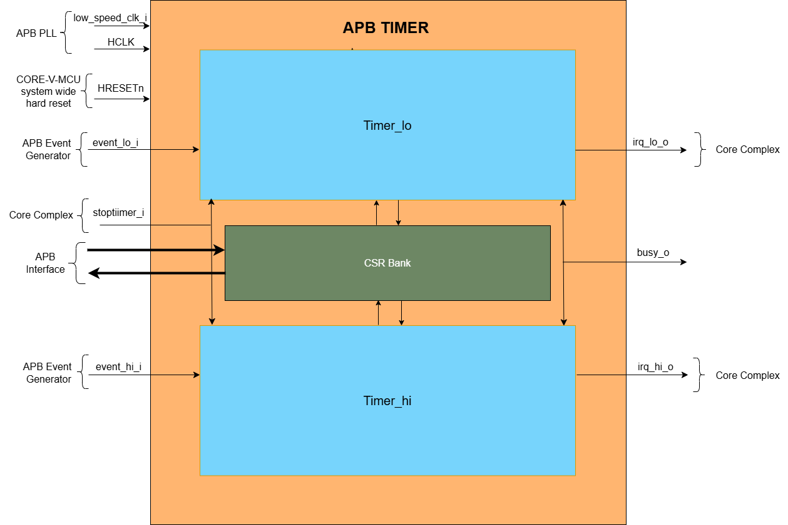
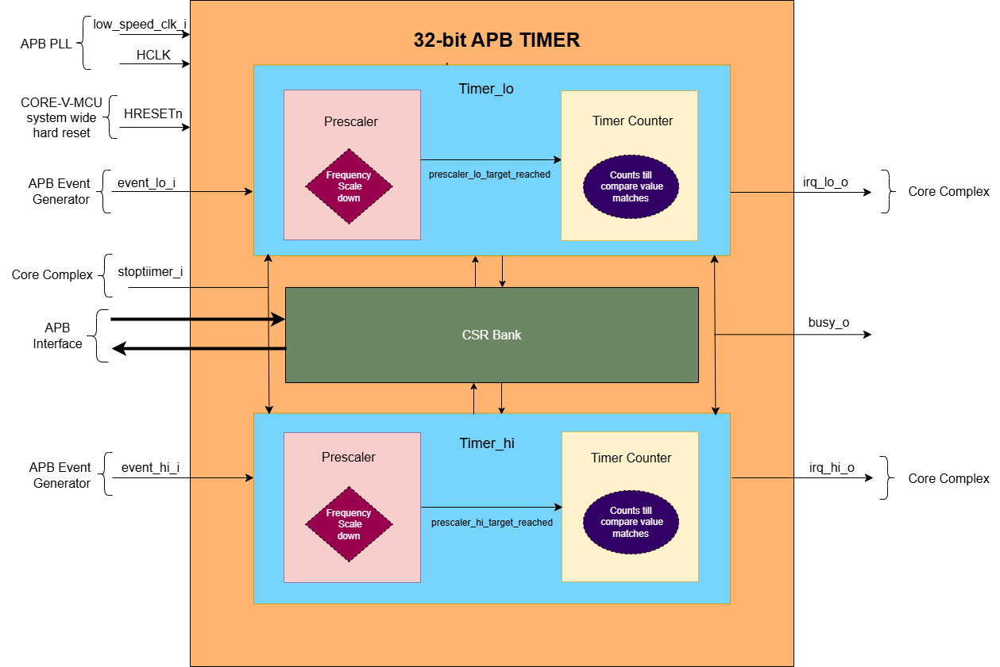
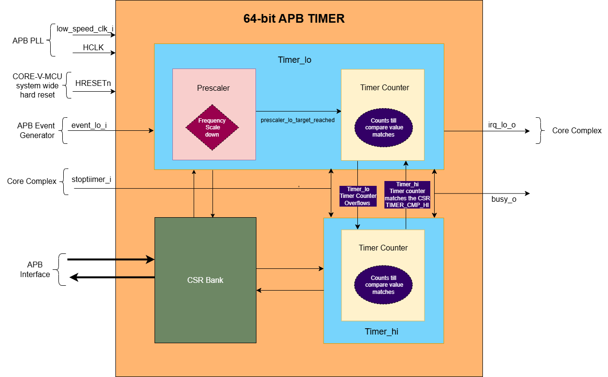
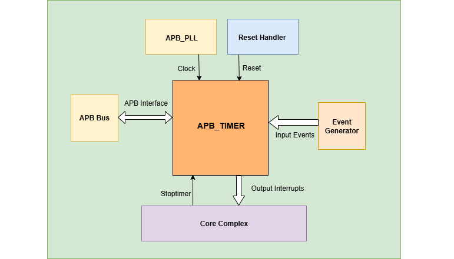
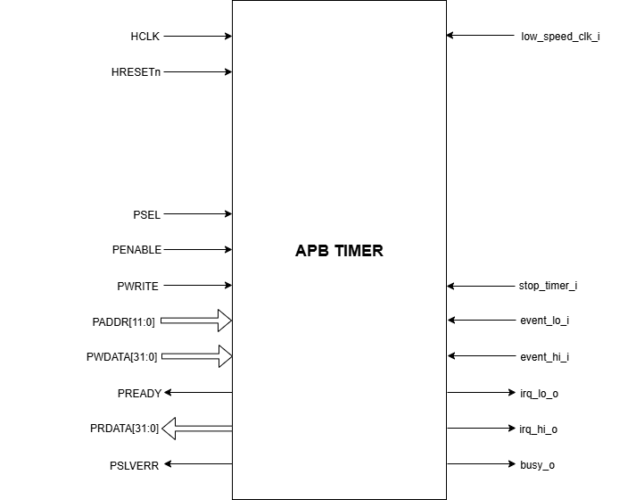

..
   Copyright (c) 2023 OpenHW Group
   Copyright (c) 2024 CircuitSutra

   SPDX-License-Identifier: Apache-2.0 WITH SHL-2.1

.. Level 1
   =======

   Level 2
   -------

   Level 3
   ~~~~~~~

   Level 4
   ^^^^^^^
.. _apb_timer:

APB Timer
=========

APB Timer generates interrupts to the Core complex or CPU subsystem with a finite configurable delay. It manages the interrupt generation through various configurations of prescaler, reference clock and timer counters. 

Features
---------
-  Multiple trigger input sources

-  Two 32-bit configurable prescaler

-  Configurable interrupts

-  Support for two independent 32-bit timers or a single 64-bit timer

-  Supports one-shot and compare-clear modes.

-  Configurable control operations of timer: (Start, Stop and Reset)

Block Architecture
------------------
APB timer can either be configured as two 32-bit independent timers or a single 64 bit timer. 
It has two timers, Timer_hi and Timer_lo which are responsible to generate irq_lo_o or irq_hi_o interrupt signals to Core Complex/CPU. 
Working of Timer_lo and Timer_hi is functionally identical in the 32 bit mode, whereas Timer_lo and Timer_hi are cascaded in 64 bit mode.
The APB timer can be configured using CSRs. The CSRs of the APB timer are accessible using the APB bus.

The figure below is a high-level block Diagram of APB Timer:

If the MODE_64_BIT in CFG_REG_LO CSR is '0', the APB timer can be configured as a 32-bit timer i.e. Timer_hi/Timer_lo in one of the below following ways.

- Only Timer_hi can be configured.
- Only Timer_lo can be configured. 
- Both Timer_hi/Timer_lo can be configured independently at the same time.

Timer_hi and Timer_lo have the same design, with matching CSRs and input/output signals that differ only by '_hi' and '_lo' suffixes, making their control and behavior consistent.

32 bit Timer_lo Timer
~~~~~~~~~~~~~~~~~~~~~~

Timer_lo is designed using a prescaller and Timer counters
The figure below is a high-level block diagram of a 32 bit APB Timer:

.. _Prescaler:

Prescaler
^^^^^^^^^
Prescaler's main objective is to scale down the frequency of the input clock with the PRESCALER_COMP amount of times. Where PRESCALER_COMP is the bitfield of CFG_REG_LO CSR.
Prescaler generates prescaler_lo_target_reached event after PRESCALER_COMP number of clock cycles. 

Prescaler maintains a prescaler counter whose initial value is '0'.

The prescaler counter increments on the positive edge of one of two clock sources, based on the value of the REF_CLK_EN_BIT in the CFG_REG_LO CSR:

- If REF_CLK_EN_BIT = 1, it increments on the positive edge of the reference clock.

- If REF_CLK_EN_BIT = 0, it increments on the positive edge of the system clock (HCLK).

For every positive edge of the selected clock, if prescaler is enabled, prescaler counter is incremented by value '1' until it reaches the PRESCALER_COMP bitfield of CFG_REG_LO CSR value.
Once the prescaler counter reaches the PRESCALER_COMP bitfield of CFG_REG_LO CSR value then prescaler_lo_target_reached event is '1'.
In the next positive edge of the selected clock, prescaler counter and prescaler_lo_target_reached are reset to '0'.
The prescaler counter starts incrementing and the same process repeats to set the prescaler_lo_target_reached multiple times.

**Reset Prescaler:**

When the prescaler is reset, the prescaler counter and prescaler_lo_target_reached are reset to '0'. 
Prescaler is reset, if any of the below conditions is satisfied: 

- When PRESCALER_EN_BIT in the CFG_REG_LO CSR is '1' and prescaler_lo_target_reached is '1' for one clock cycle.
- When the RESET_BIT in the CFG_REG_LO CSR is '1'.
- When the RESET_LO in the TIMER_RESET_LO CSR is '1'. 
- When the HRESETn is '0'.

**Enable Prescaler:**

When the prescaler is enabled, it will start its operation and it can be enabled in the below condition:

- When PRESCALER_EN_BIT and ENABLE_BIT of CFG_REG_LO is '1' and stoptimer_i is '0'.

**Disable Prescaler:**

When the prescaler is disabled, it will pause its operation, that is the prescaler counter will retain its current value.
Prescaler is disabled, if any of the below conditions is satisfied: 

- When PRESCALER_EN_BIT in the CFG_REG_LO CSR is '0'.
- When ENABLE_BIT of CFG_REG_LO is '0'.
- When the input signal stoptimer_i is '1'.

Timer Counter 
^^^^^^^^^^^^^

Timer counter generates the output interrupt irq_lo_o for the Core complex. 
if the IRQ_BIT of CFG_REG_LO CSR is '1', 32 bit Timer generates irq_lo_o interrupt when timer counter matches TIMER_CMP_LO CSR value. 

Timer maintains a counter whose initial value is '0' and FW can overwrite/program this counter to any value by configuring TIMER_VAL_LO CSR. 

Timer counter operation is synchronized using HCLK or reference clock.
If the REF_CLK_EN_BIT in the CFG_REG_LO CSR is  1, it increments on the positive edge of the reference clock else it increments on the positive edge of the system clock (HCLK).

Timer_lo can be enabled via the FW (ENABLE_BIT bitfield in CFG_REG_LO CSR is '1') or the external device input (When event_lo_i input signal and IEM_BIT bitfield in CFG_REG_LO CSR is '1'). The Timer counter checks whether the prescaler is enabled or not via the PRESCALER_EN_BIT bitfield in CFG_REG_LO CSR.

If the prescaler is not enabled. For every positive edge of either the HCLK or reference clock, the Timer counter will start incrementing its internal counter till it reaches the TIMER_CMP_LO.Once the counter reaches TIMER_CMP_LO value and if the IRQ_BIT is '1', then the irq_lo_o interrupt will be asserted.

If the prescaler is enabled. For every positive edge of either the HCLK or reference clock, the prescaler will start incrementing its internal counter till it reaches the PRESCALER_COMP bitfield in CFG_REG_LO CSR and it sets the prescaler_lo_target_reached to '1'. For every instance of prescaler_lo_target_reached is '1', Timer counter if enabled, increments the internal counter by '1' until it reaches the TIMER_CMP_LO and generates the irq_lo_o interrupt.

Further functioning of 32 bit Timer_lo timer depends on whether the timer is configured in one shot mode or compare clear mode.

**Reset Timer counter:**

When the Timer counter is reset, the counter is reset to '0'. 
Timer counter is reset, if any of the below conditions is satisfied: 

- When CMP_CLR_BIT in the CFG_REG_LO CSR is '1' and the counter reaches TIMER_CMP_LO value. (i.e Compare clear mode is enabled)
- When the RESET_BIT in the CFG_REG_LO CSR is '1'.
- When the RESET_LO in the TIMER_RESET_LO CSR is '1'. 

**Enable Timer counter:**

Timer counter will be enabled and it will start its operation, if any of the below conditions is satisfied:

- When ENABLE_BIT of CFG_REG_LO is '1', PRESCALER_EN_BIT of CFG_REG_LO is '0' and stoptimer_i is '0'(If prescaler of Timer_lo is disabled).
- When PRESCALER_EN_BIT and ENABLE_BIT of CFG_REG_LO is '1' and prescaler_lo_target_reached is '1' and stoptimer_i is '0'(If prescaler of Timer_lo is enabled).
- The ENABLE_BIT of CFG_REG_LO is set, when TIMER_START_LO CSR is having any value other than '0'.
- The ENABLE_BIT of CFG_REG_LO is set, when the event_lo_i signal is '1' and IEM_BIT of CFG_REG_LO is '1'.

**Disable Timer counter:**

When the Timer counter is disabled, it will pause its operation, that is the counter will not be set to '0'.
Timer counter is disabled, if any of the below conditions is satisfied: 

- When ENABLE_BIT of CFG_REG_LO CSR is '0'.
- When the input signal stoptimer_i is '1'.

32 bit Timer_hi Timer
~~~~~~~~~~~~~~~~~~~~~~

Timer_hi is designed using a prescaller and Timer counters
The figure below is a high-level block diagram of a 32 bit APB Timer:

.. _Prescaler:

Prescaler
^^^^^^^^^
Prescaler's main objective is to scale down the frequency of the input clock with the PRESCALER_COMP amount of times. Where PRESCALER_COMP is the bitfield of CFG_REG_HI CSR.
Prescaler generates prescaler_hi_target_reached event after PRESCALER_COMP number of clock cycles. 

Prescaler maintains a prescaler counter whose initial value is '0'.

The prescaler counter increments on the positive edge of one of two clock sources, based on the value of the REF_CLK_EN_BIT in the CFG_REG_HI CSR:

- If REF_CLK_EN_BIT = 1, it increments on the positive edge of the reference clock.

- If REF_CLK_EN_BIT = 0, it increments on the positive edge of the system clock (HCLK).

For every positive edge of the selected clock, if prescaler is enabled, prescaler counter is incremented by value '1' until it reaches the PRESCALER_COMP bitfield of CFG_REG_HI CSR value.
Once the prescaler counter reaches the PRESCALER_COMP bitfield of CFG_REG_HI CSR value then prescaler_hi_target_reached event is '1'.
In the next positive edge of the selected clock, prescaler counter and prescaler_hi_target_reached are reset to '0'.
The prescaler counter starts incrementing and the same process repeats to set the prescaler_hi_target_reached multiple times.

**Reset Prescaler:**

When the prescaler is reset, the prescaler counter and prescaler_hi_target_reached are reset to '0'. 
Prescaler is reset, if any of the below conditions is satisfied: 

- When PRESCALER_EN_BIT in the CFG_REG_HI CSR is '1' and prescaler_hi_target_reached is '1' for one clock cycle.
- When the RESET_BIT in the CFG_REG_HI CSR is '1'.
- When the RESET_HI in the TIMER_RESET_HI CSR is '1'. 
- When the HRESETn is '0'.

**Enable Prescaler:**

When the prescaler is enabled, it will start its operation and it can be enabled in the below condition:

- When PRESCALER_EN_BIT and ENABLE_BIT of CFG_REG_HI is '1' and stoptimer_i is '0'.

**Disable Prescaler:**

When the prescaler is disabled, it will pause its operation, that is the prescaler counter will retain its current value.
Prescaler is disabled, if any of the below conditions is satisfied: 

- When PRESCALER_EN_BIT in the CFG_REG_HI CSR is '0'.
- When ENABLE_BIT of CFG_REG_HI is '0'.
- When the input signal stoptimer_i is '1'.

Timer Counter 
^^^^^^^^^^^^^

Timer counter generates the output interrupt irq_hi_o for the Core complex. 
if the IRQ_BIT of CFG_REG_HI CSR is '1', 32 bit Timer generates irq_hi_o interrupt when timer counter matches TIMER_CMP_HI CSR value. 

Timer maintains a counter whose initial value is '0' and FW can overwrite/program this counter to any value by configuring TIMER_VAL_HI CSR. 

Timer counter operation is synchronized using HCLK or reference clock.
If the REF_CLK_EN_BIT in the CFG_REG_HI CSR is  1, it increments on the positive edge of the reference clock else it increments on the positive edge of the system clock (HCLK).

Timer_hi can be enabled via the FW (ENABLE_BIT bitfield in CFG_REG_HI CSR is '1') or the external device input (When event_hi_i input signal and IEM_BIT bitfield in CFG_REG_HI CSR is '1'). The Timer counter checks whether the prescaler is enabled or not via the PRESCALER_EN_BIT bitfield in CFG_REG_HI CSR.

If the prescaler is not enabled. For every positive edge of either the HCLK or reference clock, the Timer counter will start incrementing its internal counter till it reaches the TIMER_CMP_HI.Once the counter reaches TIMER_CMP_HI value and if the IRQ_BIT is '1', then the irq_hi_o interrupt will be asserted.

If the prescaler is enabled. For every positive edge of either the HCLK or reference clock, the prescaler will start incrementing its internal counter till it reaches the PRESCALER_COMP bitfield in CFG_REG_HI CSR and it sets the prescaler_hi_target_reached to '1'. For every instance of prescaler_hi_target_reached is '1', Timer counter if enabled, increments the internal counter by '1' until it reaches the TIMER_CMP_HI and generates the irq_hi_o interrupt.

Further functioning of 32 bit Timer_hi timer depends on whether the timer is configured in one shot mode or compare clear mode.

**Reset Timer counter:**

When the Timer counter is reset, the counter is reset to '0'. 
Timer counter is reset, if any of the below conditions is satisfied: 

- When CMP_CLR_BIT in the CFG_REG_HI CSR is '1' and the counter reaches TIMER_CMP_HI value. (i.e Compare clear mode is enabled)
- When the RESET_BIT in the CFG_REG_HI CSR is '1'.
- When the RESET_HI in the TIMER_RESET_HI CSR is '1'. 
- When the HRESETn is '0'.

**Enable Timer counter:**

Timer counter will be enabled and it will start its operation, if any of the below conditions is satisfied:

- When ENABLE_BIT of CFG_REG_HI is '1', PRESCALER_EN_BIT of CFG_REG_HI is '0' and stoptimer_i is '0'(If prescaler of Timer_hi is disabled).
- When PRESCALER_EN_BIT and ENABLE_BIT of CFG_REG_HI is '1' and prescaler_hi_target_reached is '1' and stoptimer_i is '0'(If prescaler of Timer_hi is enabled).
- The ENABLE_BIT of CFG_REG_HI is set, when TIMER_START_HI CSR is having any value other than '0'.
- The ENABLE_BIT of CFG_REG_HI is set, when the event_hi_i signal is '1' and IEM_BIT of CFG_REG_HI is '1'.

**Disable Timer counter:**

When the Timer counter is disabled, it will pause its operation, that is the counter will not be set to '0'.
Timer counter is disabled, if any of the below conditions is satisfied: 

- When ENABLE_BIT of CFG_REG_HI CSR is '0'.
- When the input signal stoptimer_i is '1'.

The busy_o pin is used to provide the status of APB Timer, it will be driven high, if either Timer_lo or Timer_hi is enabled.

64 bit Timer
~~~~~~~~~~~~~
If the MODE_64_BIT in CFG_REG_LO CSR is '1', APB timer can be configured as 64-bit timer. TIMER_VAL_LO CSR will specify the lower 32 bit and TIMER_VAL_HI CSR will specify the upper 32 bit of the 64 bit timer.   
Timer_lo and Timer_hi are cascaded to acts as a single 64 bit Timer. For control operations CFG_REG_LO CSR, event_lo_i input signal and irq_lo_o output signals are used.
All the CSRs of Timer_lo are used, whereas only TIMER_CMP_HI, TIMER_VAL_HI, TIMER_RESET_HI CSRS, and RESET_HI bitfield in CFG_REG_HI  CSRs of Timer_hi are used.

Like 32 bit timers, 64-bit timer is also designed using a prescaller and Timer counters. The figure below is a high-level block diagram of a 64 bit APB Timer:

Prescaler
^^^^^^^^^
Only the prescaler of Timer_lo is used in 64 bit Timer. The working of the prescaler in 64 bit Timer is exactly the same as of the prescaler in 32 bit timer.
Please refer to the Timer_lo Prescaler_ for more information.  

.. _Counter:

64 bit Timer Counter 
^^^^^^^^^^^^^^^^^^^^
The 64-bit Timer counter is formed by combining two 32-bit timer counters of Timer_lo and Timer_hi.
Timer counter of Timer_lo maintains a counter (i.e counter_lo) whose initial value is TIMER_VAL_LO CSR. Timer counter of Timer_hi maintains a counter (i.e counter_hi) whose initial value is TIMER_VAL_HI CSR.

This means **64-bit counter = { counter_hi (32 bits), counter_lo (32 bits) }**

The counter_lo and counter_hi are incremented on the positive edge of one of two clock sources, based on the value of the REF_CLK_EN_BIT in the CFG_REG_LO CSR:

- If REF_CLK_EN_BIT = 1: increments on the positive edge of the reference clock.
- If REF_CLK_EN_BIT = 0: increments on the positive edge of the system clock (HCLK)

64 bit Timer can be enabled when the ENABLE_BIT bitfield in CFG_REG_LO CSR is '1' or the external device input (i.e. event_lo_i input signal and IEM_BIT bitfield in CFG_REG_LO CSR is '1'). The Timer counter of Timer_lo checks whether the prescaler is enabled or not via the PRESCALER_EN_BIT bitfield in CFG_REG_LO CSR.

If the prescaler is enabled, for every positive edge depending upon REF_CLK_EN_BIT bit, either the HCLK or reference clock, the prescaler will start incrementing its internal counter till it reaches the PRESCALER_COMP bitfield in CFG_REG_LO CSR and it sets the prescaler_lo_target_reached to '1' for 1 clock cycle. 
For every instance of prescaler_lo_target_reached is '1', Timer counter of Timer_lo timer will be incremented by 1.

If the prescaler is not enabled, for every positive edge depending upon REF_CLK_EN_BIT bit, either the HCLK or reference clock, the Timer counter of Timer_lo timer will be incremented by 1.

Timer counter of timer-lo timer keeps incrementing until it reaches the 0xFFFFFFFF.  Since the Timer counter of Timer_lo has overflowed, the Timer counter(counter_hi) of Timer_hi is incremented by value '1'.
That means for every overflow of Timer_lo Timer counter and the positive edge of the selected clock, the counter_hi is incremented by '1'. The same process is repeated till the counter_hi reaches TIMER_CMP_HI value.
Once the counter_hi reaches TIMER_CMP_HI value and if the IRQ_BIT is '1', Timer_lo will assert irq_lo_o interrupt as soon as counter_lo reaches the TIMER_CMP_LO value. 

That is the irq_lo_o interrupt is generated when the **{counter_hi(32 bits), counter_lo (32 bits)}** matches the **{TIMER_CMP_HI (32 bits),TIMER_CMP_LO (32 bits)}**

Further functioning of 64 bit Timer depends on whether the timer is configured in one shot mode or compare clear mode.

**Enable Timer counter of Timer_lo:**

Timer counter of Timer_lo will be enabled and it will start its operation if any of the below conditions is satisfied:

- When ENABLE_BIT of CFG_REG_LO is '1', PRESCALER_EN_BIT of CFG_REG_LO is '0' and stoptimer_i is '0' (If prescaler of Timer_lo is disabled).
- When PRESCALER_EN_BIT and ENABLE_BIT of CFG_REG_LO is '1' and prescaler_lo_target_reached is '1' and stoptimer_i is '0' (If prescaler of Timer_lo is enabled).
- The ENABLE_BIT of CFG_REG_LO is set, when TIMER_START_LO CSR is having any value other than '0'.
- The ENABLE_BIT of CFG_REG_LO is set, when the event_lo_i signal is '1' and IEM_BIT of CFG_REG_LO is '1'.

**Reset Timer counter of Timer_lo:**

When the Timer counter of Timer_lo is reset, the counter is reset to '0'. 
Timer counter of Timer_lo is reset, if any of the below conditions is satisfied: 

- When CMP_CLR_BIT in the CFG_REG_LO CSR is '1' counter of Timer_lo reaches TIMER_CMP_LO value and the counter of Timer_hi reaches TIMER_CMP_HI value. (i.e Compare clear mode is enabled)
- When the RESET_BIT in the CFG_REG_LO CSR is '1'.
- When the RESET_LO in the TIMER_RESET_LO CSR is '1'. 
- When the HRESETn is '0'.

**Enable Timer counter of Timer_hi:**

Timer counter of Timer_hi will be enabled and it will start its operation if any of the below conditions is satisfied:

- When ENABLE_BIT of CFG_REG_LO is '1', counter_lo is 0xFFFFFFFF and stoptimer_i is '0' (If prescaler_lo is disabled).
- When ENABLE_BIT of CFG_REG_LO and prescaler_lo_target_reached is '1', and counter_lo is 0xFFFFFFFF and stoptimer_i is '0' (If prescaler_lo is enabled).

**Reset Timer counter of Timer_hi:**

When the Timer counter of Timer_hi is reset, the counter is reset to '0'. 
Timer counter of Timer_hi is reset, if any of the below conditions is satisfied:
 
- When CMP_CLR_BIT in the CFG_REG_LO CSR, counter of Timer_lo reaches TIMER_CMP_LO value and the counter of Timer_hi reaches TIMER_CMP_HI value
- When the RESET_BIT in the CFG_REG_HI CSR is '1'.
- When the RESET_HI in the TIMER_RESET_HI CSR is '1'.
- When the HRESETn is '0'.

**Disable Timer counter of Timer_lo and Timer_hi:**

When the Timer counter of the Timer_lo and Timer_hi are disabled, it will pause its operation, that is the counters of Timer_lo and Timer_hi will retain their current values.
Timer counter of both Timer_lo and Timer_hi are disabled, if any of the below conditions is satisfied: 

- When ENABLE_BIT of CFG_REG_LO CSR is '0'.
- When the input signal stoptimer_i is '1'.

Important Note:
^^^^^^^^^^^^^^^^
- For 64 bit mode, if the MODE_MTIME_BIT is '1', then issue an interrupt irq_lo_o irrespective of whether the interrupt is enabled or disabled through the IRQ_BIT.
- For 64 bit mode, the busy_o pin is used to provide the status of APB Timer and it will be driven high if the 64 bit Timer is enabled.

One shot mode:
~~~~~~~~~~~~~~~

For 32-bit Timer:
^^^^^^^^^^^^^^^^^

One-shot mode can be independently enabled for both Timer_lo and Timer_hi.

- If the ONE_SHOT_BIT bitfield in the CFG_REG_LO CSR is set to '1', one-shot mode is enabled for Timer_lo. The timer will automatically disable when the Timer_lo counter reaches the value in TIMER_CMP_LO for the first time. When its disabled, the Timer_lo will pause its operation (i.e the timer counter and irq_lo_o will retain its current value).
- Similarly, if the ONE_SHOT_BIT bitfield in the CFG_REG_HI CSR is set to '1', one-shot mode is enabled for Timer_hi, The timer will automatically disable when the Timer_hi counter reaches TIMER_CMP_HI. When its disabled, the Timer_hi will pause its operation (i.e the timer counter and irq_hi_o will retain its current value).
- Timer_lo timer counter and irq_lo_o are reset to '0', when the reset is issued to Timer_lo.
- Timer_hi timer counter and irq_hi_o are reset to '0', when the reset is issued to Timer_hi.

For 64-bit Timer:
^^^^^^^^^^^^^^^^^

In 64-bit mode (where Timer_lo and Timer_hi operate in cascade):
If the ONE_SHOT_BIT bitfield in the CFG_REG_LO CSR is set to '1', one-shot mode is enabled for the entire 64-bit timer.
The cascaded timer (Timer_lo + Timer_hi) will automatically disable when Timer_lo counter reaches TIMER_CMP_LO, and Timer_hi counter reaches TIMER_CMP_HI for the first time.
When its disabled, the cascaded timer (Timer_lo + Timer_hi) will pause its operation (i.e the timer counter and irq_lo_o will retain its current value).

Compare Clear Mode
~~~~~~~~~~~~~~~~~~

For 32-bit Timer:
^^^^^^^^^^^^^^^^^
Compare Clear mode can be independently enabled for both Timer_lo and Timer_hi.

- Timer_lo: If the CMP_CLR_BIT bitfield in the CFG_REG_LO CSR is set to '1', Compare Clear mode is enabled for Timer_lo.  When the counter reaches TIMER_CMP_LO value, the timer is not disabled; instead, the counter and irq_lo_o is reset to 0. Since the timer remains enabled, the counter continues to increment on every positive edge of the clock until it again reaches TIMER_CMP_LO value. This process repeats cyclically.
- Timer_hi: If the CMP_CLR_BIT bitfield in the CFG_REG_HI CSR is set to '1', Compare Clear mode is enabled for Timer_hi.  When the counter reaches TIMER_CMP_HI value, the timer is not disabled; instead, the counter and irq_hi_o is reset to 0. The counter then continues to increment on every positive clock edge until it again reaches TIMER_CMP_HI value. This process repeats cyclically.

For 64-bit Timer:
^^^^^^^^^^^^^^^^^
In 64-bit mode (with cascaded Timer_lo and Timer_hi), the Compare Clear mode is enabled when the CMP_CLR_BIT bitfield in CFG_REG_LO CSR is set to '1'.
When both Timer_lo counter reaches TIMER_CMP_LO, and, Timer_hi counter reaches TIMER_CMP_HI, the timer is not disabled; instead, the irq_lo_o and both counters are reset to 0.
As both timers remain enabled, the counters continue to increment on each positive clock edge until Timer_lo reaches TIMER_CMP_LO and Timer_hi reaches TIMER_CMP_HI again. This process repeats cyclically.

System Architecture:
--------------------

The figure below depicts the connections between the APB TIMER and rest of the modules in Core-V-MCU:-

   APB TIMER Core-V-MCU connections diagram

- The event_lo_i and event_hi_i input to the APB Timer is provided by APB_EVENT_GENERATOR. 
- APB Timer processes this input signals based on the various CSR configurations.
- APB Timer generates few output event signals that are further passed as interrupts to the Core complex.
- APB Timer receives the input stoptimer_i from the core complex that can stop the operations of APB TIMER.

Programmers View:
-----------------

Initial Configurations:
~~~~~~~~~~~~~~~~~~~~~~~
There are CSR bitfields in the APB timer that are required to be configured before any operations are initiated. 
As we have 2 Timer modules that can be configured individually. Each timer has to be configured with appropriate values.

-  Mode selection of 32 bit or 64 bit counters by configuring the MODE_64_BIT in CFG_REG_LO or CFG_REG_HI CSR.
-  Enable or disable the ref_clk by configuring the REF_CLK_EN_BIT in CFG_REG_LO or CFG_REG_HI CSR.
-  Enable or disable the prescaler by configuring the PRESCALER_EN_BIT in CFG_REG_LO or CFG_REG_HI CSR.
-  Prescaler compare values can be configured by using the PRESCALER_COMP in CFG_REG_LO or CFG_REG_HI CSR.
-  One shot mode can be enabled or disabled by configuring the ONE_SHOT_BIT in CFG_REG_LO or CFG_REG_HI CSR.
-  Compare clear mode can be enabled or disabled by configuring the CMP_CLR_BIT in CFG_REG_LO or CFG_REG_HI CSR.
-  The event input can be enabled or disabled by configuring the IEM_BIT in CFG_REG_LO or CFG_REG_HI CSR.
-  Configure the MODE_MTIME_BIT bit so that in the 64 bit mode even if the IRQ_bit is not set an interrupt is being driven when the count == compare_value. Configure the MODE_MTIME_BIT in CFG_REG_LO or CFG_REG_HI CSR.
-  Overwriting the counter value directly via the by configuring the TIMER_VAL_LO or TIMER_VAL_HI CSR.
-  Initial counter value can be configured by using the TIMER_VAL_LO or TIMER_VAL_HI CSR.
-  Timer compare value can be configured by using the TIMER_CMP_LO or TIMER_CMP_HI CSR.
-  the stoptimer_i is used to stop the counter operation of both the Timer_lo and Timer_hi directly.

Control configurations/operations:
~~~~~~~~~~~~~~~~~~~~~~~~~~~~~~~~~~~

There are CSR bitfields in the APB advanced timer which controls operations of each of the timer modules and its sub modules. 

- Set the ENABLE_BIT in CFG_REG_LO or CFG_REG_HI CSR so that Timer_lo or Timer_hi can start counting. 
- Set the START_LO or START_HI in TIMER_START_LO or TIMER_START_HI CSR respectively so that Timer_lo or Timer_hi can start counting. 
- Set the RESET_BIT in CFG_REG_LO or CFG_REG_HI CSR so that Timer_lo or Timer_hi can be reset.
- Set the RESET_LO or RESET_HI in TIMER_RESET_LO or TIMER_RESET_HI CSR respectively so that Timer_lo or Timer_hi can be reset.

Status configurations:
~~~~~~~~~~~~~~~~~~~~~~

The counter values of both the Timers can be read via the following CSR bitfields in the APB timer. 

- Use the TIMER_VAL_LO or TIMER_VAL_HI CSR for the current value of the Timer_lo counter or Timer_hi counter respectively.
- The busy_o pin is used to provide the status of APB Timer will be driven high if anyone of the counter is enabled..

APB Timer CSRs
------------------

Refer to  `Memory Map <https://github.com/openhwgroup/core-v-mcu/blob/master/docs/doc-src/mmap.rst>`_ for the peripheral domain address of the SoC Controller.

NOTE: Several of the APB Timer CSRs are volatile, meaning that their read value may be changed by the hardware.
For example, writing the TIMER_VAL_LO CSR will set the initial counter value of Timer_lo. A subsequent read will return the latest updated counter value of Timer_lo. 
As the name suggests, the value of non-volatile CSRs is not changed by the hardware. These CSRs retain the last value written by the software.
A CSR's volatility is indicated by its "type".

Details of CSR access type are explained `here <https://docs.openhwgroup.org/projects/core-v-mcu/doc-src/mmap.html#csr-access-types>`_.

CFG_REG_LO 
~~~~~~~~~~ 

- Address Offset = 0x000
- Type: volatile

+------------------+-------+--------+---------+--------------------------------+
|     Field        | Bits  | Access | Default |         Description            |
+==================+=======+========+=========+================================+
| MODE_64_BIT      | 31:31 |   RW   |   0x0   | 1 = 64-bit mode, 0=32-bit mode |
+------------------+-------+--------+---------+--------------------------------+
| MODE_MTIME_BIT   | 30:30 |   RW   |   0x0   | 1= Generate the interrupt even |
|                  |       |        |         | if the IRQ_BIT is disabled.    |
+------------------+-------+--------+---------+--------------------------------+
| PRESCALER_COMP   | 15:8  |   RW   |   0x0   | Prescaler compare value        |
+------------------+-------+--------+---------+--------------------------------+
| REF_CLK_EN_BIT   |  7:7  |   RW   |   0x0   | 1= use Refclk for counter,     |
|                  |       |        |         | 0 = use APB bus clk for counter|
+------------------+-------+--------+---------+--------------------------------+
| PRESCALER_EN_BIT |  6:6  |   RW   |   0x0   | 1= Use prescaler               |
|                  |       |        |         | 0= no prescaler                |
+------------------+-------+--------+---------+--------------------------------+
| ONE_SHOT_BIT     |  5:5  |   RW   |   0x0   | 1= disable timer when Timer    |
|                  |       |        |         | counter == TIMER_CMP_LO value  |
+------------------+-------+--------+---------+--------------------------------+
| CMP_CLR_BIT      |  4:4  |   RW   |   0x0   | 1=counter is reset once Timer  |
|                  |       |        |         | counter == TIMER_CMP_LO,       |
|                  |       |        |         | 0 = counter is not reset       |
+------------------+-------+--------+---------+--------------------------------+
| IEM_BIT          |  3:3  |   RW   |   0x0   | 1 = event input is enabled     |
+------------------+-------+--------+---------+--------------------------------+
| IRQ_BIT          |  2:2  |   RW   |   0x0   | 1 = IRQ is enabled when Timer  |
|                  |       |        |         | counter ==TIMER_CMP_LO         |
+------------------+-------+--------+---------+--------------------------------+
| RESET_BIT        |  1:1  |   RW   |   0x0   | 1 = reset the counter          |
+------------------+-------+--------+---------+--------------------------------+
| ENABLE_BIT       |  0:0  |   RW   |   0x0   | 1 = enable the counter to count|
+------------------+-------+--------+---------+--------------------------------+

CFG_REG_HI 
~~~~~~~~~~ 

- Address Offset = 0x004
- Type: volatile

+------------------+-------+--------+---------+--------------------------------+
|     Field        | Bits  | Access | Default |         Description            |
+==================+=======+========+=========+================================+
| MODE_64_BIT      | 31:31 |   RW   |   0x0   | 1 = 64-bit mode, 0=32-bit mode |
+------------------+-------+--------+---------+--------------------------------+
| MODE_MTIME_BIT   | 30:30 |   RW   |   0x0   | 1= Generate the interrupt even |
|                  |       |        |         | if the IRQ_BIT is disabled.    |
+------------------+-------+--------+---------+--------------------------------+
| PRESCALER_COMP   | 15:8  |   RW   |   0x0   | Prescaler compare value        |
+------------------+-------+--------+---------+--------------------------------+
| REF_CLK_EN_BIT   |  7:7  |   RW   |   0x0   | 1= use Refclk for counter,     |
|                  |       |        |         | 0 = use APB bus clk for counter|
+------------------+-------+--------+---------+--------------------------------+
| PRESCALER_EN_BIT |  6:6  |   RW   |   0x0   | 1= Use prescaler               |
|                  |       |        |         | 0= no prescaler                |
+------------------+-------+--------+---------+--------------------------------+
| ONE_SHOT_BIT     |  5:5  |   RW   |   0x0   | 1= disable timer when Timer    |
|                  |       |        |         | counter == TIMER_CMP_HI value  |
+------------------+-------+--------+---------+--------------------------------+
| CMP_CLR_BIT      |  4:4  |   RW   |   0x0   | 1=counter is reset once Timer  |
|                  |       |        |         | counter == TIMER_CMP_HI,       |
|                  |       |        |         | 0=counter is not reset         |
+------------------+-------+--------+---------+--------------------------------+
| IEM_BIT          |  3:3  |   RW   |   0x0   | 1 = event input is enabled     |
+------------------+-------+--------+---------+--------------------------------+
| IRQ_BIT          |  2:2  |   RW   |   0x0   | 1 = IRQ is enabled when Timer  |
|                  |       |        |         | counter ==TIMER_CMP_HI value   |
+------------------+-------+--------+---------+--------------------------------+
| RESET_BIT        |  1:1  |   RW   |   0x0   | 1 = reset the counter          |
+------------------+-------+--------+---------+--------------------------------+
| ENABLE_BIT       |  0:0  |   RW   |   0x0   | 1 = enable the counter to count|
+------------------+-------+--------+---------+--------------------------------+

TIMER_VAL_LO 
~~~~~~~~~~~~ 

- Address Offset = 0x008
- Type: volatile

+-----------------+------+--------+---------+-----------------------------+
|     Field       | Bits | Access | Default |        Description          |
+=================+======+========+=========+=============================+
| TIMER_VAL_LO    | 31:0 |   RW   |   0x0   | 32-bit counter value        |
|                 |      |        |         |                             |
|                 |      |        |         | Low 32-bits in 64-bit mode  |
+-----------------+------+--------+---------+-----------------------------+

TIMER_VAL_HI 
~~~~~~~~~~~~ 

- Address Offset = 0x00C
- Type: volatile

+-----------------+------+--------+---------+-----------------------------+
|     Field       | Bits | Access | Default |        Description          |
+=================+======+========+=========+=============================+
| TIMER_VAL_HI    | 31:0 |   RW   |   0x0   | 32-bit counter value        |
|                 |      |        |         |                             |
|                 |      |        |         | High 32-bits in 64-bit mode |
+-----------------+------+--------+---------+-----------------------------+

TIMER_CMP_LO 
~~~~~~~~~~~~ 

- Address Offset = 0x010
- Type: non-volatile

+-----------------+------+--------+---------+-----------------------------+
|     Field       | Bits | Access | Default |        Description          |
+=================+======+========+=========+=============================+
| TIMER_CMP_LO    | 31:0 |   RW   |   0x0   | compare value for low       |
|                 |      |        |         | 32-bit counter              |
+-----------------+------+--------+---------+-----------------------------+

TIMER_CMP_HI 
~~~~~~~~~~~~ 

- Address Offset = 0x014
- Type: non-volatile

+-----------------+------+--------+---------+-----------------------------+
|     Field       | Bits | Access | Default |        Description          |
+=================+======+========+=========+=============================+
| TIMER_CMP_HI    | 31:0 |   RW   |   0x0   | compare value for high      |
|                 |      |        |         | 32-bit counter              |
+-----------------+------+--------+---------+-----------------------------+

TIMER_START_LO 
~~~~~~~~~~~~~~ 

- Address Offset = 0x018
- Type: non-volatile

+-----------------+------+--------+---------+-----------------------------+
|     Field       | Bits | Access | Default |        Description          |
+=================+======+========+=========+=============================+
| START_LO        | 31:0 |  WS    |   0x0   | Start Timer_lo APB Timer    |
|                 |      |        |         |                             |
+-----------------+------+--------+---------+-----------------------------+

TIMER_START_HI 
~~~~~~~~~~~~~~ 

- Address Offset = 0x01C
- Type: non-volatile

+-----------------+------+--------+---------+-----------------------------+
|     Field       | Bits | Access | Default |        Description          |
+=================+======+========+=========+=============================+
| START_HI        | 31:0 |  WS    |   0x0   | Start Timer_hi APB Timer    |
|                 |      |        |         |                             |
+-----------------+------+--------+---------+-----------------------------+

TIMER_RESET_LO 
~~~~~~~~~~~~~~ 

- Address Offset = 0x020
- Type: non-volatile

+-----------------+------+--------+---------+-----------------------------+
|     Field       | Bits | Access | Default |        Description          |
+=================+======+========+=========+=============================+
| RESET_LO        | 31:0 |  WS    |   0x0   | Reset Timer_lo APB Timer    |
|                 |      |        |         |                             |
+-----------------+------+--------+---------+-----------------------------+

TIMER_RESET_HI 
~~~~~~~~~~~~~~ 

- Address Offset = 0x024
- Type: non-volatile

+-----------------+------+--------+---------+-----------------------------+
|     Field       | Bits | Access | Default |        Description          |
+=================+======+========+=========+=============================+
| RESET_HI        | 31:0 |  WS    |   0x0   | Reset Timer_hi APB Timer    |
|                 |      |        |         |                             |
+-----------------+------+--------+---------+-----------------------------+

Firmware Guidelines
-------------------

Initialization:
~~~~~~~~~~~~~~~
- When the HRESETn signal is low, CSRs default to 0 and outputs are low.
- At every positive edge of either the HCLK or reference clock the CSRs are updated based on APB signals.

Initializing the Prescaler:
^^^^^^^^^^^^^^^^^^^^^^^^^^^^^^^

- By default prescalers are disabled, set PRESCALER_EN_BIT bitfield of CFG_REG_LO or CFG_REG_HI CSRs to enable the prescaler_lo or prescaler_hi respectively. 

- If the Prescalers are enabled, Write to the PRESCALER_COUNT bitfield of CFG_REG_LO or CFG_REG_HI CSRs to specify the compare value for the prescaler_lo or prescaler_hi respectively. 

Initializing the Timer counter:
^^^^^^^^^^^^^^^^^^^^^^^^^^^^^^^^^^^^

- Write to CSRs TIMER_VAL_LO and TIMER_VAL_HI to specify the initial counter value for Timer_lo or Timer_hi respectively. 

- Write to CSRs TIMER_CMP_LO and TIMER_CMP_HI to specify the compare count for Timer_lo or Timer_hi respectively. 

- Write '1' to either ONE_SHOT_BIT bitfield or CMP_CLR_BIT bitfield of CFG_REG_LO or CFG_REG_HI CSRs to select the mode for Timer_lo or Timer_hi respectively. 

- By default interrupts are disabled, set IRQ_BIT bitfield of CFG_REG_LO or CFG_REG_HI CSRs to enable the interrupts irq_lo_o or irq_hi_o for Timer_lo or Timer_hi respectively. 

- By default input events are disabled, set IEM_BIT bitfield of CFG_REG_LO or CFG_REG_HI CSRs to enable the input events event_lo_i or event_hi_i for Timer_lo or Timer_hi respectively. 

- By default reference clock is disabled, set REF_CLK_EN_BIT bitfield of CFG_REG_LO or CFG_REG_HI CSRs to enable the reference clocks for Timer_lo or Timer_hi respectively. 

- By default 64 bit mode is disabled and 32 bit mode is enabled, set MODE_64_BIT bitfield of CFG_REG_LO  CSR to enable the 64 bit mode. 

- Set MODE_MTIME_BIT bitfield of CFG_REG_LO or CFG_REG_HI CSRs to generate interrupt irq_lo_o for 64 bit timer irrespective of whether the interrupt is enabled or disabled through the IRQ_BIT.

Start the timer:
~~~~~~~~~~~~~~~~
- Timer can be started in the following 3 ways:
   - When ENABLE_BIT of CFG_REG_LO or CFG_REG_HI is '1' for timer_lo or timer_hi respectively.
   - When the event_lo_i or event_hi_i signal is read as '1' and IEM_BIT of CFG_REG_LO or CFG_REG_HI is '1' for timer_lo or timer_hi respectively.
   - When TIMER_START_LO or TIMER_START_HI is any value other than '0' for timer_lo or timer_hi respectively.
- Once the timer is started FW can observe the counter value getting incremented in the TIMER_VAL_LO or TIMER_VAL_HI CSR  for timer_lo or timer_hi respectively.

Stop the timer:
~~~~~~~~~~~~~~~~
- Timer can be stopped in the following 2 ways:
   - When ENABLE_BIT of CFG_REG_LO or CFG_REG_HI is '0' for timer_lo or timer_hi respectively.
   - When stoptimer_i is '1'.
- Once the timer is stopped FW can observe the counter value remain the same in the TIMER_VAL_LO or TIMER_VAL_HI CSR for timer_lo or timer_hi respectively.

Reset the timer:
~~~~~~~~~~~~~~~~
- Timer can be reset in the following 2 ways:
   - When the RESET_BIT in the CFG_REG_LO or CFG_REG_HI CSR is '1' for timer_lo or timer_hi respectively.
   - When the RESET_LO in the TIMER_RESET_LO or TIMER_RESET_HI CSR is '1'  for timer_lo or timer_hi respectively.
- Once the timer is stopped FW can observe the counter value reset to '0' in the TIMER_VAL_LO or TIMER_VAL_HI CSR for timer_lo or timer_hi respectively.

Interrupt generation:
~~~~~~~~~~~~~~~~~~~~~
- If the IRQ_BIT of  CFG_REG_LO is '1' , irq_lo_o will be asserted when the counter value of Timer_lo reaches the TIMER_CMP_LO.
- If the IRQ_BIT of  CFG_REG_HI is '1' , irq_hi_o will be asserted when the counter value of Timer_hi reaches the TIMER_CMP_HI.

Pin Diagram
-----------

The figure below represents the input and output pins for the APB Timer:-

   
APB Timer Pin Diagram

Clock and Reset
~~~~~~~~~~~~~~~
- HCLK: System clock input
- HRESETn: Active-low reset input
- low_speed_clk_i: Reference clock input

APB Interface
~~~~~~~~~~~~~
- PADDR[11:0]: APB address bus input
- PSEL: APB peripheral select input
- PENABLE: APB enable input
- PWRITE: APB write control input (high for write, low for read)
- PWDATA[31:0]: APB write data bus input
- PREADY: APB ready output to indicate transfer completion
- PRDATA[31:0]: APB read data bus output
- PSLVERR: APB slave error

APB Event generator Interface
~~~~~~~~~~~~~~~~~~~~~~~~~~~~~~
- event_lo_i: Input event for the Timer_lo
- event_hi_i: Input event for the Timer_hi

Core Complex Interface
~~~~~~~~~~~~~~~~~~~~~~
- stoptimer_i: Input signal to stop timer
- irq_lo_o: Output interrupt from Timer_lo
- irq_hi_o: Output interrupt from Timer_hi
- busy_o: Output busy signal that signifies that any one of the timer is active