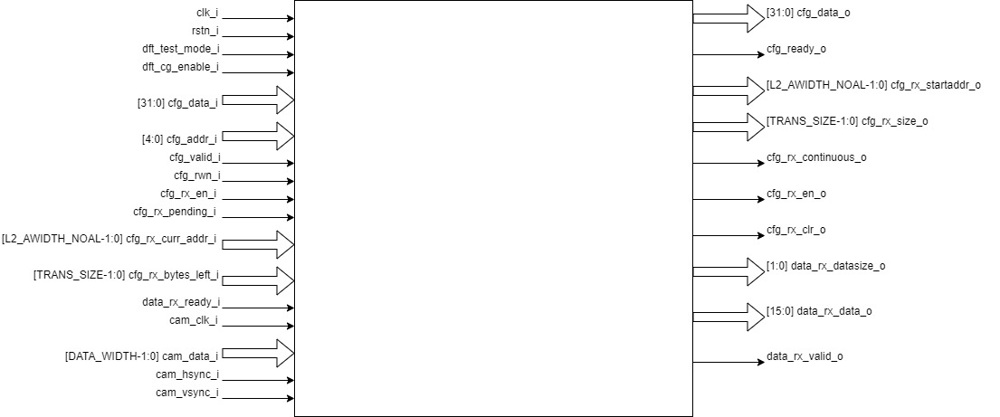

..
   Copyright (c) 2023 OpenHW Group
   Copyright (c) 2024 CircuitSutra

   SPDX-License-Identifier: Apache-2.0 WITH SHL-2.1

.. Level 1
   =======

   Level 2
   -------

   Level 3
   ~~~~~~~

   Level 4
   ^^^^^^^
.. _udma_cam:

uDMA CAMERA
===========
A camera interface is a hardware block that interfaces with different
image sensor interfaces and generates output that can be used for
image processing.

Features
--------
- Supports RGB565, RGB555 ,RGB444, BYPASS_LITEND and BYPASS_BIGEND image formats.
- Allows windowing. It allows users to select a range of interest in the picture. It can be disabled by the user.
- Parallel data input line for carrying pixel data.
- There is a horizontal sync(HSYNC) input which indicates one line of the frame is transmitted.
- There is a vertical sync(VSYNC) input which indicates that one entire frame is transmitted. It can be configured for polarity.

Block Architecture
------------------
cam_clk_i is a pixel clock which changes on every pixel. Pixel data is taken as input through cam_data_i, and cam_hsync_i and cam_vsync_i indicate the horizontal and vertical sync value.
It supports active low reset. It contains a udma dc fifo to store the pixel value before sending it to output.

The Figure below is a high-level block diagram of the uDMA UART:-

   uDMA Camera Block Diagram

- Read write input pin, cfg_rwn_i indicates if we want to write to the CSR or read from the CSR. If the input is high then the  CSR is selected for reading and else for writing.
-  Address of the CSR is provided through cfg_addr_i.
- Value read through the CSR is provided as output through cfg_data_o. 
- cfg_data_i writes values to CSR.
- Data in CSR REG_RX_SADDR is passed through cfg_rx_startaddr_o.
- Data in CSR REG_RX_SIZE is passed through cfg_rx_size_o.
- Data in the REG_RX_CFG is passed through cfg_rx_continuous_o, cfg_rx_en_o, cfg_rx_clr_o and data_rx_datasize_o.

**Frame counter**
   - Frame counter is incremented at start of frame if frame drop is enabled.
   - Counter is reset if the counter value reaches frame drop value or frame drop is disabled.
   - Frame drop enable status and frame drop value can be read from REG_CAM_CFG_GLOB.
   - Non zero frame counter value indicates a valid frame.

**WINDOWING**
   - Window of interest can be selected by using the windowing feature.
   - Its enable or disable status can be read from REG_CAM_CFG_GLOB.
   - Coordinates of the window can be written to and read from REG_CAM_CFG_LL and REG_CAM_CFG_UR.
   - A pixel is valid only if it is inside the window of interest if windowing is enabled.
   - If windowing is disabled, pixels will be valid for every valid frame.

**Row counter and column counter**
   - Counts the row and column at every camera clock.
   - Counter is reset at the start of the frame.
   - These counter values are used when windowing is enabled to check the validity of pixels.
   - Column counter is incremented at posedge of cam_clk_i. Column ends when the column counter reaches ROWLEN, which resets the counter value. ROWLEN value can be read from REG_CAM_CFG_SIZE.
   - Row counter is incremented at the end of each column.

**IMAGE FORMAT**
   - RGB565: Five bits of data is allocated for the red and blue color component and 6 bits data for the green color component.
   - RGB555: Five bits of data is allocated for all the color components.
   - RGB444: Four bits of data is allocated for all the color components.
   - R, G, B pixel values can be read from cam_data_i.
   - Filter values for R, G, B can be obtained by multiplying their respective pixel values by their coefficients. Coefficient can be read from REG_CAM_CFG_FILTER.
   - Filter values for all the pixels are added and then shifted right to get the final pixel value which is then passed to fifo. Number of bits needed to be shifted can be read from REG_CAM_CFG_GLOB.

**IMAGE FORMAT: BYPASS_LITEND, BYPASS_BIGEND**
   - These image formats are used for YUV images. In the YUV image a color is described as a Y component(luma) and two chroma components U and V.
   - Luma represents the brightness of the image and chroma conveys the color information of the picture.
   - YUV pixel value can be read from cam_data_i.
   - Filter is not valid.

**Vertical sync**
   - Polarity can be read from REG_CAM_VSYNC_POLARITY..
   - A start of frame is marked by high current vsync value and low previous vsync.

**udma_dc_fifo**
   - RGB or YUV pixel values are sent as input udma_dc_fifo.
   - Valid output is passed through data_rx_valid_o if there is data in fifo to be read.
   - Data can be read from the fifo through data_rx_data_o.

System Architecture
-------------------
The figure below shows how the uDMA UART interfaces with the rest of the CORE-V-MCU components and the external UART device:-

.. figure:: uDMA-Camera-system-Connection-Diagram.png
   :name: uDMA-Camera-CORE-V-MCU-Connection-Diagram
   :align: center
   :alt:

   uDMA Camera CORE-V-MCU connection diagram

Programming Model
------------------
As with the most peripherals in the uDMA Subsystem, software configuration can be conceptualized into three functions:

- Configure the I/O parameters of the peripheral (e.g. frame size).
- Configure the uDMA camera data control parameters.
- Manage the data transfer/reception operation.

uDMA Camera Data Control
^^^^^^^^^^^^^^^^^^^^^^
Refer to the Firmware Guidelines section in the current chapter.

Data Transfer Operation
^^^^^^^^^^^^^^^^^^^^^^^
Refer to the Firmware Guidelines section in the current chapter.

uDMA CAMERA CSRs
----------------

Refer to `Memory Map <https://github.com/openhwgroup/core-v-mcu/blob/master/docs/doc-src/mmap.rst>`_ for peripheral domain address of the uDMA CAMERA.

**NOTE:** Several of the uDMA CAMERA CSR are volatile, meaning that their read value may be changed by the hardware.
For example, writting the *REG_RX_SADDR* CSR will set the address of the receive buffer pointer.
As data is received, the hardware will update the value of the pointer to indicate the current address.
As the name suggests, the value of non-volatile CSRs is not changed by the hardware.
These CSRs retain the last value writen by software.

A CSRs volatility is indicated by its "type".

Details of CSR access type are explained `here <https://docs.openhwgroup.org/projects/core-v-mcu/doc-src/mmap.html#csr-access-types>`_.

The CSRs REG_RX_SADDR, REG_RX_SIZE specifies the configuration for the transaction on the RX channel. The uDMA Core creates a local copy of this information at its end and use it for current ongoing transaction.

REG_RX_SADDR
^^^^^^^^^^^^

- Offset: 0x0
- Type:   volatile

+--------+------+--------+------------+----------------------------------------------------------------------------------------------------------+
| Field  | Bits | Access | Default    | Description                                                                                              |
+========+======+========+============+==========================================================================================================+
| SADDR  | 18:0 | RW     |    0x0     | Address of the Rx buffer. This is location in the L2 memory where UART will write the recived data.      |
|        |      |        |            | Read & write to this CSR access different information.                                                   |
|        |      |        |            |                                                                                                          |
|        |      |        |            | **On Write**: Address of Rx buffer for next transaction. It does not impact current ongoing transaction. |
|        |      |        |            |                                                                                                          |
|        |      |        |            | **On Read**:  Address of read buffer for the current ongoing transaction. This is the local copy of      |
|        |      |        |            | information maintained inside the uDMA core.                                                             |
+--------+------+--------+------------+----------------------------------------------------------------------------------------------------------+

REG_RX_SIZE
^^^^^^^^^^^

- Offset: 0x04
- Type:   volatile

+-------+-------+--------+------------+--------------------------------------------------------------------------------------------+
| Field |  Bits | Access | Default    | Description                                                                                |
+=======+=======+========+============+============================================================================================+
| SIZE  |  19:0 |   RW   |    0x0     | Size of Rx buffer(amount of data to be transferred by UART to L2 memory). Read & write     |
|       |       |        |            | to this CSR access different information.                                                  |
|       |       |        |            |                                                                                            |
|       |       |        |            | **On Write**: Size of Rx buffer for next transaction.  It does not impact current ongoing  |
|       |       |        |            | transaction.                                                                               |
|       |       |        |            |                                                                                            |
|       |       |        |            | **On Read**:  Bytes left for current ongoing transaction.  This is the local copy of       |
|       |       |        |            | information maintained inside the uDMA core.                                               |
+-------+-------+--------+------------+--------------------------------------------------------------------------------------------+

REG_RX_CFG
^^^^^^^^^^

- Offset: 0x08
- Type:   volatile

+------------+-------+--------+------------+------------------------------------------------------------------------------------+
| Field      |  Bits | Access | Default    | Description                                                                        |
+============+=======+========+============+====================================================================================+
| CLR        |   6:6 |   WO   |    0x0     | Clear the local copy of Rx channel configuration CSRs inside uDMA core             |
+------------+-------+--------+------------+------------------------------------------------------------------------------------+
| PENDING    |   5:5 |   RO   |    0x0     | - 0x1: The uDMA core Rx channel is enabled and either transmitting data,           |
|            |       |        |            |   waiting for access from the uDMA core arbiter, or stalled due to a full Rx FIFO  |
|            |       |        |            |   of uDMA Core                                                                     |
|            |       |        |            | - 0x0 : Rx channel of the uDMA core does not have data to transmit to L2 memory    |
+------------+-------+--------+------------+------------------------------------------------------------------------------------+
| EN         |   4:4 |   RW   |    0x0     | Enable the Rx channel of the uDMA core to perform Rx operation                     |
+------------+-------+--------+------------+------------------------------------------------------------------------------------+
| DATASIZE   |   2:1 |   RW   |    0x2     | Controls uDMA address increment for each transfer from L2 memory                   |
|            |       |        |            |                                                                                    |
|            |       |        |            | - 0x0: increment address by 1 (data is 8 bits)                                     |
|            |       |        |            | - 0x1: increment address by 2 (data is 16 bits)                                    |
|            |       |        |            | - 0x02: increment address by 4 (data is 32 bits)                                   |
|            |       |        |            | - 0x03: increment address by 0                                                     |
|            |       |        |            |                                                                                    |
+------------+-------+--------+------------+------------------------------------------------------------------------------------+
| CONTINUOUS |   0:0 |   RW   |    0x0     | - 0x0: stop after last transfer for channel                                        |
|            |       |        |            | - 0x1: after last transfer for channel, reload buffer size, start address          |
|            |       |        |            |     and restart channel                                                            |
|            |       |        |            |                                                                                    |
+------------+-------+--------+------------+------------------------------------------------------------------------------------+

REG_CAM_CFG_GLOB
^^^^^^^^^^^^^^^^

- Offset: 0x20
- Type:  non-volatile

+----------------+-------+--------+------------+-------------------------------------------------------------------------------------+
| Field          |  Bits | Access | Default    | Description                                                                         |
+================+=======+========+============+=====================================================================================+
| EN             | 31:31 |   RW   |    0x0     | Enable data RX from camera interface, Enable/disable only happens at start of frame |
|                |       |        |            |                                                                                     |
|                |       |        |            | - 0x0: disable                                                                      |
|                |       |        |            | - 0x1: enable                                                                       |
|                |       |        |            |                                                                                     |
+----------------+-------+--------+------------+-------------------------------------------------------------------------------------+
| SHIFT          | 14:11 |   RW   |    0x0     | Number of bits to right shift final pixel value.                                    |
|                |       |        |            | Note: not used if FORMAT == BYPASS                                                  |
+----------------+-------+--------+------------+-------------------------------------------------------------------------------------+
| FORMAT         |  10:8 |   RW   |    0x0     |Input frame format:                                                                  |
|                |       |        |            |                                                                                     |
|                |       |        |            | - 0x0: RGB565                                                                       |
|                |       |        |            | - 0x1: RGB555                                                                       |
|                |       |        |            | - 0x2: RGB444                                                                       |
|                |       |        |            | - 0x4: BYPASS_LITTLEEND                                                             |
|                |       |        |            | - 0x5: BYPASS_BIGEND                                                                |
|                |       |        |            |                                                                                     |
+----------------+-------+--------+------------+-------------------------------------------------------------------------------------+
| FRAMEWINDOW_EN |  7:7  |   RW   |    0x0     | Windowing enable:                                                                   |
|                |       |        |            |                                                                                     |
|                |       |        |            | - 0x0: disable                                                                      |
|                |       |        |            | - 0x1: enable                                                                       |
|                |       |        |            |                                                                                     |
+----------------+-------+--------+------------+-------------------------------------------------------------------------------------+

REG_CAM_CFG_LL
^^^^^^^^^^^^^^

- Offset: 0x24
- Type:   volatile

+------------+-------+--------+------------+------------------------------------------------------------------------------------+
| Field      |  Bits | Access | Default    | Description                                                                        |
+============+=======+========+============+====================================================================================+
| SIZE       |  15:0 |   RW   |    0x0     | Buffer size in bytes (1MB max)                                                     |
|            |       |        |            |                                                                                    |
|            |       |        |            | **Read:** bytes remaining until transfer complete                                  |
|            |       |        |            | **Write:** set number of bytes to transfer                                         |
|            |       |        |            |                                                                                    |
+------------+-------+--------+------------+------------------------------------------------------------------------------------+

REG_CAM_CFG_UR
^^^^^^^^^^^^^^

- Offset: 0x28
- Type:   non-volatile

+-----------------+-------+--------+------------+------------------------------------------------------------------------------------+
| Field           |  Bits | Access | Default    | Description                                                                        |
+=================+=======+========+============+====================================================================================+
| SIZE            | 31:16 |   RW   |    0x0     | Y coordinate of upper right corner of window.                                      |
+-----------------+-------+--------+------------+------------------------------------------------------------------------------------+
| FRAMEWINDOW_URX | 15:0  |   RW   |    0x0     | X coordinate of upper right corner of window.                                      |
+-----------------+-------+--------+------------+------------------------------------------------------------------------------------+

REG_CAM_CFG_SIZE
^^^^^^^^^^^^^^^^

- Offset: 0x2C
- Type:   non-volatile

+------------+-------+--------+------------+------------------------------------------------------------------------------------+
| Field      |  Bits | Access | Default    | Description                                                                        |
+============+=======+========+============+====================================================================================+
| ROWLEN     | 31:16 |   RW   |    0x0     | N-1 where N is the number of horizontal pixels (used in window mode)               |
+------------+-------+--------+------------+------------------------------------------------------------------------------------+

REG_CAM_CFG_FILTER
^^^^^^^^^^^^^^^^^^

- Offset: 0x30
- Type:   volatile

+------------+-------+--------+------------+------------------------------------------------------------------------------------+
| Field      |  Bits | Access | Default    | Description                                                                        |
+============+=======+========+============+====================================================================================+
| R_COEFF    |   6:6 |   RW   |    0x0     | Coefficent that multiplies R component, Note: not used if FORMAT == BYPASS         |
+------------+-------+--------+------------+------------------------------------------------------------------------------------+
| G_COEFF    |   5:5 |   RW   |    0x0     | Coefficent that multiplies G component, Note: not used if FORMAT == BYPASS         |
+------------+-------+--------+------------+------------------------------------------------------------------------------------+
| B_COEFF    |   4:4 |   RW   |    0x0     | Coefficent that multiplies B component, Note: not used if FORMAT == BYPASS         |
+------------+-------+--------+------------+------------------------------------------------------------------------------------+

REG_CAM_VSYNC_POLARITY
^^^^^^^^^^^^^^^^^^^^^^

- Offset: 0x34
- Type:   volatile

+----------------+-------+--------+------------+---------------------------------+
| Field          |  Bits | Access | Default    | Description                     |
+================+=======+========+============+=================================+
| VSYNC_POLARITY |   0:0 |   RW   |    0x0     | Set vsync polarit               |
|                |       |        |            |                                 |
|                |       |        |            |- 0x0: Active low                |
|                |       |        |            |- 0x0: Active high               |
|                |       |        |            |                                 |
+----------------+-------+--------+------------+---------------------------------+

Firmware Guidelines
-------------------

Clock Enable, Reset & Configure uDMA UART
^^^^^^^^^^^^^^^^^^^^^^^^^^^^^^^^^^^^^^^^^

Rx Operation
^^^^^^^^^^^^

Pin Diagram
-----------
The Figure below is a high-level block diagram of the uDMA Camera:-

.. figure:: uDMA_Camera_Pin_Diagram.png
   :name: uDMA_Camera_Pin_Diagram
   :align: center
   :alt:

   uDMA Camera Pin Diagram

Below is categorization of these pins:

Rx channel interface
^^^^^^^^^^^^^^^^^^^^
The following pins constitute the Rx channel interface of uDMA UART. uDMA UART uses these pins to write data to interleaved (L2) memory:

- data_rx_datasize_o
- data_rx_o
- data_rx_valid_o
- data_rx_ready_i

These pins reflect the configuration values for the next transaction.

Clock interface
^^^^^^^^^^^^^^^
- clk_i

uDMA CORE derives these clock pins. clk_i is used to synchronize Camera with uDAM Core.

Reset interface
^^^^^^^^^^^^^^^
- rstn_i

uDMA core issues reset signal to Camera using reset pin.

uDMA UART inerface to read-write CSRs
^^^^^^^^^^^^^^^^^^^^^^^^^^^^^^^^^^^^^
The following interfaces are used to read and write to Camera CSRs. These interfaces are managed by uDMA Core:

- cfg_data_i
- cfg_addr_i
- cfg_valid_i
- cfg_rwn_i
- cfg_ready_o
- cfg_data_o

Rx channel interface
^^^^^^^^^^^^^^^^^^^^
The following pins constitute the Rx channel interface of uDMA UART. uDMA UART uses these pins to write data to interleaved (L2) memory:

- data_rx_datasize_o
- data_rx_o
- data_rx_valid_o
- data_rx_ready_i

These pins reflect the configuration values for the next transaction.

uDMA UART Rx channel configuration interface
^^^^^^^^^^^^^^^^^^^^^^^^^^^^^^^^^^^^^^^^^^^^
- uDMA UART uses the following pins to share the value of config CSRs i.e. RX_SADDR, RX_SIZE, and RX_CFG with the uDMA core:-

   - cfg_rx_startaddr_o
   - cfg_rx_size_o
   - cfg_rx_continuous_o
   - cfg_rx_en_o
   - cfg_rx_clr_o

- UART shares the values present over the below pins as read values of the config CSRs i.e. RX_SADDR, RX_SIZE, and RX_CFG:

   - cfg_rx_en_i
   - cfg_rx_pending_i
   - cfg_rx_curr_addr_i
   - cfg_rx_bytes_left_i

   These values are updated by the uDMA core and reflects the configuration values for the current ongoing transactions.

Test Interface
^^^^^^^^^^^^^^

- dft_test_mode_i: Design-for-test mode signal
- dft_cg_enable_i: Clock gating enable during test

*dft_test_mode_i* is used to put uDMA Camera into test mode. *dft_cg_enable_i* is used to control clock gating such that clock behavior can be tested.

Camera clock interface
^^^^^^^^^^^^^^^^^^^^^^

- cam_clk_i

TODO: Add descrition

Camera frame interface
^^^^^^^^^^^^^^^^^^^^^^

- cam_data_i
- cam_hsync_i
- cam_vsync_i

TODO: Add descrition