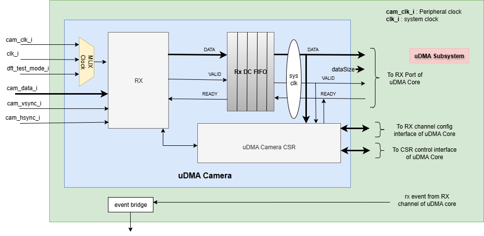
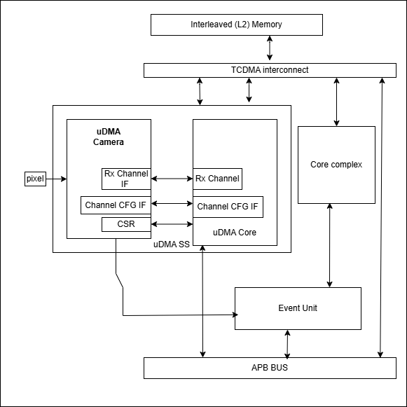
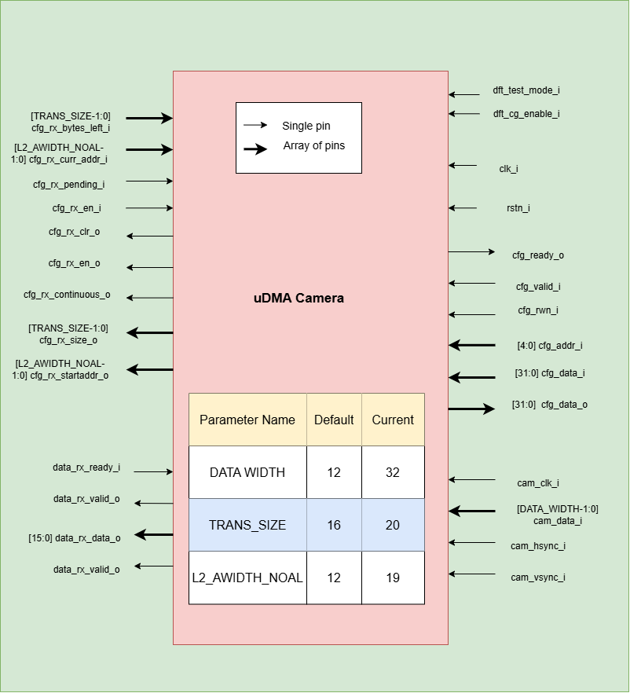

..
   Copyright (c) 2023 OpenHW Group
   Copyright (c) 2024 CircuitSutra

   SPDX-License-Identifier: Apache-2.0 WITH SHL-2.1

.. Level 1
   =======

   Level 2
   -------

   Level 3
   ~~~~~~~

   Level 4
   ^^^^^^^
.. _udma_cam:

uDMA CAMERA
===========
A camera interface is a hardware block that interfaces with different image sensor interfaces and generates output that can be used for image processing.

Features
--------
- Supports RGB565, RGB555 ,RGB444, BYPASS_LITEND and BYPASS_BIGEND image formats.
- Supports Frame slicing. It allows users to select a range of interest in the picture.
- Supports Frame dropping. It allows users to select a number of frames that can dropped before storing it in L2 memory.
- Supports Grayscaling. It allows users to update RGB coefficient in the pixel before storing it in L2 memory.
- Supports variable row len. Number od pixels in a row can be defined by ``REG_CAM_CFG_SIZE`` CSR.
- Parallel data input line for carrying frame data.
- There is a horizontal sync(HSYNC) input which indicates one line of the frame is transmitted.
- There is a vertical sync(VSYNC) input which indicates that one entire frame is transmitted. Polarity of ``cam_vsync_i`` signal can defined using ``REG_CAM_VSYNC_POLARITY`` CSR.
- Supports active low reset.

Block Architecture
------------------

uDMA camera is a peripheral function of the uDMA subsystem. As such, its CSRs are not directly accessible via the APB bus. Rather, the control plane interface to the uDMA camera is managed by the uDMA core within the uDMA subsystem.
This is transparent to the programmer as all uDMA camera CSRs appear within the uDMA Subsystem's memory region. As is the case for all uDMA subsystem peripherals, I/O operations are controlled by the uDMA core. This is not transparent to the programmer.

The Figure below is a high-level block diagram of the uDMA camera:-

   uDMA camera Block Diagram

In the block diagram above, the DATA lines at the boundary of the uDMA camera are 32 bits wide, whereas other DATA lines are only 16 bits wide. The DATASIZE pin is 2 bits wide and ``DATASIZE`` bit of ``REG_RX_CFG`` define the value of this pin. The valid values for the DATASIZE pin are:

- 0x0: 1-byte transfer
- 0x1: 2-byte transfer
- 0x2: 4-byte transfer

When transmitting data to the uDMA Core, the uDMA camera pads bits [31:16] with 0x0.

uDMA camera uses the Rx channel interface to store the data received from the external camera device to the interleaved (L2) memory.
Refer to `uDMA subsystem <https://github.com/openhwgroup/core-v-mcu/blob/master/docs/doc-src/udma_subsystem.rst>`_ for more information about the Rx channel functionality of uDMA Core.

Pixel data is taken as input from external device through ``cam_data_i``. ``cam_hsync_i`` and ``cam_vsync_i`` indicates the horizontal and vertical sync value.

Each component of the uDMA camera is discussed in greater detail in the following sections.

Clock MUX
^^^^^^^^^
The uDMA core includes a clock multiplexer used to select the input clock source. If dft_test_mode_i is low, the clock multiplexer outputs the peripheral(cam_clk_i) clock; otherwise, it outputs the system(clk_i) clock.

Dual-clock(DC) RX FIFO
^^^^^^^^^^^^^^^^^^^^^^^^^^^^^

The uDMA core operates using the system clock, while the uDMA Camera operates using both the system clock and the peripheral clock. To ensure the uDMA camera and core are properly synchronized, dual-clock FIFOs are used in the uDMA Camera.
These are 8-depth FIFOs and can store 16-bit wide data. It is implemented using circular FIFO.

Below diagram shows the interfaces of DC FIFO: 

.. figure:: uDMA_camera_Dual_clock_fifo.png
   :name: uDMA_camera_Dual_clock_fifo
   :align: center
   :alt:

   Dual clock FIFO

For Rx operation, source(src_*) interfaces shown in above diagram operate at peripheral clock and destination(dst_*) interfaces operate using system clock.

**Pop operation**

The DC FIFO asserts the dst_valid_o (valid) signal to indicate that valid data is available on the data lines. A module waiting for data should read the data lines only when valid pin is high and drive the dst_ready_i (ready)
signal to high and reset it in next clock cycle. When DC FIFO receives an active ready signal, indicating that the data has been read, it updates the data lines with new data if FIFO is not empty. 
If the FIFO is empty, the dst_valid_o signal is deasserted.

**Push operation**

The DC FIFO asserts the src_ready_o (ready) signal when there is available space to accept incoming data. When an active src_valid_i (valid) signal is received, the data is written into the FIFO.
The src_ready_o signal is kept asserted as long as the FIFO has space for more data. IF the DC FIFO is full, push operation will be stalled until the FIFO has empty space and valid line is high.
A module tranmitting the data to DC FIFO should drive the valid signal low to indicate data lines should not be read.

During Camera receive (Rx) operation, the RX DC FIFO is written internally by the uDMA Camera with the data received from the external device and read by the uDMA core.

RX operation
^^^^^^^^^^^^

The RX operation of uDMA camera includes reading the data from external device and store it into L2 memory. The ``EN`` bit of ``REG_CAM_CFG_GLOB`` CSR is used to enable uDMA camera to recieve data from external device.

When an external device want to transmit a frame to uDMA camera, it asserts ``cam_vsync_i`` signal. A frame consists of multiple pixels. The polarity of ``cam_vsync_i`` is decoded as per ``VSYNC_POLARITY`` bitfield value of ``REG_CAM_VSYNC_POLARITY`` CSR.
After transmitting a horizontal-row(pixel) of a frame, external device sends a ``cam_hsync_i`` signal.

Frame data from the external device arives arrives serially over the ``cam_data_i`` pin using two clock cycles per pixel (16-bit format over an 8-bit interface).
A ``cam_hsync_i`` signal indicates valid data on ``cam_data_i`` lines.

The following image format is supported by uDMA Core: -

- RGB565: Five bits of data is allocated for the red and blue color component and 6 bits data for the green color component.
- RGB555: Five bits of data is allocated for each(R,G and B) the color components.
- RGB444: Four bits of data is allocated for each(R,G and B) the color components.
- BYPASS_LITEND: Used for YUV images. In the YUV image a color is described as a Y component(luma, for brightness) and two chroma(for colors) components U and V.
- BYPASS_BIGEND: Used for YUV images. In the YUV image a color is described as a Y component(luma, for brightness) and two chroma(for colors) components U and V.

A full pixel is received over two consecutive clock cycles:

**First cycle (odd clocks: 1, 3, 5, ...):**

- The value from ``cam_data_i`` is captured and stored in a temporary CSR, let's say ``MSB``
- This value will be used in the next clock cycle.

**Second cycle (even clocks: 2, 4, 6, ...):**

- A new value is received from ``cam_data_i`` (this is the LSB of the pixel).

The full 16-bit pixel is reconstructed using:
  
  - ``MSB`` (from previous cycle)
  - ``cam_data_i`` (current cycle)

Before pushing the data onto uDMA camera internal FIFO, uDMA camera does following operation on received frame: -

- Frame Dropping
- Frame Slicing
- uDMA camera Pixel Arrangement
- Greyscalling and coefficent update

Each of these operation are discussed in the following sections: -

**Frame Dropping**

The uDMA Camera supports frame dropping, which allows selective skipping of incoming frames. Frame dropping can be configured via the ``FRAMEDROP_EN`` and ``FRAMEDROP_VALUE`` fields in the ``REG_CAM_CFG_GLOB`` control and status CSR.
When frame dropping is enabled and the uDMA Camera is configured to receive data from an external source, it uses an internal frame counter to track received frames. The frame counter increments on each new frame. Once it reaches the value specified in ``FRAMEDROP_VALUE``, it is reset to zero, allowing the next frame to be stored.
Frames are considered valid and written to L2 memory only when the frame counter value is zero. If the frame counter is non-zero, the corresponding frames are treated as dropped and are not stored in L2 memory. The counter is also reset under the following conditions:

- A reset signal is received by the uDMA Camera
- Frame dropping is disabled

**Frame Slicing**

The uDMA Camera supports frame slicing(windowing), which allows selective slicing of incoming frames. Frame slicing can be enabled via the ``FRAMESLICE_EN`` bit in the ``REG_CAM_CFG_GLOB`` control and status CS. The size of the sliced frame can be configured using ``REG_CAM_CFG_LL`` and ``REG_CAM_CFG_UR`` CSR.
``REG_CAM_CFG_LL`` CSR is used to select lower left cordinates of frame and ``REG_CAM_CFG_UR`` is used to select upper right cordinates.

If frame slicing is enabled, the current pixel is processed only if it lies within the configured frame slice region, based on the following conditions:
- The current row is greater than or equal to the frame slice's lower-left Y-coordinate(``FRAMESLICE_LLY``).
- The current row is less than or equal to the frame slice's upper-right Y-coordinate(``FRAMESLICE_URY``).
- The current column is greater than or equal to the frame slice's lower-left X-coordinate(``FRAMESLICE_LLX``).
- The current column is less than or equal to the frame slice's upper-right X-coordinate(``FRAMESLICE_URY``).

If Frame slicing is enabled, pixels outside this region are excluded from processing.

**uDMA camera Pixel Arrangement**
The uDMA camera organizes the incoming pixel stream into image data based on its supported formats. Arrangement logic is discussed below: -

- RGB565
   - Red_component = {MSB[7:3],3'b000}
   - Green_component = {MSB[2:0],cam_data_i[7:5], 2'b00}
   - Blue_component = {cam_data_i[4:0], 3'b000}

- RGB555
   - Red_component = {MSB[6:2],3'b000}
   - Green_component = {MSB[2:0],cam_data_i[7:5], 2'b00}
   - Blue_component = {cam_data_i[4:0], 3'b000}

- RGB444
   - Red_component = {MSB[3:0],4'b0000}
   - Green_component = {cam_data_i[7:4],4'b0000}
   - Blue_component = {cam_data_i[3:0],4'b0000}

- BYPASS_LITEND
   - YUV_Pixel = {MSB[7:0],cam_data_i[7:0]}

- BYPASS_BIGEND
   - YUV_Pixel = {cam_data_i[7:0],MSB[7:0]}

**Greyscalling and coefficent update**
Now that we have 16-bit pixel data in form of RGB and YUV format, grey scalling is perfomed on RGB pixels.

The ``R_COEFF``, ``G_COEFF`` and ``B_COEFF`` bits ``REG_CAM_CFG_FILTER`` CSR is used to update the RGB Coefficent in RGB pixel. 

- Red_component = Red_component * 'R_COEFF'
- Green_component = Green_component * 'G_COEFF'
- Blue_component = Blue_component * 'B_COEFF'

After updating the coefficent of R, G and B component of the pixel, each component is added to generate pixel information.
``RGB_Pixel = Red component + Green component + Blue component``

Please note greyscalling is not applicable for YUV pixels.

After Greyscalling, RGB pixel undergoes pixel shifting. The ``SHIFT`` bit of ``REG_CAM_CFG_GLOB`` CSR is used to configure shift value. 
Shifting is done as per the below rule: -
``RGB_Pixel >= ((0 <= SHIFT_bit_val <= 9) ? SHIFT_bit_val : 0)``

The uppper bits of 16 bit pixel will be padded with zero.

uDMA camera pushes the refined pixel data onto DC FIFO. Pixel data is transmitted to uDMA core. uDMA FIFO, when it has data, raises valid signal and updates the data lines with pixel data. The data line is 16 bit wide.
Upon detecting the valid signal, the uDMA core initiates arbitration. If the uDMA core channel wins the arbitration and the core’s RX FIFO has sufficient space to accommodate the incoming data, it read the data lines and asserts a ready signal back to the camera indicating data is read.
After receiving ready signal RX DC FIFO will update the valid and data pin will new value. In the next clock cycle uDMA Core will deassert the ready pin.

.. note:: The uDMA CORE RX channel will only respond to uDMA camera requests when it is enabled via the EN bit in the RX_CFG channel configuration CSR.

Interrupt
^^^^^^^^^

uDMA camera generates below interrupts during the RX operation:
- Rx channel interrupt: Raised by uDMA core's Rx channel after pushing last byte of RX_SIZE bytes into core RX FIFO.

Rx interrupt is automatically cleared by uDMA Core in the next clock cycle.

The event bridge forwards interrupt over dedicated line to the APB event controller for processing. Each interrupt has its own dedicated line.
Users can mask these interrupts through the APB event controller's control and status CSRs.

System Architecture
-------------------
The figure below shows how the uDMA camera interfaces with the rest of the CORE-V-MCU components and the external camera device:-

   uDMA Camera CORE-V-MCU connection diagram

Programming Model
------------------
As with the most peripherals in the uDMA Subsystem, software configuration can be conceptualized into three functions:

- Configure the I/O parameters of the peripheral (e.g. frame size).
- Configure the uDMA camera data control parameters.
- Manage the data reception operation.

uDMA Camera Data Control
^^^^^^^^^^^^^^^^^^^^^^
Refer to the Firmware Guidelines section in the current chapter.

Data Transfer Operation
^^^^^^^^^^^^^^^^^^^^^^^
Refer to the Firmware Guidelines section in the current chapter.

uDMA CAMERA CSRs
----------------

Refer to `Memory Map <https://github.com/openhwgroup/core-v-mcu/blob/master/docs/doc-src/mmap.rst>`_ for peripheral domain address of the uDMA CAMERA.

**NOTE:** Several of the uDMA CAMERA CSR are volatile, meaning that their read value may be changed by the hardware.
For example, writting the *REG_RX_SADDR* CSR will set the address of the receive buffer pointer.
As data is received, the hardware will update the value of the pointer to indicate the current address.
As the name suggests, the value of non-volatile CSRs is not changed by the hardware.
These CSRs retain the last value writen by software.

A CSRs volatility is indicated by its "type".

Details of CSR access type are explained `here <https://docs.openhwgroup.org/projects/core-v-mcu/doc-src/mmap.html#csr-access-types>`_.

The CSRs REG_RX_SADDR, REG_RX_SIZE specifies the configuration for the transaction on the RX channel. The uDMA Core creates a local copy of this information at its end and use it for current ongoing transaction.

REG_RX_SADDR
^^^^^^^^^^^^

- Offset: 0x0
- Type:   volatile

+--------+------+--------+------------+----------------------------------------------------------------------------------------------------------+
| Field  | Bits | Access | Default    | Description                                                                                              |
+========+======+========+============+==========================================================================================================+
| SADDR  | 18:0 | RW     |    0x0     | Address of the Rx buffer. This is location in the L2 memory where camera will write the recived data.    |
|        |      |        |            | Read & write to this CSR access different information.                                                   |
|        |      |        |            |                                                                                                          |
|        |      |        |            | **On Write**: Address of Rx buffer for next transaction. It does not impact current ongoing transaction. |
|        |      |        |            |                                                                                                          |
|        |      |        |            | **On Read**:  Address of read buffer for the current ongoing transaction. This is the local copy of      |
|        |      |        |            | information maintained inside the uDMA core.                                                             |
+--------+------+--------+------------+----------------------------------------------------------------------------------------------------------+

REG_RX_SIZE
^^^^^^^^^^^

- Offset: 0x04
- Type:   volatile

+-------+-------+--------+------------+--------------------------------------------------------------------------------------------+
| Field |  Bits | Access | Default    | Description                                                                                |
+=======+=======+========+============+============================================================================================+
| SIZE  |  19:0 |   RW   |    0x0     | Size of Rx buffer(amount of data to be transferred by camera to L2 memory). Read & write   |
|       |       |        |            | to this CSR access different information.                                                  |
|       |       |        |            |                                                                                            |
|       |       |        |            | **On Write**: Size of Rx buffer for next transaction.  It does not impact current ongoing  |
|       |       |        |            | transaction.                                                                               |
|       |       |        |            |                                                                                            |
|       |       |        |            | **On Read**:  Bytes left for current ongoing transaction.  This is the local copy of       |
|       |       |        |            | information maintained inside the uDMA core.                                               |
+-------+-------+--------+------------+--------------------------------------------------------------------------------------------+

REG_RX_CFG
^^^^^^^^^^

- Offset: 0x08
- Type:   volatile

+------------+-------+--------+------------+-------------------------------------------------------------------------------------------------+
| Field      |  Bits | Access | Default    | Description                                                                                     |
+============+=======+========+============+=================================================================================================+
| CLR        |   6:6 |   WO   |    0x0     | Clear the local copy of Rx channel configuration CSRs inside uDMA core                          |
+------------+-------+--------+------------+-------------------------------------------------------------------------------------------------+
| PENDING    |   5:5 |   RO   |    0x0     | - 0x1: The uDMA core Rx channel is enabled and either transmitting data,                        |
|            |       |        |            |   waiting for access from the uDMA core arbiter, or stalled due to a full Rx FIFO               |
|            |       |        |            |   of uDMA Core                                                                                  |
|            |       |        |            | - 0x0 : Rx channel of the uDMA core does not have data to transmit to L2 memory                 |
+------------+-------+--------+------------+-------------------------------------------------------------------------------------------------+
| EN         |   4:4 |   RW   |    0x0     | Enable the Rx channel of the uDMA core to perform Rx operation                                  |
+------------+-------+--------+------------+-------------------------------------------------------------------------------------------------+
| DATASIZE   |   2:1 |   RW   |    0x2     | Controls uDMA address increment for each transfer from L2 memory                                |
|            |       |        |            |                                                                                                 |
|            |       |        |            | - 0x0: increment address by 1 (data is 8 bits)                                                  |
|            |       |        |            | - 0x1: increment address by 2 (data is 16 bits)                                                 |
|            |       |        |            | - 0x02: increment address by 4 (data is 32 bits)                                                |
|            |       |        |            | - 0x03: increment address by 0                                                                  |
|            |       |        |            |                                                                                                 |
+------------+-------+--------+------------+-------------------------------------------------------------------------------------------------+
| CONTINUOUS |   0:0 |   RW   |    0x0     | - 0x0: stop after last transfer for channel                                                     |
|            |       |        |            | - 0x1: after last transfer for channel, reload buffer size, start address  and restart channel  |
|            |       |        |            |                                                                                                 |
+------------+-------+--------+------------+-------------------------------------------------------------------------------------------------+

REG_CAM_CFG_GLOB
^^^^^^^^^^^^^^^^

- Offset: 0x20
- Type:  non-volatile

+------------------+-------+--------+------------+----------------------------------------------------------------------------+
| Field            |  Bits | Access | Default    | Description                                                                |
+==================+=======+========+============+============================================================================+
| EN               | 31:31 |   RW   |    0x0     | Enable camera RX operation, When this bit is enabled, camera starts        |
|                  |       |        |            | accepting new frames from external device.                                 |
|                  |       |        |            |                                                                            |
|                  |       |        |            | - 0x0: disable                                                             |
|                  |       |        |            | - 0x1: enable                                                              |
|                  |       |        |            |                                                                            |
+------------------+-------+--------+------------+----------------------------------------------------------------------------+
| SHIFT            | 14:11 |   RW   |    0x0     | Number of bits to right shift final pixel value.                           |
|                  |       |        |            | Note: not used if FORMAT == BYPASS                                         |
+------------------+-------+--------+------------+----------------------------------------------------------------------------+
| FORMAT           |  10:8 |   RW   |    0x0     |Input frame format:                                                         |
|                  |       |        |            |                                                                            |
|                  |       |        |            | - 0x0: RGB565                                                              |
|                  |       |        |            | - 0x1: RGB555                                                              |
|                  |       |        |            | - 0x2: RGB444                                                              |
|                  |       |        |            | - 0x4: BYPASS_LITTLEEND                                                    |
|                  |       |        |            | - 0x5: BYPASS_BIGEND                                                       |
|                  |       |        |            |                                                                            |
+------------------+-------+--------+------------+----------------------------------------------------------------------------+
| FRAMESLICE_EN    |  7:7  |   RW   |    0x0     | Enable/Disable Frame Slicing (Windowing)                                   |
|                  |       |        |            |                                                                            |
|                  |       |        |            | - 0x0: disable                                                             |
|                  |       |        |            | - 0x1: enable                                                              |
|                  |       |        |            |                                                                            |
+------------------+-------+--------+------------+----------------------------------------------------------------------------+
| FRAMEDROP_VALUE  |  6:1  |   RW   |    0x0     | Frame Drop value. Number of frames to be dropped before pushing data onto  |
|                  |       |        |            | RX DC FIFO                                                                 |
|                  |       |        |            |                                                                            |
+------------------+-------+--------+------------+----------------------------------------------------------------------------+
| FRAMEDROP_EN     |  0:0  |   RW   |    0x0     | Enable/Disable Frame Drop                                                  |
|                  |       |        |            |                                                                            |
|                  |       |        |            | - 0x0: disable                                                             |
|                  |       |        |            | - 0x1: enable                                                              |
|                  |       |        |            |                                                                            |
+------------------+-------+--------+------------+----------------------------------------------------------------------------+

REG_CAM_CFG_LL
^^^^^^^^^^^^^^

- Offset: 0x24
- Type:   volatile

+-----------------+-------+--------+------------+----------------------------------------------------+
| Field           |  Bits | Access | Default    | Description                                        |
+=================+=======+========+============+====================================================+
| FRAMESLICE_LLY  | 31:16 |   RW   |    0x0     | Y coordinate of Lower left corner of Frame.        |
+-----------------+-------+--------+------------+----------------------------------------------------+
| FRAMESLICE_LLX  | 15:0  |   RW   |    0x0     | X coordinate of Lower left corner of Frame.        |
+-----------------+-------+--------+------------+----------------------------------------------------+

REG_CAM_CFG_UR
^^^^^^^^^^^^^^

- Offset: 0x28
- Type:   non-volatile

+-----------------+-------+--------+------------+-------------------------------------------------------+
| Field           |  Bits | Access | Default    | Description                                           |
+=================+=======+========+============+=======================================================+
| FRAMESLICE_URY  | 31:16 |   RW   |    0x0     | Y coordinate of upper right corner of Frame.          |
+-----------------+-------+--------+------------+-------------------------------------------------------+
| FRAMEWINDOW_URX | 15:0  |   RW   |    0x0     | X coordinate of upper right corner of Frame.          |
+-----------------+-------+--------+------------+-------------------------------------------------------+

REG_CAM_CFG_SIZE
^^^^^^^^^^^^^^^^

- Offset: 0x2C
- Type:   non-volatile

+------------+-------+--------+------------+-------------------------------------------------------------------------+
| Field      |  Bits | Access | Default    | Description                                                             |
+============+=======+========+============+=========================================================================+
| ROWLEN     | 31:16 |   RW   |    0x0     | Defines the number of pixels that constitute a single row in the frame. |
+------------+-------+--------+------------+-------------------------------------------------------------------------+

REG_CAM_CFG_FILTER
^^^^^^^^^^^^^^^^^^

- Offset: 0x30
- Type:   volatile

+------------+---------+--------+------------+------------------------------------------------------------------------------------+
| Field      |  Bits   | Access | Default    | Description                                                                        |
+============+=========+========+============+====================================================================================+
| R_COEFF    |   23:16 |   RW   |    0x0     | Coefficent that multiplies R component, Note: not used if FORMAT == BYPASS         |
+------------+---------+--------+------------+------------------------------------------------------------------------------------+
| G_COEFF    |   15:8  |   RW   |    0x0     | Coefficent that multiplies G component, Note: not used if FORMAT == BYPASS         |
+------------+---------+--------+------------+------------------------------------------------------------------------------------+
| B_COEFF    |   7:0   |   RW   |    0x0     | Coefficent that multiplies B component, Note: not used if FORMAT == BYPASS         |
+------------+---------+--------+------------+------------------------------------------------------------------------------------+

REG_CAM_VSYNC_POLARITY
^^^^^^^^^^^^^^^^^^^^^^

- Offset: 0x34
- Type:   volatile

+----------------+-------+--------+------------+---------------------------------+
| Field          |  Bits | Access | Default    | Description                     |
+================+=======+========+============+=================================+
| VSYNC_POLARITY |   0:0 |   RW   |    0x0     | Set vsync polarit               |
|                |       |        |            |                                 |
|                |       |        |            |- 0x0: Active low                |
|                |       |        |            |- 0x0: Active high               |
|                |       |        |            |                                 |
+----------------+-------+--------+------------+---------------------------------+

Firmware Guidelines
-------------------

Rx Operation
^^^^^^^^^^^^

- Configure uDMA Core's ``PERIPH_RESET CSR`` to issue a reset signal to uDMA camera. It acts as a soft reset for uDMA camera.
- Configure uDMA camera's ``REG_CAM_CFG_FILTER`` CSR to define the values of R, G and B coefficient in the RGB pixel.
- Configure uDMA camera's ``REG_CAM_VSYNC_POLARITY`` CSR to define the number of pixels that constitute a single row in the frame.
- Configure uDMA camera's ``REG_CAM_CFG_SIZE`` CSR to define the active level of ``cam_vsync_i`` input signal.
- Configure camera Operation using  REG_CAM_CFG_GLOB CSR. Refer to the CSR details for detailed information.
- If frame slicing is enabled by setting the ``FRAMESLICE_EN`` bit in the ``REG_CAM_CFG_GLOB`` CSR, configure the ``REG_CAM_CFG_LL`` and ``REG_CAM_CFG_UR`` CSR to define the lower-left and upper-right corners of the sliced frame.
- If frame dropping is enabled by setting the ``FRAMEDROP_EN`` bit in the ``REG_CAM_CFG_GLOB`` CSR, configure the ``FRAMEDROP_VALUE`` bit of the same CSR with the value indicating the number of frames to drop.
- Configure RX channel using ``RX_CFG CSR``. Refer to the CSR details for detailed information.
- For each transaction:
   - Update uDMA camera's ``RX_SADDR CSR`` with an interleaved(L2) memory address. camera will write the data to the this memory address for transmission.
   - Configure uDMA camera's ``RX_SIZE`` CSR with the size of data that camera needs to transmit. uDMA camera will copy the transmit RX_SIZE bytes of data to RX_SADDR location of interleaved memory.
- While Rx operation is ongoing, the ``RX_BUSY`` bit of the ``STATUS`` CSR will be set.
- Upon receiving the data from external device uDMA camera will set the ``RX_DATA_VALID`` bit to high.
- Received data can also be read using the ``RX_DATA`` CSR. When there is no valid data, the ``RX_DATA_VALID`` bit will be cleared.

Pin Diagram
-----------
The Figure below is a high-level block diagram of the uDMA Camera:-

   uDMA Camera Pin Diagram

Below is categorization of these pins:

Rx channel interface
^^^^^^^^^^^^^^^^^^^^
The following pins constitute the Rx channel interface of uDMA camera. uDMA camera uses these pins to write data to interleaved (L2) memory:

- data_rx_datasize_o
- data_rx_o
- data_rx_valid_o
- data_rx_ready_i

These pins reflect the configuration values for the next transaction.

Clock interface
^^^^^^^^^^^^^^^
- clk_i

uDMA CORE derives these clock pins. clk_i is used to synchronize Camera with uDAM Core.

Reset interface
^^^^^^^^^^^^^^^
- rstn_i

uDMA core issues reset signal to Camera using reset pin.

uDMA camera inerface to read-write CSRs
^^^^^^^^^^^^^^^^^^^^^^^^^^^^^^^^^^^^^
The following interfaces are used to read and write to Camera CSRs. These interfaces are managed by uDMA Core:

- cfg_data_i
- cfg_addr_i
- cfg_valid_i
- cfg_rwn_i
- cfg_ready_o
- cfg_data_o

Rx channel interface
^^^^^^^^^^^^^^^^^^^^
The following pins constitute the Rx channel interface of uDMA camera. uDMA camera uses these pins to write data to interleaved (L2) memory:

- data_rx_datasize_o
- data_rx_o
- data_rx_valid_o
- data_rx_ready_i

These pins reflect the configuration values for the next transaction.

uDMA camera Rx channel configuration interface
^^^^^^^^^^^^^^^^^^^^^^^^^^^^^^^^^^^^^^^^^^^^
- uDMA camera uses the following pins to share the value of config CSRs i.e. RX_SADDR, RX_SIZE, and RX_CFG with the uDMA core:-

   - cfg_rx_startaddr_o
   - cfg_rx_size_o
   - cfg_rx_continuous_o
   - cfg_rx_en_o
   - cfg_rx_clr_o

- camera shares the values present over the below pins as read values of the config CSRs i.e. RX_SADDR, RX_SIZE, and RX_CFG:

   - cfg_rx_en_i
   - cfg_rx_pending_i
   - cfg_rx_curr_addr_i
   - cfg_rx_bytes_left_i

   These values are updated by the uDMA core and reflects the configuration values for the current ongoing transactions.

Test Interface
^^^^^^^^^^^^^^

- dft_test_mode_i: Design-for-test mode signal
- dft_cg_enable_i: Clock gating enable during test

*dft_test_mode_i* is used to put uDMA Camera into test mode. *dft_cg_enable_i* is used to control clock gating such that clock behavior can be tested.
*dft_cg_enable_i* pin is not used in the uDMA camera block.

Camera clock interface
^^^^^^^^^^^^^^^^^^^^^^

- cam_clk_i

External device derives the clock pins. clk_i is used to synchronize Camera with the exteral device.

Camera frame interface
^^^^^^^^^^^^^^^^^^^^^^
- cam_data_i : Camera pixel data input. Carries pixel data from the camera sensor. Data is valid during active cam_hsync_i.
- cam_hsync_i : Horizontal sync input. Indicates the horizontal line of pixel data.
- cam_vsync_i : Vertical sync input. Signals the start of a new frame. Helps align frame boundaries for image processing.