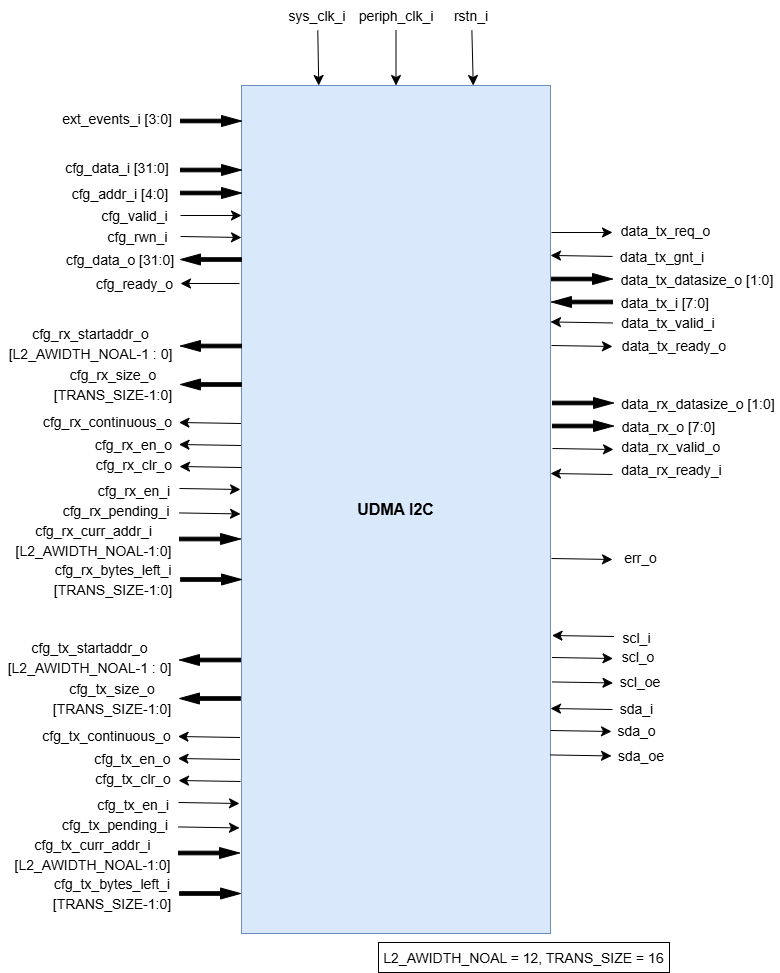

..
   Copyright (c) 2023 OpenHW Group

   SPDX-License-Identifier: Apache-2.0 WITH SHL-2.1

.. Level 1
   =======

   Level 2
   -------

   Level 3
   ~~~~~~~

   Level 4
   ^^^^^^^

.. _udram_i2cm:

UDMA I2C Master
===============
I²C (Inter-Integrated Circuit) is a multi-master, multi-slave, single-ended serial bus developed by Philips Semiconductor (now NXP Semiconductors), commonly used to connect lower-speed peripheral ICs to processors and microcontrollers.
CORE-V-MCU CV32E40P (v1.0.0) has two I2C instances.

Features
-------------------

- Operates with two bi-directional open-drain lines; a Serial Data Line (SDA) and a Serial Clock Line (SCL), both pulled up with resistors.
- Supports 7-bit or 10-bit address space, depending on the device.
- Common bus speeds include 100 kbit/s (Standard mode) and 10 kbit/s (Low speed mode). Arbitrarily low clock frequencies are also allowed.

Architecture
-------------------

uDMA I2C is a peripheral function of the uDMA subsystem. As such, its CSRs are not directly accessible via the APB bus.
Rather, the control plane interface to the uDMA I2C is managed by the uDMA core within the uDMA subsystem.
This is transparent to the programmer as all uDMA I2C CSRs appear within the uDMA Subsystem's memory region.
As is the case for all uDMA subsystem peripherals, I/O operations are controlled by the uDMA core. This is not transparent to the programmer.

The figure below is the high-level block diagram of the uDMA I2C:-

.. figure:: udma_i2c_block_diagram.png
   :name: uDMA I2C Block Diagram
   :align: center
   :alt: 

   uDMA I2C Block Diagram

uDMA I2C uses the Tx channel interface to read the data from the interleaved (L2) memory via the uDMA Core. It transmits the read data to the external device. uDMA I2C uses the Rx channel interface to store the data received from the external device in interleaved (L2) memory.
Refer to `uDMA subsystem <https://github.com/openhwgroup/core-v-mcu/blob/master/docs/doc-src/udma_subsystem.rst>`_ for more information about the Tx and Rx channel functionality of uDMA Core.

Dual clock FIFO
~~~~~~~~~~~~~~~
The uDMA core operates using the system clock, while the uDMA I2C operates using both the system clock and the peripheral clock.
To ensure the uDMA I2C and core are properly synchronized, dual-clock FIFOs are used in the uDMA I2C. These are 4-depth FIFOs and can store 8-bit wide data.
It is implemented using circular FIFO.

Below diagram shows the interfaces of DC FIFO:

.. figure:: uDMA_I2C_Dual_clock_fifo.png
   :name: uDMA_I2C_Dual_clock_fifo
   :align: center
   :alt:

   Dual clock FIFO

For Rx operation, source(src_*) interfaces shown in above diagram operate at peripheral clock and destination(dst_*) interfaces operate using system clock.

For Tx operation, source interfaces shown in above diagram operate at system clock and destination interfaces operate using peripheral clock. 

**Pop operation**

The DC FIFO asserts the dst_valid_o (valid) signal to indicate that valid data is available on the data lines. A module waiting for data should read the data lines only when valid pin is high and drive the dst_ready_i (ready)
signal to high and reset it in next clock cycle. When DC FIFO receives an active ready signal, indicating that the data has been read, it updates the data lines with new data if FIFO is not empty. 
If the FIFO is empty, the dst_valid_o signal is deasserted.

**Push operation**

The DC FIFO asserts the src_ready_o (ready) signal when there is available space to accept incoming data. When an active src_valid_i (valid) signal is received, the data is written into the FIFO.
The src_ready_o signal is kept asserted as long as the FIFO has space for more data. IF the DC FIFO is full, push operation will be stalled until the FIFO has empty space and valid line is high.
A module tranmitting the data to DC FIFO should drive the valid signal low to indicate data lines should not be read.

During I2C transmit (Tx) operation, the TX DC FIFO is read internally by the I2C to transmit data to an external device and written by the TX FIFO.
During I2C receive (Rx) operation, the RX DC FIFO is written internally by the I2C with the data received from the external device and read by the uDMA core.

TX FIFO
^^^^^^^

uDMA I2C has a TX FIFO to store the received data from uDMA core. It forwards the data read from L2 memory to the TX DC FIFO. uDMA I2C on TX path, read the data from TX DC FIFO and transmits it to external device.
It is a 2-depth FIFO and can store 8-bit wide data. Below diagram shows the interfaces of TX FIFO: 

   TX FIFO

TX FIFO operates using system clock. clr_i pin is hardcoded with value 0x0.

**Pop operation**

The read interface of the TX FIFO is connected to the TX DC FIFO.
The TX DC FIFO raises ready(ready_i) signal if its FIFO has space. If data is available, TX FIFO asserts the valid_o signal and update the data lines with data.
TX FIFO will update the valid signal and data lines at each clock cycle. If the ready signal is high, data lines will be update with new data, otherwise, data lines will show the last transferred byte.
If the TX FIFO is empty, the valid_o signal remains deasserted, indicating that no valid data is present on the output lines.

**Push operation**

The write interface of the TX FIFO is extended to uDMA Core. TX FIFO write operation is performed with the help of req(req_o) and ready(ready_o) signal.
The TX FIFO keeps the ready_o (ready) signal high until the TX FIFO is full. TX FIFO raises a req_o signal when it has enough space in FIFO i.e. ready_o is high, and the pending requests at uDMA core does not exceed the depth of TX FIFO.
TX FIFO recieves a gnt(gnt_i) signal from the uDMA core confirming that the request is accepted. When it recieves the valid signal from uDMA core and the FIFO is not full, TX FIFO pushes the data coming from uDMA core.
TX tries to read data at each clock cycle until TX FIFO has space and valid pin is high.

TX Operation
~~~~~~~~~~~~

To transmit data to an external I2C device, the uDMA I2C must be configured using the TX_SADDR, TX_SIZE and TX_CFG control registers.
Following steps are performed to read the transmit data from L2 memory: -

**Read data into TX FIFO from L2 memory**

To initiate a read operation from L2 memory, the TX FIFO asserts both the READY and REQ signals to the uDMA core, indicating its readiness to receive data. A high READY signal signifies that the
TX FIFO has available space, while a high REQ signal confirms that the FIFO can accept data from the uDMA core and that the number of pending transactions does not exceed its capacity. The TX FIFO
internally maintains a counter to track unserved transactions from the core.

Upon receiving the REQ signal and if the I2C TX channel is enabled, the uDMA core initiates arbitration. If the I2C TX channel wins arbitration, the core issues a GNT (grant) signal to the uDMA I2C.
Once data is successfully read from L2 memory, the uDMA core asserts a VALID signal along with the data for transmission to the I2C.

The uDMA I2C writes this data into the TX FIFO and keeps the READY and REQ signals asserted as long as the aforementioned conditions remain valid. The uDMA core deasserts the VALID signal in the following
clock cycle and reasserts it only when new data is available for transmission. Since tha FIFO is initially empty, both READY and REQ signal are asserted at power up.

**Read data into TX DC FIFO from TX FIFO**

To read data from TX FIFO, TX DC FIFO will assert the ready signal. TX FIFO, when it has data, asserts the valid signal and update the data lines of DC FIFO with the valid data. Valid signal will keep asserted until TX FIFO has data.
The data transmission from TX FIFO to DC FIFO is synchronized using system clock. TX DC FIFO will deassert the ready signal when it is full. TX FIFO will only update the data lines with valid data when it has data available is FIFO and the ready signal is high.

**Read data from DC TX FIFO**

When the valid signal is enabled, I2C will read the data from DC TX FIFO into its local variable. The uDMA I2C will raise ready signal to TX DC FIFO indicating that it can accept more data.
In the next clock cycle, the TX DC FIFO checks whether it has data or not and raises a valid signal and udpate data lines accordingly. The uDMA I2C deasserts the READY signal and starts processing the data(store in local variable).

The uDMA I2C decodes the received data, which includes both command instructions and the actual data to be transferred (e.g., refer to the read/write command sequence example below), and processes it accordingly.

The command may be either **write-to-slave** or **read-from-slave** commands:
- For a *write* command, the data following the write instruction is transmitted to the external device over the I2C bus.
- For a *read* command, I2C reads the data from the external device over the I2C bus and stored in the internal RX DC FIFO, from where it can be retrieved later by the uDMA core.

After each byte is decoded and processed, and if valid signal is still asserted, I2C will again read the data from DC TX FIFO to its local variable and perform the aforementioned steps. The data read operation of Tx component from uDMA UART is synchronized using peripheral clock.

RX Operation
~~~~~~~~~~~~
To read the data from an external device into I2C's internal RX DC FIFO, a TX operation must be performed to issue a *read instruction*, as explained above.

To transmit the data received from the external device to L2 memory, the uDMA I2C must be configured using the RX_SADDR, RX_SIZE and RX_CFG control registers.

Once the data is read from the external device, I2C pushes it to the RX DC FIFO and asserts the VALID signal. This valid signal is propogated to the uDMA core.

Upon detectnig the valid signal, the uDMA core initiates arbitration. If the uDMA I2C channel wins the arbitration and the core’s RX FIFO has sufficient space to accommodate the incoming data, it read the data from the RX DC FIFO and asserts a ready signal back to the I2C indicating data is read.
After receiving ready signal RX DC FIFO will update the valid and data pin with new value. In the next clock cycle uDMA Core will deassert the ready pin. 

Theory of Operation
-------------------

I2C defines basic types of messages, each of which begins with a START and ends with a STOP:

- Single message where a master writes data to a slave;
- Single message where a master reads data from a slave;
- Combined messages, where a master issues at least two reads and/or writes to one or more slaves.

All I2C transfers could be splitted in a reduced number of bus accesses types, those are:
- Start Bit
- Send Byte and get acknowledge
- Get Byte and send acknowledge
- Get Byte and send not acknowledge
- Stop Bit

With different combinations of the above, we can create any type of I2C transfer.
Under those conditions, the I2C IP interface is updated to fetch command from L2 memory instead of just transferring data.
In this way we can recreate complex I2C transfer fully autonomously and without any intervention of the CPU.

I2C controller state machine
----------------------------

I2C Master controller operates through disctinct states, each handling a specific part of I2C transaction process:

- ``I2C_ST_WAIT_FOR_CMD`` :- Also known as the *idle* state. Initially, the controller starts here and waits for commands. Based on the received command, it transitions to the corresponding operational state. 
- ``I2C_ST_WAIT``:- Holds the controller in a delay state for a specified number of cycles before returning to *idle* state.
- ``I2C_ST_WAIT_EV``:- Waits for one of the external events to be triggered. Upon receiving the specified events, it transitions back to *idle* state.
- ``I2C_ST_REPEAT``: stores the repeat count, indicating how many times the next applicable command should to be repeated.
- ``I2C_ST_WRTIE``:- Starts a new I2C transfer by sending the slave address on the bus. It also determines the direction of data transfer (read or write). 
- ``I2C_ST_GET_DATA``:- Reads data from the slave and sends ACK or NACK after each byte based on the command received. If in repeat mode, it continues this operation for the specified number of bytes and stores the read data into its internal RX FIFO.
- ``I2C_ST_SEND_DATA``: Sends data bytes to the slave and waits for an acknowledgment (ACK) after each transmission. If in repeat mode, it continues this operation for the specified number of bytes. The data to be written is taken from the internal TX FIFO.
- ``I2C_ST_STOP``:- Sends a STOP condition on the I2C bus, signaling the end of current transaction. Once completed, it returns to *idle* state.

System Architecture
-------------------

The figure below shows how the uDMA I2C interfaces with the rest of the CORE-V-MCU components and the external I2C Slave device:-

   uDMA I2C CORE-V-MCU Connection Diagram

Programming Model
-----------------
As with most peripherals in the uDMA Subsystem, software configuration can be conceptualized into three functions:

1. Configure the I/O parameters.
2. Configure the uDMA data control parameters.
3. Manage the data transfer operation.

uDMA I2C Master I/O Parameters
~~~~~~~~~~~~~~~~~~~~~~~~~~~~~~
The actions of the uDMA I2C master are controlled using a sequence of commands that are written to the transmit buffer.
Using the uDMA I2C master involves writting the appropriate sequence of commands to the Tx buffer, and using the uDMA to send the buffer to the I2C contoller.

A list of the available commands and their encoding is shown in the Table below.

+--------------+-----------------+-------------------------------------------------------------------------+
| Encoding     | Command Name    | Command Description                                                     |
+==============+=================+=========================================================================+
| 0x00         | I2C_CMD_START   | Signals a start bit on the I2C bus                                      |
+--------------+-----------------+-------------------------------------------------------------------------+
| 0x10         | I2C_WAIT_EV     | TBC: Inject wait states of data[1:0] in command buffer is non-zero      |
+--------------+-----------------+-------------------------------------------------------------------------+
| 0x20         | I2C_CMD_STOP    | Signals a stop bit on the I2C bus                                       |
+--------------+-----------------+-------------------------------------------------------------------------+
| 0x40         | I2C_CMD_RD_ACK  | Receives 1 byte and sends 1 acknowledge                                 |
+--------------+-----------------+-------------------------------------------------------------------------+
| 0x60         | I2C_CMD_RD_NACK | Receives 1 byte and sends 1 negative acknowledge                        |
+--------------+-----------------+-------------------------------------------------------------------------+
| 0x80         | I2C_CMD_WR      | Sends 1 byte and wait for acknowledge                                   |
+--------------+-----------------+-------------------------------------------------------------------------+
| 0xA0         | I2C_CMD_WAIT    | The following byte indicates number of I2C cycles to wait               |
+--------------+-----------------+-------------------------------------------------------------------------+
| 0xC0         | I2C_CMD_RPT     | The following byte indicates number of times to repeat next instruction |
+--------------+-----------------+-------------------------------------------------------------------------+
| 0xE0         | I2C_CMD_CFG     | Next two bytes are the MSB and LSB of the clock divider                 |
+--------------+-----------------+-------------------------------------------------------------------------+

uDMA I2C Master Data Control
~~~~~~~~~~~~~~~~~~~~~~~~~~~~

Eg: Command Sequence (Write and Read Operation)
^^^^^^^^^^^^^^^^^^^^^^^^^^^^^^^^^^^^^^^^^^^^^^^

Consider the below command sequence of write and read operations to/from external devices connected to I2C bus. These commands are stored in the interleaved memory.
When the Tx channel is enabled, the uDMA core transfers these commands to the uDMA I2C internal Tx buffer. Upon receiving the data, the I2C controller processes these
commands as described below:

+-----------------+--------------------------+-------------------------------------+
| Command Issued  | Command Data             | Comment                             |
+=================+==========================+=====================================+
| I2C_CMD_START   |                          | Start the transfer                  |
+-----------------+--------------------------+-------------------------------------+
| I2C_CMD_WR      | 0xA4                     | First byte: write to addr=0x52      |
+-----------------+--------------------------+-------------------------------------+
| I2C_CMD_RPT     | 0x10                     | Repeat 16 times                     |
+-----------------+--------------------------+-------------------------------------+
| I2C_CMD_WR      | 0x00, 0x01, 0x02, 0x3    |                                     |
+-----------------+--------------------------+-------------------------------------+
|                 | 0x04, 0x05, 0x06, 0x7    |                                     |
+-----------------+--------------------------+-------------------------------------+
|                 | 0x08, 0x09, 0x0A, 0xB    |                                     |
+-----------------+--------------------------+-------------------------------------+
|                 | 0x0C, 0x0D, 0x0E, 0xF    |                                     |
+-----------------+--------------------------+-------------------------------------+
| I2C_CMD_STOP    |                          | Generate stop bits and end transfer |
+-----------------+--------------------------+-------------------------------------+
| I2C_CMD_WAIT    | 0x10                     | Wait 16 I2C cycles                  |
+-----------------+--------------------------+-------------------------------------+
| I2C_CMD_START   |                          | Start the next transfer             |
+-----------------+--------------------------+-------------------------------------+
| I2C_CMD_WR      | 0xA5                     | First byte: read from addr=0x52     |
+-----------------+--------------------------+-------------------------------------+
| I2C_CMD_RPT     | 0x0F                     | Repeat 15 times                     |
+-----------------+--------------------------+-------------------------------------+
| I2C_CMD_RD_ACK  |                          |                                     |
+-----------------+--------------------------+-------------------------------------+
| I2C_CMD_RD_NACK |                          |                                     |
+-----------------+--------------------------+-------------------------------------+
| I2C_CMD_STOP    |                          | We're done!                         |
+-----------------+--------------------------+-------------------------------------+

- Transfer begins with **I2C_CMD_START** command, which generates a start bit on the bus.
- The first byte sent following the I2C standard **I2C_CMD_WR** is 0xA4. This byte includes a 7-bit address (i.e., bits 1-7 of 0xA4) and 1-bit access type (i.e., bit 0 of 0xA4, where 0 - Write, 1 - read).
  Here 0xA4 is 8'b1010_0100, indicating a write operation to the address 7'b1010010 (i.e., 0x52).
- The byte following the instrustion **I2C_CMD_RPT** is 0x10, tells the number of times the next instruction has to be executed.
- The next instruction **I2C_CMD_WR** is repeated 16 bytes and the data for each write instruction is queued. the 16 bytes of data to be written are: 0x00, 0x01, 0x02, ...0x0F.
- **I2C_CMD_STOP** generates the stop bits and ends the transfer.
- **I2C_CMD_WAIT** waits fro a defined number of I2C cycles (16 in this case) and after which **I2C_CMD_START** initiates a new I2C transfer.
- The next command is a read from the same address. 0xA5 is sent, which corresponds to read from address 0x52 (same 7-bit address, with the LSB set to 1 for read).
- The following **I2C_CMD_RPT** command repreats the **I2C_CMD_RD_ACK**, 15 times - this reads 15 bytes of data, sending an acknowledgment (ACK) after each byte.
- The next command **I2C_CMD_RD_NACK**, reads the last byte and sends a not acknowledge (NACK) to signal the end of read operation.
- **I2C_CMD_STOP** generates the stop bit and completes the transfer

All the commands/data are fetched through the Tx port from L2 memory into I2C Tx buffer, while the incoming read data is pushed into I2C Rx buffer.

Data Transfer Operation
~~~~~~~~~~~~~~~~~~~~~~~

UDMA I2CM CSRs
--------------
Refer to `Memory Map <https://github.com/openhwgroup/core-v-mcu/blob/master/docs/doc-src/mmap.rst>`_ for peripheral domain address of the uDMA I2C0 and uDMA I2C1.

**NOTE:** Several of the uDMA I2C CSR are volatile, meaning that their read value may be changed by the hardware.
For example, writing to *RX_SADDR* CSR will set the address of the receive buffer pointer.
As data is received, the hardware will update the value of the pointer to indicate the current address.
As the name suggests, the value of non-volatile CSRs is not changed by the hardware.
These CSRs retain the last value written by software.

A CSRs volatility is indicated by its "type".

Details of CSR access type are explained `here <https://docs.openhwgroup.org/projects/core-v-mcu/doc-src/mmap.html#csr-access-types>`_ .

The CSR's RX_SADDR, RX_SIZE specifies the configuration for the transaction on the RX channel. The CSR's TX_SADDR, TX_SIZE specify the configuration for the transaction on the TX channel. The uDMA Core creates a local copy of this information at its end and use it for current ongoing transaction.

RX_SADDR
~~~~~~~~
- Offset: 0x0
- Type  : Volatile

+------------+-------+------+------------+-------------------------------------------------------------------------------------------------------------+
| Field      |  Bits | Type | Default    | Description                                                                                                 |
+============+=======+======+============+=============================================================================================================+
| SADDR      |  11:0 |   RW |    0x0     | Address of Rx buffer on write. This is the address of L2 memory where I2C will write the received data.     |
|            |       |      |            | Read & write to this CSR access different information.                                                      |
|            |       |      |            |                                                                                                             | 
|            |       |      |            | **On Write**: Address of Rx buffer for next transaction. It does not impact current ongoing transaction.    |
|            |       |      |            |                                                                                                             |
|            |       |      |            | **On Read**: Address of Rx buffer for the current ongoing transaction. This is the local copy of information|
|            |       |      |            | maintained inside the uDMA Core.                                                                            |
+------------+-------+------+------------+-------------------------------------------------------------------------------------------------------------+

RX_SIZE
~~~~~~~
- Offset: 0x04
- Type  : Volatile

+------------+-------+------+------------+-------------------------------------------------------------------------------------------------------------+
| Field      |  Bits | Type | Default    | Description                                                                                                 |
+============+=======+======+============+=============================================================================================================+
| SIZE       |  15:0 |   RW |    0x0     | Size of Rx buffer (amount of data to be transferred by I2C to L2 memory). Read & write to this CSR          |
|            |       |      |            | access different information.                                                                               |
|            |       |      |            |                                                                                                             | 
|            |       |      |            | **On Write**: Size of Rx buffer for next transaction. It does not impact current ongoing transaction.       |
|            |       |      |            |                                                                                                             | 
|            |       |      |            | **On Read**: Bytes left for the current ongoing transaction i.e., bytes left to write to L2 memory.         |
|            |       |      |            | This is the local copy of information maintained inside the uDMA Core.                                      |
+------------+-------+------+------------+-------------------------------------------------------------------------------------------------------------+

RX_CFG
~~~~~~
- Offset: 0x08
- Type  : Volatile

+------------+-------+------+------------+-------------------------------------------------------------------------------------------------------------+
| Field      |  Bits | Type | Default    | Description                                                                                                 |
+============+=======+======+============+=============================================================================================================+
| CLR        |   6:6 |   WO |    0x0     | Clear the receive channel                                                                                   |
+------------+-------+------+------------+-------------------------------------------------------------------------------------------------------------+
| PENDING    |   5:5 |   RO |    0x0     | Receive transaction is pending                                                                              |
+------------+-------+------+------------+-------------------------------------------------------------------------------------------------------------+
| EN         |   4:4 |   RW |    0x0     | Enable the receive channel                                                                                  |
+------------+-------+------+------------+-------------------------------------------------------------------------------------------------------------+
| CONTINUOUS |   0:0 |   RW |    0x0     | 0x0: stop after last transfer for channel                                                                   |
|            |       |      |            |                                                                                                             | 
|            |       |      |            | 0x1: after last transfer for channel, reload buffer size and start address and restart channel              | 
+------------+-------+------+------------+-------------------------------------------------------------------------------------------------------------+

TX_SADDR
~~~~~~~~
- Offset: 0x10
- Type  : Volatile

+------------+-------+------+------------+-------------------------------------------------------------------------------------------------------------+
| Field      |  Bits | Type | Default    | Description                                                                                                 |
+============+=======+======+============+=============================================================================================================+
| SADDR      |  11:0 |   RW |   0x0      | Address of Tx buffer on write. This is the address of L2 memory from where I2C will read the data to        |
|            |       |      |            | transmit. Read & write to this CSR access different information.                                            |
|            |       |      |            |                                                                                                             | 
|            |       |      |            | **On Write**: Address of Tx buffer for next transaction. It does not impact current ongoing transaction.    |
|            |       |      |            |                                                                                                             | 
|            |       |      |            | **On Read**: Address of Tx buffer for the current ongoing transaction. This is the local copy of information|
|            |       |      |            | maintained inside the uDMA Core.                                                                            |
+------------+-------+------+------------+-------------------------------------------------------------------------------------------------------------+

TX_SIZE
~~~~~~~
- Offset: 0x14
- Type  : Volatile

+------------+-------+------+------------+-------------------------------------------------------------------------------------------------------------+
| Field      |  Bits | Type | Default    | Description                                                                                                 |
+============+=======+======+============+=============================================================================================================+
| SIZE       |  15:0 |   RW |   0x0      | Size of Tx buffer (amount of data to be read by I2C from L2 memory). Read & write to this CSR access        |
|            |       |      |            | different information.                                                                                      |
|            |       |      |            |                                                                                                             | 
|            |       |      |            | **On Write**: Size of Tx buffer for next transaction. It does not impact current ongoing transaction.       |
|            |       |      |            |                                                                                                             | 
|            |       |      |            | **On Read**: Bytes left for the current ongoing transaction i.e., bytes left to read from L2 memory.        |
|            |       |      |            | This is the local copy of information maintained inside the uDMA Core.                                      |
+------------+-------+------+------------+-------------------------------------------------------------------------------------------------------------+

TX_CFG
~~~~~~
- Offset: 0x18
- Type  : Volatile

+------------+-------+------+------------+-------------------------------------------------------------------------------------------------------------+
| Field      |  Bits | Type | Default    | Description                                                                                                 |
+============+=======+======+============+=============================================================================================================+
| CLR        |   6:6 |   WO |    0x0     | Clear the transmit channel                                                                                  |
+------------+-------+------+------------+-------------------------------------------------------------------------------------------------------------+
| PENDING    |   5:5 |   RO |    0x0     | Transmit transaction is pending                                                                             |
+------------+-------+------+------------+-------------------------------------------------------------------------------------------------------------+
| EN         |   4:4 |   RW |    0x0     | Enable the transmit channel                                                                                 |
+------------+-------+------+------------+-------------------------------------------------------------------------------------------------------------+
| CONTINUOUS |   0:0 |   RW |    0x0     | 0x0: stop after last transfer for channel                                                                   |
|            |       |      |            |                                                                                                             | 
|            |       |      |            | 0x1: after last transfer for channel, reload buffer size and start address and restart channel              |
+------------+-------+------+------------+-------------------------------------------------------------------------------------------------------------+

STATUS
~~~~~~
- Offset: 0x20
- Type  : Volatile

+------------+-------+------+------------+-------------------------------------------------------------+
| Field      |  Bits | Type | Default    | Description                                                 |
+============+=======+======+============+=============================================================+
| AL         |   1:1 |   RO |   0x0      | Always returns 0                                            |
+------------+-------+------+------------+-------------------------------------------------------------+
| BUSY       |   0:0 |   RO |   0x0      | Always returns 0                                            |
+------------+-------+------+------------+-------------------------------------------------------------+

SETUP
~~~~~
- Offset: 0x24
- Type  : Volatile

+------------+-------+------+------------+-------------------------------------------------------------+
| Field      |  Bits | Type | Default    | Description                                                 |
+============+=======+======+============+=============================================================+
| RESET      |   0:0 |   RW |    0x0     | Reset I2C controller                                        |
+------------+-------+------+------------+-------------------------------------------------------------+

Firmware Guidelines
-------------------

Clock Enable, Rest uDMA I2C
~~~~~~~~~~~~~~~~~~~~~~~~~~~
- Configure the uDMA Core's PERIPH_CLK_ENABLE CSR to enable uDMA I2C's peripheral clock.
- Set the uDMA Core's PERIPH_RESET CSR to issue a soft reset signal to uDMA I2C. 

Tx Operation (Read from L2 memory)
~~~~~~~~~~~~~~~~~~~~~~~~~~~~~~~~~~
- Configure the uDMA I2C's TX_SADDR CSR with an interleaved(L2) memory address. I2C will read the data from this memory address. 
- Set the uDMA I2C's TX_SIZE CSR to specify the amount of data (in bytes) to be transferred/read from the L2 memory address provided in TX_SADDR.
- Configure uDMA I2C's TX_CFG CSR to enable the Tx channel, which allows the Tx channel to start reading data.
- The completion of the Tx operation can be determined by reading the TX_SIZE CSR. A value of 0 indicates that there are no pending bytes remaining for transfer.

Rx Operation (Write to L2 memory)
~~~~~~~~~~~~~~~~~~~~~~~~~~~~~~~~~
- Configure the uDMA I2C's RX_SADDR CSR with an interleaved(L2) memory address. I2C will write the data to this memory address. 
- Set the uDMA I2C's RX_SIZE CSR to specify the amount of data (in bytes) to be transferred/written to the L2 memory address provided in RX_SADDR.
- Configure uDMA I2C's RX_CFG CSR to enable the Rx channel, which allows the Rx channel to start writing the data.
- The completion of the Rx operation can be determined by reading the RX_SIZE CSR. A value of 0 indicates that there are no pending bytes remaining for transfer.

Pin Diagram
-----------
The figure below is the pin diagram of the uDMA I2C

   **uDMA I2C Pin Diagram**

Below is the categorization of the pins:

Tx Channel Interface
~~~~~~~~~~~~~~~~~~~~
The following pins constitute the Tx channel interface of uDMA I2C. These pins are used to read the data from interleaved (L2) memory:

- ``data_tx_req_o``: Read request signal.
- ``data_tx_gnt_i``: Read grant signal.
- ``data_tx_datasize_o [1:0]``:  Data size for Tx channel.
- ``data_tx_i [7:0]``: Data input for Tx channel.
- ``data_tx_valid_i``: Valid data input signal.
- ``data_tx_ready_o``: Tx ready output signal.

Rx Channel Interface
~~~~~~~~~~~~~~~~~~~~
The following pins constitute the Rx channel interface of uDMA I2C. These pins are used to write the data to interleaved (L2) memory:

- ``data_rx_datasize_o [1:0]``: Data size for Rx channel.
- ``data_rx_o [7:0]``: Data output for Rx channel.
- ``data_rx_valid_o``: Valid data output signal.
- ``data_rx_ready_i``: Rx ready input signal.

uDMA I2C interface to get/send data from/to external device
~~~~~~~~~~~~~~~~~~~~~~~~~~~~~~~~~~~~~~~~~~~~~~~~~~~~~~~~~~~
- ``scl_i``: I2C clock input signal.
- ``scl_o``: I2C clock output signal.
- ``scl_oe``: Output enable for clock line.
- ``sda_i``: I2C data input signal.
- ``sda_o``: I2C data output.
- ``sda_oe``: Output enable for data line

uDMA I2C interface to read-write CSRs
~~~~~~~~~~~~~~~~~~~~~~~~~~~~~~~~~~~~~
The following interfaces are used to read and write to I2C CSRs. These interfaces are managed by uDMA Core.

- ``cfg_data_i [31:0]``: APB Write data.
- ``cfg_addr_i [4:0]``: APB Address.
- ``cfg_valid_i``: APB data valid signal.
- ``cfg_rwn_i``: APB read or write signal.
- ``cfg_data_o [31:0]``: APB read data output.
- ``cfg_ready_o``: APB ready signal.

uDMA I2C Tx channel configuration interface
~~~~~~~~~~~~~~~~~~~~~~~~~~~~~~~~~~~~~~~~~~~
uDMA I2C uses these pins to share TX_SADDR, TX_SIZE and TX_CFG CSR details with core:

- ``cfg_tx_startaddr_o``: Start address configuration output.
- ``cfg_tx_size_o``: Transfer size configuration output.
- ``cfg_tx_continuous_o``: Continuous transfer mode enable signal.
- ``cfg_tx_en_o``: Tx channel enable configuration output.
- ``cfg_tx_clr_o``: Clear config signal for Tx.

uDMA I2C shares the values of the below pins as read values of TX_SADDR, TX_SIZE and TX_CFG CSR:

- ``cfg_tx_en_i``: Enable signal for Tx channel.
- ``cfg_tx_pending_i``: Tx pending status input.
- ``cfg_tx_curr_addr_i``: Current address being written to.
- ``cfg_tx_bytes_left_i``: Bytes remaining to transmit.

uDMA I2C Rx channel configuration interface
~~~~~~~~~~~~~~~~~~~~~~~~~~~~~~~~~~~~~~~~~~~
uDMA I2C uses these pins to share RX_SADDR, RX_SIZE and RX_CFG CSR details with core:

- ``cfg_rx_startaddr_o``: Start address configuration output.
- ``cfg_rx_size_o``: Transfer size configuration output.
- ``cfg_rx_continuous_o``: Continuous transfer mode enable signal.
- ``cfg_rx_en_o``: Rx channel enable configuration output.
- ``cfg_rx_clr_o``: Clear config signal for Rx.

uDMA I2C shares the values of the below pins as read values of RX_SADDR, RX_SIZE and RX_CFG CSR:

- ``cfg_rx_en_i``: Enable signal for Rx channel.
- ``cfg_rx_pending_i``: rx pending status input.
- ``cfg_rx_curr_addr_i``: Current address being read from.
- ``cfg_rx_bytes_left_i``: Bytes remaining to left.

Clock interface
~~~~~~~~~~~~~~~
These pins are used to synchronize I2C with uDMA core.

- ``sys_clk_i``: System clock.
- ``periph_clk_i``: Peripheral clock.

Reset interface
~~~~~~~~~~~~~~~
uDMA core issues reset signal to I2C via this pin.

- ``rstn_i``: soft reset signal enabled through the uDMA core CSR.

External events
~~~~~~~~~~~~~~~
uDMA core triggers these events based on specific conditions. The I2C will only wait for these events when I2C_WAIT_EV command is issued.

- ``ext_events_i [3:0]``: Input external events.

uDMA I2C interface to generate error
~~~~~~~~~~~~~~~~~~~~~~~~~~~~~~~~~~~~
- err_o

``**Note**:: Currently, no details are provided for this pin.``