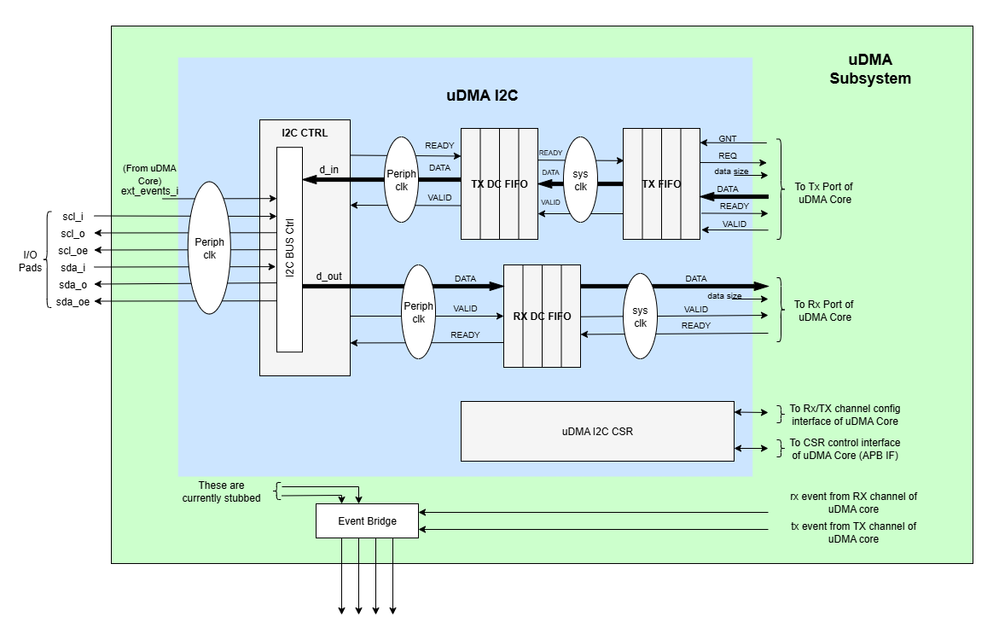

..
   Copyright (c) 2023 OpenHW Group

   SPDX-License-Identifier: Apache-2.0 WITH SHL-2.1

.. Level 1
   =======

   Level 2
   -------

   Level 3
   ~~~~~~~

   Level 4
   ^^^^^^^

.. _udram_i2cm:

UDMA I2C Master
===============
I²C (Inter-Integrated Circuit) is a multi-master, multi-slave, single-ended serial bus developed by Philips Semiconductor (now NXP Semiconductors), commonly used to connect lower-speed peripheral ICs to processors and microcontrollers.
Core-V-MCU CV32E40P (v1.0.0) has two I2C instances.

Features
-------------------

- Operates with two bi-directional open-drain lines; a Serial Data Line (SDA) and a Serial Clock Line (SCL), both pulled up with resistors.
- Supports 7-bit or 10-bit address space, depending on the device.
- Common bus speeds include 100 kbit/s (Standard mode) and 10 kbit/s (Low speed mode). Arbitrarily low clock frequencies are also allowed.

Architecture
-------------------

uDMA I2C is a peripheral function of the uDMA subsystem. As such, its CSRs are not directly accessible via the APB bus.
Rather, the control plane interface to the uDMA I2C is managed by the uDMA core within the uDMA subsystem.
This is transparent to the programmer as all uDMA I2C CSRs appear within the uDMA Subsystem's memory region.
As is the case for all uDMA subsystem peripherals, I/O operations are controlled by the uDMA core. This is not transparent to the programmer.

The figure below is the high-level block diagram of the uDMA I2C:-

uDMA I2C uses the Tx channel interface to read the data from the interleaved (L2) memory via the uDMA Core. It transmits the read data to the external device. uDMA I2C uses the Rx channel interface to store the data received from the external device in interleaved (L2) memory.
Refer to `uDMA subsystem <https://github.com/openhwgroup/core-v-mcu/blob/master/docs/doc-src/udma_subsystem.rst>`_ for more information about the Tx and Rx channel functionality of uDMA Core.

Theory of Operation
-------------------

I2C defines basic types of messages, each of which begins with a START and ends with a STOP:

- Single message where a master writes data to a slave;
- Single message where a master reads data from a slave;
- Combined messages, where a master issues at least two reads and/or writes to one or more slaves.

All I2C transfers could be splitted in a reduced number of bus accesses types, those are:
- Start Bit
- Send Byte and get acknowledge
- Get Byte and send acknowledge
- Get Byte and send not acknowledge
- Stop Bit

With different combinations of the above, we can create any type of I2C transfer.
Under those conditions, the I2C IP interface is updated to fetch command from L2 memory instead of just transferring data.
In this way we can recreate complex I2C transfer fully autonomously and without any intervention of the CPU.

Programming Model
-----------------
As with most peripherals in the uDMA Subsystem, software configuration can be conceptualized into three functions:

1. Configure the I/O parameters.
2. Configure the uDMA data control parameters.
3. Manage the data transfer operation.

uDMA I2C Master I/O Parameters
~~~~~~~~~~~~~~~~~~~~~~~~~~~~~~
The actions of the uDMA I2C master are controlled using a sequence of commands that are written to the transmit buffer.
Using the uDMA I2C master involves writting the appropriate sequence of commands to the Tx buffer, and using the uDMA to send the buffer to the I2C contoller.

A list of the available commands and their encoding is shown in the Table below.

+--------------+-----------------+-------------------------------------------------------------------------+
| Encoding     | Command Name    | Command Description                                                     |
+==============+=================+=========================================================================+
| 0x00         | I2C_CMD_START   | Signals a start bit on the I2C bus                                      |
+--------------+-----------------+-------------------------------------------------------------------------+
| 0x10         | I2C_WAIT_EV     | TBC: Inject wait states of data[1:0] in command buffer is non-zero      |
+--------------+-----------------+-------------------------------------------------------------------------+
| 0x20         | I2C_CMD_STOP    | Signals a stop bit on the I2C bus                                       |
+--------------+-----------------+-------------------------------------------------------------------------+
| 0x40         | I2C_CMD_RD_ACK  | Receives 1 byte and sends 1 acknowledge                                 |
+--------------+-----------------+-------------------------------------------------------------------------+
| 0x60         | I2C_CMD_RD_NACK | Receives 1 byte and sends 1 negative acknowledge                        |
+--------------+-----------------+-------------------------------------------------------------------------+
| 0x80         | I2C_CMD_WR      | Sends 1 byte and wait for acknowledge                                   |
+--------------+-----------------+-------------------------------------------------------------------------+
| 0xA0         | I2C_CMD_WAIT    | The following byte indicates number of I2C cycles to wait               |
+--------------+-----------------+-------------------------------------------------------------------------+
| 0xC0         | I2C_CMD_RPT     | The following byte indicates number of times to repeat next instruction |
+--------------+-----------------+-------------------------------------------------------------------------+
| 0xE0         | I2C_CMD_CFG     | Next two bytes are the MSB and LSB of the clock divider                 |
+--------------+-----------------+-------------------------------------------------------------------------+

uDMA I2C Master Data Control
~~~~~~~~~~~~~~~~~~~~~~~~~~~~

Eg: Command Sequence (Write and Read Operation)
^^^^^^^^^^^^^^^^^^^^^^^^^^^^^^^^^^^^^^^^^^^^^^^

Consider the below command sequence of write and read operations to/from external devices connected to I2C bus. These commands are stored in the interleaved memory.
When the Tx channel is enabled, the uDMA core transfers these commands to the uDMA I2C internal Tx buffer. Upon receiving the data, the I2C controller processes these
commands as described below:

+-----------------+--------------------------+-------------------------------------+
| Command Issued  | Command Data             | Comment                             |
+=================+==========================+=====================================+
| I2C_CMD_START   |                          | Start the transfer                  |
+-----------------+--------------------------+-------------------------------------+
| I2C_CMD_WR      | 0xA4                     | First byte: write to addr=0x52      |
+-----------------+--------------------------+-------------------------------------+
| I2C_CMD_RPT     | 0x10                     | Repeat 16 times                     |
+-----------------+--------------------------+-------------------------------------+
| I2C_CMD_WR      | 0x00, 0x01, 0x02, 0x3    |                                     |
+-----------------+--------------------------+-------------------------------------+
|                 | 0x04, 0x05, 0x06, 0x7    |                                     |
+-----------------+--------------------------+-------------------------------------+
|                 | 0x08, 0x09, 0x0A, 0xB    |                                     |
+-----------------+--------------------------+-------------------------------------+
|                 | 0x0C, 0x0D, 0x0E, 0xF    |                                     |
+-----------------+--------------------------+-------------------------------------+
| I2C_CMD_STOP    |                          | Generate stop bits and end transfer |
+-----------------+--------------------------+-------------------------------------+
| I2C_CMD_WAIT    | 0x10                     | Wait 16 I2C cycles                  |
+-----------------+--------------------------+-------------------------------------+
| I2C_CMD_START   |                          | Start the next transfer             |
+-----------------+--------------------------+-------------------------------------+
| I2C_CMD_WR      | 0xA5                     | First byte: read from addr=0x52     |
+-----------------+--------------------------+-------------------------------------+
| I2C_CMD_RPT     | 0x0F                     | Repeat 15 times                     |
+-----------------+--------------------------+-------------------------------------+
| I2C_CMD_RD_ACK  |                          |                                     |
+-----------------+--------------------------+-------------------------------------+
| I2C_CMD_RD_NACK |                          |                                     |
+-----------------+--------------------------+-------------------------------------+
| I2C_CMD_STOP    |                          | We're done!                         |
+-----------------+--------------------------+-------------------------------------+

- Transfer begins with **I2C_CMD_START** command, which generates a start bit on the bus.
- The first byte sent following the I2C standard **I2C_CMD_WR** is 0xA4. This byte includes a 7-bit address (i.e., bits 1-7 of 0xA4) and 1-bit access type (i.e., bit 0 of 0xA4, where 0 - Write, 1 - read).
  Here 0xA4 is 8'b1010_0100, indicating a write operation to the address 7'b1010010 (i.e., 0x52).
- The byte following the instrustion **I2C_CMD_RPT** is 0x10, tells the number of times the next instruction has to be executed.
- The next instruction **I2C_CMD_WR** is repeated 16 bytes and the data for each write instruction is queued. the 16 bytes of data to be written are: 0x00, 0x01, 0x02, ...0x0F.
- **I2C_CMD_STOP** generates the stop bits and ends the transfer.
- **I2C_CMD_WAIT** waits fro a defined number of I2C cycles (16 in this case) and after which **I2C_CMD_START** initiates a new I2C transfer.
- The next command is a read from the same address. 0xA5 is sent, which corresponds to read from address 0x52 (same 7-bit address, with the LSB set to 1 for read).
- The following **I2C_CMD_RPT** command repreats the **I2C_CMD_RD_ACK**, 15 times - this reads 15 bytes of data, sending an acknowledgment (ACK) after each byte.
- The next command **I2C_CMD_RD_NACK**, reads the last byte and sends a not acknowledge (NACK) to signal the end of read operation.
- **I2C_CMD_STOP** generates the stop bit and completes the transfer

All the commands/data are fetched through the Tx port from L2 memory into I2C Tx buffer, while the incoming read data is pushed into I2C Rx buffer.

Data Transfer Operation
~~~~~~~~~~~~~~~~~~~~~~~

UDMA I2CM CSRs
--------------
Refer to `Memory Map <https://github.com/openhwgroup/core-v-mcu/blob/master/docs/doc-src/mmap.rst>`_ for peripheral domain address of the uDMA I2C0 and uDMA I2C1.

**NOTE:** Several of the uDMA I2C CSR are volatile, meaning that their read value may be changed by the hardware.
For example, writing to *RX_SADDR* CSR will set the address of the receive buffer pointer.
As data is received, the hardware will update the value of the pointer to indicate the current address.
As the name suggests, the value of non-volatile CSRs is not changed by the hardware.
These CSRs retain the last value written by software.

A CSRs volatility is indicated by its "type".

Details of Register access type are explained `here <https://docs.openhwgroup.org/projects/core-v-mcu/doc-src/mmap.html#csr-access-types>_`.

The registers RX_SADDR, RX_SIZE specifies the configuration for the transaction on the RX channel. The registers TX_SADDR, TX_SIZE specify the configuration for the transaction on the TX channel. The uDMA Core creates a local copy of this information at its end and use it for current ongoing transaction.

RX_SADDR offset = 0x00
~~~~~~~~~~~~~~~~~~~~~~
- Offset: 0x0
- Type  : Volatile

+------------+-------+------+------------+-------------------------------------------------------------------------------------------------------------+
| Field      |  Bits | Type | Default    | Description                                                                                                 |
+============+=======+======+============+=============================================================================================================+
| SADDR      |  11:0 |   RW |            | Address of Rx buffer on write. This is the address of L2 memory where I2C will write the received data.     |
|            |       |      |            | Read & write to this register access different information.                                                 |
|            |       |      |            | **On Write**: Address of Rx buffer for next transaction. It does not impact current ongoing transaction.    |
|            |       |      |            | **On Read**: Address of Rx buffer for the current ongoing transaction. This is the local copy of information|
|            |       |      |            | maintained inside the uDMA Core.                                                                            |
+------------+-------+------+------------+-------------------------------------------------------------------------------------------------------------+

RX_SIZE offset = 0x04
~~~~~~~~~~~~~~~~~~~~~
- Offset: 0x04
- Type  : Volatile

+------------+-------+------+------------+-------------------------------------------------------------------------------------------------------------+
| Field      |  Bits | Type | Default    | Description                                                                                                 |
+============+=======+======+============+=============================================================================================================+
| SIZE       |  15:0 |   RW |            | Size of Rx buffer (amount of data to be transferred by I2C to L2 memory). Read & write to this register     |
|            |       |      |            | access different information.                                                                               |
|            |       |      |            | **On Write**: Size of Rx buffer for next transaction. It does not impact current ongoing transaction.       |
|            |       |      |            | **On Read**: Bytes left for the current ongoing transaction i.e., bytes left to write to L2 memory.         |
|            |       |      |            | This is the local copy of information maintained inside the uDMA Core.                                      |
+------------+-------+------+------------+-------------------------------------------------------------------------------------------------------------+

RX_CFG offset = 0x08
~~~~~~~~~~~~~~~~~~~~
- Offset: 0x08
- Type  : Volatile

+------------+-------+------+------------+-------------------------------------------------------------------------------------------------------------+
| Field      |  Bits | Type | Default    | Description                                                                                                 |
+============+=======+======+============+=============================================================================================================+
| CLR        |   6:6 |   WO |            | Clear the receive channel                                                                                   |
+------------+-------+------+------------+-------------------------------------------------------------------------------------------------------------+
| PENDING    |   5:5 |   RO |            | Receive transaction is pending                                                                              |
+------------+-------+------+------------+-------------------------------------------------------------------------------------------------------------+
| EN         |   4:4 |   RW |            | Enable the receive channel                                                                                  |
+------------+-------+------+------------+-------------------------------------------------------------------------------------------------------------+
| CONTINUOUS |   0:0 |   RW |            | 0x0: stop after last transfer for channel                                                                   |
+------------+-------+------+------------+-------------------------------------------------------------------------------------------------------------+
|            |       |      |            | 0x1: after last transfer for channel, reload buffer size and start address and restart channel              |
+------------+-------+------+------------+-------------------------------------------------------------------------------------------------------------+

TX_SADDR offset = 0x10
~~~~~~~~~~~~~~~~~~~~~~
- Offset: 0x10
- Type  : Volatile

+------------+-------+------+------------+-------------------------------------------------------------------------------------------------------------+
| Field      |  Bits | Type | Default    | Description                                                                                                 |
+============+=======+======+============+=============================================================================================================+
| SADDR      |  11:0 |   RW |            | Address of Tx buffer on write. This is the address of L2 memory from where I2C will read the data to        |
|            |       |      |            | transmit. Read & write to this register access different information.                                       |
|            |       |      |            | **On Write**: Address of Tx buffer for next transaction. It does not impact current ongoing transaction.    |
|            |       |      |            | **On Read**: Address of Tx buffer for the current ongoing transaction. This is the local copy of information|
|            |       |      |            | maintained inside the uDMA Core.                                                                            |
+------------+-------+------+------------+-------------------------------------------------------------------------------------------------------------+

TX_SIZE offset = 0x14
~~~~~~~~~~~~~~~~~~~~~
- Offset: 0x14
- Type  : Volatile

+------------+-------+------+------------+-------------------------------------------------------------------------------------------------------------+
| Field      |  Bits | Type | Default    | Description                                                                                                 |
+============+=======+======+============+=============================================================================================================+
| SIZE       |  15:0 |   RW |            | Size of Tx buffer (amount of data to be read by I2C from L2 memory). Read & write to this register access   |
|            |       |      |            | different information.                                                                                      |
|            |       |      |            | **On Write**: Size of Tx buffer for next transaction. It does not impact current ongoing transaction.       |
|            |       |      |            | **On Read**: Bytes left for the current ongoing transaction i.e., bytes left to read from L2 memory.        |
|            |       |      |            | This is the local copy of information maintained inside the uDMA Core.                                      |
+------------+-------+------+------------+-------------------------------------------------------------------------------------------------------------+

TX_CFG offset = 0x18
~~~~~~~~~~~~~~~~~~~~
- Offset: 0x18
- Type  : Volatile

+------------+-------+------+------------+-------------------------------------------------------------------------------------------------------------+
| Field      |  Bits | Type | Default    | Description                                                                                                 |
+============+=======+======+============+=============================================================================================================+
| CLR        |   6:6 |   WO |            | Clear the transmit channel                                                                                  |
+------------+-------+------+------------+-------------------------------------------------------------------------------------------------------------+
| PENDING    |   5:5 |   RO |            | Transmit transaction is pending                                                                             |
+------------+-------+------+------------+-------------------------------------------------------------------------------------------------------------+
| EN         |   4:4 |   RW |            | Enable the transmit channel                                                                                 |
+------------+-------+------+------------+-------------------------------------------------------------------------------------------------------------+
| CONTINUOUS |   0:0 |   RW |            | 0x0: stop after last transfer for channel                                                                   |
+------------+-------+------+------------+-------------------------------------------------------------------------------------------------------------+
|            |       |      |            | 0x1: after last transfer for channel, reload buffer size and start address and restart channel              |
+------------+-------+------+------------+-------------------------------------------------------------------------------------------------------------+

STATUS offset = 0x20
~~~~~~~~~~~~~~~~~~~~
- Offset: 0x20
- Type  : Volatile

+------------+-------+------+------------+-------------------------------------------------------------+
| Field      |  Bits | Type | Default    | Description                                                 |
+============+=======+======+============+=============================================================+
| AL         |   1:1 |   RO |            | Always returns 0                                            |
+------------+-------+------+------------+-------------------------------------------------------------+
| BUSY       |   0:0 |   RO |            | Always returns 0                                            |
+------------+-------+------+------------+-------------------------------------------------------------+

SETUP offset = 0x24
~~~~~~~~~~~~~~~~~~~
- Offset: 0x24
- Type  : Volatile

+------------+-------+------+------------+-------------------------------------------------------------+
| Field      |  Bits | Type | Default    | Description                                                 |
+============+=======+======+============+=============================================================+
| RESET      |   0:0 |   RW |            | Reset I2C controller                                        |
+------------+-------+------+------------+-------------------------------------------------------------+

Firmware Guidelines
-------------------

Clock Enable, Rest uDMA I2C
~~~~~~~~~~~~~~~~~~~~~~~~~~~
- Configure the uDMA Core's PERIPH_CLK_ENABLE register to enable uDMA I2C's peripheral clock.
- Set the uDMA Core's PERIPH_RESET register to issue a soft reset signal to uDMA I2C. 

Tx Operation (Read from L2 memory)
~~~~~~~~~~~~~~~~~~~~~~~~~~~~~~~~~~
- Configure the uDMA I2C's TX_SADDR register with an interleaved(L2) memory address. I2C will read the data from this memory address. 
- Set the uDMA I2C's TX_SIZE register to specify the amount of data (in bytes) to be transferred/read from the L2 memory address provided in TX_SADDR.
- Configure uDMA I2C's TX_CFG register to enable the Tx channel, which allows the Tx channel to start reading data.

Rx Operation (Write to L2 memory)
~~~~~~~~~~~~~~~~~~~~~~~~~~~~~~~~~
- Configure the uDMA I2C's RX_SADDR register with an interleaved(L2) memory address. I2C will write the data to this memory address. 
- Set the uDMA I2C's RX_SIZE register to specify the amount of data (in bytes) to be transferred/written to the L2 memory address provided in RX_SADDR.
- Configure uDMA I2C's RX_CFG register to enable the Rx channel, which allows the Rx channel to start writing the data.

Pin Diagram
-----------
The figure below is the pin diagram of the uDMA I2C

.. figure:: udma_i2c_pin_diagram.png
   :name: uDMA I2C Pin Diagram
   :align: center
   :alt:

Below is the categorization of the pins:

Tx Channel Interface
~~~~~~~~~~~~~~~~~~~~
The following pins constitute the Tx channel interface of uDMA I2C. These pins are used to read the data from interleaved (L2) memory:

- data_tx_req_o
- data_tx_gnt_i
- data_tx_datasize_o [1:0]
- data_tx_i [7:0]
- data_tx_valid_i
- data_tx_ready_o

Rx Channel Interface
~~~~~~~~~~~~~~~~~~~~
The following pins constitute the Rx channel interface of uDMA I2C. These pins are used to write the data to interleaved (L2) memory:

- data_rx_datasize_o [1:0]
- data_rx_i [7:0]
- data_rx_valid_o
- data_rx_ready_i

uDMA I2C interface to get/send data from/to external device
~~~~~~~~~~~~~~~~~~~~~~~~~~~~~~~~~~~~~~~~~~~~~~~~~~~~~~~~~~~
- scl_i
- scl_o
- scl_oe
- sda_i
- sda_o
- sda_oe

uDMA I2C interface to read-write CSRs
~~~~~~~~~~~~~~~~~~~~~~~~~~~~~~~~~~~~~
The following interfaces are used to read and write to I2C CSRs. These interfaces are managed by uDMA Core.

- cfg_data_i [31:0]
- cfg_addr_i [4:0]
- cfg_valid_i
- cfg_rwn_i
- cfg_data_o [31:0]
- cfg_ready_o

uDMA I2C Tx channel configuration interface
~~~~~~~~~~~~~~~~~~~~~~~~~~~~~~~~~~~~~~~~~~~
uDMA I2C uses these pins to share TX_SADDR, TX_SIZE and TX_CFG register details with core:

- cfg_tx_startaddr_o
- cfg_tx_size_o
- cfg_tx_datasize_o
- cfg_tx_continuous_o
- cfg_tx_en_o
- fg_tx_clr_o

uDMA I2C shares the values of the below pins as read values of TX_SADDR, TX_SIZE and TX_CFG registers:

- cfg_tx_en_i
- cfg_tx_pending_i
- cfg_tx_curr_addr_i
- cfg_tx_bytes_left_i

uDMA I2C Rx channel configuration interface
~~~~~~~~~~~~~~~~~~~~~~~~~~~~~~~~~~~~~~~~~~~
uDMA I2C uses these pins to share RX_SADDR, RX_SIZE and RX_CFG register details with core:

- cfg_rx_startaddr_o
- cfg_rx_size_o
- cfg_rx_datasize_o
- cfg_rx_continuous_o
- cfg_rx_en_o
- cfg_rx_clr_o

uDMA I2C shares the values of the below pins as read values of RX_SADDR, RX_SIZE and RX_CFG registers:

- cfg_rx_en_i
- cfg_rx_pending_i
- cfg_rx_curr_addr_i
- cfg_rx_bytes_left_i

Clock interface
~~~~~~~~~~~~~~~
These pins are used to synchronize I2C with uDMA core.

- sys_clk_i
- periph_clk_i

Reset interface
~~~~~~~~~~~~~~~
uDMA core issues reset signal to I2C via this pin.

- rstn_i

External events
~~~~~~~~~~~~~~~
uDMA core triggers these events based on specific conditions. The I2C will only wait for these events when I2C_WAIT_EV command is issued.

- ext_events_i [3:0]

uDMA I2C interface to generate error
~~~~~~~~~~~~~~~~~~~~~~~~~~~~~~~~~~~~
- err_o

.. note:: Currently, no details are provided for this pin.