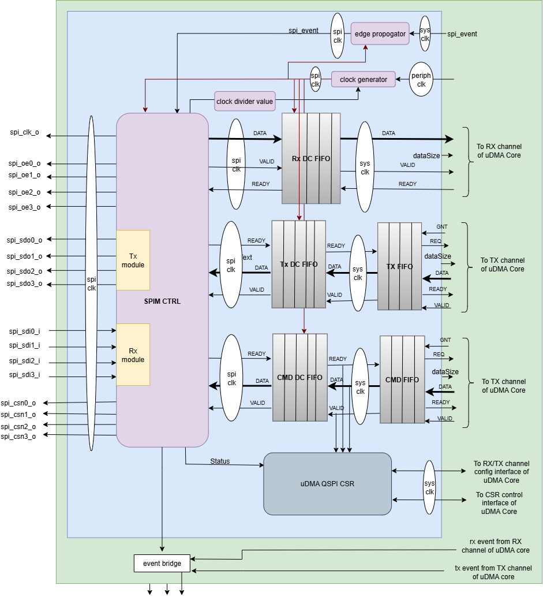
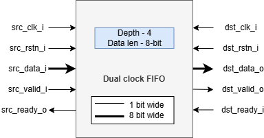
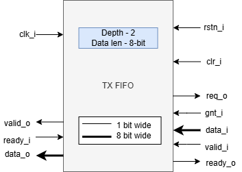
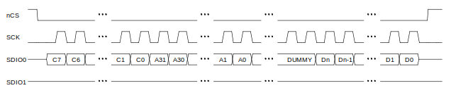
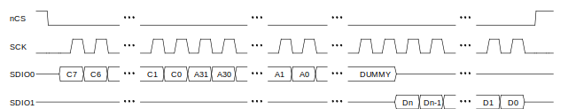
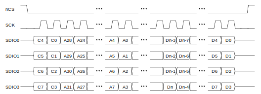
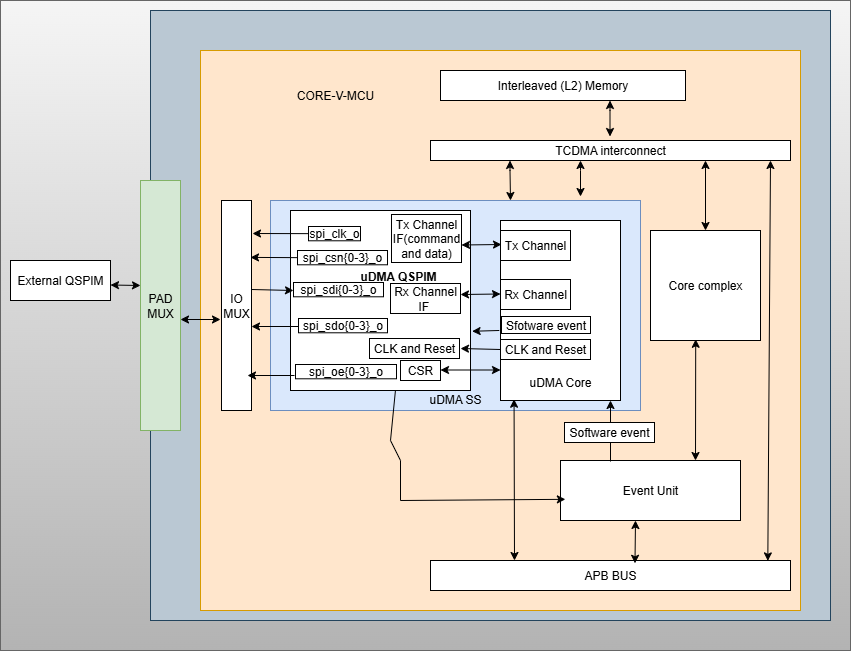
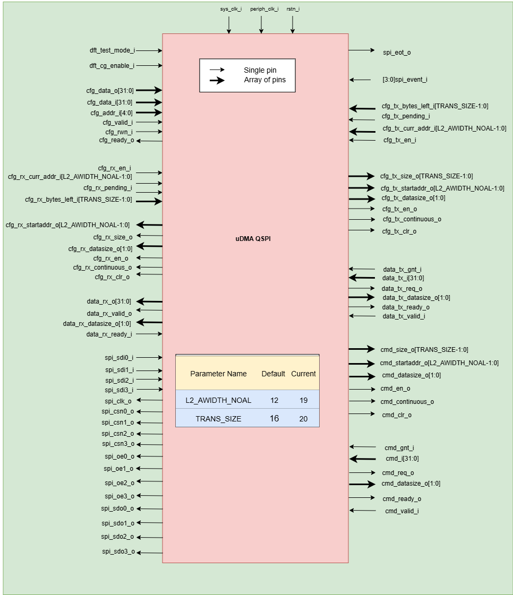

..
   Copyright (c) 2023 OpenHW Group

   SPDX-License-Identifier: Apache-2.0 WITH SHL-2.1

.. Level 1
   =======

   Level 2
   -------

   Level 3
   ~~~~~~~

   Level 4
   ^^^^^^^

.. _udma_qspim:

UDMA QSPI Master
================

The Standard Peripheral Interface bus (SPI) is a synchronous serial communication interface specification used for short distance communications.
QSPI is an enhanced version of the SPI (Serial Peripheral Interface) protocol. It enables higher throughput by allowing 4-bit-wide data transfers instead of the traditional single bit.
The interface has been developed first by Motorola and now has become a de facto standard.

The CORE-V-MCU QSPI Master supports an implementation of the SPI and the QSPI (Quad SPI) mode enabling higher bandwidths required by modern embedded devices.
Due to the lack of a formal standard it is impossible to make a claim of compliance to the protocol.
However, CORE-V-MCU’s QSPI interface is known to work with the Micron N25Q256A Serial NOR Flash Memory and *should* work with a large set of QSPI and SPI devices.
The QSPI master described here has some limitations to the supported variants of the SPI protocol.
The major limitation is the lack of support for the full duplex transfers.

Features
--------
- Supports both standard SPI and quad SPI mode. The default mode of operation is standard SPI mode.
- Supports half-duplex
- Supports interrupts to notify end of receive and transmit operation from L2 memory.
- Support lsb-first or msb-first operation.
- Supports interrupt to notify end of spi operation.

Block Architecture
------------------

uDMA QSPI is a peripheral function of the uDMA subsystem. As such, its CSRs are not directly accessible via the APB bus. Rather, the control plane interface to the uDMA QSPI is managed by the uDMA core within the uDMA subsystem.
This is transparent to the programmer as all uDMA QSPI CSRs appear within the uDMA Subsystem's memory region. As is the case for all uDMA subsystem peripherals, I/O operations are controlled by the uDMA core. This is not transparent to the programmer.

The Figure below is a high-level block diagram of the uDMA QSPI:-

   uDMA QSPI Block Diagram

In the block diagram above, the DATA lines at the boundary of the uDMA QSPI are 32 bits wide, whereas other DATA lines are only 8 bits wide. The DATASIZE pin is 2 bits wide and can be configured using datasize bitfield of the CFG csr.
When transmitting data to the uDMA Core, the uDMA QSPI pads bits [31:8] with 0x0. Conversely, during data reception from the uDMA Core, the uDMA QSPI discards bits [31:8], retaining only the lower 8 bits.

uDMA QSPI uses the Tx channel interface to read the data and command from the interleaved (L2) memory via the uDMA Core. It transmits the read data to the external QSPI device. uDMA QSPI uses the Rx channel interface to store the data received from the external QSPI device to the interleaved (L2) memory. Refer to <https://github.com/openhwgroup/core-v-mcu/blob/master/docs/doc-src/udma_subsystem.rst>`_  for more information about the Tx and Rx channel functionality of uDMA Core.

Dual-clock (DC) TX and RX FIFO
^^^^^^^^^^^^^^^^^^^^^^^^^^^^^

The uDMA core operates using the system clock, while the uDMA QSPI operates using both the system clock and the peripheral clock. To ensure the uDMA QSPI and core are properly synchronized, dual-clock FIFOs are used in the uDMA QSPI.
These are 4-depth FIFOs and can store 8-bit wide data. It is implemented using circular FIFO.

The diagram below shows the interfaces of DC FIFO: 

   Dual clock FIFO

For Rx operation, source(src_*) interfaces shown in the above diagram operate at peripheral clock and destination(dst_*) interfaces operate using system clock.

For Tx operation, source interfaces shown in the above diagram operate at the system clock and destination interfaces operate using the peripheral clock. 

**Pop operation**

The DC FIFO asserts the dst_valid_o (valid) signal to indicate that valid data is available on the data lines. A module waiting for data should read the data lines only when valid pin is high and drive the dst_ready_i (ready)
signal to high and reset it in the next clock cycle. When DC FIFO receives an active ready signal, indicating that the data has been read, it updates the data lines with new data if FIFO is not empty. 
If the FIFO is empty, the dst_valid_o signal is deasserted.

**Push operation**

The DC FIFO asserts the src_ready_o (ready) signal when there is available space to accept incoming data. When an active src_valid_i (valid) signal is received, the data is written into the FIFO.
The src_ready_o signal is kept asserted as long as the FIFO has space for more data. If the DC FIFO is full, the push operation will be stalled until the FIFO has empty space and the valid line is high.
A module transmitting the data to DC FIFO should drive the valid signal low to indicate data lines should not be read.

During QSPI transmit (Tx) operation, the TX DC FIFO is read internally by the QSPI to transmit data to an external device and written by the TX FIFO.
During QSPI receive (Rx) operation, the RX DC FIFO is written internally by the QSPI with the data received from the external device and read by the uDMA core.

Dual-clock (DC) TX and RX FIFO are transparent to users.

TX FIFO
^^^^^^^

uDMA QSPI has a TX FIFO to store the received data from the uDMA core. It forwards the data read from L2 memory to the TX DC FIFO. uDMA QSPI on the TX path reads the data from TX DC FIFO and transmits it to the external device.
It is a 2-depth FIFO and can store 8-bit wide data. The diagram below shows the interfaces of TX FIFO: 

   TX FIFO

TX FIFO operates using a system clock. The clr_i pin is hardcoded with the value 0x0.

**Pop operation**

The read interface of the TX FIFO is connected to the TX DC FIFO.
The TX DC FIFO raises a ready(ready_i) signal if its FIFO has space. If data is available, TX FIFO asserts the valid_o signal and updates the data lines with data.
TX FIFO will update the valid signal and data lines at each clock cycle. If the ready signal is high, data lines will be updated with new data; otherwise, data lines will show the last transferred byte.
If the TX FIFO is empty, the valid_o signal remains deasserted, indicating that no valid data is present on the output lines.

**Push operation**

The write interface of the TX FIFO is extended to the uDMA Core. The TX FIFO write operation is performed with the help of the req(req_o) and ready(ready_o) signals.
The TX FIFO keeps the ready_o (ready) signal high until the TX FIFO is full. TX FIFO raises a req_o signal when it has enough space in FIFO, i.e., ready_o is high, and the pending requests at the uDMA core do not exceed the depth of TX FIFO.
TX FIFO receives a GNT (gnt_i) signal from the uDMA core confirming that the request is accepted. TX FIFO maintains a counter to track unserved requests; it applies the following logic to update the counter: -

- When a request (req_o) is issued and granted (gnt_i), the TX FIFO increments the counter if either the valid_i or ready_o signal is low.
- Regardless of the state of the req_o and gnt_i signals, the frame counter is decremented whenever both valid_i and ready_o are high.

When it receives the valid signal from the uDMA core and the FIFO is not full, the TX FIFO pushes the data coming from the uDMA core. 
TX tries to read data at each clock cycle until TX FIFO has space and a valid pin is high.

TX FIFO is transparent to users.

The actions of the QSPI controller are controlled using a sequence of commands. The uDMA camera reads these commands from the L2 memory using a Tx channel of uDMA core. Below is the list of commands supported by the uDMA QSPI.

+---------------------+--------+------------------------------------------------------------------------------------------------+
| Command             | Value  | Description                                                                                    |
+=====================+========+================================================================================================+
| SPI_CMD_CFG         | 0x0    | Configures SPI clock using CPOL, CPHA, and CLKDIV fields.                                      |
+---------------------+--------+------------------------------------------------------------------------------------------------+
| SPI_CMD_SOT         | 0x1    | Asserts the Chip Select (CS) line to initiate SPIM operation.                                  |
+---------------------+--------+------------------------------------------------------------------------------------------------+
| SPI_CMD_SEND_CMD    | 0x2    | Sends a command word of up to 16 bits on the MOSI line.                                        |
+---------------------+--------+------------------------------------------------------------------------------------------------+
| SPI_CMD_DUMMY       | 0x4    | Inserts dummy clock cycles to receive data without transmitting.                               |
|                     |        | **Note:** Applicable only for Rx operations.                                                   |
+---------------------+--------+------------------------------------------------------------------------------------------------+
| SPI_CMD_WAIT        | 0x5    | Pauses the sequence until an external event or trigger occurs.                                 |
+---------------------+--------+------------------------------------------------------------------------------------------------+
| SPI_CMD_TX_DATA     | 0x6    | Sends data payload (up to 256 Kbits) from memory to the SPI interface.                         |
+---------------------+--------+------------------------------------------------------------------------------------------------+
| SPI_CMD_RX_DATA     | 0x7    | Receives data payload (up to 256 Kbits) from the SPI interface into memory.                    |
+---------------------+--------+------------------------------------------------------------------------------------------------+
| SPI_CMD_RPT         | 0x8    | Starts a loop to repeat the next sequence of commands a specified number of times.             |
+---------------------+--------+------------------------------------------------------------------------------------------------+
| SPI_CMD_EOT         | 0x9    | Marks end of transfer. Optionally deasserts CS and/or triggers an event based on configuration.|
+---------------------+--------+------------------------------------------------------------------------------------------------+
| SPI_CMD_RPT_END     | 0xA    | Marks the end of a repeat block started by SPI_CMD_RPT.                                        |
+---------------------+--------+------------------------------------------------------------------------------------------------+
| SPI_CMD_RX_CHECK    | 0xB    | Compares up to 16 bits of received data with an expected reference value.                      |
+---------------------+--------+------------------------------------------------------------------------------------------------+
| SPI_CMD_FULL_DUPL   | 0xC    | Enables full-duplex mode for simultaneous transmit and receive.                                |
|                     |        | **Note:** Applicable only in standard SPI mode, not in Quad or QPI modes.                      |
+---------------------+--------+------------------------------------------------------------------------------------------------+
| SPI_CMD_SETUP_UCA   | 0xD    | Sets the base address of the memory buffer used by the SPI command engine.                     |
+---------------------+--------+------------------------------------------------------------------------------------------------+
| SPI_CMD_SETUP_UCS   | 0xE    | Sets the data length and triggers uDMA transfer for Tx or Rx.                                  |
+---------------------+--------+------------------------------------------------------------------------------------------------+

To use the uDMA QSPI, the appropriate sequence of commands must be assembled in the L2 memory. The uDMA QSPI uses the uDMA core Tx channel to read the command sequence from L2 memory.
Commands are engraved in 28th to 31st bit of 32-bit of command data. 32-bit command should be interpretted bassed on the SPI_CMD present at offset 28-31 bit. Below is the detailed break-up of commands : -

+----------------------+--------+------------------------------------------------------------+
| Command Field        | Bits   | Description                                                |
+======================+========+============================================================+
| SPI_CMD              | 31:28  | 0x0 : SPI_CMD_CFG                                          |
|                      |        | Command to configure the SPI Master clock settings,        |
|                      |        | including polarity (CPOL), phase (CPHA), and divider.      |
+----------------------+--------+------------------------------------------------------------+
| CPOL                 | 9:9    | Clock polarity selection:                                  |
|                      |        | 0x0: Clock is low when idle                                |
|                      |        | 0x1: Clock is high when idle                               |
+----------------------+--------+------------------------------------------------------------+
| CPHA                 | 8:8    | Clock phase selection:                                     |
|                      |        | 0x0: Data captured on first clock edge                     |
|                      |        | 0x1: Data captured on second clock edge                    |
+----------------------+--------+------------------------------------------------------------+
| CLKDIV               | 7:0    | Clock divider value; determines SPI clock frequency        |
+----------------------+--------+------------------------------------------------------------+

+----------------------+--------+------------------------------------------------------------+
| Command Field        | Bits   | Description                                                |
+======================+========+============================================================+
| SPI_CMD              | 31:28  | 0x1 : SPI_CMD_SOT                                          |
|                      |        | Command to select the SPI device using the Chip Select     |
|                      |        | field.                                                     |
+----------------------+--------+------------------------------------------------------------+
| CS                   | 1:0    | Chip Select line to activate:                              |
|                      |        | 0x0: Select CSn0                                           |
|                      |        | 0x1: Select CSn1                                           |
|                      |        | 0x2: Select CSn2                                           |
|                      |        | 0x3: Select CSn3                                           |
+----------------------+--------+------------------------------------------------------------+

+----------------------+--------+--------------------------------------------------------------+
| Command Field        | Bits   | Description                                                  |
+======================+========+==============================================================+
| SPI_CMD              | 31:28  | 0x2 : SPI_CMD_SEND_CMD                                       |
|                      |        | Command to transmit up to 16 bits of immediate data          |
|                      |        | as part of the SPI transaction.                              |
+----------------------+--------+--------------------------------------------------------------+
| QPI                  | 27:27  | Quad SPI enable:                                             |
|                      |        | 0x0: Use standard SPI (single bit)                           |
|                      |        | 0x1: Use Quad SPI mode (4-bit data)                          |
+----------------------+--------+--------------------------------------------------------------+
| LSB                  | 26:26  | Transfer bit order:                                          |
|                      |        | 0x0: Transmit MSB first                                      |
|                      |        | 0x1: Transmit LSB first                                      |
+----------------------+--------+--------------------------------------------------------------+
| COMMAND_DATA_SIZE    | 19:16  | Command size in bits (N-1), e.g., 0x7 = 8-bit command        |
+----------------------+--------+--------------------------------------------------------------+
| COMMAND_DATA         | 15:0   | Command data to transmit. MSB must always be aligned to bit  |
|                      |        | 15 if command size is less than 16 bits.                      |
+----------------------+--------+--------------------------------------------------------------+

+---------------------------+--------+------------------------------------------------------------------+
| Command Field             | Bits   | Description                                                      |
+===========================+========+==================================================================+
| SPI_CMD                  | 31:28  | 0x5 : SPI_CMD_WAIT                                                |
|                           |        | Command to introduce a wait between instructions, either based   |
|                           |        | on an event or a fixed number of cycles.                         |
+---------------------------+--------+------------------------------------------------------------------+
| WAIT_TYPE                | 9:8    | Type of wait condition:                                           |
|                           |        | 0x0: Wait for SoC event specified by EVENT_ID                    |
|                           |        | 0x1: Wait for number of cycles specified in CYCLE_COUNT          |
|                           |        | 0x2: Reserved                                                    |
|                           |        | 0x3: Reserved                                                    |
+---------------------------+--------+------------------------------------------------------------------+
| EVENT_ID_CYCLE_COUNT     | 7:0    | Source of wait:                                                   |
|                           |        | If WAIT_TYPE = 0x0 → Event ID                                    |
|                           |        | If WAIT_TYPE = 0x1 → Number of cycles to wait                    |
+---------------------------+--------+------------------------------------------------------------------+

+----------------------+--------+------------------------------------------------------------------+
| Command Field        | Bits   | Description                                                      |
+======================+========+==================================================================+
| SPI_CMD              | 31:28  | 0x4 : SPI_CMD_DUMMY                                              |
|                      |        | Inserts a dummy command during Rx operation.                     |
|                      |        | On receiving this command, the uDMA QSPI interface stops         |
|                      |        | forwarding Rx data to the uDMA core.                             |
+----------------------+--------+------------------------------------------------------------------+

+----------------------+--------+------------------------------------------------------------------+
| Command Field        | Bits   | Description                                                      |
+======================+========+==================================================================+
| SPI_CMD              | 31:28  | 0x6 : SPI_CMD_TX_DATA                                            |
|                      |        | Command to transmit a block of data via SPI.                     |
|                      |        | Total size can go up to 256 Kbits.                               |
+----------------------+--------+------------------------------------------------------------------+
| QPI                  | 27:27  | Transfer mode:                                                   |
|                      |        | 0x0: Standard SPI (1-bit)                                        |
|                      |        | 0x1: Quad SPI mode (4-bit)                                       |
+----------------------+--------+------------------------------------------------------------------+
| LSB                  | 26:26  | Bit transmission order:                                          |
|                      |        | 0x0: MSB first                                                   |
|                      |        | 0x1: LSB first                                                   |
+----------------------+--------+------------------------------------------------------------------+
| WORD_PER_TRANSF      | 22:21  | Words transferred per uDMA access:                               |
|                      |        | 0x0: 1 word per transfer                                         |
|                      |        | 0x1: 2 words per transfer                                        |
|                      |        | 0x2: 4 words per transfer                                        |
+----------------------+--------+------------------------------------------------------------------+
| WORD_SIZE            | 20:16  | Word size in bits (N-1)                                          |
|                      |        | e.g., 0x7 = 8-bit word                                           |
+----------------------+--------+------------------------------------------------------------------+
| WORD_NUM             | 15:0   | Total number of words to send (N-1), max 64K                     |
+----------------------+--------+------------------------------------------------------------------+

+----------------------+--------+------------------------------------------------------------------+
| Command Field        | Bits   | Description                                                      |
+======================+========+==================================================================+
| SPI_CMD              | 31:28  | 0x7 : SPI_CMD_RX_DATA                                            |
|                      |        | Command to receive a block of data via SPI.                      |
|                      |        | Total size can be up to 256 Kbits.                               |
+----------------------+--------+------------------------------------------------------------------+
| QPI                  | 27:27  | Receive mode:                                                    |
|                      |        | 0x0: Standard SPI (1-bit)                                        |
|                      |        | 0x1: Quad SPI mode (4-bit)                                       |
+----------------------+--------+------------------------------------------------------------------+
| LSB                  | 26:26  | Bit reception order:                                             |
|                      |        | 0x0: MSB first                                                   |
|                      |        | 0x1: LSB first                                                   |
+----------------------+--------+------------------------------------------------------------------+
| WORD_PER_TRANSF      | 22:21  | Words received per uDMA access:                                  |
|                      |        | 0x0: 1 word per transfer                                         |
|                      |        | 0x1: 2 words per transfer                                        |
|                      |        | 0x2: 4 words per transfer                                        |
+----------------------+--------+------------------------------------------------------------------+
| WORD_SIZE            | 20:16  | Word size in bits (N-1)                                          |
|                      |        | e.g., 0x7 = 8-bit word                                           |
+----------------------+--------+------------------------------------------------------------------+
| WORD_NUM             | 15:0   | Total number of words to receive (N-1), max 64K                  |
+----------------------+--------+------------------------------------------------------------------+

+----------------------+--------+------------------------------------------------------------------+
| Command Field        | Bits   | Description                                                      |
+======================+========+==================================================================+
| SPI_CMD              | 31:28  | 0x8 : SPI_CMD_RPT                                                |
|                      |        | Starts a loop to repeat the upcoming command sequence.           |
|                      |        | The loop will execute RPT_CNT + 1 times.                         |
+----------------------+--------+------------------------------------------------------------------+
| RPT_CNT              | 15:0   | Number of repeat iterations minus one.                           |
|                      |        | Maximum: 0xFFFF (i.e., 65536 iterations).                        |
+----------------------+--------+------------------------------------------------------------------+

+----------------------+--------+------------------------------------------------------------------+
| Command Field        | Bits   | Description                                                      |
+======================+========+==================================================================+
| SPI_CMD              | 31:28  | 0x9 : SPI_CMD_EOT                                                |
|                      |        | Marks the end of SPI transaction.                                |
|                      |        | Optionally clears the chip select and generates an EOT event.    |
+----------------------+--------+------------------------------------------------------------------+
| KEEP_CHIP_SELECT     | 0:0    | Chip select behavior after EOT:                                  |
|                      |        | 0x0: Keep chip select asserted                                   |
|                      |        | 0x1: Deassert (clear) all chip selects                           |
+----------------------+--------+------------------------------------------------------------------+
| EVENT_GEN            | 0:0    | EOT event generation:                                            |
|                      |        | 0x0: Disable                                                     |
|                      |        | 0x1: Generate event on EOT                                       |
+----------------------+--------+------------------------------------------------------------------+

+----------------------+--------+--------------------------------------------------------------+
| Command Field        | Bits   | Description                                                  |
+======================+========+==============================================================+
| SPI_CMD              | 31:28  | 0xA : SPI_CMD_RPT_END                                        |
|                      |        | Marks the end of a repeat loop started by SPI_CMD_RPT.       |
|                      |        | Execution continues with the next instruction after the loop.|
+----------------------+--------+--------------------------------------------------------------+

+----------------------+--------+-----------------------------------------------------------------------+
| Command Field        | Bits   | Description                                                           |
+======================+========+=======================================================================+
| SPI_CMD              | 31:28  | 0xB : SPI_CMD_RX_CHECK                                                |
|                      |        | Compares received data against expected value COMP_DATA.              |
+----------------------+--------+-----------------------------------------------------------------------+
| QPI                  | 27:27  | Transfer mode:                                                        |
|                      |        | 0x0: Standard (1-bit) SPI                                             |
|                      |        | 0x1: Quad SPI mode                                                    |
+----------------------+--------+-----------------------------------------------------------------------+
| LSB                  | 26:26  | Bit ordering of received data:                                        |
|                      |        | 0x0: Data is LSB-first                                                |
|                      |        | 0x1: Data is MSB-first                                                |
+----------------------+--------+-----------------------------------------------------------------------+
| CHECK_TYPE           | 25:24  | Comparison mode:                                                      |
|                      |        | 0x0: Compare bit-by-bit                                               |
|                      |        | 0x1: Check if all bits are 1                                          |
|                      |        | 0x2: Check if all bits are 0                                          |
+----------------------+--------+-----------------------------------------------------------------------+
| STATUS_SIZE          | 19:16  | N-1, where N is the number of bits to compare                         |
+----------------------+--------+-----------------------------------------------------------------------+
| COMP_DATA            | 15:0   | Expected data to compare against received value                       |
+----------------------+--------+-----------------------------------------------------------------------+

+----------------------+--------+---------------------------------------------------------------+
| Command Field        | Bits   | Description                                                   |
+======================+========+===============================================================+
| SPI_CMD              | 31:28  | 0xC : SPI_CMD_FULL_DUPL                                       |
|                      |        | Activates full duplex mode for simultaneous Tx and Rx         |
+----------------------+--------+---------------------------------------------------------------+
| LSB                  | 26:26  | Bit ordering of data:                                         |
|                      |        | 0x0: Transmit/receive data LSB first                          |
|                      |        | 0x1: Transmit/receive data MSB first                          |
+----------------------+--------+---------------------------------------------------------------+
| DATA_SIZE            | 15:0   | N-1, where N is the number of bits to send (max 64K)          |
+----------------------+--------+---------------------------------------------------------------+

+----------------------+--------+---------------------------------------------------------------------------+
| Command Field        | Bits   | Description                                                               |
+======================+========+===========================================================================+
| SPI_CMD              | 31:28  | 0xD : SPI_CMD_SETUP_UCA                                                   |
|                      |        | Sets the base address for the uDMA TX or RX buffer                        |
+----------------------+--------+---------------------------------------------------------------------------+
| ADDR                 | 20:0   | L2 memory address (in bytes) to: -                                        |
|                      |        |- store recived data via SPI interface                                     |
|                      |        |- read data that should be transferred via SPI interface                   |
|                      |        | TX_RXN field of SPI_CMD_SETUP_UCS command decides the transder direction. |
+----------------------+--------+---------------------------------------------------------------------------+

+----------------------+--------+-----------------------------------------------------------------------+
| Command Field        | Bits   | Description                                                           |
+======================+========+=======================================================================+
| SPI_CMD              | 31:28  | 0xE : SPI_CMD_SETUP_UCS                                               |
|                      |        | Sets size and starts uDMA transfer on TX or RX channel                |
+----------------------+--------+-----------------------------------------------------------------------+
| TX_RXN               | 27:27  | Selects the transfer direction:                                       |
|                      |        | 0x0: RX channel                                                       |
|                      |        | 0x1: TX channel                                                       |
+----------------------+--------+-----------------------------------------------------------------------+
| DATASIZE             | 26:25  | Number of words read/write from/to L2 memory per transfer cycle:      |
|                      |        |                                                                       |
|                      |        | - 0x0: 1 word per transfer, increment address by 1 (data is 8 bits)   |
|                      |        | - 0x1: 2 words per transfer, increment address by 2 (data is 16 bits) |
|                      |        | - 0x2: 4 words per transfer, increment address by 4 (data is 32 bits) |
|                      |        | - 0x3: 1 word per transfer, increment address by 1 (data is 8 bits)   |
|                      |        |                                                                       |
+----------------------+--------+-----------------------------------------------------------------------+
| SIZE                 | 24:0   | Size of data that should be written or read from L2 memory            |
|                      |        | address defined in ADD field of SPI_CMD_SETUP_UCA command.            |
+----------------------+--------+-----------------------------------------------------------------------+

The Rx and Tx channels of the uDMA core can be configured using either the channel configuration CSRs or the SPI_CMD_SETUP_UCA/SPI_CMD_SETUP_UCS commands. Both methods have equal priority, and any new update will overwrite the previous configuration.

The uDMA QSPI operates with the help of uDMA SPIM controller whose primary job is to: -

- interact with uDMA Core for L2 memory communications.
- Configure Tx and Rx modules of uDMA QSPI to perfiorm SPI operation with the external device.

RX operation
^^^^^^^^^^^^

The uDMA QSPI drives ouptut enable pin, spi_oeX_o{X = 0 to 3},  with value 0 during Rx oeration.
The uDMA QSPI can be configured to perform either quad SPI reception(4 bit per cycle) or standard SPI reception(1 bit per cycle) depending on values of QPI field of SPI_CMD_RX_DATA command.
The input pins, spi_sdiX_o{X = 0 to 3}, will be read based on the LSB field value of the SPI_CMD_RX_DATA command. If LSB is set to 0, then spi_sdi0_o will reflect msb bit else it reflects lsb bit of recived data.

uDMA QSPI after reading the desired number of bits, asserts valid signal of RX DC FIFO. RC DC FIFO when it has enough space samples the data lines at every clock cycle provided that the valid line is asserted.
RX DC FIFO, when it has data and ready signal is high, asserts the valid line and drive data lines with the data. uDMA core after receiving the valid signal, reads the data and store it into L2 memory.

TX operation
^^^^^^^^^^^^
After receing the tx_start signal, uDMA QSPI reads the valid signal. If the valid signal is high then it reads the data lines else it waits for valid signal to go high. After reading the from data lines and confirming assertion of ts_start signal it transmits the data over output, spi_sdoX_o{X = 0 to 3}, lines.
The uDMA QSPI can be configured to perform either quad SPI transfer(4 bit per cycle) or standard SPI transfer(1 bit per cycle) depending on values of QPI field of SPI_CMD_TX_DATA command.
The uDMA QSPI drives ouptut enable pin, spi_oeX_o{X = 0 to 3},  with value 1 during Tx oeration. In standard spi mode spi_oe0_o and spi_sdo0_o pins are used, whereas in quad SPI mode all spi_oeX_o{X = 0 to 3} and spi_sdoX_o{X = 0 to 3} pins are used.
The output pins, spi_sdoX_o{X = 0 to 3}, will be updated based on the LSB field value of the SPI_CMD_TX_DATA command. If LSB is set to 0, then spi_sdo0_o will be updated with msb bit else it is updated with lsb bit of transmit data.

Full duplex operation
^^^^^^^^^^^^^^^^^^^^^

Example Transactions
--------------------
Below are examples of typical writes and reads to external memories using the standard 4-wire SPI protocol.

   Simple SPI Write Transfer

   Simple SPI Read Transfer

Next we see an example transfer in QSPI mode.
All 4 datalines are bidirectional and the communication is always half duplex.

   Quad SPI Transfer

System Architecture
-------------------

The figure below shows how the uDMA QSPI interfaces with the rest of the CORE-V-MCU components and the external QSPI device:-

   uDMA QSPI CORE-V-MCU connection diagram

Programming Model
------------------
As with the most peripherals in the uDMA Subsystem, software configuration can be conceptualized into three functions:

- Configure the I/O parameters of the peripheral (e.g. baud rate).
- Configure the uDMA data control parameters.
- Manage the data transfer/reception operation.

uDMA QSPI Data Control
^^^^^^^^^^^^^^^^^^^^^^
Refer to the Firmware Guidelines section in the current chapter.

Data Transfer Operation
^^^^^^^^^^^^^^^^^^^^^^^
Refer to the Firmware Guidelines section in the current chapter.

uDMA QSPI CSRs
--------------
Refer to `Memory Map <https://github.com/openhwgroup/core-v-mcu/blob/master/docs/doc-src/mmap.rst>`_ for peripheral domain address of the uDMA QSPI0 and uDMA QSPI1.

**NOTE:** Several of the uDMA QSPI CSR are volatile, meaning that their read value may be changed by the hardware.
For example, writting the *RX_SADDR* CSR will set the address of the receive buffer pointer.
As data is received, the hardware will update the value of the pointer to indicate the current address.
As the name suggests, the value of non-volatile CSRs is not changed by the hardware.
These CSRs retain the last value writen by software.

A CSRs volatility is indicated by its "type".

Details of CSR access type are explained `here <https://docs.openhwgroup.org/projects/core-v-mcu/doc-src/mmap.html#csr-access-types>`_.

The CSRs RX_SADDR, RX_SIZE specifies the configuration for the transaction on the RX channel. The CSRs TX_SADDR, TX_SIZE specify the configuration for the transaction on the TX channel. The uDMA Core creates a local copy of this information at its end and use it for current ongoing transaction.

RX_SADDR
^^^^^^^^
- Offset: 0x0
- Type:   volatile

+--------+------+--------+------------+----------------------------------------------------------------------------------------------------------+
| Field  | Bits | Access | Default    | Description                                                                                              |
+========+======+========+============+==========================================================================================================+
| SADDR  | 18:0 | RW     |    0x0     | Address of the Rx buffer. This is location in the L2 memory where QSPI will write the recived data.      |
|        |      |        |            | Read & write to this CSR access different information.                                                   |
|        |      |        |            |                                                                                                          |
|        |      |        |            | **On Write**: Address of Rx buffer for next transaction. It does not impact current ongoing transaction. |
|        |      |        |            |                                                                                                          |
|        |      |        |            | **On Read**:  Address of read buffer for the current ongoing transaction. This is the local copy of      |
|        |      |        |            | information maintained inside the uDMA core.                                                             |
+--------+------+--------+------------+----------------------------------------------------------------------------------------------------------+

RX_SIZE
^^^^^^^
- Offset: 0x04
- Type:   volatile

+-------+-------+--------+------------+--------------------------------------------------------------------------------------------+
| Field |  Bits | Access | Default    | Description                                                                                |
+=======+=======+========+============+============================================================================================+
| SIZE  |  19:0 |   RW   |    0x0     | Size of Rx buffer(amount of data to be transferred by QSPI to L2 memory). Read & write     |
|       |       |        |            | to this CSR access different information.                                                  |
|       |       |        |            |                                                                                            |
|       |       |        |            | **On Write**: Size of Rx buffer for next transaction.  It does not impact current ongoing  |
|       |       |        |            | transaction.                                                                               |
|       |       |        |            |                                                                                            |
|       |       |        |            | **On Read**:  Bytes left for current ongoing transaction.  This is the local copy of       |
|       |       |        |            | information maintained inside the uDMA core.                                               |
+-------+-------+--------+------------+--------------------------------------------------------------------------------------------+

RX_CFG
^^^^^^
- Offset: 0x08
- Type:   volatile

+------------+-------+--------+------------+------------------------------------------------------------------------------------+
| Field      |  Bits | Access | Default    | Description                                                                        |
+============+=======+========+============+====================================================================================+
| CLR        |   6:6 |   WO   |    0x0     | Clear the local copy of Rx channel configuration CSRs inside uDMA core             |
+------------+-------+--------+------------+------------------------------------------------------------------------------------+
| PENDING    |   5:5 |   RO   |    0x0     | - 0x1: The uDMA core Rx channel is enabled and either transmitting data,           |
|            |       |        |            |   waiting for access from the uDMA core arbiter, or stalled due to a full Rx FIFO  |
|            |       |        |            |   of uDMA Core                                                                     |
|            |       |        |            | - 0x0 : Rx channel of the uDMA core does not have data to transmit to L2 memory    |
+------------+-------+--------+------------+------------------------------------------------------------------------------------+
| EN         |   4:4 |   RW   |    0x0     | Enable the Rx channel of the uDMA core to perform Rx operation                     |
+------------+-------+--------+------------+------------------------------------------------------------------------------------+
| DATASIZE   |   2:1 |   RW   |    0x02    | Controls uDMA address increment                                                    |
|            |       |        |            |                                                                                    |
|            |       |        |            | - 0x00: increment address by 1 (data is 8 bits)                                    |
|            |       |        |            | - 0x01: increment address by 2 (data is 16 bits)                                   |
|            |       |        |            | - 0x02: increment address by 4 (data is 32 bits)                                   |
|            |       |        |            | - 0x03: increment address by 0                                                     |
+------------+-------+--------+------------+------------------------------------------------------------------------------------+
| CONTINUOUS |   0:0 |   RW   |    0x0     | - 0x0: stop after last transfer for channel                                        |
|            |       |        |            | - 0x1: after last transfer for channel, reload buffer size                         |
|            |       |        |            |   and start address and restart channel                                            |
+------------+-------+--------+------------+------------------------------------------------------------------------------------+

TX_SADDR
^^^^^^^^
- Offset: 0x10
- Type:   volatile

+-------+-------+--------+------------+-------------------------------------------------------------------------------------------------------------+
| Field |  Bits | Access | Default    | Description                                                                                                 |
+=======+=======+========+============+=============================================================================================================+
| SADDR |  18:0 |   RW   |    0x0     | Address of the Tx buffer. This is location in the L2 memory from where QSPI will read the data to transmit. |
|       |       |        |            | Read & write to this CSR access different information.                                                      |
|       |       |        |            |                                                                                                             |
|       |       |        |            | **On Write**: Address of Tx buffer for next transaction. It does not impact current ongoing transaction.    |
|       |       |        |            |                                                                                                             |
|       |       |        |            | **On Read**: Address of Tx buffer for the current ongoing transaction.This is the local copy of information |
|       |       |        |            | maintained inside the uDMA core.                                                                            |
+-------+-------+--------+------------+-------------------------------------------------------------------------------------------------------------+

TX_SIZE
^^^^^^^
- Offset: 0x14
- Type:   volatile

+-------+-------+--------+------------+--------------------------------------------------------------------------------------------------------+
| Field |  Bits | Access | Default    | Description                                                                                            |
+=======+=======+========+============+========================================================================================================+
| SIZE  |  19:0 |   RW   |    0x0     | Size of Tx buffer(amount of data to be read by QSPI from L2 memory for Tx operation). Read & write     |
|       |       |        |            | to this CSR access different information.                                                              |
|       |       |        |            |                                                                                                        |
|       |       |        |            | **On Write**: Size of Tx buffer for next transaction. It does not impact current ongoing transaction.  |
|       |       |        |            |                                                                                                        |
|       |       |        |            | **On Read**: Bytes left for current ongoing transaction, i.e. bytes left to read from L2 memory. This  |
|       |       |        |            | is the local copy of information maintained inside the uDMA core.                                      |
+-------+-------+--------+------------+--------------------------------------------------------------------------------------------------------+

TX_CFG
^^^^^^
- Offset: 0x18
- Type:   volatile

+------------+-------+--------+------------+------------------------------------------------------------------------------------+
| Field      |  Bits | Access | Default    | Description                                                                        |
+============+=======+========+============+====================================================================================+
| CLR        |   6:6 |   WO   |    0x0     | Clear the local copy of Tx channel configuration CSRs inside uDMA core             |
+------------+-------+--------+------------+------------------------------------------------------------------------------------+
| PENDING    |   5:5 |   RO   |    0x0     | - 0x1: The uDMA core Tx channel is enabled and is either receiving data,           |
|            |       |        |            |   waiting for access from the uDMA core arbiter, or stalled due to a full Tx FIFO  |
|            |       |        |            | - 0x0 : Tx channel of the uDMA core does not have data to read from L2 memory      |
+------------+-------+--------+------------+------------------------------------------------------------------------------------+
| EN         |   4:4 |   RW   |    0x0     | Enable the transmit channel of uDMA core to perform Tx operation                   |
+------------+-------+--------+------------+------------------------------------------------------------------------------------+
| DATASIZE   |   2:1 |   RW   |    0x02    | Controls uDMA address increment                                                    |
|            |       |        |            |                                                                                    |
|            |       |        |            | - 0x00: increment address by 1 (data is 8 bits)                                    |
|            |       |        |            | - 0x01: increment address by 2 (data is 16 bits)                                   |
|            |       |        |            | - 0x02: increment address by 4 (data is 32 bits)                                   |
|            |       |        |            | - 0x03: increment address by 0                                                     |
+------------+-------+--------+------------+------------------------------------------------------------------------------------+
| CONTINUOUS |   0:0 |   RW   |            | - 0x0: stop after last transfer for channel                                        |
|            |       |        |    0x0     | - 0x1: after last transfer for channel,reload buffer size                          |
|            |       |        |            |   and start address and restart channel                                            |
+------------+-------+--------+------------+------------------------------------------------------------------------------------+

CMD_SADDR
~~~~~~~~~

- Offset: 0x20
- Type:   volatile

+-------+-------+--------+------------+-------------------------------------------------------------------------------------------------------------------------+
| Field |  Bits | Access | Default    | Description                                                                                                             |
+=======+=======+========+============+=========================================================================================================================+
| SADDR |  18:0 |   RW   |    0x0     | Address of the command memory buffer. This is location in the L2 memory from where QSPI will read the data to transmit. |
|       |       |        |            | Read & write to this CSR access different information.                                                                  |
|       |       |        |            |                                                                                                                         |
|       |       |        |            | **On Write**: Address of command memory buffer for next transaction. It does not impact current ongoing transaction.    |
|       |       |        |            |                                                                                                                         |
|       |       |        |            | **On Read**: Address of command memory buffer for the current ongoing transaction.This is the local copy of information |
|       |       |        |            | maintained inside the uDMA core.                                                                                        |
+-------+-------+--------+------------+-------------------------------------------------------------------------------------------------------------------------+

CMD_SIZE
~~~~~~~~

- Offset: 0x24
- Type:   volatile

+-------+-------+--------+------------+-------------------------------------------------------------------------------------------------------------------+
| Field |  Bits | Access | Default    | Description                                                                                                       |
+=======+=======+========+============+===================================================================================================================+
| SIZE  |  19:0 |   RW   |    0x0     | Size of command memory buffer(amount of data to be read by QSPI from L2 memory). Read & write                     |
|       |       |        |            | to this CSR access different information.                                                                         |
|       |       |        |            |                                                                                                                   |
|       |       |        |            | **On Write**: Size of command memory buffer for next transaction. It does not impact current ongoing transaction. |
|       |       |        |            |                                                                                                                   |
|       |       |        |            | **On Read**: Bytes left for current ongoing transaction, i.e. bytes left to read from L2 memory. This             |
|       |       |        |            | is the local copy of information maintained inside the uDMA core.                                                 |
+-------+-------+--------+------------+-------------------------------------------------------------------------------------------------------------------+

CMD_CFG 
~~~~~~~

- Offset: 0x28
- Type:   volatile

+---------------+-------+------+------------+-----------------------------------------------------------------------------------+
| Field         |  Bits | Type | Default    | Description                                                                       |
+------------+-------+--------+------------+------------------------------------------------------------------------------------+
| Field      |  Bits | Access | Default    | Description                                                                        |
+============+=======+========+============+====================================================================================+
| CLR        |   6:6 |   WO   |    0x0     | Clear the local copy of Tx channel configuration CSRs inside uDMA core             |
+------------+-------+--------+------------+------------------------------------------------------------------------------------+
| PENDING    |   5:5 |   RO   |    0x0     | - 0x1: The uDMA core Tx channel is enabled and is either receiving data,           |
|            |       |        |            |   waiting for access from the uDMA core arbiter, or stalled due to a full Tx FIFO  |
|            |       |        |            | - 0x0 : Tx channel of the uDMA core does not have data to read from L2 memory      |
+------------+-------+--------+------------+------------------------------------------------------------------------------------+
| EN         |   4:4 |   RW   |    0x0     | Enable the transmit channel of uDMA core to perform Tx operation                   |
+------------+-------+--------+------------+------------------------------------------------------------------------------------+
| DATASIZE   |   2:1 |   R    |    0x02    | Controls uDMA address increment                                                    |
|            |       |        |            |                                                                                    |
|            |       |        |            | - 0x00: NA                                                                         |
|            |       |        |            | - 0x01: NA                                                                         |
|            |       |        |            | - 0x02: increment address by 4 (data is 32 bits)                                   |
|            |       |        |            | - 0x03: NA                                                                         |
+------------+-------+--------+------------+------------------------------------------------------------------------------------+
| CONTINUOUS |   0:0 |   RW   |            | - 0x0: stop after last transfer for channel                                        |
|            |       |        |    0x0     | - 0x1: after last transfer for channel,reload buffer size                          |
|            |       |        |            |   and start address and restart channel                                            |
+------------+-------+--------+------------+------------------------------------------------------------------------------------+

STATUS
~~~~~~

- Offset: 0x30
- Type:   volatile

+---------------+-------+------+------------+-------------------------------------------------------------+
| Field         |  Bits | Type | Default    | Description                                                 |
+===============+=======+======+============+=============================================================+
| BUSY          |   1:0 |   RO |            | 0x00: STAT_NONE                                             |
|               |       |      |            | 0x01: STAT_CHECK (matched)                                  |
|               |       |      |            | 0x02: STAT_EOL (end of loop)                                |
+---------------+-------+------+--------------------------------------------------------------------------+

Firmware Guidelines
-------------------

Clock Enable, Reset & Configure uDMA QSPI
^^^^^^^^^^^^^^^^^^^^^^^^^^^^^^^^^^^^^^^^^
- Configure uDMA Core's PERIPH_CLK_ENABLE to enable uDMA QSPI's peripheral clock. A peripheral clock is used to calculate the baud rate in uDMA QSPI.
- Configure uDMA Core's PERIPH_RESET CSR to issue a reset signal to uDMA QSPI. It acts as a soft reset for uDMA QSPI.
- Configure QSPI Operation using  SETUP CSR. Refer to the CSR details for detailed information.
- The DIV bit of QSPI SETUP should be updated with a non-zero value as it is used for buadrate calculation. The baud rate is determined by the period of the ref_clk divided by the value of DIV.

Tx Operation
^^^^^^^^^^^^

Rx Operation
^^^^^^^^^^^^

Pin Diagram
-----------
The Figure below is a high-level pin diagram of the uDMA:-

   uDMA QSPI Pin Diagram

Below is categorization of these pins:

Tx channel interface
^^^^^^^^^^^^^^^^^^^^
The following pins constitute the Tx channel interface of uDMA QSPI. uDMA QSPI uses these pins to read data from interleaved (L2) memory:

- data_tx_req_o
- data_tx_gnt_i
- data_tx_datasize_o
- data_tx_i
- data_tx_valid_i
- data_tx_ready_o

data_tx_datasize_o pin is hardcoded to value 0x0. These pins reflect the configuration values for the next transaction.

Rx channel interface
^^^^^^^^^^^^^^^^^^^^
The following pins constitute the Rx channel interface of uDMA QSPI. uDMA QSPI uses these pins to write data to interleaved (L2) memory:

- data_rx_datasize_o
- data_rx_o
- data_rx_valid_o
- data_rx_ready_i

 data_rx_datasize_o pin is hardcoded to value 0x0. These pins reflect the configuration values for the next transaction.

Clock interface
^^^^^^^^^^^^^^^
- sys_clk_i
- periph_clk_i

uDMA CORE derives these clock pins. periph_clk_i is used to calculate baud rate. sys_clk_i is used to synchronize QSPI with uDAM Core.

Reset interface
^^^^^^^^^^^^^^^
- rstn_i

uDMA core issues reset signal to QSPI using reset pin.

uDMA QSPI interface to receive events from uDMA core
^^^^^^^^^^^^^^^^^^^^^^^^^^^^^^^^^^^^^^^^^^^^^^^^^^^^
- spi_event_i

uDMA QSPI receieves software events generated used in APB event register external QSPI device on QSPI_rx_i and transmits via QSPI_tx_o.

uDMA QSPI interface to generate interrupt
^^^^^^^^^^^^^^^^^^^^^^^^^^^^^^^^^^^^^^^^^
- rx_char_event_o
- err_event_o

Overflow and Parity error are generated over err_event_o interface. Receive data event will be generated over rx_char_event_o interface.

uDMA QSPI inerface to read-write CSRs
^^^^^^^^^^^^^^^^^^^^^^^^^^^^^^^^^^^^^
The following interfaces are used to read and write to QSPI CSRs. These interfaces are managed by uDMA Core:

- cfg_data_i
- cfg_addr_i
- cfg_valid_i
- cfg_rwn_i
- cfg_ready_o
- cfg_data_o

uDMA QSPI Rx channel configuration interface
^^^^^^^^^^^^^^^^^^^^^^^^^^^^^^^^^^^^^^^^^^^^
- uDMA QSPI uses the following pins to share the value of config CSRs i.e. RX_SADDR, RX_SIZE, and RX_CFG with the uDMA core:-

   - cfg_rx_startaddr_o
   - cfg_rx_size_o
   - cfg_rx_datasize_o
   - cfg_rx_continuous_o
   - cfg_rx_en_o
   - cfg_rx_clr_o

   cfg_rx_datasize_o pin is stubbed.

- QSPI shares the values present over the below pins as read values of the config CSRs i.e. RX_SADDR, RX_SIZE, and RX_CFG:

   - cfg_rx_en_i
   - cfg_rx_pending_i
   - cfg_rx_curr_addr_i
   - cfg_rx_bytes_left_i

   These values are updated by the uDMA core and reflects the configuration values for the current ongoing transactions.

uDMA QSPI Tx channel configuration interface
^^^^^^^^^^^^^^^^^^^^^^^^^^^^^^^^^^^^^^^^^^^^
- uDMA QSPI uses the following pins to share the value of config CSRs i.e. TX_SADDR, TX_SIZE, and TX_CFG with the uDMA core:-

   - cfg_tx_startaddr_o
   - cfg_tx_size_o
   - cfg_tx_datasize_o
   - cfg_tx_continuous_o
   - cfg_tx_en_o
   - cfg_tx_clr_o

  cfg_tx_datasize_o pin is stubbed.

- QSPI shares the values present over the below pins as read values of the config CSRs i.e. TX_SADDR, TX_SIZE, and TX_CFG:

   - cfg_tx_en_i
   - cfg_tx_pending_i
   - cfg_tx_curr_addr_i
   - cfg_tx_bytes_left_i

   These values are updated by the uDMA core and reflects the configuration values for the current ongoing transactions.

uDMA QSPI protocol interface
^^^^^^^^^^^^^^^^^^^^^^^^^^^^
   - spi_sdi0_i
   - spi_sdi1_i
   - spi_sdi2_i
   - spi_sdi3_i
   - spi_clk_o
   - spi_csn0_o
   - spi_csn1_o
   - spi_csn2_o
   - spi_csn3_o
   - spi_oe0_o
   - spi_oe1_o
   - spi_oe2_o
   - spi_oe3_o
   - spi_sdo0_o
   - spi_sdo1_o
   - spi_sdo2_o
   - spi_sdo3_o

   These SPI signals represent a quad-SPI interface with 4 data lines (spi_sdi[0–3]_i for input, spi_sdo[0–3]_o for output, and spi_oe[0–3]_o for output enable).
   It uses a shared clock (spi_clk_o) and four chip select signals (spi_csn[0–3]_o) to control multiple SPI devices independently.