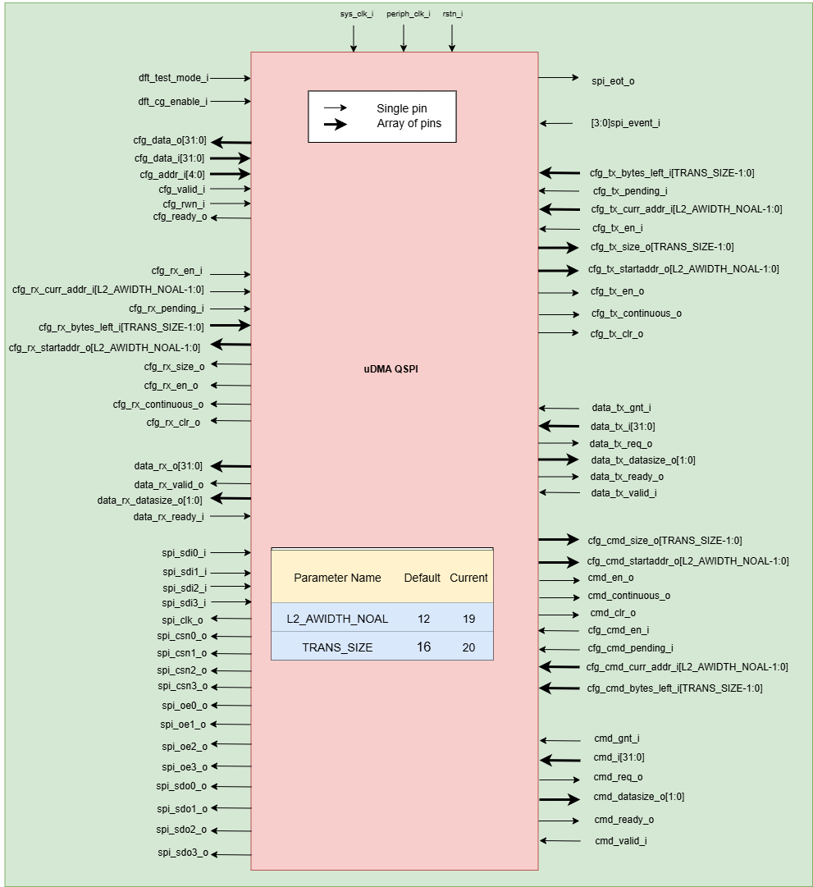

..
   Copyright (c) 2023 OpenHW Group

   SPDX-License-Identifier: Apache-2.0 WITH SHL-2.1

.. Level 1
   =======

   Level 2
   -------

   Level 3
   ~~~~~~~

   Level 4
   ^^^^^^^

.. _udma_qspim:

UDMA QSPI Master
================

The Standard Peripheral Interface bus (SPI) is a synchronous serial communication interface specification used for short distance communications.
QSPI is an enhanced version of the SPI (Serial Peripheral Interface) protocol. It enables higher throughput by allowing 4-bit-wide data transfers instead of the traditional single bit.
The interface has been developed first by Motorola and now has become a de facto standard.

The CORE-V-MCU QSPI Master supports an implementation of the SPI and the QSPI (Quad SPI) mode enabling higher bandwidths required by modern embedded devices.
Due to the lack of a formal standard it is impossible to make a claim of compliance to the protocol.
However, CORE-V-MCU’s QSPI interface is known to work with the Micron N25Q256A Serial NOR Flash Memory and *should* work with a large set of QSPI and SPI devices.

Features
--------
- Supports both standard SPI and quad SPI mode. The default mode of operation is standard SPI mode.
- Supports half-duplex
- Supports interrupts to notify end of receive and transmit operation from L2 memory.
- Support lsb-first or msb-first operation.
- Supports interrupt to notify end of spi operation.

Block Architecture
------------------

uDMA QSPI is a peripheral function of the uDMA subsystem. As such, its CSRs are not directly accessible via the APB bus. Rather, the control plane interface to the uDMA QSPI is managed by the uDMA core within the uDMA subsystem.
This is transparent to the programmer as all uDMA QSPI CSRs appear within the uDMA Subsystem's memory region. As is the case for all uDMA subsystem peripherals, I/O operations are controlled by the uDMA core. This is not transparent to the programmer.

The Figure below is a high-level block diagram of the uDMA QSPI:-

.. figure:: uDMA_QSPI_Block_Diagram.png
   :name: uDMA_QSPI_Block_Diagram
   :align: center
   :alt:

   uDMA QSPI Block Diagram

In the block diagram above, the DATA lines at the boundary of the uDMA QSPI are 32 bits wide, whereas other DATA lines are only 8 bits wide. The DATASIZE pin is 2 bits wide and can be configured using datasize bitfield of the CFG csr.
When data communication with the uDMA Core, the uDMA QSPI pads the unused bits with 0x0.

uDMA QSPI uses the Tx channel interface to read the data and command from the interleaved (L2) memory via the uDMA Core. It transmits the read data to the external QSPI device. 
uDMA QSPI uses the Rx channel interface to store the data received from the external QSPI device to the interleaved (L2) memory. Refer to <https://github.com/openhwgroup/core-v-mcu/blob/master/docs/doc-src/udma_subsystem.rst>`_  for more information about the Tx and Rx channel functionality of uDMA Core.

Dual-clock (DC) Tx (command and data) and Rx FIFO
^^^^^^^^^^^^^^^^^^^^^^^^^^^^^^^^^^^^^^^^^^^^^^^^^

The uDMA core operates using the system clock, while the uDMA QSPI operates using both the system clock and the SPI clock. To ensure the uDMA QSPI and core are properly synchronized, dual-clock FIFOs are used in the uDMA QSPI.
These are 4-depth FIFOs and can store 8-bit wide data. It is implemented using circular FIFO.

The diagram below shows the interfaces of DC FIFO: 

.. figure:: uDMA_UART_Dual_clock_fifo.png
   :name: uDMA_UART_Dual_clock_fifo
   :align: center
   :alt:

   Dual clock FIFO

For Rx operation, source(src_*) interfaces shown in the above diagram operate at spi clock and destination(dst_*) interfaces operate using system clock.

For Tx (command and data) operation, source interfaces shown in the above diagram operate at the system clock and destination interfaces operate using the spi clock. 

**Pop operation**

The DC FIFO asserts the dst_valid_o (valid) signal to indicate that valid data is available on the data lines. A module waiting for data should read the data lines only when valid pin is high and drive the dst_ready_i (ready) signal to high and reset it in the next clock cycle. When DC FIFO receives an active ready signal, indicating that the data has been read, it updates the data lines with new data if FIFO is not empty. If the FIFO is empty, the dst_valid_o signal is deasserted.

**Push operation**

The DC FIFO asserts the src_ready_o (ready) signal when there is available space to accept incoming data. When an active src_valid_i (valid) signal is received, the data is written into the FIFO.
The src_ready_o signal is kept asserted as long as the FIFO has space for more data. If the DC FIFO is full, the push operation will be stalled until the FIFO has empty space and the valid line is high.
A module transmitting the data to DC FIFO should drive the valid signal low to indicate data lines should not be read.

During QSPI data transmit operation, the TX DC FIFO is read internally by the QSPI to transmit data to an external device and written by the TX FIFO. Similarly during QSPI command  transmit operation, the Comamnd DC FIFO is read internally by the QSPI to transmit command to an external device and written by the command FIFO.
During QSPI receive (Rx) operation, the RX DC FIFO is written internally by the QSPI with the data received from the external device and read by the uDMA core.

Dual-clock (DC) FIFOs are transparent to users.

Tx and Command FIFO
^^^^^^^^^^^^^^^^^^^

uDMA QSPI has a Tx and Command FIFO to store the received Tx and command data from the uDMA core. It forwards the data read from L2 memory to the Tx DC FIFO. uDMA QSPI on the Tx path reads the data from Tx DC FIFO and transmits it to the external device.
It is a 2-depth FIFO and can store 8-bit wide data. The diagram below shows the interfaces of Tx FIFO: 

.. figure:: uDMA_Uart_TX_FIFO.png
   :name: uDMA_Uart_TX_FIFO
   :align: center
   :alt:

   Tx FIFO

Tx FIFO operates using a system clock. The clr_i pin is hardcoded with the value 0x0.

**Pop operation**

The read interface of the Tx FIFO is connected to the Tx DC FIFO.
The Tx DC FIFO raises a ready(ready_i) signal if its FIFO has space. If data is available, Tx FIFO asserts the valid_o signal and updates the data lines with data.
Tx FIFO will update the valid signal and data lines at each clock cycle. If the ready signal is high, data lines will be updated with new data; otherwise, data lines will show the last transferred byte.
If the Tx FIFO is empty, the valid_o signal remains deasserted, indicating that no valid data is present on the output lines.

**Push operation**

The write interface of the Tx FIFO is extended to the uDMA Core. The Tx FIFO write operation is performed with the help of the req(req_o) and ready(ready_o) signals.
The Tx FIFO keeps the ready_o (ready) signal high until the Tx FIFO is full. Tx FIFO raises a req_o signal when it has enough space in FIFO, i.e., ready_o is high, and the pending requests at the uDMA core do not exceed the depth of Tx FIFO.
Tx FIFO receives a GNT (gnt_i) signal from the uDMA core confirming that the request is accepted. Tx FIFO maintains a counter to track unserved requests; it applies the following logic to update the counter: -

- When a request (req_o) is issued and granted (gnt_i), the Tx FIFO increments the counter if either the valid_i or ready_o signal is low.
- Regardless of the state of the req_o and gnt_i signals, the frame counter is decremented whenever both valid_i and ready_o are high.

When it receives the valid signal from the uDMA core and the FIFO is not full, the Tx FIFO pushes the data coming from the uDMA core. 
Tx tries to read data at each clock cycle until Tx FIFO has space and a valid pin is high.

Tx and command FIFOs are transparent to users.

QSPI commands
^^^^^^^^^^^^^
The actions of the QSPI master are controlled using a sequence of commands. The uDMA QSPI reads these commands from the L2 memory using a Tx channel of uDMA core. Below is the list of commands supported by the uDMA QSPI.

+---------------------+-----------+------------------------------------------------------------------------------------------------+
| Command             | Encoding  | Description                                                                                    |
+=====================+===========+================================================================================================+
| SPI_CMD_CFG         | 0x0       | Configures SPI clock using CPOL, CPHA, and CLKDIV fields.                                      |
+---------------------+-----------+------------------------------------------------------------------------------------------------+
| SPI_CMD_SOT         | 0x1       | Asserts the Chip Select (CS) line to initiate SPIM operation.                                  |
+---------------------+-----------+------------------------------------------------------------------------------------------------+
| SPI_CMD_SEND_CMD    | 0x2       | Sends a command word of up to 16 bits on the MOSI line.                                        |
+---------------------+-----------+------------------------------------------------------------------------------------------------+
| SPI_CMD_DUMMY       | 0x4       | Inserts dummy clock cycles to receive data without transmitting.                               |
|                     |           | **Note:** Applicable only for Rx operations.                                                   |
+---------------------+-----------+------------------------------------------------------------------------------------------------+
| SPI_CMD_WAIT        | 0x5       | Pauses the sequence until an external event or timeout trigger occurs.                         |
+---------------------+-----------+------------------------------------------------------------------------------------------------+
| SPI_CMD_Tx_DATA     | 0x6       | Sends data payload (up to 256 Kbits) from memory to the SPI interface.                         |
+---------------------+-----------+------------------------------------------------------------------------------------------------+
| SPI_CMD_RX_DATA     | 0x7       | Receives data payload (up to 256 Kbits) from the SPI interface into memory.                    |
+---------------------+-----------+------------------------------------------------------------------------------------------------+
| SPI_CMD_RPT         | 0x8       | Starts a loop to repeat the next sequence of commands a specified number of times.             |
+---------------------+-----------+------------------------------------------------------------------------------------------------+
| SPI_CMD_EOT         | 0x9       | Marks end of transfer. Optionally deasserts CS and/or triggers an event based on configuration.|
+---------------------+-----------+------------------------------------------------------------------------------------------------+
| SPI_CMD_RPT_END     | 0xA       | Marks the end of a repeat block started by SPI_CMD_RPT.                                        |
+---------------------+-----------+------------------------------------------------------------------------------------------------+
| SPI_CMD_RX_CHECK    | 0xB       | Compares up to 16 bits of received data with an expected reference value.                      |
+---------------------+-----------+------------------------------------------------------------------------------------------------+
| SPI_CMD_FULL_DUPL   | 0xC       | Enables full-duplex mode for simultaneous transmit and receive.                                |
|                     |           | **Note:** Applicable only in standard SPI mode, not in Quad or QPI modes.                      |
+---------------------+-----------+------------------------------------------------------------------------------------------------+
| SPI_CMD_SETUP_UCA   | 0xD       | Sets the base address of the L2-memory buffer used by the QSPI.                                |
+---------------------+-----------+------------------------------------------------------------------------------------------------+
| SPI_CMD_SETUP_UCS   | 0xE       | Sets the data length and transfer size for uDMA core's Tx/Rx channel.                          |
+---------------------+-----------+------------------------------------------------------------------------------------------------+

To use the uDMA QSPI, the appropriate sequence of commands must be assembled in the L2 memory. The uDMA QSPI uses the uDMA core Tx channel to read the command sequence from L2 memory.
Following steps are performed to read the command from L2 memory: -

**Read command into CMD FIFO from L2 memory**

To initiate a read operation from L2 memory, the CMD FIFO asserts both the READY and REQ signals to the uDMA core, indicating its readiness to receive command. A high READY signal signifies that the CMD FIFO has available space, while a high REQ signal confirms that the FIFO can accept command from the uDMA core and that the number of pending transactions does not exceed its capacity. The CMD FIFO internally maintains a counter to track unserved transactions from the core.

Upon receiving the REQ signal and if the QSPI TX channel is enabled via CMD CSRs, the uDMA core initiates arbitration. If the QSPI TX channel wins arbitration, the core issues a GNT (grant) signal to the uDMA QSPI. Once command is successfully read from L2 memory, the uDMA core asserts a VALID signal along with the command for transmission to the QSPI.

The uDMA QSPI writes this command into the CMD FIFO and keeps the READY and REQ signals asserted as long as the aforementioned conditions remain valid. The uDMA core deasserts the VALID signal in the following clock cycle and reasserts it only when new command is available for transmission. Since the FIFO is initially empty, both READY and REQ signal are asserted at power up.

**Read command into CMD DC FIFO from CMD FIFO**

To read data from CMD FIFO, CMD DC FIFO will assert the ready signal. CMD FIFO, when it has command, asserts the valid signal and update the command lines of DC FIFO with the valid command. Valid signal will keep asserted until CMD FIFO has command. The command transmission from CMD FIFO to CMD DC FIFO is synchronized using system clock. CMD DC FIFO will deassert the ready signal when it is full. CMD FIFO will only update the command lines with valid command when it has command available is FIFO and the ready signal is high.

**Read command from CMD DC FIFO**

When the valid signal is enabled, QSPI will read the command from DC CMD FIFO into its local variable. The uDMA QSPI will raise ready signal to CMD DC FIFO indicating that it can accept more command. In the next clock cycle, the CMD DC FIFO checks whether it has command or not and raises a valid signal and udpate command lines accordingly. The uDMA QSPI deasserts the READY signal and starts processing the command(store in local variable).

The uDMA QSPI decodes the command to configure uDMA QSPI to perform Rx and Tx operation.

Command is encoded in 28th to 31st bit of 32-bit of command data. 32-bit command should be interpreted bassed on the SPI_CMD value present at offset 28-31 bit. Below is the detailed break-up of commands : -

- SPI_CMD_CFG

   uDMA QSPI takes 1 system clock(clk_i) cycle to configure spi_clk_o based on SPI_CMD_CFG configuration.
   Clock polarity (CPOL) decides the idle level of the clock, and clock phase (CPHA) decides on which edge (leading or trailing) data is sampled.

+----------------------+--------+-----------------------------------------------------------------+
| Command Field        | Bits   | Description                                                     |
+======================+========+=================================================================+
| SPI_CMD              | 31:28  | 0x0 : SPI_CMD_CFG                                               |
|                      |        | Command to configure the SPI Master clock settings,             |
|                      |        | including polarity (CPOL), phase (CPHA), and divider.           |
+----------------------+--------+-----------------------------------------------------------------+
| CPOL                 | 9:9    | Clock polarity selection:                                       |
|                      |        | 0x0: Clock is low when idle                                     |
|                      |        | 0x1: Clock is high when idle                                    |
+----------------------+--------+-----------------------------------------------------------------+
| CPHA                 | 8:8    | Clock phase selection:                                          |
|                      |        | 0x0: Data captured on first clock edge                          |
|                      |        | 0x1: Data captured on second clock edge                         |
+----------------------+--------+-----------------------------------------------------------------+
| CLKDIV               | 7:0    | Clock divider value; determines SPI(spi_clk_o) clock frequency  |
+----------------------+--------+-----------------------------------------------------------------+

Both master and slave must use the same CPOL/CPHA mode, otherwise data gets misaligned or corrupted.
Below table explains Master and Slave settings for different combination(Mode) of CPOL and CPHA fields.
+------+-------+-------+-------------+--------------------+--------------------+
| Mode | CPOL  | CPHA  | Clock Idle  | Master Samples On  | Slave Changes On   |
+======+=======+=======+=============+====================+====================+
| 0    | 0     | 0     | Low         | Rising edge        | Falling edge       |
+------+-------+-------+-------------+--------------------+--------------------+
| 1    | 0     | 1     | Low         | Falling edge       | Rising edge        |
+------+-------+-------+-------------+--------------------+--------------------+
| 2    | 1     | 0     | High        | Falling edge       | Rising edge        |
+------+-------+-------+-------------+--------------------+--------------------+
| 3    | 1     | 1     | High        | Rising edge        | Falling edge       |
+------+-------+-------+-------------+--------------------+--------------------+

- SPI_CMD_SOT

   uDMA QSPI takes system clock(clk_i) cycle defined in EVENT_ID_CYCLE_COUNT field of SPI_CMD_WAIT command to update chip select lines based on the SPI_CMD_SOT configuration.

+----------------------+--------+------------------------------------------------------------+
| Command Field        | Bits   | Description                                                |
+======================+========+============================================================+
| SPI_CMD              | 31:28  | 0x1 : SPI_CMD_SOT                                          |
|                      |        | Command to select the SPI device using the Chip Select     |
|                      |        | field.                                                     |
+----------------------+--------+------------------------------------------------------------+
| CS_WAIT              | 15:8   | Programmable dummy cycles to wait after CS change          |
+----------------------+--------+------------------------------------------------------------+
| CS                   | 1:0    | Chip Select line to activate:                              |
|                      |        | 0x0: Select spi_csn0_o                                     |
|                      |        | 0x1: Select spi_csn1_o                                     |
|                      |        | 0x2: Select spi_csn2_o                                     |
|                      |        | 0x3: Select spi_csn3_o                                     |
+----------------------+--------+------------------------------------------------------------+

- SPI_CMD_SEND_CMD

This command is used to sends COMMAND_DATA received from L2 memory to the external device.

The uDMA QSPI drives ouptut enable pin, spi_oeX_o{X = 0 to 3},  with value 1 during Tx oeration. In SPI mode spi_oe0_o is used and in case of QPI mode all enabled pins are used.
The uDMA QSPI can be configured to perform either quad SPI reception(4 bit per cycle) or standard SPI reception(1 bit per cycle) depending on values of QPI field of SPI_CMD_SEND_CMD command.
The input pins, spi_sdoX_o{X = 0 to 3}, will be updated based on the LSB field value of the SPI_CMD_SEND_CMD command. 
   
In QPI mode, if LSB is set to 0, then spi_sdo0_o will reflect msb bit else it reflects lsb bit of recived data.
In SPI mode, spi_sdo0_o reflects the data recived from the external device.

uDMA QSPI after transmitting the COMMAND_DATA, asserts ready signal of Tx DC FIFO. Tx DC FIFO when it has data, asserts the valid lines and put the data on the data lines at every clock cycle.
The Tx DC FIFO shows readiness to receive data by asserting the ready signal.

+----------------------+--------+--------------------------------------------------------------+
| Command Field        | Bits   | Description                                                  |
+======================+========+==============================================================+
| SPI_CMD              | 31:28  | 0x2 : SPI_CMD_SEND_CMD                                       |
|                      |        | Command to transmit up to 16 bits of immediate data          |
|                      |        | as part of the SPI transaction.                              |
+----------------------+--------+--------------------------------------------------------------+
| QPI                  | 27:27  | Quad SPI enable:                                             |
|                      |        | 0x0: Use standard SPI (single bit)                           |
|                      |        | 0x1: Use Quad SPI mode (4-bit data)                          |
+----------------------+--------+--------------------------------------------------------------+
| LSB                  | 26:26  | Transfer bit order:                                          |
|                      |        | 0x0: Transmit MSB first                                      |
|                      |        | 0x1: Transmit LSB first                                      |
+----------------------+--------+--------------------------------------------------------------+
| BITS_WORD            | 19:16  | 2 pow BITS_WORD in a word.                                   |
+----------------------+--------+--------------------------------------------------------------+
| COMMAND_DATA         | 15:0   | Command data to transmit. MSB must always be aligned to bit  |
|                      |        | 15 if command size is less than 16 bits.                     |
+----------------------+--------+--------------------------------------------------------------+

- SPI_CMD_WAIT

   uDMA QSPI supports the concept of itroducing delay during transaction. There are two way to introduce delay: -
   `Event based delay` : In this mode uDMA QSPI halt its operation until it receives an event defined by EVENT_ID_CYCLE_COUNT field of SPI_CMD_WAIT, from the uDMA Core.
   `Clock based delay` : In this mode uDMA QSPI consumes clock defined by EVENT_ID_CYCLE_COUNT field of SPI_CMD_WAIT.

   The WAIT_TYPE field of SPI_CMD_WAIT decides between Event-based-delay and Clock-based-delay.

+---------------------------+--------+------------------------------------------------------------------+
| Command Field             | Bits   | Description                                                      |
+===========================+========+==================================================================+
| SPI_CMD                   | 31:28  | 0x5 : SPI_CMD_WAIT                                               |
|                           |        | Command to introduce a wait between instructions, either based   |
|                           |        | on an event or a fixed number of cycles.                         |
+---------------------------+--------+------------------------------------------------------------------+
| WAIT_TYPE                 | 9:8    | Type of wait condition:                                          |
|                           |        | 0x0: Wait for SoC event specified by EVENT_ID                    |
|                           |        | 0x1: Wait for number of cycles specified in CYCLE_COUNT          |
|                           |        | 0x2: Reserved                                                    |
|                           |        | 0x3: Reserved                                                    |
+---------------------------+--------+------------------------------------------------------------------+
| EVENT_ID_CYCLE_COUNT      | 7:0    |                                                                  |
|                           |        | - If WAIT_TYPE = 0x0 → Stores Event ID                           |
|                           |        | - If WAIT_TYPE = 0x1 → Stores number of cycles to wait           |
+---------------------------+--------+------------------------------------------------------------------+

- SPI_CMD_DUMMY

   When a SPI_CMD_DUMMY command is detected, the uDMA QSPI reads BITS_WORD amount of data from the external device. However, it drives the valid line of the RX DC FIFO low, indicating that no valid data is present on the data line.
   This mechanism ensures that the BITS_WORD amount of incoming data from the external device is discarded and not stored in the L2 memory.
   Users can insert any number of dummy cycles by including the SPI_CMD_DUMMY command in the command sequence. Each occurrence of SPI_CMD_DUMMY introduces one dummy cycle. Dummy command are applicable only during RX operations.

+----------------------+--------+------------------------------------------------------------------+
| Command Field        | Bits   | Description                                                      |
+======================+========+==================================================================+
| SPI_CMD              | 31:28  | 0x4 : SPI_CMD_DUMMY                                              |
|                      |        | Inserts a dummy command during Rx operation.                     |
|                      |        | On receiving this command, the uDMA QSPI interface stops         |
|                      |        | forwarding Rx data to the uDMA core via uDMA RX DC FIFO.         |
+----------------------+--------+------------------------------------------------------------------+

- SPI_CMD_TX_DATA

   This command is used to sends the transmit data received from L2 memory via Tx channel of the uDMA core to the external device.
   The uDMA QSPI drives ouptut enable pin, spi_oeX_o{X = 0 to 3},  with value 1 during Tx oeration. In SPI mode spi_oe0_o is used and in case of QPI mode all enabled pins are used.
   The uDMA QSPI can be configured to perform either quad SPI reception(4 bit per cycle) or standard SPI reception(1 bit per cycle) depending on values of QPI field of SPI_CMD_SEND_CMD command.
   The input pins, spi_sdoX_o{X = 0 to 3}, will be updated based on the LSB field value of the SPI_CMD_SEND_CMD command. 
   
   In QPI mode, if LSB is set to 0, then spi_sdo0_o will reflect msb bit else it reflects lsb bit of recived data. 
   In SPI mode, spi_sdo0_o reflects the data recived from the external device.

   uDMA QSPI after transmitting the data, it asserts ready signal of Tx DC FIFO. Tx DC FIFO when it has data, asserts the valid lines and put the data on the data lines at every clock cycle.
   The Tx DC FIFO shows readiness to receive data by asserting the ready signal.

+----------------------+--------+------------------------------------------------------------------+
| Command Field        | Bits   | Description                                                      |
+======================+========+==================================================================+
| SPI_CMD              | 31:28  | 0x6 : SPI_CMD_TX_DATA                                            |
|                      |        | Command to transmit a block of data via SPI.                     |
|                      |        | Total size can go up to 256 Kbits.                               |
+----------------------+--------+------------------------------------------------------------------+
| QPI                  | 27:27  | Transfer mode:                                                   |
|                      |        | 0x0: Standard SPI (1-bit)                                        |
|                      |        | 0x1: Quad SPI mode (4-bit)                                       |
+----------------------+--------+------------------------------------------------------------------+
| LSB                  | 26:26  | Bit transmission order:                                          |
|                      |        | 0x0: MSB first                                                   |
|                      |        | 0x1: LSB first                                                   |
+----------------------+--------+------------------------------------------------------------------+
| WORD_PER_TRANSF      | 22:21  | Words transferred per uDMA access:                               |
|                      |        | 0x0: 1 word per transfer                                         |
|                      |        | 0x1: 2 words per transfer                                        |
|                      |        | 0x2: 4 words per transfer                                        |
+----------------------+--------+------------------------------------------------------------------+
| BITS_WORD            | 20:16  | 2 pow BITS_WORD in a word                                        |
+----------------------+--------+------------------------------------------------------------------+
| SIZE                 | 15:0   | Total number of words to send.                                   |
+----------------------+--------+------------------------------------------------------------------+

- SPI_CMD_RX_DATA

   This command is used to configure uDMA QSPI for Rx operation. The uDAM QSPI receives SIZE data in multiple of WORD_PER_TRANSF, where each word size is decided by BITS_WORD field of SPI_CMD_RX_DATA. 
   The uDMA QSPI can be configured to use in QPI or SPI mode depending on the value of QPI field of SPI_CMD_RX_DATA comnmand. User can further decide wether they want to read LSB or MSB first depending on LSB filed of SPI_CMD_RX_DATA command.

   The uDMA QSPI drives ouptut enable pin, spi_oeX_o{X = 0 to 3},  with value 0 during Rx oeration. In SPI mode spi_oe1_o is used and in case of QPI mode all enabled pins are used.
   The uDMA QSPI can be configured to perform either quad SPI reception(4 bit per cycle) or standard SPI reception(1 bit per cycle) depending on values of QPI field of SPI_CMD_RX_DATA command.
   The input pins, spi_sdiX_o{X = 0 to 3}, will be read based on the LSB field value of the SPI_CMD_RX_DATA command. 
   
   In QPI mode, if LSB is set to 0, then spi_sdi0_o will reflect msb bit else it reflects lsb bit of recived data.
   In SPI mode, spi_sdi1_o reflects the data recived from the external device.

   uDMA QSPI after reading the WORD_PER_TRANSF words, asserts valid signal of Rx DC FIFO. RC DC FIFO when it has enough space samples the data lines at every clock cycle provided that the valid line is asserted.
   The Rx DC FIFO shows readiness to receive data by asserting the ready signal.

+----------------------+--------+------------------------------------------------------------------+
| Command Field        | Bits   | Description                                                      |
+======================+========+==================================================================+
| SPI_CMD              | 31:28  | 0x7 : SPI_CMD_RX_DATA                                            |
|                      |        | Command to receive a block of data via SPI.                      |
|                      |        | Total size can be up to 256 Kbits.                               |
+----------------------+--------+------------------------------------------------------------------+
| QPI                  | 27:27  | Receive mode:                                                    |
|                      |        | 0x0: Standard SPI (1-bit)                                        |
|                      |        | 0x1: Quad SPI mode (4-bit)                                       |
+----------------------+--------+------------------------------------------------------------------+
| LSB                  | 26:26  | Bit reception order:                                             |
|                      |        | 0x0: MSB first                                                   |
|                      |        | 0x1: LSB first                                                   |
+----------------------+--------+------------------------------------------------------------------+
| WORD_PER_TRANSF      | 22:21  | Words received per uDMA access:                                  |
|                      |        | 0x0: 1 word per transfer                                         |
|                      |        | 0x1: 2 words per transfer                                        |
|                      |        | 0x2: 4 words per transfer                                        |
+----------------------+--------+------------------------------------------------------------------+
| BITS_WORD            | 20:16  | 2 pow BITS_WORD in a word                                        |
+----------------------+--------+------------------------------------------------------------------+
| SIZE                 | 15:0   | Total number of words to receive.                                |
+----------------------+--------+------------------------------------------------------------------+

- SPI_CMD_RPT

   This command allows the user to execute a sequence of commands repeatedly for RPT_CNT iterations. The sequence begins with SPI_CMD_RPT and ends with SPI_CMD_RPT_END.
   All commands received between SPI_CMD_RPT and SPI_CMD_RPT_END are executed RPT_CNT times. The current QSPI implementation supports a maximum of six commands within a repeatable sequence. These commands are stored in an internal FIFO of depth six.
   During execution, the uDMA QSPI reads the FIFO for RPT_CNT iterations and performs the corresponding operations. At each new SPI_CMD_RPT, the FIFO is cleared before storing the next command sequence to be repeated.

+----------------------+--------+------------------------------------------------------------------------+
| Command Field        | Bits   | Description                                                            |
+======================+========+========================================================================+
| SPI_CMD              | 31:28  | 0x8 : SPI_CMD_RPT                                                      |
|                      |        |                                                                        |
|                      |        | uDMA QSPI reads command sequence until it receives SPI_CMD_RPT_END.    |
|                      |        | Execute the whole command sequence for RPT_CNT times.                  |
+----------------------+--------+------------------------------------------------------------------------+
| RPT_CNT              | 15:0   | Number of repeat iterations, the command sequnce will be executed for  |
|                      |        | RPT_CNT times.                                                         |
+----------------------+--------+------------------------------------------------------------------------+

- SPI_CMD_EOT

   This command marks the end of QSPI transaction. KEEP_CHIP_SELECT field of this command allows user to decide wether the chip select can be kept asserted or should be deasserted.
   Based on setting of EVENT_GEN field of this command, QSPI can generate end of transmission interrupt.

+----------------------+--------+------------------------------------------------------------------+
| Command Field        | Bits   | Description                                                      |
+======================+========+==================================================================+
| SPI_CMD              | 31:28  | 0x9 : SPI_CMD_EOT                                                |
|                      |        | Marks the end of SPI transaction.                                |
|                      |        | Optionally clears the chip select and generates an EOT event.    |
+----------------------+--------+------------------------------------------------------------------+
| KEEP_CHIP_SELECT     | 1:1    | Chip select behavior after EOT:                                  |
|                      |        | 0x0: Keep chip select asserted                                   |
|                      |        | 0x1: Deassert (clear) all chip selects                           |
+----------------------+--------+------------------------------------------------------------------+
| EVENT_GEN            | 0:0    | EOT event generation:                                            |
|                      |        | 0x0: Disable                                                     |
|                      |        | 0x1: Generate event on EOT                                       |
+----------------------+--------+------------------------------------------------------------------+

SPI_CMD_RPT_END

Marks the end of command sequence started by SPI_CMD_RPT for repeat opration. Below is an example of the ussage of 
SPI_CMD_RPT and SPI_CMD_RPT_END command.

`
SPI_CMD_RPT (RPT_CNT = 10)   // Start repeating next command for 10 times
SPI_CMD_SEND_CMD             // Send a command word
SPI_CMD_RPT_END              // End repeat block
`
Here, the SPI_CMD_SEND_CMD command executes 10 times automatically.

+----------------------+--------+--------------------------------------------------------------+
| Command Field        | Bits   | Description                                                  |
+======================+========+==============================================================+
| SPI_CMD              | 31:28  | 0xA : SPI_CMD_RPT_END                                        |
|                      |        | Marks the end of command sequence started by SPI_CMD_RPT.    |
|                      |        | Whole command sequence will be executed for RPT_CNT times.   |
+----------------------+--------+--------------------------------------------------------------+

- SPI_CMD_RX_CHECK

   uDMA QSPI also provide the provision to check received data against the expected data. Refer to SPI_CMD_RX_CHECK description for more information.

+----------------------+--------+-----------------------------------------------------------------------+
| Command Field        | Bits   | Description                                                           |
+======================+========+=======================================================================+
| SPI_CMD              | 31:28  | 0xB : SPI_CMD_RX_CHECK                                                |
|                      |        | Compares received data against expected value COMP_DATA.              |
+----------------------+--------+-----------------------------------------------------------------------+
| QPI                  | 27:27  | Transfer mode:                                                        |
|                      |        | 0x0: Standard (1-bit) SPI                                             |
|                      |        | 0x1: Quad SPI mode                                                    |
+----------------------+--------+-----------------------------------------------------------------------+
| LSB                  | 26:26  | Bit ordering of received data:                                        |
|                      |        | 0x0: Data is LSB-first                                                |
|                      |        | 0x1: Data is MSB-first                                                |
+----------------------+--------+-----------------------------------------------------------------------+
| CHECK_TYPE           | 25:24  | Comparison mode:                                                      |
|                      |        | 0x0: Compare bit-by-bit                                               |
|                      |        | 0x1: Check only 1s                                                    |
|                      |        | 0x2: Check only 0s                                                    |
|                      |        | 0x3: Checks if all the bits that are 1 in received data are also 1    |
|                      |        |      in COMP_DATA.                                                    |
+----------------------+--------+-----------------------------------------------------------------------+
| BITS_WORD            | 19:16  |  2 pow BITS_WORD in a word                                            |
+----------------------+--------+-----------------------------------------------------------------------+
| COMP_DATA            | 15:0   | Expected data to compare against received value                       |
+----------------------+--------+-----------------------------------------------------------------------+

- SPI_CMD_FULL_DUPL

 uDMA QSPI supports full duplex in SPI mode.
+----------------------+--------+---------------------------------------------------------------+
| Command Field        | Bits   | Description                                                   |
+======================+========+===============================================================+
| SPI_CMD              | 31:28  | 0xC : SPI_CMD_FULL_DUPL                                       |
|                      |        | Activates full duplex mode for simultaneous Tx and Rx         |
+----------------------+--------+---------------------------------------------------------------+
| LSB                  | 26:26  | Bit ordering of data:                                         |
|                      |        | 0x0: Transmit/receive data LSB first                          |
|                      |        | 0x1: Transmit/receive data MSB first                          |
+----------------------+--------+---------------------------------------------------------------+
| WORD_PER_TRANSF      | 22:21  | Words received per uDMA access:                               |
|                      |        | 0x0: 1 word per transfer/receive                              |
|                      |        | 0x1: 2 words per transfer/receive                             |
|                      |        | 0x2: 4 words per transfer/receive                             |
+----------------------+--------+---------------------------------------------------------------+
| BITS_WORD            | 20:16  | 2 pow BITS_WORD in a word                                     |
+----------------------+--------+---------------------------------------------------------------+
| SIZE                 | 15:0   | Total number of words to send/receive                         |
+----------------------+--------+---------------------------------------------------------------+

- SPI_CMD_SETUP_UCA

The Rx and Tx channels of the uDMA core can be configured using either the channel configuration CSRs or the SPI_CMD_SETUP_UCA commands. Both methods have equal priority, and any new update will overwrite the previous configuration.

+----------------------+--------+---------------------------------------------------------------------------+
| Command Field        | Bits   | Description                                                               |
+======================+========+===========================================================================+
| SPI_CMD              | 31:28  | 0xD : SPI_CMD_SETUP_UCA                                                   |
|                      |        | Sets the base address for the uDMA TX or RX buffer                        |
+----------------------+--------+---------------------------------------------------------------------------+
| ADDR                 | 20:0   | L2 memory address (in bytes) to: -                                        |
|                      |        |- store recived data                                                       |
|                      |        |- read data that should be transferred                                     |
|                      |        | TX_RXN field of SPI_CMD_SETUP_UCS command decides the transder direction. |
|                      |        | Depending on the value TX_RXN command field, it can                       |
|                      |        | update the value of cfg_rx_startaddr_o or cfg_tx_startaddr_o pins.        |
+----------------------+--------+---------------------------------------------------------------------------+

- SPI_CMD_SETUP_UCS

The Rx and Tx channels of the uDMA core can be configured using either the channel configuration CSRs or the SPI_CMD_SETUP_UCS commands. Both methods have equal priority, and any new update will overwrite the previous configuration.

+----------------------+--------+-----------------------------------------------------------------------+
| Command Field        | Bits   | Description                                                           |
+======================+========+=======================================================================+
| SPI_CMD              | 31:28  | 0xE : SPI_CMD_SETUP_UCS                                               |
|                      |        | Sets size and starts uDMA transfer on Tx or RX channel                |
+----------------------+--------+-----------------------------------------------------------------------+
| TX_RXN               | 27:27  | Selects the transfer direction:                                       |
|                      |        | 0x0: Rx channel                                                       |
|                      |        | 0x1: Tx channel                                                       |
+----------------------+--------+-----------------------------------------------------------------------+
| DATASIZE             | 26:25  | Number of words read/write from/to L2 memory per transfer cycle:      |
|                      |        |                                                                       |
|                      |        | - 0x0: 1 word per transfer, increment address by 1 (data is 8 bits)   |
|                      |        | - 0x1: 2 words per transfer, increment address by 2 (data is 16 bits) |
|                      |        | - 0x2: 4 words per transfer, increment address by 4 (data is 32 bits) |
|                      |        | - 0x3: 1 word per transfer, increment address by 1 (data is 8 bits)   |
|                      |        |                                                                       |
|                      |        |  Depending on the value TX_RXN command field, it can update           |
|                      |        |  the value of cfg_rx_datasize_o or cfg_tx_datasize_o pins.            |
+----------------------+--------+-----------------------------------------------------------------------+
| SIZE                 | 24:0   | Size of data that should be written or read from L2 memory            |
|                      |        | address defined in ADD field of SPI_CMD_SETUP_UCA command.            |
|                      |        | Depending on the value TX_RXN command field, it can                   |
|                      |        | update the value of cfg_rx_size_o or cfg_tx_size_o pins.              |
+----------------------+--------+-----------------------------------------------------------------------+

The uDMA QSPI executes commands sequentially. It reads a command from the command DC FIFO, performs the corresponding operation, and upon completion, re-reads the command DC FIFO for the next command.
This process continues until all command sequences stored in the L2 memory are executed. 

Rx operation
^^^^^^^^^^^^

User must store the command sequnce to configure QSPI in L2 memory. CMD_SADDR, CMD_SIZE and CMD_CFG CSRs must be configured to read command sequcne from the L2 memory.
When these CSRs are configured then uDMA QSPI starts reading the commands from L2 memory according to the details mentioned in the `QSPI commands` section in the current chapter.
uDMA QSPI will automatically configure itself as per the commands recieved from the L2 memory.

uDMA QSPI configures the clock and chips select lines bassed on the SPI_CMD_CFG and SPI_CMD_SOT command attributes. When it interprets SPI_CMD_SEND_CMD, it sends the command data to the external device via spi_sdoX_o{X = 0 to 3} interface.
After sending the command to external QSPI device , the uDMA QSPI serves the next command. User can introduce wait using SPI_CMD_WAIT command.

SPI_CMD_RX_DATA command is used to configure uDMA QSPI for Rx operation. The uDAM QSPI receives SIZE data in multiple of WORD_PER_TRANSF, where each word size is decided by BITS_WORD field of SPI_CMD_RX_DATA. 
The uDMA QSPI can be configured to use in QPI or SPI mode depending on the value of QPI field of SPI_CMD_RX_DATA comnmand. User can further decide wether they want to read LSB or MSB first depending on LSB filed of SPI_CMD_RX_DATA command.

The uDMA QSPI drives ouptut enable pin, spi_oeX_o{X = 0 to 3},  with value 0 during Rx oeration. In SPI mode spi_oe1_o is used and in case of QPI mode all enabled pins are used.
The uDMA QSPI can be configured to perform either quad SPI reception(4 bit per cycle) or standard SPI reception(1 bit per cycle) depending on values of QPI field of SPI_CMD_RX_DATA command.
The input pins, spi_sdiX_o{X = 0 to 3}, will be read based on the LSB field value of the SPI_CMD_RX_DATA command. 
   
In QPI mode, if LSB is set to 0, then spi_sdi0_o will reflect msb bit else it reflects lsb bit of recived data.
In SPI mode, spi_sdi1_o reflects the data recived from the external device.

uDMA QSPI after reading the WORD_PER_TRANSF words, asserts valid signal of Rx DC FIFO. RC DC FIFO when it has enough space samples the data lines at every clock cycle provided that the valid line is asserted.
The Rx DC FIFO shows readiness to receive data by asserting the ready signal.

Below the typic command sequence for RX operation: -

+-------------------+------------------------+-----------------------------+
| Command           | L2 memory Encoded Word | Description                 |
+===================+========================+=============================+
| SPI_CMD_CFG       | 0x00000010             | Configure clock polarity,   |
|                   |                        | phase, and divider.         |
+-------------------+------------------------+-----------------------------+
| SPI_CMD_SOT       | 0x10000000             | Assert the chip-select line.|
+-------------------+------------------------+-----------------------------+
| SPI_CMD_SEND_CMD  | 0x20000005             | Send an instruction or      |
| (optional)        |                        | address word (0x05).        |
+-------------------+------------------------+-----------------------------+
| SPI_CMD_DUMMY     | 0x40000002             | Insert 2 dummy clock cycles |
|                   |                        | before data reception.      |
+-------------------+------------------------+-----------------------------+
| SPI_CMD_RX_DATA   | 0x70000008             | Receive an 8-byte data      |
|                   |                        | payload into memory.        |
+-------------------+------------------------+-----------------------------+
| SPI_CMD_EOT       | 0x90000000             | End the transfer and        |
|                   |                        | optionally deassert CS.     |
+-------------------+------------------------+-----------------------------+

The below sequence configures SPI, asserts the chip-select line, sends an instruction (0x0B), then uses a repeat block to receive
data multiple times without replicating commands.

+-------------------+------------------------+-----------------------------------+
| Command           | L2 memory Encoded Word | Description                       |
+===================+========================+===================================+
| SPI_CMD_CFG       | 0x00000010             | Configure clock polarity, phase,  |
|                   |                        | and divider.                      |
+-------------------+------------------------+-----------------------------------+
| SPI_CMD_SOT       | 0x10000000             | Assert the chip-select line.      |
+-------------------+------------------------+-----------------------------------+
| SPI_CMD_SEND_CMD  | 0x2000000B             | Send an instruction word (0x0B).  |
+-------------------+------------------------+-----------------------------------+
| SPI_CMD_RPT       | 0x80000003             | Repeat the following block 3 times|
+-------------------+------------------------+-----------------------------------+
| SPI_CMD_RX_DATA   | 0x70000004             | Receive a 4-byte data payload     |
|                   |                        | into memory.                      |
+-------------------+------------------------+-----------------------------------+
| SPI_CMD_RPT_END   | 0xA0000000             | End of repeat block.              |
+-------------------+------------------------+-----------------------------------+
| SPI_CMD_EOT       | 0x90000000             | End the transfer and optionally   |
|                   |                        | deassert CS.                      |
+-------------------+------------------------+-----------------------------------+

Tx operation
^^^^^^^^^^^^

User must store the command sequnce to configure QSPI in L2 memory. CMD_SADDR, CMD_SIZE and CMD_CFG CSRs must be configured to read command sequcne from the L2 memory.
When these CSRs are configured then uDMA QSPI starts reading the commands from L2 memory according to the details mentioned in the `QSPI commands` section in the current chapter.
uDMA QSPI will automatically configure itself as per the commands recieved from the L2 memory.

uDMA QSPI configures the clock and chips select lines bassed on the SPI_CMD_CFG and SPI_CMD_SOT command attributes. When it interprets SPI_CMD_SEND_CMD, it sends the command data to the external device via spi_sdoX_o{X = 0 to 3} interface.
After sending the command to external QSPI device , the uDMA QSPI serves the next command. User can introduce wait using SPI_CMD_WAIT command.

When the uDMA receives SPI_CMD_TX_DATA command,  uDMA QSPI reads the valid signal from TX DC FIFO. If the valid signal is high then it reads the data lines else it waits for valid signal to go high. After reading the data from data lines and confirming SPI_CMD_TX_DATA command it transmits the data over output, spi_sdoX_o{X = 0 to 3}, lines.
The uDMA QSPI can be configured to perform either quad SPI transfer(4 bit per cycle) or standard SPI transfer(1 bit per cycle) depending on values of QPI field of SPI_CMD_TX_DATA command.
The uDMA QSPI drives ouptut enable pin, spi_oeX_o{X = 0 to 3},  with value 1 during Tx oeration. In standard spi mode spi_oe0_o and spi_sdo0_o pins are used, whereas in quad SPI mode all spi_oeX_o{X = 0 to 3} and spi_sdoX_o{X = 0 to 3} pins are used.
The output pins, spi_sdoX_o{X = 0 to 3}, will be updated based on the LSB field value of the SPI_CMD_TX_DATA command. If LSB is set to 0, then spi_sdo0_o will be updated with msb bit else it is updated with lsb bit of transmit data.

In QPI mode, if LSB is set to 0, then spi_sdo0_o will reflect msb bit else it reflects lsb bit of recived data.
   In SPI mode, spi_sdo0_o reflects the data recived from the external device.

Below the typic command sequence for TX operation

+-------------------+------------------------+-----------------------------+
| Command           | L2 memory Encoded Word | Description                 |
+===================+========================+=============================+
| SPI_CMD_CFG       | 0x00000010             | Configure clock polarity,   |
|                   |                        | phase, and divider.         |
+-------------------+------------------------+-----------------------------+
| SPI_CMD_SOT       | 0x10000000             | Assert the chip-select line.|
+-------------------+------------------------+-----------------------------+
| SPI_CMD_SEND_CMD  | 0x2000009F             | Send an instruction or      |
| (optional)        |                        | address word if required.   |
+-------------------+------------------------+-----------------------------+
| SPI_CMD_TX_DATA   | 0x60000010             | Transmit the data payload   |
|                   |                        | from memory.                |
+-------------------+------------------------+-----------------------------+
| SPI_CMD_EOT       | 0x90000000             | End the transfer and        |
|                   |                        | optionally deassert CS.     |
+-------------------+------------------------+-----------------------------+
 

This way, the Rx block (SPI_CMD_RX_DATA) is executed 3 times automatically, without re-encoding the same command multiple times in memory.

Full duplex operation
^^^^^^^^^^^^^^^^^^^^^

Full duplex mode is supported in SPI mode, where spi_sdo0_o is used to transmit the data to  the external device and spi_sdi1_o reflects the data received from the external device.
Rest operation is similar to Rx and Tx operation. A full duplex mode can be configured using SPI_CMD_FULL_DUPL command or enabling uDMA QSPI to perform TX and RX operation simultanously.
In case of SPI_CMD_FULL_DUPL command WORD_PER_TRANSF, BITS_WORD and SIZE will be same for Rx and Tx operation.

Command based TX and RX channel configuration
^^^^^^^^^^^^^^^^^^^^^^^^^^^^^^^^^^^^^^^^^^^^^^
Upon detecting a valid signal from command FIFO, uDMA QSPI CSR module reads the command from data line. If the command is SPI_CMD_SETUP_UCA or SPI_CMD_SETUP_UCS, uDMA QSPI updates the following pins bassed on the command values:

- cfg_rx_size_o or cfg_tx_size_o
- cfg_rx_datasize_o or cfg_tx_datasize_o
- cfg_rx_startaddr_o or cfg_tx_startaddr_o

Interrupt
^^^^^^^^^

uDMA QSPI generates the following interrupts during the RX operation:

- Rx channel interrupt: Raised by uDMA core's Rx channel after pushing the last byte of RX_SIZE bytes into core RX FIFO.
- Tx channel interrupt: Raised by uDMA core's Tx channel after pushing the last byte of TX_SIZE bytes into core TX FIFO.
- End of transfer interrupt: The uDMA QSPI generate an end of transfer interrupt when it recieves a request to do so via SPI_CMD_EOT command. Interrupt will be cleared automatically in the next cycle.  

The RX and TX channel interrupts are cleared by the uDMA core if any of the following conditions occur:

- If a clear request for the RX or TX uDMA core channel is triggered via the CLR bitfield in the respective RX or TX CFG CSR of the uDMA UART.
- If either the RX or TX uDMA channel is disabled via the CFG CSR of the uDMA UART, or if access is not granted by the uDMA core's arbiter.
- If continuous mode is enabled for the RX or TX uDMA channel through the CFG CSR of the UART uDMA.

The event bridge forwards interrupts over dedicated lines to the APB event controller for processing. Each interrupt has its own dedicated line.
Users can mask these interrupts through the APB event controller's control and status registers (CSRs).

System Architecture
-------------------

The figure below shows how the uDMA QSPI interfaces with the rest of the CORE-V-MCU components and the external QSPI device:-

.. figure:: uDMA-QSPI-CORE-V-MCU-Connection-Diagram.png
   :name: uDMA-QSPI-CORE-V-MCU-Connection-Diagram
   :align: center
   :alt:

   uDMA QSPI CORE-V-MCU connection diagram

Programming Model
------------------
As with most peripherals in the uDMA Subsystem, software configuration for the uDMA QSPI interface can be conceptualized into three key steps:

- I/O Configuration: Set up external clock and chip select and output enable lines.
- uDMA core Setup:  Configure source/destination addresses, transfer size, and direction for Command, TX and RX operastion using channel CSRs. This enables efficient data movement from L2 memory to QSPI  via uDMA core. Update the L2 memory with command sequence to configure QSPI controller.
- Data Transfer Management: Read command sequence from L2 memory to configure QSPI for RX/TX operation. Drive QSPI bus bassed on the received command sequence.

Refer to the Firmware Guidelines section in the current chapter for more information.

uDMA QSPI CSRs
--------------
Refer to `Memory Map <https://github.com/openhwgroup/core-v-mcu/blob/master/docs/doc-src/mmap.rst>`_ for peripheral domain address of the uDMA QSPI0 and uDMA QSPI1.

**NOTE:** Several of the uDMA QSPI CSR are volatile, meaning that their read value may be changed by the hardware.
For example, writting the *RX_SADDR* CSR will set the address of the receive buffer pointer.
As data is received, the hardware will update the value of the pointer to indicate the current address.
As the name suggests, the value of non-volatile CSRs is not changed by the hardware.
These CSRs retain the last value writen by software.

A CSRs volatility is indicated by its "type".

Details of CSR access type are explained `here <https://docs.openhwgroup.org/projects/core-v-mcu/doc-src/mmap.html#csr-access-types>`_.

The CSRs RX_SADDR, RX_SIZE specifies the configuration for the transaction on the Rx channel. The CSRs TX_SADDR, TX_SIZE specify the configuration for the transaction on the Tx channel. The uDMA Core creates a local copy of this information at its end and use it for current ongoing transaction.

RX_SADDR
^^^^^^^^
- Offset: 0x0
- Type:   volatile

+--------+------+--------+------------+----------------------------------------------------------------------------------------------------------+
| Field  | Bits | Access | Default    | Description                                                                                              |
+========+======+========+============+==========================================================================================================+
| SADDR  | 18:0 | RW     |    0x0     | Address of the Rx buffer. This is location in the L2 memory where QSPI will write the recived data.      |
|        |      |        |            | Read & write to this CSR access different information.                                                   |
|        |      |        |            |                                                                                                          |
|        |      |        |            | **On Write**: Address of Rx buffer for next transaction. It does not impact current ongoing transaction. |
|        |      |        |            |                                                                                                          |
|        |      |        |            | **On Read**:  Address of read buffer for the current ongoing transaction. This is the local copy of      |
|        |      |        |            | information maintained inside the uDMA core.                                                             |
+--------+------+--------+------------+----------------------------------------------------------------------------------------------------------+

RX_SIZE
^^^^^^^
- Offset: 0x04
- Type:   volatile

+-------+-------+--------+------------+--------------------------------------------------------------------------------------------+
| Field |  Bits | Access | Default    | Description                                                                                |
+=======+=======+========+============+============================================================================================+
| SIZE  |  19:0 |   RW   |    0x0     | Size of Rx buffer(amount of data to be transferred by QSPI to L2 memory). Read & write     |
|       |       |        |            | to this CSR access different information.                                                  |
|       |       |        |            |                                                                                            |
|       |       |        |            | **On Write**: Size of Rx buffer for next transaction.  It does not impact current ongoing  |
|       |       |        |            | transaction.                                                                               |
|       |       |        |            |                                                                                            |
|       |       |        |            | **On Read**:  Bytes left for current ongoing transaction.  This is the local copy of       |
|       |       |        |            | information maintained inside the uDMA core.                                               |
+-------+-------+--------+------------+--------------------------------------------------------------------------------------------+

RX_CFG
^^^^^^
- Offset: 0x08
- Type:   volatile

+------------+-------+--------+------------+------------------------------------------------------------------------------------+
| Field      |  Bits | Access | Default    | Description                                                                        |
+============+=======+========+============+====================================================================================+
| CLR        |   6:6 |   WO   |    0x0     | Clear the local copy of Rx channel configuration CSRs inside uDMA core             |
+------------+-------+--------+------------+------------------------------------------------------------------------------------+
| PENDING    |   5:5 |   RO   |    0x0     | - 0x1: The uDMA core Rx channel is enabled and either transmitting data,           |
|            |       |        |            |   waiting for access from the uDMA core arbiter, or stalled due to a full Rx FIFO  |
|            |       |        |            |   of uDMA Core                                                                     |
|            |       |        |            | - 0x0 : Rx channel of the uDMA core does not have data to transmit to L2 memory    |
+------------+-------+--------+------------+------------------------------------------------------------------------------------+
| EN         |   4:4 |   RW   |    0x0     | Enable the Rx channel of the uDMA core to perform Rx operation                     |
+------------+-------+--------+------------+------------------------------------------------------------------------------------+
| DATASIZE   |   2:1 |   RW   |    0x02    | Controls uDMA address increment                                                    |
|            |       |        |            |                                                                                    |
|            |       |        |            | - 0x00: increment address by 1 (data is 8 bits)                                    |
|            |       |        |            | - 0x01: increment address by 2 (data is 16 bits)                                   |
|            |       |        |            | - 0x02: increment address by 4 (data is 32 bits)                                   |
|            |       |        |            | - 0x03: increment address by 1 (data is 8 bits)                                    |
+------------+-------+--------+------------+------------------------------------------------------------------------------------+
| CONTINUOUS |   0:0 |   RW   |    0x0     | - 0x0: stop after last transfer for channel                                        |
|            |       |        |            | - 0x1: after last transfer for channel, reload buffer size                         |
|            |       |        |            |   and start address and restart channel                                            |
+------------+-------+--------+------------+------------------------------------------------------------------------------------+

TX_SADDR
^^^^^^^^
- Offset: 0x10
- Type:   volatile

+-------+-------+--------+------------+-------------------------------------------------------------------------------------------------------------+
| Field |  Bits | Access | Default    | Description                                                                                                 |
+=======+=======+========+============+=============================================================================================================+
| SADDR |  18:0 |   RW   |    0x0     | Address of the Tx buffer. This is location in the L2 memory from where QSPI will read the data to transmit. |
|       |       |        |            | Read & write to this CSR access different information.                                                      |
|       |       |        |            |                                                                                                             |
|       |       |        |            | **On Write**: Address of Tx buffer for next transaction. It does not impact current ongoing transaction.    |
|       |       |        |            |                                                                                                             |
|       |       |        |            | **On Read**: Address of Tx buffer for the current ongoing transaction.This is the local copy of information |
|       |       |        |            | maintained inside the uDMA core.                                                                            |
+-------+-------+--------+------------+-------------------------------------------------------------------------------------------------------------+

TX_SIZE
^^^^^^^
- Offset: 0x14
- Type:   volatile

+-------+-------+--------+------------+--------------------------------------------------------------------------------------------------------+
| Field |  Bits | Access | Default    | Description                                                                                            |
+=======+=======+========+============+========================================================================================================+
| SIZE  |  19:0 |   RW   |    0x0     | Size of Tx buffer(amount of data to be read by QSPI from L2 memory for Tx operation). Read & write     |
|       |       |        |            | to this CSR access different information.                                                              |
|       |       |        |            |                                                                                                        |
|       |       |        |            | **On Write**: Size of Tx buffer for next transaction. It does not impact current ongoing transaction.  |
|       |       |        |            |                                                                                                        |
|       |       |        |            | **On Read**: Bytes left for current ongoing transaction, i.e. bytes left to read from L2 memory. This  |
|       |       |        |            | is the local copy of information maintained inside the uDMA core.                                      |
+-------+-------+--------+------------+--------------------------------------------------------------------------------------------------------+

TX_CFG
^^^^^^
- Offset: 0x18
- Type:   volatile

+------------+-------+--------+------------+------------------------------------------------------------------------------------+
| Field      |  Bits | Access | Default    | Description                                                                        |
+============+=======+========+============+====================================================================================+
| CLR        |   6:6 |   WO   |    0x0     | Clear the local copy of Tx channel configuration CSRs inside uDMA core             |
+------------+-------+--------+------------+------------------------------------------------------------------------------------+
| PENDING    |   5:5 |   RO   |    0x0     | - 0x1: The uDMA core Tx channel is enabled and is either receiving data,           |
|            |       |        |            |   waiting for access from the uDMA core arbiter, or stalled due to a full Tx FIFO  |
|            |       |        |            | - 0x0 : Tx channel of the uDMA core does not have data to read from L2 memory      |
+------------+-------+--------+------------+------------------------------------------------------------------------------------+
| EN         |   4:4 |   RW   |    0x0     | Enable the transmit channel of uDMA core to perform Tx operation                   |
+------------+-------+--------+------------+------------------------------------------------------------------------------------+
| DATASIZE   |   2:1 |   RW   |    0x02    | Controls uDMA address increment                                                    |
|            |       |        |            |                                                                                    |
|            |       |        |            | - 0x00: increment address by 1 (data is 8 bits)                                    |
|            |       |        |            | - 0x01: increment address by 2 (data is 16 bits)                                   |
|            |       |        |            | - 0x02: increment address by 4 (data is 32 bits)                                   |
|            |       |        |            | - 0x03: increment address by 1 (data is 8 bits)                                    |
+------------+-------+--------+------------+------------------------------------------------------------------------------------+
| CONTINUOUS |   0:0 |   RW   |            | - 0x0: stop after last transfer for channel                                        |
|            |       |        |    0x0     | - 0x1: after last transfer for channel,reload buffer size                          |
|            |       |        |            |   and start address and restart channel                                            |
+------------+-------+--------+------------+------------------------------------------------------------------------------------+

CMD_SADDR
~~~~~~~~~

- Offset: 0x20
- Type:   volatile

+-------+-------+--------+------------+-------------------------------------------------------------------------------------------------------------------------+
| Field |  Bits | Access | Default    | Description                                                                                                             |
+=======+=======+========+============+=========================================================================================================================+
| SADDR |  18:0 |   RW   |    0x0     | Address of the command memory buffer. This is location in the L2 memory from where QSPI will read the data to transmit. |
|       |       |        |            | Read & write to this CSR access different information.                                                                  |
|       |       |        |            |                                                                                                                         |
|       |       |        |            | **On Write**: Address of command memory buffer for next transaction. It does not impact current ongoing transaction.    |
|       |       |        |            |                                                                                                                         |
|       |       |        |            | **On Read**: Address of command memory buffer for the current ongoing transaction.This is the local copy of information |
|       |       |        |            | maintained inside the uDMA core.                                                                                        |
+-------+-------+--------+------------+-------------------------------------------------------------------------------------------------------------------------+

CMD_SIZE
~~~~~~~~

- Offset: 0x24
- Type:   volatile

+-------+-------+--------+------------+-------------------------------------------------------------------------------------------------------------------+
| Field |  Bits | Access | Default    | Description                                                                                                       |
+=======+=======+========+============+===================================================================================================================+
| SIZE  |  19:0 |   RW   |    0x0     | Size of command memory buffer(amount of data to be read by QSPI from L2 memory). Read & write                     |
|       |       |        |            | to this CSR access different information.                                                                         |
|       |       |        |            |                                                                                                                   |
|       |       |        |            | **On Write**: Size of command memory buffer for next transaction. It does not impact current ongoing transaction. |
|       |       |        |            |                                                                                                                   |
|       |       |        |            | **On Read**: Bytes left for current ongoing transaction, i.e. bytes left to read from L2 memory. This             |
|       |       |        |            | is the local copy of information maintained inside the uDMA core.                                                 |
+-------+-------+--------+------------+-------------------------------------------------------------------------------------------------------------------+

CMD_CFG 
~~~~~~~

- Offset: 0x28
- Type:   volatile

+---------------+-------+------+------------+-----------------------------------------------------------------------------------+
| Field         |  Bits | Type | Default    | Description                                                                       |
+------------+-------+--------+------------+------------------------------------------------------------------------------------+
| Field      |  Bits | Access | Default    | Description                                                                        |
+============+=======+========+============+====================================================================================+
| CLR        |   6:6 |   WO   |    0x0     | Clear the local copy of Tx channel configuration CSRs inside uDMA core             |
+------------+-------+--------+------------+------------------------------------------------------------------------------------+
| PENDING    |   5:5 |   RO   |    0x0     | - 0x1: The uDMA core Tx channel is enabled and is either receiving data,           |
|            |       |        |            |   waiting for access from the uDMA core arbiter, or stalled due to a full Tx FIFO  |
|            |       |        |            | - 0x0 : Tx channel of the uDMA core does not have data to read from L2 memory      |
+------------+-------+--------+------------+------------------------------------------------------------------------------------+
| EN         |   4:4 |   RW   |    0x0     | Enable the transmit channel of uDMA core to perform Tx operation                   |
+------------+-------+--------+------------+------------------------------------------------------------------------------------+
| DATASIZE   |   2:1 |   R    |    0x02    | Controls uDMA address increment                                                    |
|            |       |        |            |                                                                                    |
|            |       |        |            | - 0x00: NA                                                                         |
|            |       |        |            | - 0x01: NA                                                                         |
|            |       |        |            | - 0x02: increment address by 4 (data is 32 bits)                                   |
|            |       |        |            | - 0x03: NA                                                                         |
+------------+-------+--------+------------+------------------------------------------------------------------------------------+
| CONTINUOUS |   0:0 |   RW   |            | - 0x0: stop after last transfer for channel                                        |
|            |       |        |    0x0     | - 0x1: after last transfer for channel,reload buffer size                          |
|            |       |        |            |   and start address and restart channel                                            |
+------------+-------+--------+------------+------------------------------------------------------------------------------------+

STATUS
~~~~~~

- Offset: 0x30
- Type:   volatile

+---------------+-------+------+------------+-------------------------------------------------------------+
| Field         |  Bits | Type | Default    | Description                                                 |
+===============+=======+======+============+=============================================================+
| status        |   1:0 |   RO |            | 0x00: STAT_NONE                                             |
|               |       |      |            | 0x01: STAT_MATCHED                                          |
|               |       |      |            | 0x02: STAT_NOT_MATCHED                                      |
+---------------+-------+------+--------------------------------------------------------------------------+

Firmware Guidelines
-------------------

Clock Enable, Reset & Configure uDMA QSPI
^^^^^^^^^^^^^^^^^^^^^^^^^^^^^^^^^^^^^^^^^
- Configure uDMA Core's PERIPH_CLK_ENABLE to enable uDMA QSPI's peripheral clock. A peripheral clock is used to calculate the baud rate in uDMA QSPI.
- Configure uDMA Core's PERIPH_RESET CSR to issue a reset signal to uDMA QSPI. It acts as a soft reset for uDMA QSPI.
- Configure QSPI Operation using  SETUP CSR. Refer to the CSR details for detailed information.

Tx Operation
^^^^^^^^^^^^

**Read command from L2 memory**

- Configure the TX channel using the CMD_CFG CSR. Refer to the CSR details for detailed information.
- For each transaction:
   - Update uDMA QSPI’s CMD_SADDR CSR with an interleaved (L2) memory address. QSPI will read the data from this memory address for transmission.
   - Configure the uDMA QSPI’s CMD_SIZE CSR with the size of data that the QSPI needs to transmit. uDMA QSPI will copy the transmit CMD_SIZE bytes of data from the CMD_SADDR location of interleaved memory. 

**Read transmit data from L2 memory**

- Configure the TX channel using the TX_CFG CSR. Refer to the CSR details for detailed information.
- For each transaction:
   - Update uDMA QSPI’s TX_SADDR CSR with an interleaved (L2) memory address. QSPI will read the data from this memory address for transmission.
   - Configure the uDMA QSPI’s TX_SIZE CSR with the size of data that the QSPI needs to transmit. uDMA QSPI will copy the transmit TX_SIZE bytes of data from the TX_SADDR location of interleaved memory. 

After above configuration are made, uDMA QSPI will read the command from L2 memory and automatically configure itself using the command sequence and perform the command operation.

Rx Operation
^^^^^^^^^^^^

**Read command from L2 memory**

- Configure the TX channel using the CMD_CFG CSR. Refer to the CSR details for detailed information.
- For each transaction:
   - Update uDMA QSPI’s CMD_SADDR CSR with an interleaved (L2) memory address. QSPI will read the data from this memory address for transmission.
   - Configure the uDMA QSPI’s CMD_SIZE CSR with the size of data that the QSPI needs to transmit. uDMA QSPI will copy the transmit CMD_SIZE bytes of data from the CMD_SADDR location of interleaved memory. 

**Read transmit data from L2 memory**

- Configure the RX channel using the RX_CFG CSR. Refer to the CSR details for detailed information.
- For each transaction:
   - Update uDMA QSPI’s RX_SADDR CSR with an interleaved (L2) memory address. QSPI will read the data from this memory address for transmission.
   - Configure the uDMA QSPI’s RX_SIZE CSR with the size of data that the QSPI needs to transmit. uDMA QSPI will copy the transmit RX_SIZE bytes of data from the RX_SADDR location of interleaved memory. 

After above configuration are made, uDMA QSPI will read the command from L2 memory and automatically configure itself using the command sequence and perform the command operation.

User can check the status CSR to confirm whether the data received from the external device is compliant with SPI_CMD_RX_CHECK command settings during the Rx operation.

Pin Diagram
-----------
The Figure below is a high-level pin diagram of the uDMA:-

   uDMA QSPI Pin Diagram

Below is categorization of these pins:

CMD Tx channel interface
^^^^^^^^^^^^^^^^^^^^
The following pins constitute the CMD Tx channel interface of uDMA QSPI. uDMA QSPI uses these pins to read commands from interleaved (L2) memory:

- cmd_req_o
- cmd_gnt_i
- cmd_datasize_o
- cmd_i
- cmd_valid_i
- cmd_ready_o

cmd_datasize_o pin is hardcoded to value 0x10. These pins reflect the configuration values for the next transaction.

Tx channel interface
^^^^^^^^^^^^^^^^^^^^
The following pins constitute the Tx channel interface of uDMA QSPI. uDMA QSPI uses these pins to read data from interleaved (L2) memory:

- data_tx_req_o
- data_tx_gnt_i
- data_tx_datasize_o
- data_tx_i
- data_tx_valid_i
- data_tx_ready_o

These pins reflect the configuration values for the next transaction.

Rx channel interface
^^^^^^^^^^^^^^^^^^^^
The following pins constitute the Rx channel interface of uDMA QSPI. uDMA QSPI uses these pins to write data to interleaved (L2) memory:

- data_rx_datasize_o
- data_rx_o
- data_rx_valid_o
- data_rx_ready_i

 These pins reflect the configuration values for the next transaction.

Clock interface
^^^^^^^^^^^^^^^
- sys_clk_i
- periph_clk_i

uDMA CORE derives these clock pins. periph_clk_i is used to calculate baud rate. sys_clk_i is used to synchronize QSPI with uDAM Core.

Reset interface
^^^^^^^^^^^^^^^
- rstn_i

uDMA core issues reset signal to QSPI using reset pin.

uDMA QSPI interface to receive events from uDMA core
^^^^^^^^^^^^^^^^^^^^^^^^^^^^^^^^^^^^^^^^^^^^^^^^^^^^
- spi_event_i

uDMA QSPI receives software events generated using APB event generator IP.

uDMA QSPI interface to generate interrupt
^^^^^^^^^^^^^^^^^^^^^^^^^^^^^^^^^^^^^^^^^
- spi_eot_o

uDMA QSPI generates an end of transfer after completion of Tx/Rx operation.

uDMA QSPI inerface to read-write CSRs
^^^^^^^^^^^^^^^^^^^^^^^^^^^^^^^^^^^^^
The following interfaces are used to read and write to QSPI CSRs. These interfaces are managed by uDMA Core:

- cfg_data_i
- cfg_addr_i
- cfg_valid_i
- cfg_rwn_i
- cfg_ready_o
- cfg_data_o

uDMA QSPI Rx channel configuration interface
^^^^^^^^^^^^^^^^^^^^^^^^^^^^^^^^^^^^^^^^^^^^
- uDMA QSPI uses the following pins to share the value of config CSRs i.e. RX_SADDR, RX_SIZE, and RX_CFG with the uDMA core:-

   - cfg_rx_startaddr_o
   - cfg_rx_size_o
   - cfg_rx_continuous_o
   - cfg_rx_en_o
   - cfg_rx_clr_o

- QSPI shares the values present over the below pins as read values of the config CSRs i.e. RX_SADDR, RX_SIZE, and RX_CFG:

   - cfg_rx_en_i
   - cfg_rx_pending_i
   - cfg_rx_curr_addr_i
   - cfg_rx_bytes_left_i

   These values are updated by the uDMA core and reflects the configuration values for the current ongoing transactions.

uDMA QSPI Tx channel cmd-configuration interface
^^^^^^^^^^^^^^^^^^^^^^^^^^^^^^^^^^^^^^^^^^^^
- uDMA QSPI uses the following pins to share the value of config CSRs i.e. CMD_SADDR, CMD_SIZE, and CMD_CFG with the uDMA core:-

   - cfg_cmd_startaddr_o
   - cfg_cmd_size_o
   - cfg_cmd_continuous_o
   - cfg_cmd_en_o
   - cfg_cmd_clr_o

- QSPI shares the values present over the below pins as read values of the config CSRs i.e. CMD_SADDR, CMD_SIZE, and CMD_CFG:

   - cfg_cmd_en_i
   - cfg_cmd_pending_i
   - cfg_cmd_curr_addr_i
   - cfg_cmd_bytes_left_i

   These values are updated by the uDMA core and reflects the configuration values for the current ongoing transactions.

uDMA QSPI Tx channel configuration interface
^^^^^^^^^^^^^^^^^^^^^^^^^^^^^^^^^^^^^^^^^^^^
- uDMA QSPI uses the following pins to share the value of config CSRs i.e. TX_SADDR, TX_SIZE, and TX_CFG with the uDMA core:-

   - cfg_tx_startaddr_o
   - cfg_tx_size_o
   - cfg_tx_continuous_o
   - cfg_tx_en_o
   - cfg_tx_clr_o

- QSPI shares the values present over the below pins as read values of the config CSRs i.e. TX_SADDR, TX_SIZE, and TX_CFG:

   - cfg_tx_en_i
   - cfg_tx_pending_i
   - cfg_tx_curr_addr_i
   - cfg_tx_bytes_left_i

   These values are updated by the uDMA core and reflects the configuration values for the current ongoing transactions.

uDMA QSPI protocol interface
^^^^^^^^^^^^^^^^^^^^^^^^^^^^

**input pins**
   - spi_sdi0_i
   - spi_sdi1_i
   - spi_sdi2_i
   - spi_sdi3_i

**Ouput clock**
   - spi_clk_o

   Controller samples external interface pins on spi_clk_o edges.

**Chip select pins**
   - spi_csn0_o
   - spi_csn1_o
   - spi_csn2_o
   - spi_csn3_o

   Active-low chip select lines. Allow connection of up to 4 different slave devices. Only one CSn is asserted (0) at a time to enable a device.

**Output enable pins**
   - spi_oe0_o
   - spi_oe1_o
   - spi_oe2_o
   - spi_oe3_o

**output pins**
   - spi_sdo0_o
   - spi_sdo1_o
   - spi_sdo2_o
   - spi_sdo3_o

   These SPI signals represent a quad-SPI interface with 4 data lines (spi_sdi[0–3]_i for input, spi_sdo[0–3]_o for output, and spi_oe[0–3]_o for output enable).
   It uses a shared clock (spi_clk_o) and four chip select signals (spi_csn[0–3]_o) to control multiple SPI devices independently.
   spi_sdo0_o and spi_sdi1_i are used as MOSI and MISO lines respectively.

Test Interface
^^^^^^^^^^^^^^

- dft_test_mode_i: Design-for-test mode signal
- dft_cg_enable_i: Clock gating enable during test

*dft_test_mode_i* is used to put uDMA QSPI into test mode. *dft_cg_enable_i* is used to control clock gating such that clock behavior can be tested.
*dft_cg_enable_i* pin is not used in the uDMA QSPI block.