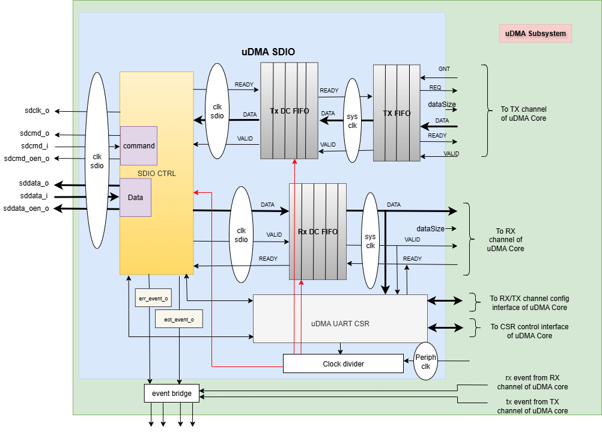
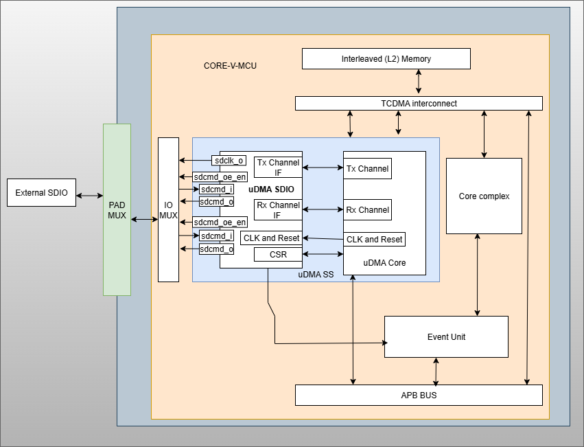
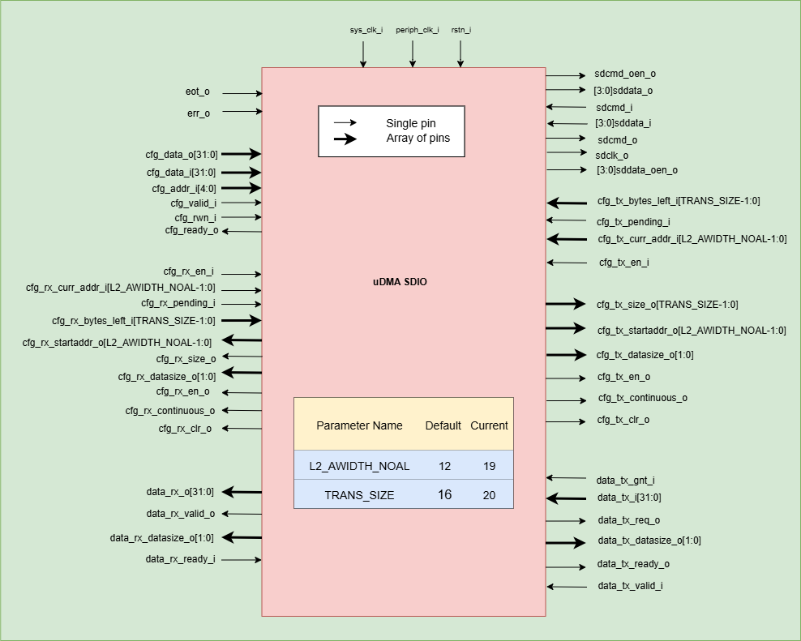

..
   Copyright (c) 2023 OpenHW Group
   Copyright (c) 2024 CircuitSutra Technologies Pvt Ltd

   SPDX-License-Identifier: Apache-2.0 WITH SHL-2.1

.. Level 1
   =======

   Level 2
   -------

   Level 3
   ~~~~~~~

   Level 4
   ^^^^^^^
.. _udma_sd_card_interface:

UDMA SDIO(SD Input/Output) INTERFACE
====================================

The SDIO card provides high speed data I/O with low power consumption for mobile electronic devices. Host devices supporting
SDIO can connect the SD slot with I/O devices like Bluetooth, wireless, LAN, GPS Receiver, Digit Camera etc.

Features
--------

-  It has a clock, command and 4-bit data bus.
-  Supports quad mode.
-  Five types of response supported:

   -  No response
   -  48 bits with CRC
   -  48 bits with CRC and BUSY
   -  48 bits with NO CRC
   -  136 bits

-  Following events are supported:

      - Error event.
      - End of transfer event.+

-  Four error status for receive operation

   -  No error
   -  Response timeout
   -  Response wrong direction
   -  Response busy timeout

- SDIO operation is synchronized using a `sdclk_o` clock whose period can be controlled using CLK_DIV CSR.

Block Architecture
------------------

uDMA SDIO is a peripheral function of the uDMA subsystem. As such, its CSRs are not directly accessible via the APB bus. Rather, the control plane interface to the uDMA SDIO is managed by the uDMA core within the uDMA subsystem.
This is transparent to the programmer, as all uDMA SDIO CSRs appear within the uDMA subsystem's memory region. As is the case for all uDMA subsystem peripherals, I/O operations are controlled by the uDMA core. This is not transparent to the programmer.

The Figure below is a high-level block diagram of the uDMA SDIO:-

   uDMA SDIO Block Diagram

In the block diagram above, the DATA lines at the boundary of the uDMA SDIO are 32 bits wide, whereas other DATA lines are only 8 bits wide. The DATASIZE pin is 2 bits wide and is currently hardcoded to 0x2. The valid values for the DATASIZE pin are: -

- 0x0: 1-byte transfer
- 0x1: 2-byte transfer
- 0x2: 4-byte transfer

uDMA SDIO uses the Tx channel interface to read the data from the interleaved (L2) memory via the uDMA Core. It transmits the read data to the external SDIO device. uDMA SDIO uses the Rx channel interface to store the data received from the external SDIO device to the interleaved (L2) memory.
Refer to `uDMA subsystem <https://github.com/openhwgroup/core-v-mcu/blob/master/docs/doc-src/udma_subsystem.rst>`_ for more information about the Tx and Rx channel functionality of uDMA Core.

Dual clock FIFO
~~~~~~~~~~~~~~~
The uDMA core operates using the system clock, while the uDMA SDIO operates using both the system clock and the peripheral clock.
To ensure the uDMA SDIO and core are properly synchronized, dual-clock FIFOs are used in the uDMA SDIO. These are 4-depth FIFOs and can store 8-bit wide data.
It is implemented using circular FIFO.

Below diagram shows the interfaces of DC FIFO:

.. figure:: uDMA_UART_Dual_clock_fifo.png
   :name: uDMA_UART_Dual_clock_fifo
   :align: center
   :alt:

   Dual clock FIFO

For Rx operation, source(src_*) interfaces shown in above diagram operate at peripheral clock and destination(dst_*) interfaces operate using system clock.

For Tx operation, source interfaces shown in above diagram operate at system clock and destination interfaces operate using peripheral clock. 

**Pop operation**

The DC FIFO asserts the dst_valid_o (valid) signal to indicate that valid data is available on the data lines. A module waiting for data should read the data lines only when valid pin is high and drive the dst_ready_i (ready)
signal to high and reset it in next clock cycle. When DC FIFO receives an active ready signal, indicating that the data has been read, it updates the data lines with new data if FIFO is not empty. 
If the FIFO is empty, the dst_valid_o signal is deasserted.

**Push operation**

The DC FIFO asserts the src_ready_o (ready) signal when there is available space to accept incoming data. When an active src_valid_i (valid) signal is received, the data is written into the FIFO.
The src_ready_o signal is kept asserted as long as the FIFO has space for more data. IF the DC FIFO is full, push operation will be stalled until the FIFO has empty space and valid line is high.
A module transmitting the data to DC FIFO should drive the valid signal low to indicate data lines should not be read.

During SDIO transmit (Tx) operation, the TX DC FIFO is read internally by the SDIO to transmit data to an external device and written by the TX FIFO.
During SDIO receive (Rx) operation, the RX DC FIFO is written internally by the SDIO with the data received from the external device and read by the uDMA core.

TX FIFO
~~~~~~~

uDMA SDIO has a TX FIFO to store the received data from uDMA core. It forwards the data read from L2 memory to the TX DC FIFO. uDMA SDIO on TX path, read the data from TX DC FIFO and transmits it to external device.
It is a 2-depth FIFO and can store 8-bit wide data. Below diagram shows the interfaces of TX FIFO: 

.. figure:: uDMA_UART_TX_FIFO.png
   :name: uDMA_UART_TX_FIFO
   :align: center
   :alt:

   TX FIFO

TX FIFO operates using system clock. clr_i pin is hardcoded with value 0x0.

**Pop operation**

The read interface of the TX FIFO is connected to the TX DC FIFO.
The TX DC FIFO raises ready(ready_i) signal if its FIFO has space. If data is available, TX FIFO asserts the valid_o signal and update the data lines with data.
TX FIFO will update the valid signal and data lines at each clock cycle. If the ready signal is high, data lines will be update with new data, otherwise, data lines will show the last transferred byte.
If the TX FIFO is empty, the valid_o signal remains deasserted, indicating that no valid data is present on the output lines.

**Push operation**

The write interface of the TX FIFO is extended to the uDMA Core. The TX FIFO write operation is performed with the help of the req(req_o) and ready(ready_o) signals.
The TX FIFO keeps the ready_o (ready) signal high until the TX FIFO is full. TX FIFO raises a req_o signal when it has enough space in FIFO, i.e., ready_o is high, and the pending requests at the uDMA core do not exceed the depth of TX FIFO.
TX FIFO receives a GNT (gnt_i) signal from the uDMA core confirming that the request is accepted. TX FIFO maintains a counter to track unserved requests; it applies the following logic to update the counter: -

- When a request (req_o) is issued and granted (gnt_i), the TX FIFO increments the counter if either the valid_i or ready_o signal is low.
- Regardless of the state of the req_o and gnt_i signals, the frame counter is decremented whenever both valid_i and ready_o are high.

When it receives the valid signal from the uDMA core and the FIFO is not full, the TX FIFO pushes the data coming from the uDMA core. 
TX tries to read data at each clock cycle until TX FIFO has space and a valid pin is high.

TX FIFO is transparent to users.

Command
~~~~~~~

SDIO operation is started by generating a command. A host can send a command to either a single card or to all the connected cards. A command is transferred serially on the `sdcmd_o` line.
`sdcmd_oen_o` is pulled low(0) during the transmit operation. MSB is transmitted first and LSB is transmitted last. Direction bit is 1, as command is transmitted from host to device.

+--------------+-----------+------------------+----------------+------------------+-------+---------+
| Bit position | 47        | 46               | [45:40]        | [39:8]           | [7:1] | 0       |
+==============+===========+==================+================+==================+=======+=========+
| Width        | 1         | 1                | 6              | 32               | 7     | 1       |
+--------------+-----------+------------------+----------------+------------------+-------+---------+
| Value        | 0         | 1                | x              | x                | x     | 1       |
+--------------+-----------+------------------+----------------+------------------+-------+---------+
| Description  | Start bit | Direction bit    | Command opcode | Command argument | CRC   | End bit |
+--------------+-----------+------------------+----------------+------------------+-------+---------+

The CMD_OP and CMD_ARG CSRs of uDMA SDIO should be used to configure command opcode and command arguments respectively.

When START bit of REG_START CSR is set, the uDMA SDIO will enable the `sdclk_o` clock. After enabling clocks, uDMA SDIO will drive 0 on `sdcmd_oen_o` and `sdcmd_o` to send a start bit. 

The command will be send in below sequence : -

`Start bit -> Direction bit -> Command opcode -> command arguments -> CRC -> End of transmission`

CRC is calculated based on `x7+x3+1` polynomial function. CRC will calculated on Command opcode and argument field value.

The uDMA SDIO sends a stop command to communicate end of command transfer to the external device. Below is the format of end of command.

+--------------+-----------+------------------+----------------+------------------+-------+---------+
| Bit position | 47        | 46               | [45:40]        | [39:8]           | [7:1] | 0       |
+==============+===========+==================+================+==================+=======+=========+
| Width        | 1         | 1                | 6              | 32               | 7     | 1       |
+--------------+-----------+------------------+----------------+------------------+-------+---------+
| Value        | 0         | 1                |  6'd12         | 32'h0            | X     | 1       |
+--------------+-----------+------------------+----------------+------------------+-------+---------+
| Description  | Start bit | Direction bit    | Command opcode | Command argument | CRC   | End bit |
+--------------+-----------+------------------+----------------+------------------+-------+---------+

After transmitting the stop command, the uDMA SDIO expects RSP_TYPE_48_CRC response from the external device.

**Command Response and Data Flow in uDMA SDIO**

After transmitting a command, the uDMA SDIO can perform subsequent operations based on the DATA_SETUP CSR configuration and the command response setting. The behavior is as follows:

- If the DATA_SETUP CSR indicates a read transaction, the uDMA SDIO initiates a data read (Rx) operation from the external device. The details of this operation are described in the Data Section.
- If SDIO is configured to receive a command response, the response is captured and processed as described in the Response Section.
- If SDIO is not configured to receive a command response or the command response is received:
   - An End-of-Transfer (EOT) interrupt is raised.
   - The uDMA SDIO is then enabled to perform a data write (Tx) operation to the external device, depending on the DATA_SETUP CSR setting.

Response
~~~~~~~~

A response is sent from an external card to the host as an answer to a previously received command. A response is received serially on the `sdcmd_i` line.
`sdcmd_oen_o` is pulled high(1) during the transmit operation. MSB will be read first and LSB will be read last. Direction bit is 0, as response is transmitted from device to host.

The RSP_TYPE bitfield of CMD_OP CSRs can used to configure expected response from the external SDIO device. Following response can be expected from the external device: -

- RSP_TYPE_48_CRC, response length will be 38 bit long.

+--------------+-----------+------------------+----------------+-------------+-------+---------+
| Bit position | 47        | 46               | [45:40]        | [39:8]      | [7:1] | 0       |
+==============+===========+==================+================+=============+=======+=========+
| Width        | 1         | 1                | 6              | 32          | 7     | 1       |
+--------------+-----------+------------------+----------------+-------------+-------+---------+
| Value        | 0         | 0                | x              | x           | x     | 1       |
+--------------+-----------+------------------+----------------+-------------+-------+---------+
| Description  | Start bit | Direction bit    | Command index  | Card status | CRC   | End bit |
+--------------+-----------+------------------+----------------+-------------+-------+---------+

- RSP_TYPE_48_BSY, response length will be 38 bit long.

+--------------+-----------+------------------+----------------+-------------+-------+---------+
| Bit position | 47        | 46               | [45:40]        | [39:8]      | [7:1] | 0       |
+==============+===========+==================+================+=============+=======+=========+
| Width        | 1         | 1                | 6              | 32          | 7     | 1       |
+--------------+-----------+------------------+----------------+-------------+-------+---------+
| Value        | 0         | 0                | x              | x           | x     | 1       |
+--------------+-----------+------------------+----------------+-------------+-------+---------+
| Description  | Start bit | Direction bit    | Command index  | Card status | CRC   | End bit |
+--------------+-----------+------------------+----------------+-------------+-------+---------+

- RSP_TYPE_48_NOCRC, response length will be 38 bit long.

+--------------+-----------+------------------+----------------+-------------+----------+---------+
| Bit position | 47        | 46               | [45:40]        | [39:8]      | [7:1]    | 0       |
+==============+===========+==================+================+=============+==========+=========+
| Width        | 1         | 1                | 6              | 32          | 7        | 1       |
+--------------+-----------+------------------+----------------+-------------+----------+---------+
| Value        | 0         | 0                | x              | x           | 1111111  | 1       |
+--------------+-----------+------------------+----------------+-------------+----------+---------+
| Description  | Start bit | Direction bit    | Command index  | Card status | Reserved | End bit |
+--------------+-----------+------------------+----------------+-------------+----------+---------+

- RSP_TYPE_136, response length will be 134 bit long.

+---------------+-----------+------------------+-----------+--------------------------------+---------+
| Bit position  | 135       | 134              | [133:128] | [127:1]                        | 0       |
+===============+===========+==================+===========+================================+=========+
| Width         | 1         | 1                | 6         | 127                            | 1       |
+---------------+-----------+------------------+-----------+--------------------------------+---------+
| Value         | 0         | 0                | 111111    | x                              | 1       |
+---------------+-----------+------------------+-----------+--------------------------------+---------+
| Description   | Start bit | Direction bit    | Reserved  | Response content including CRC | End bit |
+---------------+-----------+------------------+-----------+--------------------------------+---------+

If any of the above response is selected via RSP_TYPE bitfield of CMD_OP CSRs then the uDMA SDIO will wait for a response after sending command.
To receive response, uMDA QSPI drives `sdcmd_oen_o` with value 1 and expects `sdcmd_i` pin to have value 0(indicating start bit) within 38 clock cycles. If uDMA SDIO does not receive response from the external device within 38 `sdclk_o` clock cycle, it updates the command STATUS to STATUS_RSP_TIMEOUT and does not wait for the response.
If command response is received successfully, uDMA SDIO validates if the direction bit received at `sdcmd_i` pin. If the value at the `sdcmd_i` pin is non-zero than it updates the command STATUS to STATUS_RSP_WRONG_DIR. After validating direction, uDMA SDIO will read data up to response length.
If Response expects the CRC value then uDMA SDIO reads the command CRC and perform CRC validation. In case of RSP_TYPE_48_BSY response, the uDMA SDIO expects that data lines to be inactive, if not, uDMA SDIO retry after 8 clock cycles to confirm whether data lines are free or not. If the data lines are busy even after 8 clock cycles then SDIO updates the command STATUS to STATUS_RSP_BUSY_TIMEOUT.
The SDIO, irrespective of whether data lines are busy or not spends 8 clock cycle before raising eot interrupt. Apart from asserting EOT interrupt , the uDMA SDIO enable SDIO to perform data write (Tx) operation to the external device.

CRC is calculated based on `x7+x3+1` polynomial function.

The response data can be read from REG_RSPx{x = 0 to 3} CSR of SDIO.

Data
~~~~

Data can be transferred from the external device to the host uDMA SDIO or vice versa. It is transferred via the data lines.

Data transfer to/from the host is done in blocks. Data blocks are succeeded by CRC bits.

Tx operation
^^^^^^^^^^^^

The uDMA SDIO can be configured to perform Tx operation based on the below conditions: 

a) When command response is needed
   - RWN bit of DATA_SETUP CSR is 0 and EN bit of DATA_SETUP CSR is 1 and command response is received.

b) When command response is not needed
   - RWN bit of DATA_SETUP CSR is 0 and EN bit of DATA_SETUP CSR is 1 and command is sent.

To initiate Tx operation, uDMA Core will drive 1 on `sddata_oen_o` line. Data will be transmitted over `sddata_o` data lines in below sequence: - 

`Start bit -> Data -> CRC - > End`

To send start bit, the uDMA SDIO will drive the `sddata_o` will value 0. CRC for Tx operation is calculated based on `x16+x12+x5+1` polynomial function. CRC is calculated by the SDIO on the data received from the L2 memory.

To get transmit data from L2 memory TX FIFO requests data from the uDMA core by asserting both the READY (space available) and REQ (request a new transaction) signals. The uDMA core arbitrates among multiple peripherals on receiving the REQ signal. When the SDIO TX channel is enabled and wins arbitration, the uDMA core issues a GNT (grant) signal and places the valid data read from L2 memory on the bus along with asserting VALID signal.
Tx FIFO stores this received data and keeps the READY and REQ signals asserted as long as the aforementioned conditions remain valid. The uDMA core de-asserts the VALID signal in the following clock cycle and reasserts it only when new data is available for transmission. Initially, after reset or power-up, READY/REQ are asserted since the FIFO is empty.

Whenever TX FIFO has valid data and the TX DC FIFO has shown readiness to accept data by asserting READY signal, it asserts VALID signal and update the data lines of DC FIFO with the valid data. The data transmission from TX FIFO to TX DC FIFO is synchronized using system clock. TX DC FIFO de-asserts READY when it is full, temporarily stalling the upstream TX FIFO.
Once space is freed, READY is re-asserted. Data moves from TX FIFO to TX DC FIFO when both VALID and READY are high on the same cycle.

The uDMA SDIO must be configured using the TX_SADDR, TX_SIZE and TX_CFG CSRs to read transmit data from L2 memory.

Rx Operation
^^^^^^^^^^^^

Rx operation is initiated when RWN and EN bit of DATA_SETUP CSR is 1 and command is sent. 
The uDMA SDIO receives data on the `sddata_i` data lines. Data will be received  over `sddata_i` data lines in below sequence: - 

`Start bit -> Data -> CRC - > End`

To receive response, uMDA QSPI  expects `sddata_i` pin to have value 0(indicating start bit) within BLOCK_NUM clock cycles. If uDMA SDIO does not receive response from the external device within BLOCK_NUM `sdclk_o` clock cycle, it updates the Rx STATUS to STATUS_RSP_TIMEOUT and does not wait for the response.
After successfully receiving the start bit, it reads BLOCK_SIZE data and 16 bit crc values. After successfully reading BLOCK_NUM data and subsequent crc bits, uDMA SDIO sets the EOT bit of STATUS CSR. Reading EOT bit will clear it.
The uDMA SDIO reads the start bit, BLOCK_SIZE data and 16 bit crc values for BLOCK_NUM to complete Rx operation.

The uDMA SDIO pushes each BLOCK_SIZE data and CRC into the RX DC FIFO. The uDMA SDIO when it has data asserts the valid lines of RX DC FIFO.
RX DC FIFO reads the data lines and asserts the valid lines for uDMA core to indicate the availability of new data.

To store the received data into L2 memory, the uDMA SDIO must be programmed with RX_SADDR, RX_SIZE and RX_CFG CSRs.

On detecting the valid signal, the uDMA core arbitrates for access. If the uDMA SDIO RX channel wins the arbitration and the core's RX FIFO has space, uDMA core asserts READY, latching the data from RX DC FIFO.
The data is then written into L2 memory at the address specified by RX_SADDR, with automatic increment for subsequent bytes. The cycle repeats until the entire transfer (as defined by RX_SIZE) completes.

CRC for both Rx and Tx operation is calculated based on `x16+x12+x5+1` polynomial function.

Interrupt
~~~~~~~~~

uDMA SDIO generates the following interrupts:

- Error interrupt: Raised by uDMA SDIO when it encounter error while performing command-response reception or Rx/Tx operation.
- End of transfer interrupt: Raised by uDMA SDIO after successfully completing Rx/Tx operation.
- Rx channel interrupt: Raised by uDMA core's Rx channel after pushing the last byte of RX_SIZE bytes into core RX FIFO.
- Tx channel interrupt: Raised by uDMA core's Tx channel after pushing the last byte of TX_SIZE bytes into core TX FIFO.

The RX and TX channel interrupts are cleared by the uDMA core if any of the following conditions occur:

- If a clear request for the RX or TX uDMA core channel is triggered via the CLR bitfield in the respective RX or TX CFG CSR of the uDMA SDIO.
- If either the RX or TX uDMA channel is disabled via the CFG CSR of the uDMA SDIO, or if access is not granted by the uDMA core's arbiter.
- If continuous mode is enabled for the RX or TX uDMA channel through the CFG CSR of the SDIO uDMA.

RX and TX channel interrupts are transparent to users.

The event bridge forwards interrupts over dedicated lines to the APB event controller for processing. Each interrupt has its own dedicated line.
Users can mask these interrupts through the APB event controller's control and status registers (CSRs).

System Architecture
-------------------

The figure below shows how the uDMA SDIO interfaces with the rest of the CORE-V-MCU components and the external SDIO device:-

   uDMA SDIO CORE-V-MCU connection diagram

Programming Model
------------------

As with most peripherals in the uDMA Subsystem, software configuration for the uDMA SDIO  interface can be conceptualized into three key steps:

- I/O Configuration: Set up external clock and chip select and output enable lines.
- uDMA core Setup:  Configure source/destination addresses, transfer size, and direction for TX and RX operation using channel CSRs. This enables efficient data movement from L2 memory to SDIO  via uDMA core. Update the L2 memory with command sequence to configure SDIO controller.
- Data Transfer Management: Read command sequence from L2 memory to configure SDIO for RX/TX operation. Drive SDIO bus based on the received command sequence.

Refer to the Firmware Guidelines section in the current chapter for more information.

uDMA SDIO CSRs
--------------

Refer to `Memory Map <https://github.com/openhwgroup/core-v-mcu/blob/master/docs/doc-src/mmap.rst>`_ for peripheral domain address of the uDMA SDIO.

**NOTE:** Several of the uDMA SDIO CSRs are volatile, meaning that their read value may be changed by the hardware.
For example, writing the *RX_SADDR* CSR will set the address of the receive buffer pointer.
As data is received, the hardware will update the value of the pointer to indicate the current address.
As the name suggests, the value of non-volatile CSRs is not changed by the hardware.
These CSRs retain the last value written by software.

A CSR's volatility is indicated by its "type".

Details of CSR access type are explained `here <https://docs.openhwgroup.org/projects/core-v-mcu/doc-src/mmap.html#csr-access-types>`_.

The CSRs RX_SADDR and RX_SIZE specify the configuration for the transaction on the RX channel. The CSRs TX_SADDR and TX_SIZE specify the configuration for the transaction on the TX channel. The uDMA Core creates a local copy of this information at its end and uses it for current ongoing transactions.

RX_SADDR
~~~~~~~~

- Offset: 0x0
- Type:   volatile

+--------+------+--------+------------+-----------------------------------------------------------------------------------------------------------+
| Field  | Bits | Access | Default    | Description                                                                                               |
+========+======+========+============+===========================================================================================================+
| SADDR  | 18:0 | RW     |    0x0     | Address of the Rx buffer. This is location in the L2 memory where SDIO will write the received data.      |
|        |      |        |            | Read & write to this CSR access different information.                                                    |
|        |      |        |            |                                                                                                           |
|        |      |        |            | **On Write**: Address of Rx buffer for next transaction. It does not impact current ongoing transactions. |
|        |      |        |            |                                                                                                           |
|        |      |        |            | **On Read**: Address of read buffer for the current ongoing transaction. This is the local copy of        |
|        |      |        |            | information maintained inside the uDMA core.                                                              |
+--------+------+--------+------------+-----------------------------------------------------------------------------------------------------------+

RX_SIZE
~~~~~~~

- Offset: 0x04
- Type:   volatile

+-------+-------+--------+------------+--------------------------------------------------------------------------------------------+
| Field |  Bits | Access | Default    | Description                                                                                |
+=======+=======+========+============+============================================================================================+
| SIZE  |  19:0 |   RW   |    0x0     | Size of Rx buffer (amount of data to be transferred by SDIO to L2 memory). Read & write    |
|       |       |        |            | to this CSR access different information.                                                  |
|       |       |        |            |                                                                                            |
|       |       |        |            | **On Write**: Size of Rx buffer for next transaction. It does not impact current ongoing   |
|       |       |        |            | transaction.                                                                               |
|       |       |        |            |                                                                                            |
|       |       |        |            | **On Read**: Bytes left for current ongoing transaction. This is the local copy of         |
|       |       |        |            | information maintained inside the uDMA core.                                               |
+-------+-------+--------+------------+--------------------------------------------------------------------------------------------+

RX_CFG
~~~~~~

- Offset: 0x08
- Type:   volatile

+------------+-------+--------+------------+------------------------------------------------------------------------------------+
| Field      |  Bits | Access | Default    | Description                                                                        |
+============+=======+========+============+====================================================================================+
| CLR        |   6:6 |   WO   |    0x0     | Clear the local copy of Rx channel configuration CSRs inside uDMA core             |
+------------+-------+--------+------------+------------------------------------------------------------------------------------+
| PENDING    |   5:5 |   RO   |    0x0     | - 0x1: The uDMA core Rx channel is enabled and either transmitting data,           |
|            |       |        |            |   waiting for access from the uDMA core arbiter, or stalled due to a full Rx FIFO  |
|            |       |        |            |   of uDMA Core                                                                     |
|            |       |        |            | - 0x0 : Rx channel of the uDMA core does not have data to transmit to L2 memory.   |
+------------+-------+--------+------------+------------------------------------------------------------------------------------+
| EN         |   4:4 |   RW   |    0x0     | Enable the Rx channel of the uDMA core to perform Rx operation                     |
+------------+-------+--------+------------+------------------------------------------------------------------------------------+
| CONTINUOUS |   0:0 |   RW   |    0x0     | - 0x0: stop after last transfer for channel                                        |
|            |       |        |            | - 0x1: after last transfer for channel, reload buffer size                         |
|            |       |        |            |   and start address and restart channel                                            |
+------------+-------+--------+------------+------------------------------------------------------------------------------------+

TX_SADDR
~~~~~~~~

- Offset: 0x10
- Type:   volatile

+-------+-------+--------+------------+--------------------------------------------------------------------------------------------------------------+
| Field |  Bits | Access | Default    | Description                                                                                                  |
+=======+=======+========+============+==============================================================================================================+
| SADDR |  18:0 |   RW   |    0x0     | Address of the Tx buffer. This is location in the L2 memory from where SDIO will read the data to transmit.  |
|       |       |        |            | Read & write to this CSR access different information.                                                       |
|       |       |        |            |                                                                                                              |
|       |       |        |            | **On Write**: Address of Tx buffer for next transaction. It does not impact current ongoing transactions.    |
|       |       |        |            |                                                                                                              |
|       |       |        |            | **On Read**: Address of Tx buffer for the current ongoing transaction. This is the local copy of information.|
|       |       |        |            | maintained inside the uDMA core.                                                                             |
+-------+-------+--------+------------+--------------------------------------------------------------------------------------------------------------+

TX_SIZE
~~~~~~~

- Offset: 0x14
- Type:   volatile

+-------+-------+--------+------------+--------------------------------------------------------------------------------------------------------+
| Field |  Bits | Access | Default    | Description                                                                                            |
+=======+=======+========+============+========================================================================================================+
| SIZE  |  19:0 |   RW   |    0x0     | Size of Tx buffer (amount of data to be read by SDIO from L2 memory for Tx operation). Read & write    |
|       |       |        |            | to this CSR access different information.                                                              |
|       |       |        |            |                                                                                                        |
|       |       |        |            | **On Write**: Size of Tx buffer for next transaction. It does not impact current ongoing transactions. |
|       |       |        |            |                                                                                                        |
|       |       |        |            | **On Read**: Bytes left for current ongoing transaction, i.e., bytes left to read from L2 memory. This |
|       |       |        |            | is the local copy of information maintained inside the uDMA core.                                      |
+-------+-------+--------+------------+--------------------------------------------------------------------------------------------------------+

TX_CFG
~~~~~~

- Offset: 0x18
- Type:   volatile

+------------+-------+--------+------------+------------------------------------------------------------------------------------+
| Field      |  Bits | Access | Default    | Description                                                                        |
+============+=======+========+============+====================================================================================+
| CLR        |   6:6 |   WO   |    0x0     | Clear the local copy of Tx channel configuration CSRs inside uDMA core             |
+------------+-------+--------+------------+------------------------------------------------------------------------------------+
| PENDING    |   5:5 |   RO   |    0x0     | - 0x1: The uDMA core Tx channel is enabled and is either receiving data,           |
|            |       |        |            |   waiting for access from the uDMA core arbiter, or stalled due to a full Tx FIFO  |
|            |       |        |            | - 0x0 : Tx channel of the uDMA core does not have data to read from L2 memory      |
+------------+-------+--------+------------+------------------------------------------------------------------------------------+
| EN         |   4:4 |   RW   |    0x0     | Enable the transmit channel of uDMA core to perform Tx operation                   |
+------------+-------+--------+------------+------------------------------------------------------------------------------------+
| CONTINUOUS |   0:0 |   RW   |            | - 0x0: stop after last transfer for channel                                        |
|            |       |        |    0x0     | - 0x1: after last transfer for channel, reload buffer size                         |
|            |       |        |            |   and start address and restart channel                                            |
+------------+-------+--------+------------+------------------------------------------------------------------------------------+

CMD_OP
~~~~~~

- Offset: 0x20
- Type:   non-volatile

+-----------+--------+--------+------------+---------------------------------------------------------------------+
| Field     | Bits   | Access | Default    | Description                                                         |
+===========+========+========+============+=====================================================================+
| OP        | 13:8   | W      | 0x00       | Operation code specifying the command or function to be performed.  |
|           |        |        |            | This 6-bit field selects the type of operation initiated by the     |
|           |        |        |            | controller or processor.                                            |
+-----------+--------+--------+------------+---------------------------------------------------------------------+
| RSP_TYPE  | 2:0    | W      | 0x0        | Response type expected for the issued operation. This 3-bit field   |
|           |        |        |            | defines the format or presence of the response data.                |
|           |        |        |            |                                                                     |
|           |        |        |            |  - 3'b001: RSP_TYPE_48_CRC , response length will be 48 bit long.   |
|           |        |        |            |  - 3'b010: RSP_TYPE_48_NOCRC , response length will be 48 bit long. |
|           |        |        |            |  - 3'b011: RSP_TYPE_136 , response length will be 136 bit long.     |
|           |        |        |            |  - 3'b100: RSP_TYPE_48_BSY , response length will be 48 bit long.   |
|           |        |        |            |                                                                     |
+-----------+--------+--------+------------+---------------------------------------------------------------------+

CMD_ARG
~~~~~~~

- Offset: 0x24
- Type:   non-volatile

+--------+--------+--------+------------+---------------------------------------------------------------------+
| Field  | Bits   | Access | Default    | Description                                                         |
+========+========+========+============+=====================================================================+
| ARG    | 31:0   | W      | 0x00000000 | Argument value associated with the command operation. This 32-bit   |
|        |        |        |            | field provides optional or required data used by the command        |
|        |        |        |            | specified in the `OP` field. The meaning of this field depends on   |
|        |        |        |            | the command type and context.                                       |
+--------+--------+--------+------------+---------------------------------------------------------------------+

DATA_SETUP
~~~~~~~~~~

- Offset: 0x28
- Type:   non-volatile

+-------------+--------+--------+------------+---------------------------------------------------------------------+
| Field       | Bits   | Access | Default    | Description                                                         |
+=============+========+========+============+=====================================================================+
| BLOCK_SIZE  | 25:16  | W      | 0x000      | Specifies the size of each data block to be transferred, in bytes.  |
|             |        |        |            | Typically used to define the transfer chunk size for multi-block    |
|             |        |        |            | operations.                                                         |
+-------------+--------+--------+------------+---------------------------------------------------------------------+
| BLOCK_NUM   | 15:8   | W      | 0x00       | Number of blocks to be transferred. This value works together       |
|             |        |        |            | with `BLOCK_SIZE` to determine total transfer size.                 |
+-------------+--------+--------+------------+---------------------------------------------------------------------+
| QUAD        | 2:2    | W      | 0x0        | Enables Quad SPI mode when set to `1`. In this mode, 4 data lines   |
|             |        |        |            | are used for faster data transfer. Set to `0` for standard mode.    |
+-------------+--------+--------+------------+---------------------------------------------------------------------+
| RWN         | 1:1    | W      | 0x0        | Read/Write control: `0` indicates a write operation, `1` indicates  |
|             |        |        |            | a read operation.                                                   |
+-------------+--------+--------+------------+---------------------------------------------------------------------+
| EN          | 0:0    | W      | 0x0        | Enable bit. When set to `1`, triggers the start of the read-write   |
|             |        |        |            | operation. Read-write is decided based on the RWN bitfield.         |
+-------------+--------+--------+------------+---------------------------------------------------------------------+

REG_START
~~~~~~~~~

- Offset: 0x2C
- Type:   non-volatile

+--------+--------+--------+------------+------------------------------------------------------------------------------+
| Field  | Bits   | Access | Default    | Description                                                                  |
+========+========+========+============+==============================================================================+
| START  | 0:0    | W      | 0x0        | Start bit. Writing `1` to this bit initiates the command transmit operation  |
+--------+--------+--------+------------+------------------------------------------------------------------------------+

REG_RSP0
~~~~~~~~

- Offset: 0x30
- Type:   volatile

+---------+-------+--------+------------+--------------------------------------------------------------------+
| Field   |  Bits | Access | Default    | Description                                                        |  
+=========+=======+========+============+====================================================================+
|   DATA  |  31:0 |   R    |     0x0    |  Represents the 31:0 bits of RSP data                              |
+---------+-------+--------+------------+--------------------------------------------------------------------+

REG_RSP1
~~~~~~~~

- Offset: 0x34
- Type:   volatile

+---------+-------+--------+------------+--------------------------------------------------------------------+
| Field   |  Bits | Access | Default    | Description                                                        |  
+=========+=======+========+============+====================================================================+
|   DATA  |  31:0 |   R    |     0x0    |  Represents the 63:32 bits of RSP data                             |
+---------+-------+--------+------------+--------------------------------------------------------------------+

REG_RSP2
~~~~~~~~

- Offset: 0x38
- Type:   volatile

+---------+-------+--------+------------+--------------------------------------------------------------------+
| Field   |  Bits | Access | Default    | Description                                                        |  
+=========+=======+========+============+====================================================================+
|   DATA  |  31:0 |   R    |     0x0    |  Represents the 95:64 bits of RSP data                             |
+---------+-------+--------+------------+--------------------------------------------------------------------+

REG_RSP3
~~~~~~~~

- Offset: 0x3C
- Type:   volatile

+---------+-------+--------+------------+--------------------------------------------------------------------+
| Field   |  Bits | Access | Default    | Description                                                        |  
+=========+=======+========+============+====================================================================+
|   DATA  |  31:0 |   R    |     0x0    |  Represents the 127:96 bits of RSP data                            |
+---------+-------+--------+------------+--------------------------------------------------------------------+

CLK_DIV
~~~~~~~

- Offset: 0x40
- Type:   non-volatile

+-----------+-------+--------+------------+--------------------------------------------------------------------+
| Field     | Bits  | Access | Default    | Description                                                        |
+===========+=======+========+============+====================================================================+
| DIV_VALID | 8:8   | RW     | 0x0        | Indicates whether the value in `DIV_DATA` is valid. When set to    |
|           |       |        |            | `1`, the divider logic uses the value in `DIV_DATA`. When `0`,     |
|           |       |        |            | the divider is considered inactive or disabled.                    |
+-----------+-------+--------+------------+--------------------------------------------------------------------+
| DIV_DATA  | 7:0   | RW     | 0x0        | 8-bit divider value to be used when `DIV_VALID` is set. This       |
|           |       |        |            | value typically controls the clock division ratio or timing        |
|           |       |        |            | behavior of a functional block.                                    |
+-----------+-------+--------+------------+--------------------------------------------------------------------+

STATUS
~~~~~~

- Offset: 0x44
- Type:   volatile

+---------+-------+--------+------------+-----------------------------------------------------------------------------+
| Field   |  Bits | Access | Default    | Description                                                                 |  
+=========+=======+========+============+=============================================================================+
|  STATUS | 31:16 |  RW    |   0x0      | - Bits [21:16] represent the Command Status, a 6-bit field indicating       |
|         |       |        |            |      the state or result of the most recent command execution.              |
|         |       |        |            |                                                                             |
|         |       |        |            |         - 6'b000001: STATUS_RSP_TIMEOUT                                     |
|         |       |        |            |         - 6'b000010: STATUS_RSP_WRONG_DIR                                   |
|         |       |        |            |         - 6'b000100: STATUS_RSP_BUSY_TIMEOUT                                |
|         |       |        |            |                                                                             |
|         |       |        |            | - Bits [29:24] represent the TXRX Status, a 6-bit field indicating          |
|         |       |        |            |      the transmit/receive state of the interface.                           |
|         |       |        |            |                                                                             |
|         |       |        |            |         - 6'b000001: STATUS_RSP_TIMEOUT                                     |
|         |       |        |            |                                                                             |
|         |       |        |            | - Bits [23:22] and [31:30] are reserved and should be ignored by software.  |
|         |       |        |            |      They hold no functional meaning and may be read as zero or undefined.  |
+---------+-------+--------+------------+-----------------------------------------------------------------------------+
|  ERR    | 1:1   |  RWC   |   0x0      |  Writing any value clears the bit. Indicates error either                   |
|         |       |        |            |  during data or command-response reception.                                 |
|         |       |        |            |                                                                             |
|         |       |        |            |   - 0x0: No error                                                           |
|         |       |        |            |   - 0x1: Error                                                              |
|         |       |        |            |                                                                             |
+---------+-------+--------+------------+-----------------------------------------------------------------------------+
|  EOT    | 0:0   |  RWC   |   0x0      |  Writing any value clears the bit.                                          |
|         |       |        |            |                                                                             |
|         |       |        |            |  - 0x1: End of transmission (data or command) or reception                  |
|         |       |        |            |                                                                             |
+---------+-------+--------+------------+-----------------------------------------------------------------------------+

Firmware Guidelines
-------------------

Clock Enable, Reset & Configure uDMA SDIO
~~~~~~~~~~~~~~~~~~~~~~~~~~~~~~~~~~~~~~~~~

- Configure uDMA Core's PERIPH_CLK_ENABLE to enable uDMA SDIO's peripheral clock. A peripheral clock is used to calculate the baud rate in uDMA SDIO.
- Configure uDMA Core's PERIPH_RESET CSR to issue a reset signal to uDMA SDIO. It acts as a soft reset for uDMA SDIO.
- Configure uDMA SDIO's CLK_DIV CSR to update the period of SDIO clock.

Command
~~~~~~~

- Configure CMD_OP with command opcode and response type expected after transmitting command to the external device.
- Configure CMD_ARG with the argument associated with the command opcode selected via CMD_OP bitfield.
- Configure REG_START CSR to initiate command transfer from SDIO to the external device.
- if RSP_TYPE bitfield is configured with response type then REG_RSPx{x = 0 to 3} shall be read to get the received response from the external device.

Tx Operation
~~~~~~~~~~~~

- Configure the TX channel using the TX_CFG CSR. Refer to the CSR details for detailed information.
- For each transaction:
   - Update uDMA SDIO's TX_SADDR CSR with an interleaved (L2) memory address. SDIO will read the data from this memory address for transmission.
   - Configure the uDMA SDIO's TX_SIZE CSR with the size of data that the SDIO needs to transmit. uDMA SDIO will copy the transmit TX_SIZE bytes of data from the TX_SADDR location of interleaved memory.
- Configure DATA_SETUP setup CSR to enable transmit of data from the L2 memory to the external. The Tx operation is start only successfully command transfer. Refere to the DATA_SETUP CSR for more information.

The uDMA SDIO can be configured to perform Tx operation based on the below conditions: 

a) When command response is needed
   - RWN bit of DATA_SETUP CSR is 0 and EN bit of DATA_SETUP CSR is 1 and command response is received.

b) When command response is not needed
   - RWN bit of DATA_SETUP CSR is 0 and EN bit of DATA_SETUP CSR is 1 and command already transferred.

Rx Operation
~~~~~~~~~~~~

- Configure the RX channel using the RX_CFG CSR. Refer to the CSR details for detailed information.
- For each transaction:
   - Update uDMA SDIO's RX_SADDR CSR with an interleaved (L2) memory address. SDIO will write the data to this memory address for transmission.
   - Configure uDMA SDIO's RX_SIZE CSR with the size of data that SDIO needs to transmit. uDMA SDIO will copy the transmit RX_SIZE bytes of data to the RX_SADDR location of interleaved memory.
- Configure DATA_SETUP setup CSR to enable transmit of data from the L2 memory to the external. The Tx operation is start only successfully command transfer. Refere to the DATA_SETUP CSR for more information.

The uDMA SDIO can be configured to perform Tx operation based on the below conditions: 
- Rx operation is initiated when RWN and EN bit of DATA_SETUP CSR is 1 and command is already transferred.

- STATUS bit of the STATUS CSR reflects the status of Rx operation.

End of transfer Interrupt
~~~~~~~~~~~~~~~~~~~~~~~~~

- The uDMA SDIO asserts end of transmission event when it completes either Tx or Rx operation. EOT bit of STATUS CSR reflects the error status. The end of transfer interrupt is automatically cleared in the next clock cycle.

Error interrupt
~~~~~~~~~~~~~~~

- The uDMA SDIO asserts error event when it faces an error during either reception of command-response or data from the external device. ERR bit of STATUS CSR reflects the error status.  The error interrupt is automatically cleared in the next clock cycle.

Pin Diagram
-----------
The Figure below is a high-level block diagram of the uDMA: -

   uDMA SDIO Pin Diagram

Below is a categorization of these pins:

Tx channel interface
~~~~~~~~~~~~~~~~~~~~

The following pins constitute the Tx channel interface of uDMA SDIO. uDMA SDIO uses these pins to read data from interleaved (L2) memory:

- data_tx_req_o
- data_tx_gnt_i
- data_tx_datasize_o
- data_tx_i
- data_tx_valid_i
- data_tx_ready_o

Data_tx_datasize_o  pin is hardcoded to value 0x0. These pins reflect the configuration values for the next transaction.

Rx channel interface
~~~~~~~~~~~~~~~~~~~~

The following pins constitute the Rx channel interface of uDMA SDIO. uDMA SDIO uses these pins to write data to interleaved (L2) memory:

- data_rx_datasize_o
- data_rx_o
- data_rx_valid_o
- data_rx_ready_i

 data_rx_datasize_o pin is hardcoded to value 0x0. These pins reflect the configuration values for the next transaction.

Clock interface
~~~~~~~~~~~~~~~

- sys_clk_i
- periph_clk_i

uDMA CORE derives these clock pins. periph_clk_i is used to calculate baud rate. sys_clk_i is used to synchronize SDIO with uDAM Core.

Reset interface
~~~~~~~~~~~~~~~

- rstn_i

uDMA core issues reset signal to SDIO using reset pin. This is active low signal.

uDMA SDIO bus interface
~~~~~~~~~~~~~~~~~~~~~~~

**command interface**

- sdcmd_o
- sdcmd_i
- sdcmd_oen_o

sdcmd_oen_o is an active low signal. It is enabled during transfer of command and is disabled during
reception of response.

**data interface**

- sddata_o
- sddata_i
- sddata_oen_o

sddata_oen_o is an active low signal. It is enabled during transfer of command and is disabled during
reception of response.

**sdio clock**

- sdclk_o

uDMA SDIO interface to generate interrupt
~~~~~~~~~~~~~~~~~~~~~~~~~~~~~~~~~~~~~~~~~

- eot_o
- err_o

eot_o interrupt is generated at the end of receive or transmit operation. `err_o`interrupt is generated when an error is observed during receive operation. These are active high signal.

uDMA SDIO interface to read-write CSRs
~~~~~~~~~~~~~~~~~~~~~~~~~~~~~~~~~~~~~~

The following interfaces are used to read and write to SDIO CSRs. These interfaces are managed by uDMA Core:

- cfg_data_i
- cfg_addr_i
- cfg_valid_i
- cfg_rwn_i
- cfg_ready_o
- cfg_data_o

uDMA SDIO Rx channel configuration interface
~~~~~~~~~~~~~~~~~~~~~~~~~~~~~~~~~~~~~~~~~~~~

- uDMA SDIO uses the following pins to share the value of config CSRs, i.e., RX_SADDR, RX_SIZE, and RX_CFG, with the uDMA core: -

   - cfg_rx_startaddr_o
   - cfg_rx_size_o
   - cfg_rx_datasize_o
   - cfg_rx_continuous_o
   - cfg_rx_en_o
   - cfg_rx_clr_o

   The cfg_rx_datasize_o pin is stubbed.

- SDIO shares the values present over the below pins as read values of the config CSRs, i.e. RX_SADDR, RX_SIZE, and RX_CFG:

   - cfg_rx_en_i
   - cfg_rx_pending_i
   - cfg_rx_curr_addr_i
   - cfg_rx_bytes_left_i

   These values are updated by the uDMA core and reflect the configuration values for the current ongoing transactions.

uDMA SDIO Tx channel configuration interface
~~~~~~~~~~~~~~~~~~~~~~~~~~~~~~~~~~~~~~~~~~~~

- uDMA SDIO uses the following pins to share the value of config CSRs, i.e., TX_SADDR, TX_SIZE, and TX_CFG, with the uDMA core: -

   - cfg_tx_startaddr_o
   - cfg_tx_size_o
   - cfg_tx_datasize_o
   - cfg_tx_continuous_o
   - cfg_tx_en_o
   - cfg_tx_clr_o

  The cfg_tx_datasize_o pin is stubbed.

- SDIO shares the values present over the below pins as read values of the config CSRs, i.e., TX_SADDR, TX_SIZE, and TX_CFG:

   - cfg_tx_en_i
   - cfg_tx_pending_i
   - cfg_tx_curr_addr_i
   - cfg_tx_bytes_left_i

   These values are updated by the uDMA core and reflect the configuration values for the current ongoing transactions.