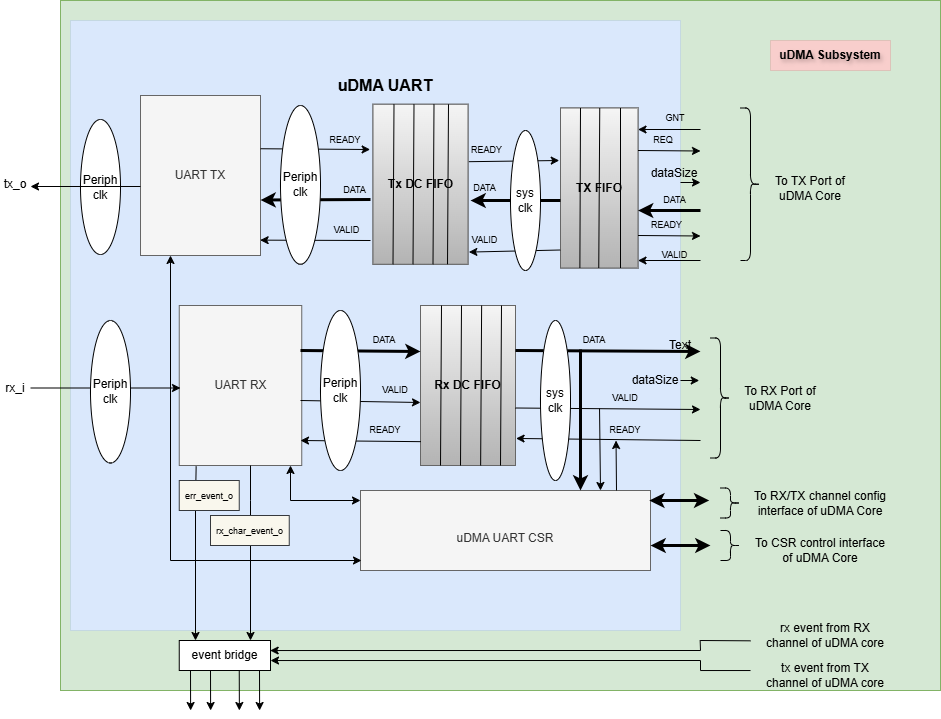
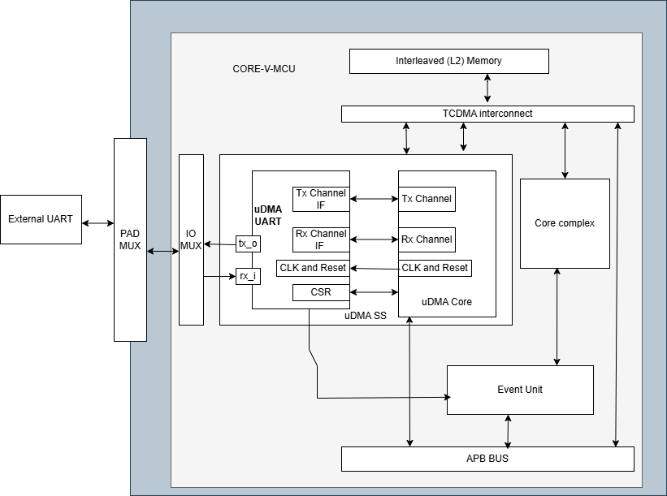
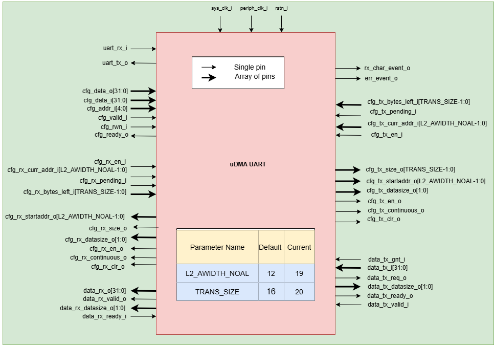

..
   Copyright (c) 2023 OpenHW Group

   SPDX-License-Identifier: Apache-2.0 WITH SHL-2.1

.. Level 1
   =======

   Level 2
   -------

   Level 3
   ~~~~~~~

   Level 4
   ^^^^^^^

.. _udram_uart:

uDMA UART
=========

The uDMA UART (Universal Asynchronous Receiver/Transmitter) implements an asynchronous serial communication protocol for both transmission and reception of data. It is designed to provide a simple, efficient, and flexible interface for serial communication.
Core-V-MCU CV32E40P (v1.0.0) has two uart instances. The uDMA Universal Asynchronous Receiver Transmitter supports most standard options for UART Tx/Rx.

Features
--------
- Configurable number of data bits: 5 to 8.
- Configurable number of stop bits: 1 or 2.
- Includes an optional parity bit at the end of the data bits during transmission or checks the parity bit in case of a reception.
- One configuration CSR, ``UART_SETUP`` to configure both the transmit and receive blocks.
- Tx and Rx channels are fully decoupled and support full-duplex communication.
- Baud rate is determined by configuring a counter, which is driven by ``ref_clk``. The counter is configured with a divisor (``DIV`` bit of ``UART_SETUP``) that determines how many ref_clk cycles correspond to one baud cycle.
- Supports both polling and interrupt mode.

Block Architecture
------------------

uDMA UART is a peripheral function of the uDMA subsystem. As such, its CSRs are not directly accessible via the APB bus. Rather, the control plane interface to the uDMA UART is managed by the uDMA core within the uDMA subsystem.
This is transparent to the programmer, as all uDMA UART CSRs appear within the uDMA subsystem's memory region. As is the case for all uDMA subsystem peripherals, I/O operations are controlled by the uDMA core. This is not transparent to the programmer.

The Figure below is a high-level block diagram of the uDMA UART:-

   uDMA UART Block Diagram

In the block diagram above, the DATA lines at the boundary of the uDMA UART are 32 bits wide, whereas other DATA lines are only 8 bits wide. The DATASIZE pin is 2 bits wide and is currently hardcoded to 0x0. The valid values for the DATASIZE pin are: -

- 0x0: 1-byte transfer
- 0x1: 2-byte transfer
- 0x2: 4-byte transfer

When transmitting data to the uDMA Core, the uDMA UART pads bits [31:8] with 0x0. Conversely, during data reception from the uDMA Core, the uDMA UART discards bits [31:8], retaining only the lower 8 bits.

uDMA UART uses the Tx channel interface to read the data from the interleaved (L2) memory via the uDMA Core. It transmits the read data to the external UART device. uDMA UART uses the Rx channel interface to store the data received from the external UART device to the interleaved (L2) memory.
Refer to `uDMA subsystem <https://github.com/openhwgroup/core-v-mcu/blob/master/docs/doc-src/udma_subsystem.rst>`_ for more information about the Tx and Rx channel functionality of uDMA Core.

Dual-clock (DC) TX and RX FIFO
^^^^^^^^^^^^^^^^^^^^^^^^^^^^^

The uDMA core operates using the system clock, while the uDMA UART operates using both the system clock and the peripheral clock. To ensure the uDMA UART and core are properly synchronized, dual-clock FIFOs are used in the uDMA UART.
These are 4-depth FIFOs and can store 8-bit wide data. It is implemented using circular FIFO.

The diagram below shows the interfaces of DC FIFO: 

.. figure:: uDMA_UART_Dual_clock_fifo.png
   :name: uDMA_UART_Dual_clock_fifo
   :align: center
   :alt:

   Dual clock FIFO

For Rx operation, source(src_*) interfaces shown in the above diagram operate at peripheral clock and destination(dst_*) interfaces operate using system clock.

For Tx operation, source interfaces shown in the above diagram operate at the system clock and destination interfaces operate using the peripheral clock. 

**Pop operation**

The DC FIFO asserts the dst_valid_o (valid) signal to indicate that valid data is available on the data lines. A module waiting for data should read the data lines only when valid pin is high and drive the dst_ready_i (ready)
signal to high and reset it in the next clock cycle. When DC FIFO receives an active ready signal, indicating that the data has been read, it updates the data lines with new data if FIFO is not empty. 
If the FIFO is empty, the dst_valid_o signal is deasserted.

**Push operation**

The DC FIFO asserts the src_ready_o (ready) signal when there is available space to accept incoming data. When an active src_valid_i (valid) signal is received, the data is written into the FIFO.
The src_ready_o signal is kept asserted as long as the FIFO has space for more data. If the DC FIFO is full, the push operation will be stalled until the FIFO has empty space and the valid line is high.
A module transmitting the data to DC FIFO should drive the valid signal low to indicate data lines should not be read.

During UART transmit (Tx) operation, the TX DC FIFO is read internally by the UART to transmit data to an external device and written by the TX FIFO.
During UART receive (Rx) operation, the RX DC FIFO is written internally by the UART with the data received from the external device and read by the uDMA core or UART DATA register.

TX FIFO
^^^^^^^

uDMA UART has a TX FIFO to store the received data from the uDMA core. It forwards the data read from L2 memory to the TX DC FIFO. uDMA UART on the TX path reads the data from TX DC FIFO and transmits it to the external device.
It is a 2-depth FIFO and can store 8-bit wide data. The diagram below shows the interfaces of TX FIFO: 

.. figure:: uDMA_Uart_TX_FIFO.png
   :name: uDMA_Uart_TX_FIFO
   :align: center
   :alt:

   TX FIFO

TX FIFO operates using a system clock. The clr_i pin is hardcoded with the value 0x0.

**Pop operation**

The read interface of the TX FIFO is connected to the TX DC FIFO.
The TX DC FIFO raises a ready(ready_i) signal if its FIFO has space. If data is available, TX FIFO asserts the valid_o signal and updates the data lines with data.
TX FIFO will update the valid signal and data lines at each clock cycle. If the ready signal is high, data lines will be updated with new data; otherwise, data lines will show the last transferred byte.
If the TX FIFO is empty, the valid_o signal remains deasserted, indicating that no valid data is present on the output lines.

**Push operation**

The write interface of the TX FIFO is extended to the uDMA Core. The TX FIFO write operation is performed with the help of the req(req_o) and ready(ready_o) signals.
The TX FIFO keeps the ready_o (ready) signal high until the TX FIFO is full. TX FIFO raises a req_o signal when it has enough space in FIFO, i.e., ready_o is high, and the pending requests at the uDMA core do not exceed the depth of TX FIFO.
TX FIFO receives a GNT (gnt_i) signal from the uDMA core confirming that the request is accepted. TX FIFO maintains a counter to track unserved requests; it applies the following logic to update the counter: -

- When a request (req_o) is issued and granted (gnt_i), the TX FIFO increments the counter if either the valid_i or ready_o signal is low.
- Regardless of the state of the req_o and gnt_i signals, the frame counter is decremented whenever both valid_i and ready_o are high.

When it receives the valid signal from the uDMA core and the FIFO is not full, the TX FIFO pushes the data coming from the uDMA core. 
TX tries to read data at each clock cycle until TX FIFO has space and a valid pin is high.

RX operation
^^^^^^^^^^^^

The uDMA UART can be configured to receive data from an external device by setting the EN_RX bit in the UART_SETUP CSR. When this bit is set, the UART continuously samples the rx_i input pin on each peripheral clock cycle.
Upon detecting incoming data from the external device, the uDMA UART begins processing the received bits accordingly. It decodes the data as per the UART protocol, i.e.,

``Start bit → Data bits → Parity bit → Stop bit``

After receiving the stop bit and verifying the absence of a parity error, the uDMA UART asserts a valid signal and pushes the received data into the RX DC (Dual Clock) FIFO. The RX DC FIFO then propagates the valid signal to both the uDMA core and the UART CSR block.

Upon detecting the valid signal, the uDMA core initiates arbitration. If the uDMA UART channel wins the arbitration and the core’s RX FIFO has sufficient space to accommodate the incoming data, it reads the data from the DC FIFO and asserts a ready signal back to the UART indicating data is read.
After receiving the ready signal, RX DC FIFO will update the valid data pin with the new value. In the next clock cycle, uDMA Core will deassert the ready pin. 

.. note:: The uDMA CORE RX channel will only respond to uDMA UART requests when it is enabled via the EN bit in the RX_CFG channel configuration CSR.

The uDMA UART also includes a dedicated Control and Status Register (CSR), DATA, for reading received data and VALID CSR, indicating valid data in DATA CSR. Upon receiving a valid signal from RX DC FIFO, the RX_DATA_VALID bit will be set to 1 and DATA CSR will be updated with data on the data line.

After data is read via the DATA CSR, a ready signal is asserted to the RX DC FIFO, indicating that it can update the valid signal and data lines with new data.
In the next clock cycle, the UART CSR block clears the RX_DATA_VALID bit, deasserts the ready signal and reasserts only when the previously requested data is read from the DATA CSR. In this mode of operation, the UART autonomously manages the ready signal without requiring interaction with the uDMA core.
However, to enable data read operation using DATA CSR, either the RX_POLLING_EN bit in the UART_SETUP CSR is set or the RX_IRQ_EN bit in the IRQ_EN register is enabled.

The UART generates an overflow interrupt if the uDMA core's RX DC FIFO does not have enough space to store the data; otherwise, it generates a data received event. If Rx polling mode is enabled, then a data received event will not be generated.

In case of a parity error, uDMA UART does not raise a valid signal to the RX DC FIFO. uDMA UART calculates parity using bitwise XOR between the received bit and parity flag (initial value 0).

``parity_flag = parity_flag ^ rx_bit_data``

If the calculated parity does not match the received parity bit, the uDMA UART sets the parity error bit in the error CSR. It raises an interrupt if the error interrupt is enabled.

TX operation
^^^^^^^^^^^^

The uDMA UART can be configured to transmit data to an external device by setting the EN_TX bit in the UART_SETUP CSR. The following steps are performed to read the transmit data from L2 memory: -

**Read data into TX FIFO from L2 memory**

To initiate a read operation from L2 memory, the TX FIFO asserts both the READY and REQ signals to the uDMA core, indicating its readiness to receive data. A high READY signal signifies that the
TX FIFO has available space, while a high REQ signal confirms that the FIFO can accept data from the uDMA core and that the number of pending transactions does not exceed its capacity. The TX FIFO
Internally maintains a counter to track unserved transactions from the core.

Upon receiving the REQ signal, if the UART TX channel is enabled, the uDMA core initiates arbitration. If the UART TX channel wins arbitration, the core issues a GNT (grant) signal to the uDMA UART.
Once data is successfully read from L2 memory, the uDMA core asserts a VALID signal along with the data for transmission to the UART.

The uDMA UART writes this data into the TX FIFO and keeps the READY and REQ signals asserted as long as the aforementioned conditions remain valid. The uDMA core deasserts the VALID signal in the following
clock cycle and reasserts it only when new data is available for transmission. Since tha FIFO is initially empty, both READY and REQ signals are asserted at power-up.

**Read data into TX DC FIFO from TX FIFO**

To read data from TX FIFO, TX DC FIFO will assert the ready signal. TX FIFO, when it has data, asserts the valid signal and updates the data lines of DC FIFO with the valid data. A valid signal will keep asserted until the TX FIFO has data.
The data transmission from TX FIFO to DC FIFO is synchronized using the system clock. TX DC FIFO will deassert the ready signal when it is full. TX FIFO will only update the data lines with valid data when it has data available in the FIFO and the ready signal is high.

**Read data from DC TX FIFO**

When the valid signal is enabled, UART will read the data from DC TX FIFO to its local variable. If the EN_TX bit is set, UART will raise a ready signal to TX DC FIFO, indicating it can accept more data.
In the next clock cycle, the DC FIFO then checks whether it has data or not and raises a valid signal and updates data lines accordingly. The uDMA UART deasserts the READY signal and starts transmitting the data (stored in a local variable) to the external device.
After transmitting the data, and if valid lines are enabled, UART will again read the data from DC TX FIFO to its local variable and perform the aforementioned steps. The data read operation of the Tx component from uDMA UART is synchronized using the peripheral clock.

uDMA UART reads a byte of data at a time from DC FIFO and transmits it to the external device.

uDMA UART sends the data to the external device as per the UART protocol, i.e.,

``Start bit → Data bits → Parity bit → First Stop bit → Last Stop bit``

.. note:: The uDMA CORE TX channel will only respond to uDMA UART requests when it is enabled via the EN bit in the TX_CFG channel configuration CSR.

At each data bit transfer, UART calculates parity using bitwise XOR between the transmit bit and parity flag (initial value 0).

``parity_flag = parity_flag ^ tx_bit_data``

If UART SETUP CSR is configured to add a parity bit, then UART transmits the PARITY bit to the external device. After this, UART sends STOP bits and stops the transmission. After sending the complete UART frame, the uDMA UART re-raises the ready signal to the uDMA Core.

After completing the transmission of the UART frame, the TX component reasserts the READY signal, provided that the EN_TX bit in the UART_SETUP CSR is still set.

The RX/TX operation between an external UART device and the uDMA UART is synchronized based on a common baud rate. TX and RX operation between uDMA UART and Core is synchronized using a valid-ready signal.

Interrupt
^^^^^^^^^

uDMA UART generates the following interrupts during the RX operation:

- Parity error interrupt: When a parity error is detected in the data received from external device.
- Overflow interrupt: When receive buffer overflow happens.
- Data Received interrupt: When valid data is received from the external device.
- Rx channel interrupt: Raised by uDMA core's Rx channel after pushing the last byte of RX_SIZE bytes into core RX FIFO.
- Tx channel interrupt: Raised by uDMA core's Tx channel after pushing the last byte of TX_SIZE bytes into core TX FIFO.

Rx and Tx interrupts are automatically cleared by uDMA Core in the next clock cycle.

The event bridge forwards interrupts over dedicated lines to the APB event controller for processing. Each interrupt has its own dedicated line.
Users can mask these interrupts through the APB event controller's control and status registers (CSRs).

System Architecture
-------------------

The figure below shows how the uDMA UART interfaces with the rest of the CORE-V-MCU components and the external UART device:-

   uDMA UART CORE-V-MCU connection diagram

Programming Model
------------------
As with most peripherals in the uDMA subsystem, software configuration can be conceptualized into three functions:

- Configure the I/O parameters of the peripheral (e.g. baud rate).
- Configure the uDMA data control parameters.
- Manage the data transfer/reception operation.

uDMA UART Data Control
^^^^^^^^^^^^^^^^^^^^^^
Refer to the Firmware Guidelines section in the current chapter.

Data Transfer Operation
^^^^^^^^^^^^^^^^^^^^^^^
Refer to the Firmware Guidelines section in the current chapter.

uDMA UART CSRs
--------------
Refer to `Memory Map <https://github.com/openhwgroup/core-v-mcu/blob/master/docs/doc-src/mmap.rst>`_ for peripheral domain address of the uDMA UART0 and uDMA UART1.

**NOTE:** Several of the uDMA UART CSRs are volatile, meaning that their read value may be changed by the hardware.
For example, writing the *RX_SADDR* CSR will set the address of the receive buffer pointer.
As data is received, the hardware will update the value of the pointer to indicate the current address.
As the name suggests, the value of non-volatile CSRs is not changed by the hardware.
These CSRs retain the last value written by software.

A CSR's volatility is indicated by its "type".

Details of CSR access type are explained `here <https://docs.openhwgroup.org/projects/core-v-mcu/doc-src/mmap.html#csr-access-types>`_.

The CSRs RX_SADDR and RX_SIZE specify the configuration for the transaction on the RX channel. The CSRs TX_SADDR and TX_SIZE specify the configuration for the transaction on the TX channel. The uDMA Core creates a local copy of this information at its end and uses it for current ongoing transactions.

RX_SADDR
^^^^^^^^
- Offset: 0x0
- Type:   volatile

+--------+------+--------+------------+-----------------------------------------------------------------------------------------------------------+
| Field  | Bits | Access | Default    | Description                                                                                               |
+========+======+========+============+===========================================================================================================+
| SADDR  | 18:0 | RW     |    0x0     | Address of the Rx buffer. This is location in the L2 memory where UART will write the received data.      |
|        |      |        |            | Read & write to this CSR access different information.                                                    |
|        |      |        |            |                                                                                                           |
|        |      |        |            | **On Write**: Address of Rx buffer for next transaction. It does not impact current ongoing transactions. |
|        |      |        |            |                                                                                                           |
|        |      |        |            | **On Read**: Address of read buffer for the current ongoing transaction. This is the local copy of        |
|        |      |        |            | information maintained inside the uDMA core.                                                              |
+--------+------+--------+------------+-----------------------------------------------------------------------------------------------------------+

RX_SIZE
^^^^^^^
- Offset: 0x04
- Type:   volatile

+-------+-------+--------+------------+--------------------------------------------------------------------------------------------+
| Field |  Bits | Access | Default    | Description                                                                                |
+=======+=======+========+============+============================================================================================+
| SIZE  |  19:0 |   RW   |    0x0     | Size of Rx buffer (amount of data to be transferred by UART to L2 memory). Read & write    |
|       |       |        |            | to this CSR access different information.                                                  |
|       |       |        |            |                                                                                            |
|       |       |        |            | **On Write**: Size of Rx buffer for next transaction. It does not impact current ongoing   |
|       |       |        |            | transaction.                                                                               |
|       |       |        |            |                                                                                            |
|       |       |        |            | **On Read**: Bytes left for current ongoing transaction. This is the local copy of         |
|       |       |        |            | information maintained inside the uDMA core.                                               |
+-------+-------+--------+------------+--------------------------------------------------------------------------------------------+

RX_CFG
^^^^^^
- Offset: 0x08
- Type:   volatile

+------------+-------+--------+------------+------------------------------------------------------------------------------------+
| Field      |  Bits | Access | Default    | Description                                                                        |
+============+=======+========+============+====================================================================================+
| CLR        |   6:6 |   WO   |    0x0     | Clear the local copy of Rx channel configuration CSRs inside uDMA core             |
+------------+-------+--------+------------+------------------------------------------------------------------------------------+
| PENDING    |   5:5 |   RO   |    0x0     | - 0x1: The uDMA core Rx channel is enabled and either transmitting data,           |
|            |       |        |            |   waiting for access from the uDMA core arbiter, or stalled due to a full Rx FIFO  |
|            |       |        |            |   of uDMA Core                                                                     |
|            |       |        |            | - 0x0 : Rx channel of the uDMA core does not have data to transmit to L2 memory.   |
+------------+-------+--------+------------+------------------------------------------------------------------------------------+
| EN         |   4:4 |   RW   |    0x0     | Enable the Rx channel of the uDMA core to perform Rx operation                     |
+------------+-------+--------+------------+------------------------------------------------------------------------------------+
| CONTINUOUS |   0:0 |   RW   |    0x0     | - 0x0: stop after last transfer for channel                                        |
|            |       |        |            | - 0x1: after last transfer for channel, reload buffer size                         |
|            |       |        |            |   and start address and restart channel                                            |
+------------+-------+--------+------------+------------------------------------------------------------------------------------+

TX_SADDR
^^^^^^^^
- Offset: 0x10
- Type:   volatile

+-------+-------+--------+------------+--------------------------------------------------------------------------------------------------------------+
| Field |  Bits | Access | Default    | Description                                                                                                  |
+=======+=======+========+============+==============================================================================================================+
| SADDR |  18:0 |   RW   |    0x0     | Address of the Tx buffer. This is location in the L2 memory from where UART will read the data to transmit.  |
|       |       |        |            | Read & write to this CSR access different information.                                                       |
|       |       |        |            |                                                                                                              |
|       |       |        |            | **On Write**: Address of Tx buffer for next transaction. It does not impact current ongoing transactions.    |
|       |       |        |            |                                                                                                              |
|       |       |        |            | **On Read**: Address of Tx buffer for the current ongoing transaction. This is the local copy of information.|
|       |       |        |            | maintained inside the uDMA core.                                                                             |
+-------+-------+--------+------------+--------------------------------------------------------------------------------------------------------------+

TX_SIZE
^^^^^^^
- Offset: 0x14
- Type:   volatile

+-------+-------+--------+------------+--------------------------------------------------------------------------------------------------------+
| Field |  Bits | Access | Default    | Description                                                                                            |
+=======+=======+========+============+========================================================================================================+
| SIZE  |  19:0 |   RW   |    0x0     | Size of Tx buffer (amount of data to be read by UART from L2 memory for Tx operation). Read & write    |
|       |       |        |            | to this CSR access different information.                                                              |
|       |       |        |            |                                                                                                        |
|       |       |        |            | **On Write**: Size of Tx buffer for next transaction. It does not impact current ongoing transactions. |
|       |       |        |            |                                                                                                        |
|       |       |        |            | **On Read**: Bytes left for current ongoing transaction, i.e., bytes left to read from L2 memory. This |
|       |       |        |            | is the local copy of information maintained inside the uDMA core.                                      |
+-------+-------+--------+------------+--------------------------------------------------------------------------------------------------------+

TX_CFG
^^^^^^
- Offset: 0x18
- Type:   volatile

+------------+-------+--------+------------+------------------------------------------------------------------------------------+
| Field      |  Bits | Access | Default    | Description                                                                        |
+============+=======+========+============+====================================================================================+
| CLR        |   6:6 |   WO   |    0x0     | Clear the local copy of Tx channel configuration CSRs inside uDMA core             |
+------------+-------+--------+------------+------------------------------------------------------------------------------------+
| PENDING    |   5:5 |   RO   |    0x0     | - 0x1: The uDMA core Tx channel is enabled and is either receiving data,           |
|            |       |        |            |   waiting for access from the uDMA core arbiter, or stalled due to a full Tx FIFO  |
|            |       |        |            | - 0x0 : Rx channel of the uDMA core does not have data to read from L2 memory      |
+------------+-------+--------+------------+------------------------------------------------------------------------------------+
| EN         |   4:4 |   RW   |    0x0     | Enable the transmit channel of uDMA core to perform Tx operation                   |
+------------+-------+--------+------------+------------------------------------------------------------------------------------+
| CONTINUOUS |   0:0 |   RW   |            | - 0x0: stop after last transfer for channel                                        |
|            |       |        |    0x0     | - 0x1: after last transfer for channel, reload buffer size                         |
|            |       |        |            |   and start address and restart channel                                            |
+------------+-------+--------+------------+------------------------------------------------------------------------------------+

STATUS
^^^^^^
- Offset: 0x20
- Type:   volatile

+---------+-------+--------+------------+--------------------------------------------------------------------+
| Field   |  Bits | Access | Default    | Description                                                        |  
+=========+=======+========+============+====================================================================+
| RX_BUSY |   1:1 |   RO   |    0x0     | 0x1: uDMA UART is receiving the UART Frame from external device.   |
+---------+-------+--------+------------+--------------------------------------------------------------------+
| TX_BUSY |   0:0 |   RO   |    0x0     | 0x1: uDMA UART is transmitting the UART frame to external device.  |
+---------+-------+--------+------------+--------------------------------------------------------------------+

UART_SETUP
^^^^^^^^^^
- Offset: 0x24
- Type:   non-volatile

+---------------+-------+--------+------------+---------------------------------------------------------------------------+
| Field         |  Bits | Access | Default    | Description                                                               |
+===============+=======+========+============+===========================================================================+
| DIV           | 31:16 |   RW   |   0x0      | The baud rate is determined by the period of the ref_clk.                 |
|               |       |        |            | divided by the value of DIV; should be non-zero for valid baud rate       |
+---------------+-------+--------+------------+---------------------------------------------------------------------------+
| EN_RX         |   9:9 |   RW   |   0x0      | Enable the uDMA UART to read data from external device.                   |
+---------------+-------+--------+------------+---------------------------------------------------------------------------+
| EN_TX         |   8:8 |   RW   |   0x0      | Enable the uDMA UART to transmit data to external device.                 |
+---------------+-------+--------+------------+---------------------------------------------------------------------------+
| RX_CLEAN_FIFO |   5:5 |   RW   |   0x0      | Empty the UART RX DC FIFO                                                 |
+---------------+-------+--------+------------+---------------------------------------------------------------------------+
| RX_POLLING_EN |   4:4 |   RW   |   0x0      | Enable polling mode for UART RX operation                                 |
+---------------+-------+--------+------------+---------------------------------------------------------------------------+
| STOP_BITS     |   3:3 |   RW   |   0x0      | - 0x0: 1 stop bit                                                         |
|               |       |        |            | - 0x1: 2 stop bits                                                        |
+---------------+-------+--------+------------+---------------------------------------------------------------------------+
| BITS          |   2:1 |   RW   |    0x0     | - 0x0: 5 bit transfers                                                    |
|               |       |        |            | - 0x1: 6 bit transfers                                                    | 
|               |       |        |            | - 0x2: 7 bit transfers                                                    |
|               |       |        |            | - 0x3: 8 bit transfers                                                    |
+---------------+-------+--------+------------+---------------------------------------------------------------------------+
| PARITY_EN     |   0:0 |   RW   |    0x0     | Enable parity                                                             |
+---------------+-------+--------+------------+---------------------------------------------------------------------------+

ERROR
^^^^^
- Offset: 0x28
- Type:   volatile

+--------------+-------+--------+------------+-------------------------------------------------------------+
| Field        |  Bits | Access | Default    | Description                                                 |
+==============+=======+========+============+=============================================================+
| PARITY_ERR   |   1:1 |   RC   |    0x0     | 0x1 indicates parity error; read clears the bit             |
+--------------+-------+--------+------------+-------------------------------------------------------------+
| OVERFLOW_ERR |   0:0 |   RC   |    0x0     | 0x1 indicates overflow error; read clears the bit.          |
+--------------+-------+--------+------------+-------------------------------------------------------------+

IRQ_EN
^^^^^^
- Offset: 0x2C
- Type:   non-volatile

+------------+-------+--------+------------+-------------------------------+
| Field      |  Bits | Access | Default    | Description                   |
+============+=======+========+============+===============================+
| ERR_IRQ_EN |   1:1 |   RW   |     0x0    | Enable the error interrupt    |
+------------+-------+--------+------------+-------------------------------+
| RX_IRQ_EN  |   0:0 |   RW   |     0x0    | Enable the receiver interrupt |
+------------+-------+--------+------------+-------------------------------+

VALID
^^^^^^
- Offset: 0x30
- Type:   volatile

+--------------+------+--------+------------+------------------------------+
| Field        | Bits | Access | Default    | Description                  |
+==============+======+========+============+==============================+
| RX_DATA_VALID|  0:0 |   RO   |   0x0      | Cleared at each RX_DATA read |
+--------------+------+--------+------------+------------------------------+

DATA
^^^^
- Offset: 0x34
- Type:   volatile

+---------+-------+--------+------------+------------------------------------------------------------------------------+
| Field   |  Bits | Access | Default    | Description                                                                  |
+=========+=======+========+============+==============================================================================+
| RX_DATA |   7:0 |   RO   |     0x0    | Receive data; reading clears RX_DATA_VALID. Valid only when either the       | 
|         |       |        |            | RX_POLLING_EN bit of UART SETUP CSR is set or RX_IRQ_EN bit of IRQ_EN is set |
+---------+-------+--------+------------+------------------------------------------------------------------------------+

Firmware Guidelines
-------------------

Clock Enable, Reset & Configure uDMA UART
^^^^^^^^^^^^^^^^^^^^^^^^^^^^^^^^^^^^^^^^^
- Configure uDMA Core's PERIPH_CLK_ENABLE to enable uDMA UART's peripheral clock. A peripheral clock is used to calculate the baud rate in uDMA UART.
- Configure uDMA Core's PERIPH_RESET CSR to issue a reset signal to uDMA UART. It acts as a soft reset for uDMA UART.
- Configure UART operation using SETUP CSR. Refer to the CSR details for detailed information.
- The DIV bit of UART SETUP should be updated with a non-zero value, as it is used for baud-rate calculation. The baud rate is determined by the period of the ref_clk divided by the value of DIV.

Tx Operation
^^^^^^^^^^^^
- Configure the TX channel using the TX_CFG CSR. Refer to the CSR details for detailed information.
- For each transaction:
   - Update uDMA UART's TX_SADDR CSR with an interleaved (L2) memory address. UART will read the data from this memory address for transmission.
   - Configure the uDMA UART's TX_SIZE CSR with the size of data that the UART needs to transmit. uDMA UART will copy the transmit TX_SIZE bytes of data from the TX_SADDR location of interleaved memory.
- While Tx operation is ongoing, the TX_BUSY bit of the STATUS CSR will be set.

Rx Operation
^^^^^^^^^^^^
- Configure the RX channel using the RX_CFG CSR. Refer to the CSR details for detailed information.
- For each transaction:
   - Update uDMA UART's RX_SADDR CSR with an interleaved (L2) memory address. UART will write the data to this memory address for transmission.
   - Configure uDMA UART's RX_SIZE CSR with the size of data that UART needs to transmit. uDMA UART will copy the transmit RX_SIZE bytes of data to the RX_SADDR location of interleaved memory.
- While Rx operation is ongoing, the RX_BUSY bit of the STATUS CSR will be set.
- Upon receiving the data from the external device, uDMA UART will set the RX_DATA_VALID bit to high.
- Received data can also be read using the RX_DATA CSR. When there is no valid data, the RX_DATA_VALID bit will be cleared.

Parity error Interrupt
^^^^^^^^^^^^^^^^^^^^^^
UART generates a parity error interrupt in the below condition:

   - The ERR_IRQ_EN bit of the IRQ_EN CSR should be set. 
   - The PARITY_EN bit of the UART_SET CSR is set.
   - A parity error is observed in the received frame.

When the above conditions are met, UART generates an interrupt and sets the PARITY_ERR bit of the ERROR CSR.
uDMA UART drives the err_event_o pin to communicate the interrupt to the APB event controller.

Overflow error interrupt
^^^^^^^^^^^^^^^^^^^^^^^^

UART generates an overflow error interrupt in the below condition:

   - The ERR_IRQ_EN bit of the IRQ_EN CSR should be set. 
   - A buffer overflow is observed.

When the above conditions are met, UART generates an interrupt and sets the OVERFLOW_ERR bit of the ERROR CSR.
uDMA UART drives the err_event_o pin to communicate the interrupt to the APB event controller.

Receive interrupt
^^^^^^^^^^^^^^^^^

UART generates a receive interrupt under the below condition:

   - The RX_IRQ_EN bit of the IRQ_EN CSR should be 1. 
   - The polling bit of the UART_SETUP CSR should be 0.
   - UART has successfully received the data from the external device.

When the above conditions are met, UART generates an interrupt.
uDMA UART drives the rx_char_event_o pin to communicate the interrupt to the APB event controller.

Pin Diagram
-----------
The Figure below is a high-level block diagram of the uDMA: -

   uDMA UART Pin Diagram

Below is a categorization of these pins:

Tx channel interface
^^^^^^^^^^^^^^^^^^^^
The following pins constitute the Tx channel interface of uDMA UART. uDMA UART uses these pins to read data from interleaved (L2) memory:

- data_tx_req_o
- data_tx_gnt_i
- data_tx_datasize_o
- data_tx_i
- data_tx_valid_i
- data_tx_ready_o

Data_tx_datasize_o  pin is hardcoded to value 0x0. These pins reflect the configuration values for the next transaction.

Rx channel interface
^^^^^^^^^^^^^^^^^^^^
The following pins constitute the Rx channel interface of uDMA UART. uDMA UART uses these pins to write data to interleaved (L2) memory:

- data_rx_datasize_o
- data_rx_o
- data_rx_valid_o
- data_rx_ready_i

 data_rx_datasize_o pin is hardcoded to value 0x0. These pins reflect the configuration values for the next transaction.

Clock interface
^^^^^^^^^^^^^^^
- sys_clk_i
- periph_clk_i

uDMA CORE derives these clock pins. periph_clk_i is used to calculate baud rate. sys_clk_i is used to synchronize UART with uDAM Core.

Reset interface
^^^^^^^^^^^^^^^
- rstn_i

uDMA core issues reset signal to UART using reset pin.

uDMA UART interface to get/send data from/to external device
^^^^^^^^^^^^^^^^^^^^^^^^^^^^^^^^^^^^^^^^^^^^^^^^^^^^^^^^^^^^
- uart_rx_i
- uart_tx_o

uDMA UART receives data from an external UART device on uart_rx_i and transmits via uart_tx_o.

uDMA UART interface to generate interrupt
^^^^^^^^^^^^^^^^^^^^^^^^^^^^^^^^^^^^^^^^^
- rx_char_event_o
- err_event_o

Overflow and parity errors are generated over the err_event_o interface. The receive data event will be generated over the rx_char_event_o interface.

uDMA UART interface to read-write CSRs
^^^^^^^^^^^^^^^^^^^^^^^^^^^^^^^^^^^^^
The following interfaces are used to read and write to UART CSRs. These interfaces are managed by uDMA Core:

- cfg_data_i
- cfg_addr_i
- cfg_valid_i
- cfg_rwn_i
- cfg_ready_o
- cfg_data_o

uDMA UART Rx channel configuration interface
^^^^^^^^^^^^^^^^^^^^^^^^^^^^^^^^^^^^^^^^^^^^
- uDMA UART uses the following pins to share the value of config CSRs, i.e., RX_SADDR, RX_SIZE, and RX_CFG, with the uDMA core: -

   - cfg_rx_startaddr_o
   - cfg_rx_size_o
   - cfg_rx_datasize_o
   - cfg_rx_continuous_o
   - cfg_rx_en_o
   - cfg_rx_clr_o

   The cfg_rx_datasize_o pin is stubbed.

- UART shares the values present over the below pins as read values of the config CSRs, i.e. RX_SADDR, RX_SIZE, and RX_CFG:

   - cfg_rx_en_i
   - cfg_rx_pending_i
   - cfg_rx_curr_addr_i
   - cfg_rx_bytes_left_i

   These values are updated by the uDMA core and reflect the configuration values for the current ongoing transactions.

uDMA UART Tx channel configuration interface
^^^^^^^^^^^^^^^^^^^^^^^^^^^^^^^^^^^^^^^^^^^^
- uDMA UART uses the following pins to share the value of config CSRs, i.e., TX_SADDR, TX_SIZE, and TX_CFG, with the uDMA core: -

   - cfg_tx_startaddr_o
   - cfg_tx_size_o
   - cfg_tx_datasize_o
   - cfg_tx_continuous_o
   - cfg_tx_en_o
   - cfg_tx_clr_o

  The cfg_tx_datasize_o pin is stubbed.

- UART shares the values present over the below pins as read values of the config CSRs, i.e., TX_SADDR, TX_SIZE, and TX_CFG:

   - cfg_tx_en_i
   - cfg_tx_pending_i
   - cfg_tx_curr_addr_i
   - cfg_tx_bytes_left_i

   These values are updated by the uDMA core and reflect the configuration values for the current ongoing transactions.