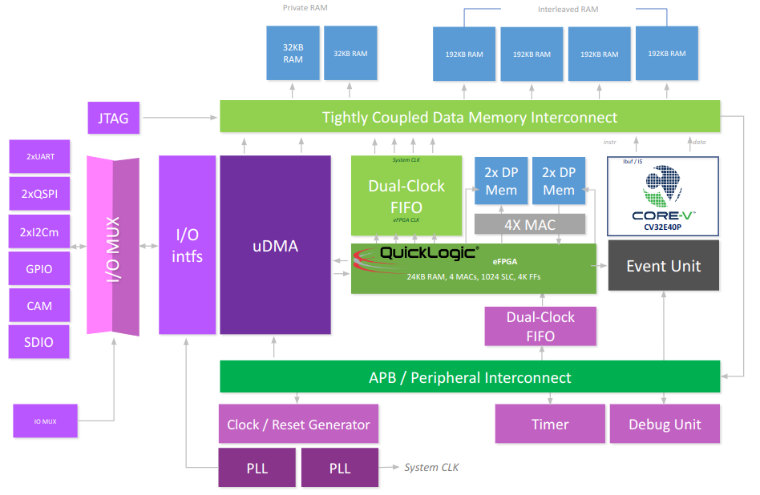

# CORE-V-MCU Overview

The purpose of the CORE-V-MCU is to showcase the CV32E40P (v1.0.0), a fully verified RISC-V core available from the Open Hardware Group.
The CORE-V-MCU provides the CV32E40P with a rich set of peripherals:

* 2xUART
* 2xI2C master
* 1xI2C slave
* 2xQSPI master
* 1xCAMERA
* 1xSDIO
* 4 PWM channels

The UARTs, I2C masters, QSPI, SDIO and Camera periphals transfer data to and from system memory via a micro-DMA unit.
In addition, the CORE-V-MCU supports an embedded FPGA (eFPGA) provided by Quicklogic.
The eFPGA is a memory mapped resource for the CV32E40P core and may also be used to directly interface to up to 32 I/O pins.

<!--
__Note:__ A set of registers in soc_ctrl defines which peripherals and how many were incorporated in the build.
The soc_ctrl documenation reports the configuration when the documentation was generated, however that may not be in sync with the
configuration when the RTL was built.

The system supports 512KB of SRAM and 3 PLLs.
-->

