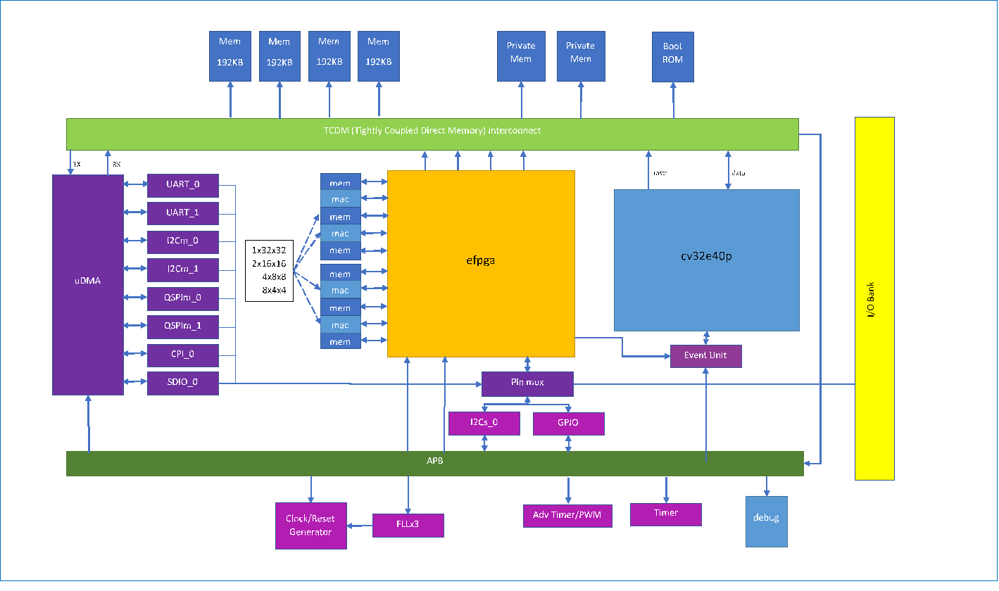

# CORE_V_MCU

## Purpose
The purpose of the core-v-mcu is to showcase the cv32e40p fully verified RISC-V core available from the Open Hardware Group.
The cv32e40p core is connected to a representative set of peripherals:

* 2xUART
* 2xI2C master
* 1xI2C slave
* 2xQSPI master
* 1xCAMERA
* 1xSDIO
* 4xPWM
* eFPGA with 4 math units

__Note:__ A set of registers in soc_ctrl defines which peripherals and how many were incorporated in the build.
The soc_ctrl documenation reports the configuration when the documentation was generated, however that may not be in sync with the
configuration when the RTL was built.

The system supports 512KB of SRAM and 3 PLLs.

## Evaluation Kits
The core-v-mcu is delivered as either:

* a Xilinx bitstream that runs on the Digilent Nexsy A7 board
* a Xilinx bitstream that runs on the Digilent Genesys2 board
* an SOC implemented with GLOBAFOUNDRIES 22nm fdx SOI technology that runs on an Open Hardware Group EVK board

All boards have multiple PMOD connectors that suport various PMOD modules which are used to connect debug and various peripherals.

## Software Support
The Open Hardware Group's Software Task Group supports the software ecosystem.

## Software Validation System
The core-v-mcu project has a FreeRTOS/Eclipse based project that runs software on the emulation system to verify the correct operation of the system.  The software validation system is in the core-v-mcu-cli-test repo.  There are two components:

* a FreeRTOS/Eclipse app called cli-test that uses a Command Line Interface to exercise features
* a Python script that automates using the cli-test to validate correct system operation

### Goals of the System Validation Tests
The goals of the whole product tests are to:

  * Confirm that the entire address space is accessible by the core
    * All of the TCDM
    * All of the peripheral registers
    * All special registers
  * Confirm that gdb can:
    * halt and resume the core
    * can single step the core
    * access entire addressable memory space
      - memories
      - peripherals
      - CSRS
    * NOTE: for performance reasons, may use gdb for sampling test and another mechanism for exhaustive testing
  * Confirm that the interrupts work as expected:
    * All sources
    * Masking
  * Confirm that the timers work as expected:
    * TBD
  * Confirm that the clock trees & divisors work as expected:
    * Can set FLL to desired frequency
    * Clock tree enables work
    * Clock tree divisors work
  * uDMA
    * Covered by peripheral tests
  * Peripherals (details later in document)
    * UART
    * I2Cm
    * I2Cs
    * SPIm
    * QSPIm
    * CAMI
    * GPIO
    * PWM
  * EFPGA
    * TCMD
    * APB
    * Math blocks
    * IO
    * Configuration
    * Test mode
  * Confirm I/O control works as expected:
    * Peripherals can access I/O
    * GPIO can access all I/O
    * EFPGA can access all I/O
    * Mux select works properly
    * All IO configurations can be set properly
  * Test modes
    * Confirm JTAG can be set in scan mode
    * Confirm JTAG can be set in mem BIST mode
    * Confirm JTAG can be set in EFPGA test mode
  * Significant application
    * TfLu person detection application reading from HiMax camera and using eFPGA acceleration

 ### Peripheral tests
 Peripheral tests use the specified peripherals (typically PMOD) to confirm correct system operation.

 ### UART tests
 Pmod used for regression testing: PmodUSBUART

| Type          | Mode                            | Notes      |
| :------------  | :---------------------------    | :-------  |
| Blocking    |                    ||
|        | Set config              |baud, stop, bits, parity  |
|        | Read char               ||
|        | Write char              ||
|        | Read N char             ||
|        | Write N char            ||
|        | Read through '\n'       ||
|        | Rx empty                ||
|        | Tx empty                ||
|        | Wait for idle           ||
| Non-blocking  |                  ||

### I2Cmaster
Pmod used for regression testing: PmodRTCC (has small SRAM)
| Type       | Mode                           | Notes   |
| :------------  | :---------------------     | :-------  |
| Blocking  |                                 ||
|           | Set clock frequency             ||
|           | Wait for idle                   ||
|           | Read register                   ||
|           | Read non-existant register      | Test NAK handling |
|           | Write register                  ||
|           | Write non-existant register     | Test NAK handling |
|           | Read N of M registers, M >= N   ||
|           | Read N of M registers, M < N    | Test NAK handling |
|           | Write N of M registers, M >= N  ||
|           | Write N of M registers, M < N   | Test NAK handling |
| Not tested  |                               ||
|           | Clock stretching                ||

### I2Cslave

Note: APIs are on host, so used for purposes of describing tested functionality

| Type       | Mode                | Notes   |
| :------------  | :---------------------------    | :-------  |
|         | Read register            |
|        | Read non-existant register     | Test NAK handling |
|        | Write register           |
|        | Write non-existant register    | Test NAK handling |
|        | Read N of M registers, M >= N    |
|        | Read N of M registers, M < N    | Test NAK handling |
|        | Write N of M registers, M >= N  |
|        | Write N of M registers, M < N    | Test NAK handling |

### QSPImaster
Pmod used for regression testing: PmodSF3 (serial NOR flash memory)
| Type       | Mode                           | Notes   |
| :------------  | :---------------------     | :-------  |
| Blocking     |                              ||
|        | Set configuration                  | clock rate, cpol, cpha, endianness, cs# |
|        | Wait for idle                      ||
| Non-blocking  |                             ||
|        | Write N bytes in single bit mode   ||
|        | Write N bytes in dual bit mode     ||
|        | Write N bytes in quad bit mode     ||
|        | Read N bytes in single bit mode    ||
|        | Read N bytes in dual bit mode      ||
|        | Read N bytes in quad bit mode      ||
|        | Write/Read N bytes in single mode  ||

### CAMI

### GPIO

### PWM