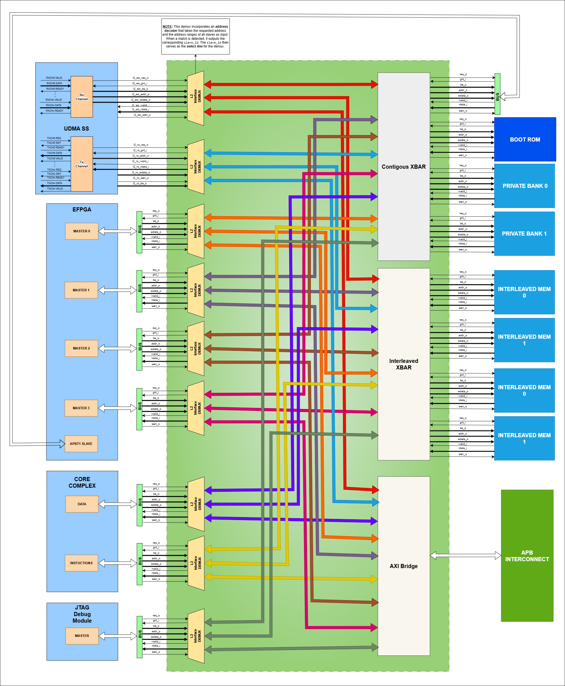
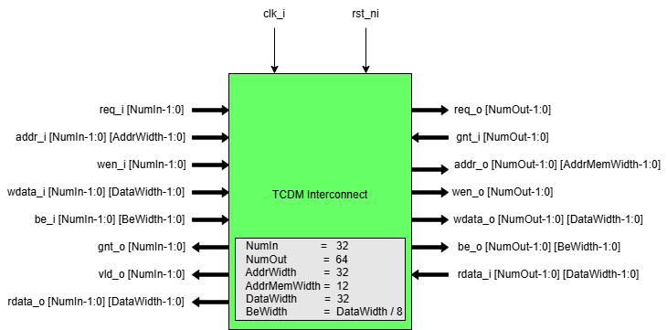

..
   Copyright (c) 2023 OpenHW Group

   SPDX-License-Identifier: Apache-2.0 WITH SHL-2.1

.. _tcdm_interconnect:

TCDM Interconnect
=================

The Tightly Coupled Data Memory (TCDM) Interconnect is a high-performance, low-latency memory bus designed for efficient data transfers. 

Features
~~~~~~~~
- The processor utilizes the TCDM Interconnect for both instruction fetching and data load/store operations.
- The uDMA Subsystem uses TCDM interconnect to access interleaved(L2) memory.
- Acts as a master to the APB peripheral interconnect.
- 4 TCDM interfaces for eFPGA provide high speed access to the CORE-V-MCU memory
- Provides a JTAG debug interface.
- Support below network topologies
   - Full Crossbar
   - Clos network
   - Butterfly

For more details about TCDM interconnect refer `here <https://github.com/openhwgroup/core-v-mcu/blob/master/rtl/tcdm_interconnect/README.md>`_.

Block Diagram
~~~~~~~~~~~~~~

   TCDM Interconnect block diagram

System Architecture
~~~~~~~~~~~~~~~~~~~
.. figure:: ../images/TCDM_Interconnect_block_diagram.png
   :name: TCDM_Interconnect_block_diagram
   :align: center
   :alt: 

   TCDM Interconnect connection diagram

Pin Diagram
~~~~~~~~~~~~~~

   TCDM Interconnect pin diagram

Below is the categorization of these pins:

Clock Interface
^^^^^^^^^^^^^^^

- ``clk_i`` : system clock

Reset Interface
^^^^^^^^^^^^^^^

- ``rst_ni`` : Active low reset signal

Master Interface
^^^^^^^^^^^^^^^^

- ``req_i`` : Request signal from master ports.
- ``add_i`` : Address of the tcdm.
- ``wen_i`` : Write enable signal; 1 = write, 0 = read.
- ``wdata_i`` : Data to be written to memory.
- ``be_i`` : Byte enable signals.
- ``gnt_o`` : Grant signal indicating the request has been accepted.
- ``vld_o`` : Response valid signal, also used for write acknowledgments.
- ``rdata_o`` : Data read from memory for load operations.

Slave Interface
^^^^^^^^^^^^^^^

- ``req_o`` : Request signal sent to slave memory banks.
- ``gnt_i`` : Grant signal from memory banks.
- ``add_o`` : Address within each memory bank.
- ``wen_o`` : Write enable signal to memory banks.
- ``wdata_o`` : Data to be written to memory.
- ``be_o`` : Byte enable signals for each memory bank.
- ``rdata_i`` : Data returned from the memory banks for read operations.