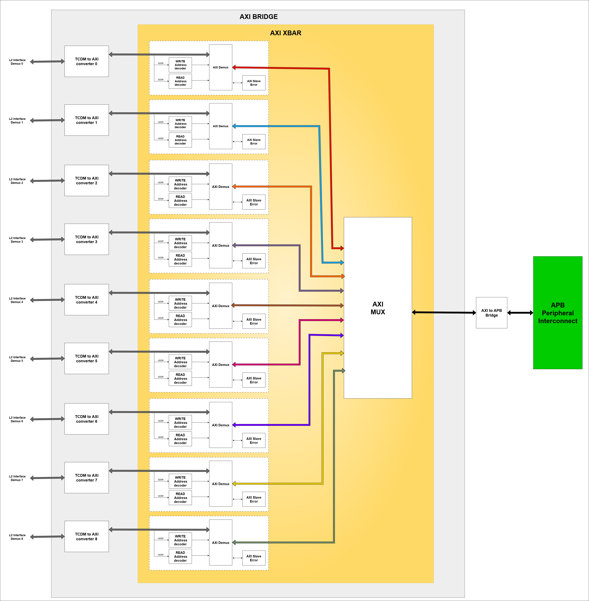

..
   Copyright (c) 2023 OpenHW Group

   SPDX-License-Identifier: Apache-2.0 WITH SHL-2.1

.. _tcdm_interconnect:

TCDM Interconnect
=================

The Tightly Coupled Data Memory (TCDM) Interconnect is a high-performance, low-latency memory bus designed for efficient data transfers. 

Features
~~~~~~~~
- The processor utilizes the TCDM Interconnect for both instruction fetching and data load/store operations.
- The uDMA Subsystem uses TCDM interconnect to access interleaved(L2) memory.
- Acts as a master to the APB peripheral interconnect.
- 4 TCDM interfaces for eFPGA provide high speed access to the CORE-V-MCU memory.
- Provides a JTAG debug interface.
- Supports a 32-bit address width, 32-bit data width, and 32-bit byte enable (BE) width.
- Support below network topologies

   - Full Crossbar
   - Clos network
   - Butterfly

For more details about TCDM interconnect refer `here <https://github.com/openhwgroup/core-v-mcu/blob/master/rtl/tcdm_interconnect/README.md>`_.

Block Architecture
~~~~~~~~~~~~~~~~~~
The TCDM interconnect supports 9 master ports and 9 slave ports. The figure below shows a high-level block diagram of the interconnect, highlighting its main components:
 
- L2 Interconnect Demux
- Contiguous Crossbar
- Interleaved Crossbar
- AXI Bridge

The L2 Interconnect Demux identifies the target slave region and routes the request to appropriate destination - either one of the Crossbars or the AXI Bridge. Internally, both the Crossbars and the AXI Bridge use 
address decoders and arbiters to direct requests to the correct slave.

.. figure:: ../images/TCDM_Interconnect_block_diagram.png
   :name: TCDM_Interconnect_block_diagram
   :align: center
   :alt: 

   **TCDM Interconnect block diagram**

   
**Masters:** 

- uDMA Subsystem (2 ports)
- eFPGA (4 ports)
- Core Complex (2 ports)
- Debug Module (1 port)

**Slaves:** 

- Boot ROM
- Non-interleaved memory (2 private memory banks)
- Interleaved memory (4 banks)
- APB peripheral interconnect
- eFPGA APB Target

TCDM (L2 Interface) Demux
^^^^^^^^^^^^^^^^^^^^^^^^^^^^^^^^^^^^^^^^^
The uDMA SS, eFPGA, and Core Complex masters connect to the TCDM Demux, which is responsible for routing requests to the correct slave. The slaves fall into three categories based on address regions:

- AXI Region : Connects to APB peripheral interconnect to access APB Peripherals
- Contiguous Slaves : Includes Non-interleaved memory regions such as L2 private memory banks (SRAM Bank0 - 32KB, SRAM Bank1 - 32KB), Boot ROM and eFPGA APB Target
- Interleaved Slaves : Contains Interleaved memory banks, 4*112KB SRAM blocks

Refer to `Memory Map <https://github.com/openhwgroup/core-v-mcu/blob/master/docs/doc-src/mmap.rst>`_ for address ranges of the each slave.

The TCDM Demux integrates an address decoder that inspects each incoming request address and matches it against the configured address ranges for all slave regions. Upon identifying a match, the address decoder determines the appropriate target region 
and internally routes the request to the corresponding slave — whether AXI, contiguous, or interleaved.

Interaction with Contiguous Crossbar
^^^^^^^^^^^^^^^^^^^^^^^^^^^^^^^^^^^^

   **Contiguous Crossbar**

The contiguous crossbar consists of two primary components:

1. Address Decoders - One per master (Total of 9)
2. Single Xbar Module 

Each address decoder receives the ADDR from TCDM demux and checks it against the address ranges of contiguous slaves address. if a match is found, port_sel is generated and sent to the Xbar module's ADDR input.
This port sel signal represents the slave index provided to the Xbar to route the request to the appropriate slave arbiter within the Xbar.
Meanwhile the actual request (ADDR, WEN, WDATA and BE) is aggregated into single bundle and forwarded to Xbar's WDATA input.
Here, the ADDR bundled with WDATA contains the full original address for read/write operation and is used by the selected slave to determines the exact memory offset for the access.

The Xbar is a multi-master and multi-slave module that includes:

1. A dedicated local address decoder and response multiplexer for each master to interpret port_sel.
2. A dedicated RR arbiter for each slave to handle requests from multiple masters.

The address decoder decodes the index received over port_sel port and selects the corresponding slave-specific arbiter. 
Each arbiter manages contention among multiple masters and grants access to one master per cycle using a round-robin (RR) arbitration policy.
Once access is granted, the aggregated request is disaggregated into its original signals (ADDR, WEN, WDATA, BE) and forwarded to the slave.

When a slave detects the REQ signal, it immediately asserts the GNT signal in the same clock cycle to acknowledge the request. 

For read operations, the r_data and valid signals are updated in the next clock cycle.
The response multiplexer colects the response data from all the slaves and selects the valid response corresponding to the previously decoded target.
This selection ensures that only the appropriate response is forwarded back to the master.

Interaction with Interleaved Crossbar
^^^^^^^^^^^^^^^^^^^^^^^^^^^^^^^^^^^^^

   **Interleaved Crossbar**

The interleaved crossbar follows a different mechanism for selecting the target slave. Unlike the contiguous crossbar, it does not use address decoders based on full address ranges.
Instead, it uses specific address bits (often referred to as bank bits) to determine the destination memory bank. These bits are extracted from the request address and forwarded to the Xbar's ADDR input.

``port_sel = ADDR[$clog2(BE_WIDTH)+PORT_SEL_WIDTH-1:$clog2(BE_WIDTH)]``

NOTE: 
 - BE_WIDTH = 4
 - PORT_SEL_WIDTH = $clog2(NR_SLAVE_PORTS) = $clog2(4) = 2
 - port_sel = ADDR[2+2-1:2] = ADDR[3:2]

These bits represents the slave index provided to the Xbar to route the request to the appropriate slave arbiter within the Xbar.
Each master aggregates its request (ADDR, WEN, WDATA, and BE) into a bundled format and sends it to the crossbar's DATA input.
Here, the ADDR bundled with WDATA contains the full original address for read/write operation and is used by the selected slave to determines the exact memory offset for the access.

Internally, the interleaved crossbar also contains a Xbar module that includes:

1. A dedicated local address decoder and response multiplexer for each master to interpret port_sel.
2. A dedicated RR arbiter for each slave to handle requests from multiple masters.

As in contiguous cross bar, the address decoder decodes the index received over port_sel port and selects the corresponding slave-specific arbiter. 
The arbitration occurs every clock cycle, ensuring fair access. 
Once access is granted, the aggregated request is disaggregated into its original signals (ADDR, WEN, WDATA, BE) and forwarded to the slave.

When a slave detects the REQ signal, it immediately asserts the GNT signal in the same clock cycle to acknowledge the request. 

For read operations, the r_data and valid signals are updated in the next clock cycle.
The response mux colects the response data from all the slaves and selects the valid response corresponding to the previously decoded target.
This selection ensures that only the appropriate response is forwarded back to the master.

Interaction with AXI Bridge
^^^^^^^^^^^^^^^^^^^^^^^^^^^

   **TCDM AXI Bridge**

The AXI bridge receives incoming requests, which are passed through a TCDM-to-AXI converter. This converter translates 32-bit TCDM protocol transactions into 32-bit AXI transactions. 
The translated AXI transactions are then forwarded to an AXI crossbar for further decoding and routing.

The AXI crossbar efficiently routes transactions from multiple masters to multiple slaves. The crossbar includes the following components:

- **Write Address Decoder**: Each master has a dedicated write address decoder that compares the write transaction address (AWADDR) against the address ranges of all connected slaves. Upon finding a match, it generates a selection signal for the corresponding slave and forwards the transaction to the AXI Demux; otherwise, the request is redirected to the error slave.
- **Read Address Decoder**: Similarly, each master has a dedicated read address decoder that compares the ARADDR (read address) against slave address ranges. If a valid slave match is found, the selection signal is generated and the request is passed to the AXI Demux; otherwise, the request is redirected to the error slave.
- **AXI Demultiplexer**: There is one AXI Demux per master. it receives read/write transactions and routes them to one of several slaves based on the selection signals provided by the address decoders. It ensures that transactions are correctly distributed across the slaves.
- **AXI Error Slave**: A dedicated error slave for each master. It handles unmatched or invalid addresses. If no slave address matches the decoded address, the transaction is routed to the error slave, which generates an appropriate error response.
- **AXI Multiplexer**: There is one AXI MUX per slave. It merges response channels( write response and read) coming from multiple masters targeting that slave. The mux includes RR arbitration logic to forward one valid response at a time to the master.

The AXI Demux handles the actual routing of transactions to the correct slave based on the decoder's selection signals received from Write/Read Address decoder.
Once the slave complete processing the requests, the read and write responses are sent back to the crossbar. Since multiple masters may target the same slave, their responses are funneled through a shared interface. The axi_mux, instantiated per slave, merges these responses and uses RR arbitration to decide which master's response to forward at any given time.

System Architecture
~~~~~~~~~~~~~~~~~~~

   TCDM Interconnect connection diagram

Programming Model
~~~~~~~~~~~~~~~~~

The TCDM Interconnect handles address decoding and transaction routing internally, making its functionality completely transparent to the user.

TCDM interconnect CSRs
~~~~~~~~~~~~~~~~~~~~~~

There are no CSR available as this IP is transparent to users.

Pin Diagram
~~~~~~~~~~~~~~

.. figure:: ../images/TCDM_Interconnect_pin_diagram.png
   :name: TCDM_Interconnect_pin_diagram
   :align: center
   :alt: 

   TCDM Interconnect pin diagram

Below is the categorization of these pins:

Clock Interface
^^^^^^^^^^^^^^^

- ``clk_i`` : system clock

Reset Interface
^^^^^^^^^^^^^^^

- ``rst_ni`` : Active low reset signal

Master Interface
^^^^^^^^^^^^^^^^

- ``req_i`` : Request signal from master ports.
- ``add_i`` : Address of the tcdm.
- ``wen_i`` : Write enable signal; 1 = write, 0 = read.
- ``wdata_i`` : Data to be written to memory.
- ``be_i`` : Byte enable signals.
- ``gnt_o`` : Grant signal indicating the request has been accepted.
- ``vld_o`` : Response valid signal, also used for write acknowledgments.
- ``rdata_o`` : Data read from memory for load operations.

Slave Interface
^^^^^^^^^^^^^^^

- ``req_o`` : Request signal sent to slave memory banks.
- ``gnt_i`` : Grant signal from memory banks.
- ``add_o`` : Address within each memory bank.
- ``wen_o`` : Write enable signal to memory banks.
- ``wdata_o`` : Data to be written to memory.
- ``be_o`` : Byte enable signals for each memory bank.
- ``rdata_i`` : Data returned from the memory banks for read operations.