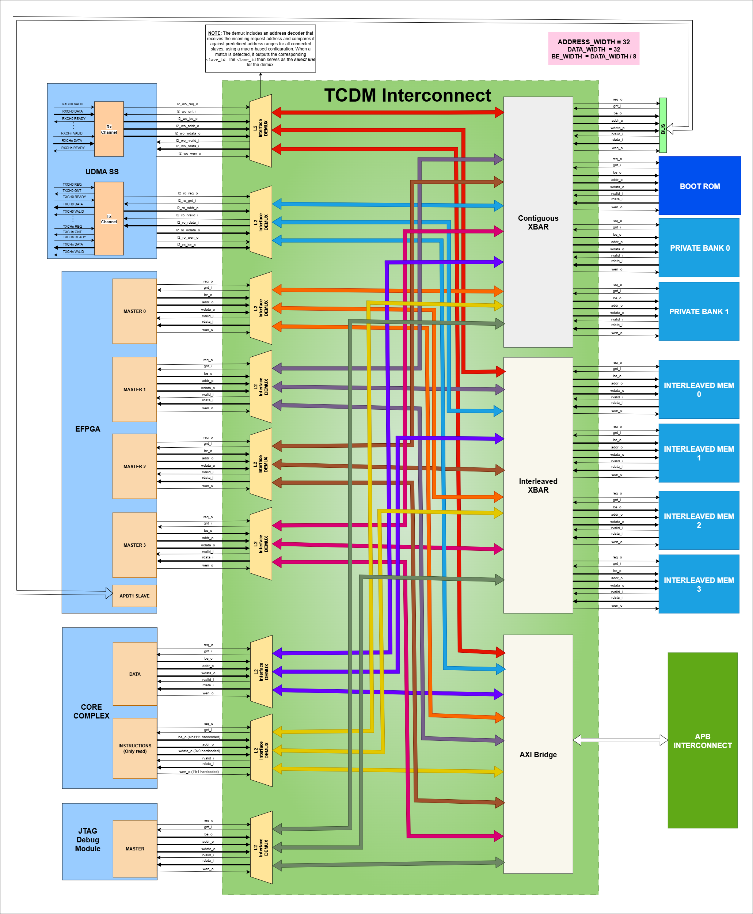

..
   Copyright (c) 2023 OpenHW Group

   SPDX-License-Identifier: Apache-2.0 WITH SHL-2.1

.. _tcdm_interconnect:

TCDM Interconnect
=================

The Tightly Coupled Data Memory (TCDM) Interconnect is a high-performance, low-latency memory bus designed for efficient data transfers. 

Features
~~~~~~~~
- The processor utilizes the TCDM Interconnect for both instruction fetching and data load/store operations.
- The uDMA Subsystem uses TCDM interconnect to access interleaved(L2) memory.
- Acts as a master to the APB peripheral interconnect.
- 4 TCDM interfaces for eFPGA provide high speed access to the CORE-V-MCU memory
- Provides a JTAG debug interface.
- Support below network topologies
   - Full Crossbar
   - Clos network
   - Butterfly

For more details about TCDM interconnect refer `here <https://github.com/openhwgroup/core-v-mcu/blob/master/rtl/tcdm_interconnect/README.md>`_.

Block Diagram
~~~~~~~~~~~~~~

.. figure:: ../images/TCDM_block_diagram.png
   :name: TCDM_Interconnect_block_diagram
   :align: center
   :alt: 

   TCDM Interconnect block diagram

   It contains 9 master ports and 9 slave ports.
   
   Masters: 
   - uDMA Subsystem (2 ports)
   - eFPGA (4 ports)
   - Core Complex (2 ports)
   - Debug Module (1 port)

   Slaves: 
   - Boot ROM
   - Non-interleaved memory (2 private memory banks)
   - Interleaved memory (4 banks)
   - APB peripheral interconnect
   - eFPGA APB Target 1

   The masters interfaces are connected to the TCDM Demux, which acts as the central routing module for slave access.
   This module is responsible for directing data to one of three slave regions: the AXI region, which includes APB peripherals mapped between address range 0x1A100000 to 0x1A300000; 
   the contiguous slave region, which comprises L2 private memory banks (core-private memory), Boot ROM, and the eFPGA APBT1; and the interleaved slave region, with address ranges spanning from 0x1C010000 to 0x1C090000.

   The TCDM Demux integrates an address decoder that inspects each incoming request address and matches it against the configured address ranges for all slave regions. Upon identifying a match, the module generates a slave_id, which is used
   as a select signal to route the request to the appropriate slave region—AXI, contiguous, or interleaved.

   Within the contiguous crossbar, the data transfer process begins when a master asserts the REQ signal, along with associated control signals such as ADDR, WEN, WDATA, and BE. These signals are bundled into a unified data bus and transmitted to the crossbar.
   An internal address decoder uses the ADDR signal to derive a port_sel signal, which identifies the specific slave port to target. The crossbar then forwards the request to the appropriate slave.

   Upon receiving a valid REQ, the selected slave immediately asserts the GNT signal in the same clock cycle to acknowledge the transaction. It then calculates a local address by subtracting its base address from the incoming address and performs the requested read or write operation.
   In the case of a read, the R_VALID signal is asserted in the following clock cycle to indicate that valid data is ready for return. The GNT signal is automatically deasserted once the master releases the REQ signal.

System Architecture
~~~~~~~~~~~~~~~~~~~

   TCDM Interconnect connection diagram

Pin Diagram
~~~~~~~~~~~~~~

.. figure:: ../images/TCDM_Interconnect_pin_diagram.png
   :name: TCDM_Interconnect_pin_diagram
   :align: center
   :alt: 

   TCDM Interconnect pin diagram

Below is the categorization of these pins:

Clock Interface
^^^^^^^^^^^^^^^

- ``clk_i`` : system clock

Reset Interface
^^^^^^^^^^^^^^^

- ``rst_ni`` : Active low reset signal

Master Interface
^^^^^^^^^^^^^^^^

- ``req_i`` : Request signal from master ports.
- ``add_i`` : Address of the tcdm.
- ``wen_i`` : Write enable signal; 1 = write, 0 = read.
- ``wdata_i`` : Data to be written to memory.
- ``be_i`` : Byte enable signals.
- ``gnt_o`` : Grant signal indicating the request has been accepted.
- ``vld_o`` : Response valid signal, also used for write acknowledgments.
- ``rdata_o`` : Data read from memory for load operations.

Slave Interface
^^^^^^^^^^^^^^^

- ``req_o`` : Request signal sent to slave memory banks.
- ``gnt_i`` : Grant signal from memory banks.
- ``add_o`` : Address within each memory bank.
- ``wen_o`` : Write enable signal to memory banks.
- ``wdata_o`` : Data to be written to memory.
- ``be_o`` : Byte enable signals for each memory bank.
- ``rdata_i`` : Data returned from the memory banks for read operations.