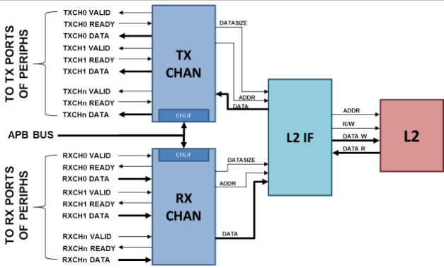
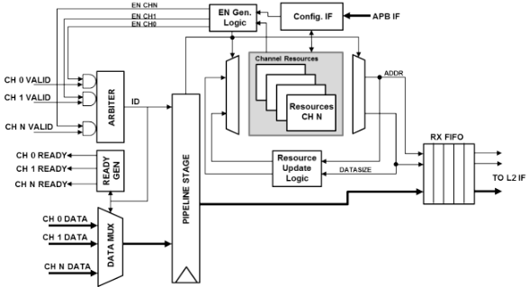
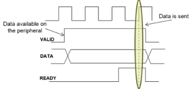
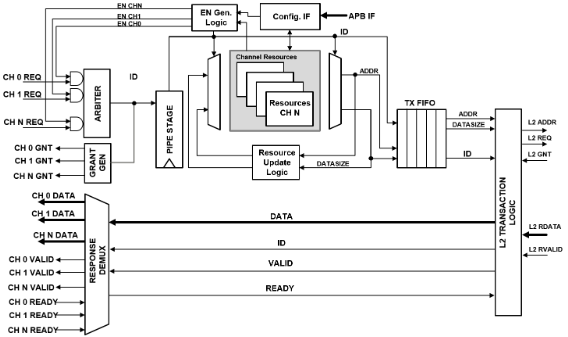
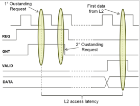

..
   Copyright (c) 2023 OpenHW Group

   SPDX-License-Identifier: Apache-2.0 WITH SHL-2.0

.. Level 1
   =======

   Level 2
   -------

   Level 3
   ~~~~~~~

   Level 4
   ^^^^^^^

.. _udma_subsystem:

Micro-DMA Subsystem
===================

The CORE-V-MCU's micro-DMA (uDMA), is an intelligent, lightweight and completely autonomous Direct Memory Access controller capable of handling complex I/O schemes.
Its primary purpose is to reduce the CPU overhead used to control I/O peripherals.

Credit
-------

The following is based on the uDMA User Manual which can be found on GitHub in the PULP-Platform
`Micro-DMA Core <https://github.com/pulp-platform/udma_core/tree/pulpissimo_v1.0_fix>`_ repository.
The author of the uDMA User Manual is Antonio Pullini, then of ETHZ.

Architecture
------------

The Figure below is a high-level block diagram of the uDMA.
The main components are the Tx channels, the Rx channels, the interface to the L2 TCDM Interconnect and the configuration interface (CFG IF).
The Tx/Rx channels connect to a set of peripherals.
Individual peripherals may have one or more Tx or Rx channels depending on the need.
As an example, the I2C master will require one TX and one RX channel while the camera interface (CPI) needs only one Rx channel.
The interface between the uDMA and the peripherals implements a simple valid/ready protocol.
The peripherals ride the valid signal of the Rx channels when having data available and raise the ready signal of a tx channel when requesting data from the memory.
Software control of both the uDMA and its peripherals is via the APB interconnect driving the CFG IF.

   Micro-DMA Block Diagram

Each uDMA channel, both Tx and Rx, have dedicated resources in the configuration interface and internal to the Tx/Rx channel logic of the uDMA itself.
The hardware resources associated to each channels are:

- 32-bit address register storing the address of the following transfer.
- 16-bit bytes left register storing the number of bytes left in the current transfer.
- 2-bit data size register keeping the amount of bytes to be transferred at each uDMA transfer. Possible values are 1,2,4.

The address register stored in the configuration interface is the starting address of the *next* transfer while the one inside the uDMA contains the current pointer to the L2 buffer.
The 16 bit size register sets the transfer size in bytes for the next transfer when in the configuration interface while specifies the number of remaining bytes in the current transfer.
Last, the 2 bits for the data size contain the number of bytes to be transferred at each data transfer for the next transfer and for the current transfer.
Configuration CSRs are write only and the current CSRs are read only and accessible at the same address in the uDMA configuration space.
If there is no transaction, running resources are copied from the configuration interface to the internal resources as soon as the enable bit is set.
If a transfer is ongoing, they are latched as soon as the current transfer is over.
Those 2 sets of registers for each channel and the queueing mechanism eases the implementation of double buffering.
At the first setup of the transfer the software can start the first transfer with a target address and soon after queue another transfer with a second target address.
As soon as the first transfer is over the software can queue a transaction with the first target address again and process the first chunk of data while the second chunk is transferred to the second target address in the background.

RX Channels
~~~~~~~~~~~

The Rx Channel blocks handle the data transfer from peripherals to L2 memory.
When a peripheral has available data it raises the data valid signal of its associated channel.
In the Rx channel block all the valid signals, if the corresponding channels is active, are arbitrated with a fair round robin arbiter.
The ID of the winning channel is used to select the data to be sent to memory and both ID and data are sampled and sent to the next pipeline stage.
In the next pipeline stage the stored ID is used to select the current pointer associated with the channel, the channel data size and the number of bytes left for the transfer.
Pointer, data size, and the data itself are pushed into a fifo and sent for transfer.
In parallel in the same cycle the next pointer and the number of bytes left for transfers are updated.
To reduce the complexity of the logic backpropagating the stalls to the peripherals, each channel, once winning an arbitration, is disabled until its data is pushed into the Rx fifo.

.. Looking at the effect on the single channels this may appear to be a significant limitation since it cuts the bandwidth in half.
   In real use cases this is never an issue since all the peripherals involve some type of serial to parallel conversions and none of the available peripherals are capable of producing data at full bandwidth capable of saturating the memory bandwidth not even during peaks.

   Micro-DMA Rx Channel

   Micro-DMA Rx Channel Protocol

TX Channels
~~~~~~~~~~~

The TX Channels block handles the data transfer in the opposite direction, from memory to peripherals.
Peripherals with a TX channel, when having the pipe ready for transmission, raise the data ready signal informing the uDMA that it is now ready to accept new data.
The uDMA similarly to what is done in the RX channels arbitrates the data requests coming from the active channels and latches the result of the arbitration(channel ID) to be used in the stage.
During the next pipe stage the ID of the winner is used to select the corresponding resources and the pointer, datasize and channel ID are sent to the tx fifo.
In parallel the new address and the number of bytes left are updated.
In the tx channels also the ID is pushed in the tx fifo because the information is needed to demux the data to the proper channel on the response path.
Due to the blocking nature of the simple valid/ready protocol at the uDMA boundaries each tx channel is stalled until the data is fetched from the memory.
This implies that with no contention we can fetch one data every 4 cycles.
This sets the maximum bandwidth of a TX channel to 1/4th of the L2 bandwidth.
Once again this is not a limit in the current IO subsystem since S/P conversion absorbs the latency.

   Micro-DMA Tx Channel

   Micro-DMA Tx Channel Protocol

   2.3 L2 memory interface

L2 TCDM Interface
~~~~~~~~~~~~~~~~~

The L2 TCDM Interface(L2if) arbitrates between the access requests originated from the Tx or Rx channels.
Among with the arbitration the L2if generates the proper byte enables and puts the data to the proper lanes when accessing the L2 memories.
An incoming write request from the Rx channels is sent to the L2 only if there is no pending read request from the TX channels or if the priority is assigned to the RX channels.
The priority is flipped from Tx to Rx or vice versa when there is a conflict between read or write requests.

Configuration Interface
~~~~~~~~~~~~~~~~~~~~~~~

Configuration interface is driven by the CORE-V-MCU's APB Peripheral Interconnect bus.
Although the current implementation of the CORE-V-MCU supports only nine uDMA peripherals, the uDMA subsystem allows for up to fifteen.
Each peripheral can have up to a maximum of 32 32-bit configuration registers.
This includes the registers needed to configure the uDMA channels dedicated to the peripheral.
The uDMA address space consists in 2KB.
The first 128*15 bytes are dedicated to the 15 peripherals while the last 32 configuration registers are dedicated to the uDMA configuration.

uDMA Subsystem CSRs
-------------------
The UDMA addresses are organized as an array of channels.
The first channel, channel 0, is a control channel that is used to:

* enable or disable the peripheral clocks
* reset the periperal controller
* set compare value for the event macthing mechanism

The base address for the UDMA channels is defined as UDMA_START_ADDR in core-v-mcu-config.h
The size of each channel is UDMA_CH_SIZE, therefore the address of channels N is UDMA_START_ADDR+N*UDMA_CH_SIZE.
core-v-mcu-config.h has explicit defines for each peripheral.
For instance,  if there are 2 UARTS then there are three defines:

* UDMA_CH_ADDR_UART -- address of first UART
* UDMA_CH_ADDR_UART0 -- address of UART0
* UDMA_CH_ADDR_UART1 -- address of UART1

The reason for having the UDMA_CH_UART define
is so that you can programmatically access UART ID by using
UDMA_CH_ADDR_UART + ID * UDMA_CH_SIZE

The register definitions for the control channel are specified in this section.
The register definitions for each peripheral are specified in sections named UDMA_XXXXX.

REG_CG offset = 0x000
~~~~~~~~~~~~~~~~~~~~~

+-------------------+-------+------+------------+-------------------------------------------------------------------------+
| Field             |  Bits | Type | Default    | Description                                                             |
+===================+=======+======+============+=========================================================================+
| PERIPH_CLK_ENABLE |  31:0 |   RW |        0x0 | Enable for peripheral clocks;                                           |
+-------------------+-------+------+------------+-------------------------------------------------------------------------+
|                                               | see core-v-mcu_config 'Peripheral clock enable masks' for bit positions |
+-------------------+-------+------+------------+-------------------------------------------------------------------------+

REG_CFG_EVT offset = 0x004
~~~~~~~~~~~~~~~~~~~~~~~~~~

+------------+-------+------+------------+-------------------------------------------------------------+
| Field      |  Bits | Type | Default    | Description                                                 |
+============+=======+======+============+=============================================================+
| CMP_EVENT3 | 31:24 |      |       0x00 | Compare value for event detection                           |
+------------+-------+------+------------+-------------------------------------------------------------+
| CMP_EVENT2 | 23:16 |      |       0x01 | Compare value for event detection                           |
+------------+-------+------+------------+-------------------------------------------------------------+
| CMP_EVENT1 |  15:8 |      |       0x02 | Compare value for event detection                           |
+------------+-------+------+------------+-------------------------------------------------------------+
| CMP_EVENT0 |   7:0 |      |       0x03 | Compare value for event detection                           |
+------------+-------+------+------------+-------------------------------------------------------------+

REG_RST offset = 0x008
~~~~~~~~~~~~~~~~~~~~~~

+--------------+-------+------+------------+-------------------------------------------------------------------------+
| Field        |  Bits | Type | Default    | Description                                                             |
+==============+=======+======+============+=========================================================================+
| PERIPH_RESET |  31:0 |   RW |        0x0 | Reset for peripherals;                                                  |
+--------------+-------+------+------------+-------------------------------------------------------------------------+
|                                          | use core-v-mcu_config 'Peripheral clock enable masks' for bit positions |
+--------------+-------+------+------------+-------------------------------------------------------------------------+

