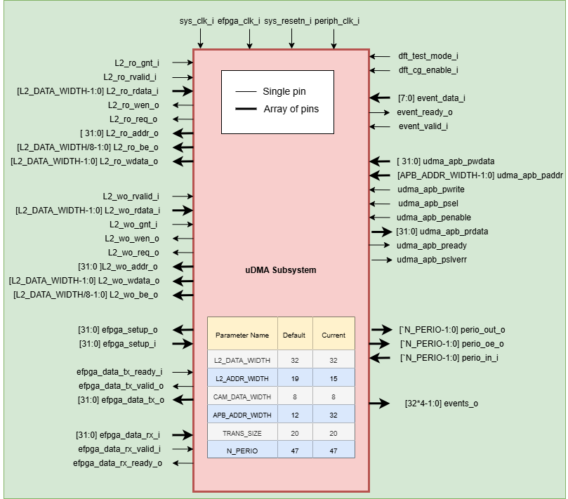

..
   Copyright (c) 2023 OpenHW Group

   SPDX-License-Identifier: Apache-2.0 WITH SHL-2.1

.. Level 1
   =======

   Level 2
   -------

   Lever 3
   ~~~~~~~

   Level 4
   ^^^^^^^

.. _udma_subsystem:

Micro-DMA Subsystem
===================

The CORE-V-MCU's micro-DMA (uDMA) subsystem, is an intelligent, lightweight and completely autonomous Direct Memory Access controller capable of handling complex I/O schemes.
Its primary purpose is to reduce the CPU overhead used to control I/O peripherals. 

Refer to  `High Level Architecture <https://docs.openhwgroup.org/projects/core-v-mcu/doc-src/high_level_architecture.html>`_ diagram for high-level block diagram of the uDMA Subsystem.

uDMA Subsystem is consist of below component:-

- 1 instance of uDMA Core: It controls the data transfer between peripherals and TCDM memory
- I/O Peripherals
   - 2 instances of `UART <https://github.com/openhwgroup/core-v-mcu/blob/master/docs/doc-src/ip-blocks/udma_uart.rst>`_.
   - 2 instances of `QSPI <https://github.com/openhwgroup/core-v-mcu/blob/master/docs/doc-src/ip-blocks/udma_qspim.rst>`_ Master.
   - 2 instances of `I2C <https://github.com/openhwgroup/core-v-mcu/blob/master/docs/doc-src/ip-blocks/udma_qspim.rst>`_ Master.
   - 1 instances of `SDIO <https://github.com/openhwgroup/core-v-mcu/blob/master/docs/doc-src/ip-blocks/udma_sdio.rst>`_.
   - 1 instance of `CAMERA <https://github.com/openhwgroup/core-v-mcu/blob/master/docs/doc-src/ip-blocks/udma_cam.rst>`_.

The CSRs of the peripherals are not directly accessible via the APB bus. Rather, the control plane interface to each peripheral is managed by the uDMA core within the uDMA subsystem.
This is transparent to the programmer as all peripheral CSRs appear within the uDMA Subsystem's memory region.
I/O operations of the peripherals are controlled by the uDMA core. This is not transparent to the programmer.

uDMA core is discussed in greater detail in the current chapter.

Credit
-------

The following is based on the uDMA core User Manual which can be found on GitHub in the PULP-Platform
`Micro-DMA Core <https://github.com/pulp-platform/udma_core/tree/pulpissimo_v1.0_fix>`_ repository.
The author of the uDMA User Manual is Antonio Pullini, then of ETHZ.

uDMA core Features
------------------

- Tx/Rx Channels: Used for transmitting and receiving data to and from peripherals like I2C, UART, CAMERA etc.
- TCDM Interface: Read/Write data from/to interleaved(L2) memory.
- APB Interface: Through this interface the CPU can access the CSRs of uDMA subsystem (uDMA Core and peripherals).
- Configuration Interface (CFG IF): uDMA Core gets the channel(TX/RX) configuration from the uDMA Peripheral channel configuration registers.
- Double Buffering: uDMA Core reads the channel configuration registers from uDMA Peripherals and creates its local copy for operation, improving throughput.
- Provides reset signal to uDMA Peripherals.
- Enables Peripheral clock to uDMA Peripherals.
- Detects compare event for apb event controller based on Compare value present in UDMA_CFG_EVT CSR. Generates event to uDMA peripherals.

uDMA core Architecture
----------------------

The Figure below is a high-level block diagram of the uDMA core.
The main components are the Tx channels, the Rx channels, the interface to the TCDM Interconnect and the configuration interface (CFG IF).
The Tx/Rx channels connect to a set of peripherals.
Individual peripherals may have one or more Tx or Rx channels depending on the need.
As an example, the I2C master will require one TX and one RX channel while the camera interface (CPI) needs only one Rx channel.
The interface between the uDMA core and the peripherals implements a simple valid/ready protocol.
The peripherals ride the valid signal of the Rx channels when having data available and raise the ready signal of a tx channel when requesting data from the memory.
Software control of both the uDMA core and its peripherals is via the APB interconnect driving the CFG IF.

   Micro-DMA core Block Diagram

uDMA core write/read data to and from uDMA peripheral and L2 memory via data pins. In the above block diagram all data pins are an array of 32 pins.

Note that it is not mandatory for core to always read/write 32 bits of data. Data size of each transaction performed by Rx/Tx channel can be configured using 2-bit data size register.

Refer to Pin description section in the current chapter for more information.

Each uDMA core channel, both Tx and Rx, has dedicated resources in the configuration interface and internal to the Tx/Rx channel logic of the uDMA core itself.
The hardware resources associated with each channel are:

- 32-bit address register storing the address of the following transfer.
- 16-bit bytes left register storing the number of bytes left in the current transfer.
- 2-bit data size register keeping the amount of bytes to be transferred at each uDMA core transfer. Possible values are 1, 2, and 4.

uDMA core copies these values from the configuration interface of the peripheral and makes a local copy; let us refer to this local copy as ‘current CSR’. In parallel, software may update the registers in the configuration interface of the peripheral for the next transaction; let us refer to these values as ‘configuration CSR’.
The local copy 32-bit address register inside the uDMA core contains the current pointer to the L2 buffer. The address register stored in the configuration interface is the starting address of the next transfer
The local copy of the 16-bit byte left register inside the uDMA core specifies the number of remaining bytes in the current transfer. The byte left register stored in the configuration interface is the transfer size in bytes for the next transfer.
Last, the local copy of the 2-bit data size register specifies the number of bytes to be transferred at each data transfer for the current transfer. The data size register stored in the configuration interface is the number of bytes to be transferred at each data transfer for the next transfer.
The uDMA core read/write the data from both uDMA Peripheral and L2 memory in the multiple of value of the 2-bit data size register i.e. 1, 2 and 4. For example, if uDMA core receives a request to read/write 'm' bytes from/to L2 memmory then it read/write the 'm' bytes data in the multiples of value of 2-bit data size register.

Configuration CSR and current CSRs are accessible at the same address in the uDMA core configuration space. If the software writes to the channel configuration registers of a peripheral through the ABP bus, these will be written to the configuration interface and will not modify the local current CSR in the uDMA core.
If the software reads the values of the configuration registers through the APB bus, it will get the local current CSR values from the uDMA core, i.e., values corresponding to the current transfer; it will not get the configuration CSR values stored in the configuration interface of the peripheral.
If there is no transaction, running resources are copied from the Configuration CSR  to the current CSR as soon as the enable bit of configuration CSR is set. If a transfer is ongoing, they are latched as soon as the current transfer is over. Those 2 sets of registers for each channel and the queueing mechanism eases the implementation of double buffering.

At the first setup of the transfer, the software can start the first transfer with a target address and soon after queue another transfer with a second target address.
As soon as the first transfer is over, the software can queue a transaction with the first target address again and process the first chunk of data while the second chunk is transferred to the second target address in the background.

**TX and RX channel FIFO**

uDMA Core TX and RX channel internally usses a FIFO to store the data for internal processing. Below is the interface diagram of the FIFO: -

   Micro-DMA core Tx and RX channel FIFO

RX FIFO is a 4-depth fifo and have 60-bit data len. Data is organised as below: -

``data organization = {l2_bytes(2-bit),is_stream(1bit),stream_id(2bits),destinationSize(2-bit),dataSize(2-bit),addr(19-bit),data(32-bit)}``

- data:            Represents the data received from uDMA peripheral
- addr:            L2 memory address to store data
- dataSize:        Number of bytes to be transmitted to L2 memory in one iteration
- destinationSize: L2 memory ID (i.e. interleaved, boot rom etc.)
- stream_id:       Id of channel for which stream is enabled
- is_stream:       Depicts whether streaming mode is enabled or not
- l2_bytes:        Current size of data that needs to store in L2 memory

`dataSize` and `l2_bytes` are used to decide byte enables while transmitting the data to L2 interface. If Rx channel is configure to transmit 4 bytes of data in one iteration, however only 3 bytes of actual data is left to transmit then dataSize will have value 4 and l2_bytes will be 3.

When the RX channel receives a request to write to L2 memory, it formats the incoming data from the peripheral as described above and stores it in its internal FIFO. Once granted access from the L2 interface, the RX channel retrieves the data from the FIFO, decodes it, and drives the L2 interface signals accordingly.

TX FIFO is a 4-depth fifo and have 60-bit data len. Data is organised as below:

``data organization =  {destinationSize(2-bit),ChannelID(4-bit),dataSize(2-bit),addr(19-bit)}``

- addr:            L2 memory address to read data
- dataSize:        Number of bytes to be read from L2 memory in one iteration
- ChannelID:       ID of TX channel trying to read from L2 memory
- destinationSize: L2 memory ID (i.e. interleaved, boot rom etc.)

When the TX channel receives a request to read from L2 memory, it formats the incoming request from the peripheral as described above and stores it in its internal FIFO. Once granted access from the L2 interface, the TX channel retrieves the data from the FIFO, decodes it, and drives the L2 interface signals accordingly.

**Push operation**

The FIFO asserts the ready signal when there is available space to accept new data. When an active valid signal is received, the data is written into the FIFO.
The ready signal is kept asserted as long as the FIFO has space for more data. IF the FIFO is full, push operation will be stalled until the FIFO has empty space and valid line is high.

**Pop operation**

The FIFO asserts the valid signal to indicate that valid data is available on the data lines. A module waiting for data should read the data lines only when valid pin is high and drive the ready
signal to high and reset it in next clock cycle. When FIFO receives an active ready signal, indicating that the data has been read, it updates the data lines with new data if FIFO is not empty. 
If the FIFO is empty, the valid signal is deasserted.

RX Channels (Write to L2 Memory)
^^^^^^^^^^^^^^^^^^^^^^^^^^^^^^^^

The Rx Channel block handle the data transfer from peripherals to L2 memory. The Rx channel is enabled/disabled using the channel configuration register of the connected peripheral.
When a uDMA peripheral has available data it raises the valid signal of its associated channel. If the corresponding channel is active(i.e. enabled by uDMA peripheral) then the channel is picked by arbitor.
RX channel invokes the arbitrator based on below conditions combined:- 
- ready signal is received from peripheral
- Channel is enabled by Peripheral

The Rx channel block arbitrate all the valid signals with a fair round robin algorithm to select the winning channel. The arbiter runs round robin algorithm at each clock cycle. This gives all uDMA peripherals a fair chance to transmit the data into L2 memory.

The ID of the winning channel is used to select the uDMA peripheral whose data needs to be sent to L2 memory. Rx channel reads the peripheral data in a local variable. If the RX channel has FIFO space and wins arbitration, it asserts the ready signal to the peripheral to read more data; otherwise, it deasserts the signal.
The uDMA Peripheral keeps the valid pin high until it has data to transfer to L2 memory. uDMA Peripheral upon receiving ready signal updates the data lines with new data.
Both ID and data are sampled and sent to the next pipeline stage.

In the next pipeline stage the stored ID determines the current pointer of L2 memory, the channel data size and the remaining transfer bytes for the channel.
Pointer(L2 memory address where data should be written), data size, and the data itself are pushed into a Rx FIFO. The data format of RX FIFO is already explained in the FIFO section. In parallel, in the same cycle the next pointer and the number of bytes left for transfers are updated.

Rx channel performs address alignment, calculates byte enable and sends req signal to TCDM interconnect(L2 interface) to notify TCDM that it wants to write data to L2 memory. L2 interface reads the data and issues l2_gnt_i (grant) signal.
RX channel after recieving the GNT signal, when its RX FIFO has data, will raise the req signal and update L2 data lines with the new data.

Rx channel keeps req signal high until FIFO has data.

.. figure:: ../images/uDMA_core_rx_chan_block_diagram.png
   :name: uDMA_core_Rx_Channel_Block_Diagram
   :align: center
   :alt: 

   Micro-DMA core Rx Channel

   Micro-DMA core Rx Channel Protocol

Refer to TCDM Interface section in the current chapter and `TCDM interconnect <https://github.com/openhwgroup/core-v-mcu/blob/master/docs/doc-src/tcdm_interconnect.rst>`_ chapter for more information about TCDM functionality..

To reduce the complexity of the backpropagating the stalls(delays) to the peripherals, each channel, once winning an arbitration, is disabled until its data is pushed into the Rx fifo.

.. Looking at the effect on the single channels this may appear to be a significant limitation since it cuts the bandwidth in half.
   In real use cases this is never an issue since all the peripherals involve some type of serial to parallel conversions and none of the available peripherals are capable of producing data at full bandwidth capable of saturating the memory bandwidth not even during peaks.

If the continuous mode is enabled for the RX channel by the uDMA peripheral, then after completing the Rx operation, the core will read the channel configuration from the peripheral and update its current CSR.
Once the CSRs are updated, the core will automatically resume the RX operation as per the latest CSRs configuration.

**L2 memory address Generation/Alignment**

The RX channel aligns the address received from the uDMA peripheral before placing it on the address lines of the L2 interface.

- For a 2-byte transfer size, if bits 1:0 of the received address are set, the address is considered unaligned.-
- For a 4-byte transfer size, if either bit 0 or bit 1 of the received address is set, the address is considered unaligned.

uDMA core splits the unaligned access into multiple aligned accesses and update the byte enable accordingly.
uDMA Rx chanel applies below address selection logic before putting them on address lines of L2 IF:-

``Aligned Access``

- Drop alignment bits(e.g., [1:0] bits for 4-byte alignment) from address received from the uDMA peripheral.
- Append alignment zeroes at LSB → this forms an aligned byte address.
- Upper bits are zero-padded to make a full 32-bit address.

``Unaligned Access``

- Calculate next aligned word :
   - Drop alignment bits(e.g., [1:0] bits for 4-byte alignment) from address received from the uDMA peripheral.
   - Add +1 to the address to get the next aligned word access.
- Append alignment zeroes at LSB → this forms an aligned byte address.
- Upper bits are zero-padded to make a full 32-bit address.
- This is needed when the unaligned access spans two words, and the second part must be fetched separately

This logic ensures that even if an unaligned memory request comes in, the RX channel properly generates aligned L2 accesses, potentially issuing two writes if needed (current word + next word).

The uDMA subsystem can access only the interleaved memory regions of the Core-V-MCU. To enforce this, the uDMA core forcibly sets bits 
31:24 of the address to 8'h1C, ensuring that the address targets the interleaved memory space. The lin_ch_destination_i pin is used to
select the specific target memory within the available L2 memory banks.

**Byte enable**

uDMA core also support byte enable that mask the data so that specific bytes should be written to L2 memory. uDMA core pass this information to L2 interface via 4(L2_DATA_WIDTH/8, in the current version L2_DATA_WIDTH is 32) bit wide byte-enable pin. Rx channel uses  [2:0]  and [1:0]  bits of L2 memory address received from the uDMA peripheral to calculte byte enable for 64 and 32 bit data respectively.

``s_addr`` represents the current L2 memory address used RX channel to perform write operation.

- Data line: 64 bit,  Transfer size : 1 byte

+---------------------+------------------+
| s_addr[2:0]         | Bye enable       |
+=====================+==================+
| 3'b000              | 8'b00000001      |
+---------------------+------------------+
| 3'b001              | 8'b00000010      |
+---------------------+------------------+
| 3'b010              | 8'b00000100      |
+---------------------+------------------+
| 3'b011              | 8'b00001000      |
+---------------------+------------------+
| 3'b100              | 8'b00010000      |
+---------------------+------------------+
| 3'b101              | 8'b00100000      |
+---------------------+------------------+
| 3'b110              | 8'b01000000      |
+---------------------+------------------+
| 3'b111              | 8'b10000000      |
+---------------------+------------------+

- Data line: 64 bit, Transfer size : 2 bytes

+---------------------+------------------+
| s_addr[2:1]         | Bye enable       |
+=====================+==================+
| 2'b00               | 8'b00000011      |
+---------------------+------------------+
| 2'b01               | 8'b00001100      |
+---------------------+------------------+
| 2'b10               | 8'b00110000      |
+---------------------+------------------+
| 2'b11               | 8'b11000000      |
+---------------------+------------------+

- Data line: 64 bit, Transfer size : 4 bytes

+----------------+------------------+
| s_addr[2]      | Bye enable       |
+================+==================+
| 1'b0           | 8'b00001111      |
+----------------+------------------+
| 1'b1           | 8'b11110000      |
+----------------+------------------+

- Data line: 32 bit, Transfer size : 1 bytes

+---------------------+--------------+
| s_addr[1:0]         | Bye enable   |
+=====================+==============+
| 2'b00               | 4'b0001      |
+---------------------+--------------+
| 2'b01               | 4'b0010      |
+---------------------+--------------+
| 2'b10               | 4'b0100      |
+---------------------+--------------+
| 2'b11               | 4'b1000      |
+---------------------+--------------+

- Data line: 32 bit, Transfer size : 2 bytes and byte pending to transmit : 1

+---------------+-----------------------------------------+
| s_addr[1:0]   | Bye enable                              |
+===============+=========================================+
| 2'b00         | 4'b0001                                 |
+---------------+-----------------------------------------+
| 2'b01         | 4'b0010                                 |
+---------------+-----------------------------------------+
| 2'b10         | 4'b0100                                 |
+---------------+-----------------------------------------+
| 2'b11         | if_address_alligned ? 4'b1000 : 4'b0000 |
+---------------+-----------------------------------------+

- Data line: 32 bit, Transfer size : 2 bytes and byte pending to transmit : 2

+---------------+-----------------------------------------+
| s_addr[1:0]   | Bye enable                              |
+===============+=========================================+
| 2'b00         | 4'b0011                                 |
+---------------+-----------------------------------------+
| 2'b01         | 4'b0110                                 |
+---------------+-----------------------------------------+
| 2'b10         | 4'b1100                                 |
+---------------+-----------------------------------------+
| 2'b11         | if_address_alligned ? 4'b1000 : 4'b0001 |
+---------------+-----------------------------------------+

- Data line: 32 bit, Transfer size : 4 bytes and byte pending to transmit : 3

+---------------+-----------------------------------------+
| s_addr[1:0]   | Bye enable                              |
+===============+=========================================+
| 2'b00         | 4'b0111                                 |
+---------------+-----------------------------------------+
| 2'b01         | if_address_alligned ? 4'b1110 : 4'b0000 |
+---------------+-----------------------------------------+
| 2'b10         | if_address_alligned ? 4'b1100 : 4'b0001 |
+---------------+-----------------------------------------+
| 2'b11         | if_address_alligned ? 4'b1000 : 4'b0011 |
+---------------+-----------------------------------------+

- Data line: 32 bit, Transfer size : 4 bytes and byte pending to transmit : 4

+---------------+-----------------------------------------+
| s_addr[1:0]   | Bye enable                              |
+===============+=========================================+
| 2'b00         | 4'b1111                                 |
+---------------+-----------------------------------------+
| 2'b01         | if_address_alligned ? 4'b1110 : 4'b0001 |
+---------------+-----------------------------------------+
| 2'b10         | if_address_alligned ? 4'b1100 : 4'b0011 |
+---------------+-----------------------------------------+
| 2'b11         | if_address_alligned ? 4'b1000 : 4'b0111 |
+---------------+-----------------------------------------+

Each bit of byte enable corresponds to valid byte on data lines. For example, if the byte enale for 64 bit wide data line is 8'b00000001, the valid data is 64'b00000000_00000000_00000000_00000000_00000000_00000000_00000000_XXXXXXXX {X - 0/1}.
The default byte enable mask is 0x0.

If the continuous mode is enabled for the RX channel by the uDMA peripheral, then after completing the Rx operation, the core will read the channel configuration from the peripheral and update its current CSR.
Once the CSRs are updated, the core will automatically resume the RX operation as per the given input.

**RX Event**

After pushing the last byte RX FIFO, uDMA UART raises an event to notify uDMA peripheral that all requested bytes has been transferred.

TX Channels (Read from L2 Memory)
^^^^^^^^^^^^^^^^^^^^^^^^^^^^^^^^^

The TX Channels block handles the data transfer in the opposite direction, from L2 memory to peripherals. The Tx channel is enabled/disabled using the channel configuration register of the connected peripheral.
When a peripheral is ready to receive data from L2 memory in its internal buffer, it raises a REQ signal to inform the uDMA core that it can accept new data.

The uDMA core, similarly to what is done in the RX channels, arbitrates the data requests coming from the active channels and latches the result of the arbitration(channel ID) to be used in the stage.
TX channel invokes the arbitrator based on below conditions combined:- 
- REQ signal is received from peripheral
- Channel is enabled by Peripheral

The arbiter runs round robin algorithm at the end of each clock. This gives all uDMA peripherals a fair chance to read the data from L2 memory. 
During the next pipe stage the ID of the winner is used to select the corresponding resources and the pointer, datasize and channel ID are sent to the tx fifo. The data format of TX FIFO is already explained in the FIFO section.   
If space is available in the core’s TX FIFO, the uDMA core issues a GNT (grant) signal to the peripheral whose channel ID has been selected by the arbiter.

In parallel the new address and the number of bytes left are updated. In the tx channel, the channel ID is also pushed in the tx fifo as it is needed to demux the data to the proper channel on the response path.
Tx channel sends req signal to TCDM interconnect(L2 interface) bassed on below conditions combined: -
- TX FIFO of the channel has space
- Ready signal from peripheral is received indicating that the peripheral FIFO has space.

Tx channel also shares the L2 memory address to TCDM interconnect via 32 bit wide address line.
Refer to TCDM Interface section in the current chapter and `TCDM interconnect <https://github.com/openhwgroup/core-v-mcu/blob/master/docs/doc-src/tcdm_interconnect.rst>`_ chapter for more information about TCDM functionality.
L2 interface issues l2_gnt_i (grant) signal to acknowledge that it has received the request from TX channel.
TCDM interconnect issues a valid signal to Tx channel after receiving data from L2 memory. Tx channel reads the data from L2 interface and perform the data allignment. TX channel uses the channel ID stored in the TX FIFO to select the uDMA peripheral and update the valid signal and data lines of the corresponding peripheral.
The peripheral in response to valid signal reads the data lines raise the ready signal if its FIFO has space and REQ signal to inform the uDMA core that it can accept new data. 

Due to the blocking nature of the simple valid/req protocol at the uDMA core boundaries, each tx channel is stalled until the data is fetched from the memory.
This implies that with no contention we can fetch one data every 4 cycles.
This sets the maximum bandwidth of a TX channel to 1/4th of the L2 bandwidth but this is not a limit in the current IO subsystem since S/P conversion absorbs the latency.

.. figure:: ../images/uDMA_core_tx_chan_block_diagram.png
   :name: uDMA_core_Tx_Channel_Block_Diagram
   :align: center
   :alt: 

   Micro-DMA core Tx Channel

   Micro-DMA core Tx Channel Protocol

If the continuous mode is enabled for the TX channel by the uDMA peripheral, then after completing the Tx operation, the core will read the channel configuration from the peripheral and update its current CSR.
Once the CSRs are updated, the core will automatically resume the TX operation as per the latest CSRs configuration.

L2 memory address Generation/Alignment logic is same as Rx channel.

**Byte enable**
L2 interface does not proivde the byte enable information to Tx channel. The L2 IF pin is hardcoded with value 0x0. Tx channel uses  [2:0]  and [1:0]  bits of L2 memory address received from the uDMA peripheral to calculte byte enable for 64 and 32 bit data respectively.

``r_addr`` represents the current L2 memory address being accessed by Tx channel to perform read operation.

- Byte enable mask for 64 bit data line is same as Rx channel.

- Data line: 32 bit, Transfer size : 1 bytes

+---------------------+-----------------------------------------+
| r_addr[1:0]         | data                                    |
+=====================+=========================================+
| 2'b00               | 32'b00000000_00000000_00000000_XXXXXXXX |
+---------------------+-----------------------------------------+
| 2'b01               | 32'b00000000_00000000_XXXXXXXX_00000000 |
+---------------------+-----------------------------------------+
| 2'b10               | 32'b00000000_XXXXXXXX_00000000_00000000 |
+---------------------+-----------------------------------------+
| 2'b11               | 32'bXXXXXXXX_00000000_00000000_00000000 |
+---------------------+-----------------------------------------+

- Data line: 32 bit, Transfer size : 2 bytes

+---------------+---------------------------------------------------------------+
| r_addr[1:0]   | data                                                          |
+===============+===============================================================+
| 2'b00         | 32'b00000000_00000000_XXXXXXXX_XXXXXXXX                       |
+---------------+---------------------------------------------------------------+
| 2'b01         | 32'b00000000_XXXXXXXX_XXXXXXXX_00000000                       |
+---------------+---------------------------------------------------------------+
| 2'b10         | 32'bXXXXXXXX_XXXXXXXX_00000000_00000000                       |
+---------------+---------------------------------------------------------------+
| 2'b11         | if_address_alligned ? 32'bXXXXXXXX_00000000_00000000_00000000 |
|               |       : 32'b00000000_00000000_00000000_XXXXXXXX               |
+---------------+---------------------------------------------------------------+

- Data line: 32 bit, Transfer size : 4 bytes

+---------------+------------------------------------------------------------------+
| r_addr[1:0]   | Bye enable                                                       |
+===============+==================================================================+
| 2'b00         | 32'bXXXXXXXX_XXXXXXXX_XXXXXXXX_XXXXXXXX                          |
+---------------+------------------------------------------------------------------+
| 2'b01         | if_address_alligned ? 32'bXXXXXXXX_XXXXXXXX_XXXXXXXX_00000000 :  |
|               |  32'b00000000_00000000_00000000_XXXXXXXX                         |
+---------------+------------------------------------------------------------------+
| 2'b10         | if_address_alligned ? 32'bXXXXXXXX_XXXXXXXX_00000000_00000000 :  |
|               |  32'b00000000_00000000_XXXXXXXX_XXXXXXXX                         |
+---------------+------------------------------------------------------------------+
| 2'b11         | if_address_alligned ? 32'bXXXXXXXX_00000000_00000000_00000000 :  |
|               |  32'b00000000_XXXXXXXX_XXXXXXXX_XXXXXXXX                         |
+---------------+------------------------------------------------------------------+

**TX Event**

After pushing the last byte TX FIFO, uDMA core raises an event to notify uDMA peripheral that all requested bytes has been transferred.

TCDM Interface
^^^^^^^^^^^^^^

The TCDM Interface arbitrates between the access requests originated from the Tx or Rx channels.
Among with the arbitration the TCDM interface generates the proper byte enables and puts the data to the proper lanes when accessing the L2 memories.
An incoming write request from the Rx channels is sent to the L2 only if there is no pending read request from the TX channels or if the priority is assigned to the RX channels.
The priority is flipped from Tx to Rx or vice versa when there is a conflict between read or write requests.

Configuration Interface
^^^^^^^^^^^^^^^^^^^^^^^

Configuration interface is driven by the CORE-V-MCU's APB Peripheral Interconnect bus.
Although the current implementation of the CORE-V-MCU supports only nine uDMA peripherals, the uDMA subsystem allows for up to fifteen.
Each peripheral can have up to a maximum of 32 32-bit configuration registers.
This includes the registers needed to configure the uDMA core channels dedicated to the peripheral.
The uDMA address space consists in 2KB.
The first 128*15 bytes are dedicated to the 15 peripherals while the last 32 configuration registers are dedicated to the uDMA configuration.

Event Detection
^^^^^^^^^^^^^^^

Event detection is implemented via valid/ready signals. uDMA core sends event ready signal to APB event controller to initiate event detection. In the current implementation, the ready signal is always high, which means the uDMA core is consistently ready to perform event detection.
The APB event controller, depending upon its configuration, drives the valid signal and sends event data to the uDMA core in response to the ready signal. uDMA core compares the event-data received from APB event controller over 8-bit wide event-data-port with the value present in the event detection register of uDMA core along with the valid signal.
The event detection register is composed of four 8-bit bitfields : CMP_EVENT0, CMP_EVENT1, CMP_EVENT2, and CMP_EVENT3. Each field corresponds to a specific output event signal (event_o[0] through event_o[3]). When an incoming value matches the value stored in one of these bitfields, the corresponding output event is asserted. For example, a match with CMP_EVENT0 will raise event_o[0].
uDMA core broadcasts the event detection signal to uDMA peripherals which support event detection functionality. It is up to the uDMA peripheral to accept or ignore the signal.
Currently, event detection is supported for I2C and SPIM.

   Micro-DMA core Event detection block diagram

uDMA core Peripheral to channel mapping
---------------------------------------

+-------------------+-------------------+-------------------+
| Peripheral        | Tx Channel(s)     | Rx Channel(s)     |
+===================+===================+===================+
| UART_0            | 0                 | 0                 |
+-------------------+-------------------+-------------------+
| UART_1            | 1                 | 1                 |
+-------------------+-------------------+-------------------+
| QSPI_0            | 2, 3              | 2                 |
+-------------------+-------------------+-------------------+
| QSPI_1            | 4, 5              | 3                 |
+-------------------+-------------------+-------------------+
| I2CM_0            | 6                 | 4                 |
+-------------------+-------------------+-------------------+
| I2CM_1            | 7                 | 5                 |
+-------------------+-------------------+-------------------+
| SDIO              | 8                 | 6                 |
+-------------------+-------------------+-------------------+
| CAMERA            | -                 | 7                 |
+-------------------+-------------------+-------------------+
| EXT_PERIPH (eFPGA)| 9                 | 8                 |
+-------------------+-------------------+-------------------+

uDMA core CSRs
-------------------

Refer to `Memory Map <https://github.com/openhwgroup/core-v-mcu/blob/master/docs/doc-src/mmap.rst>`_ for peripheral domain address of the uDMA core CSRs.
The uDMA core implements three CSRs to:

* enable or disable the peripheral clocks
* set compare value for the event matching mechanism
* reset the periperal controller

uDMA core CSRs are non-volatile in nature, their values are not changed by the hardware.
uDMA core CSRs are defined below.

Details of Register access type are explained `here <https://docs.openhwgroup.org/projects/core-v-mcu/doc-src/mmap.html#csr-access-types>`_

UDMA_CLK_EN
^^^^^^^^^^^
- Offset: 0x0
- Type  : non-volatile

+-------------------+-------+--------+----------+--------------------------------------------------------------------------+
| Field             |  Bits | Access | Default  | Description                                                              |
+===================+=======+========+==========+==========================================================================+
| PERIPH_CLK_ENABLE |  31:0 |   RW   |  0x0     | Enable for uDMA Subsystem peripheral clocks, Bit mappings are as follows |
|                   |       |        |          |                                                                          |
|                   |       |        |          |  - UART0   0                                                             |
|                   |       |        |          |  - UART1   1                                                             |
|                   |       |        |          |  - QSPIM0  2                                                             |
|                   |       |        |          |  - QSPIM1 need to confirm                                                |
|                   |       |        |          |  - I2CM0   3                                                             | 
|                   |       |        |          |  - I2CM1   4                                                             |
|                   |       |        |          |  - SDIO0   5                                                             |
|                   |       |        |          |  - CAM0    5                                                             |
|                   |       |        |          |                                                                          |
|                   |       |        |          | see core-v-mcu_config 'Peripheral clock enable masks' for more           |
|                   |       |        |          | information of bit positions                                             |
|                   |       |        |          |                                                                          |
+-------------------+-------+--------+----------+--------------------------------------------------------------------------+

UDMA_CFG_EVT
^^^^^^^^^^^^
- Offset: 0x4
- Type  : non-volatile

+------------+-------+--------+------------+-------------------------------------------------------------+
| Field      |  Bits | Access | Default    | Description                                                 |
+============+=======+========+============+=============================================================+
| CMP_EVENT3 | 31:24 |  RW    |       0x00 | Compare value for event detection                           |
+------------+-------+--------+------------+-------------------------------------------------------------+
| CMP_EVENT2 | 23:16 |  RW    |       0x01 | Compare value for event detection                           |
+------------+-------+--------+------------+-------------------------------------------------------------+
| CMP_EVENT1 |  15:8 |  RW    |       0x02 | Compare value for event detection                           |
+------------+-------+--------+------------+-------------------------------------------------------------+
| CMP_EVENT0 |   7:0 |  RW    |       0x03 | Compare value for event detection                           |
+------------+-------+--------+------------+-------------------------------------------------------------+

UDMA_RST
^^^^^^^^
- Offset: 0x8
- Type  : non-volatile

+-------------------+-------+--------+----------+------------------------------------------------------------------+
| Field             |  Bits | Access | Default  | Description                                                      |
+===================+=======+========+==========+==================================================================+
| PERIPH_RESET      |  31:0 |   RW   |  0x0     | Reset for uDMA Subsystem Peripherals,Bit mappings are as follows |
|                   |       |        |          |                                                                  |    
|                   |       |        |          |  - UART0   0                                                     |
|                   |       |        |          |  - UART1   1                                                     |
|                   |       |        |          |  - QSPIM0  2                                                     |
|                   |       |        |          |  - QSPIM1 need to confirm                                        |
|                   |       |        |          |  - I2CM0   3                                                     | 
|                   |       |        |          |  - I2CM1   4                                                     |
|                   |       |        |          |  - SDIO0   5                                                     |
|                   |       |        |          |  - CAM0    5                                                     |
|                   |       |        |          |                                                                  |
|                   |       |        |          | see core-v-mcu_config 'Peripheral clock enable masks' for more   |
|                   |       |        |          | information of bit positions                                     |
|                   |       |        |          |                                                                  |
+-------------------+-------+--------+----------+------------------------------------------------------------------+

.. note::
   Most of the CSRs associated with the Micro-DMA are actually uDMA peripheral CSRs.
   While the uDMA subsystem implements the selection logic for uDMA peripheral CSRs, this is transparent to the user.

Firmware Guidelines:
--------------------

Soft-Reset
^^^^^^^^^^

Software can issue a reset to uDMA peripherals by setting an appropriate bit of the PERIPH_RESET register of the uDMA core.

Clock
^^^^^

Software can enable/disable the peripheral clock of uDMA peripherals by setting an appropriate bit of the PERIPH_CLK_ENABLE register of the uDMA core.

Event Detection
^^^^^^^^^^^^^^^^
- Configure APB event controller to generate software events. APB event controller will pass the event ID to uDMA core.
- Update UDMA_CFG_EVT register with the expected ID.
- uDMA core compares the value recived from APB event controller with the value present in UDMA_CFG_EVT register.
- If the values are equal it generates an event to uDMA peripherals.

Pin Diagram
------------

uDMA Subsystem
^^^^^^^^^^^^^^

   uDMA Subsystem Pin Diagram

The interfaces mentioned in above Pin diagram allows uDMA Subsystem core and peripheral to communicate to module present outside of uDMA Subsystem.
Below is the brief description of pins.

uDMA Subsystem to TCDM(L2 IF) Interconnect interface
^^^^^^^^^^^^^^^^^^^^^^^^^^^^^^^^^^^^^^^^^^^^^^^^^^^^

**Read Interface to TCDM(L2 IF) Interconnect**

- ``L2_ro_wen_o``: Write enable, this signal is hardcoded to value 1.
- ``L2_ro_req_o``: Read request signal
- ``L2_ro_gnt_i``: Read grant signal
- ``L2_ro_addr_o``: Address to read from
- ``L2_ro_be_o``: Byte enable
- ``L2_ro_wdata_o``: Write data, this signal is hardcoded to 0.
- ``L2_ro_rvalid_i``: Read valid
- ``L2_ro_rdata_i``: Data read from memory

These interfaces are driven by uDMA core on request path and L2 IF on response path. uDMA core initiate the transaction on this interface when it want to read data from L2 memory. 
This interface does not support writing to the L2 memory, hence L2_ro_wen_o and L2_ro_wdata_o pins are currently unused. The Write Enable ‘L2_ro_wen_o’ is hardcoded to 1, and the Write Data ‘L2_ro_wdata_o’ is hardcoded to 0.
Byte Enable ‘L2_ro_be_o’ pin is hardcoded to value 0. The LSB bits of L2 memory address ‘L2_ro_addr_o’ is used to calculate byte enables.

**Write Interface to TCDM(L2 IF) Interconnect**

- ``L2_wo_wen_o``: Write enable, this signl is hardcoded to value 0.
- ``L2_wo_req_o``: Write request signal
- ``L2_wo_gnt_i``: Write grant signal
- ``L2_wo_addr_o``: Address to write to
- ``L2_wo_wdata_o``: Data to write
- ``L2_wo_be_o``: Byte enable
- ``L2_wo_rvalid_i``: Read valid
- ``L2_wo_rdata_i``: Read data

These interfaces are driven by uDMA core on request path and L2 IF on response path. uDMA core initiate the transaction on this interface when it want to write data to L2 memory. 
This interface does not support reading from the L2 memory, hence  L2_wo_rvalid_i and L2_wo_rdata_i pins are currently unused. The Write Enable ‘L2_ro_wen_o’ is hardcoded to 0.
The L2_wo_rvalid_i and L2_wo_rdata_i pins are not read by any uDMA subsystem module.

Test Interface
^^^^^^^^^^^^^^^

- ``dft_test_mode_i``: Design-for-test mode signal
- ``dft_cg_enable_i``: Clock gating enable during test

dft_test_mode_i is generally used to put uDMA Subsytem peripheral into test mode. dft_test_mode_i is used spim by and camera peripherals
dft_cg_enable_i is used to control clock gating such that clock behavior can be tested. dft_cg_enable_i is used by uDMA core, spim and camera peripherals.

Clock and Reset
^^^^^^^^^^^^^^^^^^

- ``sys_clk_i``: System clock
- ``efpga_clk_i``: eFPGA domain clock
- ``periph_clk_i``: Peripheral clock

These interfaces are used by uDMA Subsystem to synchronize itself with rest of system.

- ``sys_resetn_i``: System reset (active low)

APB Bus Interface
^^^^^^^^^^^^^^^^^

- ``udma_apb_paddr``: APB address
- ``udma_apb_pwdata``: APB write data
- ``udma_apb_pwrite``: Write enable
- ``udma_apb_psel``: Peripheral select
- ``udma_apb_penable``: APB enable signal
- ``udma_apb_prdata``: APB read data
- ``udma_apb_pready``: APB ready
- ``udma_apb_pslverr``: APB slave error

The APB bus accesses the registers of the uDMA core and its peripherals through this interface. However, uDMA core peripherals are not directly accessible via the APB bus.
The CSRs of uDMA peripherals are managed by the uDMA core.

Event Detection Interface between uDMA Subsystem and APB event controller
^^^^^^^^^^^^^^^^^^^^^^^^^^^^^^^^^^^^^^^^^^^^^^^^^^^^^^^^^^^^^^^^^^^^^^^^^^

- ``event_valid_i``: Incoming event valid
- ``event_data_i``: Event data
- ``event_ready_o``: Event ready to accept

The uDMA core uses above interface to detect events from the APB event controller.

uDMA Subsystem to eFPGA Tx interface
^^^^^^^^^^^^^^^^^^^^^^^^^^^^^^^^^^^^^

- ``efpga_data_tx_valid_o``: TX data valid
- ``efpga_data_tx_ready_i``: uDMA Subsystem ready for TX
- ``efpga_data_tx_o``: TX data (32-bit)

uDMA Subsystem to eFPGA Rx interface
^^^^^^^^^^^^^^^^^^^^^^^^^^^^^^^^^^^^^

- ``efpga_data_rx_valid_i``: RX data valid
- ``efpga_data_rx_ready_o``: uDMA Subsystem ready to receive
- ``efpga_data_rx_i``: RX data (32-bit)

uDMA Subsystem to eFPGA setup interface
^^^^^^^^^^^^^^^^^^^^^^^^^^^^^^^^^^^^^^^

- ``efpga_setup_i``: Setup/config data to uDMA Subsystem
- ``efpga_setup_o``: Setup/config data to peripheral

uDMA Subsystem Peripheral IO interface
^^^^^^^^^^^^^^^^^^^^^^^^^^^^^^^^^^^^^^

- ``perio_in_i``: Peripheral inputs
- ``perio_out_o``: Peripheral outputs
- ``perio_oe_o``: Peripheral output enables

uDMA peripherals, such as uDMA UART and uDMA I2C, use these interfaces to perform I/O operations. These interfaces extend to the boundary of the core-v-mcu.

Interface for events from uDMA peripheral to APB.
^^^^^^^^^^^^^^^^^^^^^^^^^^^^^^^^^^^^^^^^^^^^^^^^^

- ``events_o``: Output events (128 bits: 4 events × 32 peripherals)

uDMA peripherals (such as the uDMA UART) use this interface to communicate events (e.g., parity errors, data received, etc.) to the APB event controller.

uDMA Core
^^^^^^^^^

   uDMA CORE Pin Diagram

The interfaces mentioned in above pin diagram are either connected with uDMA subsytem or uDMA core. uDMA core is an internal module of uDMA Subsytem.

Below is the brief description of pins.

Clock and Reset
^^^^^^^^^^^^^^^^^^

- ``sys_clk_i``: System clock
- ``periph_clk_i``: Peripheral clock

These interfaces are used by uDMA core to synchronize itself with rest of system.

- ``HRESETn``: Active low reset signal

DFT (Design for Test) signal
^^^^^^^^^^^^^^^^^^^^^^^^^^^^
- ``dft_cg_enable_i``: Enables or disables clock gating for test (useful for controlling the behavior of clocks for testing).

APB Bus Interface
^^^^^^^^^^^^^^^^^
- ``PADDR``: APB address bus.
- ``PWDATA``: APB write data.
- ``PWRITE``: APB write enable signal.
- ``PSEL``: APB select signal.
- ``PENABLE``: APB enable signal.
- ``PRDATA``: APB read data output.
- ``PREADY``: APB ready signal indicating transaction completion.
- ``PSLVERR``: APB slave error signal.

Event detection Interface
^^^^^^^^^^^^^^^^^^^^^^^^^
- ``event_valid_i``: Event valid input signal.
- ``event_data_i``: Event data input (8 bits).
- ``event_ready_o``: Event ready output signal.

uDMA core uses these interface to perform event detection from APB event controller.

Event broadcast Interface
^^^^^^^^^^^^^^^^^^^^^^^^^
- ``event_o``: Encoded event output (4 bits).

If an event from APB event controller is confirmed then uDMA Core broadcast the detected events to uDMA peripheral(like I2C etc.) using event_o pin.

uDMA Peripheral clock Interface
^^^^^^^^^^^^^^^^^^^^^^^^^^^^^^^

- ``periph_per_clk_o``: Used to provide system clock to uDMA peripheral. uDMA core uses UDMA_CLK_EN register to enable/disable peripheral clock.
- ``periph_sys_clk_o``: Used to provide system clock to uDMA peripheral.

uDMA  Peripheral reset Interface
^^^^^^^^^^^^^^^^^^^^^^^^^^^^^^^^
- ``periph_rst_value_o``: Reset value for each uDMA peripheral. uDMA core uses UDMA_RST register to enable/disable peripheral reset.

Using this interface uDMA core issues reset signal to uDMA peripherals.

uDMA Peripheral CSR Interface
^^^^^^^^^^^^^^^^^^^^^^^^^^^^^

- ``periph_data_to_o``: Data output to peripherals.
- ``periph_addr_o``: Address to peripherals.
- ``periph_rwn_o``: Read/not-write control to peripherals.
- ``periph_data_from_i``: Data input from peripherals.
- ``periph_valid_o``: Valid signal for peripheral communication.
- ``periph_ready_i``: Ready signal from peripherals

The uDMA core uses these signals to manage uDMA peripherals control and status registers (CSRs). It receives read and write requests for uDMA peripherals through the APB bus.

RX L2 Interface
^^^^^^^^^^^^^^^
- ``rx_l2_req_o``: Read request to L2 memory.
- ``rx_l2_gnt_i``: Grant signal from L2 memory.
- ``rx_l2_addr_o``: Address to read from in L2 memory.
- ``rx_l2_be_o``: Byte enable for L2 memory access.
- ``rx_l2_wdata_o``: Write data to L2 memory.

This interface is used by the uDMA core to write the data to the L2 memory.
It does not require the Write Enable, Read Valid & Read Data signals of the TCDM protocol, hence these pins are not provided at this interface.

 
TX L2 Interface
^^^^^^^^^^^^^^^^
- ``tx_l2_req_o``: Write request to L2 memory.
- ``tx_l2_gnt_i``: Grant signal from L2 memory.
- ``tx_l2_addr_o``: Address to write to in L2 memory.
- ``tx_l2_rdata_i``: Read data from L2 memory.
- ``tx_l2_rvalid_i``: Read valid signal from L2.

This interface is used by the uDMA core to read the data from the L2 memory. It does not require the Write Enable and Write Data signals of the TCDM protocol, hence tehse pins are not provided at this interface.
The Byte Enable signal of the TCDM protocol is not used, hence this pin is not provided in this interface. The LSB bits of address ‘tx_l2_addr_o’ is used to calculate byte enables.

RX Channel Interface
^^^^^^^^^^^^^^^^^^^^

**RX Channel Data and Control Signals**

- ``rx_lin_valid_i``: Valid input signal for RX channels.
- ``rx_lin_data_i``: Data input for RX channels.
- ``rx_lin_datasize_i``: Data size for RX channels.
- ``rx_lin_ready_o``: Ready output signal from RX.

**RX Channel Config Interface from uDMA Core to uDMA Peripheral**

- ``rx_lin_en_o``: Enable signal for RX channels.
- ``rx_lin_pending_o``: Pending status for RX channels.
- ``rx_lin_curr_addr_o``: Current address being read from.
- ``rx_lin_bytes_left_o``: Bytes left to transfer.

**RX Channel Config Interface from uDMA Peripheral to uDMA Core**

- ``rx_lin_destination_i``: Used to select L2 memory (interleaved). This interface is hardcode with value 0 within uDMA SS. A value 0 represents 0x1C.
- ``rx_lin_cfg_startaddr_i``: Start address configuration input.
- ``rx_lin_cfg_size_i``: Transfer size configuration input.
- ``rx_lin_cfg_continuous_i``: Continuous transfer mode input.
- ``rx_lin_cfg_en_i``: Enable configuration for RX.
- ``rx_lin_cfg_clr_i``: Clear configuration signal.

The uDMA core uses input interfaces to read information from peripherals and create a local copy within uDMA core. uDMA core operates using local copy.
The output interface is used to return the current values(via output interface) of local copy when the channel configuration CSRs of uDMA core peripheral are read.

**Rx event**

- ``rx_lin_events_o``: Event signal from RX.
The uDMA core uses this interface to raise an event after reading data of size provided by rx_lin_cfg_size_i pin from L2 memory.

**Stream inerface**

- ``rx_lin_cfg_stream_i`` Stream ID selection for RX.
- ``rx_lin_cfg_stream_id_i``: Stream ID configuration input.

More information is yet to be added.

TX Channel Interface
^^^^^^^^^^^^^^^^^^^^

**TX Channel Data and Control Signals**

- ``tx_lin_req_i``: Request signal for TX channel.
- ``tx_lin_gnt_o``: Grant signal output for TX.
- ``tx_lin_datasize_i``: TX data size input.
- ``tx_lin_data_o``: TX data output.
- ``tx_lin_valid_o``: Valid data output signal.
- ``tx_lin_ready_i``: TX ready input signal.

**TX Channel Config Interface from uDMA Core to uDMA Peripheral**

- ``tx_lin_en_o``: Enable signal for TX channels.
- ``tx_lin_pending_o``: TX pending status output.
- ``tx_lin_curr_addr_o``: Current address being written to.
- ``tx_lin_bytes_left_o``: Bytes remaining to transmit.

**TX Channel Config Interface from uDMA Peripheral to uDMA Core**

- ``tx_lin_destination_i``: Used to select L2 memory (interleaved). This interface is hardcode with value 0 within uDMA SS. A value 0 represents 0x1C.
- ``tx_lin_cfg_startaddr_i``: Start address config for TX.
- ``tx_lin_cfg_size_i``: TX transfer size config input.
- ``tx_lin_cfg_continuous_i``: Continuous transfer mode enable.
- ``tx_lin_cfg_en_i``: TX channel enable configuration input.
- ``tx_lin_cfg_clr_i``: Clear config signal for TX.

The uDMA core uses input interfaces to read information from peripherals and create a local copy within uDMA core. uDMA core operates using local copy.
The output interface is used to return the current values of local copy when the channel configuration CSRs of uDMA core peripheral are read.

**Rx event**

- ``tx_lin_events_o``: Event signal output for TX.
The uDMA core uses this interface to raise an event after reading data of size provided by tx_lin_cfg_size_i pin from L2 memory.

TX External(eFPGA) Channel Interface
^^^^^^^^^^^^^^^^^^^^^^^^^^^^^^^^^^^^

- ``tx_ext_req_i``: Request signal input for external TX.
- ``tx_ext_datasize_i``: Data size config for external TX.
- ``tx_ext_destination_i``: Destination ID for external TX.
- ``tx_ext_addr_i``: Address input for external TX.
- ``tx_ext_gnt_o``: Grant signal for external TX.
- ``tx_ext_valid_o``: Valid output signal for external TX.
- ``tx_ext_data_o``: Data output for external TX.
- ``tx_ext_ready_i``: Ready input for external TX.

RX External(eFPGA) Channel Interface
^^^^^^^^^^^^^^^^^^^^^^^^^^^^^^^^^^^^

- ``rx_ext_addr_i``: External RX address input.
- ``rx_ext_datasize_i``: External RX data size input.
- ``rx_ext_destination_i``: External RX destination input.
- ``rx_ext_stream_i``: Stream index for external RX.
- ``rx_ext_stream_id_i``: Stream ID for external RX.
- ``rx_ext_sot_i``: Start-of-transfer input for RX.
- ``rx_ext_eot_i``: End-of-transfer input for RX.
- ``rx_ext_valid_i``: Valid signal for external RX.
- ``rx_ext_data_i``: Data input for external RX.
- ``rx_ext_ready_o``: Ready signal output for external RX.

Stream Output Interface
^^^^^^^^^^^^^^^^^^^^^^^^

- ``stream_data_o``: Stream data output for each stream.
- ``stream_datasize_o``: Data size per stream.
- ``stream_valid_o``: Valid signal for each stream.
- ``stream_sot_o``: Start-of-transfer for each stream.
- ``stream_eot_o``: End-of-transfer for each stream.
- ``stream_ready_i``: Ready signal for each stream input.

.. note:: eFPGA interface is not discussed in this document. It may be added in future.