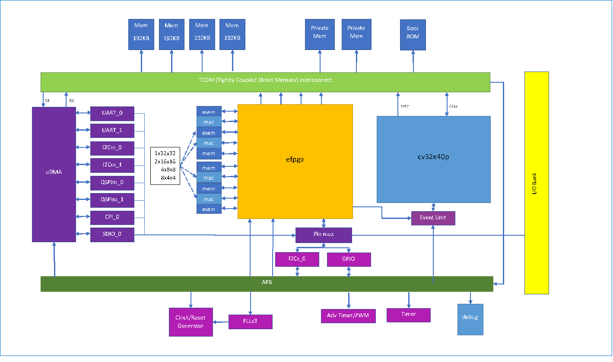

# CORE-V MCU Software Based Test Plan

## Purpose
The purpose of the core-v-mcu is to showcase the cv32e40p fully verified RISC-V core available from the Open Hardware Group.
The cv32e40p core is connected to a representative set of peripherals:

* 2xUART
* 2xI2C master
* 1xI2C slave
* 2xQSPI master
* 1xCAMERA
* 1xSDIO
* 4xPWM
* eFPGA with 4 math units

The system supports 512KB of SRAM and 3 PLLs.

### Goals of the Software Based Testplan
The goals of the Software Based Testplan are to:

  * Confirm that the entire address space is accessible by the core
    * All of the TCDM
    * All of the peripheral registers
    * All special registers
  * Confirm that gdb can:
    * halt and resume the core
    * can single step the core
    * access entire addressable memory space
      - memories
      - peripherals
      - CSRS
    * NOTE: for performance reasons, may use gdb for sampling test and another mechanism for exhaustive testing
  * Confirm that the interrupts work as expected:
    * All sources
    * Masking
  * Confirm that the timers work as expected:
    * TBD
  * Confirm that the clock trees & divisors work as expected:
    * Can set FLL to desired frequency
    * Clock tree enables work
    * Clock tree divisors work
  * uDMA
    * Covered by peripheral tests
  * Peripherals (details later in document)
    * UART
    * I2Cm
    * I2Cs
    * SPIm
    * QSPIm
    * CAMI
    * GPIO
    * PWM
  * EFPGA
    * TCMD
    * APB
    * Math blocks
    * IO
    * Configuration
    * Test mode
  * Confirm I/O control works as expected:
    * Peripherals can access I/O
    * GPIO can access all I/O
    * EFPGA can access all I/O
    * Mux select works properly
    * All IO configurations can be set properly
  * Test modes
    * Confirm JTAG can be set in scan mode
    * Confirm JTAG can be set in mem BIST mode
    * Confirm JTAG can be set in EFPGA test mode
  * Significant application
    * TfLu person detection application reading from HiMax camera and using eFPGA acceleration

 ### Detailed feature test plans
 
The detailed test plans for each major feature follow.

 