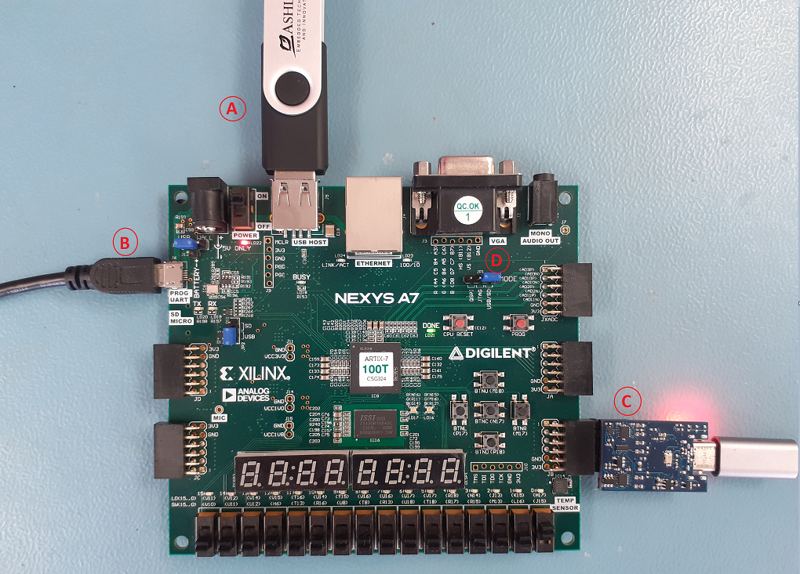
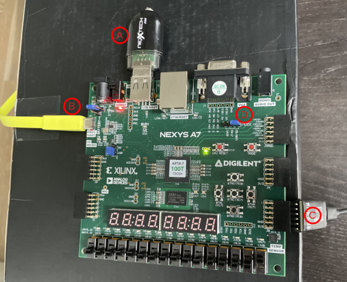

# CORE-V-MCU Quick Start Guide
The purpose of this Quick Start Guide (QSG) is to get you up and running quickly with the CORE-V-MCU on one of the various supported platforms.
After working through this document you should have a [cli_test](https://github.com/openhwgroup/core-v-mcu-cli-test)
running on the CORE-V-MCU on either an FPGA based emulation platform or in simulation using Verilator.
The emulation platform supports a simple "CLI monitor" interface over a console terminal and debug within the Eclipse IDE using OpenOCD over JTAG with the Digilent HS2 pmod adapter or the Ashling Opella-LD.

<!---
**Coming soon**: this QSG uses precompiled binaries available on the [OpenHW Group Downloads Page](http://downloads.openhwgroup.org/).
--->

The following assumes you are running on a Linux platform and has been tested under Ubuntu 20.04.

## Software Requirements:

### Python Modules
```
$ pip3 install pyserial
$ pip3 install pygame
```

### Terminal Emulator:
**Note**: you can use your favorite terminal emulator if you already have one.
The content of this QSG has been tested using **Minicom**.

Installation is trivial:
```
$ sudo apt install minicom
```
Minicom setup instructions can be found [here](https://help.ubuntu.com/community/Minicom).
The remainder of this document assumes you have attached Minicom to /dev/ttyUSB1 on your machine.

#### wls2 users

For Windows Linux Subsystem 2 (`wls2`) users, you need to run a few things before connecting USB devices to your wls2 distribution.
The instructions are provided [here](https://docs.microsoft.com/en-us/windows/wsl/connect-usb).

Once you execute in Windows PowerShell

```
$ usbipd wsl list
```
you will see something like:

```
C:\WINDOWS\system32>usbipd wsl list
BUSID  VID:PID    DEVICE                                                        STATE
2-1    30fa:0400  USB Input Device                                              Not attached
2-2    0408:5347  HP HD Camera, HP IR Camera                                    Not attached
2-4    0403:6010  USB Serial Converter A, USB Serial Converter B                Not attached
2-7    06cb:00f0  Synaptics FS7604 Touch Fingerprint Sensor with PurePrint(TM)  Not attached
2-10   8087:0026  Intel(R) Wireless Bluetooth(R)                                Not attached
```
In our example, Windows sees the Nexys A7-100T UART as **USB Serial Converter A, USB Serial Converter B**. Thus, when we refer to /dev/ttyUSB1,
we assume that when connecting the USB device to wls2 with the command, 

```
$ usbipd wsl attach --busid 2-4
```
You see the device attached in wls2 referred to as /dev/ttyUSB1. From now on, the wls2 users can use the same Linux procedures.


### Xilinx Vivado
Vivado is required if you plan to generate you own FPGA bitmaps or load them via the "shared UART/JTAG USB port" (see below).
If you will be using the pre-built bitmaps and loading them from a USB drive then you will not need Vivado.
The free-to-use Vivado WebPACK is sufficient for working with the Nexys A7 and can be downloaded from the Xilinx [here](https://www.xilinx.com/products/design-tools/vivado/vivado-ml.html).

### Eclipse IDE
The open-source Eclipse IDE supports CORE-V-MCU.

## Hardware Requirements:
- Digilent [Nexys A7-100T](https://digilent.com/shop/nexys-a7-fpga-trainer-board-recommended-for-ece-curriculum/) evaulation board.
- USB to MicroUSB cable (typically supplied with the Nexys board).
- [Digilent JTAG-H2](https://digilent.com/shop/jtag-hs2-programming-cable) Pmod.
- [Ashling Opella-LD](https://www.ashling.com/support-opella-ld/) (if not using Digilent HS2)
- [6-pin Header Gender Changer](https://digilent.com/shop/6-pin-header-gender-changer-5-pack).
- USB drive.

Optional hardware includes:
- [5V Power supply](https://digilent.com/shop/5v-2-5a-switching-power-supply/).  Note that the Nexys can typically be powered by the MicroUSB port.
- [NOR Flash](https://digilent.com/shop/pmod-sf3-32-mb-serial-nor-flash) Pmod.

## Emulating the CORE-V-MCU on the Nexys A7-100T

Throughout this section we will refer to the circled letters on the figure below:

### Nexys A7 - Ashling Opella-LD Connection

#### Connecting the Opella-LD to your PC and Target
The Ashling Opella-LD is designed to connect to your PC via the USB Port. Please note the following recommended target connection sequence
1. Ensure your target is powered off.
2. Connect Opella-LD to your PC using the USB cable and ensure Opella-LD’s PWR LED is on.
3. Connect Opella-LD to your target’s debug connector.
4. Power up your target.

#### For Windows users
- You will get a New USB hardware found message from Windows and will be prompted to install the appropriate USB drivers. The Ashling Opella-LD driver is located         in: Opella-LD\Opella-LD_Windows_Driver\ [Ashling Opella-LD Driver](https://www.ashling.com/wp-content/uploads/Opella-LD.zip).
- Point the Windows Hardware Installation Wizard to your download directory so that it can locate the necessary drivers and complete the installation. Windows           only needs to perform this operation the first time you connect your Opella-LD to the PC.
    
#### For Linux users
- To ensure the current $USER has access to the Opella-LD device we recommend using the Linux utility udev.
- Create a udev rules file to uniquely identify the Opella- LD device and set permissions as required by owner/ groups. An example udev file is provided:
        Opella-LD\ Opella-LD_Linux_Rules_File\ [60-ashling.rules](https://www.ashling.com/wp-content/uploads/Opella-LD.zip) which identifies Opella-LD device (by Ashling’s USB product ID and Vendor ID).
- The rules file must then be copied into the rules directory (requires root permission) e.g.: $ sudo cp ./60-ashling.rules /etc/udev/rules.d




- Connect Ashling Opella-LD to the bottom 6-pins of the JB connector. A 6- pin gender changer or flying leads can be used for this. Please make sure to match Vref of the Opella-LD and the JB connector. 

Note: The connector used and the pinout can change based on the FPGA design.

### Nexys A7 - Digilent HS2 Connection



Emulating the CORE-V-MCU on the Nexys A7-100T is a two step process:
1. Load the FPGA with a bitmap of the CORE-V-MCU.
2. Download the cli_test program into memory.

The bitmap file has a _.bit_ file extension and the cli_test is an "S record" file with an _.srec_ extension.
Currently an example bitmap and srec file can be found in this directory.
In the near future these will be made available on the [OpenHW Group Downloads Page](http://downloads.openhwgroup.org/).

### Nexys A7-100T Hardware Steup
You will need to refer to the [Nexys A7 Reference Manual](https://digilent.com/reference/programmable-logic/nexys-a7/reference-manual)
to complete all of the steps below.

In order to use the CORE-V-MCU on the Nexys A7, it is necessary to first download a _bitmap_ to configure the FPGA.
There are two techniques for this, see "Option 1" and "Option 2" below.

### Step 1, Option 1: Use a USB Drive to Load the BitMap:
Copy the FPGA bitmap from `emulation/quickstart/core_v_mcu_nexys.bit` to a USB drive.
This drive must be formated with a FAT32 filesystem and the bitmp should be the _only_ file on the drive.
Once this is done, getting the FPGA loaded with the bitmap is straightforward:
- Use the cable supplied with the Nexys A7 to connect the USB port configued as `dev/ttyUSB1` to the Nexys "shared UART/JTAG USB port" (**B**).
- Start you terminal emulator on /dev/ttyUSB1: `minicom usb1`
- Insert the USB drive in the on-board USB port (**A**).
- Configure the MODE straps (**D**) on the Nexys to load from USB (refer to the Reference Manual).
- Power on the Nexys board.

In a few moments the FPGA will enter a loop printing "A2 BOOTME" on the terminal.  Proceed to Step 2.

#### Putty

If you want to see the  "A2 BOOTME" string on Putty, connect it with Serial option, "COMX", where X is the number your Windows Device Manager refers to the Nexsys USB, and set as BaudRate 115200.


### Step 1, Option 2: Use Vivado to Push the BitMap to the Nexys A7:
This option requires installation the free-to-use WebTalk version of Vivado.
In this option, the "shared UART/JTAG USB port" on the upper left-hand side of the Board (**B**) is used for pushing _bitmap_ files to the FPGA.
This port connects to a USB port on your PC and uses the USB-to-MicroUSB cable that comes with the Nexys Board.
- Use the able supplied with the Nexys A7 to connect the USB port configued as `dev/ttyUSB1` to the Nexys "shared UART/JTAG USB port".
- Configure the MODE straps (**D**) on the Nexys Board to load from JTAG.

The following command loads the bitmap to the FPGA over the "shared UART/JTAG USB port".

```
$ make -C ../../  downloadn NEXYSA7_BITMAP=emulation/quickstart/core_v_mcu_nexys.bit
```

### Step 2: Download the compiled test-program "cli_test.srec"
If you got here from Step 1, Option 1, once the bitmap has been loaded into the FPGA, halt the terminal (CTRL-A, Z, X with minicom).

Use the supplied python script to download the "cli_test" program to the MCU:
```
$ python3 serialPort.py /dev/ttyUSB1 cli_test.srec
```
In case of errors like:

```
Traceback (most recent call last):
  File "serialPort.py", line 1, in <module>
    import serial
```

please try:

```
$ sudo apt install python3-serial
```

This takes a little while... Then:
```
$ minicom usb1
```

Hit "return" a few types to get the `[0]` prompt from cli_test.

## Running "cli_test" on minicom terminal:
Below is a few examples of commands available with cli_test:
```
[0] help             # list of commands
[0] help misc        # list of agruments for misc command
[0] misc             # jump to misc command handler
[1] help             # list arguments for current command handler (misc in thhis case)
[1] exit             # exit current command handler (misc in this case)
[0] misc simul 1 0   # full misc command: runs the 'simul' test.
```

### Understanding IO-muxing on CORE-V-MCU

| Nexys A7 Resource | XC7A100T IO | IONUM | MUX_SEL=0 | MUX_SEL=1 | MUX_SEL=2 | MUX_SEL=3 |
|-------------------|-------------|-------|-----------|-----------|-----------|-----------|
| LED[0]            | IO_11       | 11    | apbio_32  | apbio_47  | apbio_4   | fpgaio_4  |

### Toggle LED[0] on the Nexys-A7 board using cli_test
```
[0] io setmux 11 2   # Set mux-select for IO 11 to 2 (apbio_4 now drives IO_11).
[0] gpio mode 4 1    # Set 'mode' of GPIO 4 to 1.
                     # Somehow, you are supposed to know that GPIO 4 is apbio_4.
                     # Not sure what mode 1 is.
[0] gpio toggle 4    # Toggle state of GPIO 4.
[0] gpio toggle 4    # Toggle state of GPIO 4.
```
### Ashling Opella-LD Target Interface to Nexys A7 JB Connector

| Opella-LD pin        | Function           | Nexys A7 JB pin  |
| ------------- |:-------------:| -----:|
| 1 TMS      | JTAG Test Mode Select (TMSC in cJTAG modeor SWDIO in ARM SWD mode) | 7 |
| 2 TDI      | JTAG Test Data In      |   8 |
| 3 TDO | JTAG Test Data Out (SWO in ARM SWD mode)      |   9 |
| 4 CLK | JTAG/SWDCLK/cJTAG CLocK      |   10 |
| 5 GND | Ground      |   11 |
| 6 VREF | Target reference voltage used by the Opella-LD to sense target voltage (0.9v to 5.0v) and adjust probe voltages accordingly. TGT LED (YELLOW) is on when voltage detected      |  12 |
| 7 nTRST | Active low JTAG TAP ReSeT. Can be controlledvia	OpenOCD	software.	See http://openocd.org/doc/html/Reset- Configuration.html      |   No connect |	
| 8 nSRST | Active low System ReSeT. Can be controlled via OpenOCD	software.	See http://openocd.org/doc/html/Reset- Configuration.html      |   No connect |

## Eclipse IDE
The Eclipse IDE can be used to compile C programs for the CORE-V-MCU, load them into the CORE-V-MCU memory via JTAG and also provides a complete interactive debug/development environment.
Eclipse interacts with and controls the CORE-V-MCU via a JTAG port which on the Nexys-A7 is connected to header "JB", indicated by (**C**) on the figure above.
Connect your JTAG-HS2 pmod as shown.
The JTAG-HS2 pmod is not keyed, so check that the pmod is connected to the bottom row of the header and that VDD on the pmod matches VDD on the board.

**Note:** the JTAG port is not enabled unless SW0 (**E**) is in the "up" position.

Detailed instructions for using the Eclipse IDE with the CORE-V-MCU can be found in the [core-v-mcu-cli-test](https://github.com/openhwgroup/core-v-mcu-cli-test) repository.

## NOR flash

The [`core-v-mcu-cli_test`](https://github.com/openhwgroup/core-v-mcu-cli-test) suite can be used to program a NOR flash connected to the JXADC header.

Additional HW requirement
- USB2TTL adapter
- 3 jumper wires

The boot loader uses it to print a message and the SPI image is downloaded over that UART.

How-to:
- connect the USB2TTL to the PC
- connect USB2TTL.GND to JB.5
- connect USB2TTL.TX to JB.3
- connect USB2TTL.RX to JB.2
- connect the JTAG cable
- powerup the Nexys board
- download the `cli_test` program to the MCU as described above
- identify the ttyUSB port which is used to drive the USB2TTL - let's assume it is `/dev/ttyUSB0`
- python spi_load /dev/ttyUSB0
- start the `cli_test` program via he SDK
- on the `cli_test` terminal
    - `[0] > qspi`
    - `[1] qspi > init 0`
    - `[1] qspi > program 0 Default/cli.bin 0x0`
    (note that the name and path of your program could differ from Default/cli.bin)
    - you should see something like
        ```
        lQSPIMIdNum = 0x00
        Loading file:  = Default/cli.bin
        addr = 0x00000000
        Expecting 00019710 bytes
        Erasing. . .done
        1024/104208
        ...
        103424/104208
        Received Bytes 0x00019710
        ```
- swith SW1 towards the inside of the board
- press the `CPU reset` button

The MCU should now read the program from the flash.
