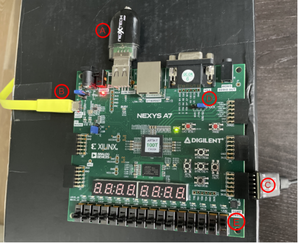

# CORE-V-MCU Quick Start Guide
The purpose of this Quick Start Guide (QSG) is to get you up and running quickly with the CORE-V-MCU on one of the various supported platforms.
After working through this document you should have a [cli_test](https://github.com/QuickLogic-Corp/core-v-mcu-cli-test)
running on the CORE-V-MCU on an FPGA based emulation platform.
The emulation platform supports either a simple "CLI monitor" interface over a console terminal or an Eclipse IDE over JTAG.

**Coming soon**: this QSG uses precompiled binaries available on the [OpenHW Group Downloads Page](http://downloads.openhwgroup.org/).

The following assumes you are running on a Linux platform and has been tested under Ubuntu 20.04.

## Software Requirements:

### Python Modules
```
$ pip3 install pyserial
$ pip3 install pygame
```

### Terminal Emulator:
**Note**: you can use your favorite terminal emulator if you already have one.
The content of this QSG has been tested using **Minicom**.

Installation is trivial:
```
$ apt install minicom
```
Minicom setup instructions can be found [here](https://help.ubuntu.com/community/Minicom).
The remainder of this document assumes you have attached Minicom to /dev/ttyUSB1 on your machine.

### Xilinx Vivado
Vivado is required if you plan to generate you own FPGA bitmaps or load them via the "shared UART/JTAG USB port" (see below).
If you will be using the pre-built bitmaps and loading them from a USB drive then you will not need Vivado.
The free-to-use Vivado WebPACK is sufficient for working with the Nexys A7 and can be downloaded from the Xilinx [here](https://www.xilinx.com/products/design-tools/vivado/vivado-ml.html).

### Eclipse IDE
The open-source Eclipse IDE supports CORE-V-MCU.

## Hardware Requirements:
- Digilent [Nexys A7-100T](https://digilent.com/shop/nexys-a7-fpga-trainer-board-recommended-for-ece-curriculum/) evaulation board.
- USB to MicroUSB cable (typically supplied with the Nexys board).
- [JTAG-H2](https://digilent.com/shop/jtag-hs2-programming-cable) Pmod.
- [6-pin Header Gender Changer](https://digilent.com/shop/6-pin-header-gender-changer-5-pack).
- USB drive.

Optional hardware includes:
- [5V Power supply](https://digilent.com/shop/5v-2-5a-switching-power-supply/).  Note that the Nexys can typically be powered by the MicroUSB port.
- [NOR Flash](https://digilent.com/shop/pmod-sf3-32-mb-serial-nor-flash) Pmod.

## Emulating the CORE-V-MCU on the Nexys A7-100T

Throughout this section we will refer to the circled letters on the figure below:



Emulating the CORE-V-MCU on the Nexys A7-100T is a two step process:
1. Load the FPGA with a bitmap of the CORE-V-MCU.
2. Download the cli_test program into memory.

The bitmap file has a _.bit_ file extension and the cli_test is an "S record" file with an _.srec_ extension.
Currently an example bitmap and srec file can be found in this directory.
In the near future these will be made available on the [OpenHW Group Downloads Page](http://downloads.openhwgroup.org/).

### Nexys A7-100T Hardware Steup
Refer to the [Nexys A7 Reference Manual](https://digilent.com/reference/programmable-logic/nexys-a7/reference-manual).
The "shared UART/JTAG USB port" on the upper left-hand side of the Board (**B**) is used either for pushing _bitmap_ files for the FPGA or as a CLI monitor.
This port connects to a USB port on your PC and using the USB-to-MicroUSB cable that comes with the Nexys Board.

In order to use the CORE-V-MCU on the Nexys A7, it is necessary to first download a _bitmap_ to configure the FPGA.
There are two techniques for this, see "Option 1" and "Option 2" below.

### Step 1, Option 1: Use a USB Drive to Load the BitMap:
Copy the FPGA bitmap from `emulation/quickstart/core_v_mcu_nexys.bit` to a USB drive.  This drive must be formated with a FAT32 filesystem and the bitmp should be the _only_ file on the drive.  Once this is done, getting the FPGA loaded with the bitmap is straightforward:
- Use the cable supplied with the Nexys A7 to connect the USB port configued as `dev/ttyUSB1` to the Nexys "shared UART/JTAG USB port".
- Start you terminal emulator on /dev/ttyUSB1: `minicom usb1`
- Insert the USB drive in the on-board USB port (**A**).
- Configure the MODE straps (**D**) on the Nexys to load from USB (refer to the Reference Manual).
- Power on the Nexys board.

In a few moments the FPGA will enter a loop printing "A2 BOOTME" on the terminal.  Proceed to Step 2.

### Step 1, Option 2: Use Vivado to Push the BitMap to the Nexys A7:
This option requires installation the free-to-use WebTalk version of Vivado.
- Use the able supplied with the Nexys A7 to connect the USB port configued as `dev/ttyUSB1` to the Nexys "shared UART/JTAG USB port".
- Configure the MODE straps (**D**) on the Nexys Board to load from JTAG.

The following command loads the bitmap to the FPGA over the "shared UART/JTAG USB port".

```
$ make -C ../../  downloadn NEXYSA7_BITMAP=emulation/quickstart/core_v_mcu_nexys.bit
```

### Step 2: Download the compiled test-program "cli_test.srec"
Once the bitmap has been loaded into the FPGA, halt the terminal (CTRL-A, Z, X with minicom) and use the supplied python script to download the "cli_test" program to the MCU:
```
$ python3 serialPort.py /dev/ttyUSB1 cli_test.srec
```
This stake a little while... Then:
```
$ minicom usb1
```

Hit "return" a few types to get the `[0]` prompt from cli_test.

## Running "cli_test" on minicom terminal:
Below is a few examples of commands available with cli_test:
```
[0] help             # list of commands
[0] help misc        # list of agruments for misc command
[0] misc             # jump to misc command handler
[1] help             # list arguments for current command handler (misc in thhis case)
[1] exit             # exit current command handler (misc in this case)
[0] misc simul 1 0   # full misc command: runs the 'simul' test.
```

### Understanding IO-muxing on CORE-V-MCU

| Nexys A7 Resource | XC7A100T IO | IONUM | MUX_SEL=0 | MUX_SEL=1 | MUX_SEL=2 | MUX_SEL=3 |
|-------------------|-------------|-------|-----------|-----------|-----------|-----------|
| LED[0]            | IO_11       | 11    | apbio_32  | apbio_47  | apbio_4   | fpgaio_4  |

### Toggle LED[0] on the Nexys-A7 board using cli_test
```
[0] io setmux 11 2   # Set mux-select for IO 11 to 2 (apbio_4 now drives IO_11).
[0] gpio mode 4 1    # Set 'mode' of GPIO 4 to 1.
                     # Somehow, you are supposed to know that GPIO 4 is apbio_4.
                     # Not sure what mode 1 is.
[0] gpio toggle 4    # Toggle state of GPIO 4.
[0] gpio toggle 4    # Toggle state of GPIO 4.
```

## Eclipse IDE
TODO
